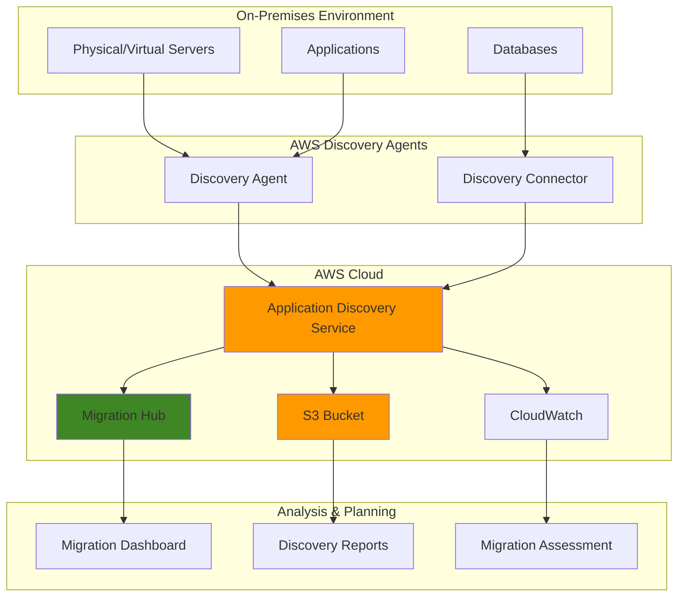

# Enterprise Migration Assessment and Planning

## Problem

Enterprise organizations planning cloud migrations struggle with incomplete visibility into their on-premises infrastructure dependencies, application relationships, and resource utilization patterns. Without comprehensive discovery data, migration planning becomes error-prone, leading to unexpected downtime, missed dependencies, and cost overruns that can derail entire digital transformation initiatives.

## Solution

AWS Application Discovery Service provides automated discovery and mapping of on-premises applications, servers, and network dependencies through lightweight agents and agentless discovery methods. Combined with AWS Migration Hub, this solution creates a centralized dashboard for tracking discovery progress, analyzing migration readiness, and planning phased migration strategies based on real infrastructure data.

## Architecture Diagram



## Prerequisites

1. AWS account with Administrator access or permissions for Application Discovery Service, Migration Hub, and S3
2. AWS CLI v2 installed and configured (or AWS CloudShell)
3. On-premises servers running Windows Server 2008 R2+ or Linux (RHEL 6+, CentOS 6+, Ubuntu 12+)
4. Network connectivity from on-premises to AWS (ports 443 HTTPS outbound)
5. Basic understanding of enterprise infrastructure discovery and migration planning
6. Estimated cost: $0.10-$0.50 per server per day for discovery (varies by data collection frequency)

## Preparation

```bash
# Set environment variables
export AWS_REGION=$(aws configure get region)
export AWS_ACCOUNT_ID=$(aws sts get-caller-identity \
    --query Account --output text)

# Generate unique identifiers for resources
RANDOM_SUFFIX=$(aws secretsmanager get-random-password \
    --exclude-punctuation --exclude-uppercase \
    --password-length 6 --require-each-included-type \
    --output text --query RandomPassword)

export MIGRATION_PROJECT_NAME="enterprise-migration-${RANDOM_SUFFIX}"
export S3_BUCKET_NAME="migration-discovery-${RANDOM_SUFFIX}"

# Create S3 bucket for discovery data export
aws s3 mb s3://${S3_BUCKET_NAME} --region ${AWS_REGION}

# Enable versioning for data integrity
aws s3api put-bucket-versioning \
    --bucket ${S3_BUCKET_NAME} \
    --versioning-configuration Status=Enabled

echo "✅ S3 bucket created for discovery data: ${S3_BUCKET_NAME}"
```

## Steps

1. **Enable Application Discovery Service**:

   Application Discovery Service serves as the central collection point for infrastructure data from your on-premises environment. Enabling this service activates the AWS infrastructure that will receive, process, and store discovery data from your deployed agents. This foundational step establishes the secure communication channel between your on-premises infrastructure and AWS discovery services, as detailed in the [AWS Application Discovery Service User Guide](https://docs.aws.amazon.com/application-discovery/latest/userguide/what-is-appdiscovery.html).

   ```bash
   # Enable Application Discovery Service
   aws discovery start-data-collection-by-agent-ids \
       --agent-ids []  # Empty array to enable service
   
   # Verify service is enabled
   aws discovery describe-configurations \
       --configuration-type SERVER
   
   echo "✅ Application Discovery Service enabled"
   ```

   The service is now active and ready to receive discovery data. This establishes the AWS-side infrastructure needed to collect, process, and analyze data from your on-premises environment, enabling comprehensive migration planning.

2. **Create Migration Hub Project**:

   Migration Hub provides a centralized dashboard for tracking discovery progress across multiple tools and migration waves. Creating a dedicated project organizes your discovery data and enables collaborative migration planning across teams. This centralized approach ensures all stakeholders have visibility into discovery progress and migration readiness, leveraging the capabilities described in the [AWS Migration Hub Dashboard](https://docs.aws.amazon.com/application-discovery/latest/userguide/dashboard.html).

   ```bash
   # Create Migration Hub home region (if not already set)
   aws migrationhub create-progress-update-stream \
       --progress-update-stream-name ${MIGRATION_PROJECT_NAME} \
       --region us-west-2  # Migration Hub home region
   
   # Associate Application Discovery Service with Migration Hub
   aws discovery put-resource-attributes \
       --migration-task-name ${MIGRATION_PROJECT_NAME} \
       --progress-update-stream ${MIGRATION_PROJECT_NAME}
   
   echo "✅ Migration Hub project created: ${MIGRATION_PROJECT_NAME}"
   ```

   Your migration project is now established in Migration Hub, providing a central location for tracking discovery progress and coordinating migration activities across your enterprise.

3. **Generate Discovery Agent Installation Package**:

   The Discovery Agent provides deep visibility into server performance, processes, and network connections by running as a lightweight service on each server. Generating a customized installation package ensures agents authenticate properly with your AWS account and begin collecting data immediately upon installation.

   ```bash
   # Generate agent installation URL
   AGENT_URL=$(aws discovery describe-export-tasks \
       --query 'exportsInfo[0].exportRequestId' \
       --output text 2>/dev/null || echo "new-deployment")
   
   # Create agent configuration
   cat > agent-config.json << EOF
   {
       "region": "${AWS_REGION}",
       "enableSSL": true,
       "collectionConfiguration": {
           "collectProcesses": true,
           "collectNetworkConnections": true,
           "collectPerformanceData": true
       }
   }
   EOF
   
   echo "✅ Agent configuration created"
   echo "Download agent from: https://aws-discovery-agent.s3.amazonaws.com/windows/latest/AWSApplicationDiscoveryAgentInstaller.exe"
   echo "Or for Linux: https://aws-discovery-agent.s3.amazonaws.com/linux/latest/aws-discovery-agent.tar.gz"
   ```

   The installation package is configured with your AWS credentials and collection preferences. Deploy this agent to representative servers across your infrastructure to begin comprehensive data collection.

4. **Configure Discovery Connector for VMware Environments**:

   Discovery Connector provides agentless discovery for VMware vSphere environments, collecting data through vCenter APIs without requiring individual server access. This approach is ideal for environments with strict change control processes or when agent installation is not feasible across all servers.

   ```bash
   # Download Discovery Connector OVA template
   echo "Discovery Connector OVA download:"
   echo "https://aws-discovery-connector.s3.amazonaws.com/VMware/latest/AWS-Discovery-Connector.ova"
   
   # Create connector configuration
   cat > connector-config.json << EOF
   {
       "connectorName": "enterprise-connector-${RANDOM_SUFFIX}",
       "awsRegion": "${AWS_REGION}",
       "vCenterDetails": {
           "hostname": "vcenter.example.com",
           "username": "discovery-user",
           "enableSSL": true
       },
       "dataCollectionPreferences": {
           "collectVMMetrics": true,
           "collectNetworkInfo": true,
           "collectPerformanceData": true
       }
   }
   EOF
   
   echo "✅ Discovery Connector configuration prepared"
   ```

   Deploy the Discovery Connector OVA to your VMware environment and configure it with the generated settings. This enables comprehensive discovery of your virtualized infrastructure without individual server modifications.

> **Warning**: Ensure proper vCenter permissions for the discovery user account. The account needs read-only access to virtual machines, hosts, and performance data.

5. **Start Data Collection and Monitoring**:

   Initiating data collection begins the discovery process that will gather infrastructure data over a recommended 2-week period. This duration captures usage patterns, peak loads, and application behaviors necessary for accurate migration planning and right-sizing decisions.

   ```bash
   # Start continuous data collection
   aws discovery start-continuous-export \
       --s3-bucket ${S3_BUCKET_NAME} \
       --s3-prefix "discovery-data/" \
       --data-source AGENT
   
   # Enable CloudWatch monitoring for discovery progress
   aws logs create-log-group \
       --log-group-name "/aws/discovery/${MIGRATION_PROJECT_NAME}"
   
   # Check discovery status
   aws discovery describe-agents \
       --query 'agentsInfo[*].[agentId,health,version,lastHealthPingTime]' \
       --output table
   
   echo "✅ Data collection started - monitor for 2+ weeks for comprehensive data"
   ```

   Data collection is now active and will continue gathering infrastructure metrics, application dependencies, and performance data. Monitor agent health regularly to ensure consistent data collection across your environment.

6. **Configure Discovery Data Export**:

   Exporting discovery data to S3 enables long-term storage, advanced analytics, and integration with third-party migration planning tools. Regular exports ensure data availability for detailed analysis and provide backup copies of your discovery information.

   ```bash
   # Export current discovery data
   EXPORT_ID=$(aws discovery start-export-task \
       --export-data-format CSV \
       --filters 'name=AgentId,values=*,condition=EQUALS' \
       --s3-bucket ${S3_BUCKET_NAME} \
       --s3-prefix "exports/" \
       --query 'exportId' --output text)
   
   # Monitor export progress
   aws discovery describe-export-tasks \
       --export-ids ${EXPORT_ID} \
       --query 'exportsInfo[0].exportStatus'
   
   # Schedule weekly exports using EventBridge
   aws events put-rule \
       --name "weekly-discovery-export" \
       --schedule-expression "rate(7 days)" \
       --state ENABLED
   
   echo "✅ Discovery data export configured with ID: ${EXPORT_ID}"
   ```

   Discovery data is now being exported to S3 for analysis and archival. Weekly automated exports ensure continuous availability of up-to-date infrastructure data for migration planning activities.

7. **Set Up Migration Wave Planning**:

   Migration waves organize servers and applications into logical groupings based on dependencies, business priorities, and technical complexity. This structured approach reduces migration risk by ensuring dependent systems migrate together and enables parallel migration streams to accelerate timeline delivery. This methodology follows [AWS migration best practices](https://docs.aws.amazon.com/prescriptive-guidance/latest/migration-tools/discovery.html) for systematic enterprise migrations.

   ```bash
   # Create migration wave configuration
   cat > migration-waves.json << EOF
   {
       "waves": [
           {
               "waveNumber": 1,
               "name": "Pilot Wave - Low Risk Applications",
               "description": "Standalone applications with minimal dependencies",
               "targetMigrationDate": "2024-Q2"
           },
           {
               "waveNumber": 2,
               "name": "Business Applications Wave",
               "description": "Core business applications with managed dependencies",
               "targetMigrationDate": "2024-Q3"
           },
           {
               "waveNumber": 3,
               "name": "Legacy Systems Wave",
               "description": "Complex legacy systems requiring refactoring",
               "targetMigrationDate": "2024-Q4"
           }
       ]
   }
   EOF
   
   # Upload wave planning to S3 for team collaboration
   aws s3 cp migration-waves.json \
       s3://${S3_BUCKET_NAME}/planning/migration-waves.json
   
   echo "✅ Migration wave planning framework created"
   ```

   The migration wave structure provides a framework for organizing your migration approach. Use discovery data to assign servers and applications to appropriate waves based on dependencies and business requirements.

> **Tip**: Start with a small pilot wave of 5-10 low-risk servers to validate your migration processes before moving to larger, more complex waves.

## Validation & Testing

1. **Verify Agent Health and Data Collection**:

   ```bash
   # Check agent status across all deployed agents
   aws discovery describe-agents \
       --query 'agentsInfo[*].[agentId,health,collectionStatus,lastHealthPingTime]' \
       --output table
   ```

   Expected output: All agents should show "HEALTHY" status with recent ping times (within last 15 minutes).

2. **Validate Discovery Data Quality**:

   ```bash
   # Review collected server data
   aws discovery list-configurations \
       --configuration-type SERVER \
       --query 'configurations[*].[configurationId,serverType,osName,osVersion]' \
       --output table
   
   # Check network connection data
   aws discovery list-configurations \
       --configuration-type NETWORK_CONNECTION \
       --max-results 10
   ```

   Expected output: Server listings with accurate OS information and network connection data showing application communication patterns.

3. **Test Data Export Functionality**:

   ```bash
   # Verify export completion
   aws discovery describe-export-tasks \
       --export-ids ${EXPORT_ID} \
       --query 'exportsInfo[0].[exportStatus,s3Bucket,recordsCount]'
   
   # List exported files in S3
   aws s3 ls s3://${S3_BUCKET_NAME}/exports/ --recursive
   ```

   Expected output: Export status "SUCCEEDED" with CSV files containing server, application, and network data.

4. **Validate Migration Hub Integration**:

   ```bash
   # Check Migration Hub dashboard data
   aws migrationhub list-migration-tasks \
       --progress-update-stream ${MIGRATION_PROJECT_NAME} \
       --region us-west-2
   ```

   Expected output: Migration tasks showing discovery progress and server counts.

## Cleanup

1. **Stop Data Collection**:

   ```bash
   # Stop continuous export
   aws discovery stop-continuous-export \
       --export-id ${EXPORT_ID}
   
   # Stop agent data collection
   aws discovery stop-data-collection-by-agent-ids \
       --agent-ids $(aws discovery describe-agents \
           --query 'agentsInfo[*].agentId' --output text)
   
   echo "✅ Data collection stopped"
   ```

2. **Remove Discovery Agents** (if desired):

   ```bash
   # Uninstall agents from servers (run on each server)
   echo "Windows: Run 'msiexec /x {APPLICATION-DISCOVERY-AGENT-GUID} /quiet'"
   echo "Linux: Run 'sudo /opt/aws/discovery/uninstall'"
   
   echo "✅ Agent removal instructions provided"
   ```

3. **Clean Up AWS Resources**:

   ```bash
   # Delete S3 bucket contents and bucket
   aws s3 rm s3://${S3_BUCKET_NAME} --recursive
   aws s3 rb s3://${S3_BUCKET_NAME}
   
   # Delete CloudWatch log group
   aws logs delete-log-group \
       --log-group-name "/aws/discovery/${MIGRATION_PROJECT_NAME}"
   
   # Remove EventBridge rule
   aws events delete-rule --name "weekly-discovery-export"
   
   echo "✅ AWS resources cleaned up"
   ```

## Discussion

AWS Application Discovery Service addresses the critical challenge of infrastructure visibility that enterprise organizations face when planning cloud migrations. The service provides two complementary discovery methods: lightweight agents for detailed server-level data collection and agentless connectors for VMware environments. This dual approach ensures comprehensive coverage across diverse infrastructure landscapes while accommodating different organizational policies regarding software installation.

The collected data enables data-driven migration decisions by revealing application dependencies, performance patterns, and resource utilization that are often undocumented in enterprise environments. Understanding these relationships is crucial for planning migration waves that minimize downtime and avoid breaking critical business processes. The integration with Migration Hub provides centralized visibility for migration managers and enables tracking progress across multiple migration tools and phases.

Security considerations are paramount in enterprise environments, and Application Discovery Service addresses these through encrypted data transmission, IAM-based access controls, and the ability to configure data retention policies. The service collects metadata about applications and infrastructure without accessing actual business data, maintaining security boundaries while providing necessary migration planning information. Organizations can also configure data collection scope to exclude sensitive systems or limit the types of data collected based on compliance requirements.

Cost optimization opportunities emerge from the detailed utilization data collected during the discovery period. Organizations frequently discover over-provisioned servers, unused applications, and opportunities for workload consolidation that can significantly reduce migration scope and ongoing cloud costs. The performance data also enables accurate right-sizing decisions, ensuring migrated workloads run efficiently in the cloud without over-provisioning resources. This aligns with AWS [Cost Optimization best practices](https://docs.aws.amazon.com/wellarchitected/latest/cost-optimization-pillar/welcome.html) and [right-sizing guidance](https://docs.aws.amazon.com/cost-management/latest/userguide/ce-rightsizing.html) for migration planning.

> **Note**: For comprehensive discovery, maintain data collection for at least two weeks to capture weekly usage patterns and periodic workloads. See [AWS Application Discovery Service User Guide](https://docs.aws.amazon.com/application-discovery/latest/userguide/) for detailed configuration options.

## Challenge

Extend this solution by implementing these enhancements:

1. **Automated Migration Readiness Assessment**: Develop Lambda functions that analyze discovery data to automatically score applications for cloud readiness and recommend appropriate migration strategies (rehost, replatform, refactor).

2. **Cost Estimation Integration**: Connect discovery data with AWS Pricing APIs to generate detailed cost estimates for different migration scenarios and EC2 instance types based on actual utilization patterns.

3. **Dependency Mapping Visualization**: Create a web-based dashboard using Amazon QuickSight that visualizes application dependencies and helps identify migration wave boundaries based on communication patterns.

4. **Automated Compliance Reporting**: Build compliance reports that map discovered applications to regulatory requirements and identify any compliance gaps that need addressing during migration.

5. **Integration with Infrastructure as Code**: Develop automation that translates discovery data into Terraform or CloudFormation templates for rapid environment provisioning in AWS.

## Infrastructure Code

*Infrastructure code will be generated after recipe approval.*