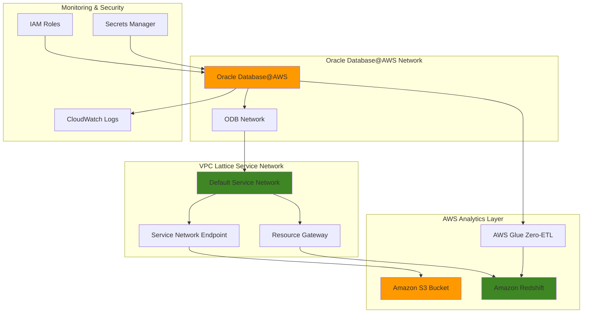

# Enterprise Oracle Database Connectivity with VPC Lattice and S3

## Problem

Enterprise organizations running Oracle databases often struggle with secure cross-network connectivity to AWS services for backup, analytics, and data integration workflows. Traditional networking approaches require complex VPN configurations, security group management, and custom ETL pipelines that increase operational overhead and security risks while limiting real-time analytics capabilities.

## Solution

Implement managed integrations between Oracle Database@AWS and AWS services using VPC Lattice resource gateways for secure cross-network connectivity, automated S3 backup, and Zero-ETL analytics with Redshift. This approach leverages AWS managed networking to eliminate complex configuration while providing enterprise-grade security and real-time data synchronization.

## Architecture Diagram



## Prerequisites

1. AWS account with Oracle Database@AWS and VPC Lattice permissions
2. AWS CLI v2 installed and configured (or AWS CloudShell)
3. Oracle Database@AWS network already created and running
4. Basic understanding of Oracle database administration and AWS networking
5. Estimated cost: $50-200/month for testing resources (Oracle Database@AWS, Redshift cluster, S3 storage)

> **Note**: Oracle Database@AWS is available in select AWS regions. Verify regional availability before proceeding.

## Preparation

```bash
# Set environment variables
export AWS_REGION=$(aws configure get region)
export AWS_ACCOUNT_ID=$(aws sts get-caller-identity \
    --query Account --output text)

# Generate unique identifiers for resources
RANDOM_SUFFIX=$(aws secretsmanager get-random-password \
    --exclude-punctuation --exclude-uppercase \
    --password-length 6 --require-each-included-type \
    --output text --query RandomPassword)

# Set resource names
export ODB_NETWORK_NAME="enterprise-odb-${RANDOM_SUFFIX}"
export S3_BUCKET_NAME="oracle-enterprise-backup-${RANDOM_SUFFIX}"
export REDSHIFT_CLUSTER_ID="oracle-analytics-${RANDOM_SUFFIX}"
export INTEGRATION_NAME="oracle-zero-etl-${RANDOM_SUFFIX}"

# Get existing ODB network ID if you have one
export ODB_NETWORK_ID=$(aws odb list-odb-networks \
    --query 'OdbNetworks[0].OdbNetworkId' --output text)

echo "✅ Environment configured for Oracle Database@AWS integration"
echo "ODB Network ID: ${ODB_NETWORK_ID}"
echo "Region: ${AWS_REGION}"
```

## Steps

1. **Enable S3 Access for Oracle Database@AWS Network**:

   VPC Lattice provides managed integration between Oracle Database@AWS and Amazon S3 through resource gateways and service network endpoints. This configuration enables secure, private connectivity without exposing traffic to the public internet while supporting both automated Oracle backups and custom data export workflows.

   ```bash
   # Enable direct S3 access for the ODB network
   aws odb update-odb-network \
       --odb-network-id ${ODB_NETWORK_ID} \
       --s3-access ENABLED
   
   # Wait for the update to complete
   aws odb get-odb-network \
       --odb-network-id ${ODB_NETWORK_ID} \
       --query 'S3Access.Status' --output text
   
   echo "✅ S3 access enabled for Oracle Database@AWS"
   ```

   The ODB network now has secure connectivity to Amazon S3 through VPC Lattice managed integration. This eliminates the need for internet gateways or NAT devices while providing enterprise-grade security through AWS IAM and VPC Lattice access policies.

2. **Create S3 Bucket for Oracle Database Backups**:

   Amazon S3 provides highly durable object storage with 99.999999999% (11 9's) durability, making it ideal for enterprise database backups. The bucket configuration includes versioning and encryption to meet enterprise data protection requirements while supporting Oracle's automated backup workflows.

   ```bash
   # Create S3 bucket for Oracle backups
   aws s3 mb s3://${S3_BUCKET_NAME} --region ${AWS_REGION}
   
   # Enable versioning for backup protection
   aws s3api put-bucket-versioning \
       --bucket ${S3_BUCKET_NAME} \
       --versioning-configuration Status=Enabled
   
   # Enable server-side encryption
   aws s3api put-bucket-encryption \
       --bucket ${S3_BUCKET_NAME} \
       --server-side-encryption-configuration \
       'Rules=[{ApplyServerSideEncryptionByDefault:{SSEAlgorithm:AES256}}]'
   
   # Set lifecycle policy for cost optimization
   cat > lifecycle-policy.json << EOF
   {
       "Rules": [
           {
               "ID": "OracleBackupLifecycle",
               "Status": "Enabled",
               "Transitions": [
                   {
                       "Days": 30,
                       "StorageClass": "STANDARD_IA"
                   },
                   {
                       "Days": 90,
                       "StorageClass": "GLACIER"
                   }
               ]
           }
       ]
   }
   EOF
   
   aws s3api put-bucket-lifecycle-configuration \
       --bucket ${S3_BUCKET_NAME} \
       --lifecycle-configuration file://lifecycle-policy.json
   
   echo "✅ S3 bucket configured with enterprise features"
   ```

   The S3 bucket is now ready to receive Oracle database backups with automatic cost optimization through intelligent tiering. The lifecycle policy automatically transitions older backups to more cost-effective storage classes while maintaining immediate access to recent backups.

3. **Verify VPC Lattice Service Network Resources**:

   VPC Lattice automatically provisions service network resources when Oracle Database@AWS is configured. These include the default service network, resource gateway, and service network endpoint that enable secure connectivity to AWS services without complex networking configuration.

   ```bash
   # List VPC Lattice service networks
   LATTICE_SERVICE_NETWORKS=$(aws vpc-lattice \
       list-service-networks \
       --query 'Items[?contains(Name, `default-odb-network`)].\
       {Name:Name,Id:Id}' --output table)
   
   echo "VPC Lattice Service Networks:"
   echo "${LATTICE_SERVICE_NETWORKS}"
   
   # Get the default ODB service network ID
   export SERVICE_NETWORK_ID=$(aws vpc-lattice \
       list-service-networks \
       --query 'Items[?contains(Name, `default-odb-network`)].Id' \
       --output text)
   
   # List resource associations for the ODB network
   aws vpc-lattice list-service-network-resource-associations \
       --service-network-identifier ${SERVICE_NETWORK_ID} \
       --query 'Items[].{ResourceArn:ResourceArn,Status:Status}' \
       --output table
   
   echo "✅ VPC Lattice resources verified for Oracle Database@AWS"
   ```

   The service network and resource gateway provide the foundation for secure, managed connectivity between Oracle Database@AWS and AWS analytics services. This architecture eliminates the need for complex VPC peering or transit gateway configurations.

4. **Create Amazon Redshift Cluster for Analytics**:

   Amazon Redshift provides petabyte-scale data warehousing optimized for analytics workloads. The cluster configuration includes encryption, automated backups, and monitoring to support enterprise analytics requirements while enabling Zero-ETL integration with Oracle Database@AWS.

   ```bash
   # Create IAM role for Redshift cluster
   cat > redshift-trust-policy.json << EOF
   {
       "Version": "2012-10-17",
       "Statement": [
           {
               "Effect": "Allow",
               "Principal": {
                   "Service": "redshift.amazonaws.com"
               },
               "Action": "sts:AssumeRole"
           }
       ]
   }
   EOF
   
   aws iam create-role \
       --role-name RedshiftOracleRole-${RANDOM_SUFFIX} \
       --assume-role-policy-document file://redshift-trust-policy.json
   
   # Attach necessary policies for Redshift
   aws iam attach-role-policy \
       --role-name RedshiftOracleRole-${RANDOM_SUFFIX} \
       --policy-arn arn:aws:iam::aws:policy/AmazonS3ReadOnlyAccess
   
   aws iam attach-role-policy \
       --role-name RedshiftOracleRole-${RANDOM_SUFFIX} \
       --policy-arn arn:aws:iam::aws:policy/AmazonRedshiftAllCommandsFullAccess
   
   # Get IAM role ARN
   export REDSHIFT_ROLE_ARN=$(aws iam get-role \
       --role-name RedshiftOracleRole-${RANDOM_SUFFIX} \
       --query 'Role.Arn' --output text)
   
   # Create Redshift cluster
   aws redshift create-cluster \
       --cluster-identifier ${REDSHIFT_CLUSTER_ID} \
       --node-type dc2.large \
       --master-username oracleadmin \
       --master-user-password OracleAnalytics123! \
       --db-name oracleanalytics \
       --cluster-type single-node \
       --iam-roles ${REDSHIFT_ROLE_ARN} \
       --encrypted \
       --port 5439
   
   echo "✅ Redshift cluster creation initiated"
   ```

   The Redshift cluster provides the target environment for Oracle data analytics with built-in security features including encryption at rest and in transit. The cluster will serve as the destination for Zero-ETL data synchronization from Oracle Database@AWS.

5. **Enable Zero-ETL Access for ODB Network**:

   Zero-ETL integration eliminates the need for custom ETL pipelines by automatically synchronizing Oracle data with Amazon Redshift in real-time. This managed service uses change data capture (CDC) to replicate database changes with minimal latency while maintaining data consistency.

   ```bash
   # Enable Zero-ETL access for the ODB network
   aws odb update-odb-network \
       --odb-network-id ${ODB_NETWORK_ID} \
       --zero-etl-access ENABLED
   
   # Wait for Redshift cluster to be available
   echo "Waiting for Redshift cluster to be available..."
   aws redshift wait cluster-available \
       --cluster-identifier ${REDSHIFT_CLUSTER_ID}
   
   # Get Redshift cluster endpoint
   export REDSHIFT_ENDPOINT=$(aws redshift describe-clusters \
       --cluster-identifier ${REDSHIFT_CLUSTER_ID} \
       --query 'Clusters[0].Endpoint.Address' --output text)
   
   echo "✅ Zero-ETL access enabled for ODB network"
   echo "Redshift endpoint: ${REDSHIFT_ENDPOINT}"
   ```

   The Zero-ETL integration infrastructure is now configured to automatically replicate Oracle database changes to Amazon Redshift. This enables real-time analytics on Oracle data without the complexity of traditional ETL pipeline development and maintenance.

6. **Configure S3 Access Policy for Oracle Database**:

   Implementing least-privilege access ensures that Oracle Database@AWS can only access the specific S3 resources needed for backup and data export operations. The policy restricts access to the designated backup bucket while enabling necessary operations for database administration.

   ```bash
   # Create S3 access policy for Oracle Database
   cat > s3-oracle-policy.json << EOF
   {
       "Version": "2012-10-17",
       "Statement": [
           {
               "Effect": "Allow",
               "Action": [
                   "s3:GetObject",
                   "s3:PutObject",
                   "s3:DeleteObject",
                   "s3:ListBucket"
               ],
               "Resource": [
                   "arn:aws:s3:::${S3_BUCKET_NAME}",
                   "arn:aws:s3:::${S3_BUCKET_NAME}/*"
               ]
           }
       ]
   }
   EOF
   
   # Apply S3 policy to ODB network
   aws odb update-odb-network \
       --odb-network-id ${ODB_NETWORK_ID} \
       --s3-policy-document file://s3-oracle-policy.json
   
   echo "✅ S3 access policy configured for Oracle Database"
   ```

   The Oracle Database@AWS network now has secure, policy-controlled access to the designated S3 bucket. This configuration follows security best practices by implementing least-privilege access while enabling necessary backup and data export functionality.

7. **Configure CloudWatch Monitoring**:

   Comprehensive monitoring enables proactive management of the Oracle Database@AWS infrastructure and its AWS service integrations. CloudWatch metrics and logs provide visibility into database performance, backup operations, and data synchronization status.

   ```bash
   # Create CloudWatch log group for Oracle operations
   aws logs create-log-group \
       --log-group-name /aws/oracle-database/${ODB_NETWORK_ID}
   
   # Create CloudWatch dashboard for monitoring
   cat > dashboard-config.json << EOF
   {
       "widgets": [
           {
               "type": "metric",
               "properties": {
                   "metrics": [
                       ["AWS/VPCLattice", "ProcessedBytes", \
                        "ServiceNetwork", "${SERVICE_NETWORK_ID}"],
                       ["AWS/S3", "BucketRequests", \
                        "BucketName", "${S3_BUCKET_NAME}"],
                       ["AWS/Redshift", "CPUUtilization", \
                        "ClusterIdentifier", "${REDSHIFT_CLUSTER_ID}"]
                   ],
                   "period": 300,
                   "stat": "Average",
                   "region": "${AWS_REGION}",
                   "title": "Oracle Database@AWS Integration Metrics"
               }
           }
       ]
   }
   EOF
   
   aws cloudwatch put-dashboard \
       --dashboard-name "OracleAWSIntegration-${RANDOM_SUFFIX}" \
       --dashboard-body file://dashboard-config.json
   
   echo "✅ CloudWatch monitoring configured"
   ```

   The monitoring infrastructure provides real-time visibility into the Oracle Database@AWS ecosystem performance and health. The dashboard enables proactive identification of issues and optimization opportunities across the integrated AWS services.

## Validation & Testing

1. **Verify S3 Connectivity from Oracle Database**:

   ```bash
   # Check S3 access status for ODB network
   aws odb get-odb-network \
       --odb-network-id ${ODB_NETWORK_ID} \
       --query 'S3Access.{Status:Status,PolicyDocument:PolicyDocument}' \
       --output table
   
   # Test S3 bucket accessibility
   aws s3 ls s3://${S3_BUCKET_NAME}
   ```

   Expected output: S3 access status should show "Enabled" and bucket listing should succeed.

2. **Verify VPC Lattice Service Network Configuration**:

   ```bash
   # Check service network resource associations
   aws vpc-lattice list-service-network-resource-associations \
       --service-network-identifier ${SERVICE_NETWORK_ID} \
       --query 'Items[].{Resource:ResourceArn,Status:Status}' \
       --output table
   
   # Verify resource gateway configuration
   aws vpc-lattice list-resource-gateways \
       --query 'Items[?contains(Name, `default-odb-network`)].\
       {Name:Name,Status:Status}' --output table
   ```

   Expected output: Resource associations should show "ACTIVE" status for S3 and Zero-ETL integrations.

3. **Test Redshift Cluster Connectivity**:

   ```bash
   # Verify Redshift cluster status
   aws redshift describe-clusters \
       --cluster-identifier ${REDSHIFT_CLUSTER_ID} \
       --query 'Clusters[0].{Status:ClusterStatus,\
       Endpoint:Endpoint.Address}' --output table
   
   # Check Zero-ETL access status
   aws odb get-odb-network \
       --odb-network-id ${ODB_NETWORK_ID} \
       --query 'ZeroEtlAccess.Status' --output text
   ```

   Expected output: Cluster status should be "available" and Zero-ETL access should be "Enabled".

4. **Validate CloudWatch Monitoring**:

   ```bash
   # Check CloudWatch dashboard
   aws cloudwatch list-dashboards \
       --dashboard-name-prefix "OracleAWSIntegration" \
       --query 'DashboardEntries[].DashboardName' \
       --output table
   
   # Verify log group creation
   aws logs describe-log-groups \
       --log-group-name-prefix "/aws/oracle-database" \
       --query 'logGroups[].logGroupName' \
       --output table
   ```

   Expected output: Dashboard and log groups should be successfully created and accessible.

## Cleanup

1. **Disable Zero-ETL and S3 Access**:

   ```bash
   # Disable Zero-ETL access for ODB network
   aws odb update-odb-network \
       --odb-network-id ${ODB_NETWORK_ID} \
       --zero-etl-access DISABLED
   
   # Disable S3 access for ODB network
   aws odb update-odb-network \
       --odb-network-id ${ODB_NETWORK_ID} \
       --s3-access DISABLED
   
   echo "✅ ODB network integrations disabled"
   ```

2. **Delete Redshift Cluster**:

   ```bash
   # Delete Redshift cluster (skip final snapshot for testing)
   aws redshift delete-cluster \
       --cluster-identifier ${REDSHIFT_CLUSTER_ID} \
       --skip-final-cluster-snapshot
   
   # Delete IAM role
   aws iam detach-role-policy \
       --role-name RedshiftOracleRole-${RANDOM_SUFFIX} \
       --policy-arn arn:aws:iam::aws:policy/AmazonS3ReadOnlyAccess
   
   aws iam detach-role-policy \
       --role-name RedshiftOracleRole-${RANDOM_SUFFIX} \
       --policy-arn \
       arn:aws:iam::aws:policy/AmazonRedshiftAllCommandsFullAccess
   
   aws iam delete-role \
       --role-name RedshiftOracleRole-${RANDOM_SUFFIX}
   
   echo "✅ Redshift cluster and IAM role deleted"
   ```

3. **Remove S3 Bucket and Contents**:

   ```bash
   # Remove all objects from S3 bucket
   aws s3 rm s3://${S3_BUCKET_NAME} --recursive
   
   # Delete S3 bucket
   aws s3 rb s3://${S3_BUCKET_NAME}
   
   echo "✅ S3 bucket and contents removed"
   ```

4. **Clean Up Monitoring Resources**:

   ```bash
   # Delete CloudWatch dashboard
   aws cloudwatch delete-dashboards \
       --dashboard-names "OracleAWSIntegration-${RANDOM_SUFFIX}"
   
   # Delete CloudWatch log group
   aws logs delete-log-group \
       --log-group-name /aws/oracle-database/${ODB_NETWORK_ID}
   
   # Clean up local files
   rm -f lifecycle-policy.json s3-oracle-policy.json \
         redshift-trust-policy.json dashboard-config.json
   
   echo "✅ Monitoring resources and local files cleaned up"
   ```

## Discussion

This recipe demonstrates AWS managed networking capabilities through VPC Lattice and Oracle Database@AWS integration, providing enterprise-grade connectivity without complex network configuration. VPC Lattice acts as an application networking service that automatically provisions secure pathways between Oracle databases and AWS analytics services, eliminating the need for VPC peering, transit gateways, or internet-based connectivity. The resource gateway pattern enables Oracle Database@AWS to securely access AWS services while maintaining network isolation and implementing fine-grained access controls through IAM policies.

The Zero-ETL integration represents a significant advancement in data integration architecture, automatically replicating Oracle database changes to Amazon Redshift using change data capture (CDC) technology. Unlike traditional ETL approaches that require custom Glue jobs or Lambda functions, Zero-ETL provides a managed service that handles the complexity of continuous data synchronization. This approach eliminates the operational overhead of maintaining custom ETL pipelines while providing near real-time data synchronization for analytics workloads, enabling organizations to derive insights from Oracle data within minutes of transaction completion.

Security considerations follow AWS Well-Architected Framework principles, including encryption at rest and in transit for all data flows, least-privilege IAM access policies, and AWS Secrets Manager integration for credential management. The VPC Lattice service network provides secure connectivity without exposing traffic to the public internet, while S3 bucket policies and encryption ensure data protection throughout the backup and analytics workflows. CloudWatch monitoring enables proactive management with comprehensive metrics and logging across all integrated services, supporting both operational excellence and security monitoring requirements.

Cost optimization features include S3 intelligent tiering for backup storage, Redshift pause/resume capabilities for development environments, and VPC Lattice's pay-per-use pricing model that eliminates fixed networking costs. The architecture scales automatically based on demand, providing cost-effective analytics capabilities that grow with business requirements while maintaining predictable pricing through lifecycle policies and automated resource management.

> **Tip**: Use AWS Config to monitor VPC Lattice resource configurations and ensure compliance with organizational networking policies throughout the Oracle Database@AWS lifecycle.

**Sources:**
- [VPC Lattice for Oracle Database@AWS](https://docs.aws.amazon.com/vpc-lattice/latest/ug/vpc-lattice-oci.html)
- [Zero-ETL integration with Amazon Redshift](https://docs.aws.amazon.com/odb/latest/UserGuide/zero-etl-integration.html)
- [Oracle Database@AWS integration with Amazon S3](https://docs.aws.amazon.com/odb/latest/UserGuide/s3-managed-backups.html)
- [AWS service integrations for Oracle Database@AWS](https://docs.aws.amazon.com/odb/latest/UserGuide/service-integrations.html)
- [Amazon VPC Lattice User Guide](https://docs.aws.amazon.com/vpc-lattice/latest/ug/what-is-vpc-lattice.html)

## Challenge

Extend this solution by implementing these enhancements:

1. **Multi-Region Disaster Recovery**: Configure cross-region Oracle Database@AWS replication with automated S3 backup synchronization and Redshift disaster recovery clusters using AWS Backup and cross-region resource sharing.

2. **Advanced Analytics Pipeline**: Implement real-time streaming analytics using Amazon Kinesis Data Streams to capture Oracle Database@AWS changes, Amazon EMR for complex data transformations, and Amazon QuickSight for executive dashboards with ML-powered insights.

3. **Automated Compliance Monitoring**: Deploy AWS Config rules to monitor Oracle Database@AWS configurations, implement AWS Security Hub for compliance reporting, and create Lambda functions for automated remediation of security findings.

4. **Performance Optimization Framework**: Configure Amazon DevOps Guru for Oracle Database@AWS performance analysis, implement CloudWatch Insights for advanced log analytics, and create automated scaling policies for Redshift based on query patterns and data volume.

5. **Enterprise Data Governance**: Integrate AWS Lake Formation for fine-grained access control, implement AWS DataZone for data cataloging and discovery, and configure AWS Macie for sensitive data classification across S3 backup repositories.

## Infrastructure Code

*Infrastructure code will be generated after recipe approval.*