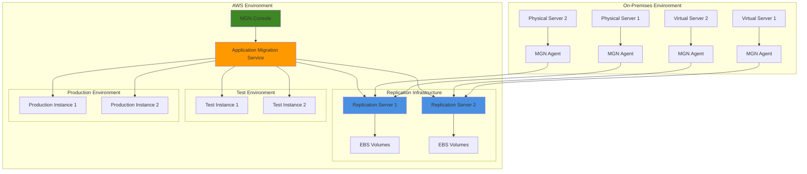

# Enterprise Server Migration with Application Migration Service

## Problem

Organizations operating large-scale on-premises infrastructure face significant challenges when planning cloud migrations. Managing hundreds or thousands of physical and virtual servers requires coordinated replication, minimal downtime cutover windows, and the ability to test workloads before production deployment. Traditional migration approaches often result in extended downtime, application compatibility issues, and complex rollback procedures that can severely impact business operations and customer experience.

## Solution

AWS Application Migration Service (MGN) provides a highly automated lift-and-shift solution that simplifies large-scale server migrations through block-level replication and automated conversion. The service continuously replicates source servers to AWS, maintains synchronized data copies, and enables testing of migrated workloads before final cutover. This approach reduces migration risk, minimizes downtime to minutes rather than hours, and provides the flexibility to migrate servers individually or in coordinated waves.

## Architecture Diagram



## Prerequisites

1. AWS account with appropriate IAM permissions for Application Migration Service
2. AWS CLI v2.13.0 or later installed and configured
3. On-premises servers with supported operating systems (Windows Server 2008 R2+, Linux distributions)
4. Network connectivity from source servers to AWS (443/TCP outbound)
5. Estimated cost: $50-200/month per server during migration (depends on server size and replication duration)

## Preparation

```bash
# Set environment variables
export AWS_REGION=$(aws configure get region)
export AWS_ACCOUNT_ID=$(aws sts get-caller-identity \
    --query Account --output text)

# Generate unique identifiers for resources
RANDOM_SUFFIX=$(aws secretsmanager get-random-password \
    --exclude-punctuation --exclude-uppercase \
    --password-length 6 --require-each-included-type \
    --output text --query RandomPassword)

export MGN_SERVICE_ROLE_NAME="MGNServiceRole-${RANDOM_SUFFIX}"
export MGN_REPLICATION_SETTINGS_TEMPLATE="MGNReplicationTemplate-${RANDOM_SUFFIX}"
export MGN_LAUNCH_TEMPLATE="MGNLaunchTemplate-${RANDOM_SUFFIX}"

# Create IAM service role for MGN
aws iam create-role \
    --role-name $MGN_SERVICE_ROLE_NAME \
    --assume-role-policy-document '{
        "Version": "2012-10-17",
        "Statement": [
            {
                "Effect": "Allow",
                "Principal": {
                    "Service": "mgn.amazonaws.com"
                },
                "Action": "sts:AssumeRole"
            }
        ]
    }'

# Attach managed policy to service role
aws iam attach-role-policy \
    --role-name $MGN_SERVICE_ROLE_NAME \
    --policy-arn arn:aws:iam::aws:policy/AWSApplicationMigrationServiceRolePolicy

echo "✅ Created IAM service role: $MGN_SERVICE_ROLE_NAME"
```

## Steps

1. **Initialize AWS Application Migration Service**:

   AWS Application Migration Service must be initialized in each region before use. This one-time setup creates the necessary service infrastructure and IAM roles required for replication and migration operations.

   ```bash
   # Initialize MGN service in the region
   aws mgn initialize-service \
       --region $AWS_REGION
   
   # Verify initialization status
   aws mgn get-launch-configuration \
       --source-server-id "initialization-check" \
       --region $AWS_REGION 2>/dev/null || echo "MGN service initialized"
   
   echo "✅ MGN service initialized in region: $AWS_REGION"
   ```

   > **Note**: MGN initialization can take several minutes to complete. This process creates the necessary VPC resources and security groups for replication infrastructure. You only need to initialize the service once per AWS region.

2. **Configure Default Replication Settings**:

   Replication settings define how MGN will copy your source servers to AWS. These templates establish the infrastructure configuration for replication servers, storage types, and network routing. Proper configuration ensures optimal performance during the initial replication phase and ongoing synchronization.

   ```bash
   # Create replication configuration template
   aws mgn put-template \
       --template-id $MGN_REPLICATION_SETTINGS_TEMPLATE \
       --replication-configuration-template '{
           "associateDefaultSecurityGroup": true,
           "bandwidthThrottling": 0,
           "createPublicIP": false,
           "dataPlaneRouting": "PRIVATE_IP",
           "defaultLargeStagingDiskType": "GP3",
           "ebsEncryption": "DEFAULT",
           "replicationServerInstanceType": "t3.small",
           "replicationServersSecurityGroupsIDs": [],
           "stagingAreaSubnetId": "",
           "stagingAreaTags": {
               "Environment": "Migration",
               "Purpose": "MGN-Staging"
           },
           "useDedicatedReplicationServer": false
       }'
   
   echo "✅ Created replication configuration template"
   ```

   The replication template is now configured with GP3 storage for optimal performance and cost efficiency. This configuration uses private IP routing for enhanced security and enables automated tagging for resource management and cost allocation.

3. **Install MGN Agent on Source Servers**:

   The MGN agent performs block-level replication of source servers to AWS. The agent must be installed with appropriate AWS credentials and requires network connectivity to AWS endpoints on port 443.

   ```bash
   # Download agent installation script for Linux
   curl -o aws-replication-installer-init.py \
       https://aws-application-migration-service-${AWS_REGION}.s3.${AWS_REGION}.amazonaws.com/latest/linux/aws-replication-installer-init.py
   
   # For Windows, download the installer
   # https://aws-application-migration-service-${AWS_REGION}.s3.${AWS_REGION}.amazonaws.com/latest/windows/AwsReplicationWindowsInstaller.exe
   
   # Create installation script for multiple servers
   cat > install-mgn-agent.sh << 'EOF'
   #!/bin/bash
   
   # Install MGN agent on Linux servers
   # This script should be run on each source server
   
   AWS_REGION=$1
   ACCESS_KEY=$2
   SECRET_KEY=$3
   
   # Install agent
   sudo python3 aws-replication-installer-init.py \
       --region $AWS_REGION \
       --aws-access-key-id $ACCESS_KEY \
       --aws-secret-access-key $SECRET_KEY \
       --no-prompt
   
   # Start replication
   sudo systemctl start aws-replication-agent
   sudo systemctl enable aws-replication-agent
   
   echo "MGN agent installed and started on $(hostname)"
   EOF
   
   chmod +x install-mgn-agent.sh
   echo "✅ Created MGN agent installation script"
   ```

   > **Warning**: Ensure source servers have sufficient disk space for the agent and initial replication cache. The agent requires at least 2GB RAM and network connectivity to AWS endpoints. Install agents during maintenance windows to minimize disruption to production systems.

4. **Monitor Source Server Discovery and Replication**:

   Once MGN agents are installed, the service begins discovering source servers and initiating block-level replication. The initial replication copies all server data to AWS, while subsequent replications only transfer changed blocks. Monitoring this process is critical to ensure all servers reach continuous replication before proceeding to testing phases.

   ```bash
   # List discovered source servers
   aws mgn describe-source-servers \
       --region $AWS_REGION \
       --query 'items[*].{
           ServerID:sourceServerID,
           Hostname:sourceProperties.identificationHints.hostname,
           OS:sourceProperties.os.fullString,
           ReplicationStatus:dataReplicationInfo.dataReplicationState,
           Progress:dataReplicationInfo.replicationProgress
       }' \
       --output table
   
   # Monitor replication progress for all servers
   while true; do
       echo "Checking replication status..."
       aws mgn describe-source-servers \
           --region $AWS_REGION \
           --query 'items[?dataReplicationInfo.dataReplicationState!=`CONTINUOUS`].{
               ServerID:sourceServerID,
               Hostname:sourceProperties.identificationHints.hostname,
               Status:dataReplicationInfo.dataReplicationState,
               Progress:dataReplicationInfo.replicationProgress
           }' \
           --output table
       
       # Check if all servers have reached continuous replication
       PENDING_COUNT=$(aws mgn describe-source-servers \
           --region $AWS_REGION \
           --query 'length(items[?dataReplicationInfo.dataReplicationState!=`CONTINUOUS`])' \
           --output text)
       
       if [ "$PENDING_COUNT" -eq 0 ]; then
           echo "✅ All source servers have reached continuous replication"
           break
       fi
       
       echo "Waiting for $PENDING_COUNT servers to complete initial replication..."
       sleep 30
   done
   ```

   All source servers have now reached continuous replication state, meaning ongoing changes are being synchronized in near real-time. This establishes the foundation for testing and cutover operations with minimal data loss and downtime.

5. **Configure Launch Templates for Migration**:

   Launch configurations define how migrated servers will appear in AWS, including instance types, network settings, and licensing options. MGN uses these templates to create EC2 instances that match your source server requirements while optimizing for cloud performance and cost efficiency.

   ```bash
   # Get first source server ID for configuration
   SOURCE_SERVER_ID=$(aws mgn describe-source-servers \
       --region $AWS_REGION \
       --query 'items[0].sourceServerID' \
       --output text)
   
   # Configure launch template for test environment
   aws mgn put-launch-configuration \
       --source-server-id $SOURCE_SERVER_ID \
       --launch-configuration '{
           "bootMode": "BIOS",
           "copyPrivateIp": false,
           "copyTags": true,
           "ec2LaunchTemplateID": "",
           "enableMapAutoTagging": true,
           "launchDisposition": "STARTED",
           "licensing": {
               "osByol": true
           },
           "mapAutoTaggingMpeID": "",
           "name": "MGN-Test-Launch",
           "postLaunchActions": {
               "cloudWatchLogGroupName": "",
               "deployment": "TEST_AND_CUTOVER",
               "s3LogBucket": "",
               "s3OutputKeyPrefix": "",
               "ssmDocuments": []
           },
           "sourceServerID": "'$SOURCE_SERVER_ID'",
           "targetInstanceTypeRightSizingMethod": "BASIC"
       }'
   
   echo "✅ Configured launch template for server: $SOURCE_SERVER_ID"
   ```

   The launch configuration is now established with right-sizing recommendations and automated tagging enabled. This ensures migrated instances are appropriately sized for their workloads and properly tagged for governance and cost management.

6. **Launch Test Instances**:

   Test launches create non-production EC2 instances from replicated data, allowing you to validate application functionality, performance, and compatibility before production cutover. This critical step helps identify potential issues and ensures successful migration outcomes.

   ```bash
   # Start test instances for validation
   aws mgn start-test \
       --source-server-ids $SOURCE_SERVER_ID \
       --region $AWS_REGION
   
   # Wait for test instance to launch
   echo "Waiting for test instance to launch..."
   while true; do
       TEST_STATUS=$(aws mgn describe-source-servers \
           --source-server-ids $SOURCE_SERVER_ID \
           --region $AWS_REGION \
           --query 'items[0].lifeCycle.state' \
           --output text)
       
       if [ "$TEST_STATUS" = "TESTED" ]; then
           echo "✅ Test instance launched successfully"
           break
       elif [ "$TEST_STATUS" = "LAUNCH_FAILED" ]; then
           echo "❌ Test instance launch failed"
           exit 1
       fi
       
       echo "Test instance status: $TEST_STATUS"
       sleep 30
   done
   
   # Get test instance details
   aws mgn describe-source-servers \
       --source-server-ids $SOURCE_SERVER_ID \
       --region $AWS_REGION \
       --query 'items[0].{
           ServerID:sourceServerID,
           TestInstanceID:lifeCycle.lastTest.initiated.ec2InstanceID,
           TestStatus:lifeCycle.state
       }' \
       --output table
   ```

   Test instances are now running and available for comprehensive application testing. These instances contain exact copies of your source server data and configurations, enabling thorough validation before committing to production migration.

7. **Perform Application Testing and Validation**:

   Application testing validates that migrated workloads function correctly in the AWS environment. This phase should include functional testing, performance benchmarking, and integration validation. Thorough testing reduces the risk of issues during production cutover and ensures business continuity.

   ```bash
   # Get test instance details for validation
   TEST_INSTANCE_ID=$(aws mgn describe-source-servers \
       --source-server-ids $SOURCE_SERVER_ID \
       --region $AWS_REGION \
       --query 'items[0].lifeCycle.lastTest.initiated.ec2InstanceID' \
       --output text)
   
   # Get test instance IP address
   TEST_INSTANCE_IP=$(aws ec2 describe-instances \
       --instance-ids $TEST_INSTANCE_ID \
       --region $AWS_REGION \
       --query 'Reservations[0].Instances[0].PrivateIpAddress' \
       --output text)
   
   echo "Test instance created:"
   echo "  Instance ID: $TEST_INSTANCE_ID"
   echo "  Private IP: $TEST_INSTANCE_IP"
   echo "  Perform your application testing now..."
   
   # Mark test as complete after validation
   read -p "Press Enter after completing application testing..."
   
   aws mgn mark-as-archived \
       --source-server-id $SOURCE_SERVER_ID \
       --region $AWS_REGION \
       --account-id $AWS_ACCOUNT_ID
   
   echo "✅ Test validation completed"
   ```

   Testing validation is complete and the server lifecycle has been updated to reflect successful testing. This milestone indicates readiness for production cutover and establishes confidence in the migration process.

8. **Execute Production Cutover**:

   Production cutover creates the final EC2 instances that replace the source servers. This process should be coordinated with application teams and performed during planned maintenance windows to minimize business impact.

   ```bash
   # Finalize cutover for production deployment
   aws mgn start-cutover \
       --source-server-ids $SOURCE_SERVER_ID \
       --region $AWS_REGION
   
   # Monitor cutover progress
   echo "Starting production cutover..."
   while true; do
       CUTOVER_STATUS=$(aws mgn describe-source-servers \
           --source-server-ids $SOURCE_SERVER_ID \
           --region $AWS_REGION \
           --query 'items[0].lifeCycle.state' \
           --output text)
       
       if [ "$CUTOVER_STATUS" = "CUTOVER" ]; then
           echo "✅ Production cutover completed successfully"
           break
       elif [ "$CUTOVER_STATUS" = "LAUNCH_FAILED" ]; then
           echo "❌ Production cutover failed"
           exit 1
       fi
       
       echo "Cutover status: $CUTOVER_STATUS"
       sleep 30
   done
   
   # Get production instance details
   PROD_INSTANCE_ID=$(aws mgn describe-source-servers \
       --source-server-ids $SOURCE_SERVER_ID \
       --region $AWS_REGION \
       --query 'items[0].lifeCycle.lastCutover.initiated.ec2InstanceID' \
       --output text)
   
   echo "Production instance details:"
   aws ec2 describe-instances \
       --instance-ids $PROD_INSTANCE_ID \
       --region $AWS_REGION \
       --query 'Reservations[0].Instances[0].{
           InstanceId:InstanceId,
           PrivateIpAddress:PrivateIpAddress,
           InstanceType:InstanceType,
           State:State.Name
       }' \
       --output table
   ```

9. **Verify Migration Success and Finalize**:

   Migration finalization confirms successful completion and enables cleanup of replication infrastructure. This step formally completes the migration process and transitions the server to full production status in AWS. Finalizing also stops ongoing replication costs and marks the server as successfully migrated.

   ```bash
   # Verify all migrated servers are running
   aws mgn describe-source-servers \
       --region $AWS_REGION \
       --query 'items[*].{
           ServerID:sourceServerID,
           Hostname:sourceProperties.identificationHints.hostname,
           LifecycleState:lifeCycle.state,
           ProductionInstanceID:lifeCycle.lastCutover.initiated.ec2InstanceID
       }' \
       --output table
   
   # Mark migration as complete
   aws mgn finalize-cutover \
       --source-server-id $SOURCE_SERVER_ID \
       --region $AWS_REGION
   
   echo "✅ Migration finalized for server: $SOURCE_SERVER_ID"
   
   # Optional: Disconnect source server from MGN
   read -p "Disconnect source server from MGN? (y/N): " -n 1 -r
   echo
   if [[ $REPLY =~ ^[Yy]$ ]]; then
       aws mgn disconnect-from-service \
           --source-server-id $SOURCE_SERVER_ID \
           --region $AWS_REGION
       echo "✅ Source server disconnected from MGN"
   fi
   ```

   The migration is now complete with the server successfully running in AWS. Finalization has stopped replication processes and confirmed the server's production readiness, enabling decommissioning of the source infrastructure when appropriate.

10. **Configure Wave-Based Migration for Large Scale**:

    Wave-based migration organizes servers into logical groups for coordinated migration events. This approach is essential for large-scale migrations where server dependencies and business requirements dictate specific migration sequences. Waves enable controlled, repeatable migration processes that minimize business risk.

    ```bash
    # Create migration waves for organized large-scale migration
    aws mgn create-wave \
        --name "Wave-1-WebServers" \
        --description "First wave: Web tier servers" \
        --region $AWS_REGION
    
    # Get wave ID
    WAVE_ID=$(aws mgn list-waves \
        --region $AWS_REGION \
        --query 'items[?name==`Wave-1-WebServers`].waveID' \
        --output text)
    
    # Associate servers with wave
    aws mgn associate-source-servers \
        --wave-id $WAVE_ID \
        --source-server-ids $SOURCE_SERVER_ID \
        --region $AWS_REGION
    
    # Start wave migration
    aws mgn start-cutover \
        --source-server-ids $SOURCE_SERVER_ID \
        --region $AWS_REGION
    
    echo "✅ Wave-based migration configured with Wave ID: $WAVE_ID"
    ```

    Wave-based migration is now configured, enabling organized large-scale migration execution. This approach allows for coordinated cutover events and provides better control over migration timing and dependencies between related servers.

## Validation & Testing

1. **Verify Source Server Registration**:

   ```bash
   # Check all source servers are registered
   aws mgn describe-source-servers \
       --region $AWS_REGION \
       --query 'items[*].{
           ServerID:sourceServerID,
           Hostname:sourceProperties.identificationHints.hostname,
           OS:sourceProperties.os.fullString,
           ReplicationStatus:dataReplicationInfo.dataReplicationState
       }' \
       --output table
   ```

   Expected output: All servers should show `CONTINUOUS` replication status.

2. **Test Instance Validation**:

   ```bash
   # Verify test instances are accessible
   aws ec2 describe-instances \
       --filters "Name=tag:MGN,Values=*" \
       --region $AWS_REGION \
       --query 'Reservations[*].Instances[*].{
           InstanceId:InstanceId,
           State:State.Name,
           PrivateIP:PrivateIpAddress,
           InstanceType:InstanceType
       }' \
       --output table
   ```

3. **Production Cutover Verification**:

   ```bash
   # Validate production instances are running
   aws mgn describe-source-servers \
       --region $AWS_REGION \
       --query 'items[?lifeCycle.state==`CUTOVER`].{
           ServerID:sourceServerID,
           ProductionInstanceID:lifeCycle.lastCutover.initiated.ec2InstanceID,
           CutoverTime:lifeCycle.lastCutover.initiated.apiCallDateTime
       }' \
       --output table
   ```

4. **Network Connectivity Testing**:

   ```bash
   # Test connectivity between migrated servers
   INSTANCE_IDS=$(aws mgn describe-source-servers \
       --region $AWS_REGION \
       --query 'items[*].lifeCycle.lastCutover.initiated.ec2InstanceID' \
       --output text)
   
   for INSTANCE_ID in $INSTANCE_IDS; do
       echo "Testing connectivity for instance: $INSTANCE_ID"
       aws ec2 describe-instance-attribute \
           --instance-id $INSTANCE_ID \
           --attribute sriovNetSupport \
           --region $AWS_REGION
   done
   ```

## Cleanup

1. **Terminate Test Instances**:

   ```bash
   # List and terminate test instances
   TEST_INSTANCES=$(aws mgn describe-source-servers \
       --region $AWS_REGION \
       --query 'items[*].lifeCycle.lastTest.initiated.ec2InstanceID' \
       --output text)
   
   for INSTANCE_ID in $TEST_INSTANCES; do
       if [ "$INSTANCE_ID" != "None" ] && [ "$INSTANCE_ID" != "null" ]; then
           aws ec2 terminate-instances \
               --instance-ids $INSTANCE_ID \
               --region $AWS_REGION
           echo "✅ Terminated test instance: $INSTANCE_ID"
       fi
   done
   ```

2. **Remove Source Servers from MGN**:

   ```bash
   # Disconnect all source servers from MGN
   SOURCE_SERVER_IDS=$(aws mgn describe-source-servers \
       --region $AWS_REGION \
       --query 'items[*].sourceServerID' \
       --output text)
   
   for SERVER_ID in $SOURCE_SERVER_IDS; do
       aws mgn disconnect-from-service \
           --source-server-id $SERVER_ID \
           --region $AWS_REGION
       echo "✅ Disconnected server: $SERVER_ID"
   done
   ```

3. **Clean Up Replication Infrastructure**:

   ```bash
   # Delete replication configuration template
   aws mgn delete-replication-configuration-template \
       --replication-configuration-template-id $MGN_REPLICATION_SETTINGS_TEMPLATE \
       --region $AWS_REGION
   
   echo "✅ Deleted replication configuration template"
   ```

4. **Remove IAM Resources**:

   ```bash
   # Detach and delete IAM service role
   aws iam detach-role-policy \
       --role-name $MGN_SERVICE_ROLE_NAME \
       --policy-arn arn:aws:iam::aws:policy/AWSApplicationMigrationServiceRolePolicy
   
   aws iam delete-role \
       --role-name $MGN_SERVICE_ROLE_NAME
   
   echo "✅ Deleted IAM service role: $MGN_SERVICE_ROLE_NAME"
   ```

5. **Remove Environment Variables**:

   ```bash
   # Clean up environment variables
   unset MGN_SERVICE_ROLE_NAME
   unset MGN_REPLICATION_SETTINGS_TEMPLATE
   unset MGN_LAUNCH_TEMPLATE
   unset SOURCE_SERVER_ID
   unset WAVE_ID
   
   echo "✅ Cleaned up environment variables"
   ```

## Discussion

AWS Application Migration Service represents a significant advancement in cloud migration technology, offering automated lift-and-shift capabilities that dramatically reduce the complexity and risk associated with large-scale server migrations. The service's block-level replication ensures data consistency while minimizing downtime, making it suitable for mission-critical applications that cannot tolerate extended outages.

The wave-based migration approach enables organizations to migrate servers in logical groups, allowing for coordinated cutover events and reduced operational complexity. This methodology is particularly valuable for applications with interdependencies, where the migration sequence must be carefully orchestrated to maintain system functionality. The ability to test migrated workloads before production cutover provides additional confidence and reduces the risk of application compatibility issues.

Key architectural considerations include network bandwidth planning for initial replication, security group configuration for replication servers, and launch template customization for different server types. Organizations should also consider implementing automated testing frameworks to validate migrated applications, as manual testing can become a bottleneck in large-scale migrations. The service's integration with AWS CloudWatch and CloudTrail provides comprehensive monitoring and auditing capabilities essential for enterprise migrations.

Cost optimization strategies include using smaller replication server instance types during off-peak hours, implementing lifecycle policies for staging area storage, and leveraging AWS Cost Explorer to monitor migration-related expenses. The 90-day free tier for each migrated server provides significant cost savings for organizations planning their migration timeline effectively.

> **Tip**: Use AWS MGN's API to automate server grouping and migration orchestration, enabling fully automated migration workflows for consistent and repeatable deployments.

## Challenge

Extend this solution by implementing these enhancements:

1. **Automated Application Testing Pipeline**: Integrate AWS CodeBuild and CodePipeline to automatically test migrated applications in the test environment, including performance benchmarking and functional validation before production cutover.

2. **Multi-Region Migration Strategy**: Implement cross-region migration capabilities with automated failover and disaster recovery configurations, including Route 53 health checks and Application Load Balancer integration.

3. **Hybrid Cloud Integration**: Extend the migration to support hybrid cloud scenarios with AWS Direct Connect, implementing automated network configuration and security group management for seamless connectivity.

4. **Advanced Monitoring and Alerting**: Build comprehensive monitoring dashboards using Amazon CloudWatch and Amazon SNS to track migration progress, replication lag, and application performance metrics across all migrated servers.

5. **Migration Rollback Automation**: Develop automated rollback procedures that can quickly revert to on-premises systems in case of migration issues, including data synchronization and DNS failback mechanisms.

## Infrastructure Code

*Infrastructure code will be generated after recipe approval.*