# Establishing Database High Availability with Multi-AZ Deployments

## Problem

E-commerce and financial services companies experience significant revenue losses during database outages, with industry research showing that even five minutes of downtime can cost enterprises tens of thousands of dollars. Traditional single-zone database deployments create a single point of failure that can lead to extended outages during hardware failures, network issues, or planned maintenance activities. Organizations need robust database high availability solutions that can automatically failover to standby instances within minutes while maintaining data consistency and requiring minimal operational overhead.

## Solution

Amazon RDS Multi-AZ deployments provide automated high availability by maintaining synchronous standby replicas in separate Availability Zones. This solution uses semisynchronous replication for Multi-AZ DB clusters, ensuring that write operations are acknowledged by at least one reader before being committed, delivering failover times under 35 seconds. The architecture includes automated failover detection, DNS endpoint updates, and comprehensive monitoring to maintain business continuity during infrastructure failures.

## Architecture Diagram

```mermaid
graph TB
    subgraph "AWS Region - us-east-1"
        subgraph "AZ-1a"
            APP1[Application Server]
            WRITER[Writer DB Instance<br/>Primary]
        end
        
        subgraph "AZ-1b"
            APP2[Application Server]
            READER1[Reader DB Instance<br/>Standby 1]
        end
        
        subgraph "AZ-1c"
            APP3[Application Server]
            READER2[Reader DB Instance<br/>Standby 2]
        end
        
        subgraph "Monitoring & Management"
            CW[CloudWatch<br/>Monitoring]
            SM[Systems Manager<br/>Parameter Store]
        end
    end
    
    subgraph "Load Balancer"
        ALB[Application Load Balancer]
    end
    
    subgraph "RDS Multi-AZ Cluster"
        CLUSTER[RDS Multi-AZ Cluster<br/>Endpoint]
        WRITER_EP[Writer Endpoint]
        READER_EP[Reader Endpoint]
    end
    
    ALB-->APP1
    ALB-->APP2
    ALB-->APP3
    
    APP1-->WRITER_EP
    APP2-->WRITER_EP
    APP3-->WRITER_EP
    
    APP1-->READER_EP
    APP2-->READER_EP
    APP3-->READER_EP
    
    WRITER_EP-->WRITER
    READER_EP-->READER1
    READER_EP-->READER2
    
    WRITER-.->|Synchronous Replication|READER1
    WRITER-.->|Synchronous Replication|READER2
    
    WRITER-->CW
    READER1-->CW
    READER2-->CW
    
    SM-->APP1
    SM-->APP2
    SM-->APP3
    
    style WRITER fill:#FF9900
    style READER1 fill:#3F8624
    style READER2 fill:#3F8624
    style CLUSTER fill:#232F3E
    style CW fill:#FF4B4B
```



## Prerequisites

1. AWS account with appropriate permissions for RDS, VPC, CloudWatch, and Systems Manager
2. AWS CLI v2 installed and configured (or AWS CloudShell)
3. Understanding of database high availability concepts and Multi-AZ deployments
4. Familiarity with PostgreSQL or MySQL database engines
5. Knowledge of networking concepts including VPC, subnets, and security groups
6. Estimated cost: $200-400/month for Multi-AZ DB cluster (depends on instance size and storage)

> **Note**: Multi-AZ DB clusters require at least three Availability Zones and support only PostgreSQL and MySQL engines. Costs are higher than single-AZ deployments due to multiple instances and cross-AZ data transfer.

## Preparation

```bash
# Set environment variables
export AWS_REGION=$(aws configure get region)
export AWS_ACCOUNT_ID=$(aws sts get-caller-identity \
    --query Account --output text)

# Generate unique identifiers for resources
RANDOM_SUFFIX=$(aws secretsmanager get-random-password \
    --exclude-punctuation --exclude-uppercase \
    --password-length 6 --require-each-included-type \
    --output text --query RandomPassword)

export CLUSTER_NAME="multiaz-cluster-${RANDOM_SUFFIX}"
export DB_SUBNET_GROUP_NAME="multiaz-subnet-group-${RANDOM_SUFFIX}"
export DB_PARAMETER_GROUP_NAME="multiaz-param-group-${RANDOM_SUFFIX}"
export VPC_SECURITY_GROUP_NAME="multiaz-sg-${RANDOM_SUFFIX}"

# Generate secure database password
DB_PASSWORD=$(aws secretsmanager get-random-password \
    --password-length 20 --exclude-characters '"@/\' \
    --require-each-included-type \
    --output text --query RandomPassword)

# Store password securely in Systems Manager Parameter Store
aws ssm put-parameter \
    --name "/rds/multiaz/${CLUSTER_NAME}/password" \
    --value "${DB_PASSWORD}" \
    --type "SecureString" \
    --description "Master password for Multi-AZ RDS cluster"

echo "✅ Environment variables set and password stored securely"
```

## Steps

1. **Create VPC Security Group for Database Access**:

   Database security requires carefully configured network access controls that allow legitimate application traffic while preventing unauthorized access. This security group establishes the network perimeter for your Multi-AZ database cluster, enabling secure communication within your VPC infrastructure.

   ```bash
   # Get default VPC ID
   VPC_ID=$(aws ec2 describe-vpcs \
       --filters "Name=is-default,Values=true" \
       --query 'Vpcs[0].VpcId' --output text)
   
   # Create security group for RDS cluster
   SG_ID=$(aws ec2 create-security-group \
       --group-name "${VPC_SECURITY_GROUP_NAME}" \
       --description "Security group for Multi-AZ RDS cluster" \
       --vpc-id "${VPC_ID}" \
       --query 'GroupId' --output text)
   
   # Allow MySQL/PostgreSQL access from VPC CIDR
   VPC_CIDR=$(aws ec2 describe-vpcs \
       --vpc-ids "${VPC_ID}" \
       --query 'Vpcs[0].CidrBlock' --output text)
   
   aws ec2 authorize-security-group-ingress \
       --group-id "${SG_ID}" \
       --protocol tcp \
       --port 5432 \
       --cidr "${VPC_CIDR}"
   
   aws ec2 authorize-security-group-ingress \
       --group-id "${SG_ID}" \
       --protocol tcp \
       --port 3306 \
       --cidr "${VPC_CIDR}"
   
   echo "✅ Security group created: ${SG_ID}"
   ```

   The security group now provides controlled database access by allowing connections on PostgreSQL (5432) and MySQL (3306) ports from within the VPC. This configuration ensures that only resources within your private network can access the database while blocking external threats.

2. **Create DB Subnet Group Across Multiple AZs**:

   Multi-AZ database deployments require subnet groups that span multiple Availability Zones to enable automatic failover capabilities. This configuration ensures that database instances can be placed in different AZs, providing geographic redundancy and resilience against infrastructure failures.

   ```bash
   # Get all subnets in the default VPC across different AZs
   SUBNET_IDS=$(aws ec2 describe-subnets \
       --filters "Name=vpc-id,Values=${VPC_ID}" \
       --query 'Subnets[*].SubnetId' \
       --output text | tr '\t' ' ')
   
   # Create DB subnet group
   aws rds create-db-subnet-group \
       --db-subnet-group-name "${DB_SUBNET_GROUP_NAME}" \
       --db-subnet-group-description "Subnet group for Multi-AZ RDS cluster" \
       --subnet-ids ${SUBNET_IDS}
   
   echo "✅ DB subnet group created: ${DB_SUBNET_GROUP_NAME}"
   ```

   The subnet group now spans multiple Availability Zones, enabling RDS to automatically place database instances across different physical locations. This configuration is essential for Multi-AZ deployments and provides the foundation for high availability and disaster recovery capabilities.

3. **Create DB Cluster Parameter Group with Optimized Settings**:

   Database parameter groups define configuration settings that optimize performance, security, and behavior for your specific workload requirements. Custom parameter groups allow you to tune database settings for Multi-AZ deployments while maintaining consistency across all cluster instances.

   ```bash
   # Create parameter group for PostgreSQL Multi-AZ cluster
   aws rds create-db-cluster-parameter-group \
       --db-cluster-parameter-group-name "${DB_PARAMETER_GROUP_NAME}" \
       --db-parameter-group-family "aurora-postgresql15" \
       --description "Parameter group for Multi-AZ PostgreSQL cluster"
   
   # Set optimized parameters for high availability
   aws rds modify-db-cluster-parameter-group \
       --db-cluster-parameter-group-name "${DB_PARAMETER_GROUP_NAME}" \
       --parameters "ParameterName=log_statement,ParameterValue=all,ApplyMethod=pending-reboot" \
                    "ParameterName=log_min_duration_statement,ParameterValue=1000,ApplyMethod=pending-reboot" \
                    "ParameterName=shared_preload_libraries,ParameterValue=pg_stat_statements,ApplyMethod=pending-reboot"
   
   echo "✅ DB cluster parameter group created: ${DB_PARAMETER_GROUP_NAME}"
   ```

   The parameter group establishes performance tuning and logging configurations that are optimized for high availability scenarios. These settings enable comprehensive query logging and performance monitoring, which are critical for troubleshooting and optimizing Multi-AZ deployments during normal operations and failover events.

> **Tip**: Enable pg_stat_statements extension to capture detailed query performance metrics. This provides valuable insights for identifying slow queries and optimizing database performance during high-load scenarios.

4. **Create Multi-AZ RDS Cluster with High Availability Configuration**:

   Aurora Multi-AZ DB clusters provide enterprise-grade high availability through semisynchronous replication across multiple Availability Zones. This architecture ensures that database writes are acknowledged by at least one standby replica before being committed, delivering both data durability and rapid failover capabilities essential for mission-critical applications.

   ```bash
   # Create Multi-AZ DB cluster
   aws rds create-db-cluster \
       --db-cluster-identifier "${CLUSTER_NAME}" \
       --engine aurora-postgresql \
       --engine-version "15.4" \
       --master-username dbadmin \
       --master-user-password "${DB_PASSWORD}" \
       --vpc-security-group-ids "${SG_ID}" \
       --db-subnet-group-name "${DB_SUBNET_GROUP_NAME}" \
       --db-cluster-parameter-group-name "${DB_PARAMETER_GROUP_NAME}" \
       --backup-retention-period 14 \
       --preferred-backup-window "03:00-04:00" \
       --preferred-maintenance-window "sun:04:00-sun:05:00" \
       --storage-encrypted \
       --enable-cloudwatch-logs-exports postgresql \
       --deletion-protection
   
   # Wait for cluster to be available
   echo "Waiting for cluster to be available..."
   aws rds wait db-cluster-available \
       --db-cluster-identifier "${CLUSTER_NAME}"
   
   echo "✅ Multi-AZ DB cluster created: ${CLUSTER_NAME}"
   ```

   The cluster is now operational with encryption at rest, automated backups, and CloudWatch Logs integration. The configuration includes deletion protection and optimized maintenance windows to minimize operational impact while maintaining security and compliance requirements.

5. **Create Writer DB Instance for the Cluster**:

   The writer instance serves as the primary database node that handles all write operations and coordinates replication to reader instances. Performance Insights and enhanced monitoring provide deep visibility into database performance, enabling proactive optimization and rapid troubleshooting during high-load scenarios.

   ```bash
   # Create writer (primary) instance
   aws rds create-db-instance \
       --db-instance-identifier "${CLUSTER_NAME}-writer" \
       --db-cluster-identifier "${CLUSTER_NAME}" \
       --engine aurora-postgresql \
       --db-instance-class db.r6g.large \
       --monitoring-interval 60 \
       --monitoring-role-arn "arn:aws:iam::${AWS_ACCOUNT_ID}:role/rds-monitoring-role" \
       --performance-insights-retention-period 7 \
       --enable-performance-insights
   
   # Wait for instance to be available
   echo "Waiting for writer instance to be available..."
   aws rds wait db-instance-available \
       --db-instance-identifier "${CLUSTER_NAME}-writer"
   
   echo "✅ Writer DB instance created: ${CLUSTER_NAME}-writer"
   ```

   The writer instance is now available and ready to accept connections. This instance automatically handles failover coordination and ensures that all write operations maintain consistency across the cluster through the semisynchronous replication protocol.

6. **Create Reader DB Instances for High Availability**:

   Reader instances provide both high availability and read scaling capabilities by maintaining synchronized copies of the database across different Availability Zones. These instances can automatically promote to writer status during failover events, ensuring continuous database availability with minimal application disruption.

   ```bash
   # Create first reader instance
   aws rds create-db-instance \
       --db-instance-identifier "${CLUSTER_NAME}-reader-1" \
       --db-cluster-identifier "${CLUSTER_NAME}" \
       --engine aurora-postgresql \
       --db-instance-class db.r6g.large \
       --monitoring-interval 60 \
       --monitoring-role-arn "arn:aws:iam::${AWS_ACCOUNT_ID}:role/rds-monitoring-role" \
       --performance-insights-retention-period 7 \
       --enable-performance-insights
   
   # Create second reader instance
   aws rds create-db-instance \
       --db-instance-identifier "${CLUSTER_NAME}-reader-2" \
       --db-cluster-identifier "${CLUSTER_NAME}" \
       --engine aurora-postgresql \
       --db-instance-class db.r6g.large \
       --monitoring-interval 60 \
       --monitoring-role-arn "arn:aws:iam::${AWS_ACCOUNT_ID}:role/rds-monitoring-role" \
       --performance-insights-retention-period 7 \
       --enable-performance-insights
   
   # Wait for both reader instances to be available
   echo "Waiting for reader instances to be available..."
   aws rds wait db-instance-available \
       --db-instance-identifier "${CLUSTER_NAME}-reader-1"
   aws rds wait db-instance-available \
       --db-instance-identifier "${CLUSTER_NAME}-reader-2"
   
   echo "✅ Reader DB instances created: ${CLUSTER_NAME}-reader-1, ${CLUSTER_NAME}-reader-2"
   ```

   Both reader instances are now active and participating in the Multi-AZ cluster. They continuously replicate data from the writer instance and are ready to assume writer responsibilities during planned or unplanned failover scenarios, providing sub-minute recovery times.

> **Note**: Aurora Multi-AZ clusters support automatic failover with typical recovery times of 35 seconds or less. This represents a significant improvement over traditional Multi-AZ deployments which typically require 60-120 seconds for failover completion.

7. **Configure CloudWatch Alarms for Monitoring**:

   Proactive monitoring is essential for maintaining database performance and preventing outages before they impact applications. CloudWatch alarms provide automated alerting for key performance indicators, enabling operations teams to respond quickly to capacity constraints and performance degradation.

   ```bash
   # Create CloudWatch alarm for database connections
   aws cloudwatch put-metric-alarm \
       --alarm-name "${CLUSTER_NAME}-high-connections" \
       --alarm-description "High database connections for Multi-AZ cluster" \
       --metric-name DatabaseConnections \
       --namespace AWS/RDS \
       --statistic Maximum \
       --period 300 \
       --threshold 80 \
       --comparison-operator GreaterThanThreshold \
       --evaluation-periods 2 \
       --alarm-actions "arn:aws:sns:${AWS_REGION}:${AWS_ACCOUNT_ID}:rds-alerts" \
       --dimensions Name=DBClusterIdentifier,Value="${CLUSTER_NAME}"
   
   # Create alarm for CPU utilization
   aws cloudwatch put-metric-alarm \
       --alarm-name "${CLUSTER_NAME}-high-cpu" \
       --alarm-description "High CPU utilization for Multi-AZ cluster" \
       --metric-name CPUUtilization \
       --namespace AWS/RDS \
       --statistic Average \
       --period 300 \
       --threshold 80 \
       --comparison-operator GreaterThanThreshold \
       --evaluation-periods 3 \
       --alarm-actions "arn:aws:sns:${AWS_REGION}:${AWS_ACCOUNT_ID}:rds-alerts" \
       --dimensions Name=DBClusterIdentifier,Value="${CLUSTER_NAME}"
   
   echo "✅ CloudWatch alarms configured for monitoring"
   ```

   The monitoring system now actively tracks database health and performance metrics. These alarms integrate with SNS notifications to provide immediate alerts when thresholds are exceeded, enabling rapid response to potential issues before they affect application performance.

8. **Store Database Connection Information in Parameter Store**:

   AWS Systems Manager Parameter Store provides secure, centralized configuration management for database connection strings and credentials. This approach enables applications to dynamically retrieve connection information without hardcoding sensitive data, supporting both security best practices and operational flexibility.

   ```bash
   # Get cluster endpoint information
   WRITER_ENDPOINT=$(aws rds describe-db-clusters \
       --db-cluster-identifier "${CLUSTER_NAME}" \
       --query 'DBClusters[0].Endpoint' --output text)
   
   READER_ENDPOINT=$(aws rds describe-db-clusters \
       --db-cluster-identifier "${CLUSTER_NAME}" \
       --query 'DBClusters[0].ReaderEndpoint' --output text)
   
   # Store connection information in Parameter Store
   aws ssm put-parameter \
       --name "/rds/multiaz/${CLUSTER_NAME}/writer-endpoint" \
       --value "${WRITER_ENDPOINT}" \
       --type "String" \
       --description "Writer endpoint for Multi-AZ RDS cluster"
   
   aws ssm put-parameter \
       --name "/rds/multiaz/${CLUSTER_NAME}/reader-endpoint" \
       --value "${READER_ENDPOINT}" \
       --type "String" \
       --description "Reader endpoint for Multi-AZ RDS cluster"
   
   aws ssm put-parameter \
       --name "/rds/multiaz/${CLUSTER_NAME}/username" \
       --value "dbadmin" \
       --type "String" \
       --description "Database username for Multi-AZ RDS cluster"
   
   echo "✅ Database connection information stored in Parameter Store"
   ```

   Applications can now securely retrieve database endpoints and credentials from Parameter Store, enabling dynamic configuration updates without code changes. This centralized approach simplifies connection management and supports automated deployment pipelines.

9. **Create Test Database and Tables**:

   Creating a test schema with sample data validates the database cluster functionality and provides a foundation for testing failover scenarios. This step ensures that the database is properly configured and accessible through both writer and reader endpoints before production deployment.

   ```bash
   # Install PostgreSQL client if not available
   sudo yum install -y postgresql15 || sudo apt-get install -y postgresql-client-15
   
   # Connect to database and create test schema
   PGPASSWORD="${DB_PASSWORD}" psql \
       -h "${WRITER_ENDPOINT}" \
       -U dbadmin \
       -d postgres \
       -c "CREATE DATABASE testdb;"
   
   # Create test table with sample data
   PGPASSWORD="${DB_PASSWORD}" psql \
       -h "${WRITER_ENDPOINT}" \
       -U dbadmin \
       -d testdb \
       -c "CREATE TABLE orders (
           order_id SERIAL PRIMARY KEY,
           customer_id INTEGER NOT NULL,
           order_date TIMESTAMP DEFAULT CURRENT_TIMESTAMP,
           total_amount DECIMAL(10,2) NOT NULL,
           status VARCHAR(20) DEFAULT 'pending'
       );"
   
   # Insert sample data
   PGPASSWORD="${DB_PASSWORD}" psql \
       -h "${WRITER_ENDPOINT}" \
       -U dbadmin \
       -d testdb \
       -c "INSERT INTO orders (customer_id, total_amount) VALUES 
           (1001, 249.99),
           (1002, 89.50),
           (1003, 156.75);"
   
   echo "✅ Test database and tables created with sample data"
   ```

   The test database now contains structured data that can be used to validate replication consistency and failover behavior. This baseline data enables comprehensive testing of read/write operations across all cluster instances.

10. **Configure Automated Backups and Point-in-Time Recovery**:

    Automated backups and point-in-time recovery provide essential data protection capabilities for production database systems. The 14-day retention period balances operational flexibility with storage costs, while scheduled backup windows minimize performance impact during peak business hours.

    ```bash
    # Modify cluster to ensure automated backups are optimized
    aws rds modify-db-cluster \
        --db-cluster-identifier "${CLUSTER_NAME}" \
        --backup-retention-period 14 \
        --preferred-backup-window "03:00-04:00" \
        --apply-immediately
    
    # Create manual snapshot for baseline
    aws rds create-db-cluster-snapshot \
        --db-cluster-identifier "${CLUSTER_NAME}" \
        --db-cluster-snapshot-identifier "${CLUSTER_NAME}-baseline-snapshot"
    
    # Wait for snapshot to complete
    aws rds wait db-cluster-snapshot-completed \
        --db-cluster-snapshot-identifier "${CLUSTER_NAME}-baseline-snapshot"
    
    echo "✅ Automated backups configured and baseline snapshot created"
    ```

    The backup strategy now provides comprehensive data protection with both automated daily backups and manual snapshots for important milestones. This configuration enables recovery from various failure scenarios while meeting business continuity requirements.

11. **Test Failover Capabilities**:

    Manual failover testing validates the high availability architecture and ensures that applications can handle database role transitions gracefully. This verification step confirms that the semisynchronous replication is working correctly and that failover times meet business requirements.

    ```bash
    # Test manual failover to verify high availability
    echo "Testing manual failover..."
    aws rds failover-db-cluster \
        --db-cluster-identifier "${CLUSTER_NAME}"
    
    # Wait for failover to complete
    sleep 60
    
    # Verify cluster is still available after failover
    aws rds describe-db-clusters \
        --db-cluster-identifier "${CLUSTER_NAME}" \
        --query 'DBClusters[0].Status' --output text
    
    echo "✅ Manual failover test completed successfully"
    ```

    The failover test demonstrates that the cluster can successfully transition writer responsibilities between instances while maintaining data integrity. This validation confirms that the high availability architecture will perform as expected during real outage scenarios.

12. **Configure Performance Monitoring and Optimization**:

    Enhanced monitoring and custom dashboards provide comprehensive visibility into database performance and resource utilization. This monitoring infrastructure enables data-driven optimization decisions and supports capacity planning for growing applications.

    ```bash
    # Enable enhanced monitoring for all instances
    for instance in "${CLUSTER_NAME}-writer" "${CLUSTER_NAME}-reader-1" "${CLUSTER_NAME}-reader-2"; do
        aws rds modify-db-instance \
            --db-instance-identifier "${instance}" \
            --monitoring-interval 60 \
            --monitoring-role-arn "arn:aws:iam::${AWS_ACCOUNT_ID}:role/rds-monitoring-role" \
            --apply-immediately
    done
    
    # Create custom CloudWatch dashboard for monitoring
    aws cloudwatch put-dashboard \
        --dashboard-name "${CLUSTER_NAME}-monitoring" \
        --dashboard-body "{
            \"widgets\": [
                {
                    \"type\": \"metric\",
                    \"properties\": {
                        \"metrics\": [
                            [\"AWS/RDS\", \"CPUUtilization\", \"DBClusterIdentifier\", \"${CLUSTER_NAME}\"],
                            [\"AWS/RDS\", \"DatabaseConnections\", \"DBClusterIdentifier\", \"${CLUSTER_NAME}\"],
                            [\"AWS/RDS\", \"FreeableMemory\", \"DBClusterIdentifier\", \"${CLUSTER_NAME}\"]
                        ],
                        \"period\": 300,
                        \"stat\": \"Average\",
                        \"region\": \"${AWS_REGION}\",
                        \"title\": \"Multi-AZ Cluster Performance\"
                    }
                }
            ]
        }"
    
    echo "✅ Performance monitoring and dashboard configured"
    ```

    The monitoring dashboard now provides real-time visibility into cluster performance metrics and resource utilization. This comprehensive monitoring enables proactive identification of performance bottlenecks and supports informed scaling decisions.

## Validation & Testing

1. **Verify Multi-AZ Cluster Configuration**:

   ```bash
   # Check cluster status and configuration
   aws rds describe-db-clusters \
       --db-cluster-identifier "${CLUSTER_NAME}" \
       --query 'DBClusters[0].{
           Status:Status,
           MultiAZ:MultiAZ,
           Engine:Engine,
           EngineVersion:EngineVersion,
           WriterEndpoint:Endpoint,
           ReaderEndpoint:ReaderEndpoint
       }' --output table
   ```

   Expected output: Status should be 'available', MultiAZ should be 'true', and both endpoints should be populated.

2. **Test Database Connectivity and Read/Write Operations**:

   ```bash
   # Test write operations to writer endpoint
   PGPASSWORD="${DB_PASSWORD}" psql \
       -h "${WRITER_ENDPOINT}" \
       -U dbadmin \
       -d testdb \
       -c "INSERT INTO orders (customer_id, total_amount) VALUES (1004, 299.99);"
   
   # Test read operations from reader endpoint
   PGPASSWORD="${DB_PASSWORD}" psql \
       -h "${READER_ENDPOINT}" \
       -U dbadmin \
       -d testdb \
       -c "SELECT COUNT(*) FROM orders;"
   
   # Verify data consistency
   echo "Testing data consistency between writer and reader..."
   WRITER_COUNT=$(PGPASSWORD="${DB_PASSWORD}" psql \
       -h "${WRITER_ENDPOINT}" \
       -U dbadmin \
       -d testdb \
       -t -c "SELECT COUNT(*) FROM orders;" | tr -d ' ')
   
   READER_COUNT=$(PGPASSWORD="${DB_PASSWORD}" psql \
       -h "${READER_ENDPOINT}" \
       -U dbadmin \
       -d testdb \
       -t -c "SELECT COUNT(*) FROM orders;" | tr -d ' ')
   
   if [ "${WRITER_COUNT}" -eq "${READER_COUNT}" ]; then
       echo "✅ Data consistency verified between writer and reader"
   else
       echo "❌ Data inconsistency detected"
   fi
   ```

3. **Verify Failover Functionality**:

   ```bash
   # Check current writer instance
   CURRENT_WRITER=$(aws rds describe-db-clusters \
       --db-cluster-identifier "${CLUSTER_NAME}" \
       --query 'DBClusters[0].DBClusterMembers[?IsClusterWriter==`true`].DBInstanceIdentifier' \
       --output text)
   
   echo "Current writer instance: ${CURRENT_WRITER}"
   
   # Perform failover and verify new writer
   aws rds failover-db-cluster \
       --db-cluster-identifier "${CLUSTER_NAME}"
   
   # Wait for failover to complete
   sleep 45
   
   NEW_WRITER=$(aws rds describe-db-clusters \
       --db-cluster-identifier "${CLUSTER_NAME}" \
       --query 'DBClusters[0].DBClusterMembers[?IsClusterWriter==`true`].DBInstanceIdentifier' \
       --output text)
   
   echo "New writer instance after failover: ${NEW_WRITER}"
   
   # Test database connectivity after failover
   PGPASSWORD="${DB_PASSWORD}" psql \
       -h "${WRITER_ENDPOINT}" \
       -U dbadmin \
       -d testdb \
       -c "SELECT 'Failover test successful' AS result;"
   ```

4. **Monitor Performance and Health Metrics**:

   ```bash
   # Check CloudWatch metrics for the cluster
   aws cloudwatch get-metric-statistics \
       --namespace AWS/RDS \
       --metric-name CPUUtilization \
       --dimensions Name=DBClusterIdentifier,Value="${CLUSTER_NAME}" \
       --start-time $(date -u -d '1 hour ago' +%Y-%m-%dT%H:%M:%S) \
       --end-time $(date -u +%Y-%m-%dT%H:%M:%S) \
       --period 300 \
       --statistics Average \
       --query 'Datapoints[*].{Time:Timestamp,CPU:Average}' \
       --output table
   
   # Verify backup and recovery capabilities
   aws rds describe-db-cluster-snapshots \
       --db-cluster-identifier "${CLUSTER_NAME}" \
       --query 'DBClusterSnapshots[*].{
           SnapshotId:DBClusterSnapshotIdentifier,
           Status:Status,
           CreatedTime:SnapshotCreateTime,
           Type:SnapshotType
       }' --output table
   ```

## Cleanup

1. **Remove CloudWatch Alarms and Dashboard**:

   ```bash
   # Delete CloudWatch alarms
   aws cloudwatch delete-alarms \
       --alarm-names "${CLUSTER_NAME}-high-connections" \
                    "${CLUSTER_NAME}-high-cpu"
   
   # Delete CloudWatch dashboard
   aws cloudwatch delete-dashboards \
       --dashboard-names "${CLUSTER_NAME}-monitoring"
   
   echo "✅ CloudWatch alarms and dashboard deleted"
   ```

2. **Delete Manual Snapshots**:

   ```bash
   # Delete manual snapshot
   aws rds delete-db-cluster-snapshot \
       --db-cluster-snapshot-identifier "${CLUSTER_NAME}-baseline-snapshot"
   
   echo "✅ Manual snapshots deleted"
   ```

3. **Delete DB Instances**:

   ```bash
   # Delete reader instances first
   aws rds delete-db-instance \
       --db-instance-identifier "${CLUSTER_NAME}-reader-1" \
       --skip-final-snapshot
   
   aws rds delete-db-instance \
       --db-instance-identifier "${CLUSTER_NAME}-reader-2" \
       --skip-final-snapshot
   
   # Delete writer instance
   aws rds delete-db-instance \
       --db-instance-identifier "${CLUSTER_NAME}-writer" \
       --skip-final-snapshot
   
   # Wait for instances to be deleted
   echo "Waiting for instances to be deleted..."
   aws rds wait db-instance-deleted \
       --db-instance-identifier "${CLUSTER_NAME}-reader-1"
   aws rds wait db-instance-deleted \
       --db-instance-identifier "${CLUSTER_NAME}-reader-2"
   aws rds wait db-instance-deleted \
       --db-instance-identifier "${CLUSTER_NAME}-writer"
   
   echo "✅ DB instances deleted"
   ```

4. **Delete DB Cluster**:

   ```bash
   # Disable deletion protection first
   aws rds modify-db-cluster \
       --db-cluster-identifier "${CLUSTER_NAME}" \
       --no-deletion-protection \
       --apply-immediately
   
   # Delete DB cluster
   aws rds delete-db-cluster \
       --db-cluster-identifier "${CLUSTER_NAME}" \
       --skip-final-snapshot
   
   echo "✅ DB cluster deleted"
   ```

5. **Remove Parameter Groups and Network Resources**:

   ```bash
   # Delete parameter group
   aws rds delete-db-cluster-parameter-group \
       --db-cluster-parameter-group-name "${DB_PARAMETER_GROUP_NAME}"
   
   # Delete subnet group
   aws rds delete-db-subnet-group \
       --db-subnet-group-name "${DB_SUBNET_GROUP_NAME}"
   
   # Delete security group
   aws ec2 delete-security-group \
       --group-id "${SG_ID}"
   
   echo "✅ Parameter group, subnet group, and security group deleted"
   ```

6. **Clean Up Parameter Store and Environment Variables**:

   ```bash
   # Delete parameters from Parameter Store
   aws ssm delete-parameter \
       --name "/rds/multiaz/${CLUSTER_NAME}/password"
   aws ssm delete-parameter \
       --name "/rds/multiaz/${CLUSTER_NAME}/writer-endpoint"
   aws ssm delete-parameter \
       --name "/rds/multiaz/${CLUSTER_NAME}/reader-endpoint"
   aws ssm delete-parameter \
       --name "/rds/multiaz/${CLUSTER_NAME}/username"
   
   # Clear environment variables
   unset CLUSTER_NAME DB_SUBNET_GROUP_NAME DB_PARAMETER_GROUP_NAME
   unset VPC_SECURITY_GROUP_NAME DB_PASSWORD SG_ID VPC_ID
   
   echo "✅ Parameter Store entries deleted and environment variables cleared"
   ```

## Discussion

Multi-AZ DB clusters represent a significant advancement in database high availability architecture compared to traditional Multi-AZ deployments. The key architectural difference lies in the semisynchronous replication model, where write operations must be acknowledged by at least one reader instance before being committed to the writer. This design provides faster failover times (typically under 35 seconds) compared to the 60-120 seconds typical with Multi-AZ DB instances, while maintaining strong consistency guarantees.

The semisynchronous replication model strikes an optimal balance between consistency and performance. Unlike fully synchronous replication, which would wait for all replicas to acknowledge writes (potentially causing significant latency), semisynchronous replication ensures data durability while maintaining acceptable write performance. This approach is particularly beneficial for applications that require both high availability and consistent read performance, such as e-commerce platforms, financial systems, and SaaS applications where read and write workloads need to be distributed effectively.

From a cost optimization perspective, Multi-AZ DB clusters do incur higher operational costs due to running multiple instances across different Availability Zones. However, organizations must weigh these costs against the business impact of database downtime. The ability to automatically failover with minimal service disruption, combined with the capability to serve read traffic from multiple instances, often justifies the additional expense. The enhanced monitoring capabilities, including Performance Insights and CloudWatch metrics, provide valuable operational visibility that can help optimize database performance and resource utilization.

Operational considerations include the importance of proper connection string management and application-level failover handling. While RDS manages the DNS endpoint updates during failover, applications should implement proper connection pooling and retry logic to handle temporary connection interruptions. The separation of writer and reader endpoints allows for read scaling strategies, where read-heavy workloads can be directed to the reader endpoint, effectively distributing the load and improving overall application performance.

> **Warning**: Multi-AZ DB clusters require careful planning around maintenance windows and backup schedules. Coordinate these activities with application traffic patterns to minimize performance impact during busy periods.

## Challenge

Extend this Multi-AZ database deployment by implementing these advanced high availability enhancements:

1. **Implement Cross-Region Read Replicas**: Create read replicas in different AWS regions to provide geographic redundancy and support global read scaling for applications with worldwide user bases.

2. **Develop Application-Level Connection Pooling**: Build a custom connection pool manager that intelligently routes read queries to reader endpoints and write queries to writer endpoints, with automatic failover detection and circuit breaker patterns.

3. **Create Automated Disaster Recovery Testing**: Implement a Lambda-based solution that periodically tests failover scenarios, validates data consistency, and generates reports on recovery time objectives (RTO) and recovery point objectives (RPO).

4. **Build Performance Optimization Automation**: Develop CloudWatch-based monitoring that automatically adjusts instance classes based on CPU and memory utilization patterns, implementing cost-effective scaling strategies.

5. **Implement Zero-Downtime Schema Migrations**: Create a blue-green deployment strategy for database schema changes using AWS Database Migration Service (DMS) to replicate data between old and new schema versions without service interruption.

## Infrastructure Code

*Infrastructure code will be generated after recipe approval.*