# Establishing Global Data Replication with S3 Cross-Region Replication

## Problem

A global technology company needs to implement a comprehensive multi-region data replication strategy for their critical business data stored in Amazon S3. Their current single-region architecture creates bottlenecks for international customers, introduces latency issues for global applications, and poses regulatory compliance challenges as data sovereignty laws require local data residency in different regions. Without proper multi-region replication, they face potential data loss risks during regional outages and cannot meet their aggressive Recovery Time Objectives (RTO) of under 15 minutes for mission-critical applications.

## Solution

Implement a robust S3 Cross-Region Replication (CRR) solution that automatically replicates data across multiple AWS regions with encryption, monitoring, and intelligent tiering capabilities. This solution uses S3's native replication features combined with KMS encryption for security, CloudWatch for comprehensive monitoring and alerting, and intelligent storage classes to optimize costs while maintaining high availability and compliance with global data residency requirements.

## Architecture Diagram

```mermaid
graph TB
    subgraph "Primary Region (us-east-1)"
        SOURCE[Source S3 Bucket]
        SKMS[Source KMS Key]
        SROLE[Replication IAM Role]
        SCW[CloudWatch Metrics]
        SLOGS[CloudWatch Logs]
    end
    
    subgraph "Secondary Region (us-west-2)"
        DEST1[Destination S3 Bucket]
        DKMS1[Destination KMS Key]
        DCW1[CloudWatch Metrics]
        DLOGS1[CloudWatch Logs]
    end
    
    subgraph "Third Region (eu-west-1)"
        DEST2[Destination S3 Bucket]
        DKMS2[Destination KMS Key]
        DCW2[CloudWatch Metrics]
        DLOGS2[CloudWatch Logs]
    end
    
    subgraph "Monitoring & Alerting"
        DASHBOARD[CloudWatch Dashboard]
        ALARMS[CloudWatch Alarms]
        SNS[SNS Topic]
        LAMBDA[Lambda Functions]
    end
    
    subgraph "Security & Compliance"
        TRAIL[CloudTrail]
        CONFIG[AWS Config]
        POLICY[Bucket Policies]
    end
    
    SOURCE -->|Encrypted Replication| DEST1
    SOURCE -->|Encrypted Replication| DEST2
    SKMS -->|Encrypt| SOURCE
    DKMS1 -->|Re-encrypt| DEST1
    DKMS2 -->|Re-encrypt| DEST2
    SROLE -->|Permissions| SOURCE
    SROLE -->|Permissions| DEST1
    SROLE -->|Permissions| DEST2
    
    SCW --> DASHBOARD
    DCW1 --> DASHBOARD
    DCW2 --> DASHBOARD
    ALARMS --> SNS
    SNS --> LAMBDA
    
    TRAIL --> SLOGS
    CONFIG --> SLOGS
    POLICY --> SOURCE
    POLICY --> DEST1
    POLICY --> DEST2
    
    style SOURCE fill:#FF9900
    style DEST1 fill:#FF9900
    style DEST2 fill:#FF9900
    style SKMS fill:#146EB4
    style DKMS1 fill:#146EB4
    style DKMS2 fill:#146EB4
    style DASHBOARD fill:#3F8624
    style ALARMS fill:#FF4B4B
```



## Prerequisites

1. AWS account with administrative permissions for S3, KMS, IAM, CloudWatch, and CloudTrail
2. AWS CLI v2 installed and configured (minimum version 2.0.0)
3. Understanding of S3 bucket policies, IAM roles, and KMS key management
4. Knowledge of CloudWatch monitoring and alerting concepts
5. Familiarity with multi-region AWS architecture patterns
6. Estimated cost: $5-15/hour for testing (includes S3 storage, KMS requests, data transfer, and monitoring)

> **Note**: Cross-region replication incurs additional charges for storage in destination regions, data transfer between regions, and KMS operations. Review [AWS S3 pricing](https://aws.amazon.com/s3/pricing/) before implementation.

## Preparation

```bash
# Set environment variables for all regions
export PRIMARY_REGION="us-east-1"
export SECONDARY_REGION="us-west-2"
export TERTIARY_REGION="eu-west-1"
export AWS_ACCOUNT_ID=$(aws sts get-caller-identity \
    --query Account --output text)

# Generate unique identifiers for resources
RANDOM_SUFFIX=$(aws secretsmanager get-random-password \
    --exclude-punctuation --exclude-uppercase \
    --password-length 8 --require-each-included-type \
    --output text --query RandomPassword)

# Set resource names
export SOURCE_BUCKET="multi-region-source-${RANDOM_SUFFIX}"
export DEST_BUCKET_1="multi-region-dest1-${RANDOM_SUFFIX}"
export DEST_BUCKET_2="multi-region-dest2-${RANDOM_SUFFIX}"
export REPLICATION_ROLE="MultiRegionReplicationRole-${RANDOM_SUFFIX}"
export SOURCE_KMS_ALIAS="alias/s3-multi-region-source-${RANDOM_SUFFIX}"
export DEST_KMS_ALIAS_1="alias/s3-multi-region-dest1-${RANDOM_SUFFIX}"
export DEST_KMS_ALIAS_2="alias/s3-multi-region-dest2-${RANDOM_SUFFIX}"
export SNS_TOPIC="s3-replication-alerts-${RANDOM_SUFFIX}"

# Display configuration
echo "Primary Region: ${PRIMARY_REGION}"
echo "Secondary Region: ${SECONDARY_REGION}"
echo "Tertiary Region: ${TERTIARY_REGION}"
echo "Source Bucket: ${SOURCE_BUCKET}"
echo "Destination Bucket 1: ${DEST_BUCKET_1}"
echo "Destination Bucket 2: ${DEST_BUCKET_2}"
echo "Replication Role: ${REPLICATION_ROLE}"
```

## Steps

1. **Create KMS Keys for Encryption in All Regions**:

   AWS Key Management Service (KMS) provides centralized key management for encrypting data at rest and in transit across AWS services. For multi-region replication, we need separate KMS keys in each region to support data sovereignty requirements and enable granular access control. Creating region-specific keys ensures that encrypted data can be properly decrypted in the destination regions while maintaining compliance with local regulations that require encryption keys to reside within specific geographic boundaries.

   ```bash
   # Create KMS key in primary region
   SOURCE_KMS_KEY_ID=$(aws kms create-key \
       --region ${PRIMARY_REGION} \
       --policy '{
           "Version": "2012-10-17",
           "Statement": [
               {
                   "Sid": "Enable IAM User Permissions",
                   "Effect": "Allow",
                   "Principal": {
                       "AWS": "arn:aws:iam::'${AWS_ACCOUNT_ID}':root"
                   },
                   "Action": "kms:*",
                   "Resource": "*"
               },
               {
                   "Sid": "Allow S3 Service",
                   "Effect": "Allow",
                   "Principal": {
                       "Service": "s3.amazonaws.com"
                   },
                   "Action": [
                       "kms:Decrypt",
                       "kms:GenerateDataKey"
                   ],
                   "Resource": "*"
               }
           ]
       }' \
       --description "KMS key for S3 multi-region replication source" \
       --query 'KeyMetadata.KeyId' --output text)
   
   # Create alias for source KMS key
   aws kms create-alias \
       --region ${PRIMARY_REGION} \
       --alias-name ${SOURCE_KMS_ALIAS} \
       --target-key-id ${SOURCE_KMS_KEY_ID}
   
   # Create KMS key in secondary region
   DEST_KMS_KEY_ID_1=$(aws kms create-key \
       --region ${SECONDARY_REGION} \
       --policy '{
           "Version": "2012-10-17",
           "Statement": [
               {
                   "Sid": "Enable IAM User Permissions",
                   "Effect": "Allow",
                   "Principal": {
                       "AWS": "arn:aws:iam::'${AWS_ACCOUNT_ID}':root"
                   },
                   "Action": "kms:*",
                   "Resource": "*"
               },
               {
                   "Sid": "Allow S3 Service",
                   "Effect": "Allow",
                   "Principal": {
                       "Service": "s3.amazonaws.com"
                   },
                   "Action": [
                       "kms:Decrypt",
                       "kms:GenerateDataKey"
                   ],
                   "Resource": "*"
               }
           ]
       }' \
       --description "KMS key for S3 multi-region replication destination 1" \
       --query 'KeyMetadata.KeyId' --output text)
   
   # Create alias for destination KMS key 1
   aws kms create-alias \
       --region ${SECONDARY_REGION} \
       --alias-name ${DEST_KMS_ALIAS_1} \
       --target-key-id ${DEST_KMS_KEY_ID_1}
   
   # Create KMS key in tertiary region
   DEST_KMS_KEY_ID_2=$(aws kms create-key \
       --region ${TERTIARY_REGION} \
       --policy '{
           "Version": "2012-10-17",
           "Statement": [
               {
                   "Sid": "Enable IAM User Permissions",
                   "Effect": "Allow",
                   "Principal": {
                       "AWS": "arn:aws:iam::'${AWS_ACCOUNT_ID}':root"
                   },
                   "Action": "kms:*",
                   "Resource": "*"
               },
               {
                   "Sid": "Allow S3 Service",
                   "Effect": "Allow",
                   "Principal": {
                       "Service": "s3.amazonaws.com"
                   },
                   "Action": [
                       "kms:Decrypt",
                       "kms:GenerateDataKey"
                   ],
                   "Resource": "*"
               }
           ]
       }' \
       --description "KMS key for S3 multi-region replication destination 2" \
       --query 'KeyMetadata.KeyId' --output text)
   
   # Create alias for destination KMS key 2
   aws kms create-alias \
       --region ${TERTIARY_REGION} \
       --alias-name ${DEST_KMS_ALIAS_2} \
       --target-key-id ${DEST_KMS_KEY_ID_2}
   
   echo "✅ KMS keys created in all regions"
   ```

   The KMS keys are now established across all three regions with proper service permissions for S3 operations. Each key has a unique policy that allows the S3 service to perform encryption and decryption operations, enabling seamless encrypted replication while maintaining security boundaries between regions.

2. **Create S3 Buckets in All Regions with Encryption**:

   Amazon S3 buckets serve as the foundational storage layer for our multi-region architecture. Enabling versioning is mandatory for Cross-Region Replication as it allows S3 to track and replicate object changes accurately. Server-side encryption with customer-managed KMS keys ensures that data remains encrypted throughout the replication process, meeting enterprise security requirements and regulatory compliance standards for data protection.

   ```bash
   # Create source bucket in primary region
   aws s3 mb s3://${SOURCE_BUCKET} \
       --region ${PRIMARY_REGION}
   
   # Enable versioning (required for replication)
   aws s3api put-bucket-versioning \
       --bucket ${SOURCE_BUCKET} \
       --versioning-configuration Status=Enabled
   
   # Configure server-side encryption with KMS
   aws s3api put-bucket-encryption \
       --bucket ${SOURCE_BUCKET} \
       --server-side-encryption-configuration '{
           "Rules": [
               {
                   "ApplyServerSideEncryptionByDefault": {
                       "SSEAlgorithm": "aws:kms",
                       "KMSMasterKeyID": "'${SOURCE_KMS_ALIAS}'"
                   },
                   "BucketKeyEnabled": true
               }
           ]
       }'
   
   # Create destination bucket 1 in secondary region
   aws s3 mb s3://${DEST_BUCKET_1} \
       --region ${SECONDARY_REGION}
   
   # Enable versioning on destination bucket 1
   aws s3api put-bucket-versioning \
       --bucket ${DEST_BUCKET_1} \
       --versioning-configuration Status=Enabled \
       --region ${SECONDARY_REGION}
   
   # Configure encryption for destination bucket 1
   aws s3api put-bucket-encryption \
       --bucket ${DEST_BUCKET_1} \
       --server-side-encryption-configuration '{
           "Rules": [
               {
                   "ApplyServerSideEncryptionByDefault": {
                       "SSEAlgorithm": "aws:kms",
                       "KMSMasterKeyID": "'${DEST_KMS_ALIAS_1}'"
                   },
                   "BucketKeyEnabled": true
               }
           ]
       }' \
       --region ${SECONDARY_REGION}
   
   # Create destination bucket 2 in tertiary region
   aws s3 mb s3://${DEST_BUCKET_2} \
       --region ${TERTIARY_REGION}
   
   # Enable versioning on destination bucket 2
   aws s3api put-bucket-versioning \
       --bucket ${DEST_BUCKET_2} \
       --versioning-configuration Status=Enabled \
       --region ${TERTIARY_REGION}
   
   # Configure encryption for destination bucket 2
   aws s3api put-bucket-encryption \
       --bucket ${DEST_BUCKET_2} \
       --server-side-encryption-configuration '{
           "Rules": [
               {
                   "ApplyServerSideEncryptionByDefault": {
                       "SSEAlgorithm": "aws:kms",
                       "KMSMasterKeyID": "'${DEST_KMS_ALIAS_2}'"
                   },
                   "BucketKeyEnabled": true
               }
           ]
       }' \
       --region ${TERTIARY_REGION}
   
   echo "✅ S3 buckets created with encryption in all regions"
   ```

   The S3 buckets are now configured with versioning enabled and encrypted using region-specific KMS keys. This foundation enables secure, auditable replication while providing the flexibility to meet different regulatory requirements in each region. The bucket key optimization reduces KMS costs by batching encryption operations.

3. **Create IAM Role for Multi-Region Replication**:

   IAM roles provide secure, temporary credential access without requiring long-term access keys. For S3 Cross-Region Replication, a dedicated service role allows the S3 service to assume permissions needed for reading from source buckets and writing to destination buckets across regions. This follows the principle of least privilege by granting only the specific permissions required for replication operations.

   ```bash
   # Create trust policy for S3 service
   cat > multi-region-replication-trust-policy.json << EOF
   {
       "Version": "2012-10-17",
       "Statement": [
           {
               "Effect": "Allow",
               "Principal": {
                   "Service": "s3.amazonaws.com"
               },
               "Action": "sts:AssumeRole"
           }
       ]
   }
   EOF
   
   # Create IAM role
   aws iam create-role \
       --role-name ${REPLICATION_ROLE} \
       --assume-role-policy-document file://multi-region-replication-trust-policy.json
   
   # Get role ARN
   REPLICATION_ROLE_ARN=$(aws iam get-role \
       --role-name ${REPLICATION_ROLE} \
       --query Role.Arn --output text)
   
   echo "✅ IAM role created: ${REPLICATION_ROLE_ARN}"
   ```

   The IAM role is now created with a trust policy that allows the S3 service to assume this role. This establishes the security foundation for replication operations, ensuring that S3 can perform cross-region operations with appropriate permissions while maintaining audit trails for all replication activities.

4. **Create and Attach Comprehensive Replication Permissions**:

   The IAM policy defines granular permissions required for S3 Cross-Region Replication operations. These permissions include reading replication configurations, accessing object versions, and writing replicated objects to destination buckets. The policy also grants KMS permissions for decrypting source objects and encrypting destination objects, enabling end-to-end encrypted replication across regions.

   ```bash
   # Create multi-region replication permissions policy
   cat > multi-region-replication-policy.json << EOF
   {
       "Version": "2012-10-17",
       "Statement": [
           {
               "Effect": "Allow",
               "Action": [
                   "s3:GetReplicationConfiguration",
                   "s3:ListBucket",
                   "s3:GetBucketVersioning"
               ],
               "Resource": "arn:aws:s3:::${SOURCE_BUCKET}"
           },
           {
               "Effect": "Allow",
               "Action": [
                   "s3:GetObjectVersionForReplication",
                   "s3:GetObjectVersionAcl",
                   "s3:GetObjectVersionTagging"
               ],
               "Resource": "arn:aws:s3:::${SOURCE_BUCKET}/*"
           },
           {
               "Effect": "Allow",
               "Action": [
                   "s3:ReplicateObject",
                   "s3:ReplicateDelete",
                   "s3:ReplicateTags"
               ],
               "Resource": [
                   "arn:aws:s3:::${DEST_BUCKET_1}/*",
                   "arn:aws:s3:::${DEST_BUCKET_2}/*"
               ]
           },
           {
               "Effect": "Allow",
               "Action": [
                   "kms:Decrypt",
                   "kms:GenerateDataKey"
               ],
               "Resource": [
                   "arn:aws:kms:${PRIMARY_REGION}:${AWS_ACCOUNT_ID}:key/${SOURCE_KMS_KEY_ID}",
                   "arn:aws:kms:${SECONDARY_REGION}:${AWS_ACCOUNT_ID}:key/${DEST_KMS_KEY_ID_1}",
                   "arn:aws:kms:${TERTIARY_REGION}:${AWS_ACCOUNT_ID}:key/${DEST_KMS_KEY_ID_2}"
               ]
           }
       ]
   }
   EOF
   
   # Attach policy to role
   aws iam put-role-policy \
       --role-name ${REPLICATION_ROLE} \
       --policy-name MultiRegionS3ReplicationPolicy \
       --policy-document file://multi-region-replication-policy.json
   
   echo "✅ Replication permissions policy attached"
   ```

   The comprehensive permissions policy is now attached to the replication role, enabling S3 to perform all necessary operations for multi-region replication. This security model ensures that replication operations are authorized and auditable while maintaining separation of concerns between different AWS services.

5. **Configure Multi-Region Replication Rules**:

   S3 replication rules define how objects are replicated across regions, including priority-based routing, storage class optimization, and timeline guarantees. The configuration includes Replication Time Control (RTC) which provides SLA-backed replication within 15 minutes for 99.99% of objects. Priority-based rules ensure that critical business data is replicated faster than standard data, supporting business continuity requirements.

   ```bash
   # Create comprehensive replication configuration
   cat > multi-region-replication-config.json << EOF
   {
       "Role": "${REPLICATION_ROLE_ARN}",
       "Rules": [
           {
               "ID": "ReplicateAllToSecondary",
               "Status": "Enabled",
               "Priority": 1,
               "Filter": {
                   "Prefix": ""
               },
               "DeleteMarkerReplication": {
                   "Status": "Enabled"
               },
               "Destination": {
                   "Bucket": "arn:aws:s3:::${DEST_BUCKET_1}",
                   "StorageClass": "STANDARD_IA",
                   "EncryptionConfiguration": {
                       "ReplicaKmsKeyID": "arn:aws:kms:${SECONDARY_REGION}:${AWS_ACCOUNT_ID}:key/${DEST_KMS_KEY_ID_1}"
                   },
                   "Metrics": {
                       "Status": "Enabled",
                       "EventThreshold": {
                           "Minutes": 15
                       }
                   },
                   "ReplicationTime": {
                       "Status": "Enabled",
                       "Time": {
                           "Minutes": 15
                       }
                   }
               }
           },
           {
               "ID": "ReplicateAllToTertiary",
               "Status": "Enabled",
               "Priority": 2,
               "Filter": {
                   "Prefix": ""
               },
               "DeleteMarkerReplication": {
                   "Status": "Enabled"
               },
               "Destination": {
                   "Bucket": "arn:aws:s3:::${DEST_BUCKET_2}",
                   "StorageClass": "STANDARD_IA",
                   "EncryptionConfiguration": {
                       "ReplicaKmsKeyID": "arn:aws:kms:${TERTIARY_REGION}:${AWS_ACCOUNT_ID}:key/${DEST_KMS_KEY_ID_2}"
                   },
                   "Metrics": {
                       "Status": "Enabled",
                       "EventThreshold": {
                           "Minutes": 15
                       }
                   },
                   "ReplicationTime": {
                       "Status": "Enabled",
                       "Time": {
                           "Minutes": 15
                       }
                   }
               }
           },
           {
               "ID": "ReplicateCriticalDataFast",
               "Status": "Enabled",
               "Priority": 0,
               "Filter": {
                   "And": {
                       "Prefix": "critical/",
                       "Tags": [
                           {
                               "Key": "Priority",
                               "Value": "High"
                           }
                       ]
                   }
               },
               "DeleteMarkerReplication": {
                   "Status": "Enabled"
               },
               "Destination": {
                   "Bucket": "arn:aws:s3:::${DEST_BUCKET_1}",
                   "StorageClass": "STANDARD",
                   "EncryptionConfiguration": {
                       "ReplicaKmsKeyID": "arn:aws:kms:${SECONDARY_REGION}:${AWS_ACCOUNT_ID}:key/${DEST_KMS_KEY_ID_1}"
                   },
                   "Metrics": {
                       "Status": "Enabled",
                       "EventThreshold": {
                           "Minutes": 15
                       }
                   },
                   "ReplicationTime": {
                       "Status": "Enabled",
                       "Time": {
                           "Minutes": 15
                       }
                   }
               }
           }
       ]
   }
   EOF
   
   # Apply replication configuration
   aws s3api put-bucket-replication \
       --bucket ${SOURCE_BUCKET} \
       --replication-configuration file://multi-region-replication-config.json
   
   echo "✅ Multi-region replication configuration applied"
   ```

   The replication configuration is now active and will automatically replicate new objects uploaded to the source bucket. The three-tier replication strategy provides both comprehensive coverage and priority-based routing, ensuring that all data is protected while critical data receives expedited treatment for business continuity.

6. **Set Up Comprehensive Monitoring and Alerting**:

   CloudWatch monitoring provides real-time visibility into replication performance, enabling proactive issue detection and automated remediation. The monitoring framework includes metrics for replication latency, failure rates, and bucket size synchronization. SNS notifications ensure that operations teams are immediately alerted to any replication issues that could impact business continuity or compliance requirements.

   ```bash
   # Create SNS topic for alerts
   aws sns create-topic \
       --name ${SNS_TOPIC} \
       --region ${PRIMARY_REGION}
   
   SNS_TOPIC_ARN=$(aws sns get-topic-attributes \
       --topic-arn "arn:aws:sns:${PRIMARY_REGION}:${AWS_ACCOUNT_ID}:${SNS_TOPIC}" \
       --query 'Attributes.TopicArn' --output text)
   
   # Create CloudWatch alarms for replication failures
   aws cloudwatch put-metric-alarm \
       --alarm-name "S3-Replication-Failure-Rate-${SOURCE_BUCKET}" \
       --alarm-description "High replication failure rate" \
       --metric-name FailedReplication \
       --namespace AWS/S3 \
       --statistic Sum \
       --period 300 \
       --threshold 10 \
       --comparison-operator GreaterThanThreshold \
       --evaluation-periods 2 \
       --alarm-actions ${SNS_TOPIC_ARN} \
       --dimensions Name=SourceBucket,Value=${SOURCE_BUCKET} \
       --region ${PRIMARY_REGION}
   
   # Create alarm for replication latency
   aws cloudwatch put-metric-alarm \
       --alarm-name "S3-Replication-Latency-${SOURCE_BUCKET}" \
       --alarm-description "Replication latency too high" \
       --metric-name ReplicationLatency \
       --namespace AWS/S3 \
       --statistic Average \
       --period 300 \
       --threshold 900 \
       --comparison-operator GreaterThanThreshold \
       --evaluation-periods 2 \
       --alarm-actions ${SNS_TOPIC_ARN} \
       --dimensions Name=SourceBucket,Value=${SOURCE_BUCKET} \
                   Name=DestinationBucket,Value=${DEST_BUCKET_1} \
       --region ${PRIMARY_REGION}
   
   # Create comprehensive monitoring dashboard
   cat > dashboard-config.json << EOF
   {
       "widgets": [
           {
               "type": "metric",
               "properties": {
                   "metrics": [
                       ["AWS/S3", "ReplicationLatency", "SourceBucket", "${SOURCE_BUCKET}", "DestinationBucket", "${DEST_BUCKET_1}"],
                       ["AWS/S3", "ReplicationLatency", "SourceBucket", "${SOURCE_BUCKET}", "DestinationBucket", "${DEST_BUCKET_2}"],
                       ["AWS/S3", "FailedReplication", "SourceBucket", "${SOURCE_BUCKET}"]
                   ],
                   "period": 300,
                   "stat": "Average",
                   "region": "${PRIMARY_REGION}",
                   "title": "S3 Multi-Region Replication Metrics",
                   "yAxis": {
                       "left": {
                           "min": 0
                       }
                   }
               }
           },
           {
               "type": "metric",
               "properties": {
                   "metrics": [
                       ["AWS/S3", "BucketSizeBytes", "BucketName", "${SOURCE_BUCKET}", "StorageType", "StandardStorage"],
                       ["AWS/S3", "BucketSizeBytes", "BucketName", "${DEST_BUCKET_1}", "StorageType", "StandardStorage"],
                       ["AWS/S3", "BucketSizeBytes", "BucketName", "${DEST_BUCKET_2}", "StorageType", "StandardStorage"]
                   ],
                   "period": 86400,
                   "stat": "Average",
                   "region": "${PRIMARY_REGION}",
                   "title": "Bucket Size Comparison",
                   "yAxis": {
                       "left": {
                           "min": 0
                       }
                   }
               }
           }
       ]
   }
   EOF
   
   aws cloudwatch put-dashboard \
       --dashboard-name "S3-Multi-Region-Replication-Dashboard" \
       --dashboard-body file://dashboard-config.json \
       --region ${PRIMARY_REGION}
   
   echo "✅ Comprehensive monitoring and alerting configured"
   ```

   The monitoring infrastructure now provides complete visibility into replication operations across all regions. CloudWatch dashboards enable centralized monitoring, while automated alarms ensure immediate notification of any performance degradation or failures. This monitoring foundation supports both operational excellence and compliance reporting requirements.

7. **Configure Intelligent Tiering and Lifecycle Policies**:

   S3 Intelligent Tiering automatically optimizes storage costs by moving objects between access tiers based on usage patterns, reducing storage costs by up to 70% for infrequently accessed data. Lifecycle policies provide additional cost optimization by transitioning objects to cheaper storage classes over time and managing non-current versions. These features are essential for long-term cost management in multi-region architectures.

   ```bash
   # Configure intelligent tiering for cost optimization
   aws s3api put-bucket-intelligent-tiering-configuration \
       --bucket ${SOURCE_BUCKET} \
       --id "EntireBucket" \
       --intelligent-tiering-configuration '{
           "Id": "EntireBucket",
           "Status": "Enabled",
           "Filter": {
               "Prefix": ""
           },
           "Tierings": [
               {
                   "Days": 90,
                   "AccessTier": "ARCHIVE_ACCESS"
               },
               {
                   "Days": 180,
                   "AccessTier": "DEEP_ARCHIVE_ACCESS"
               }
           ],
           "OptionalFields": ["BucketKeyStatus"]
       }'
   
   # Create lifecycle policy for cost optimization
   cat > lifecycle-policy.json << EOF
   {
       "Rules": [
           {
               "ID": "MultiRegionLifecycleRule",
               "Status": "Enabled",
               "Filter": {
                   "Prefix": "archive/"
               },
               "Transitions": [
                   {
                       "Days": 30,
                       "StorageClass": "STANDARD_IA"
                   },
                   {
                       "Days": 90,
                       "StorageClass": "GLACIER"
                   },
                   {
                       "Days": 365,
                       "StorageClass": "DEEP_ARCHIVE"
                   }
               ],
               "NoncurrentVersionTransitions": [
                   {
                       "NoncurrentDays": 7,
                       "StorageClass": "STANDARD_IA"
                   },
                   {
                       "NoncurrentDays": 30,
                       "StorageClass": "GLACIER"
                   }
               ],
               "NoncurrentVersionExpiration": {
                   "NoncurrentDays": 365
               }
           }
       ]
   }
   EOF
   
   aws s3api put-bucket-lifecycle-configuration \
       --bucket ${SOURCE_BUCKET} \
       --lifecycle-configuration file://lifecycle-policy.json
   
   echo "✅ Intelligent tiering and lifecycle policies configured"
   ```

   Cost optimization policies are now in place to automatically manage storage costs based on access patterns and data age. Intelligent Tiering will monitor access patterns and move data to appropriate tiers, while lifecycle policies handle long-term archival transitions. This automation reduces operational overhead while optimizing costs across the multi-region infrastructure.

8. **Upload Test Data and Configure Bucket Tags**:

   Resource tagging provides essential metadata for cost allocation, compliance tracking, and operational management in enterprise environments. Tags enable automated cost reporting by business unit, application, or compliance framework. The test data demonstrates different classification levels and access patterns that will trigger various replication rules and storage optimizations we've configured.

   ```bash
   # Create test data with different classifications
   echo "Critical business data - $(date)" > critical-data.txt
   echo "Standard application data - $(date)" > standard-data.txt
   echo "Archive compliance data - $(date)" > archive-data.txt
   echo "High priority operational data - $(date)" > high-priority-data.txt
   
   # Upload critical data with high priority tags
   aws s3 cp critical-data.txt s3://${SOURCE_BUCKET}/critical/ \
       --metadata "classification=critical,owner=finance" \
       --tagging "Priority=High&DataType=Financial&Compliance=SOX"
   
   # Upload standard data
   aws s3 cp standard-data.txt s3://${SOURCE_BUCKET}/standard/ \
       --metadata "classification=standard,owner=operations" \
       --tagging "Priority=Medium&DataType=Operational"
   
   # Upload archive data
   aws s3 cp archive-data.txt s3://${SOURCE_BUCKET}/archive/ \
       --metadata "classification=archive,owner=legal" \
       --tagging "Priority=Low&DataType=Compliance&Retention=7years"
   
   # Upload high priority data
   aws s3 cp high-priority-data.txt s3://${SOURCE_BUCKET}/critical/ \
       --metadata "classification=critical,owner=operations" \
       --tagging "Priority=High&DataType=Operational&RTO=15min"
   
   # Add bucket tags for cost tracking and compliance
   aws s3api put-bucket-tagging \
       --bucket ${SOURCE_BUCKET} \
       --tagging 'TagSet=[
           {Key=Environment,Value=Production},
           {Key=Application,Value=MultiRegionReplication},
           {Key=CostCenter,Value=IT-Storage},
           {Key=Owner,Value=DataTeam},
           {Key=Compliance,Value=SOX-GDPR},
           {Key=BackupStrategy,Value=MultiRegion}
       ]'
   
   # Apply same tags to destination buckets
   aws s3api put-bucket-tagging \
       --bucket ${DEST_BUCKET_1} \
       --tagging 'TagSet=[
           {Key=Environment,Value=Production},
           {Key=Application,Value=MultiRegionReplication},
           {Key=CostCenter,Value=IT-Storage},
           {Key=Owner,Value=DataTeam},
           {Key=Compliance,Value=SOX-GDPR},
           {Key=BackupStrategy,Value=MultiRegion},
           {Key=ReplicaOf,Value='${SOURCE_BUCKET}'}
       ]' \
       --region ${SECONDARY_REGION}
   
   aws s3api put-bucket-tagging \
       --bucket ${DEST_BUCKET_2} \
       --tagging 'TagSet=[
           {Key=Environment,Value=Production},
           {Key=Application,Value=MultiRegionReplication},
           {Key=CostCenter,Value=IT-Storage},
           {Key=Owner,Value=DataTeam},
           {Key=Compliance,Value=SOX-GDPR},
           {Key=BackupStrategy,Value=MultiRegion},
           {Key=ReplicaOf,Value='${SOURCE_BUCKET}'}
       ]' \
       --region ${TERTIARY_REGION}
   
   echo "✅ Test data uploaded and bucket tags configured"
   ```

   The test data and comprehensive tagging strategy are now in place, providing the foundation for testing replication rules and demonstrating cost allocation capabilities. The different data classifications will trigger appropriate replication priorities and storage optimizations, validating our multi-tier approach to data management.

9. **Configure Advanced Security and Access Controls**:

   Bucket policies enforce security controls at the resource level, implementing defense-in-depth security practices. The policy denies insecure connections (non-HTTPS) and grants specific permissions to the replication role while blocking all other access. Public access blocks provide an additional security layer, preventing accidental exposure of sensitive data. These controls are essential for meeting enterprise security and compliance requirements.

   ```bash
   # Create bucket policy for source bucket
   cat > source-bucket-policy.json << EOF
   {
       "Version": "2012-10-17",
       "Statement": [
           {
               "Sid": "DenyInsecureConnections",
               "Effect": "Deny",
               "Principal": "*",
               "Action": "s3:*",
               "Resource": [
                   "arn:aws:s3:::${SOURCE_BUCKET}",
                   "arn:aws:s3:::${SOURCE_BUCKET}/*"
               ],
               "Condition": {
                   "Bool": {
                       "aws:SecureTransport": "false"
                   }
               }
           },
           {
               "Sid": "AllowReplicationRole",
               "Effect": "Allow",
               "Principal": {
                   "AWS": "${REPLICATION_ROLE_ARN}"
               },
               "Action": [
                   "s3:GetReplicationConfiguration",
                   "s3:ListBucket",
                   "s3:GetObjectVersionForReplication",
                   "s3:GetObjectVersionAcl",
                   "s3:GetObjectVersionTagging"
               ],
               "Resource": [
                   "arn:aws:s3:::${SOURCE_BUCKET}",
                   "arn:aws:s3:::${SOURCE_BUCKET}/*"
               ]
           }
       ]
   }
   EOF
   
   # Apply bucket policy
   aws s3api put-bucket-policy \
       --bucket ${SOURCE_BUCKET} \
       --policy file://source-bucket-policy.json
   
   # Block public access for all buckets
   aws s3api put-public-access-block \
       --bucket ${SOURCE_BUCKET} \
       --public-access-block-configuration \
           'BlockPublicAcls=true,IgnorePublicAcls=true,BlockPublicPolicy=true,RestrictPublicBuckets=true'
   
   aws s3api put-public-access-block \
       --bucket ${DEST_BUCKET_1} \
       --public-access-block-configuration \
           'BlockPublicAcls=true,IgnorePublicAcls=true,BlockPublicPolicy=true,RestrictPublicBuckets=true' \
       --region ${SECONDARY_REGION}
   
   aws s3api put-public-access-block \
       --bucket ${DEST_BUCKET_2} \
       --public-access-block-configuration \
           'BlockPublicAcls=true,IgnorePublicAcls=true,BlockPublicPolicy=true,RestrictPublicBuckets=true' \
       --region ${TERTIARY_REGION}
   
   echo "✅ Advanced security and access controls configured"
   ```

   The security framework now enforces encrypted connections, prevents public access, and implements least-privilege access controls across all buckets. These security measures ensure that data remains protected throughout the replication process and meets enterprise security standards for data governance and compliance.

10. **Create CloudTrail for Audit Logging**:

    AWS CloudTrail provides comprehensive audit logging for all S3 operations, enabling detailed tracking of replication activities and access patterns. The trail captures API calls across all regions, ensuring compliance with enterprise audit requirements and supporting incident investigation. This monitoring is essential for regulatory compliance and operational security.

    ```bash
    # Create CloudTrail S3 bucket for logs
    TRAIL_BUCKET="cloudtrail-logs-${RANDOM_SUFFIX}"
    aws s3 mb s3://${TRAIL_BUCKET} --region ${PRIMARY_REGION}
    
    # Create CloudTrail bucket policy
    cat > cloudtrail-bucket-policy.json << EOF
    {
        "Version": "2012-10-17",
        "Statement": [
            {
                "Sid": "AWSCloudTrailAclCheck",
                "Effect": "Allow",
                "Principal": {
                    "Service": "cloudtrail.amazonaws.com"
                },
                "Action": "s3:GetBucketAcl",
                "Resource": "arn:aws:s3:::${TRAIL_BUCKET}"
            },
            {
                "Sid": "AWSCloudTrailWrite",
                "Effect": "Allow",
                "Principal": {
                    "Service": "cloudtrail.amazonaws.com"
                },
                "Action": "s3:PutObject",
                "Resource": "arn:aws:s3:::${TRAIL_BUCKET}/*",
                "Condition": {
                    "StringEquals": {
                        "s3:x-amz-acl": "bucket-owner-full-control"
                    }
                }
            }
        ]
    }
    EOF
    
    # Apply CloudTrail bucket policy
    aws s3api put-bucket-policy \
        --bucket ${TRAIL_BUCKET} \
        --policy file://cloudtrail-bucket-policy.json
    
    # Create multi-region CloudTrail
    aws cloudtrail create-trail \
        --name "s3-multi-region-audit-trail-${RANDOM_SUFFIX}" \
        --s3-bucket-name "${TRAIL_BUCKET}" \
        --include-global-service-events \
        --is-multi-region-trail \
        --enable-log-file-validation \
        --region ${PRIMARY_REGION}
    
    # Start logging
    aws cloudtrail start-logging \
        --name "s3-multi-region-audit-trail-${RANDOM_SUFFIX}" \
        --region ${PRIMARY_REGION}
    
    echo "✅ CloudTrail audit logging configured"
    ```

    The comprehensive audit logging framework is now active, capturing all S3 API calls and replication activities across all regions. This provides the visibility needed for compliance reporting, security analysis, and operational troubleshooting while supporting regulatory requirements for data access monitoring.

## Validation & Testing

1. **Verify Multi-Region Replication Configuration**:

   ```bash
   # Check replication configuration
   aws s3api get-bucket-replication \
       --bucket ${SOURCE_BUCKET} \
       --query 'ReplicationConfiguration.Rules[].Status'
   ```

   Expected output: `["Enabled", "Enabled", "Enabled"]`

2. **Test Replication Across All Regions**:

   ```bash
   # Upload test file with timestamp
   echo "Multi-region replication test - $(date)" > test-replication.txt
   aws s3 cp test-replication.txt s3://${SOURCE_BUCKET}/test/ \
       --metadata "test=replication" \
       --tagging "TestType=ReplicationValidation"
   
   # Wait for replication to complete
   sleep 60
   
   # Check replication in secondary region
   echo "Checking replication in secondary region..."
   aws s3 ls s3://${DEST_BUCKET_1}/test/ --region ${SECONDARY_REGION}
   
   # Check replication in tertiary region
   echo "Checking replication in tertiary region..."
   aws s3 ls s3://${DEST_BUCKET_2}/test/ --region ${TERTIARY_REGION}
   ```

   Expected output: File should be listed in both destination buckets

3. **Test Priority-Based Replication**:

   ```bash
   # Upload high priority data
   echo "High priority test data - $(date)" > priority-test.txt
   aws s3 cp priority-test.txt s3://${SOURCE_BUCKET}/critical/ \
       --tagging "Priority=High&TestType=PriorityReplication"
   
   # Wait and verify faster replication
   sleep 30
   
   # Check if replicated to secondary region
   aws s3 ls s3://${DEST_BUCKET_1}/critical/ --region ${SECONDARY_REGION}
   ```

4. **Validate Encryption and Security**:

   ```bash
   # Check encryption status of replicated objects
   aws s3api head-object \
       --bucket ${DEST_BUCKET_1} \
       --key test/test-replication.txt \
       --region ${SECONDARY_REGION} \
       --query 'ServerSideEncryption'
   
   # Verify bucket policies
   aws s3api get-bucket-policy \
       --bucket ${SOURCE_BUCKET} \
       --query 'Policy' --output text | jq '.'
   ```

5. **Test Monitoring and Alerting**:

   ```bash
   # Check replication metrics
   aws cloudwatch get-metric-statistics \
       --namespace AWS/S3 \
       --metric-name ReplicationLatency \
       --dimensions Name=SourceBucket,Value=${SOURCE_BUCKET} \
                   Name=DestinationBucket,Value=${DEST_BUCKET_1} \
       --start-time $(date -u -d '1 hour ago' +%Y-%m-%dT%H:%M:%S) \
       --end-time $(date -u +%Y-%m-%dT%H:%M:%S) \
       --period 300 \
       --statistics Average \
       --region ${PRIMARY_REGION}
   
   # Verify CloudWatch dashboard
   aws cloudwatch get-dashboard \
       --dashboard-name "S3-Multi-Region-Replication-Dashboard" \
       --region ${PRIMARY_REGION}
   ```

6. **Test CloudTrail Logging**:

   ```bash
   # Verify CloudTrail is logging
   aws cloudtrail get-trail-status \
       --name "s3-multi-region-audit-trail-${RANDOM_SUFFIX}" \
       --region ${PRIMARY_REGION} \
       --query 'IsLogging'
   
   # Check for recent log entries
   aws s3 ls s3://${TRAIL_BUCKET}/ --recursive | head -5
   ```

   Expected output: `true` for logging status and log files should be present

## Cleanup

1. **Remove Test Objects and Data**:

   ```bash
   # Delete objects from source bucket
   aws s3 rm s3://${SOURCE_BUCKET} --recursive
   
   # Delete objects from destination buckets
   aws s3 rm s3://${DEST_BUCKET_1} --recursive --region ${SECONDARY_REGION}
   aws s3 rm s3://${DEST_BUCKET_2} --recursive --region ${TERTIARY_REGION}
   
   # Delete objects from CloudTrail bucket
   aws s3 rm s3://${TRAIL_BUCKET} --recursive
   
   echo "✅ Test objects deleted from all buckets"
   ```

2. **Remove Replication Configuration**:

   ```bash
   # Delete replication configuration
   aws s3api delete-bucket-replication --bucket ${SOURCE_BUCKET}
   
   echo "✅ Replication configuration removed"
   ```

3. **Delete Monitoring and Alerting Resources**:

   ```bash
   # Delete CloudWatch alarms
   aws cloudwatch delete-alarms \
       --alarm-names "S3-Replication-Failure-Rate-${SOURCE_BUCKET}" \
                     "S3-Replication-Latency-${SOURCE_BUCKET}"
   
   # Delete dashboard
   aws cloudwatch delete-dashboards \
       --dashboard-names "S3-Multi-Region-Replication-Dashboard" \
       --region ${PRIMARY_REGION}
   
   # Delete SNS topic
   aws sns delete-topic \
       --topic-arn ${SNS_TOPIC_ARN} \
       --region ${PRIMARY_REGION}
   
   echo "✅ Monitoring and alerting resources deleted"
   ```

4. **Delete CloudTrail**:

   ```bash
   # Stop logging
   aws cloudtrail stop-logging \
       --name "s3-multi-region-audit-trail-${RANDOM_SUFFIX}" \
       --region ${PRIMARY_REGION}
   
   # Delete CloudTrail
   aws cloudtrail delete-trail \
       --name "s3-multi-region-audit-trail-${RANDOM_SUFFIX}" \
       --region ${PRIMARY_REGION}
   
   echo "✅ CloudTrail deleted"
   ```

5. **Remove IAM Role and Policies**:

   ```bash
   # Delete role policy
   aws iam delete-role-policy \
       --role-name ${REPLICATION_ROLE} \
       --policy-name MultiRegionS3ReplicationPolicy
   
   # Delete IAM role
   aws iam delete-role --role-name ${REPLICATION_ROLE}
   
   echo "✅ IAM resources deleted"
   ```

6. **Delete KMS Keys and S3 Buckets**:

   ```bash
   # Schedule KMS key deletion (keys will be deleted after 7 days)
   aws kms schedule-key-deletion \
       --key-id ${SOURCE_KMS_KEY_ID} \
       --pending-window-in-days 7 \
       --region ${PRIMARY_REGION}
   
   aws kms schedule-key-deletion \
       --key-id ${DEST_KMS_KEY_ID_1} \
       --pending-window-in-days 7 \
       --region ${SECONDARY_REGION}
   
   aws kms schedule-key-deletion \
       --key-id ${DEST_KMS_KEY_ID_2} \
       --pending-window-in-days 7 \
       --region ${TERTIARY_REGION}
   
   # Delete S3 buckets
   aws s3 rb s3://${SOURCE_BUCKET} --force
   aws s3 rb s3://${DEST_BUCKET_1} --force --region ${SECONDARY_REGION}
   aws s3 rb s3://${DEST_BUCKET_2} --force --region ${TERTIARY_REGION}
   aws s3 rb s3://${TRAIL_BUCKET} --force
   
   # Clean up local files
   rm -f critical-data.txt standard-data.txt archive-data.txt high-priority-data.txt
   rm -f test-replication.txt priority-test.txt
   rm -f multi-region-replication-trust-policy.json
   rm -f multi-region-replication-policy.json
   rm -f multi-region-replication-config.json
   rm -f source-bucket-policy.json
   rm -f lifecycle-policy.json
   rm -f dashboard-config.json
   rm -f cloudtrail-bucket-policy.json
   
   echo "✅ All resources cleaned up"
   ```

## Discussion

S3 Cross-Region Replication provides enterprise-grade multi-region data distribution capabilities that address critical business requirements for global applications. This comprehensive implementation demonstrates how to leverage **S3 Replication Time Control (RTC)** to achieve predictable replication performance with 99.99% of objects replicated within 15 minutes, backed by AWS SLAs. The solution addresses multiple architectural patterns: **disaster recovery** through automated regional failover, **data locality** for improved application performance, and **regulatory compliance** through region-specific data residency requirements.

The implementation showcases several advanced features that distinguish it from basic replication setups. **Priority-based replication rules** ensure that critical business data receives preferential treatment, while **intelligent storage class transitions** optimize costs by automatically moving replicated data to appropriate storage tiers. **Comprehensive encryption** using customer-managed KMS keys provides defense-in-depth security, with different keys per region to support data sovereignty requirements. **Real-time monitoring** through CloudWatch metrics and alarms enables proactive issue detection and automated remediation capabilities.

Cost optimization is achieved through multiple strategies: **S3 Intelligent-Tiering** automatically moves objects between storage classes based on access patterns, **lifecycle policies** transition older data to cheaper storage options, and **priority-based replication rules** can be configured to replicate only business-critical data to reduce transfer costs. The solution also implements **S3 Bucket Key** functionality to reduce KMS costs by up to 99% for high-volume encryption scenarios. According to the [AWS S3 User Guide](https://docs.aws.amazon.com/AmazonS3/latest/userguide/replication.html), this approach ensures both performance and cost-effectiveness for global data architectures.

For enterprise deployments, consider implementing **bidirectional replication** for active-active architectures, **AWS Config rules** for compliance monitoring, and **AWS Organizations** policies for cross-account replication scenarios. The monitoring framework should be extended with **custom CloudWatch metrics** for business-specific KPIs and **automated remediation** using Lambda functions for common failure scenarios. The [AWS Well-Architected Framework](https://aws.amazon.com/architecture/well-architected/) provides additional guidance on implementing these patterns at scale.

> **Tip**: Enable S3 Access Logging and integrate with AWS CloudTrail for comprehensive audit trails. Use S3 Inventory reports to verify replication consistency and implement automated compliance reporting for regulatory requirements such as GDPR and SOX.

## Challenge

Extend this multi-region replication solution by implementing these advanced enhancements:

1. **Bi-directional Multi-Region Replication**: Configure two-way replication between multiple regions to support active-active architectures with conflict resolution strategies using S3 object versioning and custom Lambda functions for handling write conflicts.

2. **Cross-Account Enterprise Replication**: Implement replication across different AWS accounts for enhanced security isolation, including cross-account IAM roles, bucket policies, and AWS Organizations SCPs for governance and compliance enforcement.

3. **Advanced Monitoring and Analytics**: Create a comprehensive monitoring solution using CloudWatch Insights, custom metrics, automated compliance reporting with integration to AWS Config and AWS Security Hub for centralized security management.

4. **Intelligent Failover Automation**: Develop a sophisticated failover system using Route 53 health checks, Application Load Balancer health checks, and Lambda-based automation for seamless application failover across regions with minimal RTO.

5. **Cost Optimization and Governance**: Implement advanced cost optimization using S3 Storage Class Analysis, automated lifecycle policies based on access patterns, and comprehensive cost allocation using AWS Cost Explorer APIs and custom tagging strategies for chargeback reporting.

## Infrastructure Code

*Infrastructure code will be generated after recipe approval.*