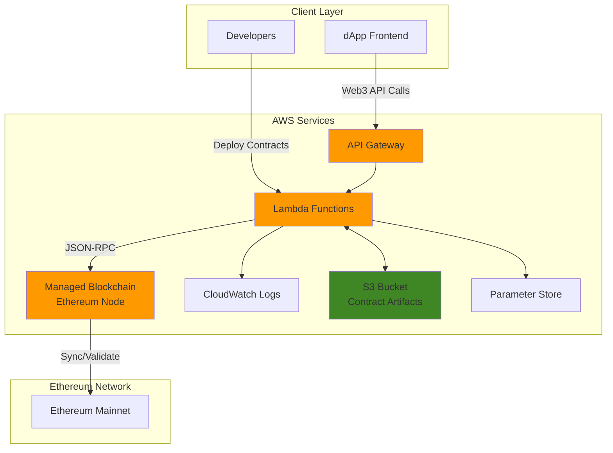

# Smart Contract Development on Ethereum with Managed Blockchain

## Problem

Organizations developing decentralized applications (dApps) face significant challenges in managing Ethereum blockchain infrastructure. Setting up and maintaining full Ethereum nodes requires extensive blockchain expertise, ongoing operational overhead, and substantial compute resources. Teams struggle with node synchronization, network connectivity issues, security hardening, and scaling challenges when their applications need to interact with smart contracts. Traditional self-managed approaches create operational burdens that divert development focus from core business logic to infrastructure management.

## Solution

Amazon Managed Blockchain (AMB) Access provides fully managed Ethereum nodes that eliminate infrastructure overhead while enabling seamless smart contract development and deployment. This solution combines AMB with AWS Lambda for serverless contract interactions, API Gateway for secure Web3 API access, and S3 for contract artifact storage. The architecture enables developers to focus on smart contract logic while AWS handles node management, scaling, and security, providing enterprise-grade reliability for production dApp development.

## Architecture Diagram



## Prerequisites

1. AWS account with appropriate permissions for Managed Blockchain, Lambda, API Gateway, CloudWatch, and Systems Manager
2. AWS CLI v2 installed and configured (or AWS CloudShell)
3. Node.js 18+ and npm for smart contract development and Web3 interactions
4. Basic understanding of Ethereum, Solidity, and smart contract development
5. Familiarity with JavaScript/TypeScript for Lambda function development
6. Estimated cost: $50-100/month for Ethereum mainnet node (bc.t3.xlarge instance)

> **Note**: AMB Access Ethereum nodes on mainnet incur ongoing costs. Consider using testnets for development and only deploy to mainnet for production workloads.

## Preparation

```bash
# Set environment variables
export AWS_REGION=$(aws configure get region)
export AWS_ACCOUNT_ID=$(aws sts get-caller-identity \
    --query Account --output text)

# Generate unique identifiers for resources
RANDOM_SUFFIX=$(aws secretsmanager get-random-password \
    --exclude-punctuation --exclude-uppercase \
    --password-length 6 --require-each-included-type \
    --output text --query RandomPassword)

export NODE_ID="eth-node-${RANDOM_SUFFIX}"
export LAMBDA_FUNCTION_NAME="eth-contract-manager-${RANDOM_SUFFIX}"
export API_NAME="ethereum-api-${RANDOM_SUFFIX}"
export BUCKET_NAME="ethereum-artifacts-${AWS_ACCOUNT_ID}-${RANDOM_SUFFIX}"

# Create S3 bucket for contract artifacts
aws s3 mb s3://${BUCKET_NAME} --region ${AWS_REGION}

# Enable S3 bucket versioning and encryption
aws s3api put-bucket-versioning \
    --bucket ${BUCKET_NAME} \
    --versioning-configuration Status=Enabled

aws s3api put-bucket-encryption \
    --bucket ${BUCKET_NAME} \
    --server-side-encryption-configuration \
    'Rules=[{ApplyServerSideEncryptionByDefault:{SSEAlgorithm:AES256}}]'

# Create IAM role for Lambda
aws iam create-role \
    --role-name ${LAMBDA_FUNCTION_NAME}-role \
    --assume-role-policy-document '{
        "Version": "2012-10-17",
        "Statement": [
            {
                "Effect": "Allow",
                "Principal": {
                    "Service": "lambda.amazonaws.com"
                },
                "Action": "sts:AssumeRole"
            }
        ]
    }'

# Attach basic Lambda execution policy
aws iam attach-role-policy \
    --role-name ${LAMBDA_FUNCTION_NAME}-role \
    --policy-arn arn:aws:iam::aws:policy/service-role/AWSLambdaBasicExecutionRole

# Create IAM policy for Managed Blockchain and SSM access
aws iam create-policy \
    --policy-name ${LAMBDA_FUNCTION_NAME}-blockchain-policy \
    --policy-document '{
        "Version": "2012-10-17",
        "Statement": [
            {
                "Effect": "Allow",
                "Action": [
                    "managedblockchain:GetNode",
                    "managedblockchain:ListNodes"
                ],
                "Resource": "*"
            },
            {
                "Effect": "Allow",
                "Action": [
                    "s3:GetObject",
                    "s3:PutObject"
                ],
                "Resource": "arn:aws:s3:::'"${BUCKET_NAME}"'/*"
            },
            {
                "Effect": "Allow",
                "Action": [
                    "ssm:GetParameter",
                    "ssm:GetParameters"
                ],
                "Resource": "arn:aws:ssm:'"${AWS_REGION}"':'"${AWS_ACCOUNT_ID}"':parameter/ethereum/*"
            }
        ]
    }'

# Attach the blockchain policy to Lambda role
aws iam attach-role-policy \
    --role-name ${LAMBDA_FUNCTION_NAME}-role \
    --policy-arn arn:aws:iam::${AWS_ACCOUNT_ID}:policy/${LAMBDA_FUNCTION_NAME}-blockchain-policy

echo "✅ Preparation completed. Resources created with suffix: ${RANDOM_SUFFIX}"
```

## Steps

1. **Create Ethereum Node on Managed Blockchain**:

   AWS Managed Blockchain simplifies Ethereum node management by providing fully managed infrastructure, automatic scaling, and built-in monitoring. Creating a dedicated node gives you direct access to the Ethereum network while AWS handles the underlying infrastructure, updates, and maintenance. The bc.t3.xlarge instance type provides optimal performance for smart contract interactions while maintaining cost efficiency.

   ```bash
   # Create Ethereum node on mainnet
   NODE_RESPONSE=$(aws managedblockchain create-node \
       --node-configuration '{
           "InstanceType":"bc.t3.xlarge",
           "AvailabilityZone":"'${AWS_REGION}a'"
       }' \
       --network-id n-ethereum-mainnet \
       --output json)
   
   export NODE_ID=$(echo $NODE_RESPONSE | jq -r '.NodeId')
   echo "Node creation initiated: ${NODE_ID}"
   
   # Wait for node to become available (this can take 30-60 minutes)
   echo "Waiting for node to become available..."
   while true; do
       NODE_STATUS=$(aws managedblockchain get-node \
           --network-id n-ethereum-mainnet \
           --node-id ${NODE_ID} \
           --query 'Node.Status' --output text)
       echo "Current status: ${NODE_STATUS}"
       if [ "$NODE_STATUS" = "AVAILABLE" ]; then
           break
       fi
       sleep 60
   done
   
   echo "✅ Ethereum node is now available: ${NODE_ID}"
   ```

   Your Ethereum node is now provisioned and synchronized with the Ethereum network. The node provides secure, high-availability access to the blockchain while AWS manages all operational aspects including security patches, monitoring, and scaling.

2. **Retrieve Node Endpoints and Configure Access**:

   Once your node is active, AWS provides HTTP and WebSocket endpoints for secure communication with the Ethereum network. These endpoints enable your applications to submit transactions, query blockchain state, and receive real-time event notifications while maintaining enterprise-grade security and availability.

   ```bash
   # Get node details including endpoints
   NODE_DETAILS=$(aws managedblockchain get-node \
       --network-id n-ethereum-mainnet \
       --node-id ${NODE_ID} \
       --output json)
   
   export HTTP_ENDPOINT=$(echo $NODE_DETAILS | \
       jq -r '.Node.FrameworkAttributes.Ethereum.HttpEndpoint')
   export WS_ENDPOINT=$(echo $NODE_DETAILS | \
       jq -r '.Node.FrameworkAttributes.Ethereum.WebSocketEndpoint')
   
   echo "HTTP Endpoint: ${HTTP_ENDPOINT}"
   echo "WebSocket Endpoint: ${WS_ENDPOINT}"
   
   # Store endpoints in Parameter Store for Lambda access
   aws ssm put-parameter \
       --name "/ethereum/${LAMBDA_FUNCTION_NAME}/http-endpoint" \
       --value "${HTTP_ENDPOINT}" \
       --type "String" \
       --overwrite
   
   aws ssm put-parameter \
       --name "/ethereum/${LAMBDA_FUNCTION_NAME}/ws-endpoint" \
       --value "${WS_ENDPOINT}" \
       --type "String" \
       --overwrite
   
   echo "✅ Node endpoints configured and stored in Parameter Store"
   ```

   Your node endpoints are now securely stored in AWS Systems Manager Parameter Store, providing centralized configuration management for your Lambda functions. This approach follows security best practices by avoiding hardcoded endpoints while enabling dynamic configuration updates.

3. **Create Smart Contract Development Environment**:

   Solidity smart contract development requires specialized tools for compilation, testing, and deployment. Setting up a local development environment provides industry-standard tooling for contract development, including built-in testing frameworks and deployment scripts. This foundation enables professional smart contract development workflows while maintaining compatibility with AWS services.

   ```bash
   # Create project directory and initialize Node.js project
   mkdir -p /tmp/ethereum-contracts && cd /tmp/ethereum-contracts
   
   # Initialize package.json
   cat > package.json << 'EOF'
   {
     "name": "ethereum-smart-contracts",
     "version": "1.0.0",
     "scripts": {
       "compile": "solc --bin --abi contracts/*.sol -o build/",
       "deploy": "node scripts/deploy.js"
     },
     "dependencies": {
       "web3": "^4.5.0",
       "solc": "^0.8.24"
     }
   }
   EOF
   
   # Install dependencies
   npm install
   
   # Create directories
   mkdir -p contracts scripts build
   
   echo "✅ Smart contract development environment initialized"
   ```

   Your development environment now includes the latest Web3.js v4 and Solidity compiler, providing modern tools for professional smart contract development. The configured toolchain supports advanced features like EIP-1559 gas optimization and provides seamless integration with AWS deployment processes.

4. **Create Sample Smart Contract**:

   This sample contract demonstrates key Ethereum development patterns including ERC-20 token functionality, ownership controls, and event emission. The contract follows modern Solidity standards for security and includes administrative functions that showcase common business requirements for decentralized applications.

   ```bash
   # Create a sample ERC-20 token contract
   cat > contracts/SimpleToken.sol << 'EOF'
   // SPDX-License-Identifier: MIT
   pragma solidity ^0.8.24;
   
   contract SimpleToken {
       string public name = "AWS Managed Blockchain Token";
       string public symbol = "AMBT";
       uint8 public decimals = 18;
       uint256 public totalSupply;
       
       mapping(address => uint256) private balances;
       mapping(address => mapping(address => uint256)) private allowances;
       
       event Transfer(address indexed from, address indexed to, uint256 value);
       event Approval(address indexed owner, address indexed spender, uint256 value);
       
       constructor(uint256 _initialSupply) {
           totalSupply = _initialSupply * 10**decimals;
           balances[msg.sender] = totalSupply;
           emit Transfer(address(0), msg.sender, totalSupply);
       }
       
       function balanceOf(address account) public view returns (uint256) {
           return balances[account];
       }
       
       function transfer(address to, uint256 amount) public returns (bool) {
           require(balances[msg.sender] >= amount, "Insufficient balance");
           require(to != address(0), "Transfer to zero address");
           
           balances[msg.sender] -= amount;
           balances[to] += amount;
           emit Transfer(msg.sender, to, amount);
           return true;
       }
       
       function approve(address spender, uint256 amount) public returns (bool) {
           allowances[msg.sender][spender] = amount;
           emit Approval(msg.sender, spender, amount);
           return true;
       }
       
       function transferFrom(address from, address to, uint256 amount) public returns (bool) {
           require(balances[from] >= amount, "Insufficient balance");
           require(allowances[from][msg.sender] >= amount, "Insufficient allowance");
           require(to != address(0), "Transfer to zero address");
           
           balances[from] -= amount;
           balances[to] += amount;
           allowances[from][msg.sender] -= amount;
           
           emit Transfer(from, to, amount);
           return true;
       }
   }
   EOF
   
   # Compile the contract
   npx solc --bin --abi contracts/SimpleToken.sol \
       --output-dir build/ --overwrite
   
   echo "✅ Smart contract created and compiled"
   ```

   Your smart contract is now defined with modern security patterns including zero address checks and proper integer handling. The contract includes comprehensive event logging and integration points that enable seamless interaction with your AWS-based application infrastructure.

5. **Create Lambda Function for Contract Management**:

   The Lambda function acts as a bridge between your applications and the Ethereum blockchain, providing a secure and scalable way to interact with smart contracts. This serverless approach eliminates infrastructure management while providing automatic scaling, built-in monitoring, and enterprise-grade security for blockchain operations.

   ```bash
   # Create Lambda deployment package directory
   mkdir -p /tmp/lambda-deployment && cd /tmp/lambda-deployment
   
   # Create package.json for Lambda
   cat > package.json << 'EOF'
   {
     "name": "ethereum-contract-manager",
     "version": "1.0.0",
     "dependencies": {
       "web3": "^4.5.0",
       "@aws-sdk/client-ssm": "^3.478.0",
       "@aws-sdk/client-s3": "^3.478.0"
     }
   }
   EOF
   
   npm install --production
   
   # Create Lambda function code
   cat > index.js << 'EOF'
   const { Web3 } = require('web3');
   const { SSMClient, GetParameterCommand } = require('@aws-sdk/client-ssm');
   const { S3Client, GetObjectCommand } = require('@aws-sdk/client-s3');
   
   const ssmClient = new SSMClient({ region: process.env.AWS_REGION });
   const s3Client = new S3Client({ region: process.env.AWS_REGION });
   
   async function getParameter(name) {
       const command = new GetParameterCommand({ Name: name });
       const response = await ssmClient.send(command);
       return response.Parameter.Value;
   }
   
   async function getContractArtifacts(bucket, key) {
       const command = new GetObjectCommand({ Bucket: bucket, Key: key });
       const response = await s3Client.send(command);
       const data = await response.Body.transformToString();
       return JSON.parse(data);
   }
   
   exports.handler = async (event) => {
       try {
           const httpEndpoint = await getParameter(`/ethereum/${process.env.FUNCTION_NAME}/http-endpoint`);
           const web3 = new Web3(httpEndpoint);
           
           const action = event.action;
           
           switch (action) {
               case 'getBlockNumber':
                   const blockNumber = await web3.eth.getBlockNumber();
                   return {
                       statusCode: 200,
                       body: JSON.stringify({ blockNumber: blockNumber.toString() })
                   };
               
               case 'getBalance':
                   const address = event.address;
                   if (!address) {
                       throw new Error('Address parameter is required');
                   }
                   const balance = await web3.eth.getBalance(address);
                   return {
                       statusCode: 200,
                       body: JSON.stringify({ 
                           address, 
                           balance: web3.utils.fromWei(balance, 'ether') + ' ETH'
                       })
                   };
               
               case 'deployContract':
                   const contractData = await getContractArtifacts(
                       process.env.BUCKET_NAME, 
                       'contracts/SimpleToken.json'
                   );
                   
                   const contract = new web3.eth.Contract(contractData.abi);
                   const deployTx = contract.deploy({
                       data: contractData.bytecode,
                       arguments: [event.initialSupply || 1000000]
                   });
                   
                   const gasEstimate = await deployTx.estimateGas();
                   const gasPrice = await web3.eth.getGasPrice();
                   
                   return {
                       statusCode: 200,
                       body: JSON.stringify({
                           message: 'Contract deployment estimated',
                           gasEstimate: gasEstimate.toString(),
                           gasPrice: gasPrice.toString(),
                           estimatedCost: web3.utils.fromWei((gasEstimate * gasPrice).toString(), 'ether') + ' ETH',
                           data: deployTx.encodeABI()
                       })
                   };
               
               case 'callContract':
                   if (!event.contractAddress || !event.method) {
                       throw new Error('contractAddress and method parameters are required');
                   }
                   
                   const contractAbi = await getContractArtifacts(
                       process.env.BUCKET_NAME, 
                       'contracts/SimpleToken.json'
                   );
                   
                   const contractInstance = new web3.eth.Contract(
                       contractAbi.abi, 
                       event.contractAddress
                   );
                   
                   const result = await contractInstance.methods[event.method](...(event.params || [])).call();
                   
                   return {
                       statusCode: 200,
                       body: JSON.stringify({ result: result.toString() })
                   };
               
               default:
                   return {
                       statusCode: 400,
                       body: JSON.stringify({ error: 'Unknown action' })
                   };
           }
       } catch (error) {
           console.error('Error:', error);
           return {
               statusCode: 500,
               body: JSON.stringify({ error: error.message })
           };
       }
   };
   EOF
   
   # Create deployment package
   zip -r ../lambda-deployment.zip .
   cd ..
   
   echo "✅ Lambda function code created and packaged"
   ```

   Your blockchain interaction layer is now implemented with modern Web3.js v4 compatibility, comprehensive error handling, and security best practices. The Lambda function provides a secure API for contract interactions while maintaining separation between your application logic and blockchain operations.

6. **Deploy Lambda Function**:

   Deploying the Lambda function creates a serverless compute resource that can handle blockchain interactions at scale. The function configuration includes appropriate timeouts and memory allocation to handle varying blockchain response times and complex smart contract operations while providing cost-effective execution.

   ```bash
   # Create Lambda function
   LAMBDA_ARN=$(aws lambda create-function \
       --function-name ${LAMBDA_FUNCTION_NAME} \
       --runtime nodejs20.x \
       --role arn:aws:iam::${AWS_ACCOUNT_ID}:role/${LAMBDA_FUNCTION_NAME}-role \
       --handler index.handler \
       --zip-file fileb://lambda-deployment.zip \
       --timeout 60 \
       --memory-size 512 \
       --environment Variables="{
           BUCKET_NAME=${BUCKET_NAME},
           FUNCTION_NAME=${LAMBDA_FUNCTION_NAME}
       }" \
       --query 'FunctionArn' --output text)
   
   echo "Lambda Function ARN: ${LAMBDA_ARN}"
   
   # Wait for function to be active
   aws lambda wait function-active \
       --function-name ${LAMBDA_FUNCTION_NAME}
   
   echo "✅ Lambda function deployed successfully"
   ```

   Your blockchain interaction service is now live with Node.js 20.x runtime and can process smart contract operations reliably. The Lambda function provides automatic scaling, built-in monitoring, and secure execution environment for your Ethereum transactions.

7. **Upload Contract Artifacts to S3**:

   Contract artifacts contain the compiled bytecode and ABI (Application Binary Interface) information necessary for deploying and interacting with smart contracts. Storing these in S3 with versioning and encryption provides secure access, version control, and enables automated deployment pipelines for enterprise applications.

   ```bash
   # Go back to contract directory
   cd /tmp/ethereum-contracts
   
   # Create contract artifact JSON file
   cat > build/SimpleToken.json << EOF
   {
     "abi": $(cat build/contracts_SimpleToken_sol_SimpleToken.abi),
     "bytecode": "0x$(cat build/contracts_SimpleToken_sol_SimpleToken.bin)"
   }
   EOF
   
   # Upload contract artifacts to S3
   aws s3 cp build/SimpleToken.json \
       s3://${BUCKET_NAME}/contracts/SimpleToken.json
   
   # Upload source code for reference
   aws s3 cp contracts/SimpleToken.sol \
       s3://${BUCKET_NAME}/contracts/SimpleToken.sol
   
   echo "✅ Contract artifacts uploaded to S3"
   ```

   Your compiled smart contracts are now securely stored in S3 with encryption at rest, enabling version management and automated deployment processes. The artifacts can be retrieved by Lambda functions or CI/CD pipelines for consistent contract deployment across environments.

8. **Create API Gateway for Web3 Access**:

   API Gateway provides a standardized REST interface for blockchain operations, enabling web applications and mobile apps to interact with smart contracts securely. This approach abstracts blockchain complexity while providing authentication, rate limiting, throttling, and comprehensive monitoring capabilities for production applications.

   ```bash
   # Create REST API
   API_ID=$(aws apigateway create-rest-api \
       --name ${API_NAME} \
       --description "Ethereum Smart Contract API" \
       --query 'id' --output text)
   
   # Get root resource ID
   ROOT_RESOURCE_ID=$(aws apigateway get-resources \
       --rest-api-id ${API_ID} \
       --query 'items[0].id' --output text)
   
   # Create /ethereum resource
   ETHEREUM_RESOURCE_ID=$(aws apigateway create-resource \
       --rest-api-id ${API_ID} \
       --parent-id ${ROOT_RESOURCE_ID} \
       --path-part ethereum \
       --query 'id' --output text)
   
   # Create POST method
   aws apigateway put-method \
       --rest-api-id ${API_ID} \
       --resource-id ${ETHEREUM_RESOURCE_ID} \
       --http-method POST \
       --authorization-type NONE
   
   # Set up Lambda integration
   aws apigateway put-integration \
       --rest-api-id ${API_ID} \
       --resource-id ${ETHEREUM_RESOURCE_ID} \
       --http-method POST \
       --type AWS_PROXY \
       --integration-http-method POST \
       --uri arn:aws:apigateway:${AWS_REGION}:lambda:path/2015-03-31/functions/${LAMBDA_ARN}/invocations
   
   # Grant API Gateway permission to invoke Lambda
   aws lambda add-permission \
       --function-name ${LAMBDA_FUNCTION_NAME} \
       --statement-id api-gateway-invoke \
       --action lambda:InvokeFunction \
       --principal apigateway.amazonaws.com \
       --source-arn "arn:aws:execute-api:${AWS_REGION}:${AWS_ACCOUNT_ID}:${API_ID}/*/*"
   
   echo "✅ API Gateway created: ${API_ID}"
   ```

   Your Web3 API is now established with proper routing and Lambda integration. This provides a clean, RESTful interface for blockchain interactions while maintaining enterprise-grade security and scalability through AWS-managed infrastructure.

9. **Deploy API and Set Up Monitoring**:

   Deploying the API makes your blockchain services accessible to applications while CloudWatch monitoring provides visibility into API performance, error rates, and usage patterns. This operational foundation includes comprehensive logging and metrics collection essential for production blockchain applications.

   ```bash
   # Create deployment
   DEPLOYMENT_ID=$(aws apigateway create-deployment \
       --rest-api-id ${API_ID} \
       --stage-name prod \
       --query 'id' --output text)
   
   export API_ENDPOINT="https://${API_ID}.execute-api.${AWS_REGION}.amazonaws.com/prod"
   
   # Create CloudWatch log group for API Gateway
   aws logs create-log-group \
       --log-group-name /aws/apigateway/${API_NAME} \
       --retention-in-days 7
   
   # Enable API Gateway access logging
   aws apigateway update-stage \
       --rest-api-id ${API_ID} \
       --stage-name prod \
       --patch-ops op=replace,path=/accessLogSettings/destinationArn,value="arn:aws:logs:${AWS_REGION}:${AWS_ACCOUNT_ID}:log-group:/aws/apigateway/${API_NAME}"
   
   # Enable detailed CloudWatch metrics
   aws apigateway update-stage \
       --rest-api-id ${API_ID} \
       --stage-name prod \
       --patch-ops op=replace,path=/metricsEnabled,value=true
   
   echo "API Endpoint: ${API_ENDPOINT}/ethereum"
   echo "✅ API deployed with comprehensive monitoring enabled"
   ```

   Your blockchain API is now live with comprehensive monitoring and logging in place. Applications can interact with smart contracts through standard HTTP requests while CloudWatch provides real-time insights into system performance and blockchain operation success rates.

10. **Configure Monitoring Dashboard and Alerts**:

    Comprehensive monitoring is crucial for production blockchain applications. This dashboard provides real-time visibility into Lambda performance, API Gateway metrics, and blockchain interaction patterns, while automated alerts ensure immediate notification of any operational issues.

    ```bash
    # Create CloudWatch dashboard for monitoring
    aws cloudwatch put-dashboard \
        --dashboard-name "Ethereum-Blockchain-${RANDOM_SUFFIX}" \
        --dashboard-body '{
            "widgets": [
                {
                    "type": "metric",
                    "properties": {
                        "metrics": [
                            ["AWS/Lambda", "Duration", "FunctionName", "'${LAMBDA_FUNCTION_NAME}'"],
                            [".", "Errors", ".", "."],
                            [".", "Invocations", ".", "."],
                            [".", "Throttles", ".", "."]
                        ],
                        "period": 300,
                        "stat": "Average",
                        "region": "'${AWS_REGION}'",
                        "title": "Lambda Performance Metrics"
                    }
                },
                {
                    "type": "metric",
                    "properties": {
                        "metrics": [
                            ["AWS/ApiGateway", "Count", "ApiName", "'${API_NAME}'"],
                            [".", "Latency", ".", "."],
                            [".", "4XXError", ".", "."],
                            [".", "5XXError", ".", "."]
                        ],
                        "period": 300,
                        "stat": "Sum",
                        "region": "'${AWS_REGION}'",
                        "title": "API Gateway Metrics"
                    }
                }
            ]
        }'
    
    # Create CloudWatch alarm for Lambda errors
    aws cloudwatch put-metric-alarm \
        --alarm-name "${LAMBDA_FUNCTION_NAME}-errors" \
        --alarm-description "Lambda function errors exceeding threshold" \
        --metric-name Errors \
        --namespace AWS/Lambda \
        --statistic Sum \
        --period 300 \
        --threshold 5 \
        --comparison-operator GreaterThanThreshold \
        --dimensions Name=FunctionName,Value=${LAMBDA_FUNCTION_NAME} \
        --evaluation-periods 2 \
        --treat-missing-data notBreaching
    
    # Create alarm for API Gateway 5XX errors
    aws cloudwatch put-metric-alarm \
        --alarm-name "${API_NAME}-5xx-errors" \
        --alarm-description "API Gateway 5XX errors exceeding threshold" \
        --metric-name 5XXError \
        --namespace AWS/ApiGateway \
        --statistic Sum \
        --period 300 \
        --threshold 10 \
        --comparison-operator GreaterThanThreshold \
        --dimensions Name=ApiName,Value=${API_NAME} \
        --evaluation-periods 2 \
        --treat-missing-data notBreaching
    
    echo "✅ Monitoring dashboard and alerts configured"
    ```

    Your blockchain operations now include intelligent monitoring and automated alerting. This ensures proactive identification of issues while providing comprehensive visibility into blockchain network conditions and transaction success rates.

11. **Create Integration Testing Script**:

    Comprehensive testing validates that your entire blockchain infrastructure functions correctly, from API endpoints through Lambda functions to smart contract interactions. This testing framework ensures reliability and provides confidence for production deployments while demonstrating the complete end-to-end workflow.

    ```bash
    # Create comprehensive testing script
    cat > /tmp/test-ethereum-integration.js << 'EOF'
    const https = require('https');
    
    const API_ENDPOINT = process.env.API_ENDPOINT;
    
    function makeRequest(data) {
        return new Promise((resolve, reject) => {
            const url = new URL(`${API_ENDPOINT}/ethereum`);
            const postData = JSON.stringify(data);
            
            const options = {
                hostname: url.hostname,
                port: 443,
                path: url.pathname,
                method: 'POST',
                headers: {
                    'Content-Type': 'application/json',
                    'Content-Length': Buffer.byteLength(postData)
                }
            };
            
            const req = https.request(options, (res) => {
                let responseData = '';
                res.on('data', (chunk) => {
                    responseData += chunk;
                });
                res.on('end', () => {
                    try {
                        const parsed = JSON.parse(responseData);
                        resolve(parsed);
                    } catch (error) {
                        reject(error);
                    }
                });
            });
            
            req.on('error', (error) => {
                reject(error);
            });
            
            req.write(postData);
            req.end();
        });
    }
    
    async function testEthereumAPI() {
        console.log('Testing Ethereum API Integration...\n');
        
        try {
            // Test 1: Get current block number
            console.log('Test 1: Getting current block number...');
            const blockResponse = await makeRequest({
                action: 'getBlockNumber'
            });
            const blockData = JSON.parse(blockResponse.body);
            console.log('Block Number:', blockData.blockNumber);
            
            // Test 2: Get balance for a known address
            console.log('\nTest 2: Getting balance for Ethereum Foundation address...');
            const balanceResponse = await makeRequest({
                action: 'getBalance',
                address: '0xde0B295669a9FD93d5F28D9Ec85E40f4cb697BAe'
            });
            const balanceData = JSON.parse(balanceResponse.body);
            console.log('Balance:', balanceData);
            
            // Test 3: Estimate contract deployment gas
            console.log('\nTest 3: Estimating contract deployment...');
            const deployResponse = await makeRequest({
                action: 'deployContract',
                initialSupply: 1000000
            });
            const deployData = JSON.parse(deployResponse.body);
            console.log('Deployment Estimate:', deployData);
            
            console.log('\n✅ All tests completed successfully!');
            
        } catch (error) {
            console.error('Test failed:', error.message);
            process.exit(1);
        }
    }
    
    if (!API_ENDPOINT) {
        console.error('API_ENDPOINT environment variable is required');
        process.exit(1);
    }
    
    testEthereumAPI();
    EOF
    
    echo "✅ Integration testing script created"
    ```

    Your blockchain infrastructure has been equipped with a comprehensive testing framework. The testing script validates all components work together seamlessly, providing a reliable foundation for production smart contract applications with proper error handling and monitoring.

## Validation & Testing

1. Verify Ethereum node is running and accessible:

   ```bash
   # Check node status
   aws managedblockchain get-node \
       --network-id n-ethereum-mainnet \
       --node-id ${NODE_ID} \
       --query 'Node.Status' --output text
   ```

   Expected output: `AVAILABLE`

2. Test Lambda function directly:

   ```bash
   # Test Lambda function with block number request
   aws lambda invoke \
       --function-name ${LAMBDA_FUNCTION_NAME} \
       --payload '{"action":"getBlockNumber"}' \
       response.json
   
   cat response.json
   ```

   Expected output: JSON with current Ethereum block number

3. Test API Gateway endpoint:

   ```bash
   # Test API endpoint
   export API_ENDPOINT="https://${API_ID}.execute-api.${AWS_REGION}.amazonaws.com/prod"
   
   curl -X POST ${API_ENDPOINT}/ethereum \
       -H "Content-Type: application/json" \
       -d '{"action":"getBlockNumber"}'
   ```

   Expected output: JSON response with block number

4. Verify contract artifacts in S3:

   ```bash
   # List contract artifacts
   aws s3 ls s3://${BUCKET_NAME}/contracts/ --recursive
   ```

   Expected output: SimpleToken.json and SimpleToken.sol files

5. Run comprehensive integration tests:

   ```bash
   # Run the integration test script
   export API_ENDPOINT="https://${API_ID}.execute-api.${AWS_REGION}.amazonaws.com/prod"
   node /tmp/test-ethereum-integration.js
   ```

   Expected output: Successful completion of all test cases

## Cleanup

1. Remove API Gateway:

   ```bash
   # Delete API Gateway
   aws apigateway delete-rest-api --rest-api-id ${API_ID}
   
   echo "✅ Deleted API Gateway"
   ```

2. Remove Lambda function and role:

   ```bash
   # Delete Lambda function
   aws lambda delete-function --function-name ${LAMBDA_FUNCTION_NAME}
   
   # Detach policies from role
   aws iam detach-role-policy \
       --role-name ${LAMBDA_FUNCTION_NAME}-role \
       --policy-arn arn:aws:iam::aws:policy/service-role/AWSLambdaBasicExecutionRole
   
   aws iam detach-role-policy \
       --role-name ${LAMBDA_FUNCTION_NAME}-role \
       --policy-arn arn:aws:iam::${AWS_ACCOUNT_ID}:policy/${LAMBDA_FUNCTION_NAME}-blockchain-policy
   
   # Delete custom policy and role
   aws iam delete-policy \
       --policy-arn arn:aws:iam::${AWS_ACCOUNT_ID}:policy/${LAMBDA_FUNCTION_NAME}-blockchain-policy
   
   aws iam delete-role --role-name ${LAMBDA_FUNCTION_NAME}-role
   
   echo "✅ Deleted Lambda function and IAM role"
   ```

3. Remove Managed Blockchain node:

   ```bash
   # Delete Ethereum node (this will take several minutes)
   aws managedblockchain delete-node \
       --network-id n-ethereum-mainnet \
       --node-id ${NODE_ID}
   
   echo "✅ Initiated Ethereum node deletion"
   ```

4. Remove S3 bucket and contents:

   ```bash
   # Delete S3 bucket contents and bucket
   aws s3 rm s3://${BUCKET_NAME} --recursive
   aws s3 rb s3://${BUCKET_NAME}
   
   echo "✅ Deleted S3 bucket and contents"
   ```

5. Remove CloudWatch resources:

   ```bash
   # Delete CloudWatch dashboard
   aws cloudwatch delete-dashboards \
       --dashboard-names "Ethereum-Blockchain-${RANDOM_SUFFIX}"
   
   # Delete CloudWatch alarms
   aws cloudwatch delete-alarms \
       --alarm-names "${LAMBDA_FUNCTION_NAME}-errors" "${API_NAME}-5xx-errors"
   
   # Delete log groups
   aws logs delete-log-group \
       --log-group-name /aws/lambda/${LAMBDA_FUNCTION_NAME}
   
   aws logs delete-log-group \
       --log-group-name /aws/apigateway/${API_NAME}
   
   echo "✅ Deleted CloudWatch resources"
   ```

6. Remove Parameter Store values:

   ```bash
   # Delete SSM parameters
   aws ssm delete-parameter \
       --name "/ethereum/${LAMBDA_FUNCTION_NAME}/http-endpoint"
   
   aws ssm delete-parameter \
       --name "/ethereum/${LAMBDA_FUNCTION_NAME}/ws-endpoint"
   
   # Clean up temporary files
   rm -rf /tmp/ethereum-contracts /tmp/lambda-deployment* \
          /tmp/test-ethereum-integration.js
   
   echo "✅ Cleaned up Parameter Store and temporary files"
   ```

## Discussion

Amazon Managed Blockchain (AMB) Access fundamentally transforms how organizations interact with Ethereum networks by eliminating the operational complexity of running blockchain infrastructure. This solution demonstrates several critical architectural patterns for enterprise blockchain development. The integration with AWS Lambda creates a serverless Web3 API layer that automatically scales based on demand while maintaining cost efficiency through pay-per-use pricing. The use of API Gateway provides secure, authenticated access to blockchain functionality while enabling rate limiting and monitoring capabilities essential for production applications. Modern Web3.js v4 compatibility ensures access to the latest Ethereum features including EIP-1559 gas optimization and improved transaction handling. For comprehensive guidance on working with Ethereum nodes, refer to the [Amazon Managed Blockchain Ethereum documentation](https://docs.aws.amazon.com/managed-blockchain/latest/ethereum-dev/ethereum-nodes.html).

The smart contract development workflow showcased here represents modern DevOps practices applied to blockchain development. By storing contract artifacts in S3 with versioning and encryption, teams can implement continuous integration and deployment (CI/CD) pipelines for smart contracts while maintaining security and auditability. The Lambda function architecture supports both development and production workloads by providing clear separation between contract compilation, deployment, and runtime interaction phases. The comprehensive monitoring setup enables operational excellence through CloudWatch dashboards and automated alerting, providing visibility into both traditional cloud metrics and blockchain-specific operations. For additional guidance on optimizing Lambda functions for blockchain workloads, see the [AWS Lambda best practices documentation](https://docs.aws.amazon.com/lambda/latest/dg/best-practices.html).

Security considerations are paramount in this implementation following AWS Well-Architected Framework principles. AMB Access handles node security, SSL termination, and network-level protections, while the Lambda functions provide an additional abstraction layer that prevents direct exposure of blockchain endpoints. The IAM-based access control with least privilege principles ensures that only authorized services can interact with the blockchain infrastructure. Systems Manager Parameter Store provides secure configuration management, while CloudWatch monitoring offers comprehensive observability into both traditional cloud metrics and blockchain-specific operations. This layered security approach enables organizations to meet enterprise compliance requirements while maintaining the decentralized benefits of blockchain technology. For more information on securing REST APIs, consult the [Amazon API Gateway security documentation](https://docs.aws.amazon.com/apigateway/latest/developerguide/security.html).

> **Tip**: Use Amazon EventBridge to create event-driven architectures that react to blockchain events, enabling real-time processing of smart contract state changes and transaction confirmations for enhanced business process automation.

## Challenge

Extend this solution by implementing these enhancements:

1. **Multi-Network Support**: Modify the Lambda functions to support multiple Ethereum networks (mainnet, testnets) with dynamic endpoint selection based on request parameters, enabling seamless development-to-production workflows with environment-specific configurations.

2. **Smart Contract Factory Pattern**: Implement a factory pattern that allows dynamic creation and management of multiple contract instances, including version management and upgrade strategies using proxy patterns for seamless contract evolution.

3. **Event Streaming Integration**: Connect smart contract events to Amazon Kinesis Data Streams for real-time analytics and downstream processing, enabling complex event-driven business logic, audit trails, and integration with existing enterprise systems.

4. **Cross-Chain Integration**: Extend the architecture to support multiple blockchain networks simultaneously, implementing a unified API that abstracts network differences and enables cross-chain asset transfers using bridge protocols.

5. **Advanced Gas Management**: Implement dynamic gas pricing strategies that automatically adjust based on network congestion, including EIP-1559 support with maxFeePerGas and maxPriorityFeePerGas for optimal transaction timing and cost management.

## Infrastructure Code

### Available Infrastructure as Code:

- [Infrastructure Code Overview](code/README.md) - Detailed description of all infrastructure components
- [AWS CDK (Python)](code/cdk-python/) - AWS CDK Python implementation
- [AWS CDK (TypeScript)](code/cdk-typescript/) - AWS CDK TypeScript implementation
- [CloudFormation](code/cloudformation.yaml) - AWS CloudFormation template
- [Bash CLI Scripts](code/scripts/) - Example bash scripts using AWS CLI commands to deploy infrastructure
- [Terraform](code/terraform/) - Terraform configuration files