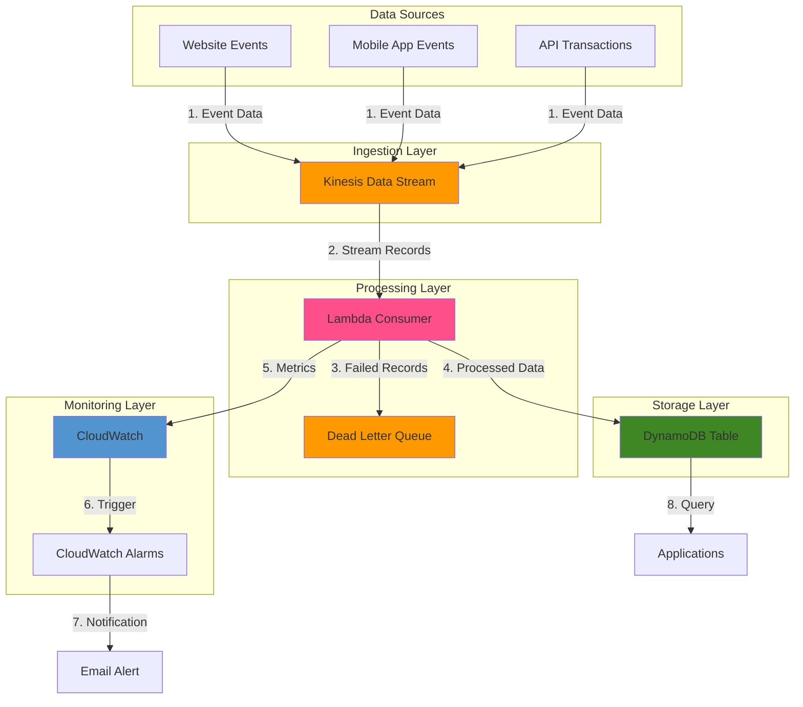

# Processing Event-Driven Streams with Kinesis and Lambda

## Problem

E-commerce companies need to analyze customer behavior in real-time to detect fraud patterns, provide personalized product recommendations, and optimize inventory levels. Traditional batch processing creates delays of hours or days before insights are available, resulting in missed fraud prevention opportunities, lost sales from stale recommendations, and inefficient inventory management. As transaction volumes grow, the need for scalable real-time processing becomes critical to maintaining competitive advantage and protecting revenue streams.

## Solution

Implement a serverless real-time data processing pipeline using Amazon Kinesis Data Streams to ingest high-volume event data, AWS Lambda for processing stream records in real-time, and Amazon DynamoDB to store processed results for quick access. This architecture enables millisecond-level latency from data ingestion to insights, with automatic scaling for varying loads, built-in redundancy across availability zones, and comprehensive monitoring through CloudWatch. The solution processes events as they occur, immediately detecting patterns and triggering business actions without manual intervention.

## Architecture Diagram



## Prerequisites

1. AWS account with administrator access or appropriate permissions for Kinesis, Lambda, DynamoDB, CloudWatch, SQS, SNS, and IAM
2. AWS CLI v2 installed and configured
3. Basic understanding of streaming data concepts and JSON data formats
4. Python 3.9+ knowledge for Lambda function development
5. Text editor for code development
6. Estimated cost: $25-50 per month for moderate traffic (1MB/sec, 1M events/hour) with default settings

> **Note**: The estimated cost assumes a single-shard Kinesis stream, Lambda processing with default memory settings, and a DynamoDB table with on-demand capacity. Scale these components based on your actual workload requirements. Lambda invocations and DynamoDB read/write units are the primary cost drivers.

## Preparation

```bash
# Set environment variables
export AWS_REGION=$(aws configure get region)
export AWS_ACCOUNT_ID=$(aws sts get-caller-identity \
    --query Account --output text)

# Generate unique identifiers for resources
RANDOM_SUFFIX=$(aws secretsmanager get-random-password \
    --exclude-punctuation --exclude-uppercase \
    --password-length 8 --require-each-included-type \
    --output text --query RandomPassword)

# Set resource names with random suffix to ensure uniqueness
export STREAM_NAME="retail-events-stream-${RANDOM_SUFFIX}"
export LAMBDA_FUNCTION_NAME="retail-event-processor-${RANDOM_SUFFIX}"
export DYNAMODB_TABLE="retail-events-data-${RANDOM_SUFFIX}"
export DLQ_QUEUE_NAME="failed-events-dlq-${RANDOM_SUFFIX}"
export ALARM_NAME="stream-processing-errors-${RANDOM_SUFFIX}"
```

## Steps

1. **Create a Kinesis Data Stream**:

   Amazon Kinesis Data Streams provides durable, real-time data ingestion with the ability to buffer and replay events. Each shard provides 1MB/second write capacity and 2MB/second read capacity, making it suitable for applications requiring guaranteed ordering and exactly-once processing semantics within each partition key.

   ```bash
   # Create a data stream with 1 shard (can be scaled up later)
   # Single shard provides 1MB/sec write capacity and 2MB/sec read capacity
   aws kinesis create-stream \
       --stream-name ${STREAM_NAME} \
       --shard-count 1
   
   # Wait for the stream to become active
   # This ensures the stream is ready before proceeding with configuration
   aws kinesis wait stream-exists \
       --stream-name ${STREAM_NAME}
   
   # Retrieve and store the stream ARN
   STREAM_ARN=$(aws kinesis describe-stream \
       --stream-name ${STREAM_NAME} \
       --query 'StreamDescription.StreamARN' \
       --output text)
   
   echo "✅ Kinesis Data Stream created: ${STREAM_NAME}"
   ```

   The stream is now active and ready to receive data. Kinesis provides built-in durability by storing data across multiple availability zones and maintaining data for 24 hours by default (configurable up to one year).

2. **Create a DynamoDB Table for Processed Events**:

   DynamoDB provides single-digit millisecond latency for data access, making it ideal for storing processed events that need to be quickly retrieved by applications. The composite key design enables efficient queries by user and time range.

   ```bash
   # Create DynamoDB table with partition key and sort key
   # Partition key distributes data across multiple partitions for scale
   # Sort key enables efficient queries by timestamp ranges
   aws dynamodb create-table \
       --table-name ${DYNAMODB_TABLE} \
       --attribute-definitions \
           AttributeName=userId,AttributeType=S \
           AttributeName=eventTimestamp,AttributeType=N \
       --key-schema \
           AttributeName=userId,KeyType=HASH \
           AttributeName=eventTimestamp,KeyType=RANGE \
       --billing-mode PAY_PER_REQUEST \
       --tags Key=Project,Value=RetailAnalytics
   
   # Wait for the table to become active
   aws dynamodb wait table-exists \
       --table-name ${DYNAMODB_TABLE}
   
   # Retrieve and store the table ARN
   TABLE_ARN=$(aws dynamodb describe-table \
       --table-name ${DYNAMODB_TABLE} \
       --query 'Table.TableArn' \
       --output text)
   
   echo "✅ DynamoDB table created: ${DYNAMODB_TABLE}"
   ```

   > **Note**: Using PAY_PER_REQUEST billing mode automatically scales read and write capacity based on demand, making it ideal for variable workloads. For predictable traffic patterns, consider [provisioned capacity with auto-scaling](https://docs.aws.amazon.com/amazondynamodb/latest/developerguide/AutoScaling.html) to optimize costs.

3. **Create an SQS Queue for Dead Letter Queue**:

   The dead letter queue captures failed records for analysis and potential replay, ensuring no data is permanently lost due to processing errors. This is essential for maintaining data integrity in production streaming applications.

   ```bash
   # Create SQS queue for failed event processing
   # DLQ captures records that fail processing for investigation and replay
   DLQ_URL=$(aws sqs create-queue \
       --queue-name ${DLQ_QUEUE_NAME} \
       --attributes '{
           "MessageRetentionPeriod": "1209600",
           "VisibilityTimeout": "30"
       }' \
       --query 'QueueUrl' \
       --output text)
   
   # Get the queue ARN
   DLQ_ARN=$(aws sqs get-queue-attributes \
       --queue-url ${DLQ_URL} \
       --attribute-names QueueArn \
       --query 'Attributes.QueueArn' \
       --output text)
   
   echo "✅ Dead Letter Queue created: ${DLQ_QUEUE_NAME}"
   ```

4. **Create IAM Role for Lambda**:

   Following the principle of least privilege, this IAM role grants only the minimum permissions required for the Lambda function to read from Kinesis, write to DynamoDB, send messages to SQS, and publish CloudWatch metrics.

   ```bash
   # Create the trust policy document for Lambda
   cat > lambda-trust-policy.json << EOF
   {
     "Version": "2012-10-17",
     "Statement": [
       {
         "Effect": "Allow",
         "Principal": {
           "Service": "lambda.amazonaws.com"
         },
         "Action": "sts:AssumeRole"
       }
     ]
   }
   EOF
   
   # Create the IAM role
   LAMBDA_ROLE_NAME="retail-event-processor-role-${RANDOM_SUFFIX}"
   LAMBDA_ROLE_ARN=$(aws iam create-role \
       --role-name ${LAMBDA_ROLE_NAME} \
       --assume-role-policy-document file://lambda-trust-policy.json \
       --query 'Role.Arn' \
       --output text)
   
   # Create custom policy for Lambda to access Kinesis, DynamoDB, and CloudWatch
   # This follows least privilege principle - only necessary permissions
   cat > lambda-policy.json << EOF
   {
     "Version": "2012-10-17",
     "Statement": [
       {
         "Effect": "Allow",
         "Action": [
           "kinesis:DescribeStream",
           "kinesis:GetRecords",
           "kinesis:GetShardIterator",
           "kinesis:ListShards"
         ],
         "Resource": "${STREAM_ARN}"
       },
       {
         "Effect": "Allow",
         "Action": [
           "dynamodb:PutItem",
           "dynamodb:UpdateItem"
         ],
         "Resource": "${TABLE_ARN}"
       },
       {
         "Effect": "Allow",
         "Action": [
           "sqs:SendMessage"
         ],
         "Resource": "${DLQ_ARN}"
       },
       {
         "Effect": "Allow",
         "Action": [
           "logs:CreateLogGroup",
           "logs:CreateLogStream",
           "logs:PutLogEvents",
           "cloudwatch:PutMetricData"
         ],
         "Resource": "*"
       }
     ]
   }
   EOF
   
   # Attach custom policy to the role
   POLICY_ARN=$(aws iam create-policy \
       --policy-name retail-event-processor-policy-${RANDOM_SUFFIX} \
       --policy-document file://lambda-policy.json \
       --query 'Policy.Arn' \
       --output text)
   
   aws iam attach-role-policy \
       --role-name ${LAMBDA_ROLE_NAME} \
       --policy-arn ${POLICY_ARN}
   
   # Allow some time for IAM role propagation
   echo "Waiting for IAM role propagation..."
   sleep 15
   
   echo "✅ IAM role created: ${LAMBDA_ROLE_NAME}"
   ```

5. **Create Lambda Function for Stream Processing**:

   The Lambda function processes Kinesis records in batches, providing data transformation, enrichment, and error handling. AWS Lambda automatically scales based on the number of shards in the Kinesis stream, ensuring consistent processing performance.

   ```bash
   # Create a directory for Lambda code
   mkdir -p lambda-function
   cd lambda-function
   
   # Create the Lambda function handler code
   # This function processes events in batches for optimal performance
   cat > lambda_function.py << 'EOF'
import json
import base64
import boto3
import time
import os
import uuid
from datetime import datetime

# Initialize DynamoDB client
dynamodb = boto3.resource('dynamodb')
table = dynamodb.Table(os.environ['DYNAMODB_TABLE'])

# Initialize CloudWatch client
cloudwatch = boto3.client('cloudwatch')

# Initialize SQS client for DLQ
sqs = boto3.client('sqs')

def process_event(event_data):
    """Process a single event and return results"""
    # Extract required fields
    user_id = event_data.get('userId')
    event_type = event_data.get('eventType')
    product_id = event_data.get('productId', 'unknown')
    timestamp = int(event_data.get('timestamp', int(time.time() * 1000)))
    
    # Simple logic based on event type
    if event_type == 'view':
        action = 'viewed'
        event_score = 1
    elif event_type == 'add_to_cart':
        action = 'added to cart'
        event_score = 5
    elif event_type == 'purchase':
        action = 'purchased'
        event_score = 10
    else:
        action = 'interacted with'
        event_score = 1
        
    # Generate a simple insight based on the event
    insight = f"User {user_id} {action} product {product_id}"
    
    # Data enrichment: add processing metadata
    processed_data = {
        'userId': user_id,
        'eventTimestamp': timestamp,
        'eventType': event_type,
        'productId': product_id,
        'eventScore': event_score,
        'insight': insight,
        'processedAt': int(time.time() * 1000),
        'recordId': str(uuid.uuid4())
    }
    
    return processed_data

def lambda_handler(event, context):
    """Process records from Kinesis stream"""
    processed_count = 0
    failed_count = 0
    
    # Process each record in the batch
    for record in event['Records']:
        # Decode and parse the record data
        try:
            # Kinesis data is base64 encoded
            payload = base64.b64decode(record['kinesis']['data']).decode('utf-8')
            event_data = json.loads(payload)
            
            # Process the event
            processed_data = process_event(event_data)
            
            # Store result in DynamoDB
            table.put_item(Item=processed_data)
            
            processed_count += 1
            
        except Exception as e:
            failed_count += 1
            print(f"Error processing record: {str(e)}")
            
            # Send failed record to DLQ
            try:
                sqs.send_message(
                    QueueUrl=os.environ['DLQ_URL'],
                    MessageBody=json.dumps({
                        'error': str(e),
                        'record': record['kinesis']['data'],
                        'timestamp': datetime.utcnow().isoformat()
                    })
                )
            except Exception as dlq_error:
                print(f"Error sending to DLQ: {str(dlq_error)}")
    
    # Send custom metrics to CloudWatch
    try:
        cloudwatch.put_metric_data(
            Namespace='RetailEventProcessing',
            MetricData=[
                {
                    'MetricName': 'ProcessedEvents',
                    'Value': processed_count,
                    'Unit': 'Count'
                },
                {
                    'MetricName': 'FailedEvents',
                    'Value': failed_count,
                    'Unit': 'Count'
                }
            ]
        )
    except Exception as metric_error:
        print(f"Error publishing metrics: {str(metric_error)}")
    
    # Return summary
    return {
        'processed': processed_count,
        'failed': failed_count,
        'total': processed_count + failed_count
    }
EOF
   
   # Create a ZIP file for Lambda deployment
   zip -r ../retail-event-processor.zip .
   cd ..
   
   # Create the Lambda function with the ZIP file
   # Memory size and timeout are configured for optimal performance
   aws lambda create-function \
       --function-name ${LAMBDA_FUNCTION_NAME} \
       --runtime python3.12 \
       --handler lambda_function.lambda_handler \
       --role ${LAMBDA_ROLE_ARN} \
       --zip-file fileb://retail-event-processor.zip \
       --timeout 120 \
       --memory-size 256 \
       --environment "Variables={DYNAMODB_TABLE=${DYNAMODB_TABLE},DLQ_URL=${DLQ_URL}}" \
       --tracing-config Mode=Active
   
   echo "✅ Lambda function created: ${LAMBDA_FUNCTION_NAME}"
   ```

   The Lambda function now includes AWS X-Ray tracing for distributed debugging and enhanced error handling for production robustness. The Python 3.12 runtime provides the latest performance optimizations and security updates.

6. **Configure Lambda Event Source Mapping**:

   The event source mapping configures how Lambda reads from the Kinesis stream, including batch sizing, windowing, and starting position. These settings directly impact latency and cost efficiency.

   ```bash
   # Create event source mapping to connect Lambda to Kinesis
   # Batch size and window control latency vs throughput tradeoff
   aws lambda create-event-source-mapping \
       --function-name ${LAMBDA_FUNCTION_NAME} \
       --event-source-arn ${STREAM_ARN} \
       --batch-size 100 \
       --maximum-batching-window-in-seconds 5 \
       --starting-position LATEST
   
   echo "✅ Lambda event source mapping created"
   ```

   > **Tip**: The batch size and batching window control processing efficiency. Larger batches reduce per-invocation overhead but increase latency. Monitor CloudWatch metrics to find the optimal balance for your use case. Learn more about [Lambda event source mappings](https://docs.aws.amazon.com/lambda/latest/dg/invocation-eventsourcemapping.html).

7. **Create a CloudWatch Alarm for Monitoring Errors**:

   Proactive monitoring through CloudWatch alarms enables rapid response to processing issues, minimizing data loss and ensuring consistent service quality. The alarm threshold can be adjusted based on your error tolerance.

   ```bash
   # Create CloudWatch alarm for failed events
   # This provides proactive monitoring of processing errors
   aws cloudwatch put-metric-alarm \
       --alarm-name ${ALARM_NAME} \
       --alarm-description "Alert when too many events fail processing" \
       --metric-name FailedEvents \
       --namespace RetailEventProcessing \
       --statistic Sum \
       --period 60 \
       --evaluation-periods 1 \
       --threshold 10 \
       --comparison-operator GreaterThanThreshold \
       --treat-missing-data notBreaching
   
   echo "✅ CloudWatch alarm created: ${ALARM_NAME}"
   
   # Optional: Set up SNS topic and subscription for alarm notifications
   read -p "Enter email address for alarm notifications (leave empty to skip): " EMAIL_ADDRESS
   
   if [[ ! -z "$EMAIL_ADDRESS" ]]; then
       # Create SNS topic
       ALERT_TOPIC_NAME="retail-event-alerts-${RANDOM_SUFFIX}"
       ALERT_TOPIC_ARN=$(aws sns create-topic \
           --name ${ALERT_TOPIC_NAME} \
           --query 'TopicArn' \
           --output text)
       
       # Subscribe email to topic
       aws sns subscribe \
           --topic-arn ${ALERT_TOPIC_ARN} \
           --protocol email \
           --notification-endpoint ${EMAIL_ADDRESS}
       
       # Update CloudWatch alarm to use SNS topic
       aws cloudwatch put-metric-alarm \
           --alarm-name ${ALARM_NAME} \
           --alarm-description "Alert when too many events fail processing" \
           --metric-name FailedEvents \
           --namespace RetailEventProcessing \
           --statistic Sum \
           --period 60 \
           --evaluation-periods 1 \
           --threshold 10 \
           --comparison-operator GreaterThanThreshold \
           --treat-missing-data notBreaching \
           --alarm-actions ${ALERT_TOPIC_ARN}
       
       echo "✅ SNS notifications set up with topic: ${ALERT_TOPIC_NAME}"
       echo "   Please check your email to confirm the subscription"
   fi
   ```

8. **Create a Simple Data Producer for Testing**:

   This Python script generates realistic retail events to validate the end-to-end processing pipeline. It simulates various customer interactions with different event types and frequencies.

   ```bash
   # Create a script to generate test data
   # This simulates real-world event streams for testing
   cat > generate_test_data.py << 'EOF'
import boto3
import json
import uuid
import time
import random
import sys

# Initialize Kinesis client
kinesis = boto3.client('kinesis')

# Event types and sample product IDs
EVENT_TYPES = ['view', 'add_to_cart', 'purchase']
PRODUCT_IDS = [f'P{i:04d}' for i in range(1, 101)]
USER_IDS = [f'user-{uuid.uuid4()}' for _ in range(20)]

def generate_event():
    """Generate a random retail event"""
    user_id = random.choice(USER_IDS)
    event_type = random.choice(EVENT_TYPES)
    product_id = random.choice(PRODUCT_IDS)
    
    return {
        'userId': user_id,
        'eventType': event_type,
        'productId': product_id,
        'timestamp': int(time.time() * 1000),
        'sessionId': str(uuid.uuid4()),
        'userAgent': 'Mozilla/5.0',
        'ipAddress': f'192.168.{random.randint(1, 255)}.{random.randint(1, 255)}'
    }

def put_record_to_stream(stream_name, record):
    """Put a single record to Kinesis stream"""
    result = kinesis.put_record(
        StreamName=stream_name,
        Data=json.dumps(record),
        PartitionKey=record['userId']
    )
    return result

def main(stream_name, count=100, delay=0.1):
    """Generate and send events to Kinesis"""
    print(f"Sending {count} events to stream {stream_name}")
    
    for i in range(count):
        event = generate_event()
        result = put_record_to_stream(stream_name, event)
        
        # Print progress every 10 events
        if (i + 1) % 10 == 0:
            print(f"Sent {i + 1}/{count} events")
        
        # Add small delay to prevent throttling
        time.sleep(delay)
    
    print("Done sending events")

if __name__ == "__main__":
    if len(sys.argv) < 2:
        print("Usage: python generate_test_data.py <stream_name> [event_count] [delay_seconds]")
        sys.exit(1)
        
    stream_name = sys.argv[1]
    count = int(sys.argv[2]) if len(sys.argv) > 2 else 100
    delay = float(sys.argv[3]) if len(sys.argv) > 3 else 0.1
    
    main(stream_name, count, delay)
EOF

   # Make the script executable
   chmod +x generate_test_data.py
   
   echo "✅ Test data generator created: generate_test_data.py"
   ```

9. **Test the Pipeline with Sample Data**:

   This step validates the complete processing pipeline by sending test events and allowing time for processing. Monitoring during this phase helps identify any configuration issues.

   ```bash
   # Send test data to the Kinesis stream
   # This validates the end-to-end processing pipeline
   python3 generate_test_data.py ${STREAM_NAME} 50 0.2
   
   # Allow time for processing
   echo "Waiting 30 seconds for events to be processed..."
   sleep 30
   
   echo "✅ Test data sent to Kinesis stream"
   ```

   > **Warning**: Monitor Lambda function duration and error rates during testing. High error rates may indicate issues with data format, IAM permissions, or resource configuration. Use CloudWatch Logs to diagnose processing issues.

## Validation & Testing

1. Verify Lambda function is processing records:

   ```bash
   # Get the latest Lambda function logs
   aws logs describe-log-streams \
       --log-group-name /aws/lambda/${LAMBDA_FUNCTION_NAME} \
       --order-by LastEventTime \
       --descending \
       --limit 3 \
       --query 'logStreams[*].logStreamName' \
       --output text | head -1 | \
   xargs -I {} aws logs get-log-events \
       --log-group-name /aws/lambda/${LAMBDA_FUNCTION_NAME} \
       --log-stream-name {} \
       --limit 10 \
       --query 'events[*].message' \
       --output text
   ```

   Expected output: You should see log messages indicating successful processing of events and the number of records processed.

2. Check records in DynamoDB:

   ```bash
   # Query DynamoDB for processed records
   aws dynamodb scan \
       --table-name ${DYNAMODB_TABLE} \
       --limit 5
   ```

   Expected output: You should see processed event records with insights generated by the Lambda function, including userId, eventTimestamp, and processed metadata.

3. View CloudWatch metrics:

   ```bash
   # Check CloudWatch metrics for the processing pipeline
   START_TIME=$(date -u -d '1 hour ago' +"%Y-%m-%dT%H:%M:%SZ")
   END_TIME=$(date -u +"%Y-%m-%dT%H:%M:%SZ")
   
   aws cloudwatch get-metric-statistics \
       --namespace RetailEventProcessing \
       --metric-name ProcessedEvents \
       --statistics Sum \
       --start-time ${START_TIME} \
       --end-time ${END_TIME} \
       --period 300
   ```

   Expected output: You should see metrics for processed events over the last hour with timestamps and values.

4. Test Error Handling with Invalid Data:

   ```bash
   # Send invalid data to test error handling
   aws kinesis put-record \
       --stream-name ${STREAM_NAME} \
       --data '{"invalid_format": true}' \
       --partition-key "test-error"
   
   # Wait a moment for processing
   sleep 10
   
   # Check DLQ for failed records
   aws sqs receive-message \
       --queue-url ${DLQ_URL} \
       --max-number-of-messages 5 \
       --wait-time-seconds 5
   ```

   Expected output: You should see messages in the dead letter queue with error information, demonstrating proper error handling.

## Cleanup

1. Remove the Lambda event source mapping:

   ```bash
   # Get the UUID of the event source mapping
   EVENT_SOURCE_UUID=$(aws lambda list-event-source-mappings \
       --function-name ${LAMBDA_FUNCTION_NAME} \
       --query 'EventSourceMappings[0].UUID' \
       --output text)
   
   # Delete the event source mapping
   aws lambda delete-event-source-mapping \
       --uuid ${EVENT_SOURCE_UUID}
   
   echo "✅ Deleted Lambda event source mapping"
   ```

2. Delete the Lambda function:

   ```bash
   # Delete the Lambda function
   aws lambda delete-function \
       --function-name ${LAMBDA_FUNCTION_NAME}
   
   echo "✅ Deleted Lambda function: ${LAMBDA_FUNCTION_NAME}"
   ```

3. Delete CloudWatch alarm and SNS topic:

   ```bash
   # Delete the CloudWatch alarm
   aws cloudwatch delete-alarms \
       --alarm-names ${ALARM_NAME}
   
   # Delete SNS topic if created
   if [[ ! -z "$ALERT_TOPIC_ARN" ]]; then
       aws sns delete-topic \
           --topic-arn ${ALERT_TOPIC_ARN}
       echo "✅ Deleted SNS topic: ${ALERT_TOPIC_NAME}"
   fi
   
   echo "✅ Deleted CloudWatch alarm: ${ALARM_NAME}"
   ```

4. Delete IAM role and policy:

   ```bash
   # Detach and delete policy
   aws iam detach-role-policy \
       --role-name ${LAMBDA_ROLE_NAME} \
       --policy-arn ${POLICY_ARN}
   
   aws iam delete-policy \
       --policy-arn ${POLICY_ARN}
   
   # Delete role
   aws iam delete-role \
       --role-name ${LAMBDA_ROLE_NAME}
   
   echo "✅ Deleted IAM role and policy"
   ```

5. Delete SQS queue:

   ```bash
   # Delete SQS queue
   aws sqs delete-queue \
       --queue-url ${DLQ_URL}
   
   echo "✅ Deleted SQS queue: ${DLQ_QUEUE_NAME}"
   ```

6. Delete DynamoDB table:

   ```bash
   # Delete DynamoDB table
   aws dynamodb delete-table \
       --table-name ${DYNAMODB_TABLE}
   
   echo "✅ Deleted DynamoDB table: ${DYNAMODB_TABLE}"
   ```

7. Delete Kinesis data stream:

   ```bash
   # Delete Kinesis stream
   aws kinesis delete-stream \
       --stream-name ${STREAM_NAME}
   
   echo "✅ Deleted Kinesis stream: ${STREAM_NAME}"
   ```

8. Remove local files:

   ```bash
   # Clean up local files
   rm -rf lambda-function
   rm -f retail-event-processor.zip
   rm -f lambda-trust-policy.json
   rm -f lambda-policy.json
   rm -f generate_test_data.py
   
   echo "✅ Removed local files"
   ```

## Discussion

Real-time data processing has become essential for modern digital businesses that need to make immediate decisions based on customer interactions. The architecture presented in this recipe leverages AWS's serverless services to create a scalable, low-maintenance solution that can handle unpredictable event volumes while minimizing operational overhead. This approach follows the [AWS Well-Architected Framework](https://docs.aws.amazon.com/wellarchitected/latest/framework/welcome.html) principles of operational excellence, security, reliability, and cost optimization.

Kinesis Data Streams provides the foundation for this architecture with reliable ingestion of high-velocity data streams. The service's core strength is its ability to temporarily buffer large volumes of streaming data while maintaining strict ordering within each partition key. Each shard can ingest up to 1MB/second or 1,000 records per second, making it suitable for applications that generate thousands of events per second. For higher throughput requirements, you can easily increase the number of shards through resharding operations. The data retention period is configurable from 24 hours to one year, providing flexibility for replay scenarios.

Using Lambda as the stream processor offers several advantages over traditional server-based processing. Lambda functions scale automatically with the incoming data volume, eliminating the need to provision servers in advance or manage scaling policies. The event-driven nature of Lambda ensures that you only pay for the actual processing time, which is ideal for variable workloads. When designing Lambda-based stream processors, careful consideration must be given to batch sizes and processing timeouts. While processing larger batches improves throughput efficiency, it increases the risk of timeouts and potential data loss if a batch fails. The recipe configures a moderate batch size of 100 records with a 5-second batching window as a balanced starting point.

> **Warning**: Lambda invocations have a maximum duration of 15 minutes. If your event processing includes computationally intensive operations or external API calls, monitor function duration and consider reducing batch sizes to prevent timeouts and data loss. Use [AWS Lambda Powertools](https://docs.aws.amazon.com/lambda/latest/dg/python-powertools.html) for enhanced observability and error handling.

DynamoDB complements this architecture by providing single-digit millisecond access to processed data. The choice of on-demand capacity mode eliminates the need to predict read and write capacity, making it particularly well-suited for the variable workloads common in real-time processing scenarios. For cost optimization in production environments with more predictable workloads, consider switching to provisioned capacity with auto-scaling. The composite key design (userId as partition key, eventTimestamp as sort key) enables efficient queries by user and time range while distributing data evenly across partitions.

A critical aspect of any production-grade streaming architecture is error handling. This recipe implements multiple error handling mechanisms: try-catch blocks within the Lambda function, a dead letter queue for failed records, and CloudWatch alarms for monitoring error rates. This multi-layered approach ensures that failures in data processing don't lead to data loss, and operations teams can quickly identify and address issues. The [AWS Architecture Center](https://aws.amazon.com/architecture/) provides additional guidance on building resilient streaming architectures.

> **Tip**: For production deployments, consider implementing a replay mechanism for the dead letter queue. Store the original Kinesis sequence numbers with failed records so they can be reprocessed from their original position in the stream after fixing the processing logic. This ensures exactly-once processing semantics for critical business data.

When comparing this architecture to alternatives, Amazon MSK (Managed Streaming for Kafka) provides more advanced features for stream processing at higher volumes but requires more configuration and management. For simpler use cases or lower volumes, Amazon EventBridge might be more cost-effective while offering easier integration with AWS services. This Kinesis-Lambda architecture strikes a balance, offering high scalability with relatively low management overhead while maintaining the flexibility to integrate with other AWS services seamlessly.

## Challenge

Extend this solution by implementing these enhancements:

1. Add a real-time fraud detection algorithm in the Lambda function that analyzes transaction patterns and flags suspicious activities based on historical user behavior stored in DynamoDB, using techniques like velocity checks and anomaly detection.

2. Implement Kinesis Enhanced Fan-Out with multiple consumer Lambda functions, each specialized for different types of analytics (e.g., one for fraud detection, another for product recommendations), enabling parallel processing of the same data stream.

3. Add a Kinesis Data Analytics SQL application to perform window-based aggregations for real-time dashboards showing trending products, conversion rates, and geographic distribution of events.

4. Implement encryption of sensitive data fields using AWS KMS keys before storing in DynamoDB, and proper decryption when accessed by authorized applications, following data privacy best practices.

5. Create a comprehensive replay mechanism for the dead letter queue that can reprocess failed records after issues are resolved, including sequence number tracking and duplicate detection to ensure no data is permanently lost.

## Infrastructure Code

*Infrastructure code will be generated after recipe approval.*