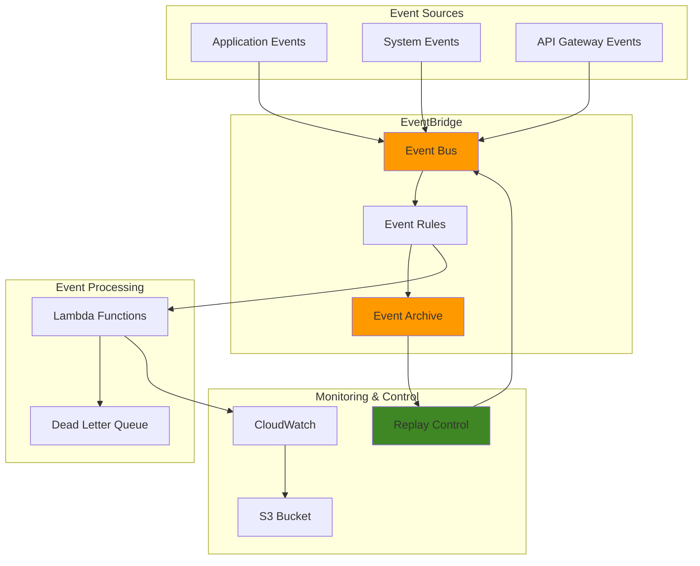

# Event Replay with EventBridge Archive

## Problem

Modern event-driven applications generate thousands of events daily for order processing, user interactions, and system operations. When system failures occur, debugging production issues, or implementing new features, organizations need the ability to replay specific events to recover from failures, validate new functionality, or meet compliance requirements. Without proper event replay mechanisms, teams face costly downtime, difficult debugging processes, and potential data loss during system recovery scenarios.

## Solution

Create a comprehensive event replay system using Amazon EventBridge Archive to capture, filter, and replay events on-demand. This solution provides automated event archiving with selective filtering, controlled replay mechanisms for specific time windows, and integration with monitoring systems to track replay progress and ensure data consistency during recovery operations.

## Architecture Diagram



## Prerequisites

1. AWS account with EventBridge, Lambda, S3, and CloudWatch permissions
2. AWS CLI v2 installed and configured (or AWS CloudShell)
3. Understanding of event-driven architecture patterns
4. Basic knowledge of JSON event filtering and patterns
5. Estimated cost: $5-15 per month for moderate event volumes

> **Note**: EventBridge Archive can store events for up to 10 years with configurable retention periods. Choose retention based on compliance requirements and cost considerations.

## Preparation

```bash
# Set environment variables
export AWS_REGION=$(aws configure get region)
export AWS_ACCOUNT_ID=$(aws sts get-caller-identity \
    --query Account --output text)

# Generate unique identifiers for resources
RANDOM_SUFFIX=$(aws secretsmanager get-random-password \
    --exclude-punctuation --exclude-uppercase \
    --password-length 6 --require-each-included-type \
    --output text --query RandomPassword)

export EVENT_BUS_NAME="replay-demo-bus-${RANDOM_SUFFIX}"
export ARCHIVE_NAME="replay-demo-archive-${RANDOM_SUFFIX}"
export LAMBDA_FUNCTION_NAME="replay-processor-${RANDOM_SUFFIX}"
export S3_BUCKET_NAME="eventbridge-replay-logs-${RANDOM_SUFFIX}"
export RULE_NAME="replay-demo-rule-${RANDOM_SUFFIX}"

# Create S3 bucket for logs and artifacts
aws s3 mb s3://${S3_BUCKET_NAME} --region ${AWS_REGION}

echo "✅ Environment prepared with unique identifiers"
```

## Steps

1. **Create Custom Event Bus**:

   EventBridge custom event buses provide isolated namespaces for application events, enabling better organization and security compared to the default event bus. Custom buses allow you to apply specific access controls, routing rules, and archiving policies tailored to your application's needs. This separation is crucial for multi-tenant architectures and compliance requirements, following [AWS Well-Architected Framework](https://docs.aws.amazon.com/wellarchitected/latest/framework/welcome.html) principles.

   ```bash
   # Create custom event bus for replay demonstration
   aws events create-event-bus \
       --name ${EVENT_BUS_NAME} \
       --tags Key=Purpose,Value=EventReplayDemo \
       Key=Environment,Value=Demo
   
   # Store event bus ARN
   EVENT_BUS_ARN=$(aws events describe-event-bus \
       --name ${EVENT_BUS_NAME} \
       --query 'Arn' --output text)
   
   echo "✅ Created event bus: ${EVENT_BUS_NAME}"
   ```

   The custom event bus is now ready to receive events and serves as the foundation for our replay architecture. This dedicated bus ensures that replay events are isolated from production traffic and can be managed independently with specific retention and processing rules.

2. **Create IAM Role for Lambda Function**:

   IAM roles enable secure, temporary credential delegation without hardcoding secrets in application code. This principle of least privilege ensures applications access only the specific AWS resources they need, reducing security attack surfaces while maintaining operational flexibility. For Lambda functions processing EventBridge events, proper IAM configuration is essential for secure event handling following [AWS IAM security best practices](https://docs.aws.amazon.com/IAM/latest/UserGuide/best-practices.html).

   ```bash
   # Create trust policy for Lambda
   cat > /tmp/lambda-trust-policy.json << EOF
   {
     "Version": "2012-10-17",
     "Statement": [
       {
         "Effect": "Allow",
         "Principal": {
           "Service": "lambda.amazonaws.com"
         },
         "Action": "sts:AssumeRole"
       }
     ]
   }
   EOF
   
   # Create IAM role for Lambda
   aws iam create-role \
       --role-name EventReplayProcessorRole-${RANDOM_SUFFIX} \
       --assume-role-policy-document file:///tmp/lambda-trust-policy.json
   
   # Attach basic Lambda execution policy
   aws iam attach-role-policy \
       --role-name EventReplayProcessorRole-${RANDOM_SUFFIX} \
       --policy-arn arn:aws:iam::aws:policy/service-role/AWSLambdaBasicExecutionRole
   
   echo "✅ Created IAM role for Lambda function"
   ```

   The IAM role is now established with minimal required permissions for Lambda execution and CloudWatch logging. This security foundation enables your Lambda function to process events safely while maintaining audit trails through CloudWatch Logs for compliance and debugging purposes.

3. **Create Lambda Function for Event Processing**:

   Lambda functions provide serverless event processing that automatically scales with event volume, eliminating the need for server management while ensuring cost-effective execution. This function demonstrates how to distinguish between original and replayed events, enabling different processing logic for replay scenarios. The ability to detect replay events is crucial for maintaining data consistency and preventing duplicate business operations.

   ```bash
   # Create Lambda function code
   cat > /tmp/event-processor.py << 'EOF'
   import json
   import boto3
   import logging
   from datetime import datetime
   
   logger = logging.getLogger()
   logger.setLevel(logging.INFO)
   
   def lambda_handler(event, context):
       """
       Process events and log details for replay analysis
       """
       try:
           # Log the complete event for debugging
           logger.info(f"Received event: {json.dumps(event, indent=2)}")
           
           # Extract event details
           event_source = event.get('source', 'unknown')
           event_type = event.get('detail-type', 'unknown')
           event_time = event.get('time', datetime.utcnow().isoformat())
           
           # Check if this is a replayed event
           replay_name = event.get('replay-name')
           if replay_name:
               logger.info(f"Processing REPLAYED event from: {replay_name}")
               
           # Simulate business logic processing
           if event_source == 'myapp.orders':
               process_order_event(event)
           elif event_source == 'myapp.users':
               process_user_event(event)
           else:
               logger.info(f"Processing generic event: {event_type}")
           
           # Return successful response
           return {
               'statusCode': 200,
               'body': json.dumps({
                   'message': 'Event processed successfully',
                   'eventSource': event_source,
                   'eventType': event_type,
                   'isReplay': bool(replay_name)
               })
           }
           
       except Exception as e:
           logger.error(f"Error processing event: {str(e)}")
           raise
   
   def process_order_event(event):
       """Process order-related events"""
       order_id = event.get('detail', {}).get('orderId', 'unknown')
       logger.info(f"Processing order event for order: {order_id}")
       
   def process_user_event(event):
       """Process user-related events"""
       user_id = event.get('detail', {}).get('userId', 'unknown')
       logger.info(f"Processing user event for user: {user_id}")
   EOF
   
   # Create deployment package
   cd /tmp
   zip event-processor.zip event-processor.py
   
   # Get Lambda role ARN
   LAMBDA_ROLE_ARN=$(aws iam get-role \
       --role-name EventReplayProcessorRole-${RANDOM_SUFFIX} \
       --query 'Role.Arn' --output text)
   
   # Create Lambda function with latest Python runtime
   aws lambda create-function \
       --function-name ${LAMBDA_FUNCTION_NAME} \
       --runtime python3.12 \
       --role ${LAMBDA_ROLE_ARN} \
       --handler event-processor.lambda_handler \
       --zip-file fileb://event-processor.zip \
       --timeout 30 \
       --memory-size 256
   
   echo "✅ Created Lambda function for event processing"
   ```

   The Lambda function is now deployed and ready to process both original and replayed events. The function includes logic to detect replay operations through the `replay-name` metadata field, enabling different handling strategies for replay scenarios versus real-time processing.

> **Warning**: Lambda functions invoked by replayed events should implement idempotent processing logic to prevent duplicate business operations during replay scenarios.

4. **Create EventBridge Rule and Lambda Target**:

   EventBridge rules use event patterns to filter and route events to specific targets based on event content. This pattern-based routing enables precise control over which events trigger which processing logic, reducing unnecessary function invocations and costs. The rule configuration demonstrates how to implement selective event processing for specific application domains.

   ```bash
   # Create event rule to process all events from custom sources
   aws events put-rule \
       --name ${RULE_NAME} \
       --event-bus-name ${EVENT_BUS_NAME} \
       --event-pattern '{
         "source": ["myapp.orders", "myapp.users", "myapp.inventory"],
         "detail-type": ["Order Created", "User Registered", "Inventory Updated"]
       }' \
       --state ENABLED \
       --description "Rule for processing application events"
   
   # Add Lambda function as target
   aws events put-targets \
       --rule ${RULE_NAME} \
       --event-bus-name ${EVENT_BUS_NAME} \
       --targets "Id"="1","Arn"="arn:aws:lambda:${AWS_REGION}:${AWS_ACCOUNT_ID}:function:${LAMBDA_FUNCTION_NAME}"
   
   # Grant EventBridge permission to invoke Lambda
   aws lambda add-permission \
       --function-name ${LAMBDA_FUNCTION_NAME} \
       --statement-id EventBridgeInvoke \
       --action lambda:InvokeFunction \
       --principal events.amazonaws.com \
       --source-arn "arn:aws:events:${AWS_REGION}:${AWS_ACCOUNT_ID}:rule/${EVENT_BUS_NAME}/${RULE_NAME}"
   
   echo "✅ Created EventBridge rule and Lambda target"
   ```

   The EventBridge rule is now configured to route matching events to your Lambda function. This establishes the event processing pipeline that will handle both real-time events and replayed events identically, ensuring consistent business logic execution across different scenarios.

5. **Create Event Archive with Selective Filtering**:

   EventBridge Archive automatically captures and stores events based on configurable patterns, providing a foundation for replay capabilities, compliance requirements, and historical analysis. The selective filtering ensures only business-critical events are archived, optimizing storage costs while maintaining comprehensive audit trails. This approach enables precise control over which events can be replayed for operational recovery or testing scenarios.

   ```bash
   # Create archive with filtering for specific event types
   aws events create-archive \
       --archive-name ${ARCHIVE_NAME} \
       --source-arn ${EVENT_BUS_ARN} \
       --event-pattern '{
         "source": ["myapp.orders", "myapp.users"],
         "detail-type": ["Order Created", "User Registered"]
       }' \
       --retention-days 30 \
       --description "Archive for order and user events"
   
   # Wait for archive to be created
   sleep 5
   
   # Verify archive creation
   aws events describe-archive \
       --archive-name ${ARCHIVE_NAME} \
       --query 'ArchiveName' --output text
   
   echo "✅ Created event archive with 30-day retention"
   ```

   The event archive is now active and will automatically capture matching events for the next 30 days. This provides the historical event storage necessary for replay operations while implementing cost-effective retention policies that align with business and compliance requirements.

6. **Generate Test Events for Archiving**:

   Creating sample events demonstrates the event structure and populates the archive for testing replay functionality. These events simulate real-world scenarios such as order processing and user registration, providing a foundation for validating the replay system's behavior.

   ```bash
   # Create sample events to populate the archive
   for i in {1..10}; do
       # Generate order events
       aws events put-events \
           --entries Source=myapp.orders,DetailType="Order Created",Detail="{\"orderId\":\"order-${i}\",\"amount\":$((RANDOM % 1000 + 50)),\"customerId\":\"customer-${i}\",\"timestamp\":\"$(date -u +%Y-%m-%dT%H:%M:%SZ)\"}" \
           --event-bus-name ${EVENT_BUS_NAME}
       
       # Generate user events  
       aws events put-events \
           --entries Source=myapp.users,DetailType="User Registered",Detail="{\"userId\":\"user-${i}\",\"email\":\"user${i}@example.com\",\"timestamp\":\"$(date -u +%Y-%m-%dT%H:%M:%SZ)\"}" \
           --event-bus-name ${EVENT_BUS_NAME}
       
       # Brief pause between events
       sleep 2
   done
   
   echo "✅ Generated 20 test events for archive"
   ```

   Test events are now being sent to EventBridge and will be processed by your Lambda function while simultaneously being captured by the archive based on the defined event patterns.

7. **Wait for Events to be Archived**:

   EventBridge Archive has a delay of up to 10 minutes before events appear in the archive. This waiting period ensures events are properly stored and available for replay operations.

   ```bash
   # Wait for events to be archived (EventBridge has up to 10 minute delay)
   echo "Waiting for events to be archived..."
   sleep 60
   
   # Check archive statistics
   aws events describe-archive \
       --archive-name ${ARCHIVE_NAME} \
       --query '[ArchiveName, State, EventCount, SizeBytes]' \
       --output table
   
   echo "✅ Events are being archived (may take up to 10 minutes)"
   ```

   The archive statistics provide visibility into the archiving process, showing the current state and number of events captured. Note that EventCount metrics may take up to 24 hours to reconcile completely.

8. **Create Replay Configuration**:

   Event replay operations enable controlled reprocessing of historical events within specified time windows, supporting disaster recovery, testing, and debugging scenarios. The replay mechanism maintains event ordering and timing while adding replay-specific metadata to distinguish replayed events from original ones. This capability is essential for validating system behavior changes, recovering from failures, and ensuring data consistency.

   ```bash
   # Calculate time window for replay (last 30 minutes)
   START_TIME=$(date -u -d '30 minutes ago' +%Y-%m-%dT%H:%M:%SZ)
   END_TIME=$(date -u +%Y-%m-%dT%H:%M:%SZ)
   
   # Create replay name with timestamp
   REPLAY_NAME="demo-replay-$(date +%Y%m%d-%H%M%S)"
   
   # Start event replay
   aws events start-replay \
       --replay-name ${REPLAY_NAME} \
       --event-source-arn ${EVENT_BUS_ARN} \
       --event-start-time ${START_TIME} \
       --event-end-time ${END_TIME} \
       --destination '{
         "Arn": "'${EVENT_BUS_ARN}'",
         "FilterArns": ["arn:aws:events:'${AWS_REGION}':'${AWS_ACCOUNT_ID}':rule/'${EVENT_BUS_NAME}'/'${RULE_NAME}'"]
       }'
   
   echo "✅ Started event replay: ${REPLAY_NAME}"
   echo "Replay time window: ${START_TIME} to ${END_TIME}"
   ```

   The replay operation is now initiated and will reprocess archived events from the specified time window. EventBridge will maintain event sequencing and add the `replay-name` field to each replayed event, enabling your application logic to differentiate between original and replayed events for appropriate handling.

9. **Monitor Replay Progress**:

   Monitoring replay operations ensures successful completion and provides visibility into the replay process. This monitoring approach tracks replay status and provides real-time feedback on progress.

   ```bash
   # Monitor replay status
   echo "Monitoring replay progress..."
   
   for i in {1..10}; do
       REPLAY_STATUS=$(aws events describe-replay \
           --replay-name ${REPLAY_NAME} \
           --query 'State' --output text)
       
       REPLAYED_TIME=$(aws events describe-replay \
           --replay-name ${REPLAY_NAME} \
           --query 'EventLastReplayedTime' --output text)
       
       echo "Replay Status: ${REPLAY_STATUS}"
       if [ "${REPLAYED_TIME}" != "None" ]; then
           echo "Last Event Replayed: ${REPLAYED_TIME}"
       fi
       
       if [ "${REPLAY_STATUS}" = "COMPLETED" ]; then
           echo "✅ Replay completed successfully"
           break
       elif [ "${REPLAY_STATUS}" = "FAILED" ]; then
           echo "❌ Replay failed"
           break
       fi
       
       sleep 30
   done
   ```

   The monitoring loop provides real-time feedback on replay progress and automatically detects completion or failure states. This approach ensures you can track replay operations and respond appropriately to different outcomes.

10. **Implement Selective Replay with Filtering**:

    Selective replay enables precise control over which events are reprocessed, supporting targeted recovery scenarios or focused testing of specific event types.

    ```bash
    # Create targeted replay for specific event types only
    SELECTIVE_REPLAY_NAME="selective-replay-$(date +%Y%m%d-%H%M%S)"
    
    # Start selective replay for order events only
    aws events start-replay \
        --replay-name ${SELECTIVE_REPLAY_NAME} \
        --event-source-arn ${EVENT_BUS_ARN} \
        --event-start-time ${START_TIME} \
        --event-end-time ${END_TIME} \
        --destination '{
          "Arn": "'${EVENT_BUS_ARN}'",
          "FilterArns": ["arn:aws:events:'${AWS_REGION}':'${AWS_ACCOUNT_ID}':rule/'${EVENT_BUS_NAME}'/'${RULE_NAME}'"]
        }'
    
    echo "✅ Started selective replay: ${SELECTIVE_REPLAY_NAME}"
    
    # Monitor selective replay
    aws events describe-replay \
        --replay-name ${SELECTIVE_REPLAY_NAME} \
        --query '[ReplayName, State, EventSourceArn]' \
        --output table
    ```

    The selective replay demonstrates how to replay specific subsets of archived events, enabling precise control over recovery or testing scenarios without processing unnecessary events.

11. **Create Replay Automation Script**:

    Automation scripts standardize replay operations and integrate with operational procedures, enabling consistent replay execution across different scenarios.

    ```bash
    # Create automated replay script
    cat > /tmp/replay-automation.sh << 'EOF'
    #!/bin/bash
    
    # Replay automation script
    ARCHIVE_NAME=$1
    HOURS_BACK=${2:-1}
    
    if [ -z "$ARCHIVE_NAME" ]; then
        echo "Usage: $0 <archive-name> [hours-back]"
        exit 1
    fi
    
    # Calculate replay time window
    START_TIME=$(date -u -d "${HOURS_BACK} hours ago" +%Y-%m-%dT%H:%M:%SZ)
    END_TIME=$(date -u +%Y-%m-%dT%H:%M:%SZ)
    
    # Generate replay name
    REPLAY_NAME="auto-replay-$(date +%Y%m%d-%H%M%S)"
    
    echo "Starting automated replay:"
    echo "Archive: ${ARCHIVE_NAME}"
    echo "Time window: ${START_TIME} to ${END_TIME}"
    echo "Replay name: ${REPLAY_NAME}"
    
    # Start replay (customize destination as needed)
    aws events start-replay \
        --replay-name ${REPLAY_NAME} \
        --event-source-arn $(aws events describe-archive \
            --archive-name ${ARCHIVE_NAME} \
            --query 'SourceArn' --output text) \
        --event-start-time ${START_TIME} \
        --event-end-time ${END_TIME} \
        --destination '{
          "Arn": "'$(aws events describe-archive \
            --archive-name ${ARCHIVE_NAME} \
            --query 'SourceArn' --output text)'"
        }'
    
    echo "Replay started successfully: ${REPLAY_NAME}"
    EOF
    
    # Make script executable
    chmod +x /tmp/replay-automation.sh
    
    # Upload to S3 for future use
    aws s3 cp /tmp/replay-automation.sh s3://${S3_BUCKET_NAME}/scripts/
    
    echo "✅ Created replay automation script"
    ```

    The automation script provides a standardized approach to replay operations, enabling operational teams to execute replays consistently with parameterized time windows and archive sources.

12. **Set up Monitoring and Alerts**:

    Comprehensive monitoring provides visibility into replay operations and enables proactive response to failures or issues during replay execution.

    ```bash
    # Create CloudWatch log group for replay monitoring
    aws logs create-log-group \
        --log-group-name /aws/events/replay-monitoring
    
    # Create CloudWatch alarm for replay failures
    aws cloudwatch put-metric-alarm \
        --alarm-name "EventBridge-Replay-Failures" \
        --alarm-description "Alert when EventBridge replay fails" \
        --metric-name "ReplayFailures" \
        --namespace "AWS/Events" \
        --statistic Sum \
        --period 300 \
        --threshold 1 \
        --comparison-operator GreaterThanOrEqualToThreshold \
        --evaluation-periods 1 \
        --treat-missing-data notBreaching
    
    echo "✅ Set up monitoring and alerting"
    ```

    The monitoring configuration establishes CloudWatch logs and alarms to track replay operations and alert on failures, providing operational visibility into the replay system's health and performance.

## Validation & Testing

1. **Verify Archive Creation and Population**:

   ```bash
   # Check archive details
   aws events describe-archive \
       --archive-name ${ARCHIVE_NAME} \
       --query '{
         Name: ArchiveName,
         State: State,
         EventCount: EventCount,
         SizeBytes: SizeBytes,
         RetentionDays: RetentionDays
       }' --output table
   ```

   Expected output: Archive with ENABLED state and event count > 0

2. **Test Event Pattern Matching**:

   ```bash
   # Test event pattern against sample event
   aws events test-event-pattern \
       --event-pattern '{
         "source": ["myapp.orders"],
         "detail-type": ["Order Created"]
       }' \
       --event '{
         "source": "myapp.orders",
         "detail-type": "Order Created",
         "detail": {"orderId": "test-123"}
       }'
   ```

   Expected output: `{"Result": true}` if pattern matches

3. **Monitor Lambda Function Execution**:

   ```bash
   # Check Lambda function logs
   aws logs describe-log-streams \
       --log-group-name /aws/lambda/${LAMBDA_FUNCTION_NAME} \
       --order-by LastEventTime --descending \
       --max-items 1 \
       --query 'logStreams[0].logStreamName' --output text
   
   LATEST_LOG_STREAM=$(aws logs describe-log-streams \
       --log-group-name /aws/lambda/${LAMBDA_FUNCTION_NAME} \
       --order-by LastEventTime --descending \
       --max-items 1 \
       --query 'logStreams[0].logStreamName' --output text)
   
   # Get recent log events
   aws logs get-log-events \
       --log-group-name /aws/lambda/${LAMBDA_FUNCTION_NAME} \
       --log-stream-name ${LATEST_LOG_STREAM} \
       --limit 10
   ```

4. **Validate Replay Functionality**:

   ```bash
   # List all replays
   aws events list-replays \
       --query 'Replays[*].{
         Name: ReplayName,
         State: State,
         StartTime: EventStartTime,
         EndTime: EventEndTime
       }' --output table
   
   # Check specific replay details
   aws events describe-replay \
       --replay-name ${REPLAY_NAME} \
       --query '{
         Name: ReplayName,
         State: State,
         Progress: EventLastReplayedTime,
         Source: EventSourceArn
       }' --output table
   ```

## Cleanup

1. **Cancel Any Running Replays**:

   ```bash
   # Cancel active replays
   aws events cancel-replay --replay-name ${REPLAY_NAME} || true
   aws events cancel-replay --replay-name ${SELECTIVE_REPLAY_NAME} || true
   
   echo "✅ Cancelled active replays"
   ```

2. **Delete Event Archive**:

   ```bash
   # Delete the event archive
   aws events delete-archive --archive-name ${ARCHIVE_NAME}
   
   echo "✅ Deleted event archive"
   ```

3. **Remove EventBridge Resources**:

   ```bash
   # Remove Lambda target from rule
   aws events remove-targets \
       --rule ${RULE_NAME} \
       --event-bus-name ${EVENT_BUS_NAME} \
       --ids "1"
   
   # Delete EventBridge rule
   aws events delete-rule \
       --name ${RULE_NAME} \
       --event-bus-name ${EVENT_BUS_NAME}
   
   # Delete custom event bus
   aws events delete-event-bus --name ${EVENT_BUS_NAME}
   
   echo "✅ Removed EventBridge resources"
   ```

4. **Delete Lambda Function and IAM Role**:

   ```bash
   # Delete Lambda function
   aws lambda delete-function \
       --function-name ${LAMBDA_FUNCTION_NAME}
   
   # Detach policies from IAM role
   aws iam detach-role-policy \
       --role-name EventReplayProcessorRole-${RANDOM_SUFFIX} \
       --policy-arn arn:aws:iam::aws:policy/service-role/AWSLambdaBasicExecutionRole
   
   # Delete IAM role
   aws iam delete-role \
       --role-name EventReplayProcessorRole-${RANDOM_SUFFIX}
   
   echo "✅ Removed Lambda function and IAM role"
   ```

5. **Clean Up S3 Bucket and CloudWatch Resources**:

   ```bash
   # Remove S3 bucket contents and bucket
   aws s3 rm s3://${S3_BUCKET_NAME} --recursive
   aws s3 rb s3://${S3_BUCKET_NAME}
   
   # Delete CloudWatch alarm
   aws cloudwatch delete-alarms \
       --alarm-names "EventBridge-Replay-Failures"
   
   # Delete log group
   aws logs delete-log-group \
       --log-group-name /aws/events/replay-monitoring
   
   # Clean up temporary files
   rm -f /tmp/lambda-trust-policy.json
   rm -f /tmp/event-processor.py
   rm -f /tmp/event-processor.zip
   rm -f /tmp/replay-automation.sh
   
   echo "✅ Completed cleanup"
   ```

## Discussion

EventBridge Archive provides a powerful mechanism for event replay that addresses critical operational needs in event-driven architectures. The archive feature automatically captures events based on configurable patterns, enabling selective storage and replay of specific event types. This solution demonstrates how to implement comprehensive event replay capabilities that support both operational recovery and development testing scenarios while following AWS Well-Architected Framework principles.

The architecture shown here implements several key patterns for event replay. First, selective archiving using event patterns ensures that only relevant events are stored, reducing storage costs and improving replay performance. Second, the replay mechanism supports both full and filtered replay operations, allowing teams to replay specific event types or time windows. Finally, the integration with Lambda functions demonstrates how replayed events can be distinguished from original events using the `replay-name` metadata field.

Event replay serves multiple business purposes beyond disaster recovery. Development teams can use archived events to test new features against production data patterns, validate system behavior changes, and reproduce complex scenarios for debugging. Compliance teams can replay events to demonstrate system behavior during audits or regulatory reviews. Operations teams can use selective replay to recover from partial system failures without affecting the entire system.

The solution implements several best practices for event replay systems. Event pattern filtering at the archive level ensures efficient storage utilization, while replay filtering enables precise control over which events are replayed. The monitoring and alerting capabilities provide visibility into replay operations, helping teams track progress and identify issues. The automation script demonstrates how replay operations can be standardized and integrated into operational runbooks. For comprehensive guidance on EventBridge Archive configuration and best practices, see the [EventBridge Archive documentation](https://docs.aws.amazon.com/eventbridge/latest/userguide/eb-archive.html).

> **Tip**: EventBridge Archive has a reconciliation period of up to 24 hours for EventCount and SizeBytes metrics. For operational monitoring, rely on CloudWatch Logs from your Lambda functions for real-time replay tracking.

## Challenge

Extend this solution by implementing these enhancements:

1. **Multi-Region Replay Strategy**: Implement cross-region event replay using EventBridge replication and multiple archives for disaster recovery scenarios across AWS regions.

2. **Intelligent Replay Ordering**: Create a system that maintains event causality during replay by analyzing event dependencies and replaying events in the correct sequence based on business logic relationships.

3. **Replay Testing Framework**: Build automated testing that validates system behavior by comparing original event processing results with replay processing results, ensuring consistent business logic execution.

4. **Event Replay Dashboard**: Develop a monitoring dashboard using CloudWatch or QuickSight that provides real-time visibility into replay progress, event volumes, and system health during replay operations.

5. **Compliance Audit Trail**: Implement detailed audit logging that tracks all replay operations, including who initiated replays, what events were replayed, and the business justification for each replay operation using CloudTrail integration.

## Infrastructure Code

*Infrastructure code will be generated after recipe approval.*