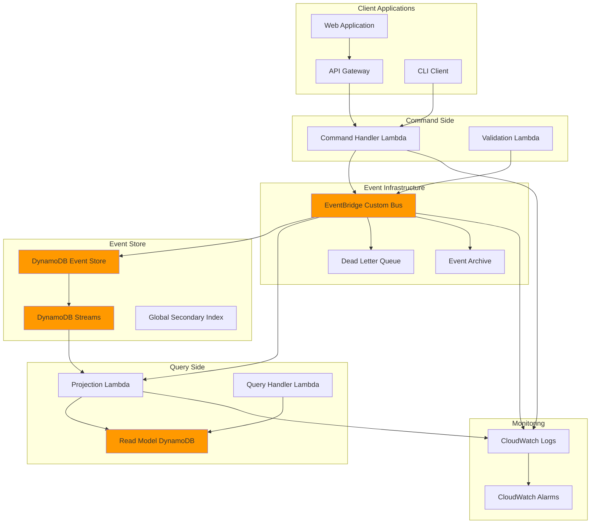

# Event Sourcing with EventBridge and DynamoDB

## Problem

Financial services organizations processing thousands of transactions daily face challenges with maintaining complete audit trails, ensuring data consistency across distributed systems, and implementing reliable event-driven architectures. Traditional approaches using direct database updates make it difficult to reconstruct past states, implement complex business rules, and maintain regulatory compliance for audit requirements. When systems fail or need to replay events, the lack of immutable event history creates significant operational risks and compliance violations.

## Solution

Implement an event sourcing architecture using Amazon EventBridge as the event bus and DynamoDB as the event store. This approach captures all state changes as immutable events, enables complete audit trails, and supports Command Query Responsibility Segregation (CQRS) patterns. EventBridge provides reliable event routing and filtering capabilities while DynamoDB offers high-performance storage for event streams with strong consistency guarantees.

## Architecture Diagram



## Prerequisites

1. AWS account with appropriate permissions for EventBridge, DynamoDB, Lambda, and IAM
2. AWS CLI v2 installed and configured (or AWS CloudShell)
3. Understanding of event sourcing patterns and CQRS concepts
4. Familiarity with JSON and event-driven architectures
5. Knowledge of DynamoDB data modeling and Lambda function development
6. Estimated cost: $10-15 per month for development/testing workloads

> **Note**: This recipe creates production-ready infrastructure components. Monitor costs closely and implement proper cleanup procedures. Review [AWS EventBridge pricing](https://aws.amazon.com/eventbridge/pricing/) and [DynamoDB pricing](https://aws.amazon.com/dynamodb/pricing/) for cost optimization strategies.

## Preparation

```bash
# Set environment variables
export AWS_REGION=$(aws configure get region)
export AWS_ACCOUNT_ID=$(aws sts get-caller-identity \
    --query Account --output text)

# Generate unique identifiers for resources
RANDOM_SUFFIX=$(aws secretsmanager get-random-password \
    --exclude-punctuation --exclude-uppercase \
    --password-length 6 --require-each-included-type \
    --output text --query RandomPassword)

export EVENT_BUS_NAME="event-sourcing-bus-${RANDOM_SUFFIX}"
export EVENT_STORE_TABLE="event-store-${RANDOM_SUFFIX}"
export READ_MODEL_TABLE="read-model-${RANDOM_SUFFIX}"
export COMMAND_FUNCTION="command-handler-${RANDOM_SUFFIX}"
export PROJECTION_FUNCTION="projection-handler-${RANDOM_SUFFIX}"

# Create IAM execution role for Lambda functions
aws iam create-role \
    --role-name event-sourcing-lambda-role \
    --assume-role-policy-document '{
        "Version": "2012-10-17",
        "Statement": [
            {
                "Effect": "Allow",
                "Principal": {
                    "Service": "lambda.amazonaws.com"
                },
                "Action": "sts:AssumeRole"
            }
        ]
    }'

# Attach necessary policies to the role
aws iam attach-role-policy \
    --role-name event-sourcing-lambda-role \
    --policy-arn arn:aws:iam::aws:policy/service-role/AWSLambdaBasicExecutionRole

# Create custom policy for EventBridge and DynamoDB access
aws iam create-policy \
    --policy-name EventSourcingPolicy \
    --policy-document '{
        "Version": "2012-10-17",
        "Statement": [
            {
                "Effect": "Allow",
                "Action": [
                    "events:PutEvents",
                    "events:List*",
                    "events:Describe*"
                ],
                "Resource": "*"
            },
            {
                "Effect": "Allow",
                "Action": [
                    "dynamodb:PutItem",
                    "dynamodb:GetItem",
                    "dynamodb:Query",
                    "dynamodb:Scan",
                    "dynamodb:UpdateItem",
                    "dynamodb:DeleteItem",
                    "dynamodb:BatchGetItem",
                    "dynamodb:BatchWriteItem"
                ],
                "Resource": "*"
            }
        ]
    }'

# Attach custom policy to role
aws iam attach-role-policy \
    --role-name event-sourcing-lambda-role \
    --policy-arn arn:aws:iam::${AWS_ACCOUNT_ID}:policy/EventSourcingPolicy

echo "✅ Environment prepared with unique suffix: ${RANDOM_SUFFIX}"
```

## Steps

1. **Create Custom EventBridge Bus**:

   Amazon EventBridge serves as the central nervous system for event-driven architectures, providing reliable event routing with built-in retry mechanisms and dead letter queues. Creating a custom event bus isolates your event sourcing traffic from the default bus, enabling better security controls and monitoring. This separation is crucial for regulatory compliance in financial services where audit trails must be maintained and events need to be replayed for regulatory investigations.

   ```bash
   # Create custom event bus for event sourcing
   aws events create-event-bus \
       --name ${EVENT_BUS_NAME} \
       --description "Event sourcing bus for financial transactions"
   
   # Enable event archiving for replay capability
   aws events create-archive \
       --archive-name "${EVENT_BUS_NAME}-archive" \
       --event-source-arn "arn:aws:events:${AWS_REGION}:${AWS_ACCOUNT_ID}:event-bus/${EVENT_BUS_NAME}" \
       --retention-days 365 \
       --description "Archive for event replay and audit"
   
   echo "✅ Created EventBridge bus: ${EVENT_BUS_NAME}"
   ```

   The custom event bus is now established as the primary event communication channel, with archiving enabled for long-term retention and replay capabilities. This foundation enables event patterns filtering, cross-account event sharing, and provides the reliability guarantees required for mission-critical financial operations.

2. **Create DynamoDB Event Store Table**:

   DynamoDB serves as the immutable event store, leveraging its single-digit millisecond latency and 99.999% availability to handle high-throughput event ingestion. The composite primary key design (AggregateId, EventSequence) ensures events are stored in chronological order within each aggregate, enabling efficient replay operations. DynamoDB's strong consistency model guarantees that once an event is written, subsequent reads within the same region will reflect that write immediately.

   ```bash
   # Create event store table with composite key for ordering
   aws dynamodb create-table \
       --table-name ${EVENT_STORE_TABLE} \
       --attribute-definitions \
           AttributeName=AggregateId,AttributeType=S \
           AttributeName=EventSequence,AttributeType=N \
           AttributeName=EventType,AttributeType=S \
           AttributeName=Timestamp,AttributeType=S \
       --key-schema \
           AttributeName=AggregateId,KeyType=HASH \
           AttributeName=EventSequence,KeyType=RANGE \
       --global-secondary-indexes \
           IndexName=EventType-Timestamp-index,KeySchema=[{AttributeName=EventType,KeyType=HASH},{AttributeName=Timestamp,KeyType=RANGE}],Projection={ProjectionType=ALL},ProvisionedThroughput={ReadCapacityUnits=5,WriteCapacityUnits=5} \
       --provisioned-throughput ReadCapacityUnits=10,WriteCapacityUnits=10 \
       --stream-specification StreamEnabled=true,StreamViewType=NEW_AND_OLD_IMAGES
   
   # Wait for table to be active
   aws dynamodb wait table-exists \
       --table-name ${EVENT_STORE_TABLE}
   
   echo "✅ Created event store table: ${EVENT_STORE_TABLE}"
   ```

   The event store table is now configured with DynamoDB Streams enabled, which will capture all data modifications and trigger downstream processing. The Global Secondary Index allows efficient querying by event type and timestamp, supporting analytics and monitoring use cases while maintaining optimal performance for the primary append-only workload.

3. **Create Read Model Table**:

   The read model table implements the query side of the CQRS pattern, storing materialized views optimized for read operations. This separation allows the command side to focus on business logic and event generation while the query side provides fast, denormalized data access for user interfaces and reporting. The composite key design supports multiple projection types per aggregate, enabling different views of the same data for various use cases.

   ```bash
   # Create read model table for projections
   aws dynamodb create-table \
       --table-name ${READ_MODEL_TABLE} \
       --attribute-definitions \
           AttributeName=AccountId,AttributeType=S \
           AttributeName=ProjectionType,AttributeType=S \
       --key-schema \
           AttributeName=AccountId,KeyType=HASH \
           AttributeName=ProjectionType,KeyType=RANGE \
       --provisioned-throughput ReadCapacityUnits=5,WriteCapacityUnits=5
   
   # Wait for table to be active
   aws dynamodb wait table-exists \
       --table-name ${READ_MODEL_TABLE}
   
   echo "✅ Created read model table: ${READ_MODEL_TABLE}"
   ```

   The read model table is now ready to receive projected data from the event stream. This table will maintain current state views that can be queried efficiently without reconstructing state from events, providing the performance benefits of denormalized data while maintaining the auditability and consistency guarantees of event sourcing.

4. **Create Command Handler Lambda Function**:

   The command handler implements the write side of the CQRS pattern, transforming business commands into immutable events. Lambda's serverless architecture provides automatic scaling and pay-per-execution pricing, making it ideal for handling variable command loads. The function maintains aggregate consistency by determining the next sequence number and ensures events are durably stored before publishing them to the event bus, implementing the "store first, then publish" pattern for reliability.

   ```bash
   # Create command handler function code
   cat > command-handler.py << 'EOF'
   import json
   import boto3
   import uuid
   from datetime import datetime
   import os
   
   events_client = boto3.client('events')
   dynamodb = boto3.resource('dynamodb')
   table = dynamodb.Table(os.environ['EVENT_STORE_TABLE'])
   
   def lambda_handler(event, context):
       try:
           # Parse command from event
           command = json.loads(event['body']) if 'body' in event else event
           
           # Generate event from command
           event_id = str(uuid.uuid4())
           aggregate_id = command['aggregateId']
           event_type = command['eventType']
           event_data = command['eventData']
           
           # Get next sequence number
           response = table.query(
               KeyConditionExpression='AggregateId = :aid',
               ExpressionAttributeValues={':aid': aggregate_id},
               ScanIndexForward=False,
               Limit=1
           )
           
           next_sequence = 1
           if response['Items']:
               next_sequence = response['Items'][0]['EventSequence'] + 1
           
           # Create event record
           timestamp = datetime.utcnow().isoformat()
           event_record = {
               'EventId': event_id,
               'AggregateId': aggregate_id,
               'EventSequence': next_sequence,
               'EventType': event_type,
               'EventData': event_data,
               'Timestamp': timestamp,
               'Version': '1.0'
           }
           
           # Store event in DynamoDB
           table.put_item(Item=event_record)
           
           # Publish event to EventBridge
           events_client.put_events(
               Entries=[
                   {
                       'Source': 'event-sourcing.financial',
                       'DetailType': event_type,
                       'Detail': json.dumps(event_record),
                       'EventBusName': os.environ['EVENT_BUS_NAME']
                   }
               ]
           )
           
           return {
               'statusCode': 200,
               'body': json.dumps({
                   'eventId': event_id,
                   'aggregateId': aggregate_id,
                   'sequence': next_sequence
               })
           }
           
       except Exception as e:
           print(f"Error: {str(e)}")
           return {
               'statusCode': 500,
               'body': json.dumps({'error': str(e)})
           }
   EOF
   
   # Package and deploy command handler
   zip command-handler.zip command-handler.py
   
   aws lambda create-function \
       --function-name ${COMMAND_FUNCTION} \
       --runtime python3.9 \
       --role arn:aws:iam::${AWS_ACCOUNT_ID}:role/event-sourcing-lambda-role \
       --handler command-handler.lambda_handler \
       --zip-file fileb://command-handler.zip \
       --environment Variables="{EVENT_STORE_TABLE=${EVENT_STORE_TABLE},EVENT_BUS_NAME=${EVENT_BUS_NAME}}" \
       --timeout 30
   
   echo "✅ Created command handler function: ${COMMAND_FUNCTION}"
   ```

   The command handler is now deployed and ready to process business commands. Each command results in a unique event with a guaranteed sequence number, maintaining the invariant that events within an aggregate are totally ordered. The function publishes events to EventBridge only after successful storage, ensuring that downstream consumers never receive notifications for events that haven't been persisted.

5. **Create Projection Handler Lambda Function**:

   The projection handler materializes read models from the event stream, implementing the query side of CQRS. This function processes events asynchronously, building optimized views for different query patterns. Lambda's event-driven nature makes it ideal for this role, automatically scaling based on EventBridge event volume and ensuring projections stay current with minimal latency. The handler supports multiple projection types, allowing different views of the same data for various business needs.

   ```bash
   # Create projection handler function code
   cat > projection-handler.py << 'EOF'
   import json
   import boto3
   import os
   from decimal import Decimal
   
   dynamodb = boto3.resource('dynamodb')
   read_model_table = dynamodb.Table(os.environ['READ_MODEL_TABLE'])
   
   def lambda_handler(event, context):
       try:
           # Process EventBridge events
           for record in event['Records']:
               detail = json.loads(record['body']) if 'body' in record else record['detail']
               
               event_type = detail['EventType']
               aggregate_id = detail['AggregateId']
               event_data = detail['EventData']
               
               # Handle different event types
               if event_type == 'AccountCreated':
                   handle_account_created(aggregate_id, event_data)
               elif event_type == 'TransactionProcessed':
                   handle_transaction_processed(aggregate_id, event_data)
               elif event_type == 'AccountClosed':
                   handle_account_closed(aggregate_id, event_data)
                   
           return {'statusCode': 200}
           
       except Exception as e:
           print(f"Error: {str(e)}")
           return {'statusCode': 500, 'body': json.dumps({'error': str(e)})}
   
   def handle_account_created(aggregate_id, event_data):
       read_model_table.put_item(
           Item={
               'AccountId': aggregate_id,
               'ProjectionType': 'AccountSummary',
               'Balance': Decimal('0.00'),
               'Status': 'Active',
               'CreatedAt': event_data['createdAt'],
               'TransactionCount': 0
           }
       )
   
   def handle_transaction_processed(aggregate_id, event_data):
       # Update account balance
       response = read_model_table.get_item(
           Key={'AccountId': aggregate_id, 'ProjectionType': 'AccountSummary'}
       )
       
       if 'Item' in response:
           current_balance = response['Item']['Balance']
           transaction_count = response['Item']['TransactionCount']
           
           new_balance = current_balance + Decimal(str(event_data['amount']))
           
           read_model_table.update_item(
               Key={'AccountId': aggregate_id, 'ProjectionType': 'AccountSummary'},
               UpdateExpression='SET Balance = :balance, TransactionCount = :count, LastTransactionAt = :timestamp',
               ExpressionAttributeValues={
                   ':balance': new_balance,
                   ':count': transaction_count + 1,
                   ':timestamp': event_data['timestamp']
               }
           )
   
   def handle_account_closed(aggregate_id, event_data):
       read_model_table.update_item(
           Key={'AccountId': aggregate_id, 'ProjectionType': 'AccountSummary'},
           UpdateExpression='SET #status = :status, ClosedAt = :timestamp',
           ExpressionAttributeNames={'#status': 'Status'},
           ExpressionAttributeValues={
               ':status': 'Closed',
               ':timestamp': event_data['closedAt']
           }
       )
   EOF
   
   # Package and deploy projection handler
   zip projection-handler.zip projection-handler.py
   
   aws lambda create-function \
       --function-name ${PROJECTION_FUNCTION} \
       --runtime python3.9 \
       --role arn:aws:iam::${AWS_ACCOUNT_ID}:role/event-sourcing-lambda-role \
       --handler projection-handler.lambda_handler \
       --zip-file fileb://projection-handler.zip \
       --environment Variables="{READ_MODEL_TABLE=${READ_MODEL_TABLE}}" \
       --timeout 30
   
   echo "✅ Created projection handler function: ${PROJECTION_FUNCTION}"
   ```

   The projection handler is now deployed and ready to process events from EventBridge. As events flow through the system, this function maintains current state representations in the read model table, providing fast query access without requiring event replay. The handler implements idempotent processing to handle potential duplicate events gracefully.

6. **Create EventBridge Rules and Targets**:

   EventBridge rules implement intelligent event routing based on event patterns, enabling selective processing of events by different consumers. The rule's event pattern acts as a filter, ensuring only relevant events trigger the projection handler, reducing unnecessary Lambda invocations and costs. This pattern-based routing enables loose coupling between event producers and consumers, allowing the system to evolve independently while maintaining integration.

   ```bash
   # Create rule for all financial events
   aws events put-rule \
       --name "financial-events-rule" \
       --event-pattern '{
           "source": ["event-sourcing.financial"],
           "detail-type": ["AccountCreated", "TransactionProcessed", "AccountClosed"]
       }' \
       --state ENABLED \
       --description "Route financial events to projection handler" \
       --event-bus-name ${EVENT_BUS_NAME}
   
   # Add Lambda target to the rule
   aws events put-targets \
       --rule "financial-events-rule" \
       --event-bus-name ${EVENT_BUS_NAME} \
       --targets "Id"="1","Arn"="arn:aws:lambda:${AWS_REGION}:${AWS_ACCOUNT_ID}:function:${PROJECTION_FUNCTION}"
   
   # Grant EventBridge permission to invoke Lambda
   aws lambda add-permission \
       --function-name ${PROJECTION_FUNCTION} \
       --statement-id "allow-eventbridge-invoke" \
       --action "lambda:InvokeFunction" \
       --principal events.amazonaws.com \
       --source-arn "arn:aws:events:${AWS_REGION}:${AWS_ACCOUNT_ID}:rule/${EVENT_BUS_NAME}/financial-events-rule"
   
   echo "✅ Created EventBridge rules and targets"
   ```

   The EventBridge rule is now configured to route financial events to the projection handler. The event pattern matching ensures only relevant events are processed, while the Lambda permission allows EventBridge to invoke the function. This establishes the real-time data flow from event generation to projection materialization, completing the CQRS read-side implementation.

7. **Create Dead Letter Queue for Failed Events**:

   Dead Letter Queues (DLQs) provide essential reliability for event-driven systems by capturing events that fail processing after multiple retry attempts. This pattern prevents event loss and enables manual inspection and reprocessing of problematic events. In financial systems, this capability is crucial for ensuring no transactions are lost due to temporary processing failures, maintaining data integrity and regulatory compliance.

   ```bash
   # Create DLQ for failed event processing
   aws sqs create-queue \
       --queue-name "event-sourcing-dlq-${RANDOM_SUFFIX}" \
       --attributes '{
           "MessageRetentionPeriod": "1209600",
           "VisibilityTimeoutSeconds": "300"
       }'
   
   # Get DLQ URL
   DLQ_URL=$(aws sqs get-queue-url \
       --queue-name "event-sourcing-dlq-${RANDOM_SUFFIX}" \
       --query 'QueueUrl' --output text)
   
   # Create rule for failed events
   aws events put-rule \
       --name "failed-events-rule" \
       --event-pattern '{
           "source": ["aws.events"],
           "detail-type": ["Event Processing Failed"]
       }' \
       --state ENABLED \
       --event-bus-name ${EVENT_BUS_NAME}
   
   # Add SQS target for failed events
   aws events put-targets \
       --rule "failed-events-rule" \
       --event-bus-name ${EVENT_BUS_NAME} \
       --targets "Id"="1","Arn"="arn:aws:sqs:${AWS_REGION}:${AWS_ACCOUNT_ID}:event-sourcing-dlq-${RANDOM_SUFFIX}"
   
   echo "✅ Created dead letter queue: ${DLQ_URL}"
   ```

   The dead letter queue infrastructure is now established to handle processing failures gracefully. Failed events will be retained for 14 days (1209600 seconds) in the DLQ, allowing operations teams to investigate issues and reprocess events after resolving the underlying problems. This setup ensures system resilience and maintains event processing guarantees even during component failures.

8. **Set up CloudWatch Monitoring**:

   CloudWatch monitoring provides essential observability for event-driven systems, tracking key performance indicators and alerting on anomalies. The alarms monitor critical failure modes: DynamoDB throttling (indicating capacity issues), Lambda errors (indicating processing failures), and EventBridge invocation failures (indicating routing issues). This comprehensive monitoring ensures rapid detection and resolution of issues that could impact system reliability.

   ```bash
   # Create CloudWatch alarms for monitoring
   aws cloudwatch put-metric-alarm \
       --alarm-name "EventStore-WriteThrottles" \
       --alarm-description "DynamoDB write throttles on event store" \
       --metric-name WriteThrottleEvents \
       --namespace AWS/DynamoDB \
       --statistic Sum \
       --period 300 \
       --threshold 5 \
       --comparison-operator GreaterThanThreshold \
       --evaluation-periods 2 \
       --dimensions Name=TableName,Value=${EVENT_STORE_TABLE}
   
   # Create alarm for Lambda errors
   aws cloudwatch put-metric-alarm \
       --alarm-name "CommandHandler-Errors" \
       --alarm-description "High error rate in command handler" \
       --metric-name Errors \
       --namespace AWS/Lambda \
       --statistic Sum \
       --period 300 \
       --threshold 10 \
       --comparison-operator GreaterThanThreshold \
       --evaluation-periods 2 \
       --dimensions Name=FunctionName,Value=${COMMAND_FUNCTION}
   
   # Create alarm for event bus failed invocations
   aws cloudwatch put-metric-alarm \
       --alarm-name "EventBridge-FailedInvocations" \
       --alarm-description "High number of failed event invocations" \
       --metric-name FailedInvocations \
       --namespace AWS/Events \
       --statistic Sum \
       --period 300 \
       --threshold 5 \
       --comparison-operator GreaterThanThreshold \
       --evaluation-periods 2 \
       --dimensions Name=EventBusName,Value=${EVENT_BUS_NAME}
   
   echo "✅ Created CloudWatch monitoring alarms"
   ```

   The monitoring infrastructure is now active, providing real-time visibility into system health and performance. These alarms will trigger when issues occur, enabling proactive response to problems before they impact users. The monitoring strategy covers the entire event processing pipeline from ingestion to projection, ensuring comprehensive observability of the event sourcing system.

9. **Configure Event Replay Capability**:

   Event replay is a powerful capability unique to event sourcing systems, enabling temporal debugging, disaster recovery, and system testing. EventBridge's replay feature allows you to reprocess events from the archive, feeding them back into the system as if they occurred in real-time. This capability is invaluable for recovering from failures, testing new projections against historical data, or analyzing system behavior during specific time periods.

   ```bash
   # Create event replay configuration
   cat > replay-config.json << EOF
   {
       "EventSourceArn": "arn:aws:events:${AWS_REGION}:${AWS_ACCOUNT_ID}:event-bus/${EVENT_BUS_NAME}",
       "EventStartTime": "$(date -u -d '1 hour ago' +%Y-%m-%dT%H:%M:%SZ)",
       "EventEndTime": "$(date -u +%Y-%m-%dT%H:%M:%SZ)",
       "Destination": {
           "Arn": "arn:aws:events:${AWS_REGION}:${AWS_ACCOUNT_ID}:event-bus/${EVENT_BUS_NAME}",
           "FilterArns": []
       },
       "ReplayName": "financial-events-replay-$(date +%s)"
   }
   EOF
   
   # Create a sample replay (this will be used later for testing)
   echo "✅ Event replay configuration created"
   ```

   The replay configuration template is now ready for disaster recovery and testing scenarios. When needed, you can initiate replays to reprocess events from specific time windows, enabling recovery from projection failures or validation of new business logic against historical data. This capability transforms event sourcing from a storage pattern into a time-travel debugging tool.

10. **Create Query Handler for Event Reconstruction**:

    The query handler demonstrates event sourcing's most powerful feature: the ability to reconstruct any aggregate's state at any point in time by replaying events. This temporal querying capability enables sophisticated debugging, audit trails, and regulatory compliance reporting. The handler supports both current state queries (using projections) and historical state reconstruction (using event replay), providing the flexibility needed for complex business scenarios.

    ```bash
    # Create query handler for event reconstruction
    cat > query-handler.py << 'EOF'
    import json
    import boto3
    import os
    from boto3.dynamodb.conditions import Key
    
    dynamodb = boto3.resource('dynamodb')
    event_store_table = dynamodb.Table(os.environ['EVENT_STORE_TABLE'])
    read_model_table = dynamodb.Table(os.environ['READ_MODEL_TABLE'])
    
    def lambda_handler(event, context):
        try:
            query_type = event['queryType']
            
            if query_type == 'getAggregateEvents':
                return get_aggregate_events(event['aggregateId'])
            elif query_type == 'getAccountSummary':
                return get_account_summary(event['accountId'])
            elif query_type == 'reconstructState':
                return reconstruct_state(event['aggregateId'], event.get('upToSequence'))
            else:
                return {'statusCode': 400, 'body': json.dumps({'error': 'Unknown query type'})}
                
        except Exception as e:
            print(f"Error: {str(e)}")
            return {'statusCode': 500, 'body': json.dumps({'error': str(e)})}
    
    def get_aggregate_events(aggregate_id):
        response = event_store_table.query(
            KeyConditionExpression=Key('AggregateId').eq(aggregate_id),
            ScanIndexForward=True
        )
        
        return {
            'statusCode': 200,
            'body': json.dumps({
                'aggregateId': aggregate_id,
                'events': response['Items']
            }, default=str)
        }
    
    def get_account_summary(account_id):
        response = read_model_table.get_item(
            Key={'AccountId': account_id, 'ProjectionType': 'AccountSummary'}
        )
        
        if 'Item' in response:
            return {
                'statusCode': 200,
                'body': json.dumps(response['Item'], default=str)
            }
        else:
            return {'statusCode': 404, 'body': json.dumps({'error': 'Account not found'})}
    
    def reconstruct_state(aggregate_id, up_to_sequence=None):
        # Reconstruct state by replaying events
        key_condition = Key('AggregateId').eq(aggregate_id)
        
        if up_to_sequence:
            key_condition = key_condition & Key('EventSequence').lte(up_to_sequence)
        
        response = event_store_table.query(
            KeyConditionExpression=key_condition,
            ScanIndexForward=True
        )
        
        # Replay events to reconstruct state
        state = {'balance': 0, 'status': 'Unknown', 'transactionCount': 0}
        
        for event in response['Items']:
            event_type = event['EventType']
            event_data = event['EventData']
            
            if event_type == 'AccountCreated':
                state['status'] = 'Active'
                state['createdAt'] = event_data['createdAt']
            elif event_type == 'TransactionProcessed':
                state['balance'] += float(event_data['amount'])
                state['transactionCount'] += 1
            elif event_type == 'AccountClosed':
                state['status'] = 'Closed'
                state['closedAt'] = event_data['closedAt']
        
        return {
            'statusCode': 200,
            'body': json.dumps({
                'aggregateId': aggregate_id,
                'reconstructedState': state,
                'eventsProcessed': len(response['Items'])
            }, default=str)
        }
    EOF
    
    # Package and deploy query handler
    zip query-handler.zip query-handler.py
    
    aws lambda create-function \
        --function-name "query-handler-${RANDOM_SUFFIX}" \
        --runtime python3.9 \
        --role arn:aws:iam::${AWS_ACCOUNT_ID}:role/event-sourcing-lambda-role \
        --handler query-handler.lambda_handler \
        --zip-file fileb://query-handler.zip \
        --environment Variables="{EVENT_STORE_TABLE=${EVENT_STORE_TABLE},READ_MODEL_TABLE=${READ_MODEL_TABLE}}" \
        --timeout 30
    
    echo "✅ Created query handler function: query-handler-${RANDOM_SUFFIX}"
    ```

    The query handler is now deployed, providing comprehensive querying capabilities for the event sourcing system. This function enables fast current state queries via projections and powerful historical state reconstruction via event replay. The ability to reconstruct state at any point in time makes this system ideal for financial applications requiring complete audit trails and regulatory compliance.

## Validation & Testing

1. **Test Command Processing**:

   ```bash
   # Test account creation command
   aws lambda invoke \
       --function-name ${COMMAND_FUNCTION} \
       --payload '{
           "aggregateId": "account-123",
           "eventType": "AccountCreated",
           "eventData": {
               "accountId": "account-123",
               "customerId": "customer-456",
               "accountType": "checking",
               "createdAt": "2024-01-15T10:00:00Z"
           }
       }' \
       response.json
   
   # Check response
   cat response.json
   ```

   Expected output: JSON with eventId, aggregateId, and sequence number

2. **Test Transaction Processing**:

   ```bash
   # Test transaction processing
   aws lambda invoke \
       --function-name ${COMMAND_FUNCTION} \
       --payload '{
           "aggregateId": "account-123",
           "eventType": "TransactionProcessed",
           "eventData": {
               "transactionId": "tx-789",
               "amount": 100.50,
               "type": "deposit",
               "timestamp": "2024-01-15T10:30:00Z"
           }
       }' \
       response2.json
   
   # Check response
   cat response2.json
   ```

3. **Verify Event Store**:

   ```bash
   # Query events from event store
   aws dynamodb query \
       --table-name ${EVENT_STORE_TABLE} \
       --key-condition-expression "AggregateId = :aid" \
       --expression-attribute-values '{":aid": {"S": "account-123"}}' \
       --scan-index-forward
   ```

   Expected output: JSON array with all events for the aggregate

4. **Verify Read Model Projection**:

   ```bash
   # Wait for projection to complete
   sleep 10
   
   # Check read model
   aws dynamodb get-item \
       --table-name ${READ_MODEL_TABLE} \
       --key '{
           "AccountId": {"S": "account-123"},
           "ProjectionType": {"S": "AccountSummary"}
       }'
   ```

   Expected output: Account summary with updated balance

5. **Test Event Reconstruction**:

   ```bash
   # Test state reconstruction
   aws lambda invoke \
       --function-name "query-handler-${RANDOM_SUFFIX}" \
       --payload '{
           "queryType": "reconstructState",
           "aggregateId": "account-123"
       }' \
       reconstruction.json
   
   # Check reconstruction result
   cat reconstruction.json
   ```

## Cleanup

1. **Delete Lambda Functions**:

   ```bash
   # Delete Lambda functions
   aws lambda delete-function \
       --function-name ${COMMAND_FUNCTION}
   
   aws lambda delete-function \
       --function-name ${PROJECTION_FUNCTION}
   
   aws lambda delete-function \
       --function-name "query-handler-${RANDOM_SUFFIX}"
   
   echo "✅ Deleted Lambda functions"
   ```

2. **Delete EventBridge Resources**:

   ```bash
   # Remove targets from rules
   aws events remove-targets \
       --rule "financial-events-rule" \
       --event-bus-name ${EVENT_BUS_NAME} \
       --ids "1"
   
   # Delete rules
   aws events delete-rule \
       --name "financial-events-rule" \
       --event-bus-name ${EVENT_BUS_NAME}
   
   # Delete archive
   aws events delete-archive \
       --archive-name "${EVENT_BUS_NAME}-archive"
   
   # Delete custom event bus
   aws events delete-event-bus \
       --name ${EVENT_BUS_NAME}
   
   echo "✅ Deleted EventBridge resources"
   ```

3. **Delete DynamoDB Tables**:

   ```bash
   # Delete DynamoDB tables
   aws dynamodb delete-table \
       --table-name ${EVENT_STORE_TABLE}
   
   aws dynamodb delete-table \
       --table-name ${READ_MODEL_TABLE}
   
   echo "✅ Deleted DynamoDB tables"
   ```

4. **Delete SQS Queue**:

   ```bash
   # Delete SQS DLQ
   aws sqs delete-queue \
       --queue-url "${DLQ_URL}"
   
   echo "✅ Deleted SQS queue"
   ```

5. **Delete CloudWatch Alarms**:

   ```bash
   # Delete CloudWatch alarms
   aws cloudwatch delete-alarms \
       --alarm-names "EventStore-WriteThrottles" \
           "CommandHandler-Errors" \
           "EventBridge-FailedInvocations"
   
   echo "✅ Deleted CloudWatch alarms"
   ```

6. **Delete IAM Resources**:

   ```bash
   # Detach policies from role
   aws iam detach-role-policy \
       --role-name event-sourcing-lambda-role \
       --policy-arn arn:aws:iam::aws:policy/service-role/AWSLambdaBasicExecutionRole
   
   aws iam detach-role-policy \
       --role-name event-sourcing-lambda-role \
       --policy-arn arn:aws:iam::${AWS_ACCOUNT_ID}:policy/EventSourcingPolicy
   
   # Delete custom policy
   aws iam delete-policy \
       --policy-arn arn:aws:iam::${AWS_ACCOUNT_ID}:policy/EventSourcingPolicy
   
   # Delete role
   aws iam delete-role \
       --role-name event-sourcing-lambda-role
   
   echo "✅ Deleted IAM resources"
   ```

7. **Clean up local files**:

   ```bash
   # Remove local files
   rm -f command-handler.py command-handler.zip
   rm -f projection-handler.py projection-handler.zip
   rm -f query-handler.py query-handler.zip
   rm -f response.json response2.json reconstruction.json
   rm -f replay-config.json
   
   # Clear environment variables
   unset EVENT_BUS_NAME EVENT_STORE_TABLE READ_MODEL_TABLE
   unset COMMAND_FUNCTION PROJECTION_FUNCTION RANDOM_SUFFIX
   
   echo "✅ Cleaned up local files and environment"
   ```

## Discussion

This event sourcing architecture provides a robust foundation for building scalable, auditable, and maintainable event-driven systems. The combination of EventBridge and DynamoDB offers several key advantages over traditional database-centric approaches, as outlined in the [AWS Prescriptive Guidance for Event Sourcing](https://docs.aws.amazon.com/prescriptive-guidance/latest/modernization-data-persistence/service-per-team.html).

**Event Store Design**: The DynamoDB event store uses a composite primary key (AggregateId, EventSequence) to ensure proper ordering of events within each aggregate. The Global Secondary Index on EventType and Timestamp enables efficient querying across event types for analytics and monitoring purposes. [DynamoDB Streams](https://docs.aws.amazon.com/amazondynamodb/latest/developerguide/Streams.html) automatically capture changes and trigger projection updates, ensuring eventual consistency between the event store and read models.

**CQRS Implementation**: The architecture implements [Command Query Responsibility Segregation](https://docs.aws.amazon.com/prescriptive-guidance/latest/modernization-data-persistence/cqrs-pattern.html) by separating write operations (commands) from read operations (queries). Commands are processed by the command handler, validated, and converted to events. The projection handler creates and maintains optimized read models that can be queried efficiently. This separation allows for independent scaling of read and write workloads and supports multiple specialized read models for different use cases.

**Event Ordering and Consistency**: EventBridge provides at-least-once delivery guarantees, while the event store ensures strict ordering within aggregates through the sequence number. For cross-aggregate consistency, the system relies on eventual consistency patterns. Critical business rules requiring strong consistency should be implemented within aggregate boundaries. The architecture supports idempotent event processing to handle duplicate events gracefully.

> **Tip**: Implement event versioning from the beginning by including version fields in event schemas. This enables backward compatibility as business requirements evolve and new event types are introduced. See the [AWS EventBridge schema registry documentation](https://docs.aws.amazon.com/eventbridge/latest/userguide/eb-schema-registry.html) for guidance on managing event schema evolution.

> **Warning**: Ensure proper IAM permissions are configured to prevent unauthorized access to event streams. Use the [principle of least privilege](https://docs.aws.amazon.com/IAM/latest/UserGuide/best-practices.html#grant-least-privilege) when configuring Lambda execution roles and DynamoDB table permissions.

**Monitoring and Observability**: CloudWatch alarms monitor key metrics including DynamoDB throttling, Lambda errors, and EventBridge failed invocations. The dead letter queue captures failed events for manual inspection and reprocessing. Event archives enable replay capabilities for disaster recovery, testing, and debugging scenarios. Consider implementing distributed tracing using AWS X-Ray to track events across service boundaries.

For production deployments, consider implementing event schema validation, encryption for sensitive data, and cross-region replication for disaster recovery. The architecture scales horizontally by partitioning aggregates across multiple event store tables and implementing consistent hashing for routing.

## Challenge

Extend this solution by implementing these enhancements:

1. **Event Schema Registry**: Implement a schema registry using AWS Glue Schema Registry to validate event structures and support schema evolution with backward compatibility.

2. **Snapshot Implementation**: Create periodic snapshots of aggregate state to optimize reconstruction performance for aggregates with many events, storing snapshots in a separate DynamoDB table.

3. **Cross-Region Replication**: Set up DynamoDB Global Tables for the event store and implement cross-region EventBridge replication for disaster recovery and global availability.

4. **Advanced Event Replay**: Build a replay management system that can selectively replay events based on filters, handle event transformations during replay, and support branching scenarios for testing.

5. **Saga Pattern Implementation**: Implement distributed transactions using the Saga pattern with EventBridge, handling compensation events and maintaining transaction state across multiple aggregates.

## Infrastructure Code

*Infrastructure code will be generated after recipe approval.*