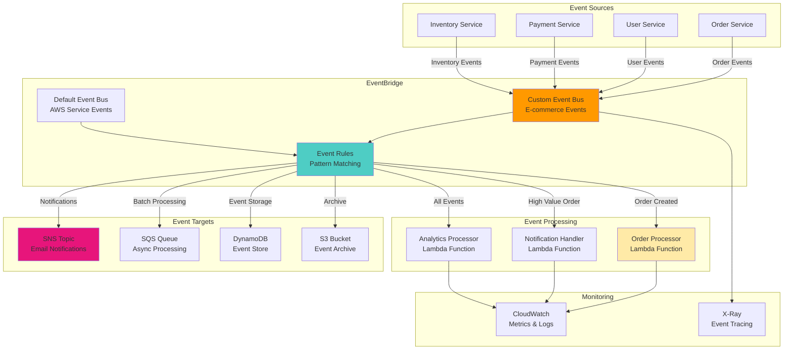

# Event-Driven Architecture with EventBridge

## Problem

Your organization has multiple microservices and applications that need to communicate with each other in a loosely coupled manner. Traditional point-to-point integrations create tight coupling, making systems difficult to maintain and scale. You need a solution that enables event-driven communication between services, supports multiple event sources and targets, provides event filtering and routing capabilities, and allows for easy addition of new services without modifying existing integrations.

## Solution

Implement a comprehensive event-driven architecture using Amazon EventBridge with custom event buses, rules for event routing, and multiple targets for event processing. This solution provides decoupled communication between services, automatic scaling and reliability, built-in event filtering and transformation, and seamless integration with AWS services and third-party applications. The architecture demonstrates event publishing, routing, processing, and monitoring patterns essential for modern microservices architectures.

## Architecture Diagram



## Prerequisites

1. AWS account with permissions to create EventBridge resources, Lambda functions, and IAM roles
2. AWS CLI v2 installed and configured with appropriate credentials
3. Basic understanding of event-driven architecture and microservices patterns
4. Python 3.9+ for Lambda functions and event simulation
5. Understanding of JSON event patterns and filtering
6. Estimated cost: EventBridge (~$1.00/million events), Lambda (~$0.20/million requests), SNS (~$0.50/million notifications)

> **Note**: EventBridge provides a generous free tier with 100 million events per month at no charge.

## Preparation

```bash
# Set environment variables
export AWS_REGION=$(aws configure get region)
export AWS_ACCOUNT_ID=$(aws sts get-caller-identity \
    --query Account --output text)

# Generate unique identifiers
RANDOM_SUFFIX=$(aws secretsmanager get-random-password \
    --exclude-punctuation --exclude-uppercase \
    --password-length 6 --require-each-included-type \
    --output text --query RandomPassword)

export EVENT_BUS_NAME="ecommerce-events-${RANDOM_SUFFIX}"
export SNS_TOPIC_NAME="order-notifications-${RANDOM_SUFFIX}"
export SQS_QUEUE_NAME="event-processing-${RANDOM_SUFFIX}"
export LAMBDA_FUNCTION_NAME="event-processor-${RANDOM_SUFFIX}"

echo "✅ Environment variables configured"
echo "Event Bus: ${EVENT_BUS_NAME}"
```

## Steps

1. **Create custom EventBridge event bus**:

   Custom event buses provide logical separation between different applications and business domains. Amazon EventBridge supports up to 100 custom event buses per region, allowing you to organize events by business domain or application lifecycle. Creating a dedicated event bus for your e-commerce application ensures event isolation, enables fine-grained access control, and allows independent scaling of different event workflows. For detailed information on event bus concepts, see the [Amazon EventBridge documentation](https://docs.aws.amazon.com/eventbridge/latest/userguide/eb-what-is-how-it-works-concepts.html).

   ```bash
   # Create custom event bus
   aws events create-event-bus \
       --name ${EVENT_BUS_NAME} \
       --tags Key=Name,Value=${EVENT_BUS_NAME} \
           Key=Purpose,Value=ECommerce-Events
   
   # Get event bus ARN
   EVENT_BUS_ARN=$(aws events describe-event-bus \
       --name ${EVENT_BUS_NAME} \
       --query 'Arn' --output text)
   
   echo "✅ Created custom event bus"
   echo "Event Bus ARN: ${EVENT_BUS_ARN}"
   ```

   Your custom event bus is now ready to receive and route events. This separation from the default event bus provides better security boundaries and enables precise monitoring of your application's event traffic.

2. **Create SNS topic and SQS queue for event targets**:

   SNS and SQS provide reliable event delivery mechanisms for different use cases. SNS enables fan-out messaging for notifications with up to 12.5 million subscriptions per topic, while SQS provides durable queuing for asynchronous processing with at-least-once delivery guarantees. These services ensure your events are delivered reliably even during peak traffic or downstream service outages. For guidance on choosing between these services, see the [Amazon SQS, SNS, or EventBridge decision guide](https://docs.aws.amazon.com/decision-guides/latest/sns-or-sqs-or-eventbridge/sns-or-sqs-or-eventbridge.html).

   ```bash
   # Create SNS topic for notifications
   SNS_TOPIC_ARN=$(aws sns create-topic \
       --name ${SNS_TOPIC_NAME} \
       --query 'TopicArn' --output text)
   
   # Create SQS queue for batch processing
   SQS_QUEUE_URL=$(aws sqs create-queue \
       --queue-name ${SQS_QUEUE_NAME} \
       --attributes '{
         "VisibilityTimeoutSeconds": "300",
         "MessageRetentionPeriod": "1209600"
       }' \
       --query 'QueueUrl' --output text)
   
   # Get SQS queue ARN
   SQS_QUEUE_ARN=$(aws sqs get-queue-attributes \
       --queue-url ${SQS_QUEUE_URL} \
       --attribute-names QueueArn \
       --query 'Attributes.QueueArn' --output text)
   
   echo "✅ Created SNS topic and SQS queue"
   echo "SNS Topic ARN: ${SNS_TOPIC_ARN}"
   echo "SQS Queue ARN: ${SQS_QUEUE_ARN}"
   ```

   Your event delivery infrastructure is now established with both immediate notification (SNS) and durable processing (SQS) capabilities. These services provide redundant delivery paths and support different consumption patterns based on your application requirements.

3. **Create IAM role for EventBridge**:

   EventBridge requires proper IAM permissions to deliver events to target services like SNS, SQS, and Lambda. Creating a dedicated service role follows the principle of least privilege, one of the core [IAM security best practices](https://docs.aws.amazon.com/IAM/latest/UserGuide/best-practices.html), by granting only the necessary permissions for event routing and delivery. This approach reduces security risks and ensures compliance with AWS security recommendations.

   ```bash
   # Create trust policy for EventBridge
   cat > eventbridge-trust-policy.json << 'EOF'
   {
     "Version": "2012-10-17",
     "Statement": [
       {
         "Effect": "Allow",
         "Principal": {
           "Service": "events.amazonaws.com"
         },
         "Action": "sts:AssumeRole"
       }
     ]
   }
   EOF
   
   # Create IAM role
   aws iam create-role \
       --role-name EventBridgeExecutionRole \
       --assume-role-policy-document file://eventbridge-trust-policy.json
   
   # Create policy for EventBridge targets
   cat > eventbridge-targets-policy.json << EOF
   {
     "Version": "2012-10-17",
     "Statement": [
       {
         "Effect": "Allow",
         "Action": [
           "sns:Publish"
         ],
         "Resource": "${SNS_TOPIC_ARN}"
       },
       {
         "Effect": "Allow",
         "Action": [
           "sqs:SendMessage"
         ],
         "Resource": "${SQS_QUEUE_ARN}"
       },
       {
         "Effect": "Allow",
         "Action": [
           "lambda:InvokeFunction"
         ],
         "Resource": "*"
       }
     ]
   }
   EOF
   
   aws iam put-role-policy \
       --role-name EventBridgeExecutionRole \
       --policy-name EventBridgeTargetsPolicy \
       --policy-document file://eventbridge-targets-policy.json
   
   # Get role ARN
   EVENTBRIDGE_ROLE_ARN=$(aws iam get-role \
       --role-name EventBridgeExecutionRole \
       --query 'Role.Arn' --output text)
   
   echo "✅ Created IAM role for EventBridge"
   ```

   EventBridge now has the necessary permissions to route events to your target services. This role enables secure cross-service communication while maintaining the principle of least privilege access.

4. **Create Lambda function for event processing**:

   Lambda functions provide serverless event processing capabilities that automatically scale based on event volume, handling up to 1,000 concurrent executions by default. This function demonstrates how to process different event types, extract business logic, and trigger appropriate downstream actions based on event content. Lambda is a key component in [event-driven architectures](https://docs.aws.amazon.com/lambda/latest/dg/concepts-event-driven-architectures.html), providing cost-effective processing that only charges for actual compute time used.

   ```bash
   # Create Lambda trust policy
   cat > lambda-trust-policy.json << 'EOF'
   {
     "Version": "2012-10-17",
     "Statement": [
       {
         "Effect": "Allow",
         "Principal": {
           "Service": "lambda.amazonaws.com"
         },
         "Action": "sts:AssumeRole"
       }
     ]
   }
   EOF
   
   aws iam create-role \
       --role-name EventProcessorLambdaRole \
       --assume-role-policy-document file://lambda-trust-policy.json
   
   aws iam attach-role-policy \
       --role-name EventProcessorLambdaRole \
       --policy-arn arn:aws:iam::aws:policy/service-role/AWSLambdaBasicExecutionRole
   
   # Get Lambda role ARN
   LAMBDA_ROLE_ARN=$(aws iam get-role \
       --role-name EventProcessorLambdaRole \
       --query 'Role.Arn' --output text)
   
   # Create Lambda function
   cat > event_processor.py << 'EOF'
   import json
   import logging
   from datetime import datetime
   
   # Configure logging
   logger = logging.getLogger()
   logger.setLevel(logging.INFO)
   
   def lambda_handler(event, context):
       """Process EventBridge events"""
       
       try:
           logger.info(f"Received event: {json.dumps(event, indent=2)}")
           
           # Extract event details
           event_source = event.get('source', 'unknown')
           event_type = event.get('detail-type', 'unknown')
           event_detail = event.get('detail', {})
           
           # Process based on event type
           result = process_event(event_source, event_type, event_detail)
           
           return {
               'statusCode': 200,
               'body': json.dumps({
                   'message': 'Event processed successfully',
                   'eventSource': event_source,
                   'eventType': event_type,
                   'result': result,
                   'timestamp': datetime.utcnow().isoformat()
               })
           }
           
       except Exception as e:
           logger.error(f"Error processing event: {str(e)}")
           return {
               'statusCode': 500,
               'body': json.dumps({'error': str(e)})
           }
   
   def process_event(source, event_type, detail):
       """Process different types of events"""
       
       if source == 'ecommerce.orders':
           return process_order_event(event_type, detail)
       elif source == 'ecommerce.users':
           return process_user_event(event_type, detail)
       elif source == 'ecommerce.payments':
           return process_payment_event(event_type, detail)
       else:
           return process_generic_event(event_type, detail)
   
   def process_order_event(event_type, detail):
       """Process order-related events"""
       
       if event_type == 'Order Created':
           order_id = detail.get('orderId')
           customer_id = detail.get('customerId')
           total_amount = detail.get('totalAmount', 0)
           
           logger.info(f"Processing new order: {order_id} for customer {customer_id}")
           
           # Business logic for order processing
           result = {
               'action': 'order_processed',
               'orderId': order_id,
               'customerId': customer_id,
               'totalAmount': total_amount,
               'priority': 'high' if total_amount > 1000 else 'normal'
           }
           
           return result
           
       elif event_type == 'Order Cancelled':
           order_id = detail.get('orderId')
           logger.info(f"Processing order cancellation: {order_id}")
           
           return {
               'action': 'order_cancelled',
               'orderId': order_id
           }
       
       return {'action': 'order_event_processed'}
   
   def process_user_event(event_type, detail):
       """Process user-related events"""
       
       if event_type == 'User Registered':
           user_id = detail.get('userId')
           email = detail.get('email')
           
           logger.info(f"Processing new user registration: {user_id}")
           
           return {
               'action': 'user_registered',
               'userId': user_id,
               'email': email,
               'welcomeEmailSent': True
           }
       
       return {'action': 'user_event_processed'}
   
   def process_payment_event(event_type, detail):
       """Process payment-related events"""
       
       if event_type == 'Payment Processed':
           payment_id = detail.get('paymentId')
           amount = detail.get('amount')
           
           logger.info(f"Processing payment: {payment_id} for amount {amount}")
           
           return {
               'action': 'payment_processed',
               'paymentId': payment_id,
               'amount': amount
           }
       
       return {'action': 'payment_event_processed'}
   
   def process_generic_event(event_type, detail):
       """Process generic events"""
       
       logger.info(f"Processing generic event: {event_type}")
       
       return {
           'action': 'generic_event_processed',
           'eventType': event_type
       }
   EOF
   
   # Create deployment package
   zip event_processor.zip event_processor.py
   
   # Create Lambda function
   LAMBDA_FUNCTION_ARN=$(aws lambda create-function \
       --function-name ${LAMBDA_FUNCTION_NAME} \
       --runtime python3.9 \
       --role ${LAMBDA_ROLE_ARN} \
       --handler event_processor.lambda_handler \
       --zip-file fileb://event_processor.zip \
       --timeout 30 \
       --memory-size 256 \
       --query 'FunctionArn' --output text)
   
   echo "✅ Created Lambda function for event processing"
   ```

   Your event processing logic is now deployed and ready to handle incoming events. The Lambda function provides automatic scaling, built-in monitoring, and cost-effective processing that only charges for actual event handling time.

5. **Create EventBridge rules for different event patterns**:

   EventBridge rules enable sophisticated event filtering and routing based on event content, source, and patterns. Each rule can support up to 5 targets and uses [event patterns](https://docs.aws.amazon.com/eventbridge/latest/userguide/eb-event-patterns.html) for precise event matching. These rules demonstrate how to create targeted processing workflows that respond to specific business events while ignoring irrelevant traffic, following [EventBridge rule best practices](https://docs.aws.amazon.com/eventbridge/latest/userguide/eb-rules-best-practices.html).

   ```bash
   # Rule 1: Route all order events to Lambda
   aws events put-rule \
       --name "OrderEventsRule" \
       --event-bus-name ${EVENT_BUS_NAME} \
       --event-pattern '{
         "source": ["ecommerce.orders"],
         "detail-type": ["Order Created", "Order Updated", "Order Cancelled"]
       }' \
       --description "Route order events to Lambda processor"
   
   # Add Lambda target to order events rule
   aws events put-targets \
       --rule "OrderEventsRule" \
       --event-bus-name ${EVENT_BUS_NAME} \
       --targets "Id"="1","Arn"="${LAMBDA_FUNCTION_ARN}"
   
   # Grant EventBridge permission to invoke Lambda
   aws lambda add-permission \
       --function-name ${LAMBDA_FUNCTION_NAME} \
       --statement-id allow-eventbridge-order-events \
       --action lambda:InvokeFunction \
       --principal events.amazonaws.com \
       --source-arn "arn:aws:events:${AWS_REGION}:${AWS_ACCOUNT_ID}:rule/${EVENT_BUS_NAME}/OrderEventsRule"
   
   # Rule 2: Route high-value orders to SNS for immediate notification
   aws events put-rule \
       --name "HighValueOrdersRule" \
       --event-bus-name ${EVENT_BUS_NAME} \
       --event-pattern '{
         "source": ["ecommerce.orders"],
         "detail-type": ["Order Created"],
         "detail": {
           "totalAmount": [{"numeric": [">", 1000]}]
         }
       }' \
       --description "Route high-value orders to SNS for notifications"
   
   # Add SNS target to high-value orders rule
   aws events put-targets \
       --rule "HighValueOrdersRule" \
       --event-bus-name ${EVENT_BUS_NAME} \
       --targets "Id"="1","Arn"="${SNS_TOPIC_ARN}","RoleArn"="${EVENTBRIDGE_ROLE_ARN}"
   
   # Rule 3: Route all events to SQS for batch processing
   aws events put-rule \
       --name "AllEventsToSQSRule" \
       --event-bus-name ${EVENT_BUS_NAME} \
       --event-pattern '{
         "source": ["ecommerce.orders", "ecommerce.users", "ecommerce.payments"]
       }' \
       --description "Route all events to SQS for batch processing"
   
   # Add SQS target to all events rule
   aws events put-targets \
       --rule "AllEventsToSQSRule" \
       --event-bus-name ${EVENT_BUS_NAME} \
       --targets "Id"="1","Arn"="${SQS_QUEUE_ARN}","RoleArn"="${EVENTBRIDGE_ROLE_ARN}"
   
   # Rule 4: Route user registration events to Lambda
   aws events put-rule \
       --name "UserRegistrationRule" \
       --event-bus-name ${EVENT_BUS_NAME} \
       --event-pattern '{
         "source": ["ecommerce.users"],
         "detail-type": ["User Registered"]
       }' \
       --description "Route user registration events to Lambda"
   
   # Add Lambda target to user registration rule
   aws events put-targets \
       --rule "UserRegistrationRule" \
       --event-bus-name ${EVENT_BUS_NAME} \
       --targets "Id"="1","Arn"="${LAMBDA_FUNCTION_ARN}"
   
   # Grant EventBridge permission to invoke Lambda for user events
   aws lambda add-permission \
       --function-name ${LAMBDA_FUNCTION_NAME} \
       --statement-id allow-eventbridge-user-events \
       --action lambda:InvokeFunction \
       --principal events.amazonaws.com \
       --source-arn "arn:aws:events:${AWS_REGION}:${AWS_ACCOUNT_ID}:rule/${EVENT_BUS_NAME}/UserRegistrationRule"
   
   echo "✅ Created EventBridge rules for event routing"
   ```

   Your event routing logic is now configured to automatically direct different event types to appropriate processing targets. This pattern-based routing enables sophisticated workflows and ensures events reach the right consumers efficiently.

6. **Create event publisher script**:

   Event publishing scripts simulate real-world applications sending business events to your EventBridge infrastructure. EventBridge can handle up to 10,000 events per second with automatic scaling, making it suitable for high-throughput applications. These scripts demonstrate proper event formatting, metadata inclusion, and batch publishing techniques for optimal performance and cost efficiency, following AWS event-driven architecture patterns.

   ```bash
   # Create event publisher script
   cat > event_publisher.py << EOF
   #!/usr/bin/env python3
   import boto3
   import json
   import random
   import uuid
   from datetime import datetime, timezone
   import argparse
   
   # Initialize EventBridge client
   eventbridge = boto3.client('events')
   
   EVENT_BUS_NAME = '${EVENT_BUS_NAME}'
   
   def publish_order_event(event_type='Order Created'):
       """Publish order-related events"""
       
       order_id = str(uuid.uuid4())
       customer_id = f'customer_{random.randint(1000, 9999)}'
       total_amount = round(random.uniform(50.0, 2000.0), 2)
       
       event = {
           'Source': 'ecommerce.orders',
           'DetailType': event_type,
           'Detail': json.dumps({
               'orderId': order_id,
               'customerId': customer_id,
               'totalAmount': total_amount,
               'currency': 'USD',
               'items': [
                   {
                       'productId': f'prod_{random.randint(100, 999)}',
                       'quantity': random.randint(1, 5),
                       'price': round(total_amount / random.randint(1, 3), 2)
                   }
               ],
               'timestamp': datetime.now(timezone.utc).isoformat()
           }),
           'EventBusName': EVENT_BUS_NAME
       }
       
       response = eventbridge.put_events(Entries=[event])
       
       print(f"📦 Published {event_type} event:")
       print(f"   Order ID: {order_id}")
       print(f"   Customer: {customer_id}")
       print(f"   Amount: \${total_amount}")
       print(f"   Response: {response}")
       
       return response
   
   def publish_user_event(event_type='User Registered'):
       """Publish user-related events"""
       
       user_id = str(uuid.uuid4())
       email = f'user{random.randint(1000, 9999)}@example.com'
       
       event = {
           'Source': 'ecommerce.users',
           'DetailType': event_type,
           'Detail': json.dumps({
               'userId': user_id,
               'email': email,
               'firstName': random.choice(['John', 'Jane', 'Bob', 'Alice']),
               'lastName': random.choice(['Smith', 'Johnson', 'Brown', 'Davis']),
               'registrationMethod': random.choice(['email', 'google', 'facebook']),
               'timestamp': datetime.now(timezone.utc).isoformat()
           }),
           'EventBusName': EVENT_BUS_NAME
       }
       
       response = eventbridge.put_events(Entries=[event])
       
       print(f"👤 Published {event_type} event:")
       print(f"   User ID: {user_id}")
       print(f"   Email: {email}")
       print(f"   Response: {response}")
       
       return response
   
   def publish_payment_event(event_type='Payment Processed'):
       """Publish payment-related events"""
       
       payment_id = str(uuid.uuid4())
       amount = round(random.uniform(10.0, 1500.0), 2)
       
       event = {
           'Source': 'ecommerce.payments',
           'DetailType': event_type,
           'Detail': json.dumps({
               'paymentId': payment_id,
               'orderId': str(uuid.uuid4()),
               'amount': amount,
               'currency': 'USD',
               'paymentMethod': random.choice(['credit_card', 'paypal', 'apple_pay']),
               'status': 'completed',
               'timestamp': datetime.now(timezone.utc).isoformat()
           }),
           'EventBusName': EVENT_BUS_NAME
       }
       
       response = eventbridge.put_events(Entries=[event])
       
       print(f"💳 Published {event_type} event:")
       print(f"   Payment ID: {payment_id}")
       print(f"   Amount: \${amount}")
       print(f"   Response: {response}")
       
       return response
   
   def publish_batch_events(count=10):
       """Publish a batch of mixed events"""
       
       print(f"🚀 Publishing {count} events...")
       
       for i in range(count):
           event_type = random.choice(['order', 'user', 'payment'])
           
           if event_type == 'order':
               order_event_type = random.choice(['Order Created', 'Order Updated', 'Order Cancelled'])
               publish_order_event(order_event_type)
           elif event_type == 'user':
               publish_user_event()
           else:
               publish_payment_event()
           
           print()  # Add spacing between events
   
   def main():
       parser = argparse.ArgumentParser(description='EventBridge Event Publisher')
       parser.add_argument('--type', choices=['order', 'user', 'payment', 'batch'],
                          default='batch', help='Type of event to publish')
       parser.add_argument('--count', type=int, default=5,
                          help='Number of events to publish (for batch mode)')
       
       args = parser.parse_args()
       
       if args.type == 'order':
           publish_order_event()
       elif args.type == 'user':
           publish_user_event()
       elif args.type == 'payment':
           publish_payment_event()
       else:
           publish_batch_events(args.count)
   
   if __name__ == "__main__":
       main()
   EOF
   
   chmod +x event_publisher.py
   
   echo "✅ Created event publisher script"
   ```

   Your event publishing capability is ready to simulate real application traffic. The script demonstrates best practices for event structure, batching, and error handling that ensure reliable event delivery.

7. **Create monitoring and analytics scripts**:

   Comprehensive monitoring is essential for production event-driven systems. EventBridge provides built-in [CloudWatch metrics](https://docs.aws.amazon.com/eventbridge/latest/userguide/eb-monitoring.html) for tracking event processing performance, success rates, and failures. These scripts provide visibility into event flows, processing latencies, failure rates, and system health, enabling proactive operational management and performance optimization. For troubleshooting common issues, refer to the [EventBridge troubleshooting guide](https://docs.aws.amazon.com/eventbridge/latest/userguide/eb-troubleshooting.html).

   ```bash
   # Create event monitoring script
   cat > monitor_events.py << EOF
   #!/usr/bin/env python3
   import boto3
   import json
   from datetime import datetime, timedelta
   
   # Initialize AWS clients
   eventbridge = boto3.client('events')
   cloudwatch = boto3.client('cloudwatch')
   sqs = boto3.client('sqs')
   
   EVENT_BUS_NAME = '${EVENT_BUS_NAME}'
   SQS_QUEUE_URL = '${SQS_QUEUE_URL}'
   
   def check_event_bus_status():
       """Check EventBridge event bus status"""
       try:
           response = eventbridge.describe-event-bus(Name=EVENT_BUS_NAME)
           
           print(f"📊 Event Bus Status: {EVENT_BUS_NAME}")
           print(f"   ARN: {response['Arn']}")
           print(f"   Name: {response['Name']}")
           
       except Exception as e:
           print(f"❌ Error checking event bus: {e}")
   
   def list_event_rules():
       """List EventBridge rules"""
       try:
           response = eventbridge.list_rules(EventBusName=EVENT_BUS_NAME)
           
           print(f"\\n📋 Event Rules ({len(response['Rules'])} total):")
           
           for rule in response['Rules']:
               print(f"   Rule: {rule['Name']}")
               print(f"   State: {rule['State']}")
               print(f"   Description: {rule.get('Description', 'N/A')}")
               
               # Get targets for each rule
               targets_response = eventbridge.list_targets_by_rule(
                   Rule=rule['Name'],
                   EventBusName=EVENT_BUS_NAME
               )
               
               print(f"   Targets: {len(targets_response['Targets'])}")
               for target in targets_response['Targets']:
                   print(f"     - {target['Arn']}")
               print()
               
       except Exception as e:
           print(f"❌ Error listing rules: {e}")
   
   def get_eventbridge_metrics():
       """Get EventBridge CloudWatch metrics"""
       try:
           end_time = datetime.utcnow()
           start_time = end_time - timedelta(hours=1)
           
           # Get successful invocations
           response = cloudwatch.get_metric_statistics(
               Namespace='AWS/Events',
               MetricName='SuccessfulInvocations',
               Dimensions=[
                   {'Name': 'EventBusName', 'Value': EVENT_BUS_NAME}
               ],
               StartTime=start_time,
               EndTime=end_time,
               Period=300,
               Statistics=['Sum']
           )
           
           total_invocations = sum([point['Sum'] for point in response['Datapoints']])
           print(f"\\n📈 EventBridge Metrics (last hour):")
           print(f"   Successful Invocations: {int(total_invocations)}")
           
           # Get failed invocations
           response = cloudwatch.get_metric_statistics(
               Namespace='AWS/Events',
               MetricName='FailedInvocations',
               Dimensions=[
                   {'Name': 'EventBusName', 'Value': EVENT_BUS_NAME}
               ],
               StartTime=start_time,
               EndTime=end_time,
               Period=300,
               Statistics=['Sum']
           )
           
           total_failures = sum([point['Sum'] for point in response['Datapoints']])
           print(f"   Failed Invocations: {int(total_failures)}")
           
       except Exception as e:
           print(f"❌ Error getting metrics: {e}")
   
   def check_sqs_messages():
       """Check messages in SQS queue"""
       try:
           response = sqs.get_queue_attributes(
               QueueUrl=SQS_QUEUE_URL,
               AttributeNames=['ApproximateNumberOfMessages', 'ApproximateNumberOfMessagesNotVisible']
           )
           
           visible_messages = response['Attributes'].get('ApproximateNumberOfMessages', '0')
           invisible_messages = response['Attributes'].get('ApproximateNumberOfMessagesNotVisible', '0')
           
           print(f"\\n📬 SQS Queue Status:")
           print(f"   Visible Messages: {visible_messages}")
           print(f"   Processing Messages: {invisible_messages}")
           
           # Peek at a few messages
           messages_response = sqs.receive_message(
               QueueUrl=SQS_QUEUE_URL,
               MaxNumberOfMessages=3,
               WaitTimeSeconds=1
           )
           
           if 'Messages' in messages_response:
               print(f"   Sample Messages:")
               for i, message in enumerate(messages_response['Messages'][:2], 1):
                   try:
                       body = json.loads(message['Body'])
                       print(f"     {i}. Source: {body.get('source', 'N/A')}")
                       print(f"        Type: {body.get('detail-type', 'N/A')}")
                   except:
                       print(f"     {i}. Raw message (first 100 chars): {message['Body'][:100]}...")
           
       except Exception as e:
           print(f"❌ Error checking SQS: {e}")
   
   def main():
       print("EventBridge Architecture Monitor")
       print("=" * 35)
       
       check_event_bus_status()
       list_event_rules()
       get_eventbridge_metrics()
       check_sqs_messages()
   
   if __name__ == "__main__":
       main()
   EOF
   
   chmod +x monitor_events.py
   
   echo "✅ Created monitoring script"
   ```

   Your monitoring infrastructure provides comprehensive visibility into event-driven system performance. These capabilities enable you to track event flows, identify bottlenecks, and maintain optimal system health in production environments.

## Validation & Testing

1. **Test event publishing and processing**:

   ```bash
   # Install required packages
   pip3 install boto3
   
   # Publish test events
   python3 event_publisher.py --type batch --count 10
   
   echo "✅ Published test events"
   ```

2. **Monitor event processing**:

   ```bash
   # Wait a moment for events to be processed
   sleep 30
   
   # Monitor the event-driven architecture
   python3 monitor_events.py
   ```

3. **Check Lambda function logs**:

   ```bash
   # Check Lambda function logs
   aws logs describe-log-groups \
       --log-group-name-prefix "/aws/lambda/${LAMBDA_FUNCTION_NAME}" \
       --query 'logGroups[0].logGroupName' --output text | \
   xargs -I {} aws logs describe-log-streams \
       --log-group-name {} \
       --order-by LastEventTime --descending \
       --max-items 1 \
       --query 'logStreams[0].logStreamName' --output text | \
   xargs -I {} aws logs get-log-events \
       --log-group-name "/aws/lambda/${LAMBDA_FUNCTION_NAME}" \
       --log-stream-name {} \
       --query 'events[-10:].message' --output text
   ```

4. **Test specific event patterns**:

   ```bash
   # Test high-value order (should trigger SNS notification)
   python3 -c "
   import boto3
   import json
   from datetime import datetime, timezone
   
   eventbridge = boto3.client('events')
   
   event = {
       'Source': 'ecommerce.orders',
       'DetailType': 'Order Created',
       'Detail': json.dumps({
           'orderId': 'test-high-value-order',
           'customerId': 'test-customer',
           'totalAmount': 1500.00,  # High value to trigger SNS
           'currency': 'USD',
           'timestamp': datetime.now(timezone.utc).isoformat()
       }),
       'EventBusName': '${EVENT_BUS_NAME}'
   }
   
   response = eventbridge.put_events(Entries=[event])
   print('High-value order event published:', response)
   "
   
   echo "✅ Published high-value order event"
   ```

## Cleanup

1. **Delete EventBridge rules and targets**:

   ```bash
   # List and delete all rules
   RULES=$(aws events list-rules --event-bus-name ${EVENT_BUS_NAME} --query 'Rules[].Name' --output text)
   
   for rule in $RULES; do
       # Remove targets first
       aws events remove-targets \
           --rule $rule \
           --event-bus-name ${EVENT_BUS_NAME} \
           --ids $(aws events list-targets-by-rule \
               --rule $rule \
               --event-bus-name ${EVENT_BUS_NAME} \
               --query 'Targets[].Id' --output text)
       
       # Delete rule
       aws events delete-rule \
           --name $rule \
           --event-bus-name ${EVENT_BUS_NAME}
   done
   
   echo "✅ Deleted EventBridge rules and targets"
   ```

2. **Delete EventBridge event bus**:

   ```bash
   # Delete custom event bus
   aws events delete-event-bus --name ${EVENT_BUS_NAME}
   
   echo "✅ Deleted EventBridge event bus"
   ```

3. **Delete Lambda function and other resources**:

   ```bash
   # Delete Lambda function
   aws lambda delete-function --function-name ${LAMBDA_FUNCTION_NAME}
   
   # Delete SQS queue
   aws sqs delete-queue --queue-url ${SQS_QUEUE_URL}
   
   # Delete SNS topic
   aws sns delete-topic --topic-arn ${SNS_TOPIC_ARN}
   
   echo "✅ Deleted Lambda function and messaging resources"
   ```

4. **Delete IAM roles and clean up files**:

   ```bash
   # Delete IAM role policies
   aws iam delete-role-policy \
       --role-name EventBridgeExecutionRole \
       --policy-name EventBridgeTargetsPolicy
   
   aws iam detach-role-policy \
       --role-name EventProcessorLambdaRole \
       --policy-arn arn:aws:iam::aws:policy/service-role/AWSLambdaBasicExecutionRole
   
   # Delete IAM roles
   aws iam delete-role --role-name EventBridgeExecutionRole
   aws iam delete-role --role-name EventProcessorLambdaRole
   
   # Clean up local files
   rm -f eventbridge-trust-policy.json eventbridge-targets-policy.json
   rm -f lambda-trust-policy.json
   rm -f event_processor.py event_processor.zip
   rm -f event_publisher.py monitor_events.py
   
   # Clear environment variables
   unset EVENT_BUS_NAME SNS_TOPIC_NAME SQS_QUEUE_NAME LAMBDA_FUNCTION_NAME
   unset EVENT_BUS_ARN SNS_TOPIC_ARN SQS_QUEUE_ARN SQS_QUEUE_URL
   unset EVENTBRIDGE_ROLE_ARN LAMBDA_ROLE_ARN LAMBDA_FUNCTION_ARN
   
   echo "✅ Cleaned up IAM resources and local files"
   ```

## Discussion

This event-driven architecture demonstrates the power of Amazon EventBridge for building loosely coupled, scalable systems. EventBridge acts as a central event router that enables microservices to communicate without direct dependencies, making the system more resilient and easier to maintain. As outlined in the [AWS event-driven architecture guidance](https://docs.aws.amazon.com/lambda/latest/dg/concepts-event-driven-architectures.html), this pattern reduces system complexity and improves maintainability.

The custom event bus provides isolation from AWS service events while enabling sophisticated event routing based on content, source, and patterns. The rule-based routing system allows for complex event processing scenarios, including filtering, transformation, and multi-target delivery. EventBridge supports up to 300 rules per event bus, providing extensive routing capabilities for complex applications.

The architecture supports common event-driven patterns such as [event sourcing](https://docs.aws.amazon.com/prescriptive-guidance/latest/cloud-design-patterns/event-sourcing.html), CQRS (Command Query Responsibility Segregation), and saga patterns. The integration with multiple targets (Lambda, SNS, SQS) demonstrates how EventBridge can orchestrate complex workflows while maintaining loose coupling between components, as detailed in the [EventBridge targets documentation](https://docs.aws.amazon.com/eventbridge/latest/userguide/eb-targets.html).

For production deployments, consider implementing additional features such as event replay capabilities for disaster recovery, cross-region event replication for global applications, enhanced monitoring with custom CloudWatch metrics, and integration with AWS X-Ray for distributed tracing across event-driven workflows. The [EventBridge monitoring guide](https://docs.aws.amazon.com/eventbridge/latest/userguide/eb-monitoring.html) provides comprehensive guidance on operational best practices.

> **Tip**: Use EventBridge's [schema registry](https://docs.aws.amazon.com/eventbridge/latest/userguide/eb-schema-registry.html) to define and version your event schemas, enabling better governance and evolution of your event-driven architecture. Schema registries help maintain data consistency across teams and applications.

## Challenge

Extend this solution by implementing these enhancements:

1. **Add event replay and recovery** using EventBridge archive and replay features to handle system failures and data recovery scenarios
2. **Implement event transformation** using EventBridge input transformers to modify event structure before delivery to targets
3. **Build cross-region event replication** to create a globally distributed event-driven architecture with regional failover capabilities
4. **Add event schema management** using EventBridge Schema Registry to define, version, and validate event schemas across your organization
5. **Create event-driven workflows** using Step Functions as EventBridge targets to orchestrate complex business processes triggered by events

## Infrastructure Code

*Infrastructure code will be generated after recipe approval.*