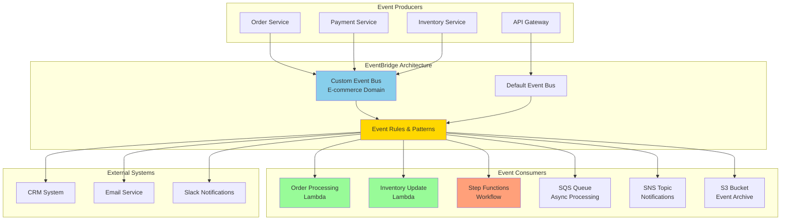

# Microservices with EventBridge Routing

## Problem

Your organization is building a modern e-commerce platform with multiple microservices that need to communicate asynchronously. You have an order service, inventory service, payment service, and notification service that must coordinate complex workflows without tight coupling. Traditional point-to-point integrations create a web of dependencies that are difficult to maintain, monitor, and scale. You need a robust event-driven architecture that can handle order processing, inventory updates, payment confirmations, and customer notifications while maintaining loose coupling between services.

## Solution

Implement a scalable event-driven architecture using Amazon EventBridge as the central event router. This solution creates custom event buses for different domains, establishes event patterns for intelligent routing, integrates with AWS services and third-party applications, and implements reliable event processing with error handling and monitoring.



## Prerequisites

1. AWS account with permissions to create EventBridge resources, Lambda functions, and IAM roles
2. Understanding of event-driven architecture concepts and patterns
3. Familiarity with JSON for event structure and pattern matching
4. AWS CLI v2 installed and configured
5. Basic knowledge of Lambda functions and Step Functions

> **Note**: EventBridge charges for custom events, rule evaluations, and cross-region replication. Review [EventBridge pricing](https://aws.amazon.com/eventbridge/pricing/) for cost considerations. For detailed quota limits, see [EventBridge quotas](https://docs.aws.amazon.com/eventbridge/latest/userguide/eb-quota.html).

## Preparation

Set up environment variables and create foundational resources:

```bash
# Set environment variables
export AWS_ACCOUNT_ID=$(aws sts get-caller-identity \
	--query Account --output text)
export AWS_REGION=$(aws configure get region)

# Generate unique identifiers
RANDOM_STRING=$(aws secretsmanager get-random-password \
	--exclude-punctuation --exclude-uppercase \
	--password-length 6 --require-each-included-type \
	--output text --query RandomPassword)

export CUSTOM_BUS_NAME="ecommerce-events-${RANDOM_STRING}"
export LAMBDA_FUNCTION_PREFIX="eventbridge-demo-${RANDOM_STRING}"

echo "Custom Event Bus: $CUSTOM_BUS_NAME"
echo "Lambda Function Prefix: $LAMBDA_FUNCTION_PREFIX"
```

Create IAM role for Lambda functions:

```bash
# Create trust policy for Lambda
cat > lambda-trust-policy.json << EOF
{
    "Version": "2012-10-17",
    "Statement": [
        {
            "Effect": "Allow",
            "Principal": {
                "Service": "lambda.amazonaws.com"
            },
            "Action": "sts:AssumeRole"
        }
    ]
}
EOF

# Create Lambda execution role
LAMBDA_ROLE_ARN=$(aws iam create-role \
	--role-name EventBridgeDemoLambdaRole \
	--assume-role-policy-document file://lambda-trust-policy.json \
	--query 'Role.Arn' --output text)

# Attach basic execution policy
aws iam attach-role-policy \
	--role-name EventBridgeDemoLambdaRole \
	--policy-arn arn:aws:iam::aws:policy/service-role/AWSLambdaBasicExecutionRole

# Create custom policy for EventBridge interactions
cat > lambda-eventbridge-policy.json << EOF
{
    "Version": "2012-10-17",
    "Statement": [
        {
            "Effect": "Allow",
            "Action": [
                "events:PutEvents",
                "events:ListRules",
                "events:DescribeRule"
            ],
            "Resource": "*"
        },
        {
            "Effect": "Allow",
            "Action": [
                "logs:CreateLogGroup",
                "logs:CreateLogStream",
                "logs:PutLogEvents"
            ],
            "Resource": "*"
        }
    ]
}
EOF

aws iam put-role-policy \
	--role-name EventBridgeDemoLambdaRole \
	--policy-name EventBridgeInteractionPolicy \
	--policy-document file://lambda-eventbridge-policy.json

export LAMBDA_ROLE_ARN
echo "✅ Lambda IAM role created: $LAMBDA_ROLE_ARN"
```

## Steps

1. **Create a custom event bus for the e-commerce domain**:

   Amazon EventBridge custom event buses provide domain isolation and organizational boundaries for different business contexts. Unlike the default event bus, custom buses enable you to implement specific security policies, monitoring, and access controls for distinct application domains. This separation is crucial for microservices architectures where different teams manage different business capabilities.

   ```bash
   # Create custom event bus
   aws events create-event-bus \
   	--name $CUSTOM_BUS_NAME \
   	--tags Key=Purpose,Value=EcommerceDemoIntegration
   
   # Verify event bus creation
   aws events describe-event-bus \
   	--name $CUSTOM_BUS_NAME \
   	--query 'Name'
   
   echo "✅ Custom event bus created: $CUSTOM_BUS_NAME"
   ```

   The custom event bus now serves as the central nervous system for our e-commerce platform, providing a dedicated communication channel that isolates e-commerce events from other application domains. This foundation enables loose coupling between services while maintaining clear domain boundaries.

2. **Create Lambda function for order processing**:

   AWS Lambda functions serve as event consumers in our event-driven architecture, providing serverless compute that automatically scales based on event volume. The order processing function demonstrates the producer-consumer pattern by both consuming "Order Created" events and producing "Order Processed" or "Order Processing Failed" events. This pattern enables resilient workflows with proper error handling and event propagation.

   ```bash
   # Create order processing Lambda function code
   cat > order_processor.py << 'EOF'
import json
import boto3
import os
from datetime import datetime

eventbridge = boto3.client('events')

def lambda_handler(event, context):
    print(f"Processing order event: {json.dumps(event, indent=2)}")
    
    # Extract order details from the event
    order_details = event.get('detail', {})
    order_id = order_details.get('orderId', 'unknown')
    customer_id = order_details.get('customerId', 'unknown')
    total_amount = order_details.get('totalAmount', 0)
    
    try:
        # Simulate order processing logic
        print(f"Processing order {order_id} for customer {customer_id}")
        print(f"Order total: ${total_amount}")
        
        # Emit order processed event
        response = eventbridge.put_events(
            Entries=[
                {
                    'Source': 'ecommerce.order',
                    'DetailType': 'Order Processed',
                    'Detail': json.dumps({
                        'orderId': order_id,
                        'customerId': customer_id,
                        'totalAmount': total_amount,
                        'status': 'processed',
                        'timestamp': datetime.utcnow().isoformat()
                    }),
                    'EventBusName': os.environ.get('EVENT_BUS_NAME', 'default')
                }
            ]
        )
        
        print(f"Emitted order processed event: {response}")
        
        return {
            'statusCode': 200,
            'body': json.dumps({
                'message': f'Order {order_id} processed successfully',
                'eventId': response['Entries'][0]['EventId']
            })
        }
        
    except Exception as e:
        print(f"Error processing order: {str(e)}")
        
        # Emit order failed event
        eventbridge.put_events(
            Entries=[
                {
                    'Source': 'ecommerce.order',
                    'DetailType': 'Order Processing Failed',
                    'Detail': json.dumps({
                        'orderId': order_id,
                        'customerId': customer_id,
                        'error': str(e),
                        'timestamp': datetime.utcnow().isoformat()
                    }),
                    'EventBusName': os.environ.get('EVENT_BUS_NAME', 'default')
                }
            ]
        )
        
        return {
            'statusCode': 500,
            'body': json.dumps({'error': str(e)})
        }
EOF

# Package and deploy order processing Lambda
zip order-processor.zip order_processor.py

ORDER_LAMBDA_ARN=$(aws lambda create-function \
	--function-name ${LAMBDA_FUNCTION_PREFIX}-order-processor \
	--runtime python3.9 \
	--role $LAMBDA_ROLE_ARN \
	--handler order_processor.lambda_handler \
	--zip-file fileb://order-processor.zip \
	--timeout 30 \
	--environment Variables="{EVENT_BUS_NAME=$CUSTOM_BUS_NAME}" \
	--query 'FunctionArn' --output text)

export ORDER_LAMBDA_ARN
echo "✅ Order processing Lambda created: $ORDER_LAMBDA_ARN"
   ```

   The order processing Lambda is now deployed and ready to handle incoming order events. This function implements the event-driven pattern where each service responsibility is clearly defined - it processes orders and emits status events that other services can consume. The function's ability to emit both success and failure events enables comprehensive workflow orchestration.

3. **Create Lambda function for inventory management**:

   The inventory management function demonstrates how event-driven architectures handle complex business logic through event reactions. This Lambda consumes order processing events and makes inventory decisions, then emits appropriate events based on availability. The randomized inventory availability simulates real-world scenarios where inventory checks might succeed or fail, showcasing how event-driven systems handle variable outcomes gracefully.

   ```bash
   # Create inventory management Lambda function code
   cat > inventory_manager.py << 'EOF'
import json
import boto3
import os
from datetime import datetime

eventbridge = boto3.client('events')

def lambda_handler(event, context):
    print(f"Processing inventory event: {json.dumps(event, indent=2)}")
    
    # Extract order details from the event
    order_details = event.get('detail', {})
    order_id = order_details.get('orderId', 'unknown')
    
    try:
        # Simulate inventory check and reservation
        print(f"Checking inventory for order {order_id}")
        
        # Simulate inventory availability (randomize for demo)
        import random
        inventory_available = random.choice([True, True, True, False])  # 75% success rate
        
        if inventory_available:
            # Emit inventory reserved event
            response = eventbridge.put_events(
                Entries=[
                    {
                        'Source': 'ecommerce.inventory',
                        'DetailType': 'Inventory Reserved',
                        'Detail': json.dumps({
                            'orderId': order_id,
                            'status': 'reserved',
                            'reservationId': f"res-{order_id}-{int(datetime.now().timestamp())}",
                            'timestamp': datetime.utcnow().isoformat()
                        }),
                        'EventBusName': os.environ.get('EVENT_BUS_NAME', 'default')
                    }
                ]
            )
            
            return {
                'statusCode': 200,
                'body': json.dumps({
                    'message': f'Inventory reserved for order {order_id}',
                    'eventId': response['Entries'][0]['EventId']
                })
            }
        else:
            # Emit inventory unavailable event
            eventbridge.put_events(
                Entries=[
                    {
                        'Source': 'ecommerce.inventory',
                        'DetailType': 'Inventory Unavailable',
                        'Detail': json.dumps({
                            'orderId': order_id,
                            'status': 'unavailable',
                            'reason': 'Insufficient stock',
                            'timestamp': datetime.utcnow().isoformat()
                        }),
                        'EventBusName': os.environ.get('EVENT_BUS_NAME', 'default')
                    }
                ]
            )
            
            return {
                'statusCode': 200,
                'body': json.dumps({
                    'message': f'Inventory unavailable for order {order_id}'
                })
            }
        
    except Exception as e:
        print(f"Error managing inventory: {str(e)}")
        return {
            'statusCode': 500,
            'body': json.dumps({'error': str(e)})
        }
EOF

# Package and deploy inventory management Lambda
zip inventory-manager.zip inventory_manager.py

INVENTORY_LAMBDA_ARN=$(aws lambda create-function \
	--function-name ${LAMBDA_FUNCTION_PREFIX}-inventory-manager \
	--runtime python3.9 \
	--role $LAMBDA_ROLE_ARN \
	--handler inventory_manager.lambda_handler \
	--zip-file fileb://inventory-manager.zip \
	--timeout 30 \
	--environment Variables="{EVENT_BUS_NAME=$CUSTOM_BUS_NAME}" \
	--query 'FunctionArn' --output text)

export INVENTORY_LAMBDA_ARN
echo "✅ Inventory management Lambda created: $INVENTORY_LAMBDA_ARN"
   ```

   The inventory management function is now operational and ready to process order events. This service demonstrates the event-driven principle of single responsibility - it focuses solely on inventory decisions while communicating results through events. The function's dual-outcome approach (reserved vs unavailable) shows how event-driven systems can branch workflows based on business conditions.

4. **Create SQS queue for asynchronous payment processing**:

   Amazon SQS provides reliable, asynchronous message processing that decouples payment processing from the immediate order flow. The 30-second delay ensures inventory reservation is fully committed before payment processing begins, while the 5-minute visibility timeout provides sufficient time for payment processing operations. This approach prevents race conditions and ensures proper order sequencing in distributed systems.

   ```bash
   # Create SQS queue for payment processing
   PAYMENT_QUEUE_URL=$(aws sqs create-queue \
   	--queue-name ${LAMBDA_FUNCTION_PREFIX}-payment-processing \
   	--attributes DelaySeconds=30,VisibilityTimeoutSeconds=300 \
   	--query 'QueueUrl' --output text)
   
   PAYMENT_QUEUE_ARN=$(aws sqs get-queue-attributes \
   	--queue-url $PAYMENT_QUEUE_URL \
   	--attribute-names QueueArn \
   	--query 'Attributes.QueueArn' --output text)
   
   export PAYMENT_QUEUE_URL
   export PAYMENT_QUEUE_ARN
   
   echo "✅ Payment processing queue created: $PAYMENT_QUEUE_URL"
   ```

   The SQS queue now serves as a buffer for payment processing, enabling asynchronous workflows that improve system resilience. This pattern prevents payment processing bottlenecks from impacting upstream services and provides automatic retry capabilities for failed payment operations.

5. **Create EventBridge rules with custom event patterns**:

   EventBridge rules define the intelligent routing logic that connects event producers to consumers through pattern matching. These rules enable content-based routing where events are delivered to targets based on their structure, source, and metadata. The pattern matching capability eliminates the need for custom routing code and provides a declarative approach to event flow management.

   ```bash
   # Rule 1: Route new orders to order processing Lambda
   cat > order-rule-pattern.json << EOF
{
    "source": ["ecommerce.api"],
    "detail-type": ["Order Created"],
    "detail": {
        "totalAmount": [{"numeric": [">", 0]}]
    }
}
EOF

aws events put-rule \
	--name ${LAMBDA_FUNCTION_PREFIX}-order-processing-rule \
	--event-pattern file://order-rule-pattern.json \
	--state ENABLED \
	--event-bus-name $CUSTOM_BUS_NAME \
	--description "Route new orders to processing Lambda"

# Add Lambda permission and target
aws lambda add-permission \
	--function-name ${LAMBDA_FUNCTION_PREFIX}-order-processor \
	--statement-id allow-eventbridge-order-rule \
	--action lambda:InvokeFunction \
	--principal events.amazonaws.com \
	--source-arn arn:aws:events:${AWS_REGION}:${AWS_ACCOUNT_ID}:rule/${CUSTOM_BUS_NAME}/${LAMBDA_FUNCTION_PREFIX}-order-processing-rule

aws events put-targets \
	--rule ${LAMBDA_FUNCTION_PREFIX}-order-processing-rule \
	--event-bus-name $CUSTOM_BUS_NAME \
	--targets "Id"="1","Arn"="$ORDER_LAMBDA_ARN"

echo "✅ Order processing rule created"
```

```bash
# Rule 2: Route processed orders to inventory management
cat > inventory-rule-pattern.json << EOF
{
    "source": ["ecommerce.order"],
    "detail-type": ["Order Processed"],
    "detail": {
        "status": ["processed"]
    }
}
EOF

aws events put-rule \
	--name ${LAMBDA_FUNCTION_PREFIX}-inventory-check-rule \
	--event-pattern file://inventory-rule-pattern.json \
	--state ENABLED \
	--event-bus-name $CUSTOM_BUS_NAME \
	--description "Route processed orders to inventory check"

# Add Lambda permission and target
aws lambda add-permission \
	--function-name ${LAMBDA_FUNCTION_PREFIX}-inventory-manager \
	--statement-id allow-eventbridge-inventory-rule \
	--action lambda:InvokeFunction \
	--principal events.amazonaws.com \
	--source-arn arn:aws:events:${AWS_REGION}:${AWS_ACCOUNT_ID}:rule/${CUSTOM_BUS_NAME}/${LAMBDA_FUNCTION_PREFIX}-inventory-check-rule

aws events put-targets \
	--rule ${LAMBDA_FUNCTION_PREFIX}-inventory-check-rule \
	--event-bus-name $CUSTOM_BUS_NAME \
	--targets "Id"="1","Arn"="$INVENTORY_LAMBDA_ARN"

echo "✅ Inventory check rule created"
```

```bash
# Rule 3: Route inventory reserved events to payment processing
cat > payment-rule-pattern.json << EOF
{
    "source": ["ecommerce.inventory"],
    "detail-type": ["Inventory Reserved"],
    "detail": {
        "status": ["reserved"]
    }
}
EOF

aws events put-rule \
	--name ${LAMBDA_FUNCTION_PREFIX}-payment-processing-rule \
	--event-pattern file://payment-rule-pattern.json \
	--state ENABLED \
	--event-bus-name $CUSTOM_BUS_NAME \
	--description "Route inventory reserved events to payment"

# Add SQS permission and target
aws sqs add-permission \
	--queue-url $PAYMENT_QUEUE_URL \
	--label allow-eventbridge-payment-rule \
	--aws-account-ids $AWS_ACCOUNT_ID \
	--actions SendMessage

aws events put-targets \
	--rule ${LAMBDA_FUNCTION_PREFIX}-payment-processing-rule \
	--event-bus-name $CUSTOM_BUS_NAME \
	--targets "Id"="1","Arn"="$PAYMENT_QUEUE_ARN"

echo "✅ Payment processing rule created"
   ```

   The EventBridge rules now provide intelligent event routing based on content and metadata. These rules demonstrate how event-driven architectures can implement complex business logic through declarative patterns rather than imperative code, making the system more maintainable and easier to understand.

6. **Create a catch-all rule for monitoring and debugging**:

   Comprehensive event monitoring is essential for production event-driven systems. This monitoring rule captures all e-commerce events for observability, debugging, and audit purposes. CloudWatch Logs integration provides centralized logging that enables troubleshooting, performance analysis, and compliance reporting across the entire event-driven architecture.

   ```bash
   # Rule 4: Archive all events to CloudWatch Logs for monitoring
   cat > monitoring-rule-pattern.json << EOF
{
    "source": [{"prefix": "ecommerce."}]
}
EOF

# Create CloudWatch log group
aws logs create-log-group \
	--log-group-name /aws/events/${CUSTOM_BUS_NAME}

LOG_GROUP_ARN=$(aws logs describe-log-groups \
	--log-group-name-prefix /aws/events/${CUSTOM_BUS_NAME} \
	--query 'logGroups[0].arn' --output text)

aws events put-rule \
	--name ${LAMBDA_FUNCTION_PREFIX}-monitoring-rule \
	--event-pattern file://monitoring-rule-pattern.json \
	--state ENABLED \
	--event-bus-name $CUSTOM_BUS_NAME \
	--description "Archive all ecommerce events for monitoring"

aws events put-targets \
	--rule ${LAMBDA_FUNCTION_PREFIX}-monitoring-rule \
	--event-bus-name $CUSTOM_BUS_NAME \
	--targets "Id"="1","Arn"="$LOG_GROUP_ARN"

echo "✅ Monitoring rule created"
   ```

   The monitoring infrastructure is now in place to provide complete visibility into event flows. This observability layer is crucial for production systems, enabling teams to track event processing, identify bottlenecks, and debug issues across the distributed architecture.

7. **Create a Lambda function to simulate API events**:

   The event generator function simulates API Gateway or application events that initiate order workflows. This function demonstrates how external systems integrate with EventBridge by publishing events to custom buses. The realistic order data generation helps test the complete event flow and validates that all components work together correctly.

   ```bash
   # Create event generator Lambda function
   cat > event_generator.py << 'EOF'
import json
import boto3
import os
from datetime import datetime
import random

eventbridge = boto3.client('events')

def lambda_handler(event, context):
    # Generate sample order data
    order_id = f"ord-{int(datetime.now().timestamp())}-{random.randint(1000, 9999)}"
    customer_id = f"cust-{random.randint(1000, 9999)}"
    total_amount = round(random.uniform(25.99, 299.99), 2)
    
    # Create order event
    order_event = {
        'Source': 'ecommerce.api',
        'DetailType': 'Order Created',
        'Detail': json.dumps({
            'orderId': order_id,
            'customerId': customer_id,
            'totalAmount': total_amount,
            'items': [
                {
                    'productId': f'prod-{random.randint(100, 999)}',
                    'quantity': random.randint(1, 3),
                    'price': round(total_amount / random.randint(1, 3), 2)
                }
            ],
            'timestamp': datetime.utcnow().isoformat()
        }),
        'EventBusName': os.environ.get('EVENT_BUS_NAME', 'default')
    }
    
    try:
        response = eventbridge.put_events(Entries=[order_event])
        
        return {
            'statusCode': 200,
            'body': json.dumps({
                'message': f'Order event generated successfully',
                'orderId': order_id,
                'eventId': response['Entries'][0]['EventId']
            })
        }
        
    except Exception as e:
        return {
            'statusCode': 500,
            'body': json.dumps({'error': str(e)})
        }
EOF

# Package and deploy event generator Lambda
zip event-generator.zip event_generator.py

EVENT_GENERATOR_ARN=$(aws lambda create-function \
	--function-name ${LAMBDA_FUNCTION_PREFIX}-event-generator \
	--runtime python3.9 \
	--role $LAMBDA_ROLE_ARN \
	--handler event_generator.lambda_handler \
	--zip-file fileb://event-generator.zip \
	--timeout 30 \
	--environment Variables="{EVENT_BUS_NAME=$CUSTOM_BUS_NAME}" \
	--query 'FunctionArn' --output text)

export EVENT_GENERATOR_ARN
echo "✅ Event generator Lambda created: $EVENT_GENERATOR_ARN"
   ```

   The event generator is now ready to create realistic test events that flow through our entire architecture. This function enables end-to-end testing and demonstrates how external systems can integrate with EventBridge to initiate complex business workflows.

## Validation & Testing

1. Verify custom event bus and rules are configured correctly:

```bash
# List event buses
echo "Event Buses:"
aws events list-event-buses --query 'EventBuses[*].Name' --output table

# List rules for custom event bus
echo "Rules on custom event bus:"
aws events list-rules --event-bus-name $CUSTOM_BUS_NAME \
	--query 'Rules[*].[Name, State, Description]' --output table
```

2. Test the event-driven architecture by generating a sample order:

```bash
# Generate a test order event
echo "Generating test order event..."
RESULT=$(aws lambda invoke \
	--function-name ${LAMBDA_FUNCTION_PREFIX}-event-generator \
	--payload '{}' \
	--cli-binary-format raw-in-base64-out \
	response.json)

echo "Event generator response:"
cat response.json | jq '.'

echo "✅ Test order event generated"
```

3. Wait for event processing and check CloudWatch logs:

```bash
echo "Waiting 30 seconds for event processing..."
sleep 30

# Check order processor logs
echo "Order Processor Logs:"
aws logs describe-log-streams \
	--log-group-name /aws/lambda/${LAMBDA_FUNCTION_PREFIX}-order-processor \
	--order-by LastEventTime --descending --max-items 1 \
	--query 'logStreams[0].logStreamName' --output text | \
xargs -I {} aws logs get-log-events \
	--log-group-name /aws/lambda/${LAMBDA_FUNCTION_PREFIX}-order-processor \
	--log-stream-name {} --limit 10 \
	--query 'events[*].message' --output text

# Check inventory manager logs
echo "Inventory Manager Logs:"
aws logs describe-log-streams \
	--log-group-name /aws/lambda/${LAMBDA_FUNCTION_PREFIX}-inventory-manager \
	--order-by LastEventTime --descending --max-items 1 \
	--query 'logStreams[0].logStreamName' --output text | \
xargs -I {} aws logs get-log-events \
	--log-group-name /aws/lambda/${LAMBDA_FUNCTION_PREFIX}-inventory-manager \
	--log-stream-name {} --limit 10 \
	--query 'events[*].message' --output text
```

4. Check SQS queue for payment processing messages:

```bash
# Check for messages in payment processing queue
echo "Payment Queue Messages:"
aws sqs receive-message --queue-url $PAYMENT_QUEUE_URL \
	--max-number-of-messages 5 \
	--query 'Messages[*].Body' --output text
```

> **Tip**: Use EventBridge's built-in monitoring through CloudWatch metrics to track rule matches, failed invocations, and successful deliveries. Key metrics include `MatchedEvents`, `SuccessfulInvocations`, and `FailedInvocations`. For comprehensive monitoring guidance, see [EventBridge monitoring events](https://docs.aws.amazon.com/eventbridge/latest/ref/events-ref-monitoring.html).

## Cleanup

1. Delete EventBridge rules and targets:

```bash
# Remove targets from rules
aws events remove-targets \
	--rule ${LAMBDA_FUNCTION_PREFIX}-order-processing-rule \
	--event-bus-name $CUSTOM_BUS_NAME \
	--ids "1"

aws events remove-targets \
	--rule ${LAMBDA_FUNCTION_PREFIX}-inventory-check-rule \
	--event-bus-name $CUSTOM_BUS_NAME \
	--ids "1"

aws events remove-targets \
	--rule ${LAMBDA_FUNCTION_PREFIX}-payment-processing-rule \
	--event-bus-name $CUSTOM_BUS_NAME \
	--ids "1"

aws events remove-targets \
	--rule ${LAMBDA_FUNCTION_PREFIX}-monitoring-rule \
	--event-bus-name $CUSTOM_BUS_NAME \
	--ids "1"

# Delete rules
aws events delete-rule \
	--name ${LAMBDA_FUNCTION_PREFIX}-order-processing-rule \
	--event-bus-name $CUSTOM_BUS_NAME

aws events delete-rule \
	--name ${LAMBDA_FUNCTION_PREFIX}-inventory-check-rule \
	--event-bus-name $CUSTOM_BUS_NAME

aws events delete-rule \
	--name ${LAMBDA_FUNCTION_PREFIX}-payment-processing-rule \
	--event-bus-name $CUSTOM_BUS_NAME

aws events delete-rule \
	--name ${LAMBDA_FUNCTION_PREFIX}-monitoring-rule \
	--event-bus-name $CUSTOM_BUS_NAME
```

2. Delete Lambda functions:

```bash
aws lambda delete-function \
	--function-name ${LAMBDA_FUNCTION_PREFIX}-order-processor

aws lambda delete-function \
	--function-name ${LAMBDA_FUNCTION_PREFIX}-inventory-manager

aws lambda delete-function \
	--function-name ${LAMBDA_FUNCTION_PREFIX}-event-generator
```

3. Delete SQS queue and CloudWatch log group:

```bash
aws sqs delete-queue --queue-url $PAYMENT_QUEUE_URL

aws logs delete-log-group \
	--log-group-name /aws/events/${CUSTOM_BUS_NAME}

aws logs delete-log-group \
	--log-group-name /aws/lambda/${LAMBDA_FUNCTION_PREFIX}-order-processor

aws logs delete-log-group \
	--log-group-name /aws/lambda/${LAMBDA_FUNCTION_PREFIX}-inventory-manager

aws logs delete-log-group \
	--log-group-name /aws/lambda/${LAMBDA_FUNCTION_PREFIX}-event-generator
```

4. Delete custom event bus and IAM resources:

```bash
aws events delete-event-bus --name $CUSTOM_BUS_NAME

# Delete IAM role and policies
aws iam delete-role-policy \
	--role-name EventBridgeDemoLambdaRole \
	--policy-name EventBridgeInteractionPolicy

aws iam detach-role-policy \
	--role-name EventBridgeDemoLambdaRole \
	--policy-arn arn:aws:iam::aws:policy/service-role/AWSLambdaBasicExecutionRole

aws iam delete-role --role-name EventBridgeDemoLambdaRole
```

5. Clean up local files:

```bash
rm -f lambda-trust-policy.json lambda-eventbridge-policy.json
rm -f order-rule-pattern.json inventory-rule-pattern.json
rm -f payment-rule-pattern.json monitoring-rule-pattern.json
rm -f order_processor.py inventory_manager.py event_generator.py
rm -f order-processor.zip inventory-manager.zip event-generator.zip
rm -f response.json
```

## Discussion

[Amazon EventBridge](https://docs.aws.amazon.com/eventbridge/latest/userguide/eb-what-is.html) serves as a serverless event bus that enables loosely coupled, event-driven architectures at scale. Unlike traditional message queues or pub/sub systems, EventBridge provides intelligent event routing through pattern matching, allowing complex conditional logic without custom code. This capability is essential for modern microservices architectures where services need to communicate asynchronously while maintaining independence and resilience.

The custom event bus pattern demonstrated in this recipe provides domain isolation and better organization than using only the default event bus. By creating domain-specific buses (e-commerce, user management, analytics), organizations can implement clear boundaries between different business contexts, apply different security policies, and manage event flow more effectively. [Event patterns](https://docs.aws.amazon.com/eventbridge/latest/userguide/eb-event-patterns.html) enable sophisticated filtering and routing logic, allowing multiple consumers to process the same events differently based on content, metadata, or business rules.

EventBridge's integration capabilities extend beyond AWS services to include third-party SaaS applications through partner event sources and custom applications through API destinations. This makes it an ideal choice for hybrid architectures where on-premises systems, cloud services, and external APIs must work together. The service's built-in monitoring through CloudWatch, event replay capabilities for debugging, and [schema registry](https://docs.aws.amazon.com/eventbridge/latest/userguide/eb-schema-registry.html) for event governance provide enterprise-grade operational features that are essential for production systems. Organizations should consider implementing dead letter queues, event archiving, and cross-region replication for comprehensive event-driven architectures that can handle failures gracefully and maintain audit trails.

> **Warning**: When implementing production EventBridge architectures, ensure proper IAM permissions are configured for cross-account event delivery and consider implementing [event bus concepts](https://docs.aws.amazon.com/eventbridge/latest/userguide/eb-what-is-how-it-works-concepts.html) for proper resource isolation and security boundaries.

## Challenge

Extend this event-driven architecture by implementing a complete order fulfillment workflow using AWS Step Functions as an EventBridge target. Create a state machine that coordinates order validation, payment processing, inventory reservation, and shipping notification steps. Additionally, implement event schema validation using EventBridge Schema Registry to ensure event consistency across all producers and consumers. Finally, add cross-region event replication for disaster recovery and implement custom event destinations to integrate with external CRM and analytics systems.

## Infrastructure Code

*Infrastructure code will be generated after recipe approval.*