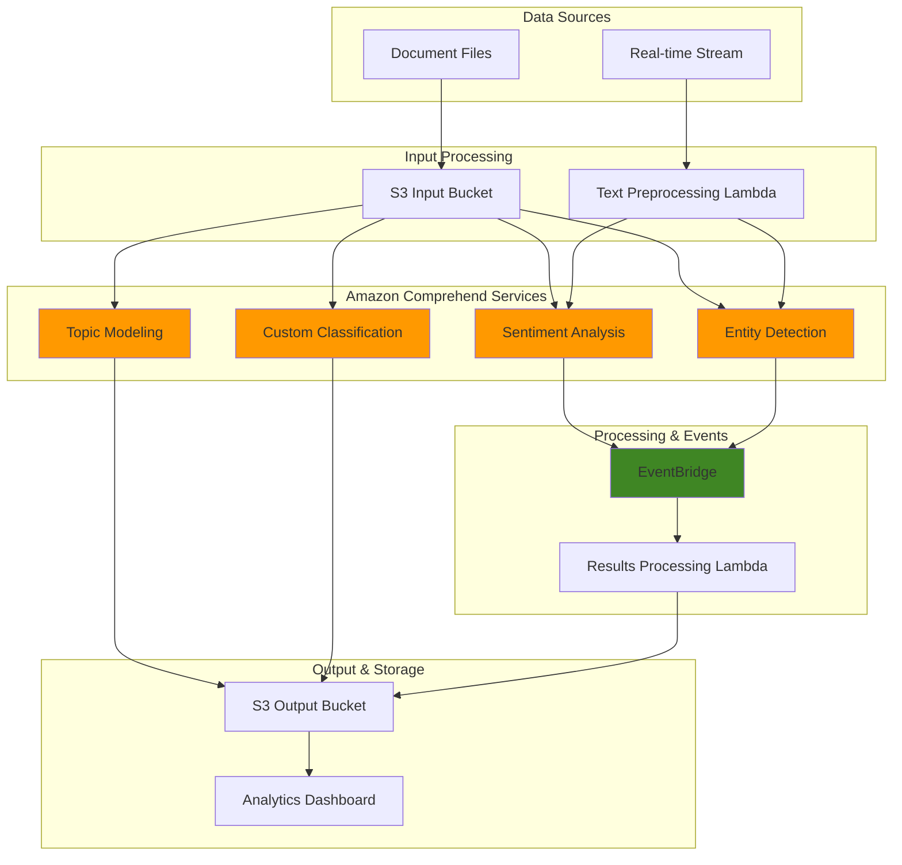

# Extracting Insights from Text with Amazon Comprehend

## Problem

Modern enterprises are drowning in unstructured text data from customer feedback, social media posts, support tickets, and internal documents. Marketing teams need to understand customer sentiment across thousands of product reviews, customer service departments require automated classification of support tickets, and compliance teams must extract and analyze entities from legal documents at scale. Traditional manual analysis is time-consuming, inconsistent, and cannot handle the velocity of modern data streams, creating bottlenecks in decision-making processes and customer response times.

## Solution

Amazon Comprehend provides a comprehensive natural language processing (NLP) solution that automatically analyzes text using machine learning to extract insights without requiring ML expertise. This recipe demonstrates building an end-to-end NLP pipeline that performs sentiment analysis, entity extraction, topic modeling, and custom classification. The solution combines real-time processing through Lambda functions with batch processing for large datasets, enabling organizations to gain actionable insights from their text data at any scale.

## Architecture Diagram



## Prerequisites

1. AWS account with appropriate permissions for Amazon Comprehend, Lambda, S3, and EventBridge
2. AWS CLI v2 installed and configured (or AWS CloudShell)
3. Basic understanding of NLP concepts and JSON data structures
4. Familiarity with AWS Lambda and event-driven architectures
5. Sample text data for testing (customer reviews, support tickets, etc.)
6. Estimated cost: $20-50 for running all examples with moderate data volumes

> **Note**: Amazon Comprehend pricing is based on the amount of text processed and job complexity. Custom models incur additional training costs. See the [Amazon Comprehend pricing page](https://aws.amazon.com/comprehend/pricing/) for detailed information.

## Preparation

```bash
# Set environment variables
export AWS_REGION=$(aws configure get region)
export AWS_ACCOUNT_ID=$(aws sts get-caller-identity \
    --query Account --output text)

# Generate unique identifiers for resources
RANDOM_SUFFIX=$(aws secretsmanager get-random-password \
    --exclude-punctuation --exclude-uppercase \
    --password-length 6 --require-each-included-type \
    --output text --query RandomPassword)

export COMPREHEND_BUCKET="comprehend-nlp-${RANDOM_SUFFIX}"
export COMPREHEND_ROLE="AmazonComprehendServiceRole-${RANDOM_SUFFIX}"
export LAMBDA_ROLE="ComprehendLambdaRole-${RANDOM_SUFFIX}"

# Create S3 buckets for input and output
aws s3 mb s3://${COMPREHEND_BUCKET}
aws s3 mb s3://${COMPREHEND_BUCKET}-output

# Create sample text files for testing
mkdir -p /tmp/nlp-samples

# Create sample customer feedback files
cat > /tmp/nlp-samples/review1.txt << 'EOF'
This product is absolutely amazing! The quality exceeded my expectations and the customer service was outstanding. I would definitely recommend this to anyone looking for a reliable solution.
EOF

cat > /tmp/nlp-samples/review2.txt << 'EOF'
The device stopped working after just two weeks. Very disappointed with the build quality. The support team was unhelpful and took forever to respond.
EOF

cat > /tmp/nlp-samples/review3.txt << 'EOF'
The product is okay, nothing special. It works as described but doesn't stand out from similar products. Price is reasonable for what you get.
EOF

cat > /tmp/nlp-samples/support1.txt << 'EOF'
Customer reporting login issues with mobile app. Error message: "Invalid credentials" appears even with correct password. Customer using iPhone 12, iOS 15.2.
EOF

cat > /tmp/nlp-samples/support2.txt << 'EOF'
Billing inquiry - customer charged twice for premium subscription. Transaction dates: March 15th and March 16th. Customer account: premium-user@example.com
EOF

# Upload sample files to S3
aws s3 cp /tmp/nlp-samples/ s3://${COMPREHEND_BUCKET}/input/ --recursive

echo "✅ Created buckets and uploaded sample files"
```

## Steps

1. **Create IAM Service Role for Comprehend**:

   Amazon Comprehend requires a service role to access your S3 buckets and process text files. This IAM role establishes the security boundary and permissions needed for batch processing jobs to read input data and write results. Understanding IAM roles is crucial for AWS security - they provide temporary, rotatable credentials that follow the principle of least privilege as outlined in the [AWS Well-Architected Framework](https://docs.aws.amazon.com/wellarchitected/latest/framework/welcome.html).

   ```bash
   # Create trust policy for Comprehend service
   cat > /tmp/comprehend-trust-policy.json << 'EOF'
   {
     "Version": "2012-10-17",
     "Statement": [
       {
         "Effect": "Allow",
         "Principal": {
           "Service": "comprehend.amazonaws.com"
         },
         "Action": "sts:AssumeRole"
       }
     ]
   }
   EOF
   
   # Create IAM role for Comprehend
   aws iam create-role \
       --role-name ${COMPREHEND_ROLE} \
       --assume-role-policy-document file:///tmp/comprehend-trust-policy.json
   
   # Attach necessary policies
   aws iam attach-role-policy \
       --role-name ${COMPREHEND_ROLE} \
       --policy-arn arn:aws:iam::aws:policy/ComprehendFullAccess
   
   aws iam attach-role-policy \
       --role-name ${COMPREHEND_ROLE} \
       --policy-arn arn:aws:iam::aws:policy/AmazonS3FullAccess
   
   export COMPREHEND_ROLE_ARN="arn:aws:iam::${AWS_ACCOUNT_ID}:role/${COMPREHEND_ROLE}"
   
   echo "✅ Created IAM role: ${COMPREHEND_ROLE_ARN}"
   ```

   The service role is now configured with the necessary permissions to read from S3 input buckets and write results to output buckets. This foundational security setup enables all subsequent batch processing operations while maintaining proper access controls following AWS security best practices.

2. **Perform Real-time Sentiment Analysis**:

   Sentiment analysis is the foundation of customer feedback understanding, providing immediate insights into customer emotions and satisfaction levels. Amazon Comprehend's real-time sentiment detection can process individual texts in milliseconds, making it perfect for chatbots, social media monitoring, and customer service applications. The service returns both a sentiment label (POSITIVE, NEGATIVE, NEUTRAL, MIXED) and confidence scores for each sentiment, enabling precise filtering and quality control.

   ```bash
   # Analyze sentiment of individual text samples
   SENTIMENT_RESULT=$(aws comprehend detect-sentiment \
       --language-code en \
       --text "This product is absolutely amazing! The quality exceeded my expectations.")
   
   echo "Sentiment Analysis Result:"
   echo ${SENTIMENT_RESULT} | jq '.'
   
   # Batch sentiment analysis for multiple texts
   aws comprehend batch-detect-sentiment \
       --language-code en \
       --text-list "This product is amazing!" "The service was terrible." "It's okay, nothing special." \
       --output table
   
   echo "✅ Completed real-time sentiment analysis"
   ```

   The sentiment analysis results show both the overall sentiment classification and detailed confidence scores. This dual approach allows you to filter results based on confidence thresholds, ensuring high-quality sentiment detection for business-critical applications where accuracy is paramount.

3. **Extract Named Entities from Text**:

   Named Entity Recognition (NER) automatically identifies and classifies key information in text such as people, organizations, locations, dates, and commercial items. This capability is essential for data mining, compliance monitoring, and automated information extraction from documents. Amazon Comprehend's pre-trained models can detect multiple entity types including PERSON, ORGANIZATION, LOCATION, DATE, QUANTITY, and COMMERCIAL_ITEM with high accuracy across various text formats.

   ```bash
   # Detect entities in customer support text
   ENTITIES_RESULT=$(aws comprehend detect-entities \
       --language-code en \
       --text "John Smith from AnyCompany called about iPhone 12 issues on March 15th, 2024. His email is john@example.com.")
   
   echo "Entity Detection Result:"
   echo ${ENTITIES_RESULT} | jq '.Entities[] | {Type: .Type, Text: .Text, Score: .Score}'
   
   # Batch entity detection
   aws comprehend batch-detect-entities \
       --language-code en \
       --text-list "Customer Sarah Johnson from Boston reported billing issues." "Meeting scheduled for January 15th with Microsoft team." \
       --output table
   
   echo "✅ Completed entity extraction"
   ```

   The entity extraction results provide structured data from unstructured text, enabling automated processing workflows. Each detected entity includes confidence scores, allowing you to implement quality thresholds and validation logic in your applications for production deployments.

4. **Perform Key Phrase Extraction**:

   Key phrase extraction identifies the most important words and phrases in your text, enabling content summarization and topic identification. This capability is valuable for creating automatic tags, extracting key concepts from documents, and building content recommendation systems. The confidence scores help you filter results to focus on the most relevant phrases for your specific use case and business requirements.

   > **Warning**: Amazon Comprehend has a 5,000 UTF-8 character limit per real-time request. For longer documents, use batch processing or split text into smaller chunks as described in the [Amazon Comprehend Developer Guide](https://docs.aws.amazon.com/comprehend/latest/dg/guidelines-and-limits.html).

   ```bash
   # Extract key phrases from customer feedback
   KEY_PHRASES_RESULT=$(aws comprehend detect-key-phrases \
       --language-code en \
       --text "The new software update improved performance significantly, but the user interface could be more intuitive for first-time users.")
   
   echo "Key Phrases Result:"
   echo ${KEY_PHRASES_RESULT} | jq '.KeyPhrases[] | {Text: .Text, Score: .Score}'
   
   # Batch key phrase extraction
   aws comprehend batch-detect-key-phrases \
       --language-code en \
       --text-list "The mobile app crashes frequently during video calls." "Customer service response time is excellent." \
       --output table
   
   echo "✅ Completed key phrase extraction"
   ```

   The extracted key phrases provide a structured summary of the most important concepts in your text. These results can be used for automatic tagging, content categorization, and building search indices for document discovery systems that enhance user experience and content findability.

5. **Start Batch Sentiment Analysis Job**:

   Batch processing is essential for analyzing large volumes of text data that exceed real-time processing limits. Amazon Comprehend's batch jobs can process thousands of documents simultaneously, making it cost-effective for analyzing customer reviews, social media posts, or historical documents. The asynchronous nature allows your applications to continue operating while analysis runs in the background, maximizing system efficiency.

   ```bash
   # Start asynchronous sentiment analysis job
   SENTIMENT_JOB_ID=$(aws comprehend start-sentiment-detection-job \
       --job-name "sentiment-analysis-${RANDOM_SUFFIX}" \
       --language-code en \
       --input-data-config "S3Uri=s3://${COMPREHEND_BUCKET}/input/" \
       --output-data-config "S3Uri=s3://${COMPREHEND_BUCKET}-output/sentiment/" \
       --data-access-role-arn ${COMPREHEND_ROLE_ARN} \
       --query 'JobId' --output text)
   
   echo "Started sentiment analysis job: ${SENTIMENT_JOB_ID}"
   
   # Wait for job completion (usually takes 2-5 minutes)
   echo "Waiting for sentiment analysis job to complete..."
   aws comprehend describe-sentiment-detection-job \
       --job-id ${SENTIMENT_JOB_ID} \
       --query 'SentimentDetectionJobProperties.JobStatus' \
       --output text
   
   echo "✅ Started batch sentiment analysis job"
   ```

   The batch job is now processing all documents in your S3 input bucket. Results will be written to the output bucket as JSON files containing sentiment classifications and confidence scores for each document, enabling downstream analytics and reporting systems to consume the processed insights.

6. **Start Batch Entity Detection Job**:

   Batch entity detection processes large volumes of documents to extract structured information at scale. This asynchronous approach is cost-effective for analyzing document archives, processing daily content feeds, or extracting entities from historical data. The batch processing can handle thousands of documents simultaneously, providing consistent entity extraction across your entire dataset with enterprise-grade reliability.

   ```bash
   # Start asynchronous entity detection job
   ENTITIES_JOB_ID=$(aws comprehend start-entities-detection-job \
       --job-name "entities-detection-${RANDOM_SUFFIX}" \
       --language-code en \
       --input-data-config "S3Uri=s3://${COMPREHEND_BUCKET}/input/" \
       --output-data-config "S3Uri=s3://${COMPREHEND_BUCKET}-output/entities/" \
       --data-access-role-arn ${COMPREHEND_ROLE_ARN} \
       --query 'JobId' --output text)
   
   echo "Started entity detection job: ${ENTITIES_JOB_ID}"
   
   # Check job status
   aws comprehend describe-entities-detection-job \
       --job-id ${ENTITIES_JOB_ID} \
       --query 'EntitiesDetectionJobProperties.JobStatus' \
       --output text
   
   echo "✅ Started batch entity detection job"
   ```

   The batch entity detection job is now processing all documents in your S3 bucket. Results will include detected entities with confidence scores and location information, enabling automated data extraction and structured analysis of your document collection for business intelligence and compliance applications.

7. **Create Custom Entity Recognition Model**:

   Custom entity recognition enables you to train models that detect domain-specific entities like product names, internal codes, or specialized terminology. This powerful capability extends Comprehend's pre-trained models to recognize business-specific information, enabling automated data extraction from industry-specific documents. Training requires well-formatted data but provides highly accurate results for your unique use cases and business requirements.

   > **Note**: Custom entity recognizer training typically takes 30-60 minutes and requires a minimum of 250 annotations per entity type. Training costs are separate from inference costs. See the [Amazon Comprehend Developer Guide](https://docs.aws.amazon.com/comprehend/latest/dg/custom-entity-recognition.html) for detailed training requirements and best practices.

   ```bash
   # Create training data for custom entity recognition
   cat > /tmp/custom-entities.csv << 'EOF'
   Text,Entities
   "The AnyPhone Pro 12 has excellent battery life","[{""BeginOffset"":4,""EndOffset"":19,""Type"":""PRODUCT"",""Text"":""AnyPhone Pro 12""}]"
   "Customer purchased the SuperLaptop X1 last month","[{""BeginOffset"":23,""EndOffset"":37,""Type"":""PRODUCT"",""Text"":""SuperLaptop X1""}]"
   "The SmartWatch Series 5 needs software update","[{""BeginOffset"":4,""EndOffset"":23,""Type"":""PRODUCT"",""Text"":""SmartWatch Series 5""}]"
   EOF
   
   # Upload training data
   aws s3 cp /tmp/custom-entities.csv s3://${COMPREHEND_BUCKET}/training/
   
   # Create entity recognizer (this is a longer process)
   RECOGNIZER_ARN=$(aws comprehend create-entity-recognizer \
       --recognizer-name "product-recognizer-${RANDOM_SUFFIX}" \
       --language-code en \
       --input-data-config "DataFormat=COMPREHEND_CSV,EntityTypes=[{Type=PRODUCT}],Documents={S3Uri=s3://${COMPREHEND_BUCKET}/training/custom-entities.csv}" \
       --data-access-role-arn ${COMPREHEND_ROLE_ARN} \
       --query 'EntityRecognizerArn' --output text)
   
   echo "Created custom entity recognizer: ${RECOGNIZER_ARN}"
   echo "✅ Started custom entity recognizer training (this may take 30-60 minutes)"
   ```

   The custom entity recognizer is now training on your domain-specific data. Once trained, it will provide highly accurate detection of your custom entity types, enabling automated processing of business-specific information from documents and text data with precision tailored to your organization's needs.

8. **Start Topic Modeling Job**:

   Topic modeling automatically discovers abstract topics within a collection of documents using unsupervised machine learning. This capability is essential for content organization, trend analysis, and understanding large document collections without manual review. Amazon Comprehend's topic modeling can identify themes across thousands of documents, making it valuable for analyzing customer feedback, research papers, or news articles to uncover hidden patterns and insights.

   ```bash
   # Create additional sample documents for topic modeling
   cat > /tmp/nlp-samples/topic1.txt << 'EOF'
   Our cloud infrastructure migration was successful. The new serverless architecture improved scalability and reduced costs by 40%. DevOps team recommends similar approach for other applications.
   EOF
   
   cat > /tmp/nlp-samples/topic2.txt << 'EOF'
   The mobile application user interface needs improvement. Customer feedback indicates confusion with navigation menu. UX team should prioritize mobile design updates.
   EOF
   
   cat > /tmp/nlp-samples/topic3.txt << 'EOF'
   Security audit revealed several vulnerabilities in payment processing system. Encryption protocols need updating. Compliance team requires immediate action on PCI DSS requirements.
   EOF
   
   # Upload topic modeling samples
   aws s3 cp /tmp/nlp-samples/topic1.txt s3://${COMPREHEND_BUCKET}/topics/
   aws s3 cp /tmp/nlp-samples/topic2.txt s3://${COMPREHEND_BUCKET}/topics/
   aws s3 cp /tmp/nlp-samples/topic3.txt s3://${COMPREHEND_BUCKET}/topics/
   
   # Start topic modeling job
   TOPICS_JOB_ID=$(aws comprehend start-topics-detection-job \
       --job-name "topics-detection-${RANDOM_SUFFIX}" \
       --input-data-config "S3Uri=s3://${COMPREHEND_BUCKET}/topics/" \
       --output-data-config "S3Uri=s3://${COMPREHEND_BUCKET}-output/topics/" \
       --data-access-role-arn ${COMPREHEND_ROLE_ARN} \
       --number-of-topics 3 \
       --query 'JobId' --output text)
   
   echo "Started topic modeling job: ${TOPICS_JOB_ID}"
   echo "✅ Started topic modeling analysis"
   ```

   The topic modeling job will analyze document patterns and identify common themes across your text collection. Results include topic keywords and document-to-topic associations, enabling automated content categorization and trend identification for strategic business insights.

9. **Create Lambda Function for Real-time Processing**:

   AWS Lambda enables serverless, event-driven text processing that scales automatically based on demand. This approach eliminates server management while providing sub-second response times for real-time sentiment analysis, entity extraction, and key phrase detection. The Lambda function integrates multiple Comprehend APIs to provide comprehensive text analysis in a single invocation, perfect for chatbots, customer feedback systems, and content moderation applications.

   ```bash
   # Create Lambda execution role
   cat > /tmp/lambda-trust-policy.json << 'EOF'
   {
     "Version": "2012-10-17",
     "Statement": [
       {
         "Effect": "Allow",
         "Principal": {
           "Service": "lambda.amazonaws.com"
         },
         "Action": "sts:AssumeRole"
       }
     ]
   }
   EOF
   
   aws iam create-role \
       --role-name ${LAMBDA_ROLE} \
       --assume-role-policy-document file:///tmp/lambda-trust-policy.json
   
   # Create Lambda function code
   cat > /tmp/comprehend-processor.py << 'EOF'
   import json
   import boto3
   import os
   
   comprehend = boto3.client('comprehend')
   s3 = boto3.client('s3')
   
   def lambda_handler(event, context):
       try:
           # Extract text from event
           text = event.get('text', '')
           if not text:
               return {
                   'statusCode': 400,
                   'body': json.dumps('No text provided')
               }
           
           # Perform sentiment analysis
           sentiment_response = comprehend.detect_sentiment(
               Text=text,
               LanguageCode='en'
           )
           
           # Perform entity detection
           entities_response = comprehend.detect_entities(
               Text=text,
               LanguageCode='en'
           )
           
           # Perform key phrase extraction
           key_phrases_response = comprehend.detect_key_phrases(
               Text=text,
               LanguageCode='en'
           )
           
           # Combine results
           result = {
               'sentiment': sentiment_response['Sentiment'],
               'sentiment_scores': sentiment_response['SentimentScore'],
               'entities': [
                   {
                       'text': entity['Text'],
                       'type': entity['Type'],
                       'score': entity['Score']
                   }
                   for entity in entities_response['Entities']
               ],
               'key_phrases': [
                   {
                       'text': phrase['Text'],
                       'score': phrase['Score']
                   }
                   for phrase in key_phrases_response['KeyPhrases']
               ]
           }
           
           return {
               'statusCode': 200,
               'body': json.dumps(result)
           }
           
       except Exception as e:
           return {
               'statusCode': 500,
               'body': json.dumps(f'Error: {str(e)}')
           }
   EOF
   
   # Package and create Lambda function
   cd /tmp
   zip comprehend-processor.zip comprehend-processor.py
   
   # Attach policies to Lambda role
   aws iam attach-role-policy \
       --role-name ${LAMBDA_ROLE} \
       --policy-arn arn:aws:iam::aws:policy/service-role/AWSLambdaBasicExecutionRole
   
   aws iam attach-role-policy \
       --role-name ${LAMBDA_ROLE} \
       --policy-arn arn:aws:iam::aws:policy/ComprehendReadOnlyAccess
   
   # Wait for role propagation
   sleep 10
   
   # Create Lambda function
   LAMBDA_ARN=$(aws lambda create-function \
       --function-name "comprehend-processor-${RANDOM_SUFFIX}" \
       --runtime python3.12 \
       --role "arn:aws:iam::${AWS_ACCOUNT_ID}:role/${LAMBDA_ROLE}" \
       --handler comprehend-processor.lambda_handler \
       --zip-file fileb://comprehend-processor.zip \
       --query 'FunctionArn' --output text)
   
   echo "Created Lambda function: ${LAMBDA_ARN}"
   echo "✅ Created real-time processing Lambda function"
   ```

   The Lambda function is now deployed and ready to process text through multiple Comprehend APIs simultaneously. This serverless architecture provides cost-effective scaling and can handle varying workloads from occasional requests to high-volume processing bursts, with automatic scaling based on demand.

10. **Test Real-time Lambda Processing**:

    Testing your Lambda function validates the integration between multiple Comprehend APIs and ensures the serverless architecture performs as expected. This validation step confirms that sentiment analysis, entity detection, and key phrase extraction work together seamlessly, providing comprehensive text analysis in a single function call with consistent performance.

    ```bash
    # Test the Lambda function with sample text
    aws lambda invoke \
        --function-name "comprehend-processor-${RANDOM_SUFFIX}" \
        --payload '{"text": "I love this new product! The customer service team at TechCorp was incredibly helpful and responsive."}' \
        --output json \
        /tmp/lambda-response.json
    
    echo "Lambda Response:"
    cat /tmp/lambda-response.json | jq '.'
    
    # Test with negative sentiment
    aws lambda invoke \
        --function-name "comprehend-processor-${RANDOM_SUFFIX}" \
        --payload '{"text": "The software is buggy and crashes frequently. Very disappointed with the quality."}' \
        --output json \
        /tmp/lambda-response2.json
    
    echo "Second Lambda Response:"
    cat /tmp/lambda-response2.json | jq '.'
    
    echo "✅ Tested real-time Lambda processing"
    ```

    The Lambda function successfully processed both positive and negative sentiment examples, demonstrating the comprehensive NLP capabilities available through the serverless architecture. This validates the integration and performance of your real-time text analysis pipeline for production deployment.

11. **Create EventBridge Rule for Automated Processing**:

    Amazon EventBridge provides event-driven automation that triggers text processing whenever new documents are uploaded to S3. This serverless orchestration pattern eliminates the need for scheduled jobs or manual processing, ensuring immediate analysis of incoming text data. EventBridge rules use pattern matching to filter events, enabling sophisticated routing logic for different document types or sources with fine-grained control.

    ```bash
    # Create EventBridge rule for S3 events
    aws events put-rule \
        --name "comprehend-s3-processing-${RANDOM_SUFFIX}" \
        --event-pattern '{
          "source": ["aws.s3"],
          "detail-type": ["Object Created"],
          "detail": {
            "bucket": {
              "name": ["'${COMPREHEND_BUCKET}'"]
            }
          }
        }'
    
    # Add Lambda target to EventBridge rule
    aws events put-targets \
        --rule "comprehend-s3-processing-${RANDOM_SUFFIX}" \
        --targets "Id=1,Arn=${LAMBDA_ARN}"
    
    # Grant EventBridge permission to invoke Lambda
    aws lambda add-permission \
        --function-name "comprehend-processor-${RANDOM_SUFFIX}" \
        --statement-id "eventbridge-invoke" \
        --action "lambda:InvokeFunction" \
        --principal events.amazonaws.com \
        --source-arn "arn:aws:events:${AWS_REGION}:${AWS_ACCOUNT_ID}:rule/comprehend-s3-processing-${RANDOM_SUFFIX}"
    
    echo "✅ Created EventBridge automation rule"
    ```

    The EventBridge rule is now monitoring S3 for new file uploads and will automatically trigger Lambda processing. This creates a fully automated text analysis pipeline that scales with your data volume and provides immediate insights from uploaded documents without manual intervention.

12. **Monitor and Check Job Status**:

    Monitoring Comprehend jobs is essential for understanding processing progress and identifying potential issues. Amazon Comprehend provides detailed job status information including progress indicators, error messages, and completion times. This monitoring capability enables you to track large-scale processing operations and plan downstream activities based on job completion, ensuring reliable pipeline operations.

    ```bash
    # Check sentiment analysis job status
    echo "Checking sentiment analysis job status..."
    aws comprehend describe-sentiment-detection-job \
        --job-id ${SENTIMENT_JOB_ID} \
        --query 'SentimentDetectionJobProperties.{Status:JobStatus,Progress:JobStatus}' \
        --output table
    
    # Check entity detection job status
    echo "Checking entity detection job status..."
    aws comprehend describe-entities-detection-job \
        --job-id ${ENTITIES_JOB_ID} \
        --query 'EntitiesDetectionJobProperties.{Status:JobStatus,Progress:JobStatus}' \
        --output table
    
    # Check topic modeling job status
    echo "Checking topic modeling job status..."
    aws comprehend describe-topics-detection-job \
        --job-id ${TOPICS_JOB_ID} \
        --query 'TopicsDetectionJobProperties.{Status:JobStatus,Progress:JobStatus}' \
        --output table
    
    # List all Comprehend jobs
    echo "All Comprehend jobs:"
    aws comprehend list-sentiment-detection-jobs \
        --query 'SentimentDetectionJobPropertiesList[*].{Name:JobName,Status:JobStatus,Id:JobId}' \
        --output table
    
    echo "✅ Monitored job status"
    ```

    Job monitoring provides visibility into your NLP processing pipeline, enabling proactive management of batch operations and timely access to results. This operational insight is crucial for production deployments where reliable processing timelines are essential for business operations and SLA compliance.

## Validation & Testing

1. **Verify Real-time Analysis Results**:

   ```bash
   # Test sentiment analysis with various text samples
   aws comprehend detect-sentiment \
       --language-code en \
       --text "The product quality is outstanding and delivery was fast!"
   
   # Expected: POSITIVE sentiment with high confidence
   
   aws comprehend detect-sentiment \
       --language-code en \
       --text "The service was terrible and I want my money back!"
   
   # Expected: NEGATIVE sentiment with high confidence
   ```

2. **Verify Entity Detection Accuracy**:

   ```bash
   # Test entity detection with known entities
   aws comprehend detect-entities \
       --language-code en \
       --text "Amazon Web Services announced new features at AWS re:Invent 2024 in Las Vegas."
   
   # Expected: Organizations (Amazon Web Services, AWS), Event (re:Invent), Date (2024), Location (Las Vegas)
   ```

3. **Check Batch Job Results**:

   ```bash
   # Wait for sentiment job to complete and check results
   aws comprehend describe-sentiment-detection-job \
       --job-id ${SENTIMENT_JOB_ID} \
       --query 'SentimentDetectionJobProperties.{Status:JobStatus,OutputLocation:OutputDataConfig.S3Uri}'
   
   # Download and examine results when job completes
   if [ $(aws comprehend describe-sentiment-detection-job --job-id ${SENTIMENT_JOB_ID} --query 'SentimentDetectionJobProperties.JobStatus' --output text) = "COMPLETED" ]; then
       echo "Sentiment job completed! Downloading results..."
       aws s3 cp s3://${COMPREHEND_BUCKET}-output/sentiment/ /tmp/sentiment-results/ --recursive
       echo "Results downloaded to /tmp/sentiment-results/"
   fi
   ```

4. **Test Lambda Function Performance**:

   ```bash
   # Test Lambda function with various inputs
   aws lambda invoke \
       --function-name "comprehend-processor-${RANDOM_SUFFIX}" \
       --payload '{"text": "Apple Inc. released the iPhone 15 in September 2023 with improved camera technology."}' \
       --output json \
       /tmp/test-response.json
   
   echo "Lambda test results:"
   cat /tmp/test-response.json | jq '.body | fromjson'
   ```

## Cleanup

1. **Delete Lambda Function and Role**:

   ```bash
   # Delete Lambda function
   aws lambda delete-function \
       --function-name "comprehend-processor-${RANDOM_SUFFIX}"
   
   # Delete Lambda execution role
   aws iam detach-role-policy \
       --role-name ${LAMBDA_ROLE} \
       --policy-arn arn:aws:iam::aws:policy/service-role/AWSLambdaBasicExecutionRole
   
   aws iam detach-role-policy \
       --role-name ${LAMBDA_ROLE} \
       --policy-arn arn:aws:iam::aws:policy/ComprehendReadOnlyAccess
   
   aws iam delete-role \
       --role-name ${LAMBDA_ROLE}
   
   echo "✅ Deleted Lambda function and role"
   ```

2. **Delete EventBridge Rule**:

   ```bash
   # Remove targets from EventBridge rule
   aws events remove-targets \
       --rule "comprehend-s3-processing-${RANDOM_SUFFIX}" \
       --ids "1"
   
   # Delete EventBridge rule
   aws events delete-rule \
       --name "comprehend-s3-processing-${RANDOM_SUFFIX}"
   
   echo "✅ Deleted EventBridge rule"
   ```

3. **Stop Running Jobs**:

   ```bash
   # Stop sentiment analysis job if still running
   aws comprehend stop-sentiment-detection-job \
       --job-id ${SENTIMENT_JOB_ID} 2>/dev/null || true
   
   # Stop entity detection job if still running
   aws comprehend stop-entities-detection-job \
       --job-id ${ENTITIES_JOB_ID} 2>/dev/null || true
   
   # Stop topic modeling job if still running
   aws comprehend stop-topics-detection-job \
       --job-id ${TOPICS_JOB_ID} 2>/dev/null || true
   
   echo "✅ Stopped running Comprehend jobs"
   ```

4. **Delete S3 Buckets and Contents**:

   ```bash
   # Delete all objects in buckets
   aws s3 rm s3://${COMPREHEND_BUCKET} --recursive
   aws s3 rm s3://${COMPREHEND_BUCKET}-output --recursive
   
   # Delete buckets
   aws s3 rb s3://${COMPREHEND_BUCKET}
   aws s3 rb s3://${COMPREHEND_BUCKET}-output
   
   echo "✅ Deleted S3 buckets and contents"
   ```

5. **Delete IAM Service Role**:

   ```bash
   # Detach policies from Comprehend service role
   aws iam detach-role-policy \
       --role-name ${COMPREHEND_ROLE} \
       --policy-arn arn:aws:iam::aws:policy/ComprehendFullAccess
   
   aws iam detach-role-policy \
       --role-name ${COMPREHEND_ROLE} \
       --policy-arn arn:aws:iam::aws:policy/AmazonS3FullAccess
   
   # Delete Comprehend service role
   aws iam delete-role \
       --role-name ${COMPREHEND_ROLE}
   
   echo "✅ Deleted Comprehend service role"
   ```

6. **Clean Up Local Files**:

   ```bash
   # Remove temporary files
   rm -rf /tmp/nlp-samples
   rm -f /tmp/comprehend-*.json
   rm -f /tmp/lambda-*.json
   rm -f /tmp/custom-entities.csv
   rm -f /tmp/comprehend-processor.py
   rm -f /tmp/comprehend-processor.zip
   rm -rf /tmp/sentiment-results
   
   echo "✅ Cleaned up local files"
   ```

## Discussion

Amazon Comprehend provides a powerful, managed natural language processing service that eliminates the complexity of building and maintaining ML models for text analysis. The service offers both real-time and batch processing capabilities, making it suitable for various use cases from interactive applications to large-scale document processing. The pre-trained models deliver high accuracy across multiple languages and domains, while custom models allow organizations to train domain-specific classifiers and entity recognizers tailored to their unique business requirements.

The architecture demonstrated in this recipe showcases key patterns for NLP solutions: real-time processing for immediate insights, batch processing for large datasets, and event-driven automation for scalable processing pipelines. The combination of Lambda functions for real-time processing and EventBridge for orchestration creates a responsive system that can handle varying workloads while maintaining cost efficiency through serverless scaling. This approach follows the AWS Well-Architected Framework principles of operational excellence and cost optimization.

Custom entity recognition and document classification features enable organizations to extract business-specific insights from their text data. Training custom models requires careful preparation of training data, but the AutoML capabilities significantly reduce the machine learning expertise needed. The service's integration with other AWS services like S3, Lambda, and EventBridge enables sophisticated data processing workflows that can be tailored to specific business requirements and compliance standards.

Performance considerations include understanding the service limits for real-time processing (maximum 5,000 UTF-8 characters per request) and batch processing quotas as outlined in the [Amazon Comprehend guidelines and quotas documentation](https://docs.aws.amazon.com/comprehend/latest/dg/guidelines-and-limits.html). For high-volume applications, consider implementing request batching and result caching strategies. The service provides detailed metrics through CloudWatch, enabling monitoring and optimization of both cost and performance parameters for production deployments.

> **Tip**: Use Amazon Comprehend Medical for healthcare-specific entity extraction and PHI detection when processing medical texts and documents. This specialized service provides HIPAA-eligible functionality for healthcare applications.

## Challenge

Extend this solution by implementing these enhancements:

1. **Build a Custom Classification Model**: Create a document classifier to automatically categorize customer support tickets into departments (billing, technical, product, etc.) using your own training data and evaluate model performance metrics against a validation dataset.

2. **Implement Multi-language Support**: Modify the Lambda function to detect the dominant language first using Comprehend's language detection API, then process text in the detected language, handling multiple languages simultaneously in the same dataset with appropriate routing logic.

3. **Create Real-time Sentiment Dashboard**: Build a real-time dashboard using Amazon QuickSight that displays sentiment trends, entity frequency, and key phrase analytics with automatic refresh capabilities and interactive filtering options.

4. **Add PII Detection and Redaction**: Integrate Amazon Comprehend's PII detection capabilities to automatically identify and redact sensitive information like credit card numbers, SSNs, and email addresses from processed text before storing results.

5. **Implement Advanced Topic Modeling**: Create a more sophisticated topic modeling solution that tracks topic evolution over time, identifies trending topics, and provides topic-based document recommendation systems with similarity scoring and content clustering.

## Infrastructure Code

*Infrastructure code will be generated after recipe approval.*