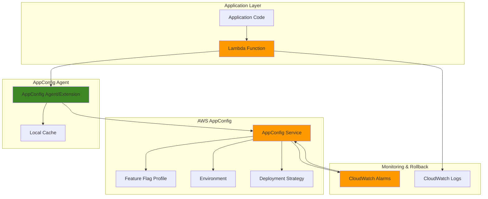

# Feature Flags with AWS AppConfig

## Problem

Development teams face significant risks when deploying new features to production environments, often leading to application downtime, user experience degradation, and costly rollbacks when issues arise. Traditional deployment strategies require full code deployments to enable or disable features, creating tight coupling between feature releases and deployment cycles. This approach limits the ability to perform gradual rollouts, A/B testing, or quick feature disabling during incidents, ultimately slowing down development velocity and increasing operational risk.

## Solution

AWS AppConfig provides a robust feature flag management system that decouples feature releases from code deployments, enabling safe and controlled feature rollouts without requiring application restarts. By integrating AppConfig with Lambda functions and CloudWatch monitoring, teams can implement dynamic feature toggling with automatic rollback capabilities, gradual percentage-based deployments, and real-time monitoring of feature impact. This approach enables continuous deployment while maintaining production stability through sophisticated deployment strategies and monitoring-based safeguards.

## Architecture Diagram



## Prerequisites

1. AWS account with appropriate permissions for AppConfig, Lambda, and CloudWatch
2. AWS CLI v2 installed and configured (or AWS CloudShell)
3. Basic understanding of serverless architecture and configuration management
4. Familiarity with JSON and AWS IAM roles
5. Estimated cost: $5-15 per month for testing workloads (depends on Lambda invocations and AppConfig requests)

> **Note**: AWS AppConfig pricing is based on configuration requests and received configurations. The first 1,000 requests per month are free, with additional requests priced at $0.50 per 1,000 requests.

## Preparation

```bash
# Set environment variables
export AWS_REGION=$(aws configure get region)
export AWS_ACCOUNT_ID=$(aws sts get-caller-identity \
    --query Account --output text)

# Generate unique identifiers for resources
RANDOM_SUFFIX=$(aws secretsmanager get-random-password \
    --exclude-punctuation --exclude-uppercase \
    --password-length 6 --require-each-included-type \
    --output text --query RandomPassword)

# Set resource names
export APP_NAME="feature-demo-app-${RANDOM_SUFFIX}"
export ENVIRONMENT_NAME="production"
export PROFILE_NAME="feature-flags"
export FUNCTION_NAME="feature-flag-demo-${RANDOM_SUFFIX}"
export ROLE_NAME="lambda-appconfig-role-${RANDOM_SUFFIX}"

echo "✅ AWS environment configured for feature flag implementation"
echo "Application: ${APP_NAME}"
echo "Function: ${FUNCTION_NAME}"
```

## Steps

1. **Create IAM Role for Lambda with AppConfig Access**:

   Lambda functions require specific IAM permissions to interact with AWS AppConfig and retrieve feature flag configurations. This role follows the principle of least privilege by granting only the necessary permissions for AppConfig data retrieval and CloudWatch logging, ensuring secure access to configuration data while maintaining operational visibility.

   ```bash
   # Create trust policy for Lambda service
   cat > trust-policy.json << 'EOF'
   {
       "Version": "2012-10-17",
       "Statement": [
           {
               "Effect": "Allow",
               "Principal": {
                   "Service": "lambda.amazonaws.com"
               },
               "Action": "sts:AssumeRole"
           }
       ]
   }
   EOF
   
   # Create IAM role
   aws iam create-role \
       --role-name ${ROLE_NAME} \
       --assume-role-policy-document file://trust-policy.json
   
   # Attach basic Lambda execution policy
   aws iam attach-role-policy \
       --role-name ${ROLE_NAME} \
       --policy-arn arn:aws:iam::aws:policy/service-role/AWSLambdaBasicExecutionRole
   
   # Create AppConfig access policy
   cat > appconfig-policy.json << 'EOF'
   {
       "Version": "2012-10-17",
       "Statement": [
           {
               "Effect": "Allow",
               "Action": [
                   "appconfig:StartConfigurationSession",
                   "appconfig:GetLatestConfiguration"
               ],
               "Resource": "*"
           }
       ]
   }
   EOF
   
   # Create and attach AppConfig policy
   aws iam create-policy \
       --policy-name appconfig-access-policy-${RANDOM_SUFFIX} \
       --policy-document file://appconfig-policy.json
   
   aws iam attach-role-policy \
       --role-name ${ROLE_NAME} \
       --policy-arn arn:aws:iam::${AWS_ACCOUNT_ID}:policy/appconfig-access-policy-${RANDOM_SUFFIX}
   
   # Wait for role propagation
   sleep 15
   
   # Get role ARN
   ROLE_ARN=$(aws iam get-role \
       --role-name ${ROLE_NAME} \
       --query Role.Arn --output text)
   
   echo "✅ IAM role created: ${ROLE_ARN}"
   ```

   The IAM role now provides secure access to AppConfig services while maintaining minimal permissions. This security foundation enables Lambda functions to retrieve feature flag configurations without compromising the overall security posture of the application.

2. **Create AWS AppConfig Application**:

   The AppConfig application serves as the top-level container for all feature flag configurations and environments. This logical grouping enables centralized management of feature flags across different application components while providing clear organization and access control boundaries for configuration data.

   ```bash
   # Create AppConfig application
   aws appconfig create-application \
       --name ${APP_NAME} \
       --description "Feature flag demo application for safe deployments"
   
   # Get application ID
   APP_ID=$(aws appconfig list-applications \
       --query "Items[?Name=='${APP_NAME}'].Id | [0]" \
       --output text)
   
   echo "✅ AppConfig application created: ${APP_ID}"
   ```

   The application container is now ready to host feature flag configurations and environments. This foundational step establishes the organizational structure needed for managing feature flags across development, staging, and production environments.

3. **Create CloudWatch Alarm for Monitoring**:

   CloudWatch alarms provide the monitoring foundation for automatic rollback capabilities. This alarm detects Lambda function errors that could indicate problems with feature flag configurations, enabling AppConfig to automatically roll back problematic deployments to maintain application stability.

   ```bash
   # Create CloudWatch alarm for monitoring application health
   aws cloudwatch put-metric-alarm \
       --alarm-name "lambda-error-rate-${RANDOM_SUFFIX}" \
       --alarm-description "Monitor Lambda function error rate" \
       --metric-name Errors \    
       --namespace AWS/Lambda \
       --statistic Sum \
       --period 300 \
       --threshold 5 \
       --comparison-operator GreaterThanThreshold \
       --evaluation-periods 2 \
       --dimensions Name=FunctionName,Value=${FUNCTION_NAME}
   
   # Get alarm ARN
   ALARM_ARN=$(aws cloudwatch describe-alarms \
       --alarm-names "lambda-error-rate-${RANDOM_SUFFIX}" \
       --query "MetricAlarms[0].AlarmArn" --output text)
   
   echo "✅ CloudWatch alarm created: ${ALARM_ARN}"
   ```

   The alarm is configured to trigger when Lambda function errors exceed acceptable thresholds, providing automatic detection of configuration-related issues. This proactive monitoring enables rapid response to problems during feature flag deployments.

4. **Create AppConfig Environment with Monitoring**:

   The AppConfig environment represents the deployment target for feature flag configurations and includes critical monitoring capabilities. By integrating CloudWatch alarms during environment creation, we establish automatic rollback mechanisms that protect against malformed configurations or unexpected application behavior during feature deployments.

   ```bash
   # Create AppConfig environment with monitoring
   aws appconfig create-environment \
       --application-id ${APP_ID} \
       --name ${ENVIRONMENT_NAME} \
       --description "Production environment with automated rollback" \
       --monitors AlarmArn=${ALARM_ARN}
   
   # Get environment ID
   ENV_ID=$(aws appconfig list-environments \
       --application-id ${APP_ID} \
       --query "Items[?Name=='${ENVIRONMENT_NAME}'].Id | [0]" \
       --output text)
   
   echo "✅ AppConfig environment created with monitoring: ${ENV_ID}"
   ```

   The environment now includes sophisticated monitoring capabilities that enable automatic rollback when application metrics indicate problems. This proactive approach to configuration management ensures that feature flag changes don't negatively impact application performance or user experience.

5. **Create Feature Flag Configuration Profile**:

   Feature flag configuration profiles define the structure and validation rules for feature flags within the application. This hosted configuration approach provides centralized management of feature states, attributes, and targeting rules while ensuring consistency across all application instances through AWS AppConfig's managed infrastructure.

   ```bash
   # Create feature flag configuration profile
   aws appconfig create-configuration-profile \
       --application-id ${APP_ID} \
       --name ${PROFILE_NAME} \
       --location-uri hosted \
       --type AWS.AppConfig.FeatureFlags \
       --description "Feature flags for gradual rollout and A/B testing"
   
   # Get configuration profile ID
   PROFILE_ID=$(aws appconfig list-configuration-profiles \
       --application-id ${APP_ID} \
       --query "Items[?Name=='${PROFILE_NAME}'].Id | [0]" \
       --output text)
   
   echo "✅ Feature flag configuration profile created: ${PROFILE_ID}"
   ```

   The configuration profile establishes the foundation for feature flag management with built-in validation and type safety. This structured approach ensures that feature flag configurations follow consistent patterns and provide reliable behavior across all application environments.

6. **Create Feature Flag Configuration Data**:

   The feature flag configuration data defines the actual flags available to the application, including their default states, attributes, and targeting rules. This JSON-based configuration enables sophisticated feature management scenarios including percentage-based rollouts, user targeting, and attribute-based feature customization.

   ```bash
   # Create feature flag configuration data
   cat > feature-flags.json << 'EOF'
   {
       "flags": {
           "new-checkout-flow": {
               "name": "new-checkout-flow",
               "enabled": false,
               "attributes": {
                   "rollout-percentage": {
                       "constraints": {
                           "type": "number",
                           "required": true
                       }
                   },
                   "target-audience": {
                       "constraints": {
                           "type": "string",
                           "required": false
                       }
                   }
               }
           },
           "enhanced-search": {
               "name": "enhanced-search",
               "enabled": true,
               "attributes": {
                   "search-algorithm": {
                       "constraints": {
                           "type": "string",
                           "required": true
                       }
                   },
                   "cache-ttl": {
                       "constraints": {
                           "type": "number",
                           "required": false
                       }
                   }
               }
           },
           "premium-features": {
               "name": "premium-features",
               "enabled": false,
               "attributes": {
                   "feature-list": {
                       "constraints": {
                           "type": "string",
                           "required": false
                       }
                   }
               }
           }
       },
       "attributes": {
           "rollout-percentage": {
               "number": 0
           },
           "target-audience": {
               "string": "beta-users"
           },
           "search-algorithm": {
               "string": "elasticsearch"
           },
           "cache-ttl": {
               "number": 300
           },
           "feature-list": {
               "string": "advanced-analytics,priority-support"
           }
       }
   }
   EOF
   
   # Create configuration version
   aws appconfig create-hosted-configuration-version \
       --application-id ${APP_ID} \
       --configuration-profile-id ${PROFILE_ID} \
       --content-type "application/json" \
       --content file://feature-flags.json
   
   # Get configuration version
   CONFIG_VERSION=$(aws appconfig list-hosted-configuration-versions \
       --application-id ${APP_ID} \
       --configuration-profile-id ${PROFILE_ID} \
       --query "Items[0].VersionNumber" --output text)
   
   echo "✅ Feature flag configuration created: Version ${CONFIG_VERSION}"
   ```

   The feature flag configuration now includes multiple flags with different states and attributes, demonstrating various use cases from simple on/off toggles to complex attribute-driven features. This comprehensive setup enables sophisticated feature management scenarios while maintaining clear configuration structure.

7. **Create Deployment Strategy for Gradual Rollout**:

   Deployment strategies control how feature flag changes are rolled out to production environments. This gradual deployment approach minimizes risk by slowly increasing the percentage of traffic receiving new configurations while providing monitoring points to detect issues early in the deployment process.

   ```bash
   # Create deployment strategy for gradual rollout
   aws appconfig create-deployment-strategy \
       --name "gradual-rollout-${RANDOM_SUFFIX}" \
       --description "Gradual rollout over 20 minutes with monitoring" \
       --deployment-duration-in-minutes 20 \
       --final-bake-time-in-minutes 10 \
       --growth-factor 25 \
       --growth-type LINEAR \
       --replicate-to NONE
   
   # Get deployment strategy ID
   STRATEGY_ID=$(aws appconfig list-deployment-strategies \
       --query "Items[?Name=='gradual-rollout-${RANDOM_SUFFIX}'].Id | [0]" \
       --output text)
   
   echo "✅ Deployment strategy created: ${STRATEGY_ID}"
   echo "Configuration will roll out over 20 minutes with 25% growth rate"
   ```

   The deployment strategy now provides controlled rollout capabilities with built-in monitoring points. This safety mechanism ensures that feature flag changes are deployed gradually, allowing for early detection of issues and automatic rollback if problems arise during the deployment process.

8. **Create Lambda Function with AppConfig Integration**:

   The Lambda function demonstrates how applications retrieve and use feature flag configurations from AppConfig. By integrating the AppConfig Lambda extension, the function gains efficient access to feature flags with local caching and automatic session management, reducing latency and API call costs.

   ```bash
   # Create Lambda function code
   cat > lambda_function.py << 'EOF'
   import json
   import urllib.request
   import urllib.error
   import os
   
   def lambda_handler(event, context):
       # AppConfig Lambda extension endpoint
       appconfig_url = f"http://localhost:2772/applications/{os.environ['APP_ID']}/environments/{os.environ['ENV_ID']}/configurations/{os.environ['PROFILE_ID']}"
       
       try:
           # Retrieve feature flags from AppConfig
           request = urllib.request.Request(appconfig_url)
           with urllib.request.urlopen(request, timeout=10) as response:
               config_data = json.loads(response.read().decode())
           
           # Extract feature flags
           flags = config_data.get('flags', {})
           attributes = config_data.get('attributes', {})
           
           # Business logic using feature flags
           result = {
               'message': 'Feature flag demo response',
               'features': {}
           }
           
           # Check new checkout flow
           if flags.get('new-checkout-flow', {}).get('enabled', False):
               rollout_percentage = attributes.get('rollout-percentage', {}).get('number', 0)
               result['features']['checkout'] = {
                   'enabled': True,
                   'type': 'new-flow',
                   'rollout_percentage': rollout_percentage
               }
           else:
               result['features']['checkout'] = {
                   'enabled': False,
                   'type': 'legacy-flow'
               }
           
           # Check enhanced search
           if flags.get('enhanced-search', {}).get('enabled', False):
               search_algorithm = attributes.get('search-algorithm', {}).get('string', 'basic')
               cache_ttl = attributes.get('cache-ttl', {}).get('number', 300)
               result['features']['search'] = {
                   'enabled': True,
                   'algorithm': search_algorithm,
                   'cache_ttl': cache_ttl
               }
           else:
               result['features']['search'] = {
                   'enabled': False,
                   'algorithm': 'basic'
               }
           
           # Check premium features
           if flags.get('premium-features', {}).get('enabled', False):
               feature_list = attributes.get('feature-list', {}).get('string', '')
               result['features']['premium'] = {
                   'enabled': True,
                   'features': feature_list.split(',') if feature_list else []
               }
           else:
               result['features']['premium'] = {
                   'enabled': False,
                   'features': []
               }
           
           return {
               'statusCode': 200,
               'body': json.dumps(result, indent=2)
           }
           
       except urllib.error.HTTPError as e:
           print(f"HTTP Error retrieving feature flags: {e.code} - {e.reason}")
           return create_fallback_response(str(e))
       except urllib.error.URLError as e:
           print(f"URL Error retrieving feature flags: {str(e)}")
           return create_fallback_response(str(e))
       except json.JSONDecodeError as e:
           print(f"JSON decode error: {str(e)}")
           return create_fallback_response(str(e))
       except Exception as e:
           print(f"Unexpected error retrieving feature flags: {str(e)}")
           return create_fallback_response(str(e))
   
   def create_fallback_response(error_msg):
       return {
           'statusCode': 200,
           'body': json.dumps({
               'message': 'Using default configuration due to error',
               'error': error_msg,
               'features': {
                   'checkout': {'enabled': False, 'type': 'legacy-flow'},
                   'search': {'enabled': False, 'algorithm': 'basic'},
                   'premium': {'enabled': False, 'features': []}
               }
           }, indent=2)
       }
   EOF
   
   # Create deployment package
   zip lambda-function.zip lambda_function.py
   
   # Create Lambda function
   aws lambda create-function \
       --function-name ${FUNCTION_NAME} \
       --runtime python3.12 \
       --role ${ROLE_ARN} \
       --handler lambda_function.lambda_handler \
       --zip-file fileb://lambda-function.zip \
       --timeout 30 \
       --memory-size 256 \
       --environment Variables="{APP_ID=${APP_ID},ENV_ID=${ENV_ID},PROFILE_ID=${PROFILE_ID}}"
   
   # Add latest AppConfig Lambda extension layer
   aws lambda update-function-configuration \
       --function-name ${FUNCTION_NAME} \
       --layers arn:aws:lambda:${AWS_REGION}:027255383542:layer:AWS-AppConfig-Extension:207
   
   echo "✅ Lambda function created with AppConfig integration"
   ```

   The Lambda function now demonstrates complete feature flag integration with sophisticated error handling and fallback behavior. This implementation showcases how applications can safely consume feature flags while maintaining resilience against configuration service issues through graceful degradation patterns.

9. **Deploy Feature Flag Configuration**:

   The deployment process activates feature flag configurations using the gradual rollout strategy, enabling controlled release of new feature states. This deployment approach provides monitoring-based safeguards and automatic rollback capabilities, ensuring that configuration changes don't negatively impact application performance or user experience.

   ```bash
   # Deploy feature flag configuration
   aws appconfig start-deployment \
       --application-id ${APP_ID} \
       --environment-id ${ENV_ID} \
       --deployment-strategy-id ${STRATEGY_ID} \
       --configuration-profile-id ${PROFILE_ID} \
       --configuration-version ${CONFIG_VERSION} \
       --description "Initial deployment of feature flags"
   
   # Get deployment ID
   DEPLOYMENT_ID=$(aws appconfig list-deployments \
       --application-id ${APP_ID} \
       --environment-id ${ENV_ID} \
       --query "Items[0].DeploymentNumber" --output text)
   
   echo "✅ Feature flag deployment started: ${DEPLOYMENT_ID}"
   echo "Monitor deployment progress in AWS Console or CLI"
   
   # Monitor deployment status
   aws appconfig get-deployment \
       --application-id ${APP_ID} \
       --environment-id ${ENV_ID} \
       --deployment-number ${DEPLOYMENT_ID} \
       --query "State" --output text
   ```

   The deployment is now active and will gradually roll out feature flag configurations over the specified duration. This controlled approach enables safe feature releases with continuous monitoring and automatic rollback capabilities if issues are detected during the deployment process.

## Validation & Testing

1. **Test Lambda Function with Feature Flags**:

   ```bash
   # Test Lambda function
   aws lambda invoke \
       --function-name ${FUNCTION_NAME} \
       --payload '{}' \
       response.json
   
   # Display response
   cat response.json | jq .
   ```

   Expected output should show feature flag states and demonstrate how the application consumes configuration data.

2. **Monitor Deployment Progress**:

   ```bash
   # Check deployment status
   aws appconfig get-deployment \
       --application-id ${APP_ID} \
       --environment-id ${ENV_ID} \
       --deployment-number ${DEPLOYMENT_ID}
   
   # Monitor CloudWatch metrics
   aws cloudwatch get-metric-statistics \
       --namespace AWS/Lambda \
       --metric-name Invocations \
       --dimensions Name=FunctionName,Value=${FUNCTION_NAME} \
       --start-time $(date -u -d '1 hour ago' +%Y-%m-%dT%H:%M:%S) \
       --end-time $(date -u +%Y-%m-%dT%H:%M:%S) \
       --period 300 \
       --statistics Sum
   ```

3. **Test Feature Flag Updates**:

   ```bash
   # Update feature flag to enable new checkout flow
   cat > updated-flags.json << 'EOF'
   {
       "flags": {
           "new-checkout-flow": {
               "name": "new-checkout-flow",
               "enabled": true,
               "attributes": {
                   "rollout-percentage": {
                       "constraints": {
                           "type": "number",
                           "required": true
                       }
                   },
                   "target-audience": {
                       "constraints": {
                           "type": "string",
                           "required": false
                       }
                   }
               }
           },
           "enhanced-search": {
               "name": "enhanced-search",
               "enabled": true,
               "attributes": {
                   "search-algorithm": {
                       "constraints": {
                           "type": "string",
                           "required": true
                       }
                   },
                   "cache-ttl": {
                       "constraints": {
                           "type": "number",
                           "required": false
                       }
                   }
               }
           },
           "premium-features": {
               "name": "premium-features",
               "enabled": true,
               "attributes": {
                   "feature-list": {
                       "constraints": {
                           "type": "string",
                           "required": false
                       }
                   }
               }
           }
       },
       "attributes": {
           "rollout-percentage": {
               "number": 25
           },
           "target-audience": {
               "string": "beta-users"
           },
           "search-algorithm": {
               "string": "elasticsearch"
           },
           "cache-ttl": {
               "number": 300
           },
           "feature-list": {
               "string": "advanced-analytics,priority-support"
           }
       }
   }
   EOF
   
   # Deploy updated configuration
   aws appconfig create-hosted-configuration-version \
       --application-id ${APP_ID} \
       --configuration-profile-id ${PROFILE_ID} \
       --content-type "application/json" \
       --content file://updated-flags.json
   
   # Test Lambda function again to see updated flags
   aws lambda invoke \
       --function-name ${FUNCTION_NAME} \
       --payload '{}' \
       updated-response.json
   
   cat updated-response.json | jq .
   ```

## Cleanup

1. **Stop Active Deployments**:

   ```bash
   # Stop deployment if still in progress
   aws appconfig stop-deployment \
       --application-id ${APP_ID} \
       --environment-id ${ENV_ID} \
       --deployment-number ${DEPLOYMENT_ID} 2>/dev/null || echo "No active deployment to stop"
   
   echo "✅ Deployment stopped (if active)"
   ```

2. **Delete Lambda Function**:

   ```bash
   # Delete Lambda function
   aws lambda delete-function \
       --function-name ${FUNCTION_NAME}
   
   echo "✅ Lambda function deleted"
   ```

3. **Delete AppConfig Resources**:

   ```bash
   # Delete AppConfig environment
   aws appconfig delete-environment \
       --application-id ${APP_ID} \
       --environment-id ${ENV_ID}
   
   # Delete configuration profile
   aws appconfig delete-configuration-profile \
       --application-id ${APP_ID} \
       --configuration-profile-id ${PROFILE_ID}
   
   # Delete deployment strategy
   aws appconfig delete-deployment-strategy \
       --deployment-strategy-id ${STRATEGY_ID}
   
   # Delete application
   aws appconfig delete-application \
       --application-id ${APP_ID}
   
   echo "✅ AppConfig resources deleted"
   ```

4. **Delete IAM Resources**:

   ```bash
   # Detach policies from role
   aws iam detach-role-policy \
       --role-name ${ROLE_NAME} \
       --policy-arn arn:aws:iam::aws:policy/service-role/AWSLambdaBasicExecutionRole
   
   aws iam detach-role-policy \
       --role-name ${ROLE_NAME} \
       --policy-arn arn:aws:iam::${AWS_ACCOUNT_ID}:policy/appconfig-access-policy-${RANDOM_SUFFIX}
   
   # Delete custom policy
   aws iam delete-policy \
       --policy-arn arn:aws:iam::${AWS_ACCOUNT_ID}:policy/appconfig-access-policy-${RANDOM_SUFFIX}
   
   # Delete IAM role
   aws iam delete-role \
       --role-name ${ROLE_NAME}
   
   echo "✅ IAM resources deleted"
   ```

5. **Delete CloudWatch Alarm**:

   ```bash
   # Delete CloudWatch alarm
   aws cloudwatch delete-alarms \
       --alarm-names "lambda-error-rate-${RANDOM_SUFFIX}"
   
   echo "✅ CloudWatch alarm deleted"
   ```

6. **Clean Up Local Files**:

   ```bash
   # Remove temporary files
   rm -f trust-policy.json appconfig-policy.json
   rm -f feature-flags.json updated-flags.json
   rm -f lambda_function.py lambda-function.zip
   rm -f response.json updated-response.json
   
   echo "✅ Local files cleaned up"
   ```

## Discussion

Feature flags represent a fundamental shift in how modern applications handle feature releases and configuration management. AWS AppConfig provides enterprise-grade feature flag capabilities that enable organizations to decouple feature releases from deployment cycles, reducing risk and enabling more frequent, confident deployments. The integration with Lambda functions and CloudWatch monitoring creates a comprehensive system for safe feature rollouts with automatic rollback capabilities.

The gradual deployment strategy implemented in this recipe demonstrates sophisticated release management that gradually increases configuration exposure while continuously monitoring application health. This approach minimizes blast radius during feature releases and provides multiple opportunities to detect and respond to issues before they affect the entire user base. The CloudWatch alarm integration ensures that configuration changes are automatically rolled back if application metrics indicate problems, providing a safety net for production deployments.

The AWS AppConfig Lambda extension plays a crucial role in this architecture by providing efficient, cached access to feature flag configurations. This extension reduces latency by maintaining local configuration caches and managing API calls to the AppConfig service, resulting in cost optimization and improved application performance. The extension's session management capabilities ensure that Lambda functions always have access to the latest approved configuration versions while minimizing API calls and associated costs.

Modern feature flag management extends beyond simple on/off toggles to include sophisticated targeting, percentage-based rollouts, and attribute-driven feature customization. The configuration structure demonstrated in this recipe shows how teams can implement complex feature management scenarios while maintaining clear separation of concerns between application logic and configuration data. This approach enables product teams to control feature exposure without requiring engineering intervention, accelerating time to market while maintaining technical quality.

For additional guidance on AWS AppConfig best practices, consult the [AWS AppConfig User Guide](https://docs.aws.amazon.com/appconfig/latest/userguide/what-is-appconfig.html). The [AWS Well-Architected Framework](https://docs.aws.amazon.com/wellarchitected/latest/framework/welcome.html) provides comprehensive guidance on operational excellence patterns that complement feature flag management strategies.

> **Tip**: Use AWS AppConfig's built-in validation capabilities to ensure feature flag configurations are syntactically correct and semantically valid before deployment. This prevents configuration errors from reaching production environments.

## Challenge

Extend this solution by implementing these enhancements:

1. **Multi-Variant Feature Flags**: Implement A/B testing capabilities using AppConfig's multi-variant feature flags with user segmentation and statistical analysis of feature performance across different user groups.

2. **Integration with CI/CD Pipeline**: Automate feature flag deployments as part of your CI/CD pipeline using AWS CodePipeline, enabling feature flags to be managed as code with proper version control and approval workflows.

3. **Advanced Monitoring Dashboard**: Create a comprehensive CloudWatch dashboard that displays feature flag adoption metrics, deployment success rates, and application performance correlation with feature flag changes.

4. **Feature Flag Lifecycle Management**: Implement automated cleanup processes that identify and remove stale feature flags, along with notifications for flags that have been enabled for extended periods and may be candidates for permanent integration.

5. **Cross-Region Feature Flag Synchronization**: Extend the architecture to support multi-region deployments with synchronized feature flag states across regions, ensuring consistent user experiences in global applications.

## Infrastructure Code

*Infrastructure code will be generated after recipe approval.*