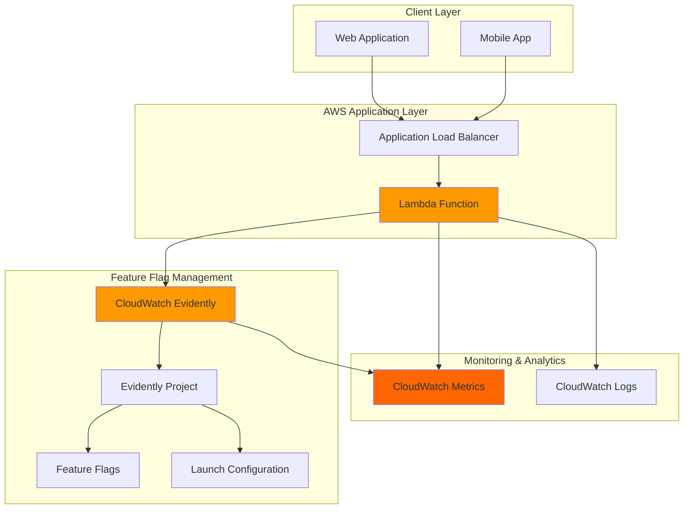

# Feature Flags with CloudWatch Evidently

## Problem

Software development teams struggle with safely deploying new features to production while minimizing risk and enabling rapid rollbacks. Traditional deployment strategies create an all-or-nothing scenario where features are either completely visible to all users or completely hidden, making it difficult to test with specific user segments, perform gradual rollouts, or quickly disable problematic features without full application redeployment.

## Solution

Amazon CloudWatch Evidently provides a managed feature flag service that enables safe feature deployments through controlled exposure, A/B testing, and real-time monitoring. By implementing feature flags with Evidently, teams can gradually roll out features to specific user segments, monitor performance metrics, and instantly toggle features on or off without code changes or redeployments.

> **Important**: AWS is discontinuing CloudWatch Evidently on October 16, 2025. After this date, the service will no longer be available. AWS recommends migrating to [AWS AppConfig feature flags](https://docs.aws.amazon.com/appconfig/latest/userguide/what-is-appconfig.html) as the preferred alternative for feature flag management and experimentation.

## Architecture Diagram



## Prerequisites

1. AWS account with permissions for CloudWatch Evidently, Lambda, and IAM
2. AWS CLI v2 installed and configured (or AWS CloudShell)
3. Basic understanding of feature flags and deployment strategies
4. Familiarity with Lambda functions and API development
5. Estimated cost: $5-15/month for development usage (varies by evaluation volume)

> **Warning**: CloudWatch Evidently will be discontinued on October 16, 2025. This recipe is provided for educational purposes and existing implementations. For new projects, consider using [AWS AppConfig feature flags](https://docs.aws.amazon.com/appconfig/latest/userguide/creating-feature-flags-and-configuration-data.html) instead.

> **Note**: CloudWatch Evidently charges based on feature evaluations. During development, costs typically remain under $10/month. See [Evidently pricing](https://aws.amazon.com/cloudwatch/pricing/) for detailed information.

## Preparation

```bash
# Set environment variables
export AWS_REGION=$(aws configure get region)
export AWS_ACCOUNT_ID=$(aws sts get-caller-identity \
    --query Account --output text)

# Generate unique identifiers for resources
RANDOM_SUFFIX=$(aws secretsmanager get-random-password \
    --exclude-punctuation --exclude-uppercase \
    --password-length 6 --require-each-included-type \
    --output text --query RandomPassword)

export PROJECT_NAME="feature-demo-${RANDOM_SUFFIX}"
export LAMBDA_FUNCTION_NAME="evidently-demo-${RANDOM_SUFFIX}"
export IAM_ROLE_NAME="evidently-lambda-role-${RANDOM_SUFFIX}"

echo "Project name: ${PROJECT_NAME}"
echo "Lambda function: ${LAMBDA_FUNCTION_NAME}"
echo "IAM role: ${IAM_ROLE_NAME}"
```

## Steps

1. **Create IAM Role for Lambda Function**:

   Lambda functions require appropriate IAM permissions to interact with CloudWatch Evidently and write logs. IAM roles provide secure, temporary credentials that follow the principle of least privilege, ensuring your function can access only the specific AWS services it needs for feature flag evaluation.

   ```bash
   # Create IAM role with Lambda service trust policy
   aws iam create-role \
       --role-name ${IAM_ROLE_NAME} \
       --assume-role-policy-document '{
           "Version": "2012-10-17",
           "Statement": [
               {
                   "Effect": "Allow",
                   "Principal": {
                       "Service": "lambda.amazonaws.com"
                   },
                   "Action": "sts:AssumeRole"
               }
           ]
       }'

   # Attach basic Lambda execution policy
   aws iam attach-role-policy \
       --role-name ${IAM_ROLE_NAME} \
       --policy-arn arn:aws:iam::aws:policy/service-role/AWSLambdaBasicExecutionRole

   # Attach CloudWatch Evidently policy for feature evaluation
   aws iam attach-role-policy \
       --role-name ${IAM_ROLE_NAME} \
       --policy-arn arn:aws:iam::aws:policy/CloudWatchEvidentlyFullAccess

   # Wait for IAM role to be available
   sleep 10

   echo "✅ IAM role created with Evidently permissions"
   ```

   The IAM role now provides your Lambda function with the necessary permissions to evaluate feature flags and write CloudWatch logs. This security foundation enables secure communication between your application code and the Evidently service.

2. **Create CloudWatch Evidently Project**:

   An Evidently project serves as the container for all your feature flags and launch configurations. Projects enable logical grouping of related features and provide centralized management for metrics collection, evaluation settings, and access controls across your application features.

   ```bash
   # Create Evidently project
   aws evidently create-project \
       --name ${PROJECT_NAME} \
       --description "Feature flag demonstration project" \
       --data-delivery '{
           "cloudWatchLogs": {
               "logGroup": "/aws/evidently/evaluations"
           }
       }'

   echo "✅ Evidently project created: ${PROJECT_NAME}"
   ```

   The project is now established and configured to deliver evaluation logs to CloudWatch Logs. This logging capability provides audit trails and debugging information for all feature flag evaluations, enabling better observability and troubleshooting.

3. **Create Feature Flag with Variations**:

   Feature flags in Evidently support multiple variations, enabling complex scenarios like A/B testing, gradual rollouts, and configuration management. Each variation can contain different values (boolean, string, long, or double) that your application logic can use to control behavior dynamically.

   ```bash
   # Create a feature flag with boolean variations
   aws evidently create-feature \
       --project ${PROJECT_NAME} \
       --name "new-checkout-flow" \
       --description "Controls visibility of the new checkout experience" \
       --variations '{
           "enabled": {
               "name": "enabled",
               "value": {
                   "boolValue": true
               }
           },
           "disabled": {
               "name": "disabled",
               "value": {
                   "boolValue": false
               }
           }
       }' \
       --default-variation "disabled"

   echo "✅ Feature flag 'new-checkout-flow' created with enabled/disabled variations"
   ```

   The feature flag is now available for evaluation with two variations: enabled (true) and disabled (false). The default variation ensures consistent behavior when no specific audience rules apply, providing a safe fallback for all feature evaluations.

> **Warning**: Always set conservative default variations for new features. Start with features disabled by default to prevent unintended exposure to all users before proper testing and launch configuration.

4. **Create Launch Configuration for Gradual Rollout**:

   Launch configurations define how feature variations are distributed to different user segments. Evidently supports sophisticated targeting rules based on user attributes, percentage-based splits, and scheduled rollouts, enabling sophisticated deployment strategies without application code changes.

   ```bash
   # Create launch with 10% traffic allocation to new feature
   aws evidently create-launch \
       --project ${PROJECT_NAME} \
       --name "checkout-gradual-rollout" \
       --description "Gradual rollout of new checkout flow to 10% of users" \
       --groups '[
           {
               "name": "control-group",
               "description": "Users with existing checkout flow",
               "feature": "new-checkout-flow",
               "variation": "disabled"
           },
           {
               "name": "treatment-group", 
               "description": "Users with new checkout flow",
               "feature": "new-checkout-flow",
               "variation": "enabled"
           }
       ]' \
       --scheduled-splits-config '{
           "steps": [
               {
                   "startTime": "'$(date -u +%Y-%m-%dT%H:%M:%SZ)'",
                   "groupWeights": {
                       "control-group": 90,
                       "treatment-group": 10
                   }
               }
           ]
       }'

   echo "✅ Launch created with 10% traffic to new checkout flow"
   ```

   The launch configuration now controls feature distribution with 90% of users receiving the existing experience and 10% receiving the new checkout flow. This gradual rollout strategy minimizes risk while gathering real-world performance data from a subset of users.

5. **Create Lambda Function for Feature Evaluation**:

   The Lambda function demonstrates how applications integrate with Evidently to evaluate feature flags. This serverless approach enables scalable, event-driven feature evaluation that can handle varying traffic loads while maintaining low latency for feature flag decisions.

   ```bash
   # Create Lambda function code
   cat > lambda_function.py << 'EOF'
import json
import boto3
import os

def lambda_handler(event, context):
    # Initialize Evidently client
    evidently = boto3.client('evidently')
    
    # Extract user information from event
    user_id = event.get('userId', 'anonymous-user')
    project_name = os.environ['PROJECT_NAME']
    
    try:
        # Evaluate feature flag for user
        response = evidently.evaluate_feature(
            project=project_name,
            feature='new-checkout-flow',
            entityId=user_id
        )
        
        feature_enabled = response['variation'] == 'enabled'
        
        # Log evaluation for debugging
        print(f"Feature evaluation for user {user_id}: {response['variation']}")
        
        return {
            'statusCode': 200,
            'body': json.dumps({
                'userId': user_id,
                'featureEnabled': feature_enabled,
                'variation': response['variation'],
                'reason': response.get('reason', 'default')
            })
        }
        
    except Exception as e:
        print(f"Error evaluating feature: {str(e)}")
        return {
            'statusCode': 500,
            'body': json.dumps({
                'error': 'Feature evaluation failed',
                'userId': user_id,
                'featureEnabled': False  # Safe default
            })
        }
EOF

   # Package and deploy Lambda function
   zip lambda-package.zip lambda_function.py

   aws lambda create-function \
       --function-name ${LAMBDA_FUNCTION_NAME} \
       --runtime python3.12 \
       --role arn:aws:iam::${AWS_ACCOUNT_ID}:role/${IAM_ROLE_NAME} \
       --handler lambda_function.lambda_handler \
       --zip-file fileb://lambda-package.zip \
       --environment Variables="{PROJECT_NAME=${PROJECT_NAME}}" \
       --timeout 30

   echo "✅ Lambda function deployed with feature evaluation logic"
   ```

   The Lambda function is now deployed and configured to evaluate the checkout flow feature flag. It demonstrates proper error handling, logging, and safe defaults - essential patterns for production feature flag implementations that ensure application reliability even when feature evaluation fails.

6. **Start the Launch to Begin Traffic Split**:

   Starting a launch activates the traffic splitting configuration, beginning the actual feature rollout to users. Evidently immediately begins routing traffic according to your specified percentages and starts collecting metrics for analysis and decision-making.

   ```bash
   # Start the launch to begin rollout
   aws evidently start-launch \
       --project ${PROJECT_NAME} \
       --launch "checkout-gradual-rollout"

   echo "✅ Launch started - 10% of traffic now receiving new checkout flow"
   ```

   The feature rollout is now active with real traffic being split between the control and treatment groups. Evidently begins collecting evaluation metrics that you can monitor to assess feature performance and user engagement with the new checkout experience.

> **Tip**: Monitor your CloudWatch Logs group `/aws/evidently/evaluations` to observe real-time feature flag evaluations. This provides valuable insights into user distribution and feature performance patterns.

## Validation & Testing

1. **Test Feature Flag Evaluation**:

   ```bash
   # Test Lambda function with sample user data
   aws lambda invoke \
       --function-name ${LAMBDA_FUNCTION_NAME} \
       --payload '{"userId": "test-user-123"}' \
       response.json

   # Display evaluation result (requires jq for formatting)
   cat response.json | jq '.' || cat response.json
   ```

   Expected output: JSON response showing feature evaluation result with user ID, enabled status, and variation.

2. **Verify Launch Status**:

   ```bash
   # Check launch configuration and status
   aws evidently get-launch \
       --project ${PROJECT_NAME} \
       --launch "checkout-gradual-rollout" \
       --query 'status'
   ```

   Expected output: `"RUNNING"` indicating the launch is actively splitting traffic.

3. **Monitor Feature Evaluations**:

   ```bash
   # Check CloudWatch Logs for evaluation events
   aws logs describe-log-streams \
       --log-group-name "/aws/evidently/evaluations" \
       --order-by LastEventTime \
       --descending \
       --max-items 5
   ```

   Expected output: List of recent log streams containing feature evaluation events.

## Cleanup

1. **Stop and Delete Launch**:

   ```bash
   # Stop the launch
   aws evidently stop-launch \
       --project ${PROJECT_NAME} \
       --launch "checkout-gradual-rollout"

   # Wait for launch to stop
   aws evidently get-launch \
       --project ${PROJECT_NAME} \
       --launch "checkout-gradual-rollout" \
       --query 'status'

   # Delete the launch
   aws evidently delete-launch \
       --project ${PROJECT_NAME} \
       --launch "checkout-gradual-rollout"

   echo "✅ Launch stopped and deleted"
   ```

2. **Delete Feature Flag**:

   ```bash
   # Delete the feature flag
   aws evidently delete-feature \
       --project ${PROJECT_NAME} \
       --feature "new-checkout-flow"

   echo "✅ Feature flag deleted"
   ```

3. **Delete Evidently Project**:

   ```bash
   # Delete the project
   aws evidently delete-project \
       --project ${PROJECT_NAME}

   echo "✅ Evidently project deleted"
   ```

4. **Remove Lambda Function and IAM Role**:

   ```bash
   # Delete Lambda function
   aws lambda delete-function \
       --function-name ${LAMBDA_FUNCTION_NAME}

   # Detach policies from IAM role
   aws iam detach-role-policy \
       --role-name ${IAM_ROLE_NAME} \
       --policy-arn arn:aws:iam::aws:policy/service-role/AWSLambdaBasicExecutionRole

   aws iam detach-role-policy \
       --role-name ${IAM_ROLE_NAME} \
       --policy-arn arn:aws:iam::aws:policy/CloudWatchEvidentlyFullAccess

   # Delete IAM role
   aws iam delete-role --role-name ${IAM_ROLE_NAME}

   # Remove local files
   rm -f lambda_function.py lambda-package.zip response.json

   echo "✅ All resources cleaned up"
   ```

## Discussion

CloudWatch Evidently transforms feature deployment from a high-risk, all-or-nothing process into a controlled, data-driven strategy. By decoupling feature releases from code deployments, teams can deploy code to production while keeping features hidden, then gradually expose functionality based on real-world performance metrics and user feedback. This approach significantly reduces deployment risk and enables faster iteration cycles.

The launch configuration system provides sophisticated traffic management capabilities that go beyond simple percentage splits. Teams can target specific user segments based on attributes, implement time-based rollouts, and create complex experimental designs for A/B testing. The built-in integration with CloudWatch metrics enables automatic monitoring of business and technical KPIs, supporting data-driven decisions about feature rollouts.

Evidently's evaluation API is designed for high-throughput applications with sub-millisecond response times and 99.9% availability. The service automatically handles edge cases like network failures and service unavailability by returning cached values or defaults, ensuring feature flag evaluations never become a bottleneck for application performance. This reliability makes it suitable for mission-critical applications where feature flag failures could impact user experience.

The combination of Evidently with Lambda demonstrates a serverless approach to feature management that scales automatically with application load. This architecture pattern works equally well with container-based applications, traditional server deployments, and modern serverless architectures, providing consistency across diverse technology stacks.

**Migration Path**: As CloudWatch Evidently reaches end-of-life on October 16, 2025, teams should plan migration to [AWS AppConfig feature flags](https://docs.aws.amazon.com/appconfig/latest/userguide/what-is-appconfig.html), which provides similar capabilities with better integration into the broader AWS ecosystem. The [AWS AppConfig migration guide](https://docs.aws.amazon.com/appconfig/latest/userguide/retrieving-feature-flags.html) provides detailed steps for transitioning feature flag implementations.

> **Tip**: Use AWS X-Ray for distributed tracing to monitor feature flag performance and identify bottlenecks across your serverless architecture. The [X-Ray documentation](https://docs.aws.amazon.com/xray/latest/devguide/) provides comprehensive guidance for implementing observability in Lambda functions.

## Challenge

Extend this solution by implementing these enhancements:

1. **Multi-Metric Launch Optimization**: Configure automatic traffic ramping based on custom CloudWatch metrics like conversion rates, error rates, or user engagement scores.

2. **Advanced Audience Targeting**: Implement custom user segmentation based on geographic location, device type, or user behavior patterns using Evidently's entity attributes.

3. **Cross-Service Feature Coordination**: Create multiple interconnected feature flags across different services (web frontend, mobile app, API backend) with coordinated rollout schedules.

4. **Real-Time Alert Integration**: Set up CloudWatch alarms that automatically stop launches when error rates exceed thresholds or business metrics decline significantly.

5. **Enterprise Integration**: Integrate with existing CI/CD pipelines to automatically create and manage feature flags as part of the deployment process, including automated rollback triggers.

6. **Migration to AppConfig**: Plan and implement migration from Evidently to AWS AppConfig feature flags, taking advantage of AppConfig's enhanced validation, deployment strategies, and integration with other AWS services.

## Infrastructure Code

### Available Infrastructure as Code:

- [Infrastructure Code Overview](code/README.md) - Detailed description of all infrastructure components
- [AWS CDK (Python)](code/cdk-python/) - AWS CDK Python implementation
- [AWS CDK (TypeScript)](code/cdk-typescript/) - AWS CDK TypeScript implementation
- [CloudFormation](code/cloudformation.yaml) - AWS CloudFormation template
- [Bash CLI Scripts](code/scripts/) - Example bash scripts using AWS CLI commands to deploy infrastructure
- [Terraform](code/terraform/) - Terraform configuration files