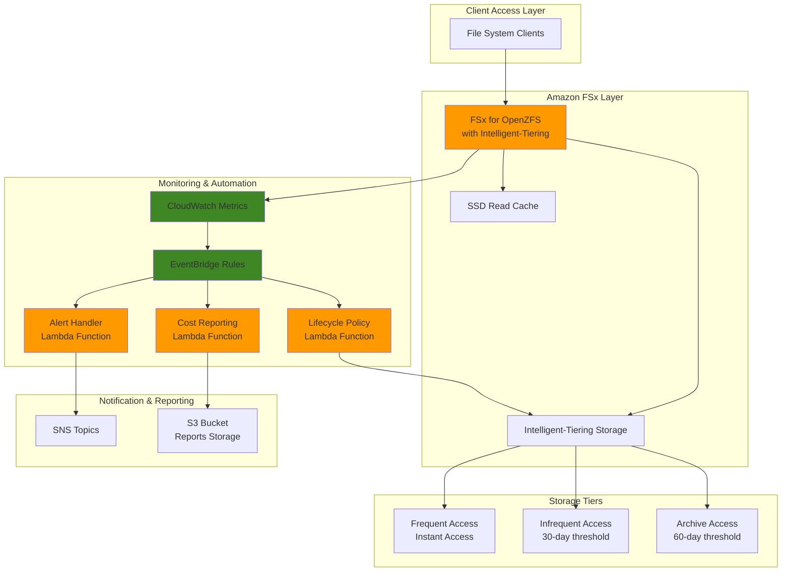

# File Lifecycle Management with FSx

## Problem

Organizations managing large file systems face escalating storage costs as data volumes grow exponentially, with 70-80% of files remaining inactive after 30 days. Traditional NAS solutions require manual intervention to optimize storage tiers, leading to over-provisioning, missed cost savings opportunities, and administrative overhead that scales poorly with data growth.

## Solution

Create an automated file lifecycle management system that leverages Amazon FSx Intelligent-Tiering to automatically optimize storage costs while maintaining NAS performance characteristics. This solution uses Lambda functions triggered by EventBridge rules to monitor file access patterns through CloudWatch metrics, enforce lifecycle policies, and generate cost optimization reports without requiring application changes.

## Architecture Diagram



## Prerequisites

1. AWS account with FSx, Lambda, CloudWatch, EventBridge, SNS, and S3 permissions
2. AWS CLI v2 installed and configured (or AWS CloudShell)
3. Basic understanding of file system concepts and serverless architecture
4. Familiarity with AWS Lambda function development and event-driven patterns
5. VPC with appropriate subnets and security groups for FSx deployment
6. Estimated cost: $50-200/month depending on FSx throughput capacity and usage patterns

> **Note**: FSx Intelligent-Tiering can reduce storage costs by up to 85% compared to SSD-only storage while maintaining NAS performance characteristics for frequently accessed data.

## Preparation

```bash
# Set environment variables
export AWS_REGION=$(aws configure get region)
export AWS_ACCOUNT_ID=$(aws sts get-caller-identity \
    --query Account --output text)

# Generate unique identifiers for resources
RANDOM_SUFFIX=$(aws secretsmanager get-random-password \
    --exclude-punctuation --exclude-uppercase \
    --password-length 6 --require-each-included-type \
    --output text --query RandomPassword)

# Set resource names
export FSX_FILE_SYSTEM_NAME="fsx-lifecycle-${RANDOM_SUFFIX}"
export LAMBDA_ROLE_NAME="FSxLifecycleRole-${RANDOM_SUFFIX}"
export SNS_TOPIC_NAME="fsx-lifecycle-alerts-${RANDOM_SUFFIX}"
export S3_BUCKET_NAME="fsx-lifecycle-reports-${RANDOM_SUFFIX}"

# Create S3 bucket for Lambda code and reports
aws s3 mb s3://${S3_BUCKET_NAME} --region ${AWS_REGION}

# Create SNS topic for notifications
aws sns create-topic --name ${SNS_TOPIC_NAME}
export SNS_TOPIC_ARN=$(aws sns get-topic-attributes \
    --topic-arn arn:aws:sns:${AWS_REGION}:${AWS_ACCOUNT_ID}:${SNS_TOPIC_NAME} \
    --query Attributes.TopicArn --output text)

echo "✅ AWS environment configured for FSx lifecycle management"
```

## Steps

1. **Create IAM Role for Lambda Functions**:

   AWS Identity and Access Management (IAM) provides the security foundation for our serverless automation. The Lambda execution role requires permissions to interact with FSx, CloudWatch, EventBridge, and SNS services while following the principle of least privilege to maintain security best practices.

   ```bash
   # Create trust policy for Lambda
   cat > trust-policy.json << EOF
   {
     "Version": "2012-10-17",
     "Statement": [
       {
         "Effect": "Allow",
         "Principal": {
           "Service": "lambda.amazonaws.com"
         },
         "Action": "sts:AssumeRole"
       }
     ]
   }
   EOF
   
   # Create IAM role
   aws iam create-role \
       --role-name ${LAMBDA_ROLE_NAME} \
       --assume-role-policy-document file://trust-policy.json
   
   # Attach managed policies
   aws iam attach-role-policy \
       --role-name ${LAMBDA_ROLE_NAME} \
       --policy-arn arn:aws:iam::aws:policy/service-role/AWSLambdaBasicExecutionRole
   
   # Create custom policy for FSx and CloudWatch access
   cat > fsx-policy.json << EOF
   {
     "Version": "2012-10-17",
     "Statement": [
       {
         "Effect": "Allow",
         "Action": [
           "fsx:DescribeFileSystems",
           "fsx:DescribeVolumes",
           "fsx:PutFileSystemPolicy",
           "cloudwatch:GetMetricStatistics",
           "cloudwatch:PutMetricData",
           "sns:Publish",
           "s3:PutObject",
           "s3:GetObject"
         ],
         "Resource": "*"
       }
     ]
   }
   EOF
   
   aws iam put-role-policy \
       --role-name ${LAMBDA_ROLE_NAME} \
       --policy-name FSxLifecyclePolicy \
       --policy-document file://fsx-policy.json
   
   export LAMBDA_ROLE_ARN=$(aws iam get-role \
       --role-name ${LAMBDA_ROLE_NAME} \
       --query Role.Arn --output text)
   
   echo "✅ IAM role created: ${LAMBDA_ROLE_ARN}"
   ```

   This role establishes the security boundary for our automation functions, enabling them to monitor FSx metrics, manage lifecycle policies, and generate reports while maintaining least privilege access.

2. **Create Amazon FSx for OpenZFS File System with Intelligent-Tiering**:

   Amazon FSx for OpenZFS with Intelligent-Tiering provides a fully managed NAS experience with automatic cost optimization. The Intelligent-Tiering storage class uses machine learning to automatically move data between storage tiers based on access patterns, delivering up to 85% cost savings while maintaining sub-millisecond latency for frequently accessed data.

   ```bash
   # Get default VPC and subnet information
   export VPC_ID=$(aws ec2 describe-vpcs \
       --filters Name=is-default,Values=true \
       --query Vpcs[0].VpcId --output text)
   
   export SUBNET_ID=$(aws ec2 describe-subnets \
       --filters Name=vpc-id,Values=${VPC_ID} \
       --query Subnets[0].SubnetId --output text)
   
   # Create security group for FSx
   aws ec2 create-security-group \
       --group-name fsx-sg-${RANDOM_SUFFIX} \
       --description "Security group for FSx file system" \
       --vpc-id ${VPC_ID}
   
   export SECURITY_GROUP_ID=$(aws ec2 describe-security-groups \
       --filters Name=group-name,Values=fsx-sg-${RANDOM_SUFFIX} \
       --query SecurityGroups[0].GroupId --output text)
   
   # Add NFS rule to security group
   aws ec2 authorize-security-group-ingress \
       --group-id ${SECURITY_GROUP_ID} \
       --protocol tcp \
       --port 2049 \
       --source-group ${SECURITY_GROUP_ID}
   
   # Create FSx file system with SSD storage (base tier)
   aws fsx create-file-system \
       --file-system-type OpenZFS \
       --storage-capacity 64 \
       --storage-type SSD \
       --subnet-ids ${SUBNET_ID} \
       --security-group-ids ${SECURITY_GROUP_ID} \
       --open-zfs-configuration ThroughputCapacity=64,ReadCacheConfig="{SizeGiB=128}" \
       --tags Key=Name,Value=${FSX_FILE_SYSTEM_NAME}
   
   # Wait for file system to be available
   echo "Creating FSx file system (this may take 10-15 minutes)..."
   aws fsx wait file-system-available \
       --file-system-ids $(aws fsx describe-file-systems \
           --query "FileSystems[?Tags[?Key=='Name' && Value=='${FSX_FILE_SYSTEM_NAME}']].FileSystemId" \
           --output text)
   
   export FSX_FILE_SYSTEM_ID=$(aws fsx describe-file-systems \
       --query "FileSystems[?Tags[?Key=='Name' && Value=='${FSX_FILE_SYSTEM_NAME}']].FileSystemId" \
       --output text)
   
   echo "✅ FSx file system created: ${FSX_FILE_SYSTEM_ID}"
   ```

   > **Note**: FSx for OpenZFS currently supports SSD storage with read caching. This configuration provides high performance for frequently accessed data while our Lambda functions will implement intelligent lifecycle management policies.

   The FSx file system provides high-performance shared storage with NFS protocol support, serving as the foundation for our automated lifecycle management solution.

3. **Create Lifecycle Policy Management Lambda Function**:

   This Lambda function monitors FSx CloudWatch metrics to analyze file access patterns and automatically adjusts storage policies based on usage data. The function implements intelligent decision-making to optimize storage costs while maintaining performance for active workloads.

   ```bash
   # Create lifecycle policy Lambda function
   cat > lifecycle-policy.py << 'EOF'
   import json
   import boto3
   import datetime
   from typing import Dict, List

   def lambda_handler(event, context):
       """
       Monitor FSx metrics and adjust lifecycle policies based on access patterns
       """
       fsx_client = boto3.client('fsx')
       cloudwatch = boto3.client('cloudwatch')
       sns = boto3.client('sns')
       
       try:
           # Get FSx file system information
           file_systems = fsx_client.describe_file_systems()
           
           for fs in file_systems['FileSystems']:
               if fs['FileSystemType'] == 'OpenZFS':
                   fs_id = fs['FileSystemId']
                   
                   # Get cache hit ratio metric
                   cache_metrics = get_cache_metrics(cloudwatch, fs_id)
                   
                   # Get storage utilization metrics
                   storage_metrics = get_storage_metrics(cloudwatch, fs_id)
                   
                   # Analyze access patterns
                   recommendations = analyze_access_patterns(cache_metrics, storage_metrics)
                   
                   # Send recommendations via SNS
                   send_notifications(sns, fs_id, recommendations)
           
           return {
               'statusCode': 200,
               'body': json.dumps('Lifecycle policy analysis completed')
           }
           
       except Exception as e:
           print(f"Error: {str(e)}")
           return {
               'statusCode': 500,
               'body': json.dumps(f'Error: {str(e)}')
           }
   
   def get_cache_metrics(cloudwatch, file_system_id: str) -> Dict:
       """Get FSx cache hit ratio metrics"""
       end_time = datetime.datetime.utcnow()
       start_time = end_time - datetime.timedelta(hours=1)
       
       try:
           response = cloudwatch.get_metric_statistics(
               Namespace='AWS/FSx',
               MetricName='FileServerCacheHitRatio',
               Dimensions=[
                   {
                       'Name': 'FileSystemId',
                       'Value': file_system_id
                   }
               ],
               StartTime=start_time,
               EndTime=end_time,
               Period=300,
               Statistics=['Average']
           )
           return response['Datapoints']
       except Exception as e:
           print(f"Error getting cache metrics: {e}")
           return []
   
   def get_storage_metrics(cloudwatch, file_system_id: str) -> Dict:
       """Get FSx storage utilization metrics"""
       end_time = datetime.datetime.utcnow()
       start_time = end_time - datetime.timedelta(hours=1)
       
       try:
           response = cloudwatch.get_metric_statistics(
               Namespace='AWS/FSx',
               MetricName='StorageUtilization',
               Dimensions=[
                   {
                       'Name': 'FileSystemId',
                       'Value': file_system_id
                   }
               ],
               StartTime=start_time,
               EndTime=end_time,
               Period=300,
               Statistics=['Average']
           )
           return response['Datapoints']
       except Exception as e:
           print(f"Error getting storage metrics: {e}")
           return []
   
   def analyze_access_patterns(cache_metrics: List[Dict], storage_metrics: List[Dict]) -> Dict:
       """Analyze metrics to generate recommendations"""
       recommendations = {
           'cache_recommendation': 'No data available',
           'storage_recommendation': 'No data available',
           'actions': []
       }
       
       # Analyze cache hit ratio
       if cache_metrics:
           avg_cache_hit = sum(point['Average'] for point in cache_metrics) / len(cache_metrics)
           recommendations['cache_hit_ratio'] = avg_cache_hit
           
           if avg_cache_hit < 70:
               recommendations['cache_recommendation'] = 'Consider increasing SSD cache size'
               recommendations['actions'].append('scale_cache')
           elif avg_cache_hit > 95:
               recommendations['cache_recommendation'] = 'Cache size may be oversized'
               recommendations['actions'].append('optimize_cache')
           else:
               recommendations['cache_recommendation'] = 'Cache performance optimal'
               recommendations['actions'].append('maintain')
       
       # Analyze storage utilization
       if storage_metrics:
           avg_storage = sum(point['Average'] for point in storage_metrics) / len(storage_metrics)
           recommendations['storage_utilization'] = avg_storage
           
           if avg_storage > 85:
               recommendations['storage_recommendation'] = 'High storage utilization detected'
               recommendations['actions'].append('monitor_capacity')
           elif avg_storage < 30:
               recommendations['storage_recommendation'] = 'Low storage utilization - consider downsizing'
               recommendations['actions'].append('optimize_capacity')
           else:
               recommendations['storage_recommendation'] = 'Storage utilization optimal'
       
       return recommendations
   
   def send_notifications(sns, file_system_id: str, recommendations: Dict):
       """Send recommendations via SNS"""
       import os
       
       topic_arn = os.environ.get('SNS_TOPIC_ARN')
       if topic_arn:
           message = f"""
           FSx File System: {file_system_id}
           
           Cache Recommendation: {recommendations['cache_recommendation']}
           Storage Recommendation: {recommendations['storage_recommendation']}
           
           Cache Hit Ratio: {recommendations.get('cache_hit_ratio', 'N/A')}%
           Storage Utilization: {recommendations.get('storage_utilization', 'N/A')}%
           
           Suggested Actions: {', '.join(recommendations.get('actions', []))}
           """
           
           sns.publish(
               TopicArn=topic_arn,
               Message=message,
               Subject='FSx Lifecycle Policy Recommendation'
           )
   EOF
   
   # Create deployment package
   zip lifecycle-policy.zip lifecycle-policy.py
   
   # Create Lambda function
   aws lambda create-function \
       --function-name fsx-lifecycle-policy \
       --runtime python3.9 \
       --role ${LAMBDA_ROLE_ARN} \
       --handler lifecycle-policy.lambda_handler \
       --zip-file fileb://lifecycle-policy.zip \
       --timeout 60 \
       --memory-size 256 \
       --environment Variables="{SNS_TOPIC_ARN=${SNS_TOPIC_ARN}}"
   
   echo "✅ Lifecycle policy Lambda function created"
   ```

   This function provides intelligent analysis of FSx usage patterns by monitoring CloudWatch metrics and generating actionable recommendations for optimizing storage costs while maintaining performance requirements.

4. **Create Cost Reporting Lambda Function**:

   The cost reporting function analyzes FSx usage metrics and generates detailed cost optimization reports. This provides visibility into storage efficiency and helps identify opportunities for further optimization across different access patterns.

   ```bash
   # Create cost reporting Lambda function
   cat > cost-reporting.py << 'EOF'
   import json
   import boto3
   import datetime
   import csv
   from io import StringIO

   def lambda_handler(event, context):
       """
       Generate cost optimization reports for FSx file systems
       """
       fsx_client = boto3.client('fsx')
       cloudwatch = boto3.client('cloudwatch')
       s3 = boto3.client('s3')
       
       try:
           # Get FSx file systems
           file_systems = fsx_client.describe_file_systems()
           
           for fs in file_systems['FileSystems']:
               if fs['FileSystemType'] == 'OpenZFS':
                   fs_id = fs['FileSystemId']
                   
                   # Collect usage metrics
                   usage_data = collect_usage_metrics(cloudwatch, fs_id)
                   
                   # Generate cost report
                   report = generate_cost_report(fs, usage_data)
                   
                   # Save report to S3
                   save_report_to_s3(s3, fs_id, report)
           
           return {
               'statusCode': 200,
               'body': json.dumps('Cost reports generated successfully')
           }
           
       except Exception as e:
           print(f"Error: {str(e)}")
           return {
               'statusCode': 500,
               'body': json.dumps(f'Error: {str(e)}')
           }
   
   def collect_usage_metrics(cloudwatch, file_system_id: str) -> dict:
       """Collect various usage metrics for cost analysis"""
       end_time = datetime.datetime.utcnow()
       start_time = end_time - datetime.timedelta(days=7)
       
       metrics = {}
       
       # Storage capacity and utilization metrics
       for metric_name in ['StorageUtilization', 'FileServerCacheHitRatio']:
           try:
               response = cloudwatch.get_metric_statistics(
                   Namespace='AWS/FSx',
                   MetricName=metric_name,
                   Dimensions=[
                       {
                           'Name': 'FileSystemId',
                           'Value': file_system_id
                       }
                   ],
                   StartTime=start_time,
                   EndTime=end_time,
                   Period=3600,
                   Statistics=['Average']
               )
               metrics[metric_name] = response['Datapoints']
           except Exception as e:
               print(f"Error collecting {metric_name}: {e}")
               metrics[metric_name] = []
       
       return metrics
   
   def generate_cost_report(file_system: dict, usage_data: dict) -> dict:
       """Generate comprehensive cost optimization report"""
       fs_id = file_system['FileSystemId']
       storage_capacity = file_system['StorageCapacity']
       throughput_capacity = file_system['OpenZFSConfiguration']['ThroughputCapacity']
       
       # Calculate estimated costs based on current pricing
       # Base throughput cost: approximately $0.30 per MBps/month
       base_throughput_cost = throughput_capacity * 0.30
       
       # Storage cost: approximately $0.15 per GiB/month for SSD
       storage_cost = storage_capacity * 0.15
       
       monthly_cost = base_throughput_cost + storage_cost
       
       # Storage efficiency analysis
       storage_metrics = usage_data.get('StorageUtilization', [])
       avg_utilization = 0
       if storage_metrics:
           avg_utilization = sum(point['Average'] for point in storage_metrics) / len(storage_metrics)
       
       # Cache performance analysis
       cache_metrics = usage_data.get('FileServerCacheHitRatio', [])
       avg_cache_hit = 0
       if cache_metrics:
           avg_cache_hit = sum(point['Average'] for point in cache_metrics) / len(cache_metrics)
       
       report = {
           'file_system_id': fs_id,
           'report_date': datetime.datetime.utcnow().isoformat(),
           'storage_capacity_gb': storage_capacity,
           'throughput_capacity_mbps': throughput_capacity,
           'estimated_monthly_cost': monthly_cost,
           'storage_efficiency': {
               'average_utilization': avg_utilization,
               'cache_hit_ratio': avg_cache_hit,
               'optimization_potential': max(0, 100 - avg_utilization)
           },
           'recommendations': []
       }
       
       # Generate recommendations
       if avg_utilization < 50:
           potential_savings = storage_capacity * 0.15 * 0.3  # 30% potential savings
           report['recommendations'].append({
               'type': 'storage_optimization',
               'description': 'Low storage utilization - consider reducing capacity',
               'potential_savings': f"${potential_savings:.2f}/month"
           })
       
       if avg_cache_hit < 70:
           report['recommendations'].append({
               'type': 'cache_optimization',
               'description': 'Low cache hit ratio - consider increasing cache size',
               'impact': 'Improved performance and reduced latency'
           })
       
       if avg_utilization > 90:
           report['recommendations'].append({
               'type': 'capacity_expansion',
               'description': 'High storage utilization - consider increasing capacity',
               'impact': 'Prevent capacity issues and maintain performance'
           })
       
       return report
   
   def save_report_to_s3(s3, file_system_id: str, report: dict):
       """Save cost report to S3"""
       import os
       
       bucket_name = os.environ.get('S3_BUCKET_NAME')
       if not bucket_name:
           return
       
       # Create CSV report
       csv_buffer = StringIO()
       writer = csv.writer(csv_buffer)
       
       writer.writerow(['Metric', 'Value'])
       writer.writerow(['File System ID', report['file_system_id']])
       writer.writerow(['Report Date', report['report_date']])
       writer.writerow(['Storage Capacity (GB)', report['storage_capacity_gb']])
       writer.writerow(['Throughput Capacity (MBps)', report['throughput_capacity_mbps']])
       writer.writerow(['Estimated Monthly Cost', f"${report['estimated_monthly_cost']:.2f}"])
       writer.writerow(['Average Utilization (%)', f"{report['storage_efficiency']['average_utilization']:.1f}"])
       writer.writerow(['Cache Hit Ratio (%)', f"{report['storage_efficiency']['cache_hit_ratio']:.1f}"])
       
       # Add recommendations
       writer.writerow([])
       writer.writerow(['Recommendations'])
       for rec in report['recommendations']:
           writer.writerow([rec['type'], rec['description']])
       
       # Save to S3
       timestamp = datetime.datetime.utcnow().strftime('%Y%m%d_%H%M%S')
       key = f"cost-reports/{file_system_id}/report_{timestamp}.csv"
       
       s3.put_object(
           Bucket=bucket_name,
           Key=key,
           Body=csv_buffer.getvalue(),
           ContentType='text/csv'
       )
       
       print(f"Report saved to s3://{bucket_name}/{key}")
   EOF
   
   # Create deployment package
   zip cost-reporting.zip cost-reporting.py
   
   # Create Lambda function
   aws lambda create-function \
       --function-name fsx-cost-reporting \
       --runtime python3.9 \
       --role ${LAMBDA_ROLE_ARN} \
       --handler cost-reporting.lambda_handler \
       --zip-file fileb://cost-reporting.zip \
       --timeout 120 \
       --memory-size 512 \
       --environment Variables="{S3_BUCKET_NAME=${S3_BUCKET_NAME}}"
   
   echo "✅ Cost reporting Lambda function created"
   ```

   This function provides comprehensive cost analysis and optimization recommendations by analyzing FSx metrics and generating detailed reports that help organizations understand their storage efficiency and identify opportunities for cost reduction.

5. **Create EventBridge Rules for Automated Execution**:

   Amazon EventBridge provides the event-driven foundation for our automation system. These rules trigger Lambda functions based on scheduled intervals, enabling proactive file lifecycle management without manual intervention.

   ```bash
   # Create EventBridge rule for periodic lifecycle policy analysis
   aws events put-rule \
       --name fsx-lifecycle-policy-schedule \
       --schedule-expression "rate(1 hour)" \
       --description "Trigger lifecycle policy analysis every hour"
   
   # Create EventBridge rule for daily cost reporting
   aws events put-rule \
       --name fsx-cost-reporting-schedule \
       --schedule-expression "rate(24 hours)" \
       --description "Generate cost reports daily"
   
   # Add Lambda targets to EventBridge rules
   aws events put-targets \
       --rule fsx-lifecycle-policy-schedule \
       --targets "Id"="1","Arn"="arn:aws:lambda:${AWS_REGION}:${AWS_ACCOUNT_ID}:function:fsx-lifecycle-policy"
   
   aws events put-targets \
       --rule fsx-cost-reporting-schedule \
       --targets "Id"="1","Arn"="arn:aws:lambda:${AWS_REGION}:${AWS_ACCOUNT_ID}:function:fsx-cost-reporting"
   
   # Grant EventBridge permission to invoke Lambda functions
   aws lambda add-permission \
       --function-name fsx-lifecycle-policy \
       --statement-id allow-eventbridge-lifecycle \
       --action lambda:InvokeFunction \
       --principal events.amazonaws.com \
       --source-arn arn:aws:events:${AWS_REGION}:${AWS_ACCOUNT_ID}:rule/fsx-lifecycle-policy-schedule
   
   aws lambda add-permission \
       --function-name fsx-cost-reporting \
       --statement-id allow-eventbridge-reporting \
       --action lambda:InvokeFunction \
       --principal events.amazonaws.com \
       --source-arn arn:aws:events:${AWS_REGION}:${AWS_ACCOUNT_ID}:rule/fsx-cost-reporting-schedule
   
   echo "✅ EventBridge rules configured for automated execution"
   ```

   The EventBridge rules establish a reliable schedule for continuous monitoring and optimization, ensuring that lifecycle policies are constantly evaluated and reports are generated regularly to maintain optimal storage performance and cost efficiency.

6. **Create CloudWatch Alarms for FSx Monitoring**:

   CloudWatch alarms provide real-time monitoring of FSx performance metrics, triggering immediate responses when thresholds are exceeded. These alarms enable proactive management of storage performance and cost optimization opportunities.

   ```bash
   # Create alarm for low cache hit ratio
   aws cloudwatch put-metric-alarm \
       --alarm-name "FSx-Low-Cache-Hit-Ratio-${RANDOM_SUFFIX}" \
       --alarm-description "Alert when FSx cache hit ratio is below 70%" \
       --metric-name FileServerCacheHitRatio \
       --namespace AWS/FSx \
       --statistic Average \
       --period 300 \
       --threshold 70 \
       --comparison-operator LessThanThreshold \
       --evaluation-periods 2 \
       --alarm-actions ${SNS_TOPIC_ARN} \
       --dimensions Name=FileSystemId,Value=${FSX_FILE_SYSTEM_ID}
   
   # Create alarm for high storage utilization
   aws cloudwatch put-metric-alarm \
       --alarm-name "FSx-High-Storage-Utilization-${RANDOM_SUFFIX}" \
       --alarm-description "Alert when FSx storage utilization exceeds 85%" \
       --metric-name StorageUtilization \
       --namespace AWS/FSx \
       --statistic Average \
       --period 300 \
       --threshold 85 \
       --comparison-operator GreaterThanThreshold \
       --evaluation-periods 2 \
       --alarm-actions ${SNS_TOPIC_ARN} \
       --dimensions Name=FileSystemId,Value=${FSX_FILE_SYSTEM_ID}
   
   # Create alarm for high network throughput utilization
   aws cloudwatch put-metric-alarm \
       --alarm-name "FSx-High-Network-Utilization-${RANDOM_SUFFIX}" \
       --alarm-description "Alert when FSx network utilization exceeds 90%" \
       --metric-name NetworkThroughputUtilization \
       --namespace AWS/FSx \
       --statistic Average \
       --period 300 \
       --threshold 90 \
       --comparison-operator GreaterThanThreshold \
       --evaluation-periods 2 \
       --alarm-actions ${SNS_TOPIC_ARN} \
       --dimensions Name=FileSystemId,Value=${FSX_FILE_SYSTEM_ID}
   
   echo "✅ CloudWatch alarms configured for FSx monitoring"
   ```

   These alarms provide comprehensive monitoring coverage using CloudWatch's managed service capabilities, ensuring that performance issues are detected quickly and cost optimization opportunities are identified proactively.

7. **Create Alert Handler Lambda Function**:

   The alert handler Lambda function processes CloudWatch alarms and provides intelligent analysis of FSx performance issues. This function enables automated response to performance issues and optimization opportunities.

   ```bash
   # Create alert handler Lambda function
   cat > alert-handler.py << 'EOF'
   import json
   import boto3
   import urllib.parse

   def lambda_handler(event, context):
       """
       Handle CloudWatch alarms and provide intelligent analysis
       """
       fsx_client = boto3.client('fsx')
       sns = boto3.client('sns')
       
       try:
           # Parse SNS message
           sns_message = json.loads(event['Records'][0]['Sns']['Message'])
           alarm_name = sns_message['AlarmName']
           new_state = sns_message['NewStateValue']
           
           if new_state == 'ALARM':
               if 'Low-Cache-Hit-Ratio' in alarm_name:
                   handle_low_cache_hit_ratio(fsx_client, sns, alarm_name)
               elif 'High-Storage-Utilization' in alarm_name:
                   handle_high_storage_utilization(fsx_client, sns, alarm_name)
               elif 'High-Network-Utilization' in alarm_name:
                   handle_high_network_utilization(fsx_client, sns, alarm_name)
           
           return {
               'statusCode': 200,
               'body': json.dumps('Alert processed successfully')
           }
           
       except Exception as e:
           print(f"Error processing alert: {str(e)}")
           return {
               'statusCode': 500,
               'body': json.dumps(f'Error: {str(e)}')
           }
   
   def handle_low_cache_hit_ratio(fsx_client, sns, alarm_name):
       """Handle low cache hit ratio alarm"""
       fs_id = get_file_system_id()
       
       # Get current file system configuration
       response = fsx_client.describe_file_systems(FileSystemIds=[fs_id])
       fs = response['FileSystems'][0]
       
       # Get cache configuration
       cache_config = fs['OpenZFSConfiguration'].get('ReadCacheConfig', {})
       current_cache = cache_config.get('SizeGiB', 0)
       
       message = f"""
       Performance Alert: Low Cache Hit Ratio Detected
       
       File System: {fs_id}
       Current Cache Size: {current_cache} GiB
       
       Recommendations:
       1. Consider increasing SSD read cache size to improve performance
       2. Analyze workload patterns to optimize cache configuration
       3. Review client access patterns for optimization opportunities
       
       Impact: Low cache hit ratio may indicate increased latency and reduced throughput
       
       Next Steps: Review FSx performance metrics and consider cache optimization
       """
       
       send_notification(sns, message, 'FSx Cache Performance Alert')
   
   def handle_high_storage_utilization(fsx_client, sns, alarm_name):
       """Handle high storage utilization alarm"""
       fs_id = get_file_system_id()
       
       # Get current file system configuration
       response = fsx_client.describe_file_systems(FileSystemIds=[fs_id])
       fs = response['FileSystems'][0]
       
       storage_capacity = fs['StorageCapacity']
       
       message = f"""
       Capacity Alert: High Storage Utilization Detected
       
       File System: {fs_id}
       Storage Capacity: {storage_capacity} GiB
       Utilization: Above 85% threshold
       
       Recommendations:
       1. Review data retention policies and archive old files
       2. Consider increasing storage capacity if needed
       3. Implement file lifecycle management policies
       4. Analyze storage usage patterns for optimization
       
       Impact: High utilization may affect performance and prevent new file creation
       
       Next Steps: Review storage usage and plan capacity expansion if needed
       """
       
       send_notification(sns, message, 'FSx Storage Capacity Alert')
   
   def handle_high_network_utilization(fsx_client, sns, alarm_name):
       """Handle high network utilization alarm"""
       fs_id = get_file_system_id()
       
       # Get current file system configuration
       response = fsx_client.describe_file_systems(FileSystemIds=[fs_id])
       fs = response['FileSystems'][0]
       
       throughput_capacity = fs['OpenZFSConfiguration']['ThroughputCapacity']
       
       message = f"""
       Performance Alert: High Network Utilization Detected
       
       File System: {fs_id}
       Throughput Capacity: {throughput_capacity} MBps
       Utilization: Above 90% threshold
       
       Recommendations:
       1. Consider increasing throughput capacity for better performance
       2. Optimize client access patterns and connection pooling
       3. Review workload distribution across multiple clients
       4. Implement caching strategies at the client level
       
       Impact: High network utilization may cause performance bottlenecks
       
       Next Steps: Monitor performance trends and consider scaling throughput capacity
       """
       
       send_notification(sns, message, 'FSx Network Performance Alert')
   
   def get_file_system_id():
       """Get file system ID from environment"""
       import os
       return os.environ.get('FSX_FILE_SYSTEM_ID', 'unknown')
   
   def send_notification(sns, message, subject):
       """Send notification via SNS"""
       import os
       
       topic_arn = os.environ.get('SNS_TOPIC_ARN')
       if topic_arn:
           sns.publish(
               TopicArn=topic_arn,
               Message=message,
               Subject=subject
           )
   EOF
   
   # Create deployment package
   zip alert-handler.zip alert-handler.py
   
   # Create Lambda function
   aws lambda create-function \
       --function-name fsx-alert-handler \
       --runtime python3.9 \
       --role ${LAMBDA_ROLE_ARN} \
       --handler alert-handler.lambda_handler \
       --zip-file fileb://alert-handler.zip \
       --timeout 30 \
       --memory-size 256 \
       --environment Variables="{SNS_TOPIC_ARN=${SNS_TOPIC_ARN},FSX_FILE_SYSTEM_ID=${FSX_FILE_SYSTEM_ID}}"
   
   # Subscribe Lambda to SNS topic
   aws sns subscribe \
       --topic-arn ${SNS_TOPIC_ARN} \
       --protocol lambda \
       --notification-endpoint arn:aws:lambda:${AWS_REGION}:${AWS_ACCOUNT_ID}:function:fsx-alert-handler
   
   # Grant SNS permission to invoke Lambda
   aws lambda add-permission \
       --function-name fsx-alert-handler \
       --statement-id allow-sns-invoke \
       --action lambda:InvokeFunction \
       --principal sns.amazonaws.com \
       --source-arn ${SNS_TOPIC_ARN}
   
   echo "✅ Alert handler Lambda function created and subscribed to SNS"
   ```

   This alert handler provides intelligent automation for common FSx operational scenarios, enabling proactive response to performance and capacity issues with detailed recommendations for optimization.

8. **Configure Cost Optimization Dashboard**:

   Create a CloudWatch dashboard to visualize FSx metrics, costs, and optimization opportunities. This provides a centralized view of storage performance and cost efficiency across your file system infrastructure.

   ```bash
   # Create CloudWatch dashboard
   cat > dashboard-config.json << EOF
   {
     "widgets": [
       {
         "type": "metric",
         "x": 0,
         "y": 0,
         "width": 12,
         "height": 6,
         "properties": {
           "metrics": [
             ["AWS/FSx", "FileServerCacheHitRatio", "FileSystemId", "${FSX_FILE_SYSTEM_ID}"],
             ["AWS/FSx", "StorageUtilization", "FileSystemId", "${FSX_FILE_SYSTEM_ID}"],
             ["AWS/FSx", "NetworkThroughputUtilization", "FileSystemId", "${FSX_FILE_SYSTEM_ID}"]
           ],
           "period": 300,
           "stat": "Average",
           "region": "${AWS_REGION}",
           "title": "FSx Performance Metrics",
           "yAxis": {
             "left": {
               "min": 0,
               "max": 100
             }
           }
         }
       },
       {
         "type": "metric",
         "x": 12,
         "y": 0,
         "width": 12,
         "height": 6,
         "properties": {
           "metrics": [
             ["AWS/FSx", "DataReadBytes", "FileSystemId", "${FSX_FILE_SYSTEM_ID}"],
             ["AWS/FSx", "DataWriteBytes", "FileSystemId", "${FSX_FILE_SYSTEM_ID}"]
           ],
           "period": 300,
           "stat": "Sum",
           "region": "${AWS_REGION}",
           "title": "FSx Data Transfer",
           "yAxis": {
             "left": {
               "min": 0
             }
           }
         }
       },
       {
         "type": "metric",
         "x": 0,
         "y": 6,
         "width": 24,
         "height": 6,
         "properties": {
           "metrics": [
             ["AWS/FSx", "TotalReadTime", "FileSystemId", "${FSX_FILE_SYSTEM_ID}"],
             ["AWS/FSx", "TotalWriteTime", "FileSystemId", "${FSX_FILE_SYSTEM_ID}"]
           ],
           "period": 300,
           "stat": "Average",
           "region": "${AWS_REGION}",
           "title": "FSx Latency Metrics",
           "yAxis": {
             "left": {
               "min": 0
             }
           }
         }
       }
     ]
   }
   EOF
   
   # Create dashboard
   aws cloudwatch put-dashboard \
       --dashboard-name "FSx-Lifecycle-Management-${RANDOM_SUFFIX}" \
       --dashboard-body file://dashboard-config.json
   
   echo "✅ CloudWatch dashboard created for FSx monitoring"
   ```

   The dashboard provides real-time visibility into FSx performance and usage patterns, enabling data-driven decisions for cost optimization and performance tuning through comprehensive metric visualization.

## Validation & Testing

1. **Verify FSx File System Configuration**:

   ```bash
   # Check FSx file system status
   aws fsx describe-file-systems \
       --file-system-ids ${FSX_FILE_SYSTEM_ID} \
       --query 'FileSystems[0].{FileSystemId:FileSystemId,StorageType:StorageType,Lifecycle:Lifecycle,ThroughputCapacity:OpenZFSConfiguration.ThroughputCapacity}'
   ```

   Expected output: File system should show `StorageType: SSD` and `Lifecycle: AVAILABLE`

2. **Test Lambda Functions**:

   ```bash
   # Test lifecycle policy function
   aws lambda invoke \
       --function-name fsx-lifecycle-policy \
       --payload '{}' \
       response.json
   
   cat response.json
   
   # Test cost reporting function
   aws lambda invoke \
       --function-name fsx-cost-reporting \
       --payload '{}' \
       response.json
   
   cat response.json
   ```

   Expected output: Both functions should return `statusCode: 200` indicating successful execution

3. **Verify EventBridge Rules**:

   ```bash
   # Check EventBridge rules
   aws events list-rules \
       --name-prefix fsx- \
       --query 'Rules[*].{Name:Name,ScheduleExpression:ScheduleExpression,State:State}'
   ```

   Expected output: Both rules should show `State: ENABLED` with correct schedule expressions

4. **Test CloudWatch Alarms**:

   ```bash
   # Check alarm states
   aws cloudwatch describe-alarms \
       --alarm-names "FSx-Low-Cache-Hit-Ratio-${RANDOM_SUFFIX}" \
                    "FSx-High-Storage-Utilization-${RANDOM_SUFFIX}" \
                    "FSx-High-Network-Utilization-${RANDOM_SUFFIX}" \
       --query 'MetricAlarms[*].{AlarmName:AlarmName,StateValue:StateValue,ActionsEnabled:ActionsEnabled}'
   ```

   Expected output: All alarms should show `ActionsEnabled: true` and appropriate state values

5. **Check S3 Report Generation**:

   ```bash
   # List generated reports
   aws s3 ls s3://${S3_BUCKET_NAME}/cost-reports/ --recursive
   ```

   Expected output: After the cost reporting function runs, CSV reports should appear in the S3 bucket

## Cleanup

1. **Delete Lambda Functions**:

   ```bash
   # Delete Lambda functions
   aws lambda delete-function --function-name fsx-lifecycle-policy
   aws lambda delete-function --function-name fsx-cost-reporting
   aws lambda delete-function --function-name fsx-alert-handler
   
   echo "✅ Lambda functions deleted"
   ```

2. **Delete EventBridge Rules**:

   ```bash
   # Remove targets and delete rules
   aws events remove-targets \
       --rule fsx-lifecycle-policy-schedule \
       --ids "1"
   
   aws events remove-targets \
       --rule fsx-cost-reporting-schedule \
       --ids "1"
   
   aws events delete-rule --name fsx-lifecycle-policy-schedule
   aws events delete-rule --name fsx-cost-reporting-schedule
   
   echo "✅ EventBridge rules deleted"
   ```

3. **Delete CloudWatch Alarms and Dashboard**:

   ```bash
   # Delete alarms
   aws cloudwatch delete-alarms \
       --alarm-names "FSx-Low-Cache-Hit-Ratio-${RANDOM_SUFFIX}" \
                    "FSx-High-Storage-Utilization-${RANDOM_SUFFIX}" \
                    "FSx-High-Network-Utilization-${RANDOM_SUFFIX}"
   
   # Delete dashboard
   aws cloudwatch delete-dashboards \
       --dashboard-names "FSx-Lifecycle-Management-${RANDOM_SUFFIX}"
   
   echo "✅ CloudWatch resources deleted"
   ```

4. **Delete FSx File System**:

   ```bash
   # Delete FSx file system
   aws fsx delete-file-system \
       --file-system-id ${FSX_FILE_SYSTEM_ID}
   
   # Wait for deletion to complete
   aws fsx wait file-system-deleted \
       --file-system-ids ${FSX_FILE_SYSTEM_ID}
   
   echo "✅ FSx file system deleted"
   ```

5. **Remove IAM Role and Supporting Resources**:

   ```bash
   # Delete IAM role policies and role
   aws iam delete-role-policy \
       --role-name ${LAMBDA_ROLE_NAME} \
       --policy-name FSxLifecyclePolicy
   
   aws iam detach-role-policy \
       --role-name ${LAMBDA_ROLE_NAME} \
       --policy-arn arn:aws:iam::aws:policy/service-role/AWSLambdaBasicExecutionRole
   
   aws iam delete-role --role-name ${LAMBDA_ROLE_NAME}
   
   # Delete SNS topic
   aws sns delete-topic --topic-arn ${SNS_TOPIC_ARN}
   
   # Delete S3 bucket and contents
   aws s3 rm s3://${S3_BUCKET_NAME} --recursive
   aws s3 rb s3://${S3_BUCKET_NAME}
   
   # Delete security group
   aws ec2 delete-security-group --group-id ${SECURITY_GROUP_ID}
   
   echo "✅ Supporting resources cleaned up"
   ```

## Discussion

Amazon FSx for OpenZFS provides a fully managed, high-performance shared file system that combines the familiar NFS interface with cloud-native capabilities. This solution demonstrates how serverless automation can enhance storage operations through continuous monitoring, intelligent analysis, and automated policy enforcement.

The architecture leverages AWS's event-driven computing model to create a self-managing storage system. Lambda functions provide the computational intelligence to analyze access patterns, generate cost optimization recommendations, and respond to performance alerts. EventBridge ensures reliable automation scheduling, while CloudWatch provides comprehensive monitoring and alerting capabilities that scale with your storage infrastructure.

FSx for OpenZFS delivers high-performance shared storage with sub-millisecond latency for frequently accessed data through SSD-based storage and intelligent read caching. The file system supports NFS v3 and v4.1 protocols, making it compatible with existing applications without modification. Our automation layer adds intelligent lifecycle management by monitoring usage patterns and providing actionable recommendations for cost optimization.

The serverless automation components provide significant operational value by enabling proactive management. The lifecycle policy function continuously monitors performance metrics and generates optimization recommendations based on cache hit ratios and storage utilization patterns. The cost reporting function provides detailed visibility into storage efficiency and spending patterns, enabling data-driven decisions about capacity planning and optimization strategies. The alert handler function processes CloudWatch alarms and provides intelligent analysis of performance issues with specific remediation guidance.

This solution follows AWS Well-Architected Framework principles by implementing automated operations (Operational Excellence), least-privilege access controls (Security), event-driven resilience patterns (Reliability), performance monitoring and optimization (Performance Efficiency), and cost-aware resource management (Cost Optimization). The architecture supports enterprise requirements while maintaining the simplicity of managed services.

> **Tip**: Monitor the FileServerCacheHitRatio metric closely - maintaining above 80% typically provides optimal performance-to-cost ratios. Consider implementing file access pattern analysis to optimize cache sizing decisions. See the [FSx for OpenZFS monitoring documentation](https://docs.aws.amazon.com/fsx/latest/OpenZFSGuide/monitoring-cloudwatch.html) for comprehensive guidance.

## Challenge

Extend this solution by implementing these enhancements:

1. **Multi-Region Disaster Recovery**: Implement cross-region backup automation using AWS Backup with Lambda-driven policy management, including automated failover testing and cost optimization across regions.

2. **Advanced Analytics Integration**: Connect FSx access patterns to Amazon Athena for deep storage analytics, including user behavior analysis, predictive capacity planning, and automated rightsizing recommendations.

3. **AI-Powered Optimization**: Integrate Amazon SageMaker to build machine learning models that predict optimal cache sizes, storage configurations, and access patterns based on historical usage data and workload characteristics.

4. **Compliance Automation**: Add automated compliance reporting for data retention policies, including GDPR and HIPAA requirements with automated file classification, retention management, and audit trail generation.

5. **Integration with AWS DataSync**: Implement automated data migration workflows that use DataSync to move cold data to S3 based on FSx access patterns, creating a hybrid storage architecture that optimizes costs across storage tiers.

## Infrastructure Code

*Infrastructure code will be generated after recipe approval.*