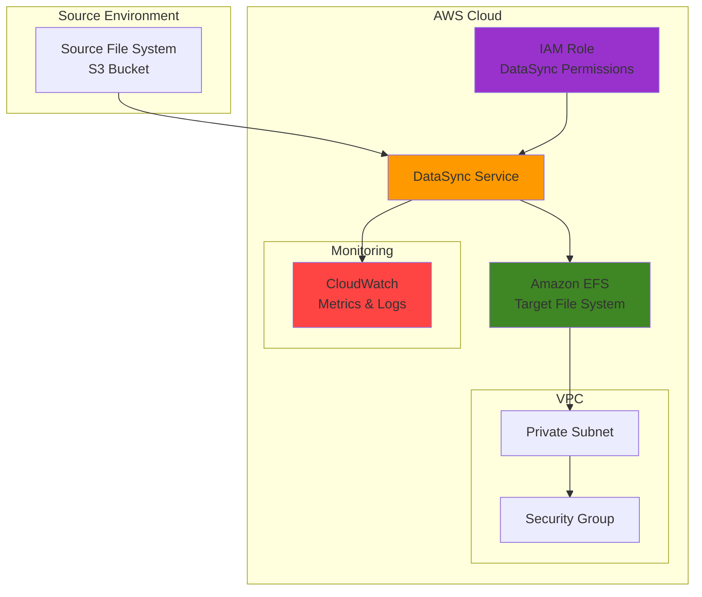

# File System Sync with DataSync and EFS

## Problem

Organizations struggle with keeping distributed file systems synchronized across multiple environments, leading to data inconsistencies, manual file transfer processes, and operational overhead. Traditional file synchronization methods are slow, error-prone, and lack proper monitoring capabilities. Without automated synchronization, teams face data drift between development, staging, and production environments, making it difficult to maintain data integrity and ensure consistent application behavior across different stages of the deployment pipeline.

## Solution

AWS DataSync provides a fully managed data transfer service that automates file synchronization between on-premises file systems and Amazon EFS with built-in encryption, data validation, and network optimization. This solution establishes automated, scheduled synchronization tasks that maintain data consistency across environments while providing detailed transfer monitoring and reporting capabilities. By combining DataSync with EFS, organizations achieve scalable, secure, and efficient file system synchronization that reduces operational overhead and ensures data integrity.

## Architecture Diagram



## Prerequisites

1. AWS account with administrative permissions for DataSync, EFS, VPC, EC2, and IAM services
2. AWS CLI v2 installed and configured (or AWS CloudShell access)
3. Basic understanding of file systems, networking concepts, and AWS VPC
4. Source file system or S3 bucket containing data to synchronize
5. Understanding of NFS protocols and POSIX file permissions
6. Estimated cost: $0.0125 per GB transferred (standard mode) plus EFS storage costs ($0.30/GB-month for Standard class)

> **Note**: DataSync charges per GB of data transferred in addition to AWS service costs. Review [AWS DataSync pricing](https://aws.amazon.com/datasync/pricing/) before proceeding with large datasets.

## Preparation

```bash
# Set environment variables for the deployment
export AWS_REGION=$(aws configure get region)
export AWS_ACCOUNT_ID=$(aws sts get-caller-identity \
    --query Account --output text)

# Generate unique identifiers for resources
RANDOM_SUFFIX=$(aws secretsmanager get-random-password \
    --exclude-punctuation --exclude-uppercase \
    --password-length 6 --require-each-included-type \
    --output text --query RandomPassword)

export EFS_NAME="datasync-efs-${RANDOM_SUFFIX}"
export VPC_NAME="datasync-vpc-${RANDOM_SUFFIX}"
export DATASYNC_TASK_NAME="file-sync-task-${RANDOM_SUFFIX}"

# Create VPC for EFS resources
VPC_ID=$(aws ec2 create-vpc \
    --cidr-block 10.0.0.0/16 \
    --tag-specifications "ResourceType=vpc,Tags=[{Key=Name,Value=${VPC_NAME}}]" \
    --query 'Vpc.VpcId' --output text)

echo "✅ VPC created: ${VPC_ID}"

# Create private subnet for EFS mount targets
SUBNET_ID=$(aws ec2 create-subnet \
    --vpc-id ${VPC_ID} \
    --cidr-block 10.0.1.0/24 \
    --availability-zone ${AWS_REGION}a \
    --tag-specifications "ResourceType=subnet,Tags=[{Key=Name,Value=${VPC_NAME}-private}]" \
    --query 'Subnet.SubnetId' --output text)

echo "✅ Private subnet created: ${SUBNET_ID}"

# Create security group for EFS access
SG_ID=$(aws ec2 create-security-group \
    --group-name ${VPC_NAME}-efs-sg \
    --description "Security group for EFS access from DataSync" \
    --vpc-id ${VPC_ID} \
    --tag-specifications "ResourceType=security-group,Tags=[{Key=Name,Value=${VPC_NAME}-efs-sg}]" \
    --query 'GroupId' --output text)

# Allow NFS traffic (port 2049) within VPC
aws ec2 authorize-security-group-ingress \
    --group-id ${SG_ID} \
    --protocol tcp \
    --port 2049 \
    --cidr 10.0.0.0/16

echo "✅ Security group configured: ${SG_ID}"
```

## Steps

1. **Create Amazon EFS File System**:

   Amazon EFS provides a fully managed, scalable network file system that can be accessed simultaneously from multiple compute instances. EFS automatically scales storage capacity up or down based on file additions and deletions, eliminating the need for pre-provisioning storage. This makes it ideal as a synchronization target since it can handle varying data volumes while maintaining high availability across multiple Availability Zones with up to 99.999999999% (11 9's) durability.

   ```bash
   # Create EFS file system with encryption at rest
   EFS_ID=$(aws efs create-file-system \
       --creation-token ${EFS_NAME} \
       --performance-mode generalPurpose \
       --throughput-mode bursting \
       --encrypted \
       --tags Key=Name,Value=${EFS_NAME} \
       --query 'FileSystemId' --output text)
   
   echo "✅ EFS file system created: ${EFS_ID}"
   ```

   The encrypted EFS file system is now ready to serve as our synchronization target. Encryption at rest ensures data security using AWS managed keys, while the general purpose performance mode provides low-latency access with up to 7,000 file operations per second. This foundation enables reliable, scalable file storage that can grow with your synchronization needs.

2. **Create EFS Mount Target**:

   Mount targets enable EC2 instances and other AWS services to access EFS file systems through standard NFSv4.1 protocols. Each mount target provides a network interface in a specific subnet, allowing secure communication between DataSync and EFS within your VPC. This network isolation ensures data transfer security while maintaining high-performance access to the file system.

   ```bash
   # Create mount target in the private subnet
   MOUNT_TARGET_ID=$(aws efs create-mount-target \
       --file-system-id ${EFS_ID} \
       --subnet-id ${SUBNET_ID} \
       --security-groups ${SG_ID} \
       --query 'MountTargetId' --output text)
   
   # Wait for mount target to become available
   aws efs wait mount-target-available \
       --mount-target-id ${MOUNT_TARGET_ID}
   
   echo "✅ EFS mount target created and available: ${MOUNT_TARGET_ID}"
   ```

   The mount target establishes the network pathway for DataSync to access EFS securely within your VPC. This configuration ensures that file transfers remain within AWS's internal network, providing both security and optimal performance for synchronization operations while supporting concurrent access from multiple DataSync agents.

3. **Create Source S3 Bucket for Testing**:

   For demonstration purposes, we'll create an S3 bucket with sample data to serve as our synchronization source. S3 provides 99.999999999% (11 9's) durability and can serve as either a source or destination for DataSync operations. This flexibility allows you to synchronize data between various storage types including on-premises file systems, S3, and EFS while maintaining data integrity throughout the process.

   ```bash
   # Create S3 bucket for source data
   SOURCE_BUCKET="datasync-source-${RANDOM_SUFFIX}"
   aws s3 mb s3://${SOURCE_BUCKET} --region ${AWS_REGION}
   
   # Create sample files for testing synchronization
   echo "Sample file 1 content" > /tmp/sample1.txt
   echo "Sample file 2 content" > /tmp/sample2.txt
   mkdir -p /tmp/test-folder
   echo "Nested file content" > /tmp/test-folder/nested.txt
   
   # Upload sample files to S3
   aws s3 cp /tmp/sample1.txt s3://${SOURCE_BUCKET}/
   aws s3 cp /tmp/sample2.txt s3://${SOURCE_BUCKET}/
   aws s3 cp /tmp/test-folder/nested.txt s3://${SOURCE_BUCKET}/test-folder/
   
   echo "✅ Source S3 bucket created with sample data: ${SOURCE_BUCKET}"
   ```

   The S3 bucket now contains structured test data that demonstrates DataSync's ability to handle both individual files and directory structures. This setup simulates real-world scenarios where you need to synchronize complex file hierarchies between different storage systems while preserving directory structure and file metadata.

4. **Create IAM Role for DataSync**:

   DataSync requires specific IAM permissions to access both source and destination storage systems following the AWS Well-Architected Framework's security pillar. The service role enables DataSync to read from S3, write to EFS, and create necessary log entries for monitoring transfer operations. This role follows the principle of least privilege by granting only the permissions required for successful file synchronization.

   ```bash
   # Create trust policy for DataSync service
   cat > /tmp/datasync-trust-policy.json << 'EOF'
   {
       "Version": "2012-10-17",
       "Statement": [
           {
               "Effect": "Allow",
               "Principal": {
                   "Service": "datasync.amazonaws.com"
               },
               "Action": "sts:AssumeRole"
           }
       ]
   }
   EOF
   
   # Create IAM role for DataSync
   DATASYNC_ROLE_NAME="DataSyncServiceRole-${RANDOM_SUFFIX}"
   aws iam create-role \
       --role-name ${DATASYNC_ROLE_NAME} \
       --assume-role-policy-document file:///tmp/datasync-trust-policy.json \
       --description "Service role for DataSync operations"
   
   # Attach AWS managed policy for DataSync S3 access
   aws iam attach-role-policy \
       --role-name ${DATASYNC_ROLE_NAME} \
       --policy-arn arn:aws:iam::aws:policy/AmazonS3ReadOnlyAccess
   
   echo "✅ DataSync IAM role created: ${DATASYNC_ROLE_NAME}"
   ```

   The IAM role provides DataSync with secure, temporary credentials to access your storage resources through AWS Security Token Service (STS). This authentication mechanism ensures that only authorized DataSync tasks can access your data while maintaining full audit trails of all access attempts through AWS CloudTrail integration.

5. **Create DataSync S3 Location**:

   DataSync locations define the endpoints for data transfer operations with specific configuration for data access patterns, storage classes, and transfer optimization. The S3 location specifies the source bucket and includes configuration for efficient data reading with support for various S3 storage classes. This location serves as the starting point for our synchronization workflow, enabling DataSync to efficiently read and transfer data from S3 to EFS.

   ```bash
   # Get the DataSync role ARN
   DATASYNC_ROLE_ARN=$(aws iam get-role \
       --role-name ${DATASYNC_ROLE_NAME} \
       --query 'Role.Arn' --output text)
   
   # Create S3 location for DataSync
   S3_LOCATION_ARN=$(aws datasync create-location-s3 \
       --s3-bucket-arn arn:aws:s3:::${SOURCE_BUCKET} \
       --s3-config '{
           "BucketAccessRoleArn": "'${DATASYNC_ROLE_ARN}'"
       }' \
       --query 'LocationArn' --output text)
   
   echo "✅ DataSync S3 location created: ${S3_LOCATION_ARN}"
   ```

   The S3 location is now configured and ready to serve as the source for file transfers. DataSync can now securely access your S3 bucket and efficiently transfer files while maintaining data integrity and providing detailed transfer logging through CloudWatch integration for comprehensive monitoring.

6. **Create DataSync EFS Location**:

   The EFS location specifies the target file system for synchronization operations with comprehensive network access configuration. This location configuration includes network access details, security group settings, and file system access points. DataSync uses this information to establish secure, high-performance connections to your EFS file system for data transfer operations within your VPC's private network.

   ```bash
   # Create EFS location for DataSync
   EFS_LOCATION_ARN=$(aws datasync create-location-efs \
       --efs-file-system-arn arn:aws:elasticfilesystem:${AWS_REGION}:${AWS_ACCOUNT_ID}:file-system/${EFS_ID} \
       --ec2-config '{
           "SubnetArn": "arn:aws:ec2:'${AWS_REGION}':'${AWS_ACCOUNT_ID}':subnet/'${SUBNET_ID}'",
           "SecurityGroupArns": ["arn:aws:ec2:'${AWS_REGION}':'${AWS_ACCOUNT_ID}':security-group/'${SG_ID}'"]
       }' \
       --query 'LocationArn' --output text)
   
   echo "✅ DataSync EFS location created: ${EFS_LOCATION_ARN}"
   ```

   The EFS location establishes the secure network pathway for data transfer within your VPC infrastructure. This configuration ensures that all file transfers occur through encrypted NFSv4.1 connections while maintaining optimal performance for large-scale synchronization operations and preserving POSIX file system semantics.

7. **Create DataSync Task**:

   DataSync tasks define the complete synchronization workflow including source and destination locations, transfer options, scheduling, and comprehensive data validation settings. The task configuration controls how files are transferred, what happens to existing files, how the service handles errors or conflicts, and ensures data integrity through point-in-time consistency verification during synchronization operations.

   ```bash
   # Create DataSync task for S3 to EFS synchronization
   TASK_ARN=$(aws datasync create-task \
       --source-location-arn ${S3_LOCATION_ARN} \
       --destination-location-arn ${EFS_LOCATION_ARN} \
       --name ${DATASYNC_TASK_NAME} \
       --options '{
           "VerifyMode": "POINT_IN_TIME_CONSISTENT",
           "OverwriteMode": "ALWAYS",
           "Atime": "BEST_EFFORT",
           "Mtime": "PRESERVE",
           "Uid": "INT_VALUE",
           "Gid": "INT_VALUE",
           "PreserveDeletedFiles": "PRESERVE",
           "PreserveDevices": "NONE",
           "PosixPermissions": "PRESERVE",
           "BytesPerSecond": -1,
           "TaskQueueing": "ENABLED",
           "LogLevel": "TRANSFER"
       }' \
       --query 'TaskArn' --output text)
   
   echo "✅ DataSync task created: ${TASK_ARN}"
   ```

   The synchronization task is now configured with optimal settings for data integrity and performance following AWS best practices. The task will verify data consistency through checksums, preserve file metadata including timestamps and permissions, and provide detailed logging for monitoring transfer operations. This comprehensive configuration ensures reliable file synchronization while maintaining data fidelity across different storage systems.

8. **Execute DataSync Task**:

   Task execution initiates the actual data transfer process with real-time monitoring and comprehensive progress reporting. DataSync performs the synchronization operation while providing detailed metrics on transfer rates, file counts, data validation results, and any errors encountered during the process. This execution phase validates the entire synchronization workflow and confirms successful data transfer with built-in retry logic for resilience.

   ```bash
   # Start the DataSync task execution
   EXECUTION_ARN=$(aws datasync start-task-execution \
       --task-arn ${TASK_ARN} \
       --query 'TaskExecutionArn' --output text)
   
   echo "✅ DataSync task execution started: ${EXECUTION_ARN}"
   
   # Monitor task execution status
   echo "Monitoring task execution progress..."
   while true; do
       STATUS=$(aws datasync describe-task-execution \
           --task-execution-arn ${EXECUTION_ARN} \
           --query 'Status' --output text)
       
       if [ "$STATUS" = "SUCCESS" ]; then
           echo "✅ Task execution completed successfully"
           break
       elif [ "$STATUS" = "ERROR" ]; then
           echo "❌ Task execution failed"
           break
       else
           echo "Task status: ${STATUS} - waiting..."
           sleep 10
       fi
   done
   ```

   The file synchronization is now complete with real-time status monitoring and comprehensive logging. DataSync has transferred all files from the S3 source to the EFS destination while maintaining data integrity through built-in verification processes and providing detailed execution logs for audit and troubleshooting purposes.

> **Warning**: Monitor DataSync costs during large transfers, as charges apply per GB transferred ($0.0125/GB for standard mode). Consider using CloudWatch alarms to track transfer volumes and costs.

## Validation & Testing

1. **Verify EFS File System Access**:

   ```bash
   # Check EFS file system status and configuration
   aws efs describe-file-systems \
       --file-system-id ${EFS_ID} \
       --query 'FileSystems[0].[FileSystemId,LifeCycleState,NumberOfMountTargets,SizeInBytes.Value]' \
       --output table
   ```

   Expected output: File system should show "available" state with mount targets and data size reflecting transferred files.

2. **Verify DataSync Task Execution Results**:

   ```bash
   # Get detailed execution results
   aws datasync describe-task-execution \
       --task-execution-arn ${EXECUTION_ARN} \
       --query '{
           Status: Status,
           BytesTransferred: BytesTransferred,
           FilesTransferred: FilesTransferred,
           StartTime: StartTime,
           EndTime: EstimatedFinishTime
       }' --output table
   ```

   Expected output: Shows "SUCCESS" status with byte and file counts matching source data.

3. **Test EFS Mount and File Access**:

   ```bash
   # Check EFS CloudWatch metrics for data activity
   aws cloudwatch get-metric-statistics \
       --namespace AWS/EFS \
       --metric-name DataReadIOBytes \
       --dimensions Name=FileSystemId,Value=${EFS_ID} \
       --start-time $(date -u -d '1 hour ago' +%Y-%m-%dT%H:%M:%S) \
       --end-time $(date -u +%Y-%m-%dT%H:%M:%S) \
       --period 3600 \
       --statistics Sum
   ```

   Expected output: CloudWatch metrics should show data read activity indicating successful file transfers.

> **Tip**: Use EFS Access Points to provide application-specific access to different directories within your file system, improving security and access control. See the [EFS Access Points documentation](https://docs.aws.amazon.com/efs/latest/ug/efs-access-points.html) for implementation guidance.

## Cleanup

1. **Delete DataSync Task and Locations**:

   ```bash
   # Delete DataSync task
   aws datasync delete-task --task-arn ${TASK_ARN}
   echo "✅ DataSync task deleted"
   
   # Delete DataSync locations
   aws datasync delete-location --location-arn ${S3_LOCATION_ARN}
   aws datasync delete-location --location-arn ${EFS_LOCATION_ARN}
   echo "✅ DataSync locations deleted"
   ```

2. **Remove EFS Resources**:

   ```bash
   # Delete EFS mount target
   aws efs delete-mount-target --mount-target-id ${MOUNT_TARGET_ID}
   
   # Wait for mount target deletion
   aws efs wait mount-target-deleted --mount-target-id ${MOUNT_TARGET_ID}
   
   # Delete EFS file system
   aws efs delete-file-system --file-system-id ${EFS_ID}
   echo "✅ EFS resources deleted"
   ```

3. **Clean Up Network Resources**:

   ```bash
   # Delete security group
   aws ec2 delete-security-group --group-id ${SG_ID}
   
   # Delete subnet
   aws ec2 delete-subnet --subnet-id ${SUBNET_ID}
   
   # Delete VPC
   aws ec2 delete-vpc --vpc-id ${VPC_ID}
   echo "✅ Network resources deleted"
   ```

4. **Remove S3 Bucket and IAM Role**:

   ```bash
   # Delete S3 bucket and contents
   aws s3 rb s3://${SOURCE_BUCKET} --force
   
   # Detach policies and delete IAM role
   aws iam detach-role-policy \
       --role-name ${DATASYNC_ROLE_NAME} \
       --policy-arn arn:aws:iam::aws:policy/AmazonS3ReadOnlyAccess
   
   aws iam delete-role --role-name ${DATASYNC_ROLE_NAME}
   
   # Clean up temporary files
   rm -f /tmp/datasync-trust-policy.json /tmp/sample*.txt
   rm -rf /tmp/test-folder
   
   echo "✅ All resources cleaned up successfully"
   ```

## Discussion

AWS DataSync provides enterprise-grade file synchronization capabilities that address the complex challenges of maintaining data consistency across distributed storage systems following the AWS Well-Architected Framework principles. The service automatically handles network optimization, data validation, and encryption during transfer operations, eliminating the operational overhead typically associated with custom synchronization solutions. DataSync's integration with AWS storage services like EFS enables organizations to build scalable, hybrid cloud architectures that seamlessly bridge on-premises and cloud environments while maintaining security and compliance requirements.

The combination of DataSync and EFS offers significant advantages for workloads requiring shared file access across multiple compute instances. EFS provides POSIX-compliant file system semantics with automatic scaling and high availability, while DataSync ensures reliable data transfer with built-in retry logic and comprehensive monitoring through CloudWatch integration. This architecture pattern is particularly valuable for content management systems, development environments, and data analytics workflows that require consistent file access across distributed teams and applications with sub-millisecond latency requirements.

When implementing production synchronization workflows, consider establishing scheduled task execution using Amazon EventBridge (formerly CloudWatch Events) to maintain regular data consistency. DataSync supports both one-time and recurring synchronization patterns, allowing you to optimize data transfer costs by scheduling transfers during off-peak hours when network bandwidth costs may be lower. Additionally, implementing CloudWatch alarms for transfer failures and data validation errors ensures proactive monitoring of your synchronization infrastructure with automatic notifications through Amazon SNS.

For security-sensitive environments, DataSync supports end-to-end encryption using AWS KMS keys and integrates with AWS CloudTrail for comprehensive audit logging of all API calls and data access patterns. The service also provides bandwidth throttling capabilities to prevent synchronization operations from impacting production network performance, ensuring business continuity during large-scale data migrations. These features make DataSync suitable for regulated industries that require strict data governance and compliance reporting capabilities.

> **Note**: Consider implementing DataSync task filters to exclude temporary files or system directories from synchronization, reducing transfer costs and improving performance. See the [AWS DataSync filtering documentation](https://docs.aws.amazon.com/datasync/latest/userguide/filtering.html) for advanced filtering options and best practices.

## Challenge

Extend this file synchronization solution by implementing these enhancements:

1. **Multi-Region Synchronization**: Configure DataSync tasks to replicate data across multiple AWS regions for disaster recovery, implementing cross-region EFS replication with automated failover mechanisms using Route 53 health checks.

2. **Intelligent Data Tiering**: Integrate S3 Intelligent-Tiering with lifecycle policies to automatically move infrequently accessed files to lower-cost storage classes while maintaining EFS access for active data through automated archival workflows.

3. **Real-Time Monitoring Dashboard**: Build a CloudWatch dashboard with custom metrics for transfer performance, data validation results, and cost tracking, including SNS notifications for transfer failures or performance degradation with automated remediation.

4. **Automated Conflict Resolution**: Implement Lambda functions triggered by DataSync events to handle file conflicts, perform data validation, and execute custom business logic during synchronization operations with error handling and retry mechanisms.

5. **Hybrid Cloud Integration**: Deploy DataSync agents on-premises to synchronize data between corporate file servers and AWS EFS, implementing network acceleration and bandwidth optimization for large-scale enterprise environments with VPN or Direct Connect connectivity.

## Infrastructure Code

### Available Infrastructure as Code:

- [Infrastructure Code Overview](code/README.md) - Detailed description of all infrastructure components
- [AWS CDK (Python)](code/cdk-python/) - AWS CDK Python implementation
- [AWS CDK (TypeScript)](code/cdk-typescript/) - AWS CDK TypeScript implementation
- [CloudFormation](code/cloudformation.yaml) - AWS CloudFormation template
- [Bash CLI Scripts](code/scripts/) - Example bash scripts using AWS CLI commands to deploy infrastructure
- [Terraform](code/terraform/) - Terraform configuration files