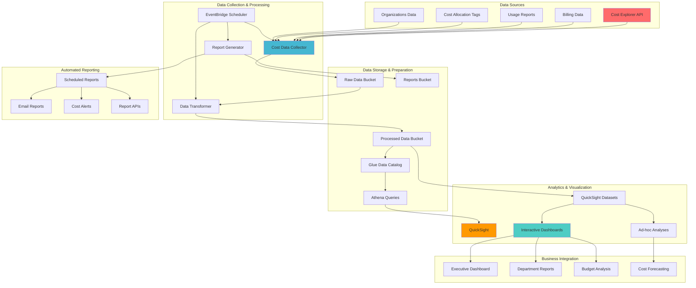

# Financial Analytics Dashboard with QuickSight

## Problem

Finance teams and executives struggle to gain actionable insights from AWS cost data due to fragmented reporting tools, static monthly reports, and lack of real-time visibility into spending patterns. Traditional cost reporting approaches provide limited analytical capabilities, making it difficult to identify cost optimization opportunities, track budget performance against business metrics, and correlate spending with business outcomes. Without comprehensive financial analytics, organizations cannot make data-driven decisions about cloud investments or implement effective cost governance strategies.

## Solution

This solution creates a sophisticated financial analytics platform using Amazon QuickSight integrated with Cost Explorer APIs, custom data processing pipelines, and automated reporting workflows. The platform provides real-time cost analytics, predictive spending models, departmental chargeback reporting, and executive dashboards that correlate cloud spending with business KPIs. The solution automates data collection, applies advanced analytics, and delivers actionable insights through interactive visualizations and automated alerts.

## Architecture Diagram



## Prerequisites

1. AWS account with Cost Explorer, QuickSight, and administrative permissions
2. AWS CLI v2 installed and configured with appropriate credentials
3. Understanding of SQL for Athena queries and data transformations
4. Basic knowledge of business intelligence and data visualization concepts
5. Estimated cost: $200-400/month for QuickSight, S3 storage, and data processing

> **Note**: QuickSight Enterprise Edition is recommended for advanced features like ML insights and embedded analytics. Learn more about [QuickSight capabilities](https://docs.aws.amazon.com/quicksight/latest/user/welcome.html).

## Preparation

```bash
# Set environment variables
export AWS_REGION=$(aws configure get region)
export AWS_ACCOUNT_ID=$(aws sts get-caller-identity \
    --query Account --output text)

# Generate unique identifiers
RANDOM_SUFFIX=$(aws secretsmanager get-random-password \
    --exclude-punctuation --exclude-uppercase \
    --password-length 6 --require-each-included-type \
    --output text --query RandomPassword)

export ANALYTICS_BUCKET="financial-analytics-${RANDOM_SUFFIX}"
export RAW_DATA_BUCKET="cost-raw-data-${RANDOM_SUFFIX}"
export PROCESSED_DATA_BUCKET="cost-processed-data-${RANDOM_SUFFIX}"
export REPORTS_BUCKET="financial-reports-${RANDOM_SUFFIX}"

# Create S3 buckets for data pipeline
for BUCKET in ${RAW_DATA_BUCKET} ${PROCESSED_DATA_BUCKET} ${REPORTS_BUCKET} ${ANALYTICS_BUCKET}; do
    aws s3 mb s3://${BUCKET} --region ${AWS_REGION}
    
    # Enable versioning for data integrity
    aws s3api put-bucket-versioning \
        --bucket ${BUCKET} \
        --versioning-configuration Status=Enabled
    
    # Set up lifecycle policies for cost optimization
    aws s3api put-bucket-lifecycle-configuration \
        --bucket ${BUCKET} \
        --lifecycle-configuration '{
            "Rules": [
                {
                    "ID": "TransitionToIA",
                    "Status": "Enabled",
                    "Filter": {"Prefix": ""},
                    "Transitions": [
                        {
                            "Days": 30,
                            "StorageClass": "STANDARD_IA"
                        },
                        {
                            "Days": 90,
                            "StorageClass": "GLACIER"
                        }
                    ]
                }
            ]
        }'
done

echo "✅ Created foundational S3 buckets with lifecycle policies"
```

> **Note**: S3 lifecycle policies automatically transition older cost data to lower-cost storage classes, reducing storage costs by up to 68% for infrequently accessed data. Learn more about [S3 lifecycle configurations](https://docs.aws.amazon.com/AmazonS3/latest/userguide/lifecycle-configuration-examples.html).

## Steps

1. **Set Up QuickSight and Enable Cost Explorer Integration**:

   Amazon QuickSight provides business intelligence capabilities that transform raw cost data into actionable insights, while Cost Explorer APIs enable programmatic access to detailed billing information. This integration creates the foundation for automated financial analytics that can process millions of cost records and generate real-time dashboards for executive decision-making. Understanding this setup is crucial for building enterprise-scale financial analytics platforms.

   ```bash
   # Check if QuickSight is already set up
   QS_USER=$(aws quicksight describe-user \
       --aws-account-id ${AWS_ACCOUNT_ID} \
       --namespace default \
       --user-name admin/${AWS_ACCOUNT_ID} \
       --query 'User.UserName' --output text 2>/dev/null || echo "not-found")
   
   if [ "$QS_USER" = "not-found" ]; then
       echo "QuickSight needs to be set up manually. Please:"
       echo "1. Go to https://quicksight.aws.amazon.com/"
       echo "2. Sign up for QuickSight (Enterprise Edition recommended)"
       echo "3. Configure permissions for S3, Athena, and Cost Explorer"
       echo "4. Return here when complete"
       read -p "Press Enter when QuickSight setup is complete..."
   fi
   
   # Enable Cost Explorer (if not already enabled)
   aws ce get-cost-and-usage \
       --time-period Start=2025-01-01,End=2025-01-02 \
       --granularity DAILY \
       --metrics BlendedCost \
       --group-by Type=DIMENSION,Key=SERVICE 2>/dev/null || {
       echo "Cost Explorer needs to be enabled manually in the AWS Console"
       echo "Go to: https://console.aws.amazon.com/cost-management/home#/cost-explorer"
       read -p "Press Enter when Cost Explorer is enabled..."
   }
   
   echo "✅ Verified QuickSight and Cost Explorer setup"
   ```

   This setup enables your organization to access both real-time cost data through the [Cost Explorer API](https://docs.aws.amazon.com/cost-management/latest/userguide/ce-api.html) and advanced visualization capabilities through QuickSight. The integration supports enterprise-scale analytics with the ability to process terabytes of billing data and serve interactive dashboards to hundreds of users simultaneously.

2. **Create IAM Role for Lambda Data Processing**:

   IAM roles provide secure, temporary credential access for Lambda functions without hardcoding sensitive information. This security model follows AWS best practices by implementing least privilege access while enabling Lambda functions to interact with Cost Explorer APIs, S3 storage, and QuickSight resources. The role-based architecture ensures scalable security management across your financial analytics pipeline and maintains compliance with enterprise security requirements.

   ```bash
   # Create Lambda execution role for financial analytics
   cat > lambda-analytics-trust-policy.json << 'EOF'
   {
       "Version": "2012-10-17",
       "Statement": [
           {
               "Effect": "Allow",
               "Principal": {
                   "Service": "lambda.amazonaws.com"
               },
               "Action": "sts:AssumeRole"
           }
       ]
   }
   EOF
   
   aws iam create-role \
       --role-name FinancialAnalyticsLambdaRole \
       --assume-role-policy-document file://lambda-analytics-trust-policy.json
   
   # Create comprehensive policy for financial analytics
   cat > lambda-analytics-policy.json << EOF
   {
       "Version": "2012-10-17",
       "Statement": [
           {
               "Effect": "Allow",
               "Action": [
                   "logs:CreateLogGroup",
                   "logs:CreateLogStream",
                   "logs:PutLogEvents"
               ],
               "Resource": "arn:aws:logs:*:*:*"
           },
           {
               "Effect": "Allow",
               "Action": [
                   "ce:GetCostAndUsage",
                   "ce:GetUsageReport",
                   "ce:GetRightsizingRecommendation",
                   "ce:GetReservationCoverage",
                   "ce:GetReservationPurchaseRecommendation",
                   "ce:GetReservationUtilization",
                   "ce:GetSavingsPlansUtilization",
                   "ce:GetDimensionValues",
                   "ce:ListCostCategoryDefinitions"
               ],
               "Resource": "*"
           },
           {
               "Effect": "Allow",
               "Action": [
                   "organizations:ListAccounts",
                   "organizations:DescribeOrganization",
                   "organizations:ListOrganizationalUnitsForParent",
                   "organizations:ListParents"
               ],
               "Resource": "*"
           },
           {
               "Effect": "Allow",
               "Action": [
                   "s3:GetObject",
                   "s3:PutObject",
                   "s3:DeleteObject",
                   "s3:ListBucket"
               ],
               "Resource": [
                   "arn:aws:s3:::${RAW_DATA_BUCKET}",
                   "arn:aws:s3:::${RAW_DATA_BUCKET}/*",
                   "arn:aws:s3:::${PROCESSED_DATA_BUCKET}",
                   "arn:aws:s3:::${PROCESSED_DATA_BUCKET}/*",
                   "arn:aws:s3:::${REPORTS_BUCKET}",
                   "arn:aws:s3:::${REPORTS_BUCKET}/*"
               ]
           },
           {
               "Effect": "Allow",
               "Action": [
                   "glue:CreateTable",
                   "glue:UpdateTable",
                   "glue:GetTable",
                   "glue:GetDatabase",
                   "glue:CreateDatabase",
                   "glue:CreatePartition"
               ],
               "Resource": "*"
           },
           {
               "Effect": "Allow",
               "Action": [
                   "quicksight:CreateDataSet",
                   "quicksight:UpdateDataSet",
                   "quicksight:DescribeDataSet",
                   "quicksight:CreateAnalysis",
                   "quicksight:UpdateAnalysis"
               ],
               "Resource": "*"
           },
           {
               "Effect": "Allow",
               "Action": [
                   "sns:Publish"
               ],
               "Resource": "*"
           }
       ]
   }
   EOF
   
   aws iam create-policy \
       --policy-name FinancialAnalyticsPolicy \
       --policy-document file://lambda-analytics-policy.json
   
   aws iam attach-role-policy \
       --role-name FinancialAnalyticsLambdaRole \
       --policy-arn arn:aws:iam::${AWS_ACCOUNT_ID}:policy/FinancialAnalyticsPolicy
   
   # Get role ARN
   LAMBDA_ANALYTICS_ROLE_ARN=$(aws iam get-role \
       --role-name FinancialAnalyticsLambdaRole \
       --query Role.Arn --output text)
   
   export LAMBDA_ANALYTICS_ROLE_ARN
   
   echo "✅ Created Lambda role for financial analytics"
   ```

   The Lambda execution role now provides secure access to all required AWS services for financial data processing. This foundation enables automated cost data collection and transformation while maintaining security boundaries between different components of your analytics pipeline. The role follows [AWS IAM security best practices](https://docs.aws.amazon.com/IAM/latest/UserGuide/best-practices.html) for financial data access.

   > **Warning**: This IAM role has comprehensive access to Cost Explorer APIs and S3 buckets. In production environments, implement more granular permissions following [AWS security best practices](https://docs.aws.amazon.com/IAM/latest/UserGuide/best-practices.html).

3. **Deploy Cost Data Collector Lambda Function**:

   Lambda functions provide serverless compute capabilities that automatically scale to handle cost data collection across large AWS organizations. This function leverages the Cost Explorer API to gather comprehensive billing data including daily costs by service, departmental allocations through tagging, Reserved Instance utilization, and cost optimization recommendations. The serverless architecture eliminates infrastructure management while ensuring reliable, scheduled data collection that forms the backbone of your financial analytics platform.

   ```bash
   # Create cost data collector Lambda function
   cat > cost_data_collector.py << 'EOF'
   import json
   import boto3
   import logging
   import os
   from datetime import datetime, timedelta, date
   import uuid

   logger = logging.getLogger()
   logger.setLevel(logging.INFO)

   def lambda_handler(event, context):
       ce = boto3.client('ce')
       s3 = boto3.client('s3')
       
       # Calculate date ranges for data collection
       end_date = date.today()
       start_date = end_date - timedelta(days=90)  # Last 90 days
       
       try:
           # 1. Daily cost by service with pagination support
           daily_cost_response = ce.get_cost_and_usage(
               TimePeriod={
                   'Start': start_date.strftime('%Y-%m-%d'),
                   'End': end_date.strftime('%Y-%m-%d')
               },
               Granularity='DAILY',
               Metrics=['BlendedCost', 'UnblendedCost', 'UsageQuantity'],
               GroupBy=[
                   {'Type': 'DIMENSION', 'Key': 'SERVICE'},
                   {'Type': 'DIMENSION', 'Key': 'LINKED_ACCOUNT'}
               ]
           )
           
           # 2. Monthly cost by department (tag-based)
           try:
               monthly_dept_response = ce.get_cost_and_usage(
                   TimePeriod={
                       'Start': (start_date.replace(day=1)).strftime('%Y-%m-%d'),
                       'End': end_date.strftime('%Y-%m-%d')
                   },
                   Granularity='MONTHLY',
                   Metrics=['BlendedCost'],
                   GroupBy=[
                       {'Type': 'TAG', 'Key': 'Department'},
                       {'Type': 'TAG', 'Key': 'Project'},
                       {'Type': 'TAG', 'Key': 'Environment'}
                   ]
               )
           except Exception as e:
               logger.warning(f"Tag-based cost collection failed: {str(e)}")
               monthly_dept_response = {'ResultsByTime': []}
           
           # 3. Reserved Instance utilization
           ri_utilization_response = ce.get_reservation_utilization(
               TimePeriod={
                   'Start': start_date.strftime('%Y-%m-%d'),
                   'End': end_date.strftime('%Y-%m-%d')
               },
               Granularity='MONTHLY'
           )
           
           # 4. Savings Plans utilization
           try:
               savings_plans_response = ce.get_savings_plans_utilization(
                   TimePeriod={
                       'Start': start_date.strftime('%Y-%m-%d'),
                       'End': end_date.strftime('%Y-%m-%d')
                   },
                   Granularity='MONTHLY'
               )
           except Exception as e:
               logger.warning(f"Savings Plans utilization collection failed: {str(e)}")
               savings_plans_response = {'SavingsPlansUtilizationsByTime': []}
           
           # 5. Rightsizing recommendations
           try:
               rightsizing_response = ce.get_rightsizing_recommendation(
                   Service='AmazonEC2'
               )
           except Exception as e:
               logger.warning(f"Rightsizing recommendations collection failed: {str(e)}")
               rightsizing_response = {'RightsizingRecommendations': []}
           
           # Store all collected data
           collections = {
               'daily_costs': daily_cost_response,
               'monthly_department_costs': monthly_dept_response,
               'ri_utilization': ri_utilization_response,
               'savings_plans_utilization': savings_plans_response,
               'rightsizing_recommendations': rightsizing_response,
               'collection_timestamp': datetime.utcnow().isoformat(),
               'data_period': {
                   'start_date': start_date.strftime('%Y-%m-%d'),
                   'end_date': end_date.strftime('%Y-%m-%d')
               }
           }
           
           # Generate unique key for this collection
           collection_id = str(uuid.uuid4())
           s3_key = f"raw-cost-data/{datetime.utcnow().strftime('%Y/%m/%d')}/cost-collection-{collection_id}.json"
           
           # Store in S3
           s3.put_object(
               Bucket=os.environ['RAW_DATA_BUCKET'],
               Key=s3_key,
               Body=json.dumps(collections, default=str, indent=2),
               ContentType='application/json',
               Metadata={
                   'collection-date': datetime.utcnow().strftime('%Y-%m-%d'),
                   'data-type': 'cost-explorer-raw',
                   'collection-id': collection_id
               }
           )
           
           logger.info(f"Cost data collected and stored: s3://{os.environ['RAW_DATA_BUCKET']}/{s3_key}")
           
           # Prepare summary for downstream processing
           summary = {
               'total_daily_records': len(daily_cost_response.get('ResultsByTime', [])),
               'total_monthly_records': len(monthly_dept_response.get('ResultsByTime', [])),
               'ri_utilization_periods': len(ri_utilization_response.get('UtilizationsByTime', [])),
               'rightsizing_recommendations': len(rightsizing_response.get('RightsizingRecommendations', [])),
               's3_location': f"s3://{os.environ['RAW_DATA_BUCKET']}/{s3_key}",
               'collection_id': collection_id
           }
           
           return {
               'statusCode': 200,
               'body': json.dumps({
                   'message': 'Cost data collection completed successfully',
                   'summary': summary
               })
           }
           
       except Exception as e:
           logger.error(f"Error collecting cost data: {str(e)}")
           raise
   EOF
   
   # Package and deploy cost data collector
   zip cost-data-collector.zip cost_data_collector.py
   
   COST_COLLECTOR_ARN=$(aws lambda create-function \
       --function-name "CostDataCollector" \
       --runtime python3.12 \
       --role ${LAMBDA_ANALYTICS_ROLE_ARN} \
       --handler cost_data_collector.lambda_handler \
       --zip-file fileb://cost-data-collector.zip \
       --environment Variables="{RAW_DATA_BUCKET=${RAW_DATA_BUCKET}}" \
       --timeout 900 \
       --memory-size 1024 \
       --query FunctionArn --output text)
   
   export COST_COLLECTOR_ARN
   
   echo "✅ Deployed cost data collector Lambda"
   ```

   The cost data collector is now operational and ready to gather comprehensive billing information from across your AWS organization. This automated system will collect data on daily spending patterns, service utilization, and cost optimization opportunities, providing the raw intelligence needed for advanced financial analytics and business decision-making.

4. **Deploy Data Transformation Lambda Function**:

   Data transformation is critical for converting raw billing data into analytics-ready formats that support fast querying and visualization. This Lambda function processes JSON data from Cost Explorer APIs and creates optimized datasets in both JSON format for QuickSight direct access and Parquet format for Athena queries. The transformation includes data cleansing, standardization, and structuring that enables efficient analytics across potentially millions of cost records while maintaining data integrity and performance.

   ```bash
   # Create data transformation Lambda function
   cat > data_transformer.py << 'EOF'
   import json
   import boto3
   import logging
   import os
   import pandas as pd
   from datetime import datetime
   import uuid
   import io

   logger = logging.getLogger()
   logger.setLevel(logging.INFO)

   def lambda_handler(event, context):
       s3 = boto3.client('s3')
       glue = boto3.client('glue')
       
       try:
           # Get the latest raw data file from S3
           raw_bucket = os.environ['RAW_DATA_BUCKET']
           processed_bucket = os.environ['PROCESSED_DATA_BUCKET']
           
           # List objects to find latest collection
           response = s3.list_objects_v2(
               Bucket=raw_bucket,
               Prefix='raw-cost-data/',
               MaxKeys=1000
           )
           
           if 'Contents' not in response:
               logger.info("No raw data files found")
               return {'statusCode': 200, 'body': 'No data to process'}
           
           # Sort by last modified and get the latest
           latest_file = sorted(response['Contents'], key=lambda x: x['LastModified'], reverse=True)[0]
           latest_key = latest_file['Key']
           
           logger.info(f"Processing latest file: {latest_key}")
           
           # Read raw data from S3
           obj = s3.get_object(Bucket=raw_bucket, Key=latest_key)
           raw_data = json.loads(obj['Body'].read())
           
           # Transform data for analytics
           transformed_data = transform_cost_data(raw_data)
           
           # Store transformed data in multiple formats
           timestamp = datetime.utcnow().strftime('%Y%m%d_%H%M%S')
           
           # 1. Store as JSON for QuickSight
           for data_type, data in transformed_data.items():
               json_key = f"processed-data/{data_type}/{datetime.utcnow().strftime('%Y/%m/%d')}/{data_type}_{timestamp}.json"
               
               s3.put_object(
                   Bucket=processed_bucket,
                   Key=json_key,
                   Body=json.dumps(data, default=str, indent=2),
                   ContentType='application/json'
               )
           
           # 2. Store as Parquet for Athena (using pandas)
           for data_type, data in transformed_data.items():
               if data:  # Only process non-empty datasets
                   df = pd.DataFrame(data)
                   parquet_buffer = io.BytesIO()
                   df.to_parquet(parquet_buffer, index=False)
                   
                   parquet_key = f"processed-data-parquet/{data_type}/{datetime.utcnow().strftime('%Y/%m/%d')}/{data_type}_{timestamp}.parquet"
                   
                   s3.put_object(
                       Bucket=processed_bucket,
                       Key=parquet_key,
                       Body=parquet_buffer.getvalue(),
                       ContentType='application/octet-stream'
                   )
           
           # Update Glue Data Catalog
           create_glue_tables(glue, processed_bucket)
           
           logger.info("Data transformation completed successfully")
           
           return {
               'statusCode': 200,
               'body': json.dumps({
                   'message': 'Data transformation completed',
                   'processed_files': list(transformed_data.keys()),
                   'output_bucket': processed_bucket
               })
           }
           
       except Exception as e:
           logger.error(f"Error in data transformation: {str(e)}")
           raise

   def transform_cost_data(raw_data):
       """Transform raw cost explorer data into analytics-friendly format"""
       transformed = {}
       
       # 1. Transform daily costs
       if 'daily_costs' in raw_data:
           daily_costs = []
           for time_period in raw_data['daily_costs'].get('ResultsByTime', []):
               date = time_period['TimePeriod']['Start']
               
               for group in time_period.get('Groups', []):
                   service = group['Keys'][0] if len(group['Keys']) > 0 else 'Unknown'
                   account = group['Keys'][1] if len(group['Keys']) > 1 else 'Unknown'
                   
                   # Add error handling for missing metric data
                   blended_cost = 0.0
                   unblended_cost = 0.0
                   usage_quantity = 0.0
                   currency = 'USD'
                   
                   if 'Metrics' in group:
                       if 'BlendedCost' in group['Metrics']:
                           blended_cost = float(group['Metrics']['BlendedCost'].get('Amount', 0))
                           currency = group['Metrics']['BlendedCost'].get('Unit', 'USD')
                       if 'UnblendedCost' in group['Metrics']:
                           unblended_cost = float(group['Metrics']['UnblendedCost'].get('Amount', 0))
                       if 'UsageQuantity' in group['Metrics']:
                           usage_quantity = float(group['Metrics']['UsageQuantity'].get('Amount', 0))
                   
                   daily_costs.append({
                       'date': date,
                       'service': service,
                       'account_id': account,
                       'blended_cost': blended_cost,
                       'unblended_cost': unblended_cost,
                       'usage_quantity': usage_quantity,
                       'currency': currency
                   })
           
           transformed['daily_costs'] = daily_costs
       
       # 2. Transform department costs
       if 'monthly_department_costs' in raw_data:
           dept_costs = []
           for time_period in raw_data['monthly_department_costs'].get('ResultsByTime', []):
               start_date = time_period['TimePeriod']['Start']
               
               for group in time_period.get('Groups', []):
                   keys = group.get('Keys', [])
                   department = keys[0] if len(keys) > 0 else 'Untagged'
                   project = keys[1] if len(keys) > 1 else 'Untagged'
                   environment = keys[2] if len(keys) > 2 else 'Untagged'
                   
                   cost = 0.0
                   currency = 'USD'
                   if 'Metrics' in group and 'BlendedCost' in group['Metrics']:
                       cost = float(group['Metrics']['BlendedCost'].get('Amount', 0))
                       currency = group['Metrics']['BlendedCost'].get('Unit', 'USD')
                   
                   dept_costs.append({
                       'month': start_date,
                       'department': department,
                       'project': project,
                       'environment': environment,
                       'cost': cost,
                       'currency': currency
                   })
           
           transformed['department_costs'] = dept_costs
       
       # 3. Transform RI utilization
       if 'ri_utilization' in raw_data:
           ri_util = []
           for util_period in raw_data['ri_utilization'].get('UtilizationsByTime', []):
               total_data = util_period.get('Total', {})
               ri_util.append({
                   'month': util_period['TimePeriod']['Start'],
                   'utilization_percentage': float(total_data.get('UtilizationPercentage', 0)),
                   'purchased_hours': float(total_data.get('PurchasedHours', 0)),
                   'used_hours': float(total_data.get('UsedHours', 0)),
                   'unused_hours': float(total_data.get('UnusedHours', 0))
               })
           
           transformed['ri_utilization'] = ri_util
       
       # 4. Transform rightsizing recommendations
       if 'rightsizing_recommendations' in raw_data:
           rightsizing = []
           for rec in raw_data['rightsizing_recommendations'].get('RightsizingRecommendations', []):
               rightsizing.append({
                   'account_id': rec.get('AccountId', ''),
                   'current_instance': rec.get('CurrentInstance', {}).get('InstanceName', ''),
                   'current_instance_type': rec.get('CurrentInstance', {}).get('InstanceType', ''),
                   'recommended_instance_type': rec.get('RightsizingType', ''),
                   'estimated_monthly_savings': float(rec.get('EstimatedMonthlySavings', 0)),
                   'currency': rec.get('CurrencyCode', 'USD')
               })
           
           transformed['rightsizing_recommendations'] = rightsizing
       
       return transformed

   def create_glue_tables(glue_client, bucket):
       """Create Glue tables for the transformed data"""
       database_name = 'financial_analytics'
       
       try:
           # Create database if it doesn't exist
           glue_client.create_database(
               DatabaseInput={
                   'Name': database_name,
                   'Description': 'Financial analytics database for cost data'
               }
           )
       except glue_client.exceptions.AlreadyExistsException:
           pass
       
       # Define table schemas with proper Parquet configuration
       tables = {
           'daily_costs': {
               'StorageDescriptor': {
                   'Columns': [
                       {'Name': 'date', 'Type': 'string'},
                       {'Name': 'service', 'Type': 'string'},
                       {'Name': 'account_id', 'Type': 'string'},
                       {'Name': 'blended_cost', 'Type': 'double'},
                       {'Name': 'unblended_cost', 'Type': 'double'},
                       {'Name': 'usage_quantity', 'Type': 'double'},
                       {'Name': 'currency', 'Type': 'string'}
                   ],
                   'Location': f's3://{bucket}/processed-data-parquet/daily_costs/',
                   'InputFormat': 'org.apache.hadoop.hive.ql.io.parquet.MapredParquetInputFormat',
                   'OutputFormat': 'org.apache.hadoop.hive.ql.io.parquet.MapredParquetOutputFormat',
                   'SerdeInfo': {
                       'SerializationLibrary': 'org.apache.hadoop.hive.ql.io.parquet.serde.ParquetHiveSerDe'
                   }
               }
           }
       }
       
       # Create tables
       for table_name, table_def in tables.items():
           try:
               glue_client.create_table(
                   DatabaseName=database_name,
                   TableInput={
                       'Name': table_name,
                       'StorageDescriptor': table_def['StorageDescriptor']
                   }
               )
               logger.info(f"Created Glue table: {table_name}")
           except glue_client.exceptions.AlreadyExistsException:
               logger.info(f"Table {table_name} already exists")
   EOF
   
   # Install dependencies and package Lambda
   pip install pandas pyarrow -t ./lambda-deps
   cd lambda-deps && zip -r ../data-transformer.zip . && cd ..
   zip data-transformer.zip data_transformer.py
   
   DATA_TRANSFORMER_ARN=$(aws lambda create-function \
       --function-name "DataTransformer" \
       --runtime python3.12 \
       --role ${LAMBDA_ANALYTICS_ROLE_ARN} \
       --handler data_transformer.lambda_handler \
       --zip-file fileb://data-transformer.zip \
       --environment Variables="{RAW_DATA_BUCKET=${RAW_DATA_BUCKET},PROCESSED_DATA_BUCKET=${PROCESSED_DATA_BUCKET}}" \
       --timeout 900 \
       --memory-size 2048 \
       --query FunctionArn --output text)
   
   export DATA_TRANSFORMER_ARN
   
   echo "✅ Deployed data transformation Lambda"
   ```

   The data transformation pipeline is now established to process raw cost data into optimized analytical formats. This system automatically creates structured datasets that support both real-time dashboard queries and complex analytical workloads, enabling fast insights across your entire cost landscape while maintaining query performance as data volumes grow.

5. **Create EventBridge Schedules for Automated Data Collection**:

   EventBridge provides reliable, serverless scheduling that ensures consistent data collection without manual intervention. Automated scheduling eliminates the risk of missing cost data collection periods and ensures financial reports are always based on the most current information. This event-driven architecture scales automatically and provides built-in retry mechanisms for robust data pipeline operations, supporting enterprise reliability requirements for financial reporting.

   ```bash
   # Create daily cost data collection schedule
   aws events put-rule \
       --name "DailyCostDataCollection" \
       --description "Daily collection of cost data for analytics" \
       --schedule-expression "cron(0 6 * * ? *)"
   
   # Create weekly data transformation schedule
   aws events put-rule \
       --name "WeeklyDataTransformation" \
       --description "Weekly transformation of cost data" \
       --schedule-expression "cron(0 7 ? * SUN *)"
   
   # Add Lambda targets to collection schedule
   aws events put-targets \
       --rule "DailyCostDataCollection" \
       --targets '[
           {
               "Id": "1",
               "Arn": "'${COST_COLLECTOR_ARN}'",
               "Input": "{\"source\": \"scheduled-daily\"}"
           }
       ]'
   
   # Add Lambda targets to transformation schedule
   aws events put-targets \
       --rule "WeeklyDataTransformation" \
       --targets '[
           {
               "Id": "1",
               "Arn": "'${DATA_TRANSFORMER_ARN}'",
               "Input": "{\"source\": \"scheduled-weekly\"}"
           }
       ]'
   
   # Grant EventBridge permissions
   aws lambda add-permission \
       --function-name "CostDataCollector" \
       --statement-id "AllowDailyEventBridge" \
       --action "lambda:InvokeFunction" \
       --principal "events.amazonaws.com" \
       --source-arn "arn:aws:events:${AWS_REGION}:${AWS_ACCOUNT_ID}:rule/DailyCostDataCollection"
   
   aws lambda add-permission \
       --function-name "DataTransformer" \
       --statement-id "AllowWeeklyEventBridge" \
       --action "lambda:InvokeFunction" \
       --principal "events.amazonaws.com" \
       --source-arn "arn:aws:events:${AWS_REGION}:${AWS_ACCOUNT_ID}:rule/WeeklyDataTransformation"
   
   echo "✅ Configured automated data collection and transformation schedules"
   ```

   Your financial analytics pipeline now operates autonomously with daily cost data collection and weekly data processing. This automation ensures consistent, reliable data availability for real-time dashboards and eliminates manual data management overhead while maintaining data freshness for business decision-making and compliance reporting.

6. **Set Up Athena for Data Queries**:

   Amazon Athena provides serverless SQL query capabilities that enable complex analytics on cost data without managing database infrastructure. Athena's integration with S3 data lakes supports petabyte-scale analytics while only charging for queries executed. This setup creates powerful analytical capabilities for ad-hoc cost analysis, custom reporting, and complex financial modeling that goes beyond standard AWS cost reporting, enabling sophisticated business intelligence for finance teams.

   ```bash
   # Create Athena workgroup for financial analytics
   aws athena create-work-group \
       --name "FinancialAnalytics" \
       --description "Workgroup for financial analytics queries" \
       --configuration '{
           "ResultConfiguration": {
               "OutputLocation": "s3://'${ANALYTICS_BUCKET}'/athena-results/"
           },
           "EnforceWorkGroupConfiguration": true,
           "PublishCloudWatchMetrics": true
       }'
   
   # Create database and sample queries
   cat > athena-setup.sql << 'EOF'
   CREATE DATABASE IF NOT EXISTS financial_analytics;
   
   -- Daily cost trends query
   CREATE OR REPLACE VIEW financial_analytics.daily_cost_trends AS
   SELECT 
       date_parse(date, '%Y-%m-%d') as cost_date,
       service,
       account_id,
       SUM(blended_cost) as total_cost,
       AVG(blended_cost) as avg_daily_cost
   FROM financial_analytics.daily_costs
   WHERE date_parse(date, '%Y-%m-%d') >= date_add('day', -30, current_date)
   GROUP BY date_parse(date, '%Y-%m-%d'), service, account_id
   ORDER BY cost_date DESC, total_cost DESC;
   
   -- Department cost allocation query
   CREATE OR REPLACE VIEW financial_analytics.department_cost_allocation AS
   SELECT 
       month,
       department,
       project,
       environment,
       SUM(cost) as total_cost,
       COUNT(*) as resource_count
   FROM financial_analytics.department_costs
   WHERE department != 'Untagged'
   GROUP BY month, department, project, environment
   ORDER BY month DESC, total_cost DESC;
   
   -- Cost optimization opportunities query
   CREATE OR REPLACE VIEW financial_analytics.cost_optimization_opportunities AS
   SELECT 
       'Rightsizing' as opportunity_type,
       current_instance_type,
       recommended_instance_type,
       SUM(estimated_monthly_savings) as potential_monthly_savings,
       COUNT(*) as instance_count
   FROM financial_analytics.rightsizing_recommendations
   GROUP BY current_instance_type, recommended_instance_type
   HAVING SUM(estimated_monthly_savings) > 100
   ORDER BY potential_monthly_savings DESC;
   EOF
   
   echo "✅ Set up Athena workgroup and sample queries"
   ```

   Athena is now configured with predefined queries and workgroup settings that enable sophisticated cost analytics. The SQL-based query interface allows finance teams to perform complex analysis like cost trend analysis, departmental chargeback calculations, and ROI modeling using familiar business intelligence tools and existing SQL skills.

7. **Configure QuickSight Data Sources and Datasets**:

   QuickSight data sources establish secure connections between your processed cost data and the visualization engine. These connections enable real-time dashboard updates and support both direct S3 access for simple datasets and Athena integration for complex analytical queries. The data source configuration supports role-based access controls and automatic schema detection that simplifies ongoing data management while ensuring data security and governance compliance.

   ```bash
   # Get QuickSight user ARN
   QS_USER_ARN=$(aws quicksight describe-user \
       --aws-account-id ${AWS_ACCOUNT_ID} \
       --namespace default \
       --user-name admin/${AWS_ACCOUNT_ID} \
       --query 'User.Arn' --output text)
   
   # Create QuickSight data source for S3
   aws quicksight create-data-source \
       --aws-account-id ${AWS_ACCOUNT_ID} \
       --data-source-id "financial-analytics-s3" \
       --name "Financial Analytics S3 Data" \
       --type "S3" \
       --data-source-parameters '{
           "S3Parameters": {
               "ManifestFileLocation": {
                   "Bucket": "'${PROCESSED_DATA_BUCKET}'",
                   "Key": "quicksight-manifest.json"
               }
           }
       }' \
       --permissions '[
           {
               "Principal": "'${QS_USER_ARN}'",
               "Actions": [
                   "quicksight:DescribeDataSource",
                   "quicksight:DescribeDataSourcePermissions",
                   "quicksight:PassDataSource",
                   "quicksight:UpdateDataSource",
                   "quicksight:DeleteDataSource",
                   "quicksight:UpdateDataSourcePermissions"
               ]
           }
       ]'
   
   # Create manifest file for S3 data source
   cat > quicksight-manifest.json << EOF
   {
       "fileLocations": [
           {
               "URIs": [
                   "s3://${PROCESSED_DATA_BUCKET}/processed-data/daily_costs/",
                   "s3://${PROCESSED_DATA_BUCKET}/processed-data/department_costs/",
                   "s3://${PROCESSED_DATA_BUCKET}/processed-data/ri_utilization/"
               ]
           }
       ],
       "globalUploadSettings": {
           "format": "JSON"
       }
   }
   EOF
   
   aws s3 cp quicksight-manifest.json s3://${PROCESSED_DATA_BUCKET}/
   
   # Create QuickSight data source for Athena
   aws quicksight create-data-source \
       --aws-account-id ${AWS_ACCOUNT_ID} \
       --data-source-id "financial-analytics-athena" \
       --name "Financial Analytics Athena" \
       --type "ATHENA" \
       --data-source-parameters '{
           "AthenaParameters": {
               "WorkGroup": "FinancialAnalytics"
           }
       }' \
       --permissions '[
           {
               "Principal": "'${QS_USER_ARN}'",
               "Actions": [
                   "quicksight:DescribeDataSource",
                   "quicksight:DescribeDataSourcePermissions",
                   "quicksight:PassDataSource",
                   "quicksight:UpdateDataSource",
                   "quicksight:DeleteDataSource",
                   "quicksight:UpdateDataSourcePermissions"
               ]
           }
       ]'
   
   echo "✅ Configured QuickSight data sources"
   ```

   QuickSight now has secure, optimized connections to your financial data through both S3 and Athena integrations. These data sources provide the foundation for interactive dashboards that can serve real-time cost insights to executive teams and departmental managers across your organization while maintaining appropriate access controls and data governance.

8. **Create QuickSight Datasets**:

   QuickSight datasets define the specific data structures and business logic that power your financial dashboards. These datasets implement calculated fields, data filters, and aggregation rules that transform raw cost data into business-meaningful metrics like cost per department, budget variance analysis, and trend calculations. Well-designed datasets enable self-service analytics where business users can create their own visualizations without technical expertise, democratizing financial insights across the organization.

   ```bash
   # Create dataset for daily cost trends
   aws quicksight create-data-set \
       --aws-account-id ${AWS_ACCOUNT_ID} \
       --data-set-id "daily-cost-trends" \
       --name "Daily Cost Trends" \
       --physical-table-map '{
           "daily-costs": {
               "CustomSql": {
                   "DataSourceArn": "arn:aws:quicksight:'${AWS_REGION}':'${AWS_ACCOUNT_ID}':datasource/financial-analytics-athena",
                   "Name": "DailyCostTrends",
                   "SqlQuery": "SELECT * FROM financial_analytics.daily_cost_trends",
                   "Columns": [
                       {"Name": "cost_date", "Type": "DATETIME"},
                       {"Name": "service", "Type": "STRING"},
                       {"Name": "account_id", "Type": "STRING"},
                       {"Name": "total_cost", "Type": "DECIMAL"},
                       {"Name": "avg_daily_cost", "Type": "DECIMAL"}
                   ]
               }
           }
       }' \
       --permissions '[
           {
               "Principal": "'${QS_USER_ARN}'",
               "Actions": [
                   "quicksight:DescribeDataSet",
                   "quicksight:DescribeDataSetPermissions",
                   "quicksight:PassDataSet",
                   "quicksight:DescribeIngestion",
                   "quicksight:ListIngestions",
                   "quicksight:UpdateDataSet",
                   "quicksight:DeleteDataSet",
                   "quicksight:CreateIngestion",
                   "quicksight:CancelIngestion",
                   "quicksight:UpdateDataSetPermissions"
               ]
           }
       ]'
   
   # Create dataset for department cost allocation
   aws quicksight create-data-set \
       --aws-account-id ${AWS_ACCOUNT_ID} \
       --data-set-id "department-cost-allocation" \
       --name "Department Cost Allocation" \
       --physical-table-map '{
           "dept-costs": {
               "CustomSql": {
                   "DataSourceArn": "arn:aws:quicksight:'${AWS_REGION}':'${AWS_ACCOUNT_ID}':datasource/financial-analytics-athena",
                   "Name": "DepartmentCosts",
                   "SqlQuery": "SELECT * FROM financial_analytics.department_cost_allocation",
                   "Columns": [
                       {"Name": "month", "Type": "STRING"},
                       {"Name": "department", "Type": "STRING"},
                       {"Name": "project", "Type": "STRING"},
                       {"Name": "environment", "Type": "STRING"},
                       {"Name": "total_cost", "Type": "DECIMAL"},
                       {"Name": "resource_count", "Type": "INTEGER"}
                   ]
               }
           }
       }' \
       --permissions '[
           {
               "Principal": "'${QS_USER_ARN}'",
               "Actions": [
                   "quicksight:DescribeDataSet",
                   "quicksight:DescribeDataSetPermissions",
                   "quicksight:PassDataSet",
                   "quicksight:DescribeIngestion",
                   "quicksight:ListIngestions",
                   "quicksight:UpdateDataSet",
                   "quicksight:DeleteDataSet",
                   "quicksight:CreateIngestion",
                   "quicksight:CancelIngestion",
                   "quicksight:UpdateDataSetPermissions"
               ]
           }
       ]'
   
   echo "✅ Created QuickSight datasets"
   ```

   The financial analytics datasets are now ready to support interactive dashboards and self-service analysis. These pre-configured datasets include business-friendly field names, calculated metrics, and optimized performance settings that enable fast, intuitive financial reporting across your organization while supporting both executive-level summaries and detailed operational analysis.

9. **Run Initial Data Collection and Processing**:

   Manual execution of the data pipeline validates that all components work correctly and populates the system with initial cost data for dashboard development. This bootstrap process ensures that QuickSight datasets have sufficient data for visualization creation and performance testing. Running the pipeline manually also validates security permissions and data flow architecture before automated scheduling takes over, providing confidence in system reliability.

   ```bash
   # Manually trigger initial data collection
   aws lambda invoke \
       --function-name "CostDataCollector" \
       --payload '{"source": "manual-initial"}' \
       --cli-binary-format raw-in-base64-out \
       collection-response.json
   
   echo "Cost data collection response:"
   cat collection-response.json
   
   # Wait for data collection to complete
   sleep 30
   
   # Trigger data transformation
   aws lambda invoke \
       --function-name "DataTransformer" \
       --payload '{"source": "manual-initial"}' \
       --cli-binary-format raw-in-base64-out \
       transformation-response.json
   
   echo "Data transformation response:"
   cat transformation-response.json
   
   echo "✅ Completed initial data collection and processing"
   ```

   Your financial analytics platform now contains processed cost data ready for dashboard creation and analysis. The successful pipeline execution validates that all security permissions, data transformations, and storage configurations are working correctly to support ongoing automated operations and reliable financial reporting.

10. **Create QuickSight Analysis and Dashboard Templates**:

    QuickSight analyses and dashboards convert processed cost data into actionable business intelligence through interactive visualizations. The template-based approach ensures consistent reporting standards while enabling customization for different stakeholder needs. These dashboards support drill-down capabilities, filtering, and real-time updates that transform static cost reports into dynamic business tools that drive data-driven financial decisions.

    ```bash
    # Create analysis definition file
    cat > quicksight-analysis-definition.json << 'EOF'
    {
        "DataSetReferences": [
            {
                "DataSetArn": "arn:aws:quicksight:${AWS_REGION}:${AWS_ACCOUNT_ID}:dataset/daily-cost-trends",
                "DataSetPlaceholder": "DailyCostTrends"
            },
            {
                "DataSetArn": "arn:aws:quicksight:${AWS_REGION}:${AWS_ACCOUNT_ID}:dataset/department-cost-allocation",
                "DataSetPlaceholder": "DepartmentCosts"
            }
        ],
        "Sheets": [
            {
                "SheetId": "cost-overview",
                "Name": "Cost Overview",
                "Visuals": [
                    {
                        "LineChartVisual": {
                            "VisualId": "daily-trend-line",
                            "Title": {
                                "Visibility": "VISIBLE",
                                "Text": "Daily Cost Trends by Service"
                            },
                            "FieldWells": {
                                "LineChartAggregatedFieldWells": {
                                    "Category": [
                                        {
                                            "DateDimensionField": {
                                                "FieldId": "cost_date",
                                                "Column": {
                                                    "DataSetIdentifier": "DailyCostTrends",
                                                    "ColumnName": "cost_date"
                                                }
                                            }
                                        }
                                    ],
                                    "Values": [
                                        {
                                            "NumericalMeasureField": {
                                                "FieldId": "total_cost",
                                                "Column": {
                                                    "DataSetIdentifier": "DailyCostTrends",
                                                    "ColumnName": "total_cost"
                                                },
                                                "AggregationFunction": {
                                                    "SimpleNumericalAggregation": "SUM"
                                                }
                                            }
                                        }
                                    ],
                                    "Colors": [
                                        {
                                            "CategoricalDimensionField": {
                                                "FieldId": "service",
                                                "Column": {
                                                    "DataSetIdentifier": "DailyCostTrends",
                                                    "ColumnName": "service"
                                                }
                                            }
                                        }
                                    ]
                                }
                            }
                        }
                    }
                ]
            }
        ]
    }
    EOF
    
    # Note: QuickSight dashboard creation requires interactive setup
    echo "✅ Created analysis template. Dashboard creation requires manual setup in QuickSight console."
    echo "Navigate to: https://quicksight.aws.amazon.com/"
    echo "Use the datasets created to build interactive dashboards."
    ```

    The QuickSight analysis foundation is established with properly configured datasets and data sources. You can now create interactive dashboards that provide executive-level cost insights, departmental chargeback reports, and optimization recommendations through QuickSight's intuitive drag-and-drop interface, enabling self-service analytics for finance teams.

## Validation & Testing

1. **Verify Data Collection Pipeline**:

   ```bash
   # Check if data was collected in S3
   aws s3 ls s3://${RAW_DATA_BUCKET}/raw-cost-data/ --recursive \
       | head -10
   ```

   Expected output: List of JSON files with cost data

2. **Verify Data Transformation**:

   ```bash
   # Check processed data
   aws s3 ls s3://${PROCESSED_DATA_BUCKET}/processed-data/ --recursive \
       | head -10
   ```

3. **Test Athena Queries**:

   ```bash
   # Execute a test query in Athena
   QUERY_ID=$(aws athena start-query-execution \
       --query-string "SELECT COUNT(*) FROM financial_analytics.daily_costs;" \
       --work-group "FinancialAnalytics" \
       --query QueryExecutionId --output text)
   
   # Check query results
   sleep 10
   aws athena get-query-results \
       --query-execution-id ${QUERY_ID} \
       --query 'ResultSet.Rows[*].Data[*].VarCharValue' \
       --output table
   ```

4. **Verify QuickSight Integration**:

   ```bash
   # List QuickSight data sources
   aws quicksight list-data-sources \
       --aws-account-id ${AWS_ACCOUNT_ID} \
       --query 'DataSources[*].[Name,Type,Status]' \
       --output table
   ```

   Expected output: Table showing configured data sources

## Cleanup

1. **Remove QuickSight Resources**:

   ```bash
   # Delete QuickSight datasets
   aws quicksight delete-data-set \
       --aws-account-id ${AWS_ACCOUNT_ID} \
       --data-set-id "daily-cost-trends"
   
   aws quicksight delete-data-set \
       --aws-account-id ${AWS_ACCOUNT_ID} \
       --data-set-id "department-cost-allocation"
   
   # Delete QuickSight data sources
   aws quicksight delete-data-source \
       --aws-account-id ${AWS_ACCOUNT_ID} \
       --data-source-id "financial-analytics-s3"
   
   aws quicksight delete-data-source \
       --aws-account-id ${AWS_ACCOUNT_ID} \
       --data-source-id "financial-analytics-athena"
   
   echo "✅ Removed QuickSight resources"
   ```

2. **Delete Lambda Functions and EventBridge Rules**:

   ```bash
   # Remove EventBridge targets and rules
   aws events remove-targets --rule "DailyCostDataCollection" --ids "1"
   aws events remove-targets --rule "WeeklyDataTransformation" --ids "1"
   aws events delete-rule --name "DailyCostDataCollection"
   aws events delete-rule --name "WeeklyDataTransformation"
   
   # Delete Lambda functions
   aws lambda delete-function --function-name "CostDataCollector"
   aws lambda delete-function --function-name "DataTransformer"
   
   echo "✅ Removed Lambda functions and EventBridge rules"
   ```

3. **Clean Up Athena and Glue Resources**:

   ```bash
   # Delete Athena workgroup
   aws athena delete-work-group \
       --work-group "FinancialAnalytics" \
       --recursive-delete-option
   
   # Delete Glue database
   aws glue delete-database --name "financial_analytics"
   
   echo "✅ Removed Athena and Glue resources"
   ```

4. **Remove IAM Resources**:

   ```bash
   # Detach and delete policies
   aws iam detach-role-policy \
       --role-name FinancialAnalyticsLambdaRole \
       --policy-arn arn:aws:iam::${AWS_ACCOUNT_ID}:policy/FinancialAnalyticsPolicy
   
   aws iam delete-policy \
       --policy-arn arn:aws:iam::${AWS_ACCOUNT_ID}:policy/FinancialAnalyticsPolicy
   
   aws iam delete-role --role-name FinancialAnalyticsLambdaRole
   
   echo "✅ Removed IAM resources"
   ```

5. **Delete S3 Buckets and Local Files**:

   ```bash
   # Empty and delete S3 buckets
   for BUCKET in ${RAW_DATA_BUCKET} ${PROCESSED_DATA_BUCKET} ${REPORTS_BUCKET} ${ANALYTICS_BUCKET}; do
       aws s3 rb s3://${BUCKET} --force
   done
   
   # Remove local files
   rm -f *.py *.zip *.json *.sql
   rm -rf lambda-deps
   
   # Unset environment variables
   unset RAW_DATA_BUCKET PROCESSED_DATA_BUCKET REPORTS_BUCKET ANALYTICS_BUCKET
   unset LAMBDA_ANALYTICS_ROLE_ARN COST_COLLECTOR_ARN DATA_TRANSFORMER_ARN
   
   echo "✅ Cleaned up all resources and local files"
   ```

## Discussion

This advanced financial analytics solution transforms raw AWS billing data into actionable business intelligence through a comprehensive data pipeline that automates collection, transformation, and visualization. The architecture provides enterprise-grade analytics capabilities that enable data-driven cost optimization decisions and strategic financial planning.

The solution's strength lies in its multi-layered approach that combines real-time data processing with historical trend analysis, enabling both operational cost monitoring and strategic financial forecasting. By integrating Cost Explorer APIs with QuickSight's advanced visualization capabilities, organizations gain unprecedented visibility into their cloud spending patterns, department-level cost allocation, and optimization opportunities.

The automated data pipeline ensures consistent, reliable reporting while the interactive dashboards provide self-service analytics capabilities for different stakeholder groups. Executive dashboards focus on high-level trends and budget performance, while operational teams can drill down into service-specific costs and resource utilization patterns. The integration with Athena enables complex analytical queries and custom reporting that extends beyond standard AWS cost reporting capabilities.

The solution follows AWS Well-Architected Framework principles across all five pillars. Operational excellence is achieved through automated data collection and processing, security through IAM role-based access controls, reliability through serverless architectures, performance efficiency through optimized data formats and query patterns, and cost optimization through S3 lifecycle policies and serverless compute models. For more guidance, see the [AWS Well-Architected Framework](https://docs.aws.amazon.com/wellarchitected/latest/framework/welcome.html).

> **Tip**: Implement data governance policies for financial data access and establish regular review cycles for dashboard accuracy. Consider implementing row-level security in QuickSight for sensitive departmental cost data and explore [QuickSight security features](https://docs.aws.amazon.com/quicksight/latest/user/security.html).

## Challenge

Extend this financial analytics platform with these advanced capabilities:

1. **Predictive Cost Analytics**: Integrate Amazon Forecast to predict future spending patterns and automatically generate budget recommendations based on historical trends and business growth projections.

2. **Real-time Cost Anomaly Detection**: Implement streaming analytics using Kinesis to detect cost anomalies in real-time and trigger immediate alerts for unexpected spending spikes.

3. **Business Metrics Correlation**: Connect cloud costs with business KPIs from external systems (CRM, ERP) to calculate cloud ROI and cost per business transaction metrics.

4. **Advanced ML Insights**: Leverage QuickSight ML features for automatic insights discovery, natural language queries, and intelligent cost optimization recommendations.

5. **Multi-Cloud Cost Analytics**: Extend the platform to include Azure and Google Cloud costs for comprehensive multi-cloud financial analytics and vendor cost comparison.

## Infrastructure Code

### Available Infrastructure as Code:

- [Infrastructure Code Overview](code/README.md) - Detailed description of all infrastructure components
- [AWS CDK (Python)](code/cdk-python/) - AWS CDK Python implementation
- [AWS CDK (TypeScript)](code/cdk-typescript/) - AWS CDK TypeScript implementation
- [CloudFormation](code/cloudformation.yaml) - AWS CloudFormation template
- [Bash CLI Scripts](code/scripts/) - Example bash scripts using AWS CLI commands to deploy infrastructure
- [Terraform](code/terraform/) - Terraform configuration files