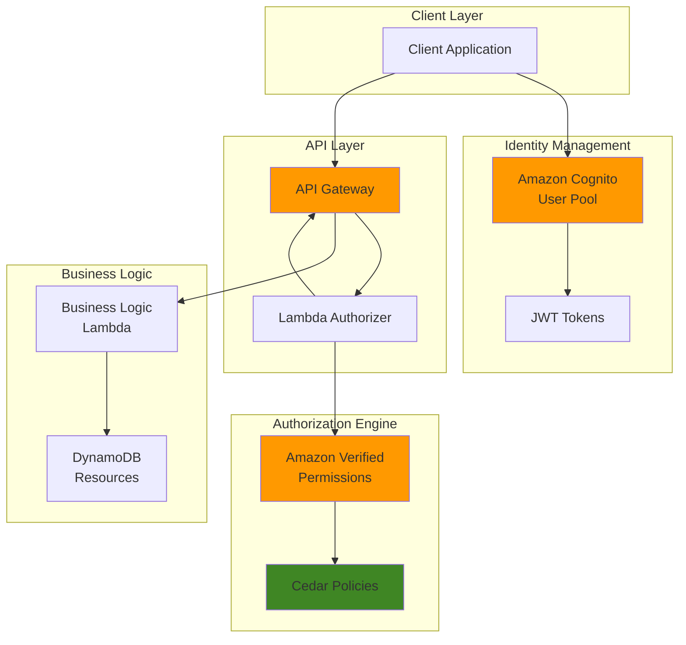

# Fine-Grained API Authorization with Verified Permissions

## Problem

Traditional role-based access control (RBAC) systems become inadequate for enterprise applications requiring granular permission management based on dynamic attributes like user department, resource ownership, or time-based constraints. Organizations need sophisticated authorization mechanisms that can evaluate complex policies considering user identity, resource attributes, and contextual information to make real-time access decisions for API endpoints.

## Solution

Create an attribute-based access control (ABAC) system using Amazon Verified Permissions with Cedar policy language, integrated with Amazon Cognito for identity management and API Gateway for endpoint protection. This approach enables fine-grained authorization decisions based on user attributes, resource metadata, and environmental context, providing enterprise-grade security with flexible policy management.

## Architecture Diagram



## Prerequisites

1. AWS account with permissions for Verified Permissions, Cognito, API Gateway, Lambda, and DynamoDB
2. AWS CLI v2 installed and configured (or AWS CloudShell)
3. Basic understanding of JSON Web Tokens (JWT) and REST APIs
4. Familiarity with policy-based authorization concepts
5. Knowledge of the Cedar policy language fundamentals
6. Estimated cost: $5-10 for testing resources over 24 hours

> **Note**: Amazon Verified Permissions pricing is based on authorization requests. During development, costs remain minimal with standard testing volumes.

## Preparation

```bash
# Set environment variables
export AWS_REGION=$(aws configure get region)
export AWS_ACCOUNT_ID=$(aws sts get-caller-identity \
    --query Account --output text)

# Generate unique identifiers for resources
RANDOM_SUFFIX=$(aws secretsmanager get-random-password \
    --exclude-punctuation --exclude-uppercase \
    --password-length 6 --require-each-included-type \
    --output text --query RandomPassword)

export USER_POOL_NAME="DocManagement-UserPool-${RANDOM_SUFFIX}"
export POLICY_STORE_NAME="DocManagement-PolicyStore-${RANDOM_SUFFIX}"
export API_NAME="DocManagement-API-${RANDOM_SUFFIX}"

# Create foundational DynamoDB table for document metadata
aws dynamodb create-table \
    --table-name "Documents-${RANDOM_SUFFIX}" \
    --attribute-definitions \
        AttributeName=documentId,AttributeType=S \
    --key-schema \
        AttributeName=documentId,KeyType=HASH \
    --billing-mode PAY_PER_REQUEST \
    --tags Key=Purpose,Value=VerifiedPermissionsDemo

echo "✅ Created DynamoDB table for document storage"

# Wait for table to be active
aws dynamodb wait table-exists \
    --table-name "Documents-${RANDOM_SUFFIX}"

export DOCUMENTS_TABLE="Documents-${RANDOM_SUFFIX}"
```

## Steps

1. **Create Amazon Cognito User Pool for Identity Management**:

   Amazon Cognito provides secure user authentication and identity management, serving as the foundation for our authorization system. The user pool will manage user registration, authentication, and custom attributes that our Cedar policies will reference for access decisions. Custom attributes like department and role enable attribute-based access control patterns.

   ```bash
   # Create Cognito User Pool with custom attributes
   USER_POOL_ID=$(aws cognito-idp create-user-pool \
       --pool-name "${USER_POOL_NAME}" \
       --policies "PasswordPolicy={MinimumLength=8,RequireUppercase=true,RequireLowercase=true,RequireNumbers=true,RequireSymbols=false}" \
       --schema \
           Name=email,AttributeDataType=String,Required=true,Mutable=true \
           Name=department,AttributeDataType=String,DeveloperOnlyAttribute=false,Mutable=true \
           Name=role,AttributeDataType=String,DeveloperOnlyAttribute=false,Mutable=true \
       --auto-verified-attributes email \
       --query UserPool.Id --output text)

   # Create User Pool Client for API access
   USER_POOL_CLIENT_ID=$(aws cognito-idp create-user-pool-client \
       --user-pool-id "${USER_POOL_ID}" \
       --client-name "DocManagement-Client" \
       --explicit-auth-flows ADMIN_NO_SRP_AUTH USER_PASSWORD_AUTH \
       --generate-secret \
       --query UserPoolClient.ClientId --output text)

   echo "✅ Created Cognito User Pool: ${USER_POOL_ID}"
   echo "✅ Created User Pool Client: ${USER_POOL_CLIENT_ID}"
   ```

   The Cognito User Pool now provides secure identity management with custom attributes for department and role. These attributes will be embedded in JWT tokens and used by our Cedar policies to make fine-grained authorization decisions based on user characteristics.

2. **Create Amazon Verified Permissions Policy Store**:

   Amazon Verified Permissions serves as the centralized authorization engine using Cedar policy language. The policy store will contain our authorization policies and provide high-performance policy evaluation for API requests. Cedar policies enable complex authorization logic based on principal attributes, resource properties, and contextual information.

   ```bash
   # Create policy store for authorization rules
   POLICY_STORE_ID=$(aws verifiedpermissions create-policy-store \
       --description "Document Management Authorization Policies" \
       --validation-settings mode=STRICT \
       --query policyStoreId --output text)

   # Create identity source linking Cognito to Verified Permissions
   cat > cognito-config.json << EOF
   {
       "cognitoUserPoolConfiguration": {
           "userPoolArn": "arn:aws:cognito-idp:${AWS_REGION}:${AWS_ACCOUNT_ID}:userpool/${USER_POOL_ID}",
           "clientIds": ["${USER_POOL_CLIENT_ID}"]
       }
   }
   EOF

   IDENTITY_SOURCE_ID=$(aws verifiedpermissions create-identity-source \
       --policy-store-id "${POLICY_STORE_ID}" \
       --configuration file://cognito-config.json \
       --principal-entity-type "User" \
       --query identitySourceId --output text)

   echo "✅ Created Verified Permissions Policy Store: ${POLICY_STORE_ID}"
   echo "✅ Created Identity Source: ${IDENTITY_SOURCE_ID}"
   ```

   The policy store is now established with strict validation enabled, ensuring all Cedar policies are syntactically correct. The identity source integration allows Verified Permissions to recognize Cognito users and access their JWT token attributes for policy evaluation.

3. **Create Cedar Authorization Policies**:

   Cedar policies define the authorization rules using a human-readable, yet precise policy language. These policies will implement attribute-based access control by evaluating user attributes from Cognito tokens against resource requirements and operational context to determine access permissions.

   ```bash
   # Create policy for document viewing based on department
   cat > view-policy.cedar << 'EOF'
   permit(
       principal,
       action == Action::"ViewDocument",
       resource
   ) when {
       principal.department == resource.department ||
       principal.role == "Manager" ||
       principal.role == "Admin"
   };
   EOF

   # Create policy for document editing based on ownership and role
   cat > edit-policy.cedar << 'EOF'
   permit(
       principal,
       action == Action::"EditDocument",
       resource
   ) when {
       (principal.sub == resource.owner) ||
       (principal.role == "Manager" && principal.department == resource.department) ||
       principal.role == "Admin"
   };
   EOF

   # Create policy for document deletion - admin only
   cat > delete-policy.cedar << 'EOF'
   permit(
       principal,
       action == Action::"DeleteDocument",
       resource
   ) when {
       principal.role == "Admin"
   };
   EOF

   # Deploy view policy to Verified Permissions
   VIEW_POLICY_ID=$(aws verifiedpermissions create-policy \
       --policy-store-id "${POLICY_STORE_ID}" \
       --definition "static={description=\"Allow document viewing based on department or management role\",statement=\"$(cat view-policy.cedar | tr '\n' ' ')\"}" \
       --query policyId --output text)

   # Deploy edit policy to Verified Permissions
   EDIT_POLICY_ID=$(aws verifiedpermissions create-policy \
       --policy-store-id "${POLICY_STORE_ID}" \
       --definition "static={description=\"Allow document editing for owners, department managers, or admins\",statement=\"$(cat edit-policy.cedar | tr '\n' ' ')\"}" \
       --query policyId --output text)

   # Deploy delete policy to Verified Permissions
   DELETE_POLICY_ID=$(aws verifiedpermissions create-policy \
       --policy-store-id "${POLICY_STORE_ID}" \
       --definition "static={description=\"Allow document deletion for admins only\",statement=\"$(cat delete-policy.cedar | tr '\n' ' ')\"}" \
       --query policyId --output text)

   echo "✅ Created Cedar policies: View=${VIEW_POLICY_ID}, Edit=${EDIT_POLICY_ID}, Delete=${DELETE_POLICY_ID}"
   ```

   The Cedar policies now implement sophisticated authorization logic that considers user attributes (department, role), resource properties (department, owner), and requested actions. This enables fine-grained access control that adapts to organizational hierarchies and ownership models.

4. **Create Lambda Authorizer Function**:

   The Lambda authorizer serves as the bridge between API Gateway and Verified Permissions, extracting user context from JWT tokens and making authorization decisions. This serverless approach provides scalable, low-latency authorization that integrates seamlessly with API Gateway's request processing pipeline.

   ```bash
   # Create Lambda authorizer function code
   mkdir -p lambda-authorizer
   cat > lambda-authorizer/index.py << 'EOF'
   import json
   import boto3
   import jwt
   from jwt import PyJWKSClient
   import os

   verifiedpermissions = boto3.client('verifiedpermissions')
   policy_store_id = os.environ['POLICY_STORE_ID']
   user_pool_id = os.environ['USER_POOL_ID']
   region = os.environ['AWS_REGION']

   def lambda_handler(event, context):
       try:
           # Extract token from Authorization header
           token = event['authorizationToken'].replace('Bearer ', '')
           
           # Decode JWT token to get user attributes
           jwks_url = f'https://cognito-idp.{region}.amazonaws.com/{user_pool_id}/.well-known/jwks.json'
           jwks_client = PyJWKSClient(jwks_url)
           signing_key = jwks_client.get_signing_key_from_jwt(token)
           
           decoded_token = jwt.decode(
               token,
               signing_key.key,
               algorithms=['RS256'],
               audience=os.environ.get('USER_POOL_CLIENT_ID')
           )
           
           # Extract resource and action from method ARN
           method_arn = event['methodArn']
           resource_parts = method_arn.split(':')
           api_parts = resource_parts[5].split('/')
           
           http_method = api_parts[1]
           resource_path = '/'.join(api_parts[2:])
           
           # Map HTTP methods to actions
           action_map = {
               'GET': 'ViewDocument',
               'PUT': 'EditDocument',
               'POST': 'EditDocument',
               'DELETE': 'DeleteDocument'
           }
           
           action = action_map.get(http_method, 'ViewDocument')
           
           # Extract document ID from path
           document_id = resource_path.split('/')[-1] if resource_path else 'unknown'
           
           # Make authorization request to Verified Permissions
           response = verifiedpermissions.is_authorized_with_token(
               policyStoreId=policy_store_id,
               identityToken=token,
               action={
                   'actionType': 'Action',
                   'actionId': action
               },
               resource={
                   'entityType': 'Document',
                   'entityId': document_id
               }
           )
           
           # Generate policy based on decision
           effect = 'Allow' if response['decision'] == 'ALLOW' else 'Deny'
           
           return {
               'principalId': decoded_token['sub'],
               'policyDocument': {
                   'Version': '2012-10-17',
                   'Statement': [{
                       'Action': 'execute-api:Invoke',
                       'Effect': effect,
                       'Resource': event['methodArn']
                   }]
               },
               'context': {
                   'userId': decoded_token['sub'],
                   'department': decoded_token.get('custom:department', ''),
                   'role': decoded_token.get('custom:role', ''),
                   'authDecision': response['decision']
               }
           }
           
       except Exception as e:
           print(f"Authorization error: {str(e)}")
           return {
               'principalId': 'unknown',
               'policyDocument': {
                   'Version': '2012-10-17',
                   'Statement': [{
                       'Action': 'execute-api:Invoke',
                       'Effect': 'Deny',
                       'Resource': event['methodArn']
                   }]
               }
           }
   EOF

   # Create requirements.txt for Lambda dependencies
   cat > lambda-authorizer/requirements.txt << 'EOF'
   PyJWT==2.8.0
   cryptography==41.0.7
   EOF

   # Package Lambda function
   cd lambda-authorizer
   pip install -r requirements.txt -t .
   zip -r ../authorizer-function.zip .
   cd ..

   # Create IAM role for Lambda authorizer
   cat > trust-policy.json << 'EOF'
   {
       "Version": "2012-10-17",
       "Statement": [
           {
               "Effect": "Allow",
               "Principal": {
                   "Service": "lambda.amazonaws.com"
               },
               "Action": "sts:AssumeRole"
           }
       ]
   }
   EOF

   LAMBDA_ROLE_ARN=$(aws iam create-role \
       --role-name "VerifiedPermissions-Lambda-Role-${RANDOM_SUFFIX}" \
       --assume-role-policy-document file://trust-policy.json \
       --query Role.Arn --output text)

   # Attach policies to Lambda role
   aws iam attach-role-policy \
       --role-name "VerifiedPermissions-Lambda-Role-${RANDOM_SUFFIX}" \
       --policy-arn arn:aws:iam::aws:policy/service-role/AWSLambdaBasicExecutionRole

   # Create custom policy for Verified Permissions access
   cat > lambda-policy.json << EOF
   {
       "Version": "2012-10-17",
       "Statement": [
           {
               "Effect": "Allow",
               "Action": [
                   "verifiedpermissions:IsAuthorizedWithToken"
               ],
               "Resource": "arn:aws:verifiedpermissions::${AWS_ACCOUNT_ID}:policy-store/${POLICY_STORE_ID}"
           }
       ]
   }
   EOF

   aws iam put-role-policy \
       --role-name "VerifiedPermissions-Lambda-Role-${RANDOM_SUFFIX}" \
       --policy-name "VerifiedPermissionsAccess" \
       --policy-document file://lambda-policy.json

   # Wait for role propagation
   sleep 10

   # Create Lambda function
   AUTHORIZER_FUNCTION_ARN=$(aws lambda create-function \
       --function-name "DocManagement-Authorizer-${RANDOM_SUFFIX}" \
       --runtime python3.11 \
       --role "${LAMBDA_ROLE_ARN}" \
       --handler index.lambda_handler \
       --zip-file fileb://authorizer-function.zip \
       --timeout 30 \
       --memory-size 256 \
       --environment Variables="{POLICY_STORE_ID=${POLICY_STORE_ID},USER_POOL_ID=${USER_POOL_ID},USER_POOL_CLIENT_ID=${USER_POOL_CLIENT_ID}}" \
       --query FunctionArn --output text)

   echo "✅ Created Lambda authorizer function: ${AUTHORIZER_FUNCTION_ARN}"
   ```

   The Lambda authorizer function now provides intelligent authorization by decoding JWT tokens, extracting user attributes, and querying Verified Permissions for access decisions. This serverless approach ensures scalable, high-performance authorization that adapts to policy changes without API modifications.

5. **Create API Gateway with Custom Authorization**:

   API Gateway serves as the secure entry point for our document management system, integrating with the Lambda authorizer to enforce fine-grained access control. The REST API provides standardized endpoints while delegating authorization decisions to our Verified Permissions engine through the custom authorizer.

   ```bash
   # Create REST API
   API_ID=$(aws apigateway create-rest-api \
       --name "${API_NAME}" \
       --description "Document Management API with Verified Permissions" \
       --endpoint-configuration types=REGIONAL \
       --query id --output text)

   # Get root resource ID
   ROOT_RESOURCE_ID=$(aws apigateway get-resources \
       --rest-api-id "${API_ID}" \
       --query 'items[0].id' --output text)

   # Create documents resource
   DOCUMENTS_RESOURCE_ID=$(aws apigateway create-resource \
       --rest-api-id "${API_ID}" \
       --parent-id "${ROOT_RESOURCE_ID}" \
       --path-part "documents" \
       --query id --output text)

   # Create document ID resource (for specific document operations)
   DOCUMENT_ID_RESOURCE_ID=$(aws apigateway create-resource \
       --rest-api-id "${API_ID}" \
       --parent-id "${DOCUMENTS_RESOURCE_ID}" \
       --path-part "{documentId}" \
       --query id --output text)

   # Create custom authorizer
   AUTHORIZER_ID=$(aws apigateway create-authorizer \
       --rest-api-id "${API_ID}" \
       --name "VerifiedPermissionsAuthorizer" \
       --type TOKEN \
       --authorizer-uri "arn:aws:apigateway:${AWS_REGION}:lambda:path/2015-03-31/functions/${AUTHORIZER_FUNCTION_ARN}/invocations" \
       --identity-source method.request.header.Authorization \
       --authorizer-result-ttl-in-seconds 300 \
       --query id --output text)

   # Grant API Gateway permission to invoke Lambda authorizer
   aws lambda add-permission \
       --function-name "DocManagement-Authorizer-${RANDOM_SUFFIX}" \
       --statement-id "apigateway-invoke-authorizer" \
       --action lambda:InvokeFunction \
       --principal apigateway.amazonaws.com \
       --source-arn "arn:aws:execute-api:${AWS_REGION}:${AWS_ACCOUNT_ID}:${API_ID}/authorizers/${AUTHORIZER_ID}"

   echo "✅ Created API Gateway: ${API_ID}"
   echo "✅ Created Custom Authorizer: ${AUTHORIZER_ID}"
   ```

   The API Gateway now provides secure endpoints with custom authorization, ensuring every request passes through our Verified Permissions engine. The authorizer caches authorization decisions for performance while maintaining security through configurable TTL settings.

6. **Create Business Logic Lambda Function**:

   The business logic Lambda function handles document operations while integrating with DynamoDB for data persistence. This function demonstrates how application code can work with fine-grained authorization by accessing user context passed from the authorizer through API Gateway request context.

   ```bash
   # Create business logic Lambda function
   mkdir -p lambda-business
   cat > lambda-business/index.py << 'EOF'
   import json
   import boto3
   import uuid
   import os
   from datetime import datetime

   dynamodb = boto3.resource('dynamodb')
   table = dynamodb.Table(os.environ['DOCUMENTS_TABLE'])

   def lambda_handler(event, context):
       try:
           # Extract user context from authorizer
           user_context = event['requestContext']['authorizer']
           user_id = user_context['userId']
           department = user_context['department']
           role = user_context['role']
           
           # Get HTTP method and document ID
           http_method = event['httpMethod']
           document_id = event['pathParameters'].get('documentId') if event.get('pathParameters') else None
           
           if http_method == 'GET' and document_id:
               # Retrieve specific document
               response = table.get_item(Key={'documentId': document_id})
               if 'Item' in response:
                   return {
                       'statusCode': 200,
                       'headers': {'Content-Type': 'application/json'},
                       'body': json.dumps(response['Item'], default=str)
                   }
               else:
                   return {
                       'statusCode': 404,
                       'body': json.dumps({'error': 'Document not found'})
                   }
                   
           elif http_method == 'GET':
               # List documents (simplified - in production, apply filtering)
               response = table.scan()
               return {
                   'statusCode': 200,
                   'headers': {'Content-Type': 'application/json'},
                   'body': json.dumps(response['Items'], default=str)
               }
               
           elif http_method == 'POST':
               # Create new document
               body = json.loads(event['body'])
               document = {
                   'documentId': str(uuid.uuid4()),
                   'title': body['title'],
                   'content': body['content'],
                   'owner': user_id,
                   'department': department,
                   'createdAt': datetime.utcnow().isoformat(),
                   'updatedAt': datetime.utcnow().isoformat()
               }
               
               table.put_item(Item=document)
               return {
                   'statusCode': 201,
                   'headers': {'Content-Type': 'application/json'},
                   'body': json.dumps(document, default=str)
               }
               
           elif http_method == 'PUT' and document_id:
               # Update existing document
               body = json.loads(event['body'])
               response = table.update_item(
                   Key={'documentId': document_id},
                   UpdateExpression='SET title = :title, content = :content, updatedAt = :updated',
                   ExpressionAttributeValues={
                       ':title': body['title'],
                       ':content': body['content'],
                       ':updated': datetime.utcnow().isoformat()
                   },
                   ReturnValues='ALL_NEW'
               )
               
               return {
                   'statusCode': 200,
                   'headers': {'Content-Type': 'application/json'},
                   'body': json.dumps(response['Attributes'], default=str)
               }
               
           elif http_method == 'DELETE' and document_id:
               # Delete document
               table.delete_item(Key={'documentId': document_id})
               return {
                   'statusCode': 204,
                   'body': ''
               }
               
           else:
               return {
                   'statusCode': 400,
                   'body': json.dumps({'error': 'Invalid request'})
               }
               
       except Exception as e:
           return {
               'statusCode': 500,
               'body': json.dumps({'error': str(e)})
           }
   EOF

   # Package business logic Lambda
   cd lambda-business
   zip -r ../business-function.zip .
   cd ..

   # Create business logic Lambda function
   BUSINESS_FUNCTION_ARN=$(aws lambda create-function \
       --function-name "DocManagement-Business-${RANDOM_SUFFIX}" \
       --runtime python3.11 \
       --role "${LAMBDA_ROLE_ARN}" \
       --handler index.lambda_handler \
       --zip-file fileb://business-function.zip \
       --timeout 30 \
       --memory-size 256 \
       --environment Variables="{DOCUMENTS_TABLE=${DOCUMENTS_TABLE}}" \
       --query FunctionArn --output text)

   # Grant DynamoDB permissions to business function
   cat > dynamodb-policy.json << EOF
   {
       "Version": "2012-10-17",
       "Statement": [
           {
               "Effect": "Allow",
               "Action": [
                   "dynamodb:GetItem",
                   "dynamodb:PutItem",
                   "dynamodb:UpdateItem",
                   "dynamodb:DeleteItem",
                   "dynamodb:Scan",
                   "dynamodb:Query"
               ],
               "Resource": "arn:aws:dynamodb:${AWS_REGION}:${AWS_ACCOUNT_ID}:table/${DOCUMENTS_TABLE}"
           }
       ]
   }
   EOF

   aws iam put-role-policy \
       --role-name "VerifiedPermissions-Lambda-Role-${RANDOM_SUFFIX}" \
       --policy-name "DynamoDBAccess" \
       --policy-document file://dynamodb-policy.json

   echo "✅ Created business logic Lambda function: ${BUSINESS_FUNCTION_ARN}"
   ```

   The business logic function now handles CRUD operations while leveraging user context from the authorization layer. This design separates authorization concerns from business logic while ensuring user attributes are available for audit logging and additional business rules.

7. **Configure API Gateway Methods and Deploy**:

   Configuring API Gateway methods with authorization establishes the complete request flow from client authentication through policy evaluation to business logic execution. Each HTTP method maps to specific Cedar actions, enabling precise control over API operations based on user attributes and resource characteristics.

   ```bash
   # Create GET method for document retrieval
   aws apigateway put-method \
       --rest-api-id "${API_ID}" \
       --resource-id "${DOCUMENT_ID_RESOURCE_ID}" \
       --http-method GET \
       --authorization-type CUSTOM \
       --authorizer-id "${AUTHORIZER_ID}"

   # Create PUT method for document updates
   aws apigateway put-method \
       --rest-api-id "${API_ID}" \
       --resource-id "${DOCUMENT_ID_RESOURCE_ID}" \
       --http-method PUT \
       --authorization-type CUSTOM \
       --authorizer-id "${AUTHORIZER_ID}"

   # Create DELETE method for document deletion
   aws apigateway put-method \
       --rest-api-id "${API_ID}" \
       --resource-id "${DOCUMENT_ID_RESOURCE_ID}" \
       --http-method DELETE \
       --authorization-type CUSTOM \
       --authorizer-id "${AUTHORIZER_ID}"

   # Create POST method for document creation
   aws apigateway put-method \
       --rest-api-id "${API_ID}" \
       --resource-id "${DOCUMENTS_RESOURCE_ID}" \
       --http-method POST \
       --authorization-type CUSTOM \
       --authorizer-id "${AUTHORIZER_ID}"

   # Configure integrations for all methods
   for METHOD in GET PUT DELETE; do
       aws apigateway put-integration \
           --rest-api-id "${API_ID}" \
           --resource-id "${DOCUMENT_ID_RESOURCE_ID}" \
           --http-method "${METHOD}" \
           --type AWS_PROXY \
           --integration-http-method POST \
           --uri "arn:aws:apigateway:${AWS_REGION}:lambda:path/2015-03-31/functions/${BUSINESS_FUNCTION_ARN}/invocations"
   done

   # Configure POST integration for document creation
   aws apigateway put-integration \
       --rest-api-id "${API_ID}" \
       --resource-id "${DOCUMENTS_RESOURCE_ID}" \
       --http-method POST \
       --type AWS_PROXY \
       --integration-http-method POST \
       --uri "arn:aws:apigateway:${AWS_REGION}:lambda:path/2015-03-31/functions/${BUSINESS_FUNCTION_ARN}/invocations"

   # Grant API Gateway permission to invoke business function
   aws lambda add-permission \
       --function-name "DocManagement-Business-${RANDOM_SUFFIX}" \
       --statement-id "apigateway-invoke-business" \
       --action lambda:InvokeFunction \
       --principal apigateway.amazonaws.com \
       --source-arn "arn:aws:execute-api:${AWS_REGION}:${AWS_ACCOUNT_ID}:${API_ID}/*/*"

   # Deploy API to production stage
   DEPLOYMENT_ID=$(aws apigateway create-deployment \
       --rest-api-id "${API_ID}" \
       --stage-name prod \
       --stage-description "Production deployment with Verified Permissions" \
       --query id --output text)

   API_ENDPOINT="https://${API_ID}.execute-api.${AWS_REGION}.amazonaws.com/prod"
   
   echo "✅ Deployed API Gateway to production"
   echo "✅ API Endpoint: ${API_ENDPOINT}"
   ```

   The API Gateway deployment is now complete with all methods configured for custom authorization. Each endpoint request will trigger policy evaluation through Verified Permissions, ensuring fine-grained access control based on user attributes and requested operations.

8. **Create Test Users with Different Attributes**:

   Creating test users with varying attributes demonstrates the attribute-based access control capabilities of our system. These users represent different organizational roles and departments, enabling comprehensive testing of Cedar policy evaluation across various access scenarios.

   ```bash
   # Create admin user
   aws cognito-idp admin-create-user \
       --user-pool-id "${USER_POOL_ID}" \
       --username "admin@company.com" \
       --temporary-password "TempPass123!" \
       --message-action SUPPRESS \
       --user-attributes \
           Name=email,Value="admin@company.com" \
           Name=custom:department,Value="IT" \
           Name=custom:role,Value="Admin"

   # Set permanent password for admin
   aws cognito-idp admin-set-user-password \
       --user-pool-id "${USER_POOL_ID}" \
       --username "admin@company.com" \
       --password "AdminPass123!" \
       --permanent

   # Create manager user
   aws cognito-idp admin-create-user \
       --user-pool-id "${USER_POOL_ID}" \
       --username "manager@company.com" \
       --temporary-password "TempPass123!" \
       --message-action SUPPRESS \
       --user-attributes \
           Name=email,Value="manager@company.com" \
           Name=custom:department,Value="Sales" \
           Name=custom:role,Value="Manager"

   aws cognito-idp admin-set-user-password \
       --user-pool-id "${USER_POOL_ID}" \
       --username "manager@company.com" \
       --password "ManagerPass123!" \
       --permanent

   # Create regular employee user
   aws cognito-idp admin-create-user \
       --user-pool-id "${USER_POOL_ID}" \
       --username "employee@company.com" \
       --temporary-password "TempPass123!" \
       --message-action SUPPRESS \
       --user-attributes \
           Name=email,Value="employee@company.com" \
           Name=custom:department,Value="Sales" \
           Name=custom:role,Value="Employee"

   aws cognito-idp admin-set-user-password \
       --user-pool-id "${USER_POOL_ID}" \
       --username "employee@company.com" \
       --password "EmployeePass123!" \
       --permanent

   echo "✅ Created test users with different roles and departments"
   echo "   - admin@company.com (IT/Admin)"
   echo "   - manager@company.com (Sales/Manager)" 
   echo "   - employee@company.com (Sales/Employee)"
   ```

   Test users are now created with distinct attribute combinations that will trigger different authorization outcomes based on our Cedar policies. These users enable comprehensive testing of department-based access, role-based permissions, and ownership-based document control.

## Validation & Testing

1. **Test Authentication and Token Generation**:

   ```bash
   # Get User Pool Client Secret for authentication
   CLIENT_SECRET=$(aws cognito-idp describe-user-pool-client \
       --user-pool-id "${USER_POOL_ID}" \
       --client-id "${USER_POOL_CLIENT_ID}" \
       --query UserPoolClient.ClientSecret --output text)

   # Authenticate admin user and get tokens
   ADMIN_AUTH=$(aws cognito-idp admin-initiate-auth \
       --user-pool-id "${USER_POOL_ID}" \
       --client-id "${USER_POOL_CLIENT_ID}" \
       --auth-flow ADMIN_NO_SRP_AUTH \
       --auth-parameters USERNAME="admin@company.com",PASSWORD="AdminPass123!",SECRET_HASH=$(echo -n "admin@company.com${CLIENT_SECRET}" | openssl dgst -sha256 -hmac "${CLIENT_SECRET}" -binary | base64))

   ADMIN_TOKEN=$(echo "${ADMIN_AUTH}" | jq -r '.AuthenticationResult.AccessToken')
   
   echo "✅ Successfully authenticated admin user"
   ```

   Expected output: Authentication successful with access token generated containing user attributes.

2. **Test Document Creation and Authorization**:

   ```bash
   # Create a test document using admin token
   DOCUMENT_RESPONSE=$(curl -s -X POST "${API_ENDPOINT}/documents" \
       -H "Authorization: Bearer ${ADMIN_TOKEN}" \
       -H "Content-Type: application/json" \
       -d '{
           "title": "Confidential Sales Report",
           "content": "Q4 sales figures and projections"
       }')

   DOCUMENT_ID=$(echo "${DOCUMENT_RESPONSE}" | jq -r '.documentId')
   
   echo "✅ Created document: ${DOCUMENT_ID}"
   ```

   Expected output: Document creation successful with generated document ID.

3. **Test Fine-Grained Authorization Scenarios**:

   ```bash
   # Authenticate employee user for comparison testing
   EMPLOYEE_AUTH=$(aws cognito-idp admin-initiate-auth \
       --user-pool-id "${USER_POOL_ID}" \
       --client-id "${USER_POOL_CLIENT_ID}" \
       --auth-flow ADMIN_NO_SRP_AUTH \
       --auth-parameters USERNAME="employee@company.com",PASSWORD="EmployeePass123!",SECRET_HASH=$(echo -n "employee@company.com${CLIENT_SECRET}" | openssl dgst -sha256 -hmac "${CLIENT_SECRET}" -binary | base64))

   EMPLOYEE_TOKEN=$(echo "${EMPLOYEE_AUTH}" | jq -r '.AuthenticationResult.AccessToken')

   # Test admin access (should have full permissions)
   echo "Testing admin document retrieval..."
   curl -s -X GET "${API_ENDPOINT}/documents/${DOCUMENT_ID}" \
       -H "Authorization: Bearer ${ADMIN_TOKEN}" \
       | jq '.title'

   # Test unauthorized access (should be denied)
   echo "Testing employee deletion (should fail)..."
   curl -s -X DELETE "${API_ENDPOINT}/documents/${DOCUMENT_ID}" \
       -H "Authorization: Bearer ${EMPLOYEE_TOKEN}" \
       -w "\nHTTP Status: %{http_code}\n"
   ```

   Expected output: Admin requests succeed, employee delete request returns 403 Forbidden.

4. **Test Manager Department-based Access**:

   ```bash
   # Authenticate manager user
   MANAGER_AUTH=$(aws cognito-idp admin-initiate-auth \
       --user-pool-id "${USER_POOL_ID}" \
       --client-id "${USER_POOL_CLIENT_ID}" \
       --auth-flow ADMIN_NO_SRP_AUTH \
       --auth-parameters USERNAME="manager@company.com",PASSWORD="ManagerPass123!",SECRET_HASH=$(echo -n "manager@company.com${CLIENT_SECRET}" | openssl dgst -sha256 -hmac "${CLIENT_SECRET}" -binary | base64))

   MANAGER_TOKEN=$(echo "${MANAGER_AUTH}" | jq -r '.AuthenticationResult.AccessToken')

   # Test manager viewing document (should succeed if same department)
   echo "Testing manager document access..."
   curl -s -X GET "${API_ENDPOINT}/documents/${DOCUMENT_ID}" \
       -H "Authorization: Bearer ${MANAGER_TOKEN}" \
       -w "\nHTTP Status: %{http_code}\n"
   ```

   Expected output: Manager access succeeds for documents in their department based on Cedar policies.

## Cleanup

1. **Remove API Gateway and associated resources**:

   ```bash
   # Delete API Gateway
   aws apigateway delete-rest-api --rest-api-id "${API_ID}"
   
   echo "✅ Deleted API Gateway"
   ```

2. **Remove Lambda functions**:

   ```bash
   # Delete Lambda functions
   aws lambda delete-function \
       --function-name "DocManagement-Authorizer-${RANDOM_SUFFIX}"
   
   aws lambda delete-function \
       --function-name "DocManagement-Business-${RANDOM_SUFFIX}"
   
   echo "✅ Deleted Lambda functions"
   ```

3. **Remove Verified Permissions resources**:

   ```bash
   # Delete policies
   aws verifiedpermissions delete-policy \
       --policy-store-id "${POLICY_STORE_ID}" \
       --policy-id "${VIEW_POLICY_ID}"
   
   aws verifiedpermissions delete-policy \
       --policy-store-id "${POLICY_STORE_ID}" \
       --policy-id "${EDIT_POLICY_ID}"
   
   aws verifiedpermissions delete-policy \
       --policy-store-id "${POLICY_STORE_ID}" \
       --policy-id "${DELETE_POLICY_ID}"

   # Delete identity source
   aws verifiedpermissions delete-identity-source \
       --policy-store-id "${POLICY_STORE_ID}" \
       --identity-source-id "${IDENTITY_SOURCE_ID}"

   # Delete policy store
   aws verifiedpermissions delete-policy-store \
       --policy-store-id "${POLICY_STORE_ID}"
   
   echo "✅ Deleted Verified Permissions resources"
   ```

4. **Remove remaining AWS resources**:

   ```bash
   # Delete Cognito User Pool
   aws cognito-idp delete-user-pool --user-pool-id "${USER_POOL_ID}"

   # Delete DynamoDB table
   aws dynamodb delete-table --table-name "${DOCUMENTS_TABLE}"

   # Delete IAM role and policies
   aws iam delete-role-policy \
       --role-name "VerifiedPermissions-Lambda-Role-${RANDOM_SUFFIX}" \
       --policy-name "VerifiedPermissionsAccess"
   
   aws iam delete-role-policy \
       --role-name "VerifiedPermissions-Lambda-Role-${RANDOM_SUFFIX}" \
       --policy-name "DynamoDBAccess"
   
   aws iam detach-role-policy \
       --role-name "VerifiedPermissions-Lambda-Role-${RANDOM_SUFFIX}" \
       --policy-arn arn:aws:iam::aws:policy/service-role/AWSLambdaBasicExecutionRole
   
   aws iam delete-role \
       --role-name "VerifiedPermissions-Lambda-Role-${RANDOM_SUFFIX}"

   # Clean up local files
   rm -rf lambda-authorizer lambda-business *.json *.zip *.cedar

   echo "✅ Cleanup completed"
   ```

## Discussion

Building fine-grained authorization with Amazon Verified Permissions and Cedar policy language represents a significant advancement over traditional RBAC systems. Cedar's declarative syntax enables complex authorization logic that considers user attributes, resource properties, and environmental context to make precise access decisions. This approach provides enterprise-grade security while maintaining the flexibility to adapt to changing organizational requirements. For comprehensive guidance on Cedar policy design, see the [Amazon Verified Permissions User Guide](https://docs.aws.amazon.com/verifiedpermissions/latest/userguide/) and [Cedar Policy Language Reference](https://docs.cedarpolicy.com/).

The integration between Amazon Cognito and Verified Permissions creates a powerful identity and authorization stack that scales from small applications to enterprise systems. Cognito manages user authentication and custom attributes, while Verified Permissions handles authorization decisions through centralized policy evaluation. This separation of concerns enables security teams to manage policies independently of application code, reducing deployment risks and improving governance. The [AWS Security Best Practices](https://docs.aws.amazon.com/security/latest/userguide/best-practices.html) provide additional guidance on implementing secure authorization patterns.

From an architectural perspective, the Lambda authorizer pattern provides high-performance authorization that integrates seamlessly with API Gateway's request processing pipeline. The authorizer function serves as an intelligent bridge between JWT tokens and policy evaluation, enabling real-time access decisions based on current user context and resource attributes. This serverless approach automatically scales with request volume while maintaining low latency through configurable result caching. For performance optimization strategies, review the [API Gateway authorizer documentation](https://docs.aws.amazon.com/apigateway/latest/developerguide/api-gateway-lambda-authorizer-lambda-function-create.html).

The Cedar policy language itself offers unique advantages for authorization scenarios requiring complex business logic. Unlike JSON-based policy languages, Cedar provides human-readable syntax with mathematical precision, enabling policy authors to express sophisticated rules while maintaining auditability and compliance requirements. Cedar's formal verification capabilities help prevent policy conflicts and ensure consistent authorization behavior across distributed systems. For advanced Cedar policy patterns, consult the [Cedar Policy Language Best Practices](https://docs.aws.amazon.com/verifiedpermissions/latest/userguide/design-authz-strategy.html) and [Cedar Language Specification](https://docs.cedarpolicy.com/policies/syntax.html).

> **Tip**: Use Verified Permissions' policy validation features during development to catch syntax errors and logical inconsistencies early. The test bench functionality enables comprehensive policy testing before production deployment.

## Challenge

Extend this authorization system by implementing these advanced capabilities:

1. **Time-based Access Control**: Modify Cedar policies to include temporal constraints, such as business hours restrictions or time-limited document access, demonstrating how contextual information enhances security decisions.

2. **Hierarchical Resource Authorization**: Implement folder-based document organization with inherited permissions, where access to parent folders grants appropriate permissions to contained documents based on organizational hierarchy.

3. **Dynamic Attribute Federation**: Integrate external identity providers through SAML or OIDC federation, extending the system to support enterprise directory services while maintaining fine-grained authorization through Cedar policies.

4. **Audit and Compliance Logging**: Implement comprehensive audit trails using CloudTrail and CloudWatch, capturing authorization decisions, policy evaluations, and access patterns for compliance reporting and security monitoring.

5. **Policy Analytics Dashboard**: Create a CloudWatch dashboard that visualizes authorization patterns, policy effectiveness, and access trends, enabling security teams to optimize policies based on actual usage data and identify potential security anomalies.

## Infrastructure Code

### Available Infrastructure as Code:

- [Infrastructure Code Overview](code/README.md) - Detailed description of all infrastructure components
- [AWS CDK (Python)](code/cdk-python/) - AWS CDK Python implementation
- [AWS CDK (TypeScript)](code/cdk-typescript/) - AWS CDK TypeScript implementation
- [CloudFormation](code/cloudformation.yaml) - AWS CloudFormation template
- [Bash CLI Scripts](code/scripts/) - Example bash scripts using AWS CLI commands to deploy infrastructure
- [Terraform](code/terraform/) - Terraform configuration files