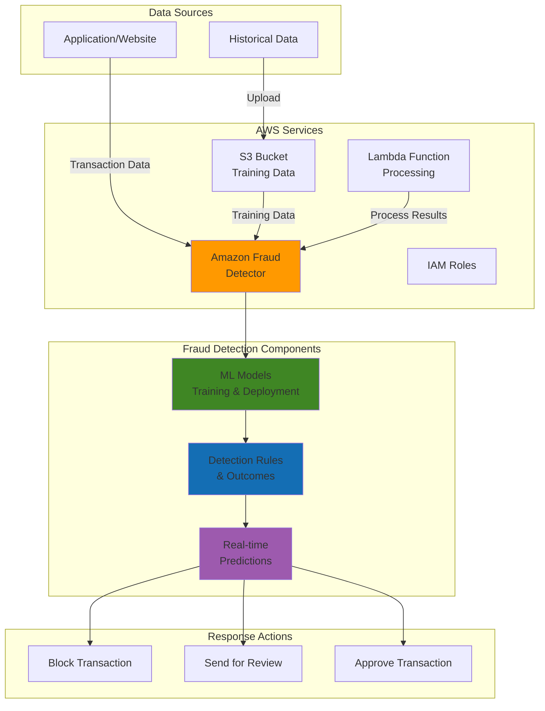

# Fraud Detection with Amazon Fraud Detector

## Problem

Financial institutions and e-commerce platforms face increasing threats from sophisticated fraud attacks, including payment fraud, account takeovers, and fake account creation. Traditional rule-based systems generate excessive false positives, while building custom ML models requires specialized expertise and significant infrastructure investment. Organizations need a solution that combines machine learning accuracy with domain expertise to detect fraud in real-time without impacting legitimate customer transactions.

## Solution

Amazon Fraud Detector provides a fully managed fraud detection service that combines machine learning with over 20 years of Amazon's fraud detection expertise. The solution enables organizations to create custom fraud detection models using their historical data, implement rule-based logic for immediate blocking, and get real-time fraud predictions through simple API calls. This approach reduces false positives, accelerates fraud detection, and scales automatically with transaction volume.

## Architecture Diagram



## Prerequisites

1. AWS account with appropriate permissions for Fraud Detector, S3, IAM, and Lambda
2. AWS CLI v2 installed and configured (or AWS CloudShell)
3. Understanding of fraud detection concepts and business logic
4. Historical transaction data with fraud labels (minimum 10,000 events recommended)
5. JSON processing knowledge for API integration
6. Estimated cost: $50-200 for training models and predictions (varies by data volume)

> **Note**: Amazon Fraud Detector charges based on model training hours, storage, and prediction requests. Training typically costs $1-5 per hour, and predictions cost $7.50 per 1,000 requests.

## Preparation

```bash
# Set environment variables
export AWS_REGION=$(aws configure get region)
export AWS_ACCOUNT_ID=$(aws sts get-caller-identity \
    --query Account --output text)

# Generate unique identifiers for resources
RANDOM_SUFFIX=$(aws secretsmanager get-random-password \
    --exclude-punctuation --exclude-uppercase \
    --password-length 6 --require-each-included-type \
    --output text --query RandomPassword)

# Set resource names
export FRAUD_BUCKET="fraud-detection-data-${RANDOM_SUFFIX}"
export EVENT_TYPE_NAME="payment_fraud_${RANDOM_SUFFIX}"
export ENTITY_TYPE_NAME="customer_${RANDOM_SUFFIX}"
export MODEL_NAME="fraud_detection_model_${RANDOM_SUFFIX}"
export DETECTOR_NAME="payment_fraud_detector_${RANDOM_SUFFIX}"

# Create S3 bucket for training data
aws s3 mb s3://${FRAUD_BUCKET} --region ${AWS_REGION}

echo "✅ S3 bucket created: ${FRAUD_BUCKET}"
```

## Steps

1. **Create IAM Role for Fraud Detector**:

   Amazon Fraud Detector requires appropriate IAM permissions to access S3 training data and execute machine learning operations. Creating a dedicated service role follows security best practices and enables the service to function autonomously within your AWS environment.

   ```bash
   # Create trust policy for Fraud Detector
   cat > fraud-detector-trust-policy.json << EOF
   {
       "Version": "2012-10-17",
       "Statement": [
           {
               "Effect": "Allow",
               "Principal": {
                   "Service": "frauddetector.amazonaws.com"
               },
               "Action": "sts:AssumeRole"
           }
       ]
   }
   EOF
   
   # Create IAM role
   aws iam create-role \
       --role-name FraudDetectorServiceRole \
       --assume-role-policy-document file://fraud-detector-trust-policy.json
   
   # Attach necessary policies
   aws iam attach-role-policy \
       --role-name FraudDetectorServiceRole \
       --policy-arn arn:aws:iam::aws:policy/AmazonFraudDetectorFullAccessPolicy
   
   # Store role ARN
   export FRAUD_DETECTOR_ROLE_ARN=$(aws iam get-role \
       --role-name FraudDetectorServiceRole \
       --query Role.Arn --output text)
   
   echo "✅ IAM role created: ${FRAUD_DETECTOR_ROLE_ARN}"
   ```

2. **Create Sample Training Data**:

   Machine learning models require high-quality training data that represents real-world transaction patterns including both legitimate and fraudulent activities. This sample dataset demonstrates the required data structure and features that Amazon Fraud Detector uses to learn fraud patterns.

   ```bash
   # Create sample fraud detection training data
   cat > training-data.csv << EOF
   event_timestamp,customer_id,email_address,ip_address,customer_name,phone_number,billing_address,billing_city,billing_state,billing_zip,shipping_address,shipping_city,shipping_state,shipping_zip,payment_method,card_bin,order_price,product_category,EVENT_LABEL
   2024-01-15T10:30:00Z,cust001,john.doe@email.com,192.168.1.1,John Doe,555-1234,123 Main St,Seattle,WA,98101,123 Main St,Seattle,WA,98101,credit_card,411111,99.99,electronics,legit
   2024-01-15T11:45:00Z,cust002,jane.smith@email.com,10.0.0.1,Jane Smith,555-5678,456 Oak Ave,Portland,OR,97201,456 Oak Ave,Portland,OR,97201,credit_card,424242,1299.99,electronics,legit
   2024-01-15T12:15:00Z,cust003,fraud@temp.com,1.2.3.4,Test User,555-0000,789 Pine St,New York,NY,10001,999 Different St,Los Angeles,CA,90210,credit_card,444444,2500.00,jewelry,fraud
   2024-01-15T13:30:00Z,cust004,alice.johnson@email.com,172.16.0.1,Alice Johnson,555-9876,321 Elm St,Chicago,IL,60601,321 Elm St,Chicago,IL,60601,debit_card,555555,45.99,books,legit
   2024-01-15T14:45:00Z,cust005,bob.wilson@email.com,192.168.2.1,Bob Wilson,555-4321,654 Maple Dr,Denver,CO,80201,654 Maple Dr,Denver,CO,80201,credit_card,666666,150.00,clothing,legit
   2024-01-15T15:00:00Z,cust006,suspicious@tempmail.com,5.6.7.8,Fake Name,555-1111,123 Fake St,Nowhere,XX,00000,456 Other St,Somewhere,YY,11111,credit_card,777777,5000.00,electronics,fraud
   EOF
   
   # Upload training data to S3
   aws s3 cp training-data.csv s3://${FRAUD_BUCKET}/training-data.csv
   
   echo "✅ Training data uploaded to S3"
   ```

3. **Create Entity Type for Customers**:

   Entity types define the subject of fraud detection, such as customers or payment accounts. Defining customer entities enables Fraud Detector to track behavior patterns and build risk profiles based on historical transaction data and fraud indicators.

   ```bash
   # Create entity type to represent customers
   aws frauddetector create-entity-type \
       --name ${ENTITY_TYPE_NAME} \
       --description "Customer entity for fraud detection"
   
   echo "✅ Entity type created: ${ENTITY_TYPE_NAME}"
   ```

4. **Create Event Type for Payment Transactions**:

   Event types define the business activities being evaluated for fraud, such as payment transactions or account logins. This configuration specifies which data fields are analyzed and how transaction features contribute to fraud scoring algorithms.

   ```bash
   # Create event type for payment fraud detection
   aws frauddetector create-event-type \
       --name ${EVENT_TYPE_NAME} \
       --description "Payment fraud detection event" \
       --event-variables '[
           {"name": "customer_id", "dataType": "STRING", "dataSource": "EVENT", "defaultValue": "unknown"},
           {"name": "email_address", "dataType": "STRING", "dataSource": "EVENT", "defaultValue": "unknown"},
           {"name": "ip_address", "dataType": "STRING", "dataSource": "EVENT", "defaultValue": "unknown"},
           {"name": "customer_name", "dataType": "STRING", "dataSource": "EVENT", "defaultValue": "unknown"},
           {"name": "phone_number", "dataType": "STRING", "dataSource": "EVENT", "defaultValue": "unknown"},
           {"name": "billing_address", "dataType": "STRING", "dataSource": "EVENT", "defaultValue": "unknown"},
           {"name": "billing_city", "dataType": "STRING", "dataSource": "EVENT", "defaultValue": "unknown"},
           {"name": "billing_state", "dataType": "STRING", "dataSource": "EVENT", "defaultValue": "unknown"},
           {"name": "billing_zip", "dataType": "STRING", "dataSource": "EVENT", "defaultValue": "unknown"},
           {"name": "payment_method", "dataType": "STRING", "dataSource": "EVENT", "defaultValue": "unknown"},
           {"name": "card_bin", "dataType": "STRING", "dataSource": "EVENT", "defaultValue": "unknown"},
           {"name": "order_price", "dataType": "FLOAT", "dataSource": "EVENT", "defaultValue": "0.0"},
           {"name": "product_category", "dataType": "STRING", "dataSource": "EVENT", "defaultValue": "unknown"}
       ]' \
       --entity-types ${ENTITY_TYPE_NAME} \
       --event-ingestion ENABLED
   
   echo "✅ Event type created: ${EVENT_TYPE_NAME}"
   ```

5. **Create Labels for Fraud Classification**:

   Labels provide the supervised learning foundation by categorizing historical transactions as fraudulent or legitimate. Amazon Fraud Detector uses these labels during model training to understand patterns that distinguish between normal and suspicious activities, enabling the service to make accurate predictions on new transactions.

   ```bash
   # Create fraud label
   aws frauddetector create-label \
       --name "fraud" \
       --description "Fraudulent transaction"
   
   # Create legitimate label
   aws frauddetector create-label \
       --name "legit" \
       --description "Legitimate transaction"
   
   echo "✅ Labels created: fraud and legit"
   ```

   These labels establish the binary classification system that enables supervised learning. The model will analyze the relationship between transaction features and these labels to develop fraud detection algorithms that can classify new transactions with high accuracy.

6. **Create and Train ML Model**:

   Amazon Fraud Detector uses machine learning to automatically discover fraud patterns in your training data. The training process analyzes transaction features, customer behaviors, and fraud labels to build predictive models that can identify suspicious activities in real-time.

   ```bash
   # Create model with Online Fraud Insights model type
   aws frauddetector create-model \
       --model-id ${MODEL_NAME} \
       --model-type ONLINE_FRAUD_INSIGHTS \
       --event-type-name ${EVENT_TYPE_NAME} \
       --training-data-source '{
           "dataLocation": "s3://'${FRAUD_BUCKET}'/training-data.csv",
           "dataAccessRoleArn": "'${FRAUD_DETECTOR_ROLE_ARN}'"
       }' \
       --training-data-schema '{
           "modelVariables": [
               "customer_id", "email_address", "ip_address", "customer_name",
               "phone_number", "billing_address", "billing_city", "billing_state",
               "billing_zip", "payment_method", "card_bin", "order_price",
               "product_category"
           ],
           "labelSchema": {
               "labelMapper": {
                   "fraud": ["fraud"],
                   "legit": ["legit"]
               },
               "unlabeledEventsTreatment": "IGNORE"
           }
       }'
   
   echo "✅ Model created and training started: ${MODEL_NAME}"
   echo "⏳ Model training will take approximately 45-60 minutes"
   ```

7. **Monitor Model Training Status**:

   Machine learning model training is a time-intensive process that requires monitoring to ensure successful completion. Amazon Fraud Detector performs feature engineering, pattern analysis, and model optimization during training, which typically takes 45-60 minutes depending on data volume and complexity.

   ```bash
   # Function to check training status
   check_training_status() {
       aws frauddetector get-model-version \
           --model-id ${MODEL_NAME} \
           --model-type ONLINE_FRAUD_INSIGHTS \
           --model-version-number 1.0 \
           --query 'status' --output text
   }
   
   # Wait for training completion
   echo "Checking training status..."
   while true; do
       STATUS=$(check_training_status)
       echo "Current status: ${STATUS}"
       
       if [ "$STATUS" = "TRAINING_COMPLETE" ]; then
           echo "✅ Model training completed successfully"
           break
       elif [ "$STATUS" = "TRAINING_FAILED" ]; then
           echo "❌ Model training failed"
           exit 1
       fi
       
       echo "Waiting 5 minutes before next check..."
       sleep 300
   done
   ```

   The training process analyzes your historical data to identify fraud patterns, optimize feature weights, and validate model performance. Once complete, the model will be ready to score new transactions with fraud probability scores ranging from 0-1000.

8. **Create Fraud Detection Rules**:

   Rules combine machine learning insights with business logic to determine transaction outcomes. The DetectorPL (Detector Programming Language) enables sophisticated rule expressions that consider model scores, transaction amounts, and other variables to implement risk-based decision making aligned with your organization's fraud policies.

   ```bash
   # Create rule for high-risk transactions
   aws frauddetector create-rule \
       --rule-id "high_risk_rule" \
       --detector-id ${DETECTOR_NAME} \
       --description "Flag high-risk transactions for review" \
       --expression '$'${MODEL_NAME}'_insightscore > 700 or $order_price > 1000' \
       --language DETECTORPL \
       --outcomes '["review"]'
   
   # Create rule for obvious fraud
   aws frauddetector create-rule \
       --rule-id "obvious_fraud_rule" \
       --detector-id ${DETECTOR_NAME} \
       --description "Block obvious fraudulent transactions" \
       --expression '$'${MODEL_NAME}'_insightscore > 900' \
       --language DETECTORPL \
       --outcomes '["block"]'
   
   # Create rule for low-risk transactions
   aws frauddetector create-rule \
       --rule-id "low_risk_rule" \
       --detector-id ${DETECTOR_NAME} \
       --description "Approve low-risk transactions" \
       --expression '$'${MODEL_NAME}'_insightscore <= 700' \
       --language DETECTORPL \
       --outcomes '["approve"]'
   
   echo "✅ Fraud detection rules created"
   ```

   These rules create a tiered fraud detection strategy: low-risk transactions are automatically approved, high-risk transactions are flagged for manual review, and obvious fraud attempts are immediately blocked. This approach balances fraud prevention with customer experience by minimizing false positives.

9. **Create Outcomes for Rule Actions**:

   Outcomes define the specific actions taken when fraud detection rules are triggered. These represent the business decisions your system will make based on fraud risk assessment, enabling automated processing for low-risk transactions while ensuring human oversight for high-risk cases.

   ```bash
   # Create review outcome
   aws frauddetector create-outcome \
       --name "review" \
       --description "Send transaction for manual review"
   
   # Create block outcome
   aws frauddetector create-outcome \
       --name "block" \
       --description "Block fraudulent transaction"
   
   # Create approve outcome
   aws frauddetector create-outcome \
       --name "approve" \
       --description "Approve legitimate transaction"
   
   echo "✅ Outcomes created: review, block, approve"
   ```

   The three-tier outcome system provides operational flexibility: automatic approval maintains transaction velocity for legitimate customers, manual review enables fraud analyst intervention for suspicious cases, and immediate blocking prevents confirmed fraudulent transactions from completing.

10. **Create and Activate Fraud Detector**:

    The detector orchestrates all fraud detection components - models, rules, and outcomes - into a cohesive system that can evaluate transactions in real-time. Creating a detector version enables controlled deployment and versioning, allowing you to test and validate changes before activating them in production.

    ```bash
    # Create detector
    aws frauddetector create-detector \
        --detector-id ${DETECTOR_NAME} \
        --description "Payment fraud detection system" \
        --event-type-name ${EVENT_TYPE_NAME}
    
    # Create detector version with rules
    aws frauddetector create-detector-version \
        --detector-id ${DETECTOR_NAME} \
        --description "Initial version with ML model and rules" \
        --rules '[
            {
                "detectorId": "'${DETECTOR_NAME}'",
                "ruleId": "high_risk_rule",
                "ruleVersion": "1"
            },
            {
                "detectorId": "'${DETECTOR_NAME}'",
                "ruleId": "obvious_fraud_rule",
                "ruleVersion": "1"
            },
            {
                "detectorId": "'${DETECTOR_NAME}'",
                "ruleId": "low_risk_rule",
                "ruleVersion": "1"
            }
        ]' \
        --model-versions '[
            {
                "modelId": "'${MODEL_NAME}'",
                "modelType": "ONLINE_FRAUD_INSIGHTS",
                "modelVersionNumber": "1.0"
            }
        ]' \
        --rule-execution-mode FIRST_MATCHED
    
    # Activate detector version
    aws frauddetector update-detector-version-status \
        --detector-id ${DETECTOR_NAME} \
        --detector-version-id "1" \
        --status ACTIVE
    
    echo "✅ Fraud detector created and activated: ${DETECTOR_NAME}"
    ```

    The FIRST_MATCHED rule execution mode ensures efficient processing by stopping evaluation once a rule condition is met. The detector is now active and ready to process real-time fraud detection requests through API calls, providing fraud scores and recommended actions for each transaction.

11. **Create Lambda Function for Processing Predictions**:

    Lambda functions provide serverless integration between your applications and Amazon Fraud Detector, enabling real-time fraud evaluation during transaction processing. This pattern allows applications to seamlessly incorporate fraud detection into their existing workflows without managing infrastructure or handling API complexity.

    ```bash
    # Create IAM trust policy for Lambda execution role
    cat > lambda-trust-policy.json << EOF
    {
        "Version": "2012-10-17",
        "Statement": [
            {
                "Effect": "Allow",
                "Principal": {
                    "Service": "lambda.amazonaws.com"
                },
                "Action": "sts:AssumeRole"
            }
        ]
    }
    EOF
    
    # Create IAM role for Lambda execution
    aws iam create-role \
        --role-name FraudDetectorLambdaRole \
        --assume-role-policy-document file://lambda-trust-policy.json
    
    # Attach basic Lambda execution policy
    aws iam attach-role-policy \
        --role-name FraudDetectorLambdaRole \
        --policy-arn arn:aws:iam::aws:policy/service-role/AWSLambdaBasicExecutionRole
    
    # Create policy for Fraud Detector access
    cat > lambda-fraud-detector-policy.json << EOF
    {
        "Version": "2012-10-17",
        "Statement": [
            {
                "Effect": "Allow",
                "Action": [
                    "frauddetector:GetEventPrediction"
                ],
                "Resource": "*"
            }
        ]
    }
    EOF
    
    # Create and attach custom policy
    aws iam create-policy \
        --policy-name FraudDetectorLambdaPolicy \
        --policy-document file://lambda-fraud-detector-policy.json
    
    aws iam attach-role-policy \
        --role-name FraudDetectorLambdaRole \
        --policy-arn arn:aws:iam::${AWS_ACCOUNT_ID}:policy/FraudDetectorLambdaPolicy
    
    # Get Lambda role ARN
    export LAMBDA_ROLE_ARN=$(aws iam get-role \
        --role-name FraudDetectorLambdaRole \
        --query Role.Arn --output text)
    
    # Create Lambda function code
    cat > fraud-processor.py << 'EOF'
    import json
    import boto3
    import logging
    from datetime import datetime
    
    logger = logging.getLogger()
    logger.setLevel(logging.INFO)
    
    frauddetector = boto3.client('frauddetector')
    
    def lambda_handler(event, context):
        try:
            # Extract transaction data from event
            transaction_data = event.get('transaction', {})
            
            # Prepare variables for fraud detection
            variables = {
                'customer_id': transaction_data.get('customer_id', 'unknown'),
                'email_address': transaction_data.get('email_address', 'unknown'),
                'ip_address': transaction_data.get('ip_address', 'unknown'),
                'customer_name': transaction_data.get('customer_name', 'unknown'),
                'phone_number': transaction_data.get('phone_number', 'unknown'),
                'billing_address': transaction_data.get('billing_address', 'unknown'),
                'billing_city': transaction_data.get('billing_city', 'unknown'),
                'billing_state': transaction_data.get('billing_state', 'unknown'),
                'billing_zip': transaction_data.get('billing_zip', 'unknown'),
                'payment_method': transaction_data.get('payment_method', 'unknown'),
                'card_bin': transaction_data.get('card_bin', 'unknown'),
                'order_price': str(transaction_data.get('order_price', 0.0)),
                'product_category': transaction_data.get('product_category', 'unknown')
            }
            
            # Get fraud prediction
            response = frauddetector.get_event_prediction(
                detectorId=event['detector_id'],
                eventId=f"txn_{datetime.now().strftime('%Y%m%d_%H%M%S')}",
                eventTypeName=event['event_type_name'],
                entities=[{
                    'entityType': event['entity_type_name'],
                    'entityId': variables['customer_id']
                }],
                eventTimestamp=datetime.now().isoformat(),
                eventVariables=variables
            )
            
            # Process results
            prediction_result = {
                'transaction_id': event.get('transaction_id'),
                'customer_id': variables['customer_id'],
                'timestamp': datetime.now().isoformat(),
                'fraud_prediction': response
            }
            
            # Extract outcomes and scores
            outcomes = response.get('ruleResults', [])
            model_scores = response.get('modelScores', [])
            
            # Log prediction results
            logger.info(f"Fraud prediction completed for transaction: {event.get('transaction_id')}")
            logger.info(f"Outcomes: {outcomes}")
            logger.info(f"Model scores: {model_scores}")
            
            return {
                'statusCode': 200,
                'body': json.dumps(prediction_result)
            }
            
        except Exception as e:
            logger.error(f"Error processing fraud prediction: {str(e)}")
            return {
                'statusCode': 500,
                'body': json.dumps({
                    'error': str(e),
                    'transaction_id': event.get('transaction_id')
                })
            }
    EOF
    
    # Create deployment package
    zip fraud-processor.zip fraud-processor.py
    
    # Wait for IAM role propagation
    echo "Waiting for IAM role propagation..."
    sleep 10
    
    # Create Lambda function
    aws lambda create-function \
        --function-name fraud-prediction-processor \
        --runtime python3.9 \
        --role ${LAMBDA_ROLE_ARN} \
        --handler fraud-processor.lambda_handler \
        --zip-file fileb://fraud-processor.zip \
        --timeout 30 \
        --memory-size 128
    
    echo "✅ Lambda function created: fraud-prediction-processor"
    ```

    The Lambda function now serves as a fraud detection microservice that can be integrated into payment processing workflows, API Gateway endpoints, or event-driven architectures. It abstracts the complexity of fraud detection API calls and provides structured fraud assessment results with proper IAM permissions for security.

12. **Test Real-time Fraud Detection**:

    Testing validates that your fraud detection system correctly identifies different risk levels and applies appropriate business logic. These tests simulate real-world scenarios to ensure the system performs as expected before integration into production transaction flows.

    ```bash
    # Test with legitimate transaction
    aws frauddetector get-event-prediction \
        --detector-id ${DETECTOR_NAME} \
        --event-id "test_legit_$(date +%s)" \
        --event-type-name ${EVENT_TYPE_NAME} \
        --entities '[{
            "entityType": "'${ENTITY_TYPE_NAME}'",
            "entityId": "test_customer_001"
        }]' \
        --event-timestamp $(date -u +"%Y-%m-%dT%H:%M:%SZ") \
        --event-variables '{
            "customer_id": "test_customer_001",
            "email_address": "legitimate@example.com",
            "ip_address": "192.168.1.100",
            "customer_name": "John Smith",
            "phone_number": "555-1234",
            "billing_address": "123 Main St",
            "billing_city": "Seattle",
            "billing_state": "WA",
            "billing_zip": "98101",
            "payment_method": "credit_card",
            "card_bin": "411111",
            "order_price": "99.99",
            "product_category": "electronics"
        }' \
        --query 'ruleResults[0].outcomes[0]' --output text
    
    # Test with suspicious transaction
    aws frauddetector get-event-prediction \
        --detector-id ${DETECTOR_NAME} \
        --event-id "test_fraud_$(date +%s)" \
        --event-type-name ${EVENT_TYPE_NAME} \
        --entities '[{
            "entityType": "'${ENTITY_TYPE_NAME}'",
            "entityId": "test_customer_002"
        }]' \
        --event-timestamp $(date -u +"%Y-%m-%dT%H:%M:%SZ") \
        --event-variables '{
            "customer_id": "test_customer_002",
            "email_address": "suspicious@tempmail.com",
            "ip_address": "1.2.3.4",
            "customer_name": "Fake Name",
            "phone_number": "555-0000",
            "billing_address": "123 Fake St",
            "billing_city": "Nowhere",
            "billing_state": "XX",
            "billing_zip": "00000",
            "payment_method": "credit_card",
            "card_bin": "444444",
            "order_price": "2999.99",
            "product_category": "electronics"
        }' \
        --query 'ruleResults[0].outcomes[0]' --output text
    
    echo "✅ Fraud detection tests completed"
    ```

    The test results demonstrate the system's ability to differentiate between legitimate and suspicious transactions. The fraud scores and outcomes provide confidence that the detector will make appropriate risk-based decisions when processing real transactions in your application.

## Validation & Testing

1. **Verify Model Training Completion**:

   ```bash
   # Check model performance metrics
   aws frauddetector describe-model-versions \
       --model-id ${MODEL_NAME} \
       --model-type ONLINE_FRAUD_INSIGHTS
   ```

   Expected output: Model status should be "TRAINING_COMPLETE" with performance metrics displayed.

2. **Test Detector Activation**:

   ```bash
   # Verify detector is active
   aws frauddetector describe-detector \
       --detector-id ${DETECTOR_NAME} \
       --query 'detectorVersionSummaries[0].status' --output text
   ```

   Expected output: "ACTIVE"

3. **Test Fraud Score Calculation**:

   ```bash
   # Get detailed prediction with scores
   aws frauddetector get-event-prediction \
       --detector-id ${DETECTOR_NAME} \
       --event-id "validation_test_$(date +%s)" \
       --event-type-name ${EVENT_TYPE_NAME} \
       --entities '[{
           "entityType": "'${ENTITY_TYPE_NAME}'",
           "entityId": "validation_customer"
       }]' \
       --event-timestamp $(date -u +"%Y-%m-%dT%H:%M:%SZ") \
       --event-variables '{
           "customer_id": "validation_customer",
           "email_address": "test@example.com",
           "ip_address": "192.168.1.1",
           "customer_name": "Test User",
           "phone_number": "555-1234",
           "billing_address": "123 Test St",
           "billing_city": "Seattle",
           "billing_state": "WA",
           "billing_zip": "98101",
           "payment_method": "credit_card",
           "card_bin": "411111",
           "order_price": "150.00",
           "product_category": "books"
       }' \
       --query 'modelScores[0].scores' --output json
   ```

   Expected output: JSON object containing fraud prediction scores.

4. **Test Rule Execution**:

   ```bash
   # Test high-value transaction rule
   aws frauddetector get-event-prediction \
       --detector-id ${DETECTOR_NAME} \
       --event-id "high_value_test_$(date +%s)" \
       --event-type-name ${EVENT_TYPE_NAME} \
       --entities '[{
           "entityType": "'${ENTITY_TYPE_NAME}'",
           "entityId": "high_value_customer"
       }]' \
       --event-timestamp $(date -u +"%Y-%m-%dT%H:%M:%SZ") \
       --event-variables '{
           "customer_id": "high_value_customer",
           "email_address": "customer@example.com",
           "ip_address": "192.168.1.50",
           "customer_name": "High Value Customer",
           "phone_number": "555-5678",
           "billing_address": "456 Oak Ave",
           "billing_city": "Portland",
           "billing_state": "OR",
           "billing_zip": "97201",
           "payment_method": "credit_card",
           "card_bin": "424242",
           "order_price": "1500.00",
           "product_category": "electronics"
       }' \
       --query 'ruleResults[0].outcomes[0]' --output text
   ```

   Expected output: "review" (due to high transaction value)

## Cleanup

1. **Deactivate and Delete Detector**:

   ```bash
   # Deactivate detector version
   aws frauddetector update-detector-version-status \
       --detector-id ${DETECTOR_NAME} \
       --detector-version-id "1" \
       --status INACTIVE
   
   # Delete detector version
   aws frauddetector delete-detector-version \
       --detector-id ${DETECTOR_NAME} \
       --detector-version-id "1"
   
   # Delete detector
   aws frauddetector delete-detector \
       --detector-id ${DETECTOR_NAME}
   
   echo "✅ Detector deleted"
   ```

2. **Delete Model and Training Resources**:

   ```bash
   # Delete model version
   aws frauddetector delete-model-version \
       --model-id ${MODEL_NAME} \
       --model-type ONLINE_FRAUD_INSIGHTS \
       --model-version-number 1.0
   
   # Delete model
   aws frauddetector delete-model \
       --model-id ${MODEL_NAME} \
       --model-type ONLINE_FRAUD_INSIGHTS
   
   echo "✅ Model deleted"
   ```

3. **Delete Rules and Outcomes**:

   ```bash
   # Delete rules
   aws frauddetector delete-rule \
       --rule-id "high_risk_rule" \
       --detector-id ${DETECTOR_NAME}
   
   aws frauddetector delete-rule \
       --rule-id "obvious_fraud_rule" \
       --detector-id ${DETECTOR_NAME}
   
   aws frauddetector delete-rule \
       --rule-id "low_risk_rule" \
       --detector-id ${DETECTOR_NAME}
   
   # Delete outcomes
   aws frauddetector delete-outcome --name "review"
   aws frauddetector delete-outcome --name "block"
   aws frauddetector delete-outcome --name "approve"
   
   echo "✅ Rules and outcomes deleted"
   ```

4. **Delete Event Type and Labels**:

   ```bash
   # Delete event type
   aws frauddetector delete-event-type \
       --name ${EVENT_TYPE_NAME}
   
   # Delete entity type
   aws frauddetector delete-entity-type \
       --name ${ENTITY_TYPE_NAME}
   
   # Delete labels
   aws frauddetector delete-label --name "fraud"
   aws frauddetector delete-label --name "legit"
   
   echo "✅ Event type, entity type, and labels deleted"
   ```

5. **Clean Up Supporting Resources**:

   ```bash
   # Delete Lambda function
   aws lambda delete-function \
       --function-name fraud-prediction-processor
   
   # Delete S3 bucket and contents
   aws s3 rm s3://${FRAUD_BUCKET} --recursive
   aws s3 rb s3://${FRAUD_BUCKET}
   
   # Delete Lambda IAM role and policy
   aws iam detach-role-policy \
       --role-name FraudDetectorLambdaRole \
       --policy-arn arn:aws:iam::aws:policy/service-role/AWSLambdaBasicExecutionRole
   
   aws iam detach-role-policy \
       --role-name FraudDetectorLambdaRole \
       --policy-arn arn:aws:iam::${AWS_ACCOUNT_ID}:policy/FraudDetectorLambdaPolicy
   
   aws iam delete-policy \
       --policy-arn arn:aws:iam::${AWS_ACCOUNT_ID}:policy/FraudDetectorLambdaPolicy
   
   aws iam delete-role --role-name FraudDetectorLambdaRole
   
   # Delete Fraud Detector IAM role
   aws iam detach-role-policy \
       --role-name FraudDetectorServiceRole \
       --policy-arn arn:aws:iam::aws:policy/AmazonFraudDetectorFullAccessPolicy
   
   aws iam delete-role --role-name FraudDetectorServiceRole
   
   # Clean up local files
   rm -f fraud-detector-trust-policy.json
   rm -f lambda-trust-policy.json
   rm -f lambda-fraud-detector-policy.json
   rm -f training-data.csv
   rm -f fraud-processor.py
   rm -f fraud-processor.zip
   
   echo "✅ All resources cleaned up"
   ```

## Discussion

Amazon Fraud Detector simplifies the implementation of sophisticated fraud detection systems by combining machine learning models with rule-based logic. The service leverages transfer learning, utilizing patterns learned from Amazon's extensive fraud detection experience, which significantly improves model performance even with limited training data. This approach is particularly valuable for organizations that lack the resources to build custom ML infrastructure from scratch.

The architecture demonstrates several key concepts in fraud detection: feature engineering through variable selection, model training with labeled historical data, and real-time prediction scoring. The combination of ML-based scoring with rule-based decision logic provides flexibility to implement business-specific fraud policies while maintaining high accuracy. The system follows AWS security best practices with proper IAM role management and least-privilege access controls.

Cost optimization is achieved through the pay-per-use model, where organizations only pay for model training time, data storage, and prediction requests. The service automatically scales to handle varying transaction volumes without requiring infrastructure management. For high-volume applications, implementing prediction caching and batching strategies can further reduce costs while maintaining real-time response capabilities. The serverless Lambda integration provides additional cost benefits by eliminating idle compute charges.

Integration patterns vary based on application architecture. Real-time fraud detection typically involves API Gateway or Lambda functions calling the Fraud Detector service during transaction processing, while batch processing scenarios can use scheduled jobs to score large datasets. The service supports both synchronous and asynchronous processing patterns, making it suitable for various application requirements. See the [AWS Fraud Detector User Guide](https://docs.aws.amazon.com/frauddetector/latest/ug/what-is-frauddetector.html) for additional implementation patterns and best practices.

> **Tip**: Start with a simple model using basic transaction features, then gradually add more sophisticated variables like device fingerprinting, behavioral analytics, and network analysis to improve detection accuracy.

## Challenge

Extend this fraud detection system with these advanced capabilities:

1. **Implement Multi-Model Ensemble**: Create separate models for different fraud types (payment fraud, account takeover, fake accounts) and combine their predictions using weighted scoring algorithms.

2. **Add Real-time Feature Engineering**: Integrate with Amazon Kinesis to create real-time features like transaction velocity, spending patterns, and geographic anomalies that enhance fraud detection accuracy.

3. **Build Adaptive Learning Pipeline**: Implement a feedback loop using Amazon SageMaker to continuously retrain models based on fraud analyst feedback and new fraud patterns.

4. **Create Fraud Investigation Dashboard**: Build a comprehensive dashboard using Amazon QuickSight that visualizes fraud trends, model performance metrics, and case management workflows for fraud analysts.

5. **Implement Advanced Alert System**: Design an intelligent alerting system using Amazon SNS and EventBridge that prioritizes fraud alerts based on risk severity, customer value, and historical patterns.

## Infrastructure Code

*Infrastructure code will be generated after recipe approval.*