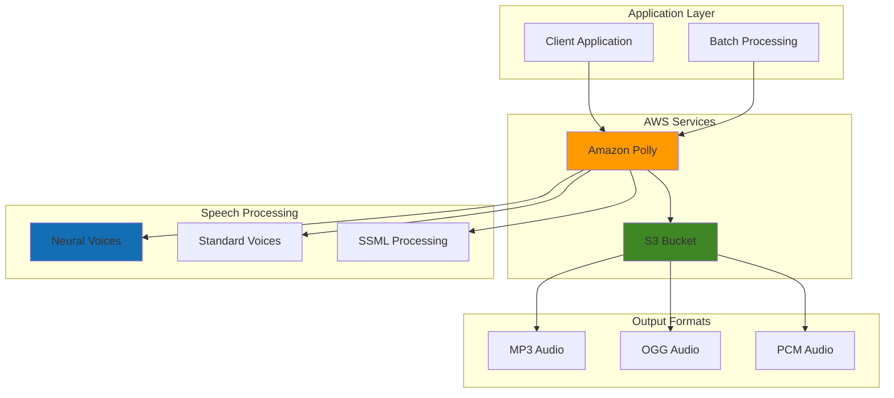

# Generating Speech with Amazon Polly


## Problem

Organizations need to create accessible voice-enabled applications for diverse audiences, including mobile apps, e-learning platforms, and IoT devices. Traditional text-to-speech solutions are expensive to implement, limited in voice variety, and difficult to scale across multiple languages and regions. Companies struggle to provide consistent, high-quality voice experiences while managing costs and maintaining flexibility for different use cases.

## Solution

Amazon Polly provides a scalable, cost-effective text-to-speech service that converts text into lifelike speech using advanced neural networks. This solution demonstrates how to build voice-enabled applications using Polly's diverse portfolio of voices, multiple languages, and SSML markup for advanced speech control, enabling both real-time and batch audio generation workflows.

## Architecture Diagram



## Prerequisites

1. AWS account with appropriate permissions for Amazon Polly and S3
2. AWS CLI v2 installed and configured (or AWS CloudShell)
3. Basic understanding of audio formats and text processing
4. Text content for speech synthesis testing
5. Estimated cost: $0.50-$2.00 for testing (pay per character synthesized)

> **Note**: Amazon Polly charges $4.00 per 1 million characters for standard voices and $16.00 per 1 million characters for neural voices. First 5 million characters per month are free for 12 months.

## Preparation

```bash
# Set environment variables
export AWS_REGION=$(aws configure get region)
export AWS_ACCOUNT_ID=$(aws sts get-caller-identity \
    --query Account --output text)

# Generate unique identifiers for resources
RANDOM_SUFFIX=$(aws secretsmanager get-random-password \
    --exclude-punctuation --exclude-uppercase \
    --password-length 6 --require-each-included-type \
    --output text --query RandomPassword)

export POLLY_BUCKET_NAME="polly-audio-output-${RANDOM_SUFFIX}"
export SAMPLE_TEXT_FILE="sample_text.txt"
export SSML_TEXT_FILE="ssml_sample.xml"

# Create S3 bucket for audio output
aws s3 mb s3://${POLLY_BUCKET_NAME} \
    --region ${AWS_REGION}

echo "✅ Created S3 bucket: ${POLLY_BUCKET_NAME}"

# Create sample text files
cat > ${SAMPLE_TEXT_FILE} << 'EOF'
Welcome to Amazon Polly! This is a demonstration of text-to-speech synthesis. 
Amazon Polly can convert this text into natural-sounding speech using a variety of voices and languages. 
You can use Amazon Polly to create voice-enabled applications for mobile apps, IoT devices, and accessibility features.
EOF

echo "✅ Created sample text file: ${SAMPLE_TEXT_FILE}"
```

## Steps

1. **Explore Available Voices and Languages**:

   Understanding Polly's voice portfolio is essential for building effective voice applications. Amazon Polly offers over 90 voices across 30+ languages, with two distinct synthesis engines: standard (concatenative) and neural (deep learning-based). The voice selection directly impacts user experience, as neural voices provide 50% higher naturalness scores in listener studies and support advanced prosody features.

   ```bash
   # List all available voices
   aws polly describe-voices \
       --query 'Voices[*].[Name,Gender,LanguageCode,Engine]' \
       --output table
   
   # Filter for English neural voices
   aws polly describe-voices \
       --language-code en-US \
       --query 'Voices[?Engine==`neural`].[Name,Gender,SupportedEngines]' \
       --output table
   
   echo "✅ Retrieved available voices and their capabilities"
   ```

   This inventory reveals the full spectrum of voice options available for your applications. Neural voices like Joanna, Matthew, and Amy provide superior quality for customer-facing applications, while standard voices offer cost-effective solutions for internal tools and high-volume use cases.

2. **Generate Basic Text-to-Speech Audio**:

   Text synthesis forms the foundation of voice-enabled applications, converting written content into audio streams that enhance accessibility and user engagement. Amazon Polly's synchronous synthesis API provides real-time speech generation with sub-second latency, making it ideal for interactive applications like chatbots, navigation systems, and voice assistants. The choice between standard and neural engines affects both quality and cost.

   ```bash
   # Synthesize speech using standard voice
   aws polly synthesize-speech \
       --text "Hello! This is Amazon Polly speaking with a standard voice." \
       --output-format mp3 \
       --voice-id Joanna \
       --engine standard \
       standard-voice-output.mp3
   
   echo "✅ Generated MP3 audio with standard voice"
   
   # Synthesize speech using neural voice for higher quality
   aws polly synthesize-speech \
       --text "Hello! This is Amazon Polly speaking with a neural voice for enhanced quality." \
       --output-format mp3 \
       --voice-id Joanna \
       --engine neural \
       neural-voice-output.mp3
   
   echo "✅ Generated MP3 audio with neural voice"
   ```

   The generated audio files demonstrate the quality difference between synthesis engines. Neural voices produce more natural-sounding speech with better intonation, breathing patterns, and emotional expression, while standard voices provide consistent, clear output at lower cost. This comparison helps inform voice selection decisions for different application contexts.

3. **Create SSML-Enhanced Speech Synthesis**:

   SSML (Speech Synthesis Markup Language) transforms basic text-to-speech into sophisticated audio experiences by providing fine-grained control over speech characteristics. This W3C standard enables developers to manipulate prosody (rate, pitch, volume), add emphasis, insert pauses, and format specialized content like phone numbers and dates. SSML is crucial for creating professional voice applications that sound natural and contextually appropriate.

   ```bash
   # Create SSML document with advanced speech controls
   cat > ${SSML_TEXT_FILE} << 'EOF'
   <speak>
       <prosody rate="slow" pitch="low">
           Welcome to our <emphasis level="strong">premium</emphasis> service.
       </prosody>
       <break time="1s"/>
       <prosody rate="fast" pitch="high">
           This is an exciting announcement!
       </prosody>
       <break time="500ms"/>
       <prosody volume="soft">
           Please speak quietly in the library.
       </prosody>
       <break time="1s"/>
       <say-as interpret-as="telephone">1-800-555-0123</say-as>
       <break time="500ms"/>
       <say-as interpret-as="date" format="ymd">2024-01-15</say-as>
   </speak>
   EOF
   
   # Generate SSML-enhanced speech
   aws polly synthesize-speech \
       --text-type ssml \
       --text file://${SSML_TEXT_FILE} \
       --output-format mp3 \
       --voice-id Matthew \
       --engine neural \
       ssml-enhanced-output.mp3
   
   echo "✅ Generated SSML-enhanced speech with prosody controls"
   ```

   The resulting audio demonstrates advanced speech control capabilities that elevate user experience beyond basic text reading. Prosody changes convey emotional context and importance, breaks create natural conversation flow, and specialized formatting ensures proper pronunciation of structured data. These techniques are essential for creating engaging voice interfaces in customer service, e-learning, and entertainment applications.

4. **Implement Multi-Language Speech Generation**:

   Global applications require localized voice experiences that respect cultural preferences and linguistic nuances. Amazon Polly supports 30+ languages with native speakers' voices, enabling businesses to create authentic voice experiences for international markets. Multi-language support is critical for accessibility compliance, global customer service, and content localization strategies that drive user engagement across diverse markets.

   ```bash
   # Spanish synthesis
   aws polly synthesize-speech \
       --text "Hola, bienvenido a Amazon Polly. Esta es una demostración en español." \
       --output-format mp3 \
       --voice-id Lupe \
       --engine neural \
       spanish-voice-output.mp3
   
   # French synthesis
   aws polly synthesize-speech \
       --text "Bonjour, bienvenue sur Amazon Polly. Ceci est une démonstration en français." \
       --output-format mp3 \
       --voice-id Lea \
       --engine neural \
       french-voice-output.mp3
   
   # German synthesis
   aws polly synthesize-speech \
       --text "Hallo, willkommen bei Amazon Polly. Dies ist eine Demonstration auf Deutsch." \
       --output-format mp3 \
       --voice-id Vicki \
       --engine neural \
       german-voice-output.mp3
   
   echo "✅ Generated multi-language speech samples"
   ```

   These samples demonstrate how voice selection impacts cultural authenticity and user acceptance. Each voice is trained on native speaker data, ensuring proper pronunciation, accent, and intonation patterns. This capability enables businesses to scale voice applications globally while maintaining local relevance and user trust.

5. **Create Batch Speech Synthesis Tasks**:

   Batch synthesis enables cost-effective processing of large content volumes, making it ideal for content publishers, e-learning platforms, and media companies that need to convert extensive text libraries into audio. Unlike real-time synthesis, batch processing leverages S3 integration for scalable, asynchronous workflows that can handle documents up to 100,000 characters while reducing per-character costs and eliminating API timeout concerns.

   ```bash
   # Create longer text content for batch processing
   cat > long_text.txt << 'EOF'
   Amazon Polly is a cloud service that converts text into lifelike speech. 
   You can use Amazon Polly to develop applications that increase engagement and accessibility. 
   Amazon Polly supports multiple languages and includes a variety of lifelike voices. 
   With Amazon Polly, you can build speech-enabled applications that work in multiple locations 
   and use the ideal voice for your customers. Also, you only pay for the text you synthesize. 
   You can also cache and replay Amazon Polly's generated speech at no additional cost.
   
   Amazon Polly offers many voice options, including generative, long-form, neural, and standard 
   text-to-speech options. These voices deliver ground-breaking improvements in speech quality using 
   new machine learning technology to offer the most natural and human-like text-to-speech voices possible.
   EOF
   
   # Start batch synthesis task
   TASK_ID=$(aws polly start-speech-synthesis-task \
       --output-format mp3 \
       --output-s3-bucket-name ${POLLY_BUCKET_NAME} \
       --text file://long_text.txt \
       --voice-id Joanna \
       --engine neural \
       --query 'SynthesisTask.TaskId' \
       --output text)
   
   echo "✅ Started batch synthesis task: ${TASK_ID}"
   
   # Store task ID for monitoring
   export SYNTHESIS_TASK_ID=${TASK_ID}
   ```

   The batch task is now queued for processing in AWS's managed infrastructure. This asynchronous approach allows applications to submit multiple synthesis jobs without blocking user interfaces, while S3 integration provides durable storage for generated audio content. The task ID enables monitoring and retrieval of results when processing completes.

6. **Monitor and Retrieve Batch Synthesis Results**:

   Batch synthesis monitoring demonstrates asynchronous processing patterns essential for scalable voice applications. The task lifecycle includes queued, in_progress, completed, and failed states, with typical processing times of 1-5 minutes depending on content length and queue depth. This monitoring approach enables applications to implement robust workflow orchestration while providing users with progress updates and error handling.

   ```bash
   # Check task status
   aws polly get-speech-synthesis-task \
       --task-id ${SYNTHESIS_TASK_ID} \
       --query 'SynthesisTask.[TaskStatus,OutputUri,CreationTime]' \
       --output table
   
   # Wait for completion and get output URI
   echo "Waiting for synthesis task to complete..."
   while true; do
       TASK_STATUS=$(aws polly get-speech-synthesis-task \
           --task-id ${SYNTHESIS_TASK_ID} \
           --query 'SynthesisTask.TaskStatus' \
           --output text)
       
       if [ "$TASK_STATUS" = "completed" ]; then
           OUTPUT_URI=$(aws polly get-speech-synthesis-task \
               --task-id ${SYNTHESIS_TASK_ID} \
               --query 'SynthesisTask.OutputUri' \
               --output text)
           echo "✅ Synthesis task completed. Output: ${OUTPUT_URI}"
           break
       elif [ "$TASK_STATUS" = "failed" ]; then
           echo "❌ Synthesis task failed"
           break
       else
           echo "Task status: ${TASK_STATUS}. Waiting..."
           sleep 10
       fi
   done
   ```

   The completed task now provides an S3 URI containing the generated audio file. This pattern enables decoupled architectures where synthesis requests are processed independently of retrieval, supporting high-throughput scenarios and allowing applications to batch multiple synthesis operations efficiently.

7. **Generate Different Audio Formats**:

   Audio format selection impacts application performance, compatibility, and user experience across different platforms and devices. MP3 provides broad compatibility with efficient compression, OGG Vorbis offers superior quality for web applications with modern browser support, and PCM delivers uncompressed audio for real-time telephony and IoT systems requiring minimal processing latency. Format choice affects bandwidth usage, storage costs, and playback compatibility.

   ```bash
   # Generate OGG format for web applications
   aws polly synthesize-speech \
       --text "This audio is in OGG format, ideal for web applications." \
       --output-format ogg_vorbis \
       --voice-id Amy \
       --engine neural \
       web-audio-output.ogg
   
   # Generate PCM format for telephony/IoT
   aws polly synthesize-speech \
       --text "This audio is in PCM format, suitable for telephony and IoT devices." \
       --output-format pcm \
       --voice-id Brian \
       --engine neural \
       telephony-audio-output.pcm
   
   echo "✅ Generated multiple audio formats"
   ```

   The format diversity enables optimization for specific use cases: OGG for progressive web apps requiring high quality, PCM for real-time streaming applications, and MP3 for broad device compatibility. This flexibility allows developers to balance quality, file size, and compatibility requirements based on their target audience and technical constraints.

8. **Create Pronunciation Lexicons for Custom Words**:

   Pronunciation lexicons solve the critical challenge of accurately speaking specialized terminology, brand names, and domain-specific jargon that standard text-to-speech engines may mispronounce. Lexicons use the W3C Pronunciation Lexicon Specification (PLS) to define custom pronunciations using either phonetic representations (IPA) or aliases (substitutions). This capability is essential for professional applications in healthcare, finance, technology, and other industries where accurate pronunciation builds credibility and user trust.

   ```bash
   # Create pronunciation lexicon file
   cat > custom_pronunciation.xml << 'EOF'
   <?xml version="1.0" encoding="UTF-8"?>
   <lexicon version="1.0" 
       xmlns="http://www.w3.org/2005/01/pronunciation-lexicon"
       xmlns:xsi="http://www.w3.org/2001/XMLSchema-instance" 
       xsi:schemaLocation="http://www.w3.org/2005/01/pronunciation-lexicon 
           http://www.w3.org/TR/2007/CR-pronunciation-lexicon-20071212/pls.xsd"
       alphabet="ipa" 
       xml:lang="en-US">
       <lexeme>
           <grapheme>AWS</grapheme>
           <alias>Amazon Web Services</alias>
       </lexeme>
       <lexeme>
           <grapheme>API</grapheme>
           <alias>Application Programming Interface</alias>
       </lexeme>
   </lexicon>
   EOF
   
   # Upload pronunciation lexicon
   aws polly put-lexicon \
       --name tech-terminology \
       --content file://custom_pronunciation.xml
   
   # Test speech with custom lexicon
   aws polly synthesize-speech \
       --text "Welcome to AWS! This API demonstration uses custom pronunciation." \
       --output-format mp3 \
       --voice-id Joanna \
       --engine neural \
       --lexicon-names tech-terminology \
       custom-pronunciation-output.mp3
   
   echo "✅ Created and applied custom pronunciation lexicon"
   ```

   The lexicon is now active and will automatically apply custom pronunciations to matching text in all synthesis requests that reference it. This approach ensures consistent pronunciation across applications and enables organizations to maintain brand integrity and professional communication standards in voice interfaces.

## Validation & Testing

1. **Verify audio file generation**:

   ```bash
   # Check if audio files were created
   ls -la *.mp3 *.ogg *.pcm
   
   # Get file sizes to confirm content
   du -h *.mp3 *.ogg *.pcm
   ```

   Expected output: Multiple audio files with reasonable sizes (typically 50KB-500KB depending on content length)

2. **Test S3 batch synthesis output**:

   ```bash
   # List objects in S3 bucket
   aws s3 ls s3://${POLLY_BUCKET_NAME}/ --recursive
   
   # Download batch synthesis result
   aws s3 cp s3://${POLLY_BUCKET_NAME}/${SYNTHESIS_TASK_ID}.mp3 \
       batch-synthesis-result.mp3
   
   echo "✅ Downloaded batch synthesis result"
   ```

3. **Verify lexicon functionality**:

   ```bash
   # List installed lexicons
   aws polly list-lexicons \
       --query 'Lexicons[*].[Name,Attributes.LexemesCount]' \
       --output table
   
   # Get lexicon details
   aws polly get-lexicon \
       --name tech-terminology \
       --query 'LexiconAttributes.[LexemesCount,Size,LanguageCode]' \
       --output table
   ```

4. **Test voice comparison**:

   ```bash
   # Generate same text with different voices for comparison
   COMPARISON_TEXT="This is a test to compare different voice qualities and characteristics."
   
   # Standard voice
   aws polly synthesize-speech \
       --text "${COMPARISON_TEXT}" \
       --output-format mp3 \
       --voice-id Joanna \
       --engine standard \
       comparison-standard.mp3
   
   # Neural voice
   aws polly synthesize-speech \
       --text "${COMPARISON_TEXT}" \
       --output-format mp3 \
       --voice-id Joanna \
       --engine neural \
       comparison-neural.mp3
   
   echo "✅ Generated voice comparison samples"
   ```

## Cleanup

1. **Remove generated audio files**:

   ```bash
   # Delete local audio files
   rm -f *.mp3 *.ogg *.pcm *.txt *.xml
   
   echo "✅ Deleted local audio files"
   ```

2. **Delete S3 bucket and contents**:

   ```bash
   # Delete all objects in bucket
   aws s3 rm s3://${POLLY_BUCKET_NAME} --recursive
   
   # Delete bucket
   aws s3 rb s3://${POLLY_BUCKET_NAME}
   
   echo "✅ Deleted S3 bucket and contents"
   ```

3. **Remove pronunciation lexicons**:

   ```bash
   # Delete custom lexicon
   aws polly delete-lexicon \
       --name tech-terminology
   
   echo "✅ Deleted custom pronunciation lexicon"
   ```

4. **Clean up environment variables**:

   ```bash
   # Unset environment variables
   unset POLLY_BUCKET_NAME SAMPLE_TEXT_FILE SSML_TEXT_FILE
   unset SYNTHESIS_TASK_ID
   
   echo "✅ Cleaned up environment variables"
   ```

## Discussion

Amazon Polly provides a comprehensive text-to-speech solution that addresses the key challenges of building voice-enabled applications. The service offers significant advantages over traditional TTS solutions through its pay-per-use model, extensive voice portfolio, and seamless AWS integration. The neural voice engine delivers remarkably natural speech quality that closely mimics human intonation and rhythm patterns.

The distinction between standard and neural voices is crucial for application design. Standard voices use concatenative synthesis and are cost-effective for basic applications, while neural voices leverage advanced deep learning models to produce more expressive and natural-sounding speech. Neural voices are particularly valuable for customer-facing applications where voice quality directly impacts user experience and brand perception.

SSML (Speech Synthesis Markup Language) support enables sophisticated control over speech characteristics, including prosody, emphasis, and pronunciation. This functionality is essential for creating professional voice applications that can handle diverse content types, from casual conversation to technical documentation. The ability to control speech rate, pitch, and volume allows developers to create contextually appropriate voice experiences.

The batch synthesis capability is particularly valuable for content publishers and e-learning platforms that need to process large volumes of text efficiently. By leveraging S3 integration, organizations can implement scalable workflows that process audio content asynchronously, reducing costs and improving performance for bulk operations.

> **Tip**: Use neural voices for customer-facing applications and standard voices for internal tools to optimize cost while maintaining quality where it matters most.

## Challenge

Extend this solution by implementing these enhancements:

1. **Build a Multi-Voice Podcast Generator**: Create a system that automatically assigns different voices to different speakers in a script, using SSML to add natural pauses and emphasis for professional podcast production.

2. **Implement Real-Time Voice Streaming**: Develop a WebSocket-based application that streams synthesized speech in real-time as users type, using multiple audio formats and adaptive bitrate based on connection quality.

3. **Create a Voice Localization Pipeline**: Build an automated system that takes English content and generates localized speech in multiple languages, with voice selection based on regional preferences and cultural considerations.

4. **Develop Accessibility Integration**: Implement a comprehensive accessibility solution that integrates Polly with screen readers, provides audio descriptions for visual content, and offers customizable speech settings for users with different needs.

5. **Build Advanced Pronunciation Management**: Create a system that automatically detects technical terms, brand names, and proper nouns in text, then applies appropriate pronunciation rules and maintains pronunciation consistency across large content repositories.

## Infrastructure Code

*Infrastructure code will be generated after recipe approval.*