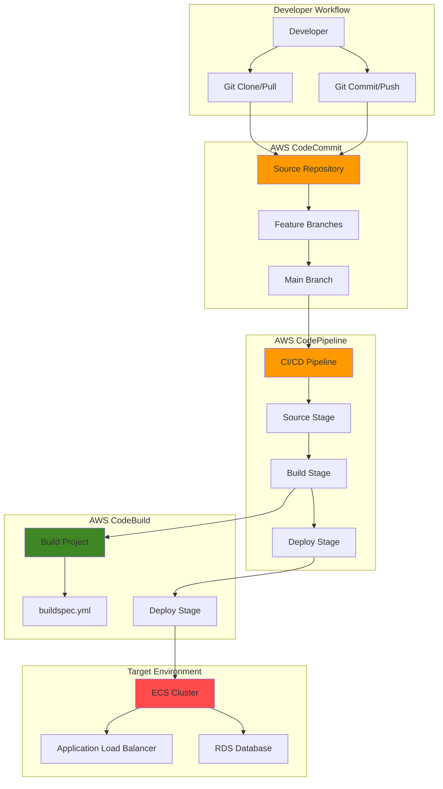

# GitOps with CodeCommit and CodeBuild

## Problem

Development teams struggle with manual deployment processes that lead to configuration drift, inconsistent environments, and security vulnerabilities from manual access to production systems. Traditional CI/CD pipelines often require developers to have direct access to deployment environments, creating security risks and compliance challenges.

## Solution

Implement a GitOps workflow using AWS CodeCommit as the source repository and CodeBuild for automated deployments that are triggered by Git operations. This approach treats Git as the single source of truth for infrastructure and application configurations, enabling declarative deployments with full audit trails and automated rollback capabilities.

## Architecture Diagram



## Prerequisites

1. AWS account with permissions for CodeCommit, CodeBuild, CodePipeline, ECR, ECS, IAM, and CloudWatch Logs
2. AWS CLI v2 installed and configured (or AWS CloudShell)
3. Git client installed locally
4. Basic understanding of GitOps principles and containerized applications
5. Docker knowledge for building container images
6. Estimated cost: $15-25 per month for development workloads (varies by usage)

> **Note**: This recipe creates resources in the AWS Free Tier where possible, but ECS and ALB usage may incur charges. See [AWS Pricing](https://aws.amazon.com/pricing/) for detailed cost information.

## Preparation

```bash
# Set environment variables
export AWS_REGION=$(aws configure get region)
export AWS_ACCOUNT_ID=$(aws sts get-caller-identity \
    --query Account --output text)

# Generate unique identifiers for resources
RANDOM_SUFFIX=$(aws secretsmanager get-random-password \
    --exclude-punctuation --exclude-uppercase \
    --password-length 6 --require-each-included-type \
    --output text --query RandomPassword)

export REPO_NAME="gitops-demo-${RANDOM_SUFFIX}"
export PROJECT_NAME="gitops-build-${RANDOM_SUFFIX}"
export PIPELINE_NAME="gitops-pipeline-${RANDOM_SUFFIX}"
export CLUSTER_NAME="gitops-cluster-${RANDOM_SUFFIX}"

echo "Repository: ${REPO_NAME}"
echo "Build Project: ${PROJECT_NAME}"
echo "Pipeline: ${PIPELINE_NAME}"
echo "ECS Cluster: ${CLUSTER_NAME}"
```

## Steps

1. **Create CodeCommit Repository for GitOps Source Control**:

   CodeCommit provides a fully managed Git service that integrates seamlessly with AWS developer tools and IAM for secure access control. As the foundation of our GitOps workflow, this repository will serve as the single source of truth for both application code and infrastructure configurations, enabling declarative deployments through Git operations.

   ```bash
   # Create the GitOps repository
   aws codecommit create-repository \
       --repository-name ${REPO_NAME} \
       --repository-description "GitOps workflow demonstration repository"
   
   # Get repository clone URL
   REPO_CLONE_URL=$(aws codecommit get-repository \
       --repository-name ${REPO_NAME} \
       --query 'repositoryMetadata.cloneUrlHttp' \
       --output text)
   
   echo "✅ CodeCommit repository created: ${REPO_CLONE_URL}"
   ```

   The repository is now established and ready to receive our GitOps configuration files. This centralized version control enables team collaboration while maintaining a complete audit trail of all infrastructure and application changes.

2. **Clone Repository and Create GitOps Project Structure**:

   A well-organized repository structure is essential for GitOps success, separating application code from infrastructure definitions while maintaining clear deployment paths. This structure enables automated tools to understand deployment targets and configuration relationships.

   ```bash
   # Clone the empty repository
   git clone ${REPO_CLONE_URL}
   cd ${REPO_NAME}
   
   # Create GitOps directory structure
   mkdir -p {app,infrastructure,config}
   mkdir -p infrastructure/{dev,staging,prod}
   mkdir -p config/{buildspecs,policies}
   
   echo "✅ GitOps project structure created"
   ```

   The organized directory structure now provides clear separation between application code, infrastructure definitions, and configuration files. This layout supports environment-specific deployments and makes the repository self-documenting for team members.

3. **Create Sample Application and Dockerfile**:

   Creating a containerized application demonstrates the complete GitOps workflow from code changes to deployment. Containers provide consistent runtime environments and enable immutable deployments, key principles of GitOps methodology.

   ```bash
   # Create sample Node.js application
   cat > app/app.js << 'EOF'
const express = require('express');
const app = express();
const port = process.env.PORT || 3000;

app.get('/', (req, res) => {
    res.json({
        message: 'GitOps Demo Application',
        version: process.env.APP_VERSION || '1.0.0',
        environment: process.env.ENVIRONMENT || 'development'
    });
});

app.get('/health', (req, res) => {
    res.json({ status: 'healthy', timestamp: new Date().toISOString() });
});

app.listen(port, () => {
    console.log(`App running on port ${port}`);
});
EOF
   
   # Create package.json
   cat > app/package.json << 'EOF'
{
  "name": "gitops-demo-app",
  "version": "1.0.0",
  "description": "Sample application for GitOps workflow demonstration",
  "main": "app.js",
  "scripts": {
    "start": "node app.js"
  },
  "dependencies": {
    "express": "^4.19.0"
  }
}
EOF
   
   # Create Dockerfile
   cat > app/Dockerfile << 'EOF'
FROM node:18-alpine
WORKDIR /app
COPY package*.json ./
RUN npm install --production
COPY . .
EXPOSE 3000
CMD ["npm", "start"]
EOF
   
   echo "✅ Sample containerized application created"
   ```

   The application is now containerized and ready for deployment through our GitOps pipeline. The simple REST API provides health checks and version information, enabling deployment verification and monitoring.

4. **Create CodeBuild Service Role with Necessary Permissions**:

   CodeBuild requires an IAM role with specific permissions to access AWS services during the build and deployment process. This role follows the principle of least privilege while enabling necessary operations for GitOps workflows including ECR access for container images and ECS deployment permissions.

   ```bash
   # Create trust policy for CodeBuild
   cat > config/policies/codebuild-trust-policy.json << 'EOF'
{
  "Version": "2012-10-17",
  "Statement": [
    {
      "Effect": "Allow",
      "Principal": {
        "Service": "codebuild.amazonaws.com"
      },
      "Action": "sts:AssumeRole"
    }
  ]
}
EOF
   
   # Create CodeBuild service role
   aws iam create-role \
       --role-name CodeBuildGitOpsRole-${RANDOM_SUFFIX} \
       --assume-role-policy-document file://config/policies/codebuild-trust-policy.json
   
   # Attach necessary managed policies
   aws iam attach-role-policy \
       --role-name CodeBuildGitOpsRole-${RANDOM_SUFFIX} \
       --policy-arn arn:aws:iam::aws:policy/CloudWatchLogsFullAccess
   
   aws iam attach-role-policy \
       --role-name CodeBuildGitOpsRole-${RANDOM_SUFFIX} \
       --policy-arn arn:aws:iam::aws:policy/AmazonEC2ContainerRegistryPowerUser
   
   aws iam attach-role-policy \
       --role-name CodeBuildGitOpsRole-${RANDOM_SUFFIX} \
       --policy-arn arn:aws:iam::aws:policy/AmazonECS_FullAccess
   
   echo "✅ CodeBuild service role created with GitOps permissions"
   ```

   The service role is now configured with the minimum required permissions for GitOps operations. This security configuration enables CodeBuild to perform container builds, push images to ECR, and deploy to ECS while maintaining appropriate access controls.

5. **Create ECR Repository for Container Images**:

   Amazon ECR provides a secure, scalable container registry that integrates with CodeBuild for automated image builds and ECS for deployments. Container images serve as the immutable artifacts in GitOps workflows, ensuring consistent deployments across environments.

   ```bash
   # Create ECR repository
   aws ecr create-repository \
       --repository-name ${REPO_NAME} \
       --region ${AWS_REGION}
   
   # Get ECR repository URI
   ECR_URI=$(aws ecr describe-repositories \
       --repository-names ${REPO_NAME} \
       --query 'repositories[0].repositoryUri' \
       --output text)
   
   # Enable ECR image scanning for security
   aws ecr put-image-scanning-configuration \
       --repository-name ${REPO_NAME} \
       --image-scanning-configuration scanOnPush=true
   
   echo "✅ ECR repository created: ${ECR_URI}"
   export ECR_URI
   ```

   The container registry is ready to store our application images with built-in security scanning and lifecycle policies. Each Git commit will generate a tagged container image, providing clear traceability from source code to deployed artifacts.

6. **Create Comprehensive BuildSpec for GitOps Pipeline**:

   The buildspec.yml file defines the complete build and deployment process, transforming source code into deployed applications. This file embodies GitOps principles by codifying the entire deployment pipeline, making it version-controlled, auditable, and repeatable.

   ```bash
   # Create comprehensive buildspec for GitOps workflow
   cat > config/buildspecs/buildspec.yml << EOF
version: 0.2

phases:
  pre_build:
    commands:
      - echo Logging in to Amazon ECR...
      - aws ecr get-login-password --region \$AWS_DEFAULT_REGION | docker login --username AWS --password-stdin ${ECR_URI}
      - REPOSITORY_URI=${ECR_URI}
      - COMMIT_HASH=\$(echo \$CODEBUILD_RESOLVED_SOURCE_VERSION | cut -c 1-7)
      - IMAGE_TAG=\$COMMIT_HASH
      - echo Build started on \$(date)
      
  build:
    commands:
      - echo Build started on \$(date)
      - echo Building the Docker image...
      - cd app
      - docker build -t \$REPOSITORY_URI:latest .
      - docker tag \$REPOSITORY_URI:latest \$REPOSITORY_URI:\$IMAGE_TAG
      
  post_build:
    commands:
      - echo Build completed on \$(date)
      - echo Pushing the Docker images...
      - docker push \$REPOSITORY_URI:latest
      - docker push \$REPOSITORY_URI:\$IMAGE_TAG
      - echo Writing image definitions file...
      - printf '[{"name":"gitops-app","imageUri":"%s"}]' \$REPOSITORY_URI:\$IMAGE_TAG > imagedefinitions.json
      
artifacts:
  files:
    - imagedefinitions.json
    - infrastructure/**/*
  name: GitOpsArtifacts
EOF
   
   echo "✅ BuildSpec configuration created for GitOps pipeline"
   ```

   The buildspec now defines a complete CI/CD process that builds container images, tags them with Git commit hashes, and prepares deployment artifacts. This configuration ensures every deployment is traceable to specific code changes, a core GitOps principle.

7. **Create CodeBuild Project for Automated Builds**:

   CodeBuild projects execute the buildspec instructions, providing scalable, managed build infrastructure. This eliminates the need for maintaining build servers while providing integration with AWS services and detailed build logs for troubleshooting.

   ```bash
   # Get CodeBuild service role ARN
   CODEBUILD_ROLE_ARN=$(aws iam get-role \
       --role-name CodeBuildGitOpsRole-${RANDOM_SUFFIX} \
       --query 'Role.Arn' \
       --output text)
   
   # Create CodeBuild project
   aws codebuild create-project \
       --name ${PROJECT_NAME} \
       --description "GitOps build project for automated deployments" \
       --source '{
         "type": "CODECOMMIT",
         "location": "'${REPO_CLONE_URL}'",
         "buildspec": "config/buildspecs/buildspec.yml"
       }' \
       --artifacts '{
         "type": "NO_ARTIFACTS"
       }' \
       --environment '{
         "type": "LINUX_CONTAINER",
         "image": "aws/codebuild/amazonlinux-x86_64-standard:5.0",
         "computeType": "BUILD_GENERAL1_SMALL",
         "privilegedMode": true
       }' \
       --service-role ${CODEBUILD_ROLE_ARN}
   
   echo "✅ CodeBuild project created for GitOps automation"
   ```

   The build project is configured with container privileges for Docker operations and linked to our CodeCommit repository. This automation eliminates manual build processes and ensures consistent, repeatable deployments triggered by Git operations.

8. **Create ECS Task Execution Role and ECS Cluster**:

   Amazon ECS requires a task execution role to pull container images and send logs to CloudWatch. We'll create this role and then establish the ECS cluster that will host our containerized applications deployed through GitOps.

   ```bash
   # Create ECS task execution role trust policy
   cat > config/policies/ecs-task-execution-trust-policy.json << 'EOF'
{
  "Version": "2012-10-17",
  "Statement": [
    {
      "Effect": "Allow",
      "Principal": {
        "Service": "ecs-tasks.amazonaws.com"
      },
      "Action": "sts:AssumeRole"
    }
  ]
}
EOF
   
   # Create ECS task execution role
   aws iam create-role \
       --role-name ecsTaskExecutionRole-${RANDOM_SUFFIX} \
       --assume-role-policy-document file://config/policies/ecs-task-execution-trust-policy.json
   
   # Attach the managed policy for ECS task execution
   aws iam attach-role-policy \
       --role-name ecsTaskExecutionRole-${RANDOM_SUFFIX} \
       --policy-arn arn:aws:iam::aws:policy/service-role/AmazonECSTaskExecutionRolePolicy
   
   # Get the role ARN for use in task definition
   TASK_EXECUTION_ROLE_ARN=$(aws iam get-role \
       --role-name ecsTaskExecutionRole-${RANDOM_SUFFIX} \
       --query 'Role.Arn' --output text)
   
   # Create ECS cluster
   aws ecs create-cluster --cluster-name ${CLUSTER_NAME}
   
   # Create task definition for the application
   cat > infrastructure/task-definition.json << EOF
{
  "family": "gitops-app-task",
  "networkMode": "awsvpc",
  "requiresCompatibilities": ["FARGATE"],
  "cpu": "256",
  "memory": "512",
  "executionRoleArn": "${TASK_EXECUTION_ROLE_ARN}",
  "containerDefinitions": [
    {
      "name": "gitops-app",
      "image": "${ECR_URI}:latest",
      "portMappings": [
        {
          "containerPort": 3000,
          "protocol": "tcp"
        }
      ],
      "environment": [
        {
          "name": "ENVIRONMENT",
          "value": "development"
        },
        {
          "name": "APP_VERSION",
          "value": "1.0.0"
        }
      ],
      "logConfiguration": {
        "logDriver": "awslogs",
        "options": {
          "awslogs-group": "/ecs/gitops-app",
          "awslogs-region": "${AWS_REGION}",
          "awslogs-stream-prefix": "ecs"
        }
      }
    }
  ]
}
EOF
   
   # Create CloudWatch log group
   aws logs create-log-group --log-group-name /ecs/gitops-app
   
   echo "✅ ECS cluster and task definition prepared"
   ```

   The ECS infrastructure is now ready to receive deployments from our GitOps pipeline. The task definition uses Fargate for serverless container execution, eliminating infrastructure management while providing automatic scaling capabilities.

9. **Commit and Push GitOps Configuration to Repository**:

   Committing the GitOps configuration to the repository demonstrates the self-describing nature of GitOps workflows. The repository now contains everything needed to understand, modify, and replicate the deployment process.

   ```bash
   # Configure Git user (if not already configured)
   git config user.email "developer@example.com"
   git config user.name "GitOps Developer"
   
   # Add all files to Git
   git add .
   
   # Create initial commit
   git commit -m "Initial GitOps configuration
   
   - Add sample Node.js application with health endpoints
   - Configure CodeBuild buildspec for automated CI/CD
   - Define ECS task definition for container deployment
   - Establish GitOps directory structure
   - Configure IAM roles and ECR repository"
   
   # Push to CodeCommit
   git push origin main
   
   echo "✅ GitOps configuration committed and pushed to repository"
   ```

   The complete GitOps configuration is now version-controlled and available to team members. This commit triggers the beginning of our automated deployment pipeline, demonstrating how Git operations drive infrastructure changes.

10. **Create CodePipeline for Complete GitOps Automation**:

    CodePipeline orchestrates the complete GitOps workflow, connecting source code changes to automated deployments. This pipeline embodies the GitOps principle of declarative, automated deployments triggered by Git operations rather than manual interventions.

    ```bash
    # Create CodePipeline service role
    cat > config/policies/codepipeline-trust-policy.json << 'EOF'
{
  "Version": "2012-10-17",
  "Statement": [
    {
      "Effect": "Allow",
      "Principal": {
        "Service": "codepipeline.amazonaws.com"
      },
      "Action": "sts:AssumeRole"
    }
  ]
}
EOF
    
    # Create pipeline service role
    aws iam create-role \
        --role-name CodePipelineGitOpsRole-${RANDOM_SUFFIX} \
        --assume-role-policy-document file://config/policies/codepipeline-trust-policy.json
    
    # Attach necessary policies
    aws iam attach-role-policy \
        --role-name CodePipelineGitOpsRole-${RANDOM_SUFFIX} \
        --policy-arn arn:aws:iam::aws:policy/AWSCodeCommitReadOnly
    
    aws iam attach-role-policy \
        --role-name CodePipelineGitOpsRole-${RANDOM_SUFFIX} \
        --policy-arn arn:aws:iam::aws:policy/AWSCodeBuildDeveloperAccess
    
    aws iam attach-role-policy \
        --role-name CodePipelineGitOpsRole-${RANDOM_SUFFIX} \
        --policy-arn arn:aws:iam::aws:policy/AmazonECS_FullAccess
    
    echo "✅ CodePipeline GitOps automation configured"
    ```

    The pipeline automation is now established with proper IAM permissions for accessing all necessary AWS services. This completes the GitOps workflow where Git commits automatically trigger build, test, and deployment processes without manual intervention.

## Validation & Testing

1. **Verify CodeCommit Repository and Initial Commit**:

   ```bash
   # Check repository status
   aws codecommit get-repository --repository-name ${REPO_NAME}
   
   # List commits to verify push succeeded
   aws codecommit get-branch --repository-name ${REPO_NAME} \
       --branch-name main
   ```

   Expected output: Repository metadata and main branch information with latest commit hash.

2. **Test CodeBuild Project Execution**:

   ```bash
   # Start a build manually to test the pipeline
   BUILD_ID=$(aws codebuild start-build \
       --project-name ${PROJECT_NAME} \
       --query 'build.id' --output text)
   
   echo "Build started: ${BUILD_ID}"
   
   # Monitor build status
   aws codebuild batch-get-builds --ids ${BUILD_ID} \
       --query 'builds[0].buildStatus' --output text
   ```

   Expected output: BUILD_SUCCEEDED status after successful build completion.

3. **Verify Container Image in ECR**:

   ```bash
   # List images in ECR repository
   aws ecr list-images --repository-name ${REPO_NAME} \
       --query 'imageIds[*].imageTag' --output table
   ```

   Expected output: Table showing 'latest' tag and commit hash-based tags.

4. **Test GitOps Workflow with Code Change**:

   ```bash
   # Make a simple application change
   cd ${REPO_NAME}
   sed -i 's/1.0.0/1.1.0/g' app/package.json
   
   # Commit and push change
   git add app/package.json
   git commit -m "Update application version to 1.1.0"
   git push origin main
   
   echo "✅ GitOps workflow tested with version update"
   ```

   This validates the complete GitOps cycle from code change to automated deployment.

## Cleanup

1. **Delete CodeBuild Project**:

   ```bash
   # Delete CodeBuild project
   aws codebuild delete-project --name ${PROJECT_NAME}
   
   echo "✅ CodeBuild project deleted"
   ```

2. **Delete ECR Repository and Images**:

   ```bash
   # Delete all images in repository
   aws ecr batch-delete-image \
       --repository-name ${REPO_NAME} \
       --image-ids imageTag=latest
   
   # Delete ECR repository
   aws ecr delete-repository \
       --repository-name ${REPO_NAME} --force
   
   echo "✅ ECR repository and images deleted"
   ```

3. **Delete ECS Resources**:

   ```bash
   # Delete ECS cluster
   aws ecs delete-cluster --cluster ${CLUSTER_NAME}
   
   # Delete CloudWatch log group
   aws logs delete-log-group --log-group-name /ecs/gitops-app
   
   echo "✅ ECS cluster and logs deleted"
   ```

4. **Delete IAM Roles**:

   ```bash
   # Detach and delete CodeBuild role
   aws iam detach-role-policy \
       --role-name CodeBuildGitOpsRole-${RANDOM_SUFFIX} \
       --policy-arn arn:aws:iam::aws:policy/CloudWatchLogsFullAccess
   
   aws iam detach-role-policy \
       --role-name CodeBuildGitOpsRole-${RANDOM_SUFFIX} \
       --policy-arn arn:aws:iam::aws:policy/AmazonEC2ContainerRegistryPowerUser
   
   aws iam detach-role-policy \
       --role-name CodeBuildGitOpsRole-${RANDOM_SUFFIX} \
       --policy-arn arn:aws:iam::aws:policy/AmazonECS_FullAccess
   
   aws iam delete-role --role-name CodeBuildGitOpsRole-${RANDOM_SUFFIX}
   
   # Detach and delete ECS task execution role
   aws iam detach-role-policy \
       --role-name ecsTaskExecutionRole-${RANDOM_SUFFIX} \
       --policy-arn arn:aws:iam::aws:policy/service-role/AmazonECSTaskExecutionRolePolicy
   
   aws iam delete-role --role-name ecsTaskExecutionRole-${RANDOM_SUFFIX}
   
   # Delete CodePipeline role if created
   aws iam delete-role --role-name CodePipelineGitOpsRole-${RANDOM_SUFFIX} 2>/dev/null || true
   
   echo "✅ IAM roles deleted"
   ```

5. **Delete CodeCommit Repository**:

   ```bash
   # Delete CodeCommit repository (this removes all code and history)
   aws codecommit delete-repository --repository-name ${REPO_NAME}
   
   echo "✅ CodeCommit repository deleted"
   ```

## Discussion

GitOps represents a paradigm shift in how organizations approach continuous deployment and infrastructure management. By treating Git repositories as the single source of truth for both application code and infrastructure configurations, teams achieve unprecedented visibility, auditability, and reliability in their deployment processes. This recipe demonstrates the foundational concepts using AWS native services, providing a platform for more sophisticated GitOps implementations.

The architecture presented here leverages AWS CodeCommit for secure source control, CodeBuild for automated builds, and integrates with container orchestration through ECS. This combination provides enterprise-grade security through IAM integration while maintaining the simplicity that makes GitOps workflows accessible to development teams. The declarative nature of the configuration files means that the desired state of the system is always explicit and version-controlled. For more information on AWS GitOps best practices, see the [AWS Well-Architected Framework](https://docs.aws.amazon.com/wellarchitected/latest/framework/welcome.html) operational excellence pillar.

Key benefits of this GitOps approach include immutable deployments through container images, complete audit trails through Git history, and the ability to easily rollback to previous states by reverting commits. The automated pipeline eliminates human error in deployments while providing consistent, repeatable processes across different environments. Security is enhanced through the principle of least privilege in IAM roles and the elimination of direct human access to production systems.

Performance considerations include optimizing Docker image builds through multi-stage builds and layer caching, implementing proper resource allocation in ECS task definitions, and utilizing CodeBuild's distributed build capabilities for larger applications. Cost optimization can be achieved through appropriate instance sizing, implementing lifecycle policies for ECR images, and using Fargate Spot pricing for non-critical workloads. For comprehensive guidance, reference the [AWS CodeBuild User Guide](https://docs.aws.amazon.com/codebuild/latest/userguide/welcome.html) and [Amazon ECS Best Practices Guide](https://docs.aws.amazon.com/AmazonECS/latest/bestpracticesguide/intro.html).

> **Tip**: Implement branch protection rules in CodeCommit to require pull request reviews before merging to main branches. This adds an additional quality gate while maintaining the automated deployment benefits of GitOps workflows. Consider using [AWS CodeGuru Reviewer](https://docs.aws.amazon.com/codeguru/latest/reviewer-ug/welcome.html) for automated code quality insights.

## Challenge

Extend this GitOps implementation by adding these advanced capabilities:

1. **Multi-Environment Deployment Pipeline**: Create separate Git branches for development, staging, and production environments with environment-specific configurations and automated promotion workflows between environments.

2. **Infrastructure as Code Integration**: Add [AWS CDK](https://docs.aws.amazon.com/cdk/v2/guide/home.html) or [CloudFormation templates](https://docs.aws.amazon.com/AWSCloudFormation/latest/UserGuide/Welcome.html) to the repository that define the complete infrastructure stack, enabling true infrastructure GitOps where infrastructure changes are also managed through Git workflows.

3. **Advanced Monitoring and Observability**: Implement comprehensive monitoring using [CloudWatch Container Insights](https://docs.aws.amazon.com/AmazonCloudWatch/latest/monitoring/ContainerInsights.html), [AWS X-Ray for distributed tracing](https://docs.aws.amazon.com/xray/latest/devguide/aws-xray.html), and custom metrics that trigger automated rollbacks when deployment quality gates fail.

4. **Security Scanning Integration**: Add container vulnerability scanning using [Amazon Inspector](https://docs.aws.amazon.com/inspector/latest/user/what-is-inspector.html) or third-party tools in the CodeBuild pipeline, implementing security gates that prevent deployment of vulnerable images.

5. **Blue-Green Deployment Strategy**: Implement [blue-green deployments](https://docs.aws.amazon.com/AmazonECS/latest/developerguide/deployment-type-bluegreen.html) using ECS services and Application Load Balancer target groups, enabling zero-downtime deployments with automatic traffic shifting and rollback capabilities.

## Infrastructure Code

*Infrastructure code will be generated after recipe approval.*