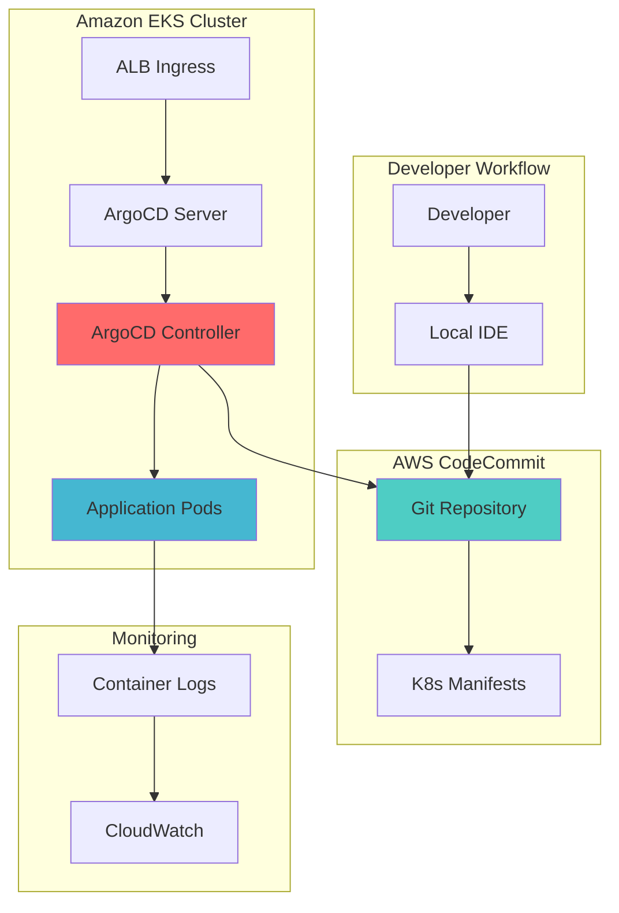

# GitOps for EKS with ArgoCD

## Problem

Traditional DevOps pipelines require manual intervention for deployments, creating security risks through direct cluster access and making it difficult to maintain configuration consistency across environments. Development teams struggle with deployment tracking, rollback complexity, and maintaining secure, auditable deployment processes while ensuring application configurations remain synchronized with desired state.

## Solution

GitOps revolutionizes deployment workflows by treating Git repositories as the single source of truth for infrastructure and application configurations. This recipe implements a complete GitOps workflow using Amazon EKS for container orchestration, ArgoCD for automated deployment synchronization, and AWS CodeCommit for secure Git repository management, enabling declarative, auditable, and automated deployments.

## Architecture Diagram



## Prerequisites

1. AWS account with EKS, CodeCommit, and IAM permissions
2. AWS CLI v2 installed and configured (or AWS CloudShell)
3. kubectl installed (version 1.24 or later)
4. eksctl installed (version 0.140.0 or later)
5. Helm CLI installed (version 3.8 or later)
6. Basic understanding of Kubernetes concepts and YAML manifests
7. Estimated cost: $0.10/hour for EKS control plane + $0.05/hour per worker node

> **Note**: EKS clusters incur charges for the control plane even when no workloads are running. Plan accordingly for cost management.

## Preparation

```bash
# Set environment variables
export AWS_REGION=$(aws configure get region)
export AWS_ACCOUNT_ID=$(aws sts get-caller-identity \
    --query Account --output text)

# Generate unique identifiers for resources
RANDOM_SUFFIX=$(aws secretsmanager get-random-password \
    --exclude-punctuation --exclude-uppercase \
    --password-length 6 --require-each-included-type \
    --output text --query RandomPassword)

export CLUSTER_NAME="gitops-cluster-${RANDOM_SUFFIX}"
export REPO_NAME="gitops-config-${RANDOM_SUFFIX}"
export NAMESPACE="argocd"

# Verify prerequisites
kubectl version --client --short
eksctl version
helm version --short

echo "✅ Environment prepared for GitOps workflow setup"
```

## Steps

1. **Create EKS Cluster with GitOps-Ready Configuration**:

   Amazon EKS provides a managed Kubernetes control plane that eliminates the operational overhead of running Kubernetes masters. For GitOps workflows, EKS serves as the target environment where ArgoCD will deploy and manage applications based on Git repository state. The managed nature of EKS ensures high availability and automatic scaling of the Kubernetes API server.

   ```bash
   # Create EKS cluster with managed node group
   eksctl create cluster \
       --name ${CLUSTER_NAME} \
       --region ${AWS_REGION} \
       --nodegroup-name workers \
       --node-type t3.medium \
       --nodes 2 \
       --nodes-min 1 \
       --nodes-max 4 \
       --managed
   
   # Verify cluster is ready
   kubectl get nodes
   
   echo "✅ EKS cluster ${CLUSTER_NAME} created successfully"
   ```

   The EKS cluster is now operational with managed worker nodes that provide the compute foundation for our GitOps workflow. This establishes the Kubernetes environment where ArgoCD will orchestrate deployments and maintain desired application state.

2. **Create CodeCommit Repository for GitOps Configuration**:

   AWS CodeCommit provides enterprise-grade Git hosting with built-in security, encryption, and access controls. In GitOps workflows, the Git repository serves as the authoritative source of truth for all infrastructure and application configurations. CodeCommit's integration with IAM enables fine-grained access control and audit trails for configuration changes.

   ```bash
   # Create CodeCommit repository
   aws codecommit create-repository \
       --repository-name ${REPO_NAME} \
       --repository-description "GitOps configuration repository for EKS deployments"
   
   # Get repository clone URL
   REPO_URL=$(aws codecommit get-repository \
       --repository-name ${REPO_NAME} \
       --query 'repositoryMetadata.cloneUrlHttp' \
       --output text)
   
   echo "✅ CodeCommit repository created: ${REPO_URL}"
   ```

   The Git repository is now established as the central configuration store. All subsequent application and infrastructure changes will flow through this repository, enabling version control, change approval processes, and automated deployment triggers.

3. **Install ArgoCD on EKS Cluster**:

   ArgoCD is a declarative GitOps continuous delivery tool that monitors Git repositories and automatically synchronizes Kubernetes cluster state with the desired configuration. Installing ArgoCD creates the control plane components responsible for detecting configuration drift and maintaining the desired state defined in Git.

   ```bash
   # Create ArgoCD namespace
   kubectl create namespace ${NAMESPACE}
   
   # Install ArgoCD using official manifests
   kubectl apply -n ${NAMESPACE} -f \
       https://raw.githubusercontent.com/argoproj/argo-cd/stable/manifests/install.yaml
   
   # Wait for ArgoCD components to be ready
   kubectl wait --for=condition=ready pod \
       -l app.kubernetes.io/name=argocd-server \
       -n ${NAMESPACE} --timeout=300s
   
   echo "✅ ArgoCD installed and running in ${NAMESPACE} namespace"
   ```

   ArgoCD is now operational within the EKS cluster, providing the GitOps engine that will continuously monitor the CodeCommit repository and ensure cluster state matches the desired configuration. The ArgoCD server provides a web UI and API for managing applications and deployments.

4. **Configure ArgoCD Server Access with Application Load Balancer**:

   Exposing ArgoCD through an Application Load Balancer provides secure, scalable access to the ArgoCD web interface and API. ALB integration with EKS enables SSL termination, path-based routing, and integration with AWS security services for enterprise-grade access control.

   ```bash
   # Download latest AWS Load Balancer Controller IAM policy
   curl -O https://raw.githubusercontent.com/kubernetes-sigs/aws-load-balancer-controller/v2.13.3/docs/install/iam_policy.json
   
   # Create IAM policy for Load Balancer Controller
   aws iam create-policy \
       --policy-name AWSLoadBalancerControllerIAMPolicy \
       --policy-document file://iam_policy.json
   
   # Create service account for ALB controller
   eksctl create iamserviceaccount \
       --cluster=${CLUSTER_NAME} \
       --namespace=kube-system \
       --name=aws-load-balancer-controller \
       --role-name=AmazonEKSLoadBalancerControllerRole \
       --attach-policy-arn=arn:aws:iam::${AWS_ACCOUNT_ID}:policy/AWSLoadBalancerControllerIAMPolicy \
       --approve
   
   # Install ALB controller using Helm
   helm repo add eks https://aws.github.io/eks-charts
   helm repo update
   
   helm install aws-load-balancer-controller eks/aws-load-balancer-controller \
       -n kube-system \
       --set clusterName=${CLUSTER_NAME} \
       --set serviceAccount.create=false \
       --set serviceAccount.name=aws-load-balancer-controller
   
   echo "✅ AWS Load Balancer Controller installed"
   ```

   The Application Load Balancer Controller is now configured to automatically provision AWS ALBs for Kubernetes Ingress resources. This enables external access to ArgoCD while leveraging AWS native load balancing capabilities.

5. **Create Ingress for ArgoCD Server Access**:

   Kubernetes Ingress resources define how external traffic reaches services within the cluster. Creating an Ingress for ArgoCD establishes the external endpoint that development teams will use to access the GitOps dashboard and manage application deployments.

   ```bash
   # Create ArgoCD Ingress manifest
   cat > argocd-ingress.yaml << EOF
   apiVersion: networking.k8s.io/v1
   kind: Ingress
   metadata:
     name: argocd-server-ingress
     namespace: ${NAMESPACE}
     annotations:
       alb.ingress.kubernetes.io/scheme: internet-facing
       alb.ingress.kubernetes.io/target-type: ip
       alb.ingress.kubernetes.io/listen-ports: '[{"HTTP": 80}, {"HTTPS": 443}]'
       alb.ingress.kubernetes.io/ssl-redirect: '443'
       alb.ingress.kubernetes.io/backend-protocol: HTTPS
   spec:
     rules:
     - http:
         paths:
         - path: /
           pathType: Prefix
           backend:
             service:
               name: argocd-server
               port:
                 number: 443
   EOF
   
   # Apply the Ingress
   kubectl apply -f argocd-ingress.yaml
   
   # Wait for ALB to be provisioned
   sleep 90
   ALB_HOSTNAME=$(kubectl get ingress argocd-server-ingress \
       -n ${NAMESPACE} \
       -o jsonpath='{.status.loadBalancer.ingress[0].hostname}')
   
   echo "✅ ArgoCD accessible at: https://${ALB_HOSTNAME}"
   ```

   ArgoCD is now accessible through a public endpoint, enabling teams to monitor deployments, view application health, and manage GitOps workflows through the web interface. The ALB provides SSL termination and high availability access.

6. **Get ArgoCD Admin Password and Test Access**:

   ArgoCD generates a random admin password during installation for security. Retrieving this password enables initial access to configure repositories, applications, and RBAC policies. Proper credential management is essential for maintaining secure GitOps workflows.

   ```bash
   # Get ArgoCD admin password
   ARGOCD_PASSWORD=$(kubectl get secret argocd-initial-admin-secret \
       -n ${NAMESPACE} \
       -o jsonpath='{.data.password}' | base64 -d)
   
   echo "ArgoCD Admin Credentials:"
   echo "Username: admin"
   echo "Password: ${ARGOCD_PASSWORD}"
   echo "URL: https://${ALB_HOSTNAME}"
   
   # Test ArgoCD API access (wait for ALB to be ready)
   sleep 60
   curl -k -X POST https://${ALB_HOSTNAME}/api/v1/session \
       -d '{"username":"admin","password":"'${ARGOCD_PASSWORD}'"}' \
       -H "Content-Type: application/json"
   
   echo "✅ ArgoCD authentication verified"
   ```

   Administrative access to ArgoCD is now confirmed, providing the foundation for configuring GitOps workflows. The admin credentials enable initial setup of repositories, applications, and security policies.

7. **Clone and Initialize GitOps Repository Structure**:

   A well-structured GitOps repository organizes Kubernetes manifests in a way that supports multiple environments, applications, and deployment strategies. Creating this structure establishes the foundation for scalable configuration management and promotes consistency across deployments.

   ```bash
   # Clone the CodeCommit repository
   git clone ${REPO_URL} gitops-repo
   cd gitops-repo
   
   # Configure Git credentials
   git config user.name "GitOps Admin"
   git config user.email "admin@example.com"
   
   # Create GitOps directory structure
   mkdir -p {applications,environments}/{development,staging,production}
   mkdir -p manifests/base
   
   # Create initial application manifest
   cat > applications/development/sample-app.yaml << EOF
   apiVersion: argoproj.io/v1alpha1
   kind: Application
   metadata:
     name: sample-app
     namespace: ${NAMESPACE}
   spec:
     project: default
     source:
       repoURL: ${REPO_URL}
       targetRevision: HEAD
       path: manifests/base
     destination:
       server: https://kubernetes.default.svc
       namespace: default
     syncPolicy:
       automated:
         prune: true
         selfHeal: true
   EOF
   
   echo "✅ GitOps repository structure created"
   ```

   The repository now contains a structured layout that separates applications by environment and provides a foundation for managing complex deployment scenarios. This organization supports the GitOps principle of declarative configuration management.

8. **Create Sample Application Manifests**:

   Sample Kubernetes manifests demonstrate how applications are defined and managed in GitOps workflows. These manifests serve as templates that teams can modify for their specific applications while maintaining consistency with organizational standards and best practices.

   ```bash
   # Create base application manifests
   cat > manifests/base/deployment.yaml << EOF
   apiVersion: apps/v1
   kind: Deployment
   metadata:
     name: sample-app
     labels:
       app: sample-app
   spec:
     replicas: 2
     selector:
       matchLabels:
         app: sample-app
     template:
       metadata:
         labels:
           app: sample-app
       spec:
         containers:
         - name: nginx
           image: nginx:1.25
           ports:
           - containerPort: 80
           resources:
             requests:
               memory: "64Mi"
               cpu: "250m"
             limits:
               memory: "128Mi"
               cpu: "500m"
   EOF
   
   cat > manifests/base/service.yaml << EOF
   apiVersion: v1
   kind: Service
   metadata:
     name: sample-app-service
   spec:
     selector:
       app: sample-app
     ports:
       - protocol: TCP
         port: 80
         targetPort: 80
     type: ClusterIP
   EOF
   
   # Create Kustomization file
   cat > manifests/base/kustomization.yaml << EOF
   apiVersion: kustomize.config.k8s.io/v1beta1
   kind: Kustomization
   
   resources:
     - deployment.yaml
     - service.yaml
   EOF
   
   echo "✅ Sample application manifests created"
   ```

   The application manifests now define a complete deployment including compute resources, networking, and resource management. These manifests demonstrate best practices for containerized applications and provide a template for production workloads.

9. **Commit and Push GitOps Configuration**:

   Committing configuration to Git triggers the GitOps workflow, making the desired state available for ArgoCD to detect and synchronize. This step demonstrates the fundamental GitOps principle where Git commits drive infrastructure and application changes rather than manual deployments.

   ```bash
   # Add all files to Git
   git add .
   
   # Create initial commit with proper format
   git commit -m "Initial GitOps configuration with sample application

- ArgoCD application definition for development environment
- Sample NGINX deployment with resource limits
- Service configuration for internal access
- Kustomization structure for configuration management"
   
   # Push to CodeCommit
   git push origin main
   
   echo "✅ GitOps configuration committed and pushed to CodeCommit"
   ```

   The GitOps repository now contains the complete configuration for managing applications through ArgoCD. Any future changes to applications will follow this same Git-based workflow, ensuring version control and audit trails for all deployments.

10. **Configure ArgoCD Repository Connection**:

    Connecting ArgoCD to the CodeCommit repository enables continuous monitoring and synchronization of the desired state. This connection establishes the critical link between Git-based configuration management and automated deployment execution in the Kubernetes cluster.

    ```bash
    # Configure ArgoCD for insecure mode (for demo purposes)
    kubectl patch configmap argocd-cmd-params-cm \
        -n ${NAMESPACE} \
        --type merge \
        -p '{"data":{"server.insecure":"true"}}'
    
    # Restart ArgoCD server to apply changes
    kubectl rollout restart deployment argocd-server -n ${NAMESPACE}
    kubectl wait --for=condition=ready pod \
        -l app.kubernetes.io/name=argocd-server \
        -n ${NAMESPACE} --timeout=300s
    
    # Install ArgoCD CLI (if not already installed)
    curl -sSL -o argocd-linux-amd64 \
        https://github.com/argoproj/argo-cd/releases/latest/download/argocd-linux-amd64
    sudo install -m 555 argocd-linux-amd64 /usr/local/bin/argocd
    rm argocd-linux-amd64
    
    # Login to ArgoCD and add repository
    argocd login ${ALB_HOSTNAME} --username admin \
        --password ${ARGOCD_PASSWORD} --insecure
    
    argocd repo add ${REPO_URL} --type git \
        --name gitops-config-repo
    
    echo "✅ CodeCommit repository connected to ArgoCD"
    ```

    ArgoCD is now configured to monitor the CodeCommit repository for changes and automatically synchronize the cluster state with the desired configuration. This establishes the continuous deployment pipeline driven by Git commits.

11. **Deploy Sample Application via ArgoCD**:

    Creating an ArgoCD application establishes automated deployment and lifecycle management for Kubernetes workloads. This demonstrates the GitOps workflow where application definitions in Git automatically trigger deployment, scaling, and management operations in the target cluster.

    ```bash
    # Apply the ArgoCD application manifest
    kubectl apply -f applications/development/sample-app.yaml
    
    # Wait for application to sync
    sleep 60
    
    # Check application status
    kubectl get applications -n ${NAMESPACE}
    
    # Verify application deployment
    kubectl get pods -l app=sample-app
    kubectl get service sample-app-service
    
    echo "✅ Sample application deployed via GitOps workflow"
    ```

    The sample application is now deployed and managed by ArgoCD, demonstrating the complete GitOps workflow from Git commit to running application. ArgoCD will continuously monitor for changes and maintain the desired state automatically.

> **Warning**: Ensure proper IAM permissions are configured for CodeCommit access to avoid authentication failures during Git operations.

> **Tip**: Use ArgoCD's sync waves and hooks to control deployment order and implement advanced deployment strategies like blue-green or canary deployments.

## Validation & Testing

1. **Verify EKS cluster and ArgoCD health**:

   ```bash
   # Check cluster nodes
   kubectl get nodes
   
   # Verify ArgoCD components
   kubectl get pods -n ${NAMESPACE}
   ```

   Expected output: All nodes should show "Ready" status and ArgoCD pods should be "Running"

2. **Test GitOps workflow with configuration change**:

   ```bash
   # Modify application configuration
   cd gitops-repo
   sed -i 's/replicas: 2/replicas: 3/' manifests/base/deployment.yaml
   
   # Commit and push changes
   git add manifests/base/deployment.yaml
   git commit -m "Scale sample application to 3 replicas"
   git push origin main
   
   # Wait for ArgoCD to detect and sync changes
   sleep 90
   kubectl get pods -l app=sample-app
   ```

   Expected output: Should show 3 running pods for the sample application

3. **Verify ArgoCD web interface access**:

   ```bash
   echo "Access ArgoCD at: https://${ALB_HOSTNAME}"
   echo "Username: admin"
   echo "Password: ${ARGOCD_PASSWORD}"
   ```

   Expected result: ArgoCD dashboard should be accessible and show the deployed application

## Cleanup

1. **Delete ArgoCD applications**:

   ```bash
   kubectl delete application sample-app -n ${NAMESPACE}
   
   echo "✅ ArgoCD applications deleted"
   ```

2. **Remove Ingress and Load Balancer Controller**:

   ```bash
   kubectl delete -f argocd-ingress.yaml
   helm uninstall aws-load-balancer-controller -n kube-system
   
   echo "✅ Ingress and ALB controller removed"
   ```

3. **Delete ArgoCD installation**:

   ```bash
   kubectl delete namespace ${NAMESPACE}
   
   echo "✅ ArgoCD namespace and components deleted"
   ```

4. **Delete EKS cluster**:

   ```bash
   eksctl delete cluster --name ${CLUSTER_NAME} --region ${AWS_REGION}
   
   echo "✅ EKS cluster deleted"
   ```

5. **Remove CodeCommit repository**:

   ```bash
   aws codecommit delete-repository --repository-name ${REPO_NAME}
   
   echo "✅ CodeCommit repository deleted"
   ```

6. **Clean up IAM resources and local files**:

   ```bash
   # Delete IAM policy
   aws iam delete-policy \
       --policy-arn arn:aws:iam::${AWS_ACCOUNT_ID}:policy/AWSLoadBalancerControllerIAMPolicy
   
   # Clean up local files
   cd ..
   rm -rf gitops-repo argocd-ingress.yaml iam_policy.json
   
   echo "✅ All resources and local files cleaned up"
   ```

## Discussion

GitOps represents a paradigm shift in how organizations approach continuous deployment and infrastructure management. By treating Git repositories as the single source of truth, teams gain unprecedented visibility into configuration changes, deployment history, and system state. This recipe demonstrates the fundamental GitOps principles using enterprise-grade AWS services that provide the security, scalability, and reliability required for production workloads.

The combination of Amazon EKS, ArgoCD, and AWS CodeCommit creates a robust GitOps platform that addresses common DevOps challenges. EKS eliminates the operational overhead of managing Kubernetes control planes while providing seamless integration with AWS security and networking services. ArgoCD provides the GitOps engine that continuously monitors Git repositories and maintains cluster state, while CodeCommit offers enterprise-grade Git hosting with built-in security and compliance features. This implementation follows AWS Well-Architected Framework principles for operational excellence, security, and reliability.

Key architectural benefits include declarative configuration management, automated drift detection and remediation, complete audit trails for all changes, and simplified rollback capabilities. The pull-based deployment model enhances security by eliminating the need for external systems to have direct cluster access, while Git-based workflows enable familiar collaboration patterns for infrastructure and application teams. This approach significantly reduces deployment risks and enables faster, more reliable software delivery.

This implementation supports advanced deployment strategies including blue-green deployments, canary releases, and progressive delivery through ArgoCD's sophisticated synchronization policies and health checks. Organizations can extend this foundation to support multi-cluster deployments, environment promotion pipelines, and policy-as-code governance frameworks using tools like Open Policy Agent (OPA) Gatekeeper for additional security and compliance enforcement.

> **Note**: Consider implementing ArgoCD Projects and RBAC policies to provide multi-tenant access control and resource isolation for enterprise environments. See [ArgoCD RBAC Documentation](https://argo-cd.readthedocs.io/en/stable/operator-manual/rbac/) and [AWS EKS Best Practices](https://aws.github.io/aws-eks-best-practices/) for detailed configuration guidance.

## Challenge

Extend this GitOps implementation with these advanced capabilities:

1. **Multi-Environment Promotion Pipeline**: Implement automatic promotion of applications from development to staging to production environments using ArgoCD sync waves and approval workflows
2. **Policy-as-Code Integration**: Add Open Policy Agent (OPA) Gatekeeper to enforce security and compliance policies on Kubernetes manifests before deployment
3. **Advanced Monitoring and Alerting**: Integrate Prometheus and Grafana for comprehensive GitOps workflow monitoring, including deployment metrics, sync status, and application health dashboards
4. **Multi-Cluster GitOps**: Configure ArgoCD to manage applications across multiple EKS clusters in different AWS regions for disaster recovery and geographic distribution
5. **Secret Management Integration**: Implement AWS Secrets Manager or External Secrets Operator integration to securely manage application secrets in GitOps workflows

## Infrastructure Code

*Infrastructure code will be generated after recipe approval.*