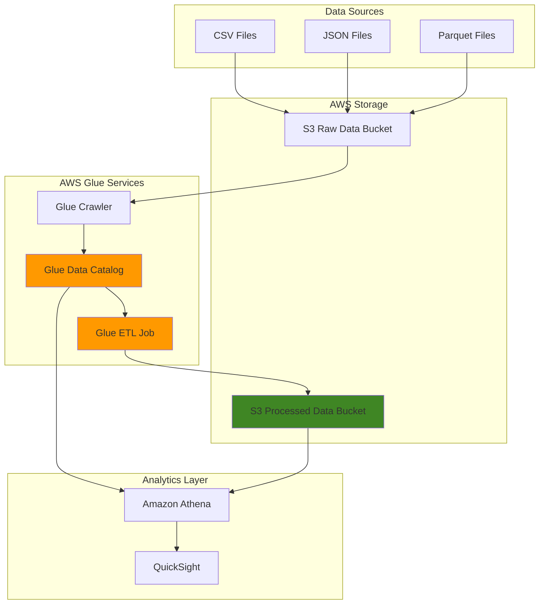

# ETL Pipelines with Glue Data Catalog

## Problem

Organizations struggle with complex data transformation workflows that require manual coding, infrastructure management, and catalog maintenance across multiple data sources. Traditional ETL solutions demand significant engineering resources to build, deploy, and scale data pipelines while maintaining data lineage and metadata governance. Without proper data cataloging, teams waste time discovering, understanding, and trusting data assets across the enterprise.

## Solution

AWS Glue provides a fully managed serverless ETL service that automatically discovers, catalogs, and transforms data without infrastructure management. The Glue Data Catalog acts as a centralized metadata repository that enables automatic schema detection and provides a unified view of data assets. This solution combines Glue's visual ETL capabilities with automated cataloging to create scalable data pipelines that maintain data lineage and enable self-service analytics.

## Architecture Diagram



## Prerequisites

1. AWS account with permissions for Glue, S3, IAM, and Athena services
2. AWS CLI v2 installed and configured (or AWS CloudShell)
3. Basic understanding of ETL concepts and data formats (CSV, JSON, Parquet)
4. Familiarity with SQL querying and data analysis concepts
5. Estimated cost: $5-15 for running crawlers, jobs, and storage during testing

## Preparation

```bash
# Set environment variables
export AWS_REGION=$(aws configure get region)
export AWS_ACCOUNT_ID=$(aws sts get-caller-identity \
    --query Account --output text)

# Generate unique identifiers for resources
RANDOM_SUFFIX=$(aws secretsmanager get-random-password \
    --exclude-punctuation --exclude-uppercase \
    --password-length 6 --require-each-included-type \
    --output text --query RandomPassword)

export GLUE_DATABASE_NAME="analytics-database-${RANDOM_SUFFIX}"
export S3_RAW_BUCKET="raw-data-${RANDOM_SUFFIX}"
export S3_PROCESSED_BUCKET="processed-data-${RANDOM_SUFFIX}"
export GLUE_ROLE_NAME="GlueServiceRole-${RANDOM_SUFFIX}"
export CRAWLER_NAME="data-discovery-crawler-${RANDOM_SUFFIX}"
export JOB_NAME="etl-transformation-job-${RANDOM_SUFFIX}"

echo "✅ Environment variables configured"
echo "Database: ${GLUE_DATABASE_NAME}"
echo "Raw bucket: ${S3_RAW_BUCKET}"
echo "Processed bucket: ${S3_PROCESSED_BUCKET}"
```

## Steps

1. **Create S3 Buckets for Data Storage**:

   S3 provides the foundational storage layer for our data lake architecture with 99.999999999% durability. Creating separate buckets for raw and processed data establishes clear data lifecycle stages and enables proper access controls and lifecycle policies for cost optimization.

   ```bash
   # Create bucket for raw incoming data
   aws s3 mb s3://${S3_RAW_BUCKET} --region ${AWS_REGION}
   
   # Create bucket for processed/transformed data
   aws s3 mb s3://${S3_PROCESSED_BUCKET} --region ${AWS_REGION}
   
   echo "✅ S3 buckets created successfully"
   echo "Raw data bucket: s3://${S3_RAW_BUCKET}"
   echo "Processed data bucket: s3://${S3_PROCESSED_BUCKET}"
   ```

   The storage infrastructure is now established with clear separation between raw and processed data, enabling proper data governance and lifecycle management throughout the ETL pipeline.

2. **Create IAM Service Role for AWS Glue**:

   AWS Glue requires specific IAM permissions to access S3 buckets, write CloudWatch logs, and manage Data Catalog operations. The service role implements least-privilege access, ensuring Glue can perform necessary operations without excessive permissions that could compromise security.

   ```bash
   # Create trust policy for Glue service
   cat > glue-trust-policy.json << EOF
   {
     "Version": "2012-10-17",
     "Statement": [
       {
         "Effect": "Allow",
         "Principal": {
           "Service": "glue.amazonaws.com"
         },
         "Action": "sts:AssumeRole"
       }
     ]
   }
   EOF
   
   # Create the IAM role
   aws iam create-role \
       --role-name ${GLUE_ROLE_NAME} \
       --assume-role-policy-document file://glue-trust-policy.json
   
   # Attach AWS managed policy for Glue service
   aws iam attach-role-policy \
       --role-name ${GLUE_ROLE_NAME} \
       --policy-arn arn:aws:iam::aws:policy/service-role/AWSGlueServiceRole
   
   # Create custom policy for S3 access
   cat > glue-s3-policy.json << EOF
   {
     "Version": "2012-10-17",
     "Statement": [
       {
         "Effect": "Allow",
         "Action": [
           "s3:GetObject",
           "s3:PutObject",
           "s3:DeleteObject"
         ],
         "Resource": [
           "arn:aws:s3:::${S3_RAW_BUCKET}/*",
           "arn:aws:s3:::${S3_PROCESSED_BUCKET}/*"
         ]
       },
       {
         "Effect": "Allow",
         "Action": [
           "s3:ListBucket"
         ],
         "Resource": [
           "arn:aws:s3:::${S3_RAW_BUCKET}",
           "arn:aws:s3:::${S3_PROCESSED_BUCKET}"
         ]
       }
     ]
   }
   EOF
   
   # Attach custom S3 policy
   aws iam put-role-policy \
       --role-name ${GLUE_ROLE_NAME} \
       --policy-name GlueS3Access \
       --policy-document file://glue-s3-policy.json
   
   # Get role ARN for later use
   GLUE_ROLE_ARN=$(aws iam get-role \
       --role-name ${GLUE_ROLE_NAME} \
       --query Role.Arn --output text)
   
   echo "✅ IAM role created: ${GLUE_ROLE_ARN}"
   ```

   The IAM role is now configured with appropriate permissions for Glue to access our S3 buckets and perform ETL operations securely. This role enables the principle of least privilege while providing necessary access for data processing workflows.

3. **Create Glue Database for Data Catalog**:

   The Glue Data Catalog database serves as a logical container for table metadata and schema definitions. This centralized catalog enables consistent data discovery across teams and provides the foundation for schema evolution tracking and data lineage management.

   ```bash
   # Create Glue database
   aws glue create-database \
       --database-input Name=${GLUE_DATABASE_NAME},Description="Analytics database for ETL pipeline"
   
   echo "✅ Glue database created: ${GLUE_DATABASE_NAME}"
   ```

   The database is now ready to store table definitions and metadata discovered by crawlers. This catalog will serve as the single source of truth for data schema information across the organization.

4. **Upload Sample Data for Processing**:

   Sample data provides the foundation for demonstrating ETL capabilities and testing pipeline functionality. Using diverse data formats (CSV, JSON) showcases Glue's ability to handle heterogeneous data sources commonly found in enterprise environments.

   ```bash
   # Create sample CSV data
   cat > sample-sales.csv << EOF
   order_id,customer_id,product_name,quantity,price,order_date
   1001,C001,Laptop,1,999.99,2024-01-15
   1002,C002,Mouse,2,25.50,2024-01-15
   1003,C001,Keyboard,1,75.00,2024-01-16
   1004,C003,Monitor,1,299.99,2024-01-16
   1005,C002,Headphones,1,149.99,2024-01-17
   EOF
   
   # Create sample JSON data
   cat > sample-customers.json << EOF
   {"customer_id": "C001", "name": "John Smith", "email": "john@email.com", "region": "North"}
   {"customer_id": "C002", "name": "Jane Doe", "email": "jane@email.com", "region": "South"}
   {"customer_id": "C003", "name": "Bob Johnson", "email": "bob@email.com", "region": "East"}
   EOF
   
   # Upload data to S3
   aws s3 cp sample-sales.csv s3://${S3_RAW_BUCKET}/sales/
   aws s3 cp sample-customers.json s3://${S3_RAW_BUCKET}/customers/
   
   echo "✅ Sample data uploaded to S3"
   ```

   The sample datasets are now available in S3 and represent typical business data that requires transformation and analysis. These files will be discovered by the Glue crawler and used to demonstrate ETL processing capabilities.

5. **Create and Run Glue Crawler for Data Discovery**:

   Glue crawlers automatically discover data schemas, infer data types, and populate the Data Catalog with table definitions. This automation eliminates manual schema definition work and ensures the catalog stays synchronized with actual data structures as they evolve over time.

   ```bash
   # Create Glue crawler
   aws glue create-crawler \
       --name ${CRAWLER_NAME} \
       --role ${GLUE_ROLE_ARN} \
       --database-name ${GLUE_DATABASE_NAME} \
       --targets S3Targets="[{Path=s3://${S3_RAW_BUCKET}/}]" \
       --description "Crawler to discover raw data schemas"
   
   # Start the crawler
   aws glue start-crawler --name ${CRAWLER_NAME}
   
   echo "✅ Glue crawler created and started: ${CRAWLER_NAME}"
   echo "Crawler is running... This may take 2-3 minutes"
   ```

   The crawler is now analyzing the data in S3 and will automatically create table definitions in the Data Catalog. This process discovers schema information and makes the data queryable through services like Athena.

> **Note**: Crawlers typically take 2-5 minutes to complete depending on data volume and complexity. Monitor crawler status in the AWS Glue console or use `aws glue get-crawler --name ${CRAWLER_NAME}` to check progress.

6. **Wait for Crawler Completion and Verify Tables**:

   Monitoring crawler completion ensures the Data Catalog is properly populated before proceeding with ETL job creation. Successful table creation validates that schemas were correctly inferred and that data is accessible for transformation workflows.

   ```bash
   # Wait for crawler to complete
   echo "Waiting for crawler to complete..."
   while true; do
       CRAWLER_STATE=$(aws glue get-crawler \
           --name ${CRAWLER_NAME} \
           --query Crawler.State --output text)
       
       if [ "$CRAWLER_STATE" = "READY" ]; then
           echo "✅ Crawler completed successfully"
           break
       elif [ "$CRAWLER_STATE" = "STOPPING" ] || [ "$CRAWLER_STATE" = "RUNNING" ]; then
           echo "Crawler status: $CRAWLER_STATE - waiting..."
           sleep 30
       else
           echo "❌ Crawler failed with state: $CRAWLER_STATE"
           exit 1
       fi
   done
   
   # List discovered tables
   aws glue get-tables \
       --database-name ${GLUE_DATABASE_NAME} \
       --query 'TableList[].Name' --output table
   
   echo "✅ Tables discovered and cataloged"
   ```

   The Data Catalog now contains table definitions for our datasets, enabling SQL-based querying and providing metadata for ETL job development. The discovered schemas serve as the foundation for data transformation logic.

7. **Create ETL Job Script for Data Transformation**:

   Glue ETL jobs use Apache Spark to process data at scale with automatic resource management. The job script defines transformation logic that joins datasets, cleanses data, and outputs results in optimized formats for analytics workloads.

   ```bash
   # Create ETL job script
   cat > etl-script.py << 'EOF'
   import sys
   from awsglue.transforms import *
   from awsglue.utils import getResolvedOptions
   from pyspark.context import SparkContext
   from awsglue.context import GlueContext
   from awsglue.job import Job
   from awsglue.dynamicframe import DynamicFrame
   
   args = getResolvedOptions(sys.argv, ['JOB_NAME', 'DATABASE_NAME', 'OUTPUT_BUCKET'])
   
   sc = SparkContext()
   glueContext = GlueContext(sc)
   spark = glueContext.spark_session
   job = Job(glueContext)
   job.init(args['JOB_NAME'], args)
   
   # Read sales data from catalog
   sales_dynamic_frame = glueContext.create_dynamic_frame.from_catalog(
       database = args['DATABASE_NAME'],
       table_name = "sales"
   )
   
   # Read customer data from catalog
   customers_dynamic_frame = glueContext.create_dynamic_frame.from_catalog(
       database = args['DATABASE_NAME'],
       table_name = "customers"
   )
   
   # Convert to DataFrames for joins
   sales_df = sales_dynamic_frame.toDF()
   customers_df = customers_dynamic_frame.toDF()
   
   # Join sales with customer data
   enriched_sales = sales_df.join(customers_df, "customer_id", "left")
   
   # Calculate total amount per order
   from pyspark.sql.functions import col
   enriched_sales = enriched_sales.withColumn("total_amount", 
                                            col("quantity") * col("price"))
   
   # Convert back to DynamicFrame
   enriched_dynamic_frame = DynamicFrame.fromDF(enriched_sales, glueContext, "enriched_sales")
   
   # Write to S3 in Parquet format
   glueContext.write_dynamic_frame.from_options(
       frame = enriched_dynamic_frame,
       connection_type = "s3",
       connection_options = {"path": f"s3://{args['OUTPUT_BUCKET']}/enriched-sales/"},
       format = "parquet"
   )
   
   job.commit()
   EOF
   
   # Upload script to S3
   aws s3 cp etl-script.py s3://${S3_PROCESSED_BUCKET}/scripts/
   
   echo "✅ ETL script created and uploaded"
   ```

   The ETL script implements a common data enrichment pattern that joins sales transactions with customer information and calculates derived metrics. This demonstrates how Glue jobs can transform raw data into analytics-ready datasets.

8. **Create and Execute Glue ETL Job**:

   Glue ETL jobs provide serverless data processing with automatic scaling and resource optimization. Creating the job establishes the transformation workflow that can be scheduled, monitored, and reused for ongoing data processing requirements.

   ```bash
   # Create Glue ETL job
   aws glue create-job \
       --name ${JOB_NAME} \
       --role ${GLUE_ROLE_ARN} \
       --command '{
           "Name": "glueetl",
           "ScriptLocation": "s3://'${S3_PROCESSED_BUCKET}'/scripts/etl-script.py",
           "PythonVersion": "3"
       }' \
       --default-arguments '{
           "--job-language": "python",
           "--DATABASE_NAME": "'${GLUE_DATABASE_NAME}'",
           "--OUTPUT_BUCKET": "'${S3_PROCESSED_BUCKET}'"
       }' \
       --max-retries 1 \
       --timeout 60 \
       --glue-version "4.0" \
       --worker-type "G.1X" \
       --number-of-workers 2
   
   # Start the ETL job
   JOB_RUN_ID=$(aws glue start-job-run \
       --job-name ${JOB_NAME} \
       --query JobRunId --output text)
   
   echo "✅ ETL job created and started"
   echo "Job run ID: ${JOB_RUN_ID}"
   echo "Job is processing... This may take 3-5 minutes"
   ```

   The ETL job is now processing data using Spark's distributed computing capabilities. Glue automatically provisions resources, executes the transformation logic, and scales based on data volume requirements.

9. **Monitor Job Execution and Verify Results**:

   Monitoring job execution ensures successful completion and helps identify any issues with data processing logic. Successful job completion indicates that transformed data is available for analytics and downstream consumption.

   ```bash
   # Wait for job completion
   echo "Monitoring job execution..."
   while true; do
       JOB_STATE=$(aws glue get-job-run \
           --job-name ${JOB_NAME} \
           --run-id ${JOB_RUN_ID} \
           --query JobRun.JobRunState --output text)
       
       if [ "$JOB_STATE" = "SUCCEEDED" ]; then
           echo "✅ ETL job completed successfully"
           break
       elif [ "$JOB_STATE" = "RUNNING" ]; then
           echo "Job status: $JOB_STATE - waiting..."
           sleep 30
       elif [ "$JOB_STATE" = "FAILED" ]; then
           echo "❌ ETL job failed"
           aws glue get-job-run \
               --job-name ${JOB_NAME} \
               --run-id ${JOB_RUN_ID} \
               --query JobRun.ErrorMessage --output text
           exit 1
       else
           echo "Job status: $JOB_STATE - continuing to monitor..."
           sleep 30
       fi
   done
   
   # Verify output data
   aws s3 ls s3://${S3_PROCESSED_BUCKET}/enriched-sales/ --recursive
   
   echo "✅ Transformed data available in processed bucket"
   ```

   The ETL pipeline has successfully processed and transformed the raw data into an enriched dataset. The output files are now available in Parquet format, optimized for analytics queries and further processing.

> **Warning**: ETL jobs consume Glue DPU (Data Processing Units) which incur charges. Monitor job execution and ensure proper resource allocation to optimize costs while maintaining performance requirements.

10. **Create Crawler for Processed Data**:

    Creating a separate crawler for processed data ensures the Data Catalog reflects the transformed schema and makes the enriched datasets discoverable for analytics tools. This completes the data pipeline by making transformed data accessible through the catalog.

    ```bash
    # Create crawler for processed data
    PROCESSED_CRAWLER_NAME="processed-data-crawler-${RANDOM_SUFFIX}"
    
    aws glue create-crawler \
        --name ${PROCESSED_CRAWLER_NAME} \
        --role ${GLUE_ROLE_ARN} \
        --database-name ${GLUE_DATABASE_NAME} \
        --targets S3Targets="[{Path=s3://${S3_PROCESSED_BUCKET}/enriched-sales/}]" \
        --description "Crawler for processed/transformed data"
    
    # Run the crawler
    aws glue start-crawler --name ${PROCESSED_CRAWLER_NAME}
    
    # Wait for completion with proper monitoring
    echo "Crawling processed data..."
    while true; do
        PROCESSED_CRAWLER_STATE=$(aws glue get-crawler \
            --name ${PROCESSED_CRAWLER_NAME} \
            --query Crawler.State --output text)
        
        if [ "$PROCESSED_CRAWLER_STATE" = "READY" ]; then
            echo "✅ Processed data crawler completed successfully"
            break
        elif [ "$PROCESSED_CRAWLER_STATE" = "STOPPING" ] || [ "$PROCESSED_CRAWLER_STATE" = "RUNNING" ]; then
            echo "Processed crawler status: $PROCESSED_CRAWLER_STATE - waiting..."
            sleep 30
        else
            echo "❌ Processed crawler failed with state: $PROCESSED_CRAWLER_STATE"
            break
        fi
    done
    
    # Verify new table creation
    aws glue get-tables \
        --database-name ${GLUE_DATABASE_NAME} \
        --query 'TableList[].Name' --output table
    
    echo "✅ Processed data crawler completed and cataloged"
    ```

    The Data Catalog now contains both raw and processed table definitions, providing complete visibility into the data pipeline and enabling end-to-end data lineage tracking.

## Validation & Testing

1. **Verify Data Catalog Tables**:

   ```bash
   # List all tables in the database
   aws glue get-tables \
       --database-name ${GLUE_DATABASE_NAME} \
       --query 'TableList[].[Name,StorageDescriptor.Location]' \
       --output table
   ```

   Expected output: Tables for sales, customers, and enriched_sales with their S3 locations.

2. **Query Data Using Athena**:

   ```bash
   # Create Athena query to test data access
   QUERY_EXECUTION_ID=$(aws athena start-query-execution \
       --query-string "SELECT customer_id, product_name, total_amount FROM ${GLUE_DATABASE_NAME}.enriched_sales LIMIT 10" \
       --result-configuration OutputLocation=s3://${S3_PROCESSED_BUCKET}/athena-results/ \
       --work-group primary \
       --query QueryExecutionId --output text)
   
   echo "✅ Athena query started with ID: ${QUERY_EXECUTION_ID}"
   ```

3. **Verify ETL Job Logs**:

   ```bash
   # Check CloudWatch logs for job execution details
   aws logs describe-log-groups \
       --log-group-name-prefix "/aws-glue/jobs" \
       --query 'logGroups[].logGroupName' --output table
   ```

4. **Test Data Quality**:

   ```bash
   # Verify row counts match expected results
   aws s3 ls s3://${S3_PROCESSED_BUCKET}/enriched-sales/ \
       --recursive --summarize
   ```

## Cleanup

1. **Stop and Delete Crawlers**:

   ```bash
   # Stop crawlers if running
   aws glue stop-crawler --name ${CRAWLER_NAME} 2>/dev/null || true
   aws glue stop-crawler --name ${PROCESSED_CRAWLER_NAME} 2>/dev/null || true
   
   # Delete crawlers
   aws glue delete-crawler --name ${CRAWLER_NAME}
   aws glue delete-crawler --name ${PROCESSED_CRAWLER_NAME}
   
   echo "✅ Crawlers deleted"
   ```

2. **Delete Glue ETL Job**:

   ```bash
   # Delete ETL job
   aws glue delete-job --job-name ${JOB_NAME}
   
   echo "✅ ETL job deleted"
   ```

3. **Delete Glue Database and Tables**:

   ```bash
   # Delete database (this also removes all tables)
   aws glue delete-database --name ${GLUE_DATABASE_NAME}
   
   echo "✅ Glue database and tables deleted"
   ```

4. **Remove IAM Role and Policies**:

   ```bash
   # Detach policies and delete role
   aws iam detach-role-policy \
       --role-name ${GLUE_ROLE_NAME} \
       --policy-arn arn:aws:iam::aws:policy/service-role/AWSGlueServiceRole
   
   aws iam delete-role-policy \
       --role-name ${GLUE_ROLE_NAME} \
       --policy-name GlueS3Access
   
   aws iam delete-role --role-name ${GLUE_ROLE_NAME}
   
   echo "✅ IAM role deleted"
   ```

5. **Delete S3 Buckets and Contents**:

   ```bash
   # Empty and delete buckets
   aws s3 rm s3://${S3_RAW_BUCKET} --recursive
   aws s3 rm s3://${S3_PROCESSED_BUCKET} --recursive
   aws s3 rb s3://${S3_RAW_BUCKET}
   aws s3 rb s3://${S3_PROCESSED_BUCKET}
   
   # Clean up local files
   rm -f glue-trust-policy.json glue-s3-policy.json \
         etl-script.py sample-sales.csv sample-customers.json
   
   echo "✅ S3 buckets and local files deleted"
   ```

## Discussion

AWS Glue provides a powerful serverless ETL platform that eliminates infrastructure management while enabling scalable data processing workflows. The [Data Catalog](https://docs.aws.amazon.com/glue/latest/dg/populate-catalog-methods.html) serves as a centralized metadata repository that democratizes data discovery and enables self-service analytics across organizations. By automatically inferring schemas and tracking data lineage, Glue reduces the operational overhead typically associated with traditional ETL solutions.

The [crawler functionality](https://docs.aws.amazon.com/glue/latest/dg/add-crawler.html) represents a significant advancement in automated data discovery, continuously monitoring data sources and updating catalog information as schemas evolve. This automation ensures that downstream analytics tools always have access to current metadata without manual intervention. The serverless architecture allows data engineers to focus on transformation logic rather than infrastructure provisioning and maintenance.

Integration with the broader AWS analytics ecosystem provides seamless connectivity to services like Athena, QuickSight, and Redshift. This native integration enables organizations to build comprehensive data platforms without complex custom integrations. The [pay-per-use pricing model](https://docs.aws.amazon.com/glue/latest/dg/what-is-glue.html) makes Glue cost-effective for both small-scale and enterprise-level data processing requirements, scaling automatically based on workload demands.

Performance optimization features like columnar storage formats (Parquet), predicate pushdown, and partition pruning ensure efficient query execution even with large datasets. The service's built-in monitoring and logging capabilities provide operational visibility while CloudWatch integration enables proactive alerting and performance tuning. Following [AWS Glue Data Catalog best practices](https://docs.aws.amazon.com/glue/latest/dg/best-practice-catalog.html) ensures optimal performance and cost management throughout the data pipeline lifecycle.

> **Tip**: Use Glue's job bookmarking feature to process only new or changed data in incremental ETL workflows. This dramatically reduces processing time and costs for ongoing data pipelines. See [AWS Glue Job Bookmarks](https://docs.aws.amazon.com/glue/latest/dg/monitor-continuations.html) for implementation details.

## Challenge

Extend this solution by implementing these enhancements:

1. **Implement Data Quality Monitoring**: Add AWS Glue DataBrew for data profiling and quality rule enforcement, creating automated data validation workflows that flag anomalies and ensure data integrity throughout the pipeline.

2. **Add Incremental Processing**: Configure job bookmarking and partition-based processing to handle only new or modified data, reducing processing time and costs for large-scale production workloads.

3. **Create Data Lineage Visualization**: Integrate with AWS Lake Formation and implement custom metadata tracking to visualize end-to-end data lineage from source systems through transformations to final analytics destinations.

4. **Build Event-Driven Automation**: Use S3 event notifications with Lambda triggers to automatically start ETL jobs when new data arrives, creating a fully automated data processing pipeline that responds to data availability in real-time.

5. **Implement Cross-Region Replication**: Set up Glue jobs and crawlers in multiple regions with S3 cross-region replication to create a disaster recovery strategy for critical data processing workflows.

## Infrastructure Code

### Available Infrastructure as Code:

- [Infrastructure Code Overview](code/README.md) - Detailed description of all infrastructure components
- [AWS CDK (Python)](code/cdk-python/) - AWS CDK Python implementation
- [AWS CDK (TypeScript)](code/cdk-typescript/) - AWS CDK TypeScript implementation
- [CloudFormation](code/cloudformation.yaml) - AWS CloudFormation template
- [Bash CLI Scripts](code/scripts/) - Example bash scripts using AWS CLI commands to deploy infrastructure
- [Terraform](code/terraform/) - Terraform configuration files