# Governing Costs with Strategic Resource Tagging

## Problem

Organizations struggle with tracking and allocating cloud costs across different departments, projects, and environments, leading to budget overruns and lack of accountability. Without proper resource tagging strategies, finance teams cannot accurately chargeback costs to the appropriate business units, making it difficult to optimize spending and enforce cost governance across the organization.

## Solution

Implement a comprehensive resource tagging strategy using AWS cost allocation tags, automated tag enforcement with AWS Config rules, and cost reporting with AWS Cost Explorer. This solution establishes tag governance policies, automates tag compliance monitoring, and creates detailed cost allocation reports for accurate chargeback and budget management.

## Architecture Diagram

```mermaid
graph TB
    subgraph "Tagging Strategy"
        ORG[Organization Policy]
        TAGS[Tag Categories]
        GOV[Tag Governance]
    end
    
    subgraph "AWS Resources"
        EC2[EC2 Instances]
        S3[S3 Buckets] 
        RDS[RDS Databases]
        LAMBDA[Lambda Functions]
        OTHER[Other Resources]
    end
    
    subgraph "Tag Enforcement"
        CONFIG[AWS Config]
        RULES[Config Rules]
        SNS[SNS Notifications]
        LAMBDA_REMEDIATE[Remediation Lambda]
    end
    
    subgraph "Cost Management"
        BILLING[Billing Console]
        CE[Cost Explorer]
        BUDGETS[AWS Budgets]
        REPORTS[Cost Allocation Reports]
    end
    
    subgraph "Monitoring & Governance"
        TAG_EDITOR[Tag Editor]
        RESOURCE_GROUPS[Resource Groups]
        CLOUDWATCH[CloudWatch Dashboards]
    end
    
    ORG --> TAGS
    TAGS --> EC2
    TAGS --> S3
    TAGS --> RDS
    TAGS --> LAMBDA
    TAGS --> OTHER
    
    CONFIG --> RULES
    RULES --> SNS
    SNS --> LAMBDA_REMEDIATE
    LAMBDA_REMEDIATE --> EC2
    
    EC2 --> CE
    S3 --> CE
    RDS --> CE
    LAMBDA --> CE
    OTHER --> CE
    
    CE --> REPORTS
    CE --> BUDGETS
    BILLING --> REPORTS
    
    TAG_EDITOR --> RESOURCE_GROUPS
    RESOURCE_GROUPS --> CLOUDWATCH
    
    style TAGS fill:#FF9900
    style CONFIG fill:#3F8624
    style CE fill:#146EB4
    style REPORTS fill:#232F3E
```



## Prerequisites

1. AWS account with billing access and appropriate permissions for Cost Explorer, AWS Config, and Resource Groups
2. AWS CLI v2 installed and configured (or AWS CloudShell)
3. Understanding of AWS resource tagging concepts and cost allocation tags
4. Access to existing AWS resources to apply tagging strategies
5. Estimated cost: $20-50/month for AWS Config rules, CloudWatch dashboards, and SNS notifications

> **Note**: This recipe follows AWS Well-Architected Framework principles for cost optimization and operational excellence. See [AWS Well-Architected Framework](https://docs.aws.amazon.com/wellarchitected/latest/framework/welcome.html) for additional guidance.

## Preparation

```bash
# Set environment variables
export AWS_REGION=$(aws configure get region)
export AWS_ACCOUNT_ID=$(aws sts get-caller-identity \
    --query Account --output text)

# Generate unique identifier for resources
RANDOM_SUFFIX=$(aws secretsmanager get-random-password \
    --exclude-punctuation --exclude-uppercase \
    --password-length 6 --require-each-included-type \
    --output text --query RandomPassword)

export TAG_STRATEGY_NAME="cost-mgmt-${RANDOM_SUFFIX}"
export SNS_TOPIC_NAME="tag-compliance-${RANDOM_SUFFIX}"

# Test Cost Explorer access (enable if not already enabled)
aws ce get-cost-and-usage \
    --time-period Start=$(date -d '1 month ago' +%Y-%m-%d),End=$(date +%Y-%m-%d) \
    --granularity MONTHLY \
    --metrics BlendedCost \
    --max-items 1 > /dev/null 2>&1 || echo "Cost Explorer not yet enabled. Enable in AWS Console."

echo "✅ Environment variables set for tagging strategy implementation"
```

## Steps

1. **Define Standard Tag Categories and Values**:

   A standardized tag taxonomy forms the foundation of effective cost management by establishing consistent naming conventions and allowed values across your organization. This structure enables automated compliance checking, accurate cost reporting, and reliable chargeback mechanisms. The taxonomy defines both required tags for governance and optional tags for operational enhancement.

   ```bash
   # Create tag taxonomy JSON file
   cat > tag-taxonomy.json << 'EOF'
   {
     "required_tags": {
       "CostCenter": {
         "description": "Department or cost center for chargeback",
         "values": ["Engineering", "Marketing", "Sales", "Finance", "Operations"],
         "validation": "Must be one of predefined cost centers"
       },
       "Environment": {
         "description": "Deployment environment",
         "values": ["Production", "Staging", "Development", "Testing"],
         "validation": "Must be one of four environments"
       },
       "Project": {
         "description": "Project or application name",
         "values": ["*"],
         "validation": "Must be 3-50 characters, alphanumeric and hyphens only"
       },
       "Owner": {
         "description": "Resource owner email",
         "values": ["*"],
         "validation": "Must be valid email format"
       }
     },
     "optional_tags": {
       "Application": {
         "description": "Application component",
         "values": ["web", "api", "database", "cache", "queue"],
         "validation": "Recommended for application resources"
       },
       "Backup": {
         "description": "Backup requirement",
         "values": ["true", "false"],
         "validation": "Boolean value for backup automation"
       }
     }
   }
   EOF
   
   echo "✅ Created comprehensive tag taxonomy for cost management"
   ```

   The JSON taxonomy now provides a complete reference for tag governance policies. This structure enables both human teams and automated systems to understand tag requirements and validate compliance. The predefined values ensure consistency while the validation rules prevent data quality issues that could impact cost allocation accuracy.

   > **Note**: Start with a minimal set of required tags and expand gradually. Too many required tags initially can create adoption friction and resistance from development teams.

2. **Create SNS Topic for Tag Compliance Notifications**:

   Amazon SNS provides the messaging infrastructure for tag compliance alerts, enabling real-time notification when resources violate tagging policies. This proactive alerting system ensures rapid response to compliance issues and maintains data quality for cost allocation. SNS supports multiple notification endpoints including email, SMS, and integration with incident management systems.

   ```bash
   # Create SNS topic for notifications
   export SNS_TOPIC_ARN=$(aws sns create-topic \
       --name "${SNS_TOPIC_NAME}" \
       --attributes DisplayName="Tag Compliance Notifications" \
       --query TopicArn --output text)
   
   # Subscribe email (replace with your email)
   read -p "Enter email for tag compliance notifications: " EMAIL_ADDRESS
   aws sns subscribe \
       --topic-arn "${SNS_TOPIC_ARN}" \
       --protocol email \
       --notification-endpoint "${EMAIL_ADDRESS}"
   
   echo "✅ Created SNS topic: ${SNS_TOPIC_ARN}"
   echo "📧 Check email to confirm subscription"
   ```

   The SNS topic is now configured and ready to deliver compliance notifications. Email subscribers will receive detailed alerts about tag violations, enabling teams to quickly remediate issues before they impact cost reporting. This notification system forms the communication backbone for your tag governance strategy.

3. **Enable AWS Config for Tag Compliance Monitoring**:

   AWS Config provides continuous configuration monitoring and compliance evaluation for AWS resources. For tag governance, Config tracks resource changes and evaluates them against tagging policies in real-time. The service requires an S3 bucket for storing configuration snapshots and compliance reports, enabling historical analysis and audit trails for cost management purposes.

   ```bash
   # Create S3 bucket for Config
   export CONFIG_BUCKET="aws-config-${TAG_STRATEGY_NAME}-${AWS_ACCOUNT_ID}"
   aws s3 mb "s3://${CONFIG_BUCKET}" \
       --region "${AWS_REGION}"
   
   # Enable S3 bucket versioning for compliance history
   aws s3api put-bucket-versioning \
       --bucket "${CONFIG_BUCKET}" \
       --versioning-configuration Status=Enabled
   
   # Create bucket policy for AWS Config
   cat > config-bucket-policy.json << EOF
   {
     "Version": "2012-10-17",
     "Statement": [
       {
         "Sid": "AWSConfigBucketPermissionsCheck",
         "Effect": "Allow",
         "Principal": {
           "Service": "config.amazonaws.com"
         },
         "Action": "s3:GetBucketAcl",
         "Resource": "arn:aws:s3:::${CONFIG_BUCKET}",
         "Condition": {
           "StringEquals": {
             "AWS:SourceAccount": "${AWS_ACCOUNT_ID}"
           }
         }
       },
       {
         "Sid": "AWSConfigBucketExistenceCheck",
         "Effect": "Allow",
         "Principal": {
           "Service": "config.amazonaws.com"
         },
         "Action": "s3:ListBucket",
         "Resource": "arn:aws:s3:::${CONFIG_BUCKET}",
         "Condition": {
           "StringEquals": {
             "AWS:SourceAccount": "${AWS_ACCOUNT_ID}"
           }
         }
       },
       {
         "Sid": "AWSConfigBucketDelivery",
         "Effect": "Allow",
         "Principal": {
           "Service": "config.amazonaws.com"
         },
         "Action": "s3:PutObject",
         "Resource": "arn:aws:s3:::${CONFIG_BUCKET}/AWSLogs/${AWS_ACCOUNT_ID}/Config/*",
         "Condition": {
           "StringEquals": {
             "s3:x-amz-acl": "bucket-owner-full-control",
             "AWS:SourceAccount": "${AWS_ACCOUNT_ID}"
           }
         }
       }
     ]
   }
   EOF
   
   aws s3api put-bucket-policy \
       --bucket "${CONFIG_BUCKET}" \
       --policy file://config-bucket-policy.json
   
   echo "✅ Created and configured S3 bucket for AWS Config: ${CONFIG_BUCKET}"
   ```

   The S3 bucket is now properly configured with the necessary permissions for AWS Config to store configuration data. This bucket serves as the data repository for all compliance evaluations and enables long-term retention of tagging compliance history. The bucket policy follows AWS security best practices by restricting access to the Config service.

4. **Create Config Service Role and Enable Configuration Recorder**:

   The AWS Config service requires appropriate IAM permissions to monitor resources and record configuration changes. Creating a dedicated service role with the managed ConfigRole policy provides the minimum necessary permissions for Config to operate securely. The configuration recorder captures resource changes across all supported services, establishing the foundation for comprehensive tag compliance monitoring.

   ```bash
   # Create Config service role trust policy
   cat > config-trust-policy.json << 'EOF'
   {
     "Version": "2012-10-17",
     "Statement": [
       {
         "Effect": "Allow",
         "Principal": {
           "Service": "config.amazonaws.com"
         },
         "Action": "sts:AssumeRole"
       }
     ]
   }
   EOF
   
   # Create Config service role
   export CONFIG_ROLE_NAME="aws-config-role-${TAG_STRATEGY_NAME}"
   aws iam create-role \
       --role-name "${CONFIG_ROLE_NAME}" \
       --assume-role-policy-document file://config-trust-policy.json \
       --description "Service role for AWS Config"
   
   # Attach AWS managed policy
   aws iam attach-role-policy \
       --role-name "${CONFIG_ROLE_NAME}" \
       --policy-arn arn:aws:iam::aws:policy/service-role/ConfigRole
   
   export CONFIG_ROLE_ARN="arn:aws:iam::${AWS_ACCOUNT_ID}:role/${CONFIG_ROLE_NAME}"
   
   # Create delivery channel
   aws configservice put-delivery-channel \
       --delivery-channel name="default",s3BucketName="${CONFIG_BUCKET}"
   
   # Create configuration recorder with optimized settings
   aws configservice put-configuration-recorder \
       --configuration-recorder name="default",roleARN="${CONFIG_ROLE_ARN}",recordingGroup='{
         "allSupported": true,
         "includeGlobalResourceTypes": true,
         "recordingModeOverrides": []
       }'
   
   # Start configuration recorder
   aws configservice start-configuration-recorder \
       --configuration-recorder-name default
   
   echo "✅ AWS Config service role created and configuration recorder started"
   ```

   AWS Config is now actively monitoring your AWS resources and recording configuration changes. The service will capture tag modifications, resource creation, and deletion events, providing the data foundation for compliance evaluation. This continuous monitoring enables real-time detection of tag policy violations across your entire AWS environment.

5. **Create Config Rules for Required Tag Compliance**:

   AWS Config Rules automate compliance evaluation by continuously checking resources against defined policies. For tag governance, these rules validate that resources contain required tags with acceptable values. The REQUIRED_TAGS rule type is specifically designed for tag compliance, supporting both tag presence validation and value constraints to ensure consistent cost allocation data.

   ```bash
   # Create Config rule for CostCenter tag with allowed values
   aws configservice put-config-rule \
       --config-rule '{
         "ConfigRuleName": "required-tag-costcenter",
         "Description": "Checks if resources have required CostCenter tag with valid values",
         "Source": {
           "Owner": "AWS",
           "SourceIdentifier": "REQUIRED_TAGS"
         },
         "InputParameters": "{\"tag1Key\":\"CostCenter\",\"tag1Value\":\"Engineering,Marketing,Sales,Finance,Operations\"}"
       }'
   
   # Create Config rule for Environment tag with allowed values
   aws configservice put-config-rule \
       --config-rule '{
         "ConfigRuleName": "required-tag-environment",
         "Description": "Checks if resources have required Environment tag with valid values",
         "Source": {
           "Owner": "AWS",
           "SourceIdentifier": "REQUIRED_TAGS"
         },
         "InputParameters": "{\"tag1Key\":\"Environment\",\"tag1Value\":\"Production,Staging,Development,Testing\"}"
       }'
   
   # Create Config rule for Project tag (any value accepted)
   aws configservice put-config-rule \
       --config-rule '{
         "ConfigRuleName": "required-tag-project",
         "Description": "Checks if resources have required Project tag",
         "Source": {
           "Owner": "AWS",
           "SourceIdentifier": "REQUIRED_TAGS"
         },
         "InputParameters": "{\"tag1Key\":\"Project\"}"
       }'
   
   # Create Config rule for Owner tag (any value accepted)
   aws configservice put-config-rule \
       --config-rule '{
         "ConfigRuleName": "required-tag-owner",
         "Description": "Checks if resources have required Owner tag",
         "Source": {
           "Owner": "AWS",
           "SourceIdentifier": "REQUIRED_TAGS"
         },
         "InputParameters": "{\"tag1Key\":\"Owner\"}"
       }'
   
   echo "✅ Created AWS Config rules for required tag compliance"
   ```

   The Config rules are now actively evaluating all resources for tag compliance. These rules will automatically flag non-compliant resources and can trigger remediation workflows through integration with Lambda functions or Systems Manager automation. This automated governance ensures consistent tag application without manual oversight.

6. **Create Lambda Function for Automated Tag Remediation**:

   AWS Lambda enables serverless automation for tag remediation, responding to Config rule violations with immediate corrective actions. This function applies default tags to non-compliant resources while sending notifications to responsible teams. Automated remediation reduces manual effort and ensures rapid compliance restoration, preventing cost allocation gaps that could impact financial reporting.

   ```bash
   # Create Lambda function code with updated Python runtime
   cat > tag-remediation-lambda.py << 'EOF'
   import json
   import boto3
   import os
   from datetime import datetime
   
   def lambda_handler(event, context):
       """
       Automated tag remediation function for AWS Config compliance
       """
       print(f"Received event: {json.dumps(event)}")
       
       # Initialize AWS clients
       ec2 = boto3.client('ec2')
       sns = boto3.client('sns')
       config_client = boto3.client('config')
       
       sns_topic_arn = os.environ['SNS_TOPIC_ARN']
       
       try:
           # Parse Config rule evaluation result
           config_item = event['configurationItem']
           resource_type = config_item['resourceType']
           resource_id = config_item['resourceId']
           
           # Apply default tags based on resource type and current tags
           default_tags = get_default_tags(config_item)
           
           if resource_type == 'AWS::EC2::Instance':
               remediate_ec2_instance(ec2, resource_id, default_tags)
           elif resource_type == 'AWS::S3::Bucket':
               remediate_s3_bucket(resource_id, default_tags)
           elif resource_type == 'AWS::RDS::DBInstance':
               remediate_rds_instance(resource_id, default_tags)
           
           # Send notification
           send_notification(sns, sns_topic_arn, resource_type, resource_id, default_tags)
           
           return {
               'statusCode': 200,
               'body': json.dumps(f'Successfully processed {resource_type} {resource_id}')
           }
           
       except Exception as e:
           print(f"Error processing event: {str(e)}")
           return {
               'statusCode': 500,
               'body': json.dumps(f'Error: {str(e)}')
           }
   
   def get_default_tags(config_item):
       """Generate default tags based on resource context"""
       tags = []
       
       # Add default CostCenter if missing
       if not has_tag(config_item, 'CostCenter'):
           tags.append({'Key': 'CostCenter', 'Value': 'Unassigned'})
       
       # Add default Environment if missing
       if not has_tag(config_item, 'Environment'):
           tags.append({'Key': 'Environment', 'Value': 'Development'})
       
       # Add default Project if missing
       if not has_tag(config_item, 'Project'):
           tags.append({'Key': 'Project', 'Value': 'UntaggedResource'})
       
       # Add default Owner if missing
       if not has_tag(config_item, 'Owner'):
           tags.append({'Key': 'Owner', 'Value': 'unknown@company.com'})
       
       # Add compliance tag
       tags.append({
           'Key': 'AutoTagged',
           'Value': f"true-{datetime.now().strftime('%Y%m%d')}"
       })
       
       return tags
   
   def has_tag(config_item, tag_key):
       """Check if resource already has specified tag"""
       tags = config_item.get('tags', {})
       return tag_key in tags
   
   def remediate_ec2_instance(ec2, instance_id, tags):
       """Apply tags to EC2 instance"""
       if tags:
           ec2.create_tags(Resources=[instance_id], Tags=tags)
           print(f"Applied tags to EC2 instance {instance_id}")
   
   def remediate_s3_bucket(bucket_name, tags):
       """Apply tags to S3 bucket"""
       if tags:
           s3 = boto3.client('s3')
           # Get existing tags
           try:
               existing = s3.get_bucket_tagging(Bucket=bucket_name)
               tag_set = existing['TagSet']
           except Exception:
               tag_set = []
           
           # Add new tags
           for tag in tags:
               tag_set.append({'Key': tag['Key'], 'Value': tag['Value']})
           
           s3.put_bucket_tagging(
               Bucket=bucket_name,
               Tagging={'TagSet': tag_set}
           )
           print(f"Applied tags to S3 bucket {bucket_name}")
   
   def remediate_rds_instance(db_instance_id, tags):
       """Apply tags to RDS instance"""
       if tags:
           rds = boto3.client('rds')
           db_arn = f"arn:aws:rds:{boto3.Session().region_name}:{boto3.client('sts').get_caller_identity()['Account']}:db:{db_instance_id}"
           rds.add_tags_to_resource(
               ResourceName=db_arn,
               Tags=tags
           )
           print(f"Applied tags to RDS instance {db_instance_id}")
   
   def send_notification(sns, topic_arn, resource_type, resource_id, tags):
       """Send SNS notification about tag remediation"""
       message = f"""
   Tag Remediation Notification
   
   Resource Type: {resource_type}
   Resource ID: {resource_id}
   Auto-Applied Tags: {json.dumps(tags, indent=2)}
   
   Please review and update tags as needed in the AWS Console.
   Cost allocation accuracy depends on proper tagging.
   """
       
       sns.publish(
           TopicArn=topic_arn,
           Subject=f'Auto-Tag Applied: {resource_type}',
           Message=message
       )
   EOF
   
   # Create deployment package
   zip tag-remediation-lambda.zip tag-remediation-lambda.py
   
   # Create Lambda execution role
   cat > lambda-trust-policy.json << 'EOF'
   {
     "Version": "2012-10-17",
     "Statement": [
       {
         "Effect": "Allow",
         "Principal": {
           "Service": "lambda.amazonaws.com"
         },
         "Action": "sts:AssumeRole"
       }
     ]
   }
   EOF
   
   export LAMBDA_ROLE_NAME="tag-remediation-lambda-role-${TAG_STRATEGY_NAME}"
   aws iam create-role \
       --role-name "${LAMBDA_ROLE_NAME}" \
       --assume-role-policy-document file://lambda-trust-policy.json
   
   # Create Lambda policy for tag remediation
   cat > lambda-policy.json << EOF
   {
     "Version": "2012-10-17",
     "Statement": [
       {
         "Effect": "Allow",
         "Action": [
           "logs:CreateLogGroup",
           "logs:CreateLogStream",
           "logs:PutLogEvents"
         ],
         "Resource": "arn:aws:logs:*:*:*"
       },
       {
         "Effect": "Allow",
         "Action": [
           "ec2:CreateTags",
           "ec2:DescribeTags",
           "s3:GetBucketTagging",
           "s3:PutBucketTagging",
           "rds:AddTagsToResource",
           "rds:ListTagsForResource"
         ],
         "Resource": "*"
       },
       {
         "Effect": "Allow",
         "Action": [
           "sns:Publish"
         ],
         "Resource": "${SNS_TOPIC_ARN}"
       }
     ]
   }
   EOF
   
   aws iam put-role-policy \
       --role-name "${LAMBDA_ROLE_NAME}" \
       --policy-name TagRemediationPolicy \
       --policy-document file://lambda-policy.json
   
   export LAMBDA_ROLE_ARN="arn:aws:iam::${AWS_ACCOUNT_ID}:role/${LAMBDA_ROLE_NAME}"
   
   # Wait for role creation
   sleep 10
   
   # Create Lambda function with updated Python runtime
   export LAMBDA_FUNCTION_NAME="tag-remediation-${TAG_STRATEGY_NAME}"
   aws lambda create-function \
       --function-name "${LAMBDA_FUNCTION_NAME}" \
       --runtime python3.12 \
       --role "${LAMBDA_ROLE_ARN}" \
       --handler tag-remediation-lambda.lambda_handler \
       --zip-file fileb://tag-remediation-lambda.zip \
       --environment Variables="{SNS_TOPIC_ARN=${SNS_TOPIC_ARN}}" \
       --timeout 60 \
       --memory-size 256 \
       --description "Automated tag remediation for cost management compliance"
   
   echo "✅ Created Lambda function for automated tag remediation: ${LAMBDA_FUNCTION_NAME}"
   ```

   The Lambda function is now deployed and ready to respond to tag compliance violations. When Config detects non-compliant resources, the function will automatically apply default tags to maintain cost allocation continuity. The function also sends detailed notifications to enable teams to update tags with accurate business context, ensuring both automated compliance and human oversight.

7. **Apply Comprehensive Tags to Sample Resources**:

   Demonstrating proper tagging implementation through sample resources validates the tagging strategy and provides concrete examples for teams to follow. These resources showcase the complete tag taxonomy applied consistently across different AWS services. Proper tagging from resource creation establishes good practices and ensures immediate compliance with cost allocation requirements.

   ```bash
   # Get the latest Amazon Linux 2 AMI ID
   export LATEST_AMI=$(aws ec2 describe-images \
       --owners amazon \
       --filters "Name=name,Values=amzn2-ami-hvm-*-x86_64-gp2" \
           "Name=state,Values=available" \
       --query 'Images | sort_by(@, &CreationDate) | [-1].ImageId' \
       --output text)
   
   # Create sample EC2 instance with proper tags
   export INSTANCE_ID=$(aws ec2 run-instances \
       --image-id "${LATEST_AMI}" \
       --instance-type t3.micro \
       --tag-specifications 'ResourceType=instance,Tags=[
         {Key=Name,Value=cost-mgmt-demo-instance},
         {Key=CostCenter,Value=Engineering},
         {Key=Environment,Value=Development},
         {Key=Project,Value=TaggingDemo},
         {Key=Owner,Value=devops@company.com},
         {Key=Application,Value=web},
         {Key=Backup,Value=false}
       ]' \
       --query 'Instances[0].InstanceId' --output text 2>/dev/null || echo "Instance creation failed - check permissions or capacity")
   
   # Create sample S3 bucket with proper tags
   export DEMO_BUCKET="cost-mgmt-demo-${TAG_STRATEGY_NAME}"
   aws s3 mb "s3://${DEMO_BUCKET}"
   
   aws s3api put-bucket-tagging \
       --bucket "${DEMO_BUCKET}" \
       --tagging 'TagSet=[
         {Key=CostCenter,Value=Marketing},
         {Key=Environment,Value=Production},
         {Key=Project,Value=WebAssets},
         {Key=Owner,Value=marketing@company.com},
         {Key=Application,Value=web},
         {Key=Backup,Value=true}
       ]'
   
   echo "✅ Created sample resources with comprehensive tagging"
   echo "Instance ID: ${INSTANCE_ID}"
   echo "S3 Bucket: ${DEMO_BUCKET}"
   ```

   The sample resources now demonstrate proper tag implementation across multiple AWS services. These examples serve as templates for teams to understand how comprehensive tagging should be applied during resource creation. The tags enable immediate cost allocation and compliance with governance policies, providing a foundation for scaling the strategy across your organization.

8. **Activate Cost Allocation Tags**:

   AWS Cost Explorer requires explicit activation of user-defined tags for cost allocation reporting. This activation process makes tags available as grouping dimensions in cost analysis, enabling detailed chargeback reports by department, project, or environment. Cost allocation tags bridge the gap between operational tagging and financial reporting, providing the data foundation for accurate cost attribution.

   ```bash
   # Note: Cost allocation tag activation requires billing permissions
   # Create guidance for manual activation
   echo "📋 To activate cost allocation tags, complete these steps:"
   echo ""
   echo "1. Open AWS Billing Console: https://console.aws.amazon.com/billing/home#/tags"
   echo "2. Navigate to 'Cost allocation tags' in the left menu"
   echo "3. Activate the following user-defined tags:"
   echo "   - CostCenter"
   echo "   - Environment" 
   echo "   - Project"
   echo "   - Owner"
   echo "   - Application"
   echo ""
   echo "4. Tags become available in Cost Explorer within 24 hours"
   
   # Create script to check tag activation status
   cat > check-cost-tags.sh << 'EOF'
   #!/bin/bash
   echo "Checking cost allocation tag status..."
   
   # Test Cost Explorer API access
   aws ce get-cost-and-usage \
       --time-period Start=$(date -d '7 days ago' +%Y-%m-%d),End=$(date +%Y-%m-%d) \
       --granularity DAILY \
       --metrics BlendedCost \
       --group-by Type=TAG,Key=CostCenter \
       --max-results 5 2>/dev/null && echo "✅ Cost Explorer API accessible with tag grouping" || echo "❌ Cost allocation tags not yet activated"
   
   # Check available tags in Cost Explorer
   echo ""
   echo "Available cost allocation tags:"
   aws ce get-tags \
       --time-period Start=$(date -d '30 days ago' +%Y-%m-%d),End=$(date +%Y-%m-%d) \
       --tag-key CostCenter \
       --query 'Tags' --output table 2>/dev/null || echo "No CostCenter tags found in billing data"
   EOF
   
   chmod +x check-cost-tags.sh
   ./check-cost-tags.sh
   
   echo "✅ Cost allocation tag guidance provided"
   ```

   The cost allocation activation process is now initiated, though manual confirmation in the AWS Billing Console is required. Once activated, these tags will appear in Cost Explorer reports within 24 hours, enabling detailed cost analysis by tag dimensions. This final step completes the integration between operational tagging and financial management systems.

## Validation & Testing

1. **Verify AWS Config Rules are Active**:

   ```bash
   # Check Config rules status
   aws configservice describe-config-rules \
       --config-rule-names required-tag-costcenter required-tag-environment required-tag-project required-tag-owner \
       --query 'ConfigRules[*].[ConfigRuleName,ConfigRuleState]' \
       --output table
   ```

   Expected output: All rules should show "ACTIVE" status

2. **Test Tag Compliance Evaluation**:

   ```bash
   # Trigger compliance evaluation
   aws configservice start-config-rules-evaluation \
       --config-rule-names required-tag-costcenter required-tag-environment required-tag-project required-tag-owner
   
   # Wait and check compliance results
   sleep 30
   aws configservice get-compliance-details-by-config-rule \
       --config-rule-name required-tag-costcenter \
       --query 'EvaluationResults[*].[EvaluationResultIdentifier.EvaluationResultQualifier.ResourceId,ComplianceType]' \
       --output table
   ```

3. **Validate Resource Groups by Tag Categories**:

   ```bash
   # Create resource group for Production environment
   aws resource-groups create-group \
       --name "Production-Environment-${TAG_STRATEGY_NAME}" \
       --resource-query '{
         "Type": "TAG_FILTERS_1_0",
         "Query": "{\"ResourceTypeFilters\":[\"AWS::AllSupported\"],\"TagFilters\":[{\"Key\":\"Environment\",\"Values\":[\"Production\"]}]}"
       }' \
       --tags Environment=Production,Purpose=CostAllocation
   
   # Create resource group for Engineering cost center
   aws resource-groups create-group \
       --name "Engineering-CostCenter-${TAG_STRATEGY_NAME}" \
       --resource-query '{
         "Type": "TAG_FILTERS_1_0",
         "Query": "{\"ResourceTypeFilters\":[\"AWS::AllSupported\"],\"TagFilters\":[{\"Key\":\"CostCenter\",\"Values\":[\"Engineering\"]}]}"
       }' \
       --tags CostCenter=Engineering,Purpose=CostAllocation
   
   # List resources in groups
   aws resource-groups list-group-resources \
       --group-name "Production-Environment-${TAG_STRATEGY_NAME}" \
       --query 'ResourceIdentifiers[*].[ResourceArn,ResourceType]' \
       --output table
   ```

4. **Test Cost Explorer Query with Tags**:

   ```bash
   # Query costs grouped by CostCenter tag (requires activated tags)
   aws ce get-cost-and-usage \
       --time-period Start=$(date -d '30 days ago' +%Y-%m-%d),End=$(date +%Y-%m-%d) \
       --granularity MONTHLY \
       --metrics BlendedCost \
       --group-by Type=TAG,Key=CostCenter \
       --query 'ResultsByTime[*].Groups[*].[Keys[0],Metrics.BlendedCost.Amount]' \
       --output table 2>/dev/null || echo "Manual Cost Explorer activation required"
   ```

## Cleanup

1. **Remove Config Rules and Resources**:

   ```bash
   # Delete Config rules
   aws configservice delete-config-rule \
       --config-rule-name required-tag-costcenter
   aws configservice delete-config-rule \
       --config-rule-name required-tag-environment  
   aws configservice delete-config-rule \
       --config-rule-name required-tag-project
   aws configservice delete-config-rule \
       --config-rule-name required-tag-owner
   
   echo "✅ Deleted AWS Config rules"
   ```

2. **Stop Configuration Recorder and Remove Role**:

   ```bash
   # Stop configuration recorder
   aws configservice stop-configuration-recorder \
       --configuration-recorder-name default
   
   # Delete configuration recorder and delivery channel
   aws configservice delete-configuration-recorder \
       --configuration-recorder-name default
   aws configservice delete-delivery-channel \
       --delivery-channel-name default
   
   # Delete Config service role
   aws iam detach-role-policy \
       --role-name "${CONFIG_ROLE_NAME}" \
       --policy-arn arn:aws:iam::aws:policy/service-role/ConfigRole
   aws iam delete-role \
       --role-name "${CONFIG_ROLE_NAME}"
   
   echo "✅ Cleaned up AWS Config resources"
   ```

3. **Remove Lambda Function and Roles**:

   ```bash
   # Delete Lambda function
   aws lambda delete-function \
       --function-name "${LAMBDA_FUNCTION_NAME}"
   
   # Delete Lambda role and policy
   aws iam delete-role-policy \
       --role-name "${LAMBDA_ROLE_NAME}" \
       --policy-name TagRemediationPolicy
   aws iam delete-role \
       --role-name "${LAMBDA_ROLE_NAME}"
   
   echo "✅ Deleted Lambda function and IAM role"
   ```

4. **Remove Demo Resources and Storage**:

   ```bash
   # Terminate demo EC2 instance (if created)
   if [ ! -z "${INSTANCE_ID}" ] && [ "${INSTANCE_ID}" != "Instance creation failed - check permissions or capacity" ]; then
       aws ec2 terminate-instances --instance-ids "${INSTANCE_ID}"
       echo "✅ Terminated demo EC2 instance: ${INSTANCE_ID}"
   fi
   
   # Delete demo S3 bucket
   aws s3 rm "s3://${DEMO_BUCKET}" --recursive
   aws s3 rb "s3://${DEMO_BUCKET}"
   echo "✅ Deleted demo S3 bucket: ${DEMO_BUCKET}"
   
   # Empty and delete Config S3 bucket
   aws s3 rm "s3://${CONFIG_BUCKET}" --recursive
   aws s3 rb "s3://${CONFIG_BUCKET}"
   echo "✅ Deleted Config S3 bucket: ${CONFIG_BUCKET}"
   
   # Delete SNS topic and resource groups
   aws sns delete-topic --topic-arn "${SNS_TOPIC_ARN}"
   aws resource-groups delete-group \
       --group-name "Production-Environment-${TAG_STRATEGY_NAME}"
   aws resource-groups delete-group \
       --group-name "Engineering-CostCenter-${TAG_STRATEGY_NAME}"
   
   # Clean up local files
   rm -f tag-taxonomy.json config-bucket-policy.json config-trust-policy.json
   rm -f lambda-trust-policy.json lambda-policy.json tag-remediation-lambda.py
   rm -f tag-remediation-lambda.zip check-cost-tags.sh
   
   echo "✅ Cleaned up all demo resources and local files"
   ```

## Discussion

This comprehensive tagging strategy establishes a foundation for effective cost management and governance across AWS resources. The implementation combines standardized tag taxonomies with automated enforcement mechanisms to ensure consistent resource attribution and accurate cost allocation. Following AWS Well-Architected Framework principles, this solution emphasizes operational excellence through automation and cost optimization through detailed visibility.

The AWS Config integration provides continuous compliance monitoring, automatically detecting resources that lack required tags and triggering remediation workflows. This proactive approach prevents cost allocation gaps and maintains data quality for financial reporting. The Lambda-based remediation function applies sensible defaults while notifying teams to update tags with accurate information, ensuring both automated compliance and human oversight.

Cost Explorer integration enables detailed analysis of spending patterns across different dimensions like cost centers, environments, and projects. This granular visibility supports chargeback models where business units pay for their actual resource consumption, encouraging cost-conscious behavior and resource optimization. Resource Groups provide operational views of resources by tag categories, supporting both cost analysis and operational management workflows as described in the [AWS Tagging Best Practices](https://docs.aws.amazon.com/whitepapers/latest/tagging-best-practices/tagging-best-practices.html).

> **Tip**: Implement tag policies at the organization level using AWS Organizations to enforce tagging standards across all accounts in your organization. See [AWS Organizations Tag Policies](https://docs.aws.amazon.com/organizations/latest/userguide/orgs_manage_policies_tag-policies.html) for implementation guidance.

The strategy also supports advanced cost management scenarios like automated budget alerts based on tag values, cost anomaly detection for specific projects, and rightsizing recommendations filtered by resource categories. Regular review of tag compliance reports ensures the strategy evolves with organizational changes and new service adoption.

> **Warning**: Cost allocation tag activation can take up to 24 hours to appear in Cost Explorer reports. Plan your cost reporting timeline accordingly and ensure tags are activated before critical billing periods.

## Challenge

Extend this tagging strategy by implementing these advanced capabilities:

1. **Implement Organization-Level Tag Policies** using AWS Organizations to enforce tagging standards across multiple AWS accounts with inheritance and exception handling
2. **Create Automated Cost Anomaly Detection** that monitors spending patterns by tag categories and sends alerts when costs exceed expected thresholds for specific projects or departments using AWS Cost Anomaly Detection
3. **Build Dynamic Budget Creation** that automatically generates budgets for new projects or cost centers based on tag values and historical spending patterns using AWS Budgets API
4. **Develop Tag-Based Resource Lifecycle Management** that automatically applies retention policies, backup schedules, and optimization recommendations based on resource tags using AWS Systems Manager
5. **Integrate with External Systems** like ITSM tools or ERP systems to synchronize cost center data and project codes with your tagging taxonomy using AWS Lambda and API Gateway

## Infrastructure Code

### Available Infrastructure as Code:

- [Infrastructure Code Overview](code/README.md) - Detailed description of all infrastructure components
- [AWS CDK (Python)](code/cdk-python/) - AWS CDK Python implementation
- [AWS CDK (TypeScript)](code/cdk-typescript/) - AWS CDK TypeScript implementation
- [CloudFormation](code/cloudformation.yaml) - AWS CloudFormation template
- [Bash CLI Scripts](code/scripts/) - Example bash scripts using AWS CLI commands to deploy infrastructure
- [Terraform](code/terraform/) - Terraform configuration files