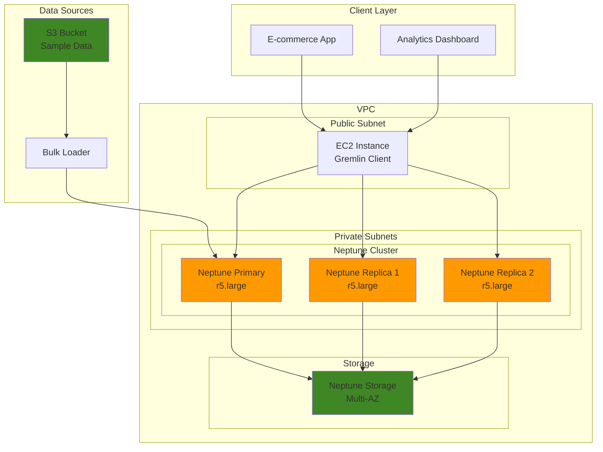

# Graph-Based Recommendation Engine

## Problem

E-commerce companies struggle with generating accurate personalized recommendations from complex relationships between users, products, purchases, and behavioral patterns. Traditional relational databases cannot efficiently model these interconnected relationships, leading to poor recommendation accuracy, slow query performance, and difficulty in discovering indirect connections such as "customers who bought similar products" or "users with similar browsing patterns." This results in missed sales opportunities and reduced customer engagement.

## Solution

Amazon Neptune provides a purpose-built graph database that naturally models relationships between entities like users, products, categories, and interactions. By leveraging Neptune's Apache TinkerPop Gremlin query language, we can build sophisticated recommendation algorithms that traverse complex relationship paths in real-time, enabling personalized product recommendations, friend suggestions, and content discovery systems with millisecond latency.

## Architecture Diagram



## Prerequisites

1. AWS account with permissions for Neptune, VPC, EC2, and IAM services
2. AWS CLI v2 installed and configured (or AWS CloudShell)
3. Basic understanding of graph database concepts and Gremlin query language
4. Knowledge of networking concepts (VPC, subnets, security groups)
5. Estimated cost: $12-25/hour for Neptune cluster + $0.10/hour for EC2 instance

> **Note**: Neptune clusters require VPC configuration and cannot be accessed directly from the internet for security reasons.

## Preparation

```bash
# Set environment variables
export AWS_REGION=$(aws configure get region)
export AWS_ACCOUNT_ID=$(aws sts get-caller-identity \
    --query Account --output text)

# Generate unique identifiers for resources
RANDOM_SUFFIX=$(aws secretsmanager get-random-password \
    --exclude-punctuation --exclude-uppercase \
    --password-length 6 --require-each-included-type \
    --output text --query RandomPassword)

export NEPTUNE_CLUSTER_ID="neptune-recommendations-${RANDOM_SUFFIX}"
export VPC_NAME="neptune-vpc-${RANDOM_SUFFIX}"
export SUBNET_GROUP_NAME="neptune-subnet-group-${RANDOM_SUFFIX}"
export SECURITY_GROUP_NAME="neptune-sg-${RANDOM_SUFFIX}"
export EC2_KEY_PAIR_NAME="neptune-keypair-${RANDOM_SUFFIX}"
export S3_BUCKET_NAME="neptune-sample-data-${RANDOM_SUFFIX}"

# Create S3 bucket for sample data
aws s3 mb s3://${S3_BUCKET_NAME} --region ${AWS_REGION}

echo "✅ Environment variables set and S3 bucket created"
```

## Steps

1. **Create VPC and Networking Infrastructure**:

   Amazon Neptune requires a VPC-based deployment for security and network isolation. Creating a dedicated VPC ensures that your graph database operates in a controlled network environment, protecting sensitive recommendation data from unauthorized access. The VPC acts as your private cloud within AWS, enabling fine-grained network controls and secure communication between Neptune and client applications.

   ```bash
   # Create VPC
   VPC_ID=$(aws ec2 create-vpc \
       --cidr-block 10.0.0.0/16 \
       --query 'Vpc.VpcId' --output text)
   
   aws ec2 create-tags --resources ${VPC_ID} \
       --tags Key=Name,Value=${VPC_NAME}
   
   # Create Internet Gateway
   IGW_ID=$(aws ec2 create-internet-gateway \
       --query 'InternetGateway.InternetGatewayId' --output text)
   
   aws ec2 attach-internet-gateway \
       --internet-gateway-id ${IGW_ID} --vpc-id ${VPC_ID}
   
   echo "✅ VPC and Internet Gateway created: ${VPC_ID}"
   ```

   The VPC now provides the foundation for your Neptune deployment. The Internet Gateway enables outbound connectivity for your EC2 client instance while keeping Neptune itself in private subnets for enhanced security.

2. **Create Subnets in Multiple Availability Zones**:

   Neptune requires subnet groups spanning multiple Availability Zones for high availability and fault tolerance. This multi-AZ architecture ensures your recommendation engine remains operational even if one AZ experiences issues. The private subnets isolate Neptune from direct internet access, while the public subnet hosts the client EC2 instance that will connect to Neptune.

   ```bash
   # Get available AZs
   AZ1=$(aws ec2 describe-availability-zones \
       --query 'AvailabilityZones[0].ZoneName' --output text)
   AZ2=$(aws ec2 describe-availability-zones \
       --query 'AvailabilityZones[1].ZoneName' --output text)
   AZ3=$(aws ec2 describe-availability-zones \
       --query 'AvailabilityZones[2].ZoneName' --output text)
   
   # Create private subnets for Neptune
   SUBNET1_ID=$(aws ec2 create-subnet \
       --vpc-id ${VPC_ID} --cidr-block 10.0.1.0/24 \
       --availability-zone ${AZ1} \
       --query 'Subnet.SubnetId' --output text)
   
   SUBNET2_ID=$(aws ec2 create-subnet \
       --vpc-id ${VPC_ID} --cidr-block 10.0.2.0/24 \
       --availability-zone ${AZ2} \
       --query 'Subnet.SubnetId' --output text)
   
   SUBNET3_ID=$(aws ec2 create-subnet \
       --vpc-id ${VPC_ID} --cidr-block 10.0.3.0/24 \
       --availability-zone ${AZ3} \
       --query 'Subnet.SubnetId' --output text)
   
   # Create public subnet for EC2 instance
   PUBLIC_SUBNET_ID=$(aws ec2 create-subnet \
       --vpc-id ${VPC_ID} --cidr-block 10.0.10.0/24 \
       --availability-zone ${AZ1} \
       --query 'Subnet.SubnetId' --output text)
   
   echo "✅ Subnets created in multiple AZs"
   ```

   Your network topology now supports high availability with Neptune instances distributed across multiple AZs. This configuration provides automatic failover capabilities and ensures continuous operation of your recommendation system.

3. **Configure Route Tables and Security Groups**:

   Network security and routing are critical for Neptune deployments. The route table enables internet access for the EC2 client instance, while security groups act as virtual firewalls controlling access to Neptune. Configuring Neptune's security group to only allow access from within the VPC implements the principle of least privilege, ensuring only authorized resources can query your graph database.

   ```bash
   # Create route table for public subnet
   ROUTE_TABLE_ID=$(aws ec2 create-route-table \
       --vpc-id ${VPC_ID} \
       --query 'RouteTable.RouteTableId' --output text)
   
   aws ec2 create-route --route-table-id ${ROUTE_TABLE_ID} \
       --destination-cidr-block 0.0.0.0/0 \
       --gateway-id ${IGW_ID}
   
   aws ec2 associate-route-table \
       --route-table-id ${ROUTE_TABLE_ID} \
       --subnet-id ${PUBLIC_SUBNET_ID}
   
   # Create security group for Neptune
   NEPTUNE_SG_ID=$(aws ec2 create-security-group \
       --group-name ${SECURITY_GROUP_NAME} \
       --description "Security group for Neptune cluster" \
       --vpc-id ${VPC_ID} \
       --query 'GroupId' --output text)
   
   # Allow Neptune port access from within VPC
   aws ec2 authorize-security-group-ingress \
       --group-id ${NEPTUNE_SG_ID} \
       --protocol tcp --port 8182 \
       --source-group ${NEPTUNE_SG_ID}
   
   echo "✅ Route tables and security groups configured"
   ```

   Network security is now properly configured with restricted access to Neptune on port 8182. This security model ensures that only resources within your VPC can access the graph database, protecting your recommendation data from external threats.

4. **Create Neptune Subnet Group**:

   Neptune subnet groups define the network placement for your database cluster across multiple Availability Zones. This configuration is essential for Neptune's high availability architecture, enabling automatic failover and ensuring consistent performance for your recommendation queries even during infrastructure maintenance or outages.

   ```bash
   # Create Neptune subnet group
   aws neptune create-db-subnet-group \
       --db-subnet-group-name ${SUBNET_GROUP_NAME} \
       --db-subnet-group-description "Subnet group for Neptune cluster" \
       --subnet-ids ${SUBNET1_ID} ${SUBNET2_ID} ${SUBNET3_ID} \
       --tags Key=Name,Value=${SUBNET_GROUP_NAME}
   
   echo "✅ Neptune subnet group created: ${SUBNET_GROUP_NAME}"
   ```

   The subnet group establishes the network foundation for Neptune cluster deployment. This multi-AZ configuration ensures your recommendation engine can handle high availability requirements and provides the network isolation needed for production workloads.

5. **Create Neptune Cluster with Primary and Replica Instances**:

   The Neptune cluster serves as the core of your graph database infrastructure. Storage encryption protects your recommendation data at rest, while backup configuration ensures business continuity. The cluster configuration includes automated backup retention and maintenance windows to minimize impact on your recommendation system's availability during updates.

   ```bash
   # Create Neptune cluster
   aws neptune create-db-cluster \
       --db-cluster-identifier ${NEPTUNE_CLUSTER_ID} \
       --engine neptune \
       --engine-version 1.3.2.0 \
       --master-username neptuneadmin \
       --master-user-password TempPassword123! \
       --db-subnet-group-name ${SUBNET_GROUP_NAME} \
       --vpc-security-group-ids ${NEPTUNE_SG_ID} \
       --storage-encrypted \
       --backup-retention-period 7 \
       --preferred-backup-window "03:00-04:00" \
       --preferred-maintenance-window "sun:04:00-sun:05:00" \
       --tags Key=Name,Value=${NEPTUNE_CLUSTER_ID}
   
   echo "✅ Neptune cluster creation initiated"
   
   # Wait for cluster to be available
   aws neptune wait db-cluster-available \
       --db-cluster-identifier ${NEPTUNE_CLUSTER_ID}
   
   echo "✅ Neptune cluster is available"
   ```

   Your Neptune cluster is now operational and ready to host graph data. The encrypted storage and automated backup configuration provide enterprise-grade data protection for your recommendation system's valuable user and product relationship data.

6. **Create Neptune Primary and Replica Instances**:

   Neptune read replicas enable horizontal scaling for recommendation queries by distributing read workloads across multiple instances. The primary instance handles write operations (adding new user interactions, products), while replicas serve read-heavy recommendation queries. This architecture improves response times for user-facing recommendation requests while maintaining data consistency.

   ```bash
   # Create primary instance
   aws neptune create-db-instance \
       --db-instance-identifier ${NEPTUNE_CLUSTER_ID}-primary \
       --db-instance-class db.r5.large \
       --engine neptune \
       --db-cluster-identifier ${NEPTUNE_CLUSTER_ID} \
       --publicly-accessible false \
       --tags Key=Name,Value=${NEPTUNE_CLUSTER_ID}-primary
   
   # Create first replica
   aws neptune create-db-instance \
       --db-instance-identifier ${NEPTUNE_CLUSTER_ID}-replica-1 \
       --db-instance-class db.r5.large \
       --engine neptune \
       --db-cluster-identifier ${NEPTUNE_CLUSTER_ID} \
       --publicly-accessible false \
       --tags Key=Name,Value=${NEPTUNE_CLUSTER_ID}-replica-1
   
   # Wait for instances to be available
   aws neptune wait db-instance-available \
       --db-instance-identifier ${NEPTUNE_CLUSTER_ID}-primary
   
   aws neptune wait db-instance-available \
       --db-instance-identifier ${NEPTUNE_CLUSTER_ID}-replica-1
   
   echo "✅ Neptune instances created and available"
   ```

   Your Neptune cluster now includes both primary and replica instances, providing the compute capacity needed for high-performance recommendation queries. The read replica architecture enables efficient scaling of recommendation workloads without impacting write performance.

7. **Get Neptune Cluster Endpoint and Launch EC2 Instance**:

   Neptune endpoints provide secure access points for client applications. The write endpoint connects to the primary instance for data updates, while the read endpoint automatically load-balances queries across read replicas. The EC2 instance serves as a Gremlin client for testing and demonstrates how applications would connect to Neptune in a production environment.

   ```bash
   # Get Neptune cluster endpoints
   NEPTUNE_ENDPOINT=$(aws neptune describe-db-clusters \
       --db-cluster-identifier ${NEPTUNE_CLUSTER_ID} \
       --query 'DBClusters[0].Endpoint' --output text)
   
   NEPTUNE_READ_ENDPOINT=$(aws neptune describe-db-clusters \
       --db-cluster-identifier ${NEPTUNE_CLUSTER_ID} \
       --query 'DBClusters[0].ReaderEndpoint' --output text)
   
   # Create key pair for EC2 instance
   aws ec2 create-key-pair \
       --key-name ${EC2_KEY_PAIR_NAME} \
       --query 'KeyMaterial' --output text > ${EC2_KEY_PAIR_NAME}.pem
   
   chmod 400 ${EC2_KEY_PAIR_NAME}.pem
   
   # Launch EC2 instance in public subnet (replace with current Amazon Linux 2 AMI)
   EC2_INSTANCE_ID=$(aws ec2 run-instances \
       --image-id ami-0abcdef1234567890 \
       --instance-type t3.medium \
       --key-name ${EC2_KEY_PAIR_NAME} \
       --security-group-ids ${NEPTUNE_SG_ID} \
       --subnet-id ${PUBLIC_SUBNET_ID} \
       --associate-public-ip-address \
       --user-data file://user-data.sh \
       --tag-specifications \
       'ResourceType=instance,Tags=[{Key=Name,Value=neptune-client}]' \
       --query 'Instances[0].InstanceId' --output text)
   
   echo "✅ Neptune endpoints: ${NEPTUNE_ENDPOINT}"
   echo "✅ EC2 instance launched: ${EC2_INSTANCE_ID}"
   ```

   Your client infrastructure is now ready to connect to Neptune. The EC2 instance provides a secure platform for running Gremlin queries and testing recommendation algorithms, simulating how your application would interact with the graph database.

8. **Prepare Sample E-commerce Graph Data**:

   Graph databases excel at modeling complex relationships between entities. This sample dataset represents a typical e-commerce scenario with users, products, and purchase relationships. The CSV format simplifies data preparation, while the relationship structure (users purchasing products with ratings) provides the foundation for both collaborative filtering and content-based recommendation algorithms.

   ```bash
   # Create sample data files for the recommendation engine
   cat > sample-users.csv << 'EOF'
   id,name,age,city,interests
   user1,Alice,28,Seattle,books;technology;travel
   user2,Bob,35,Portland,sports;music;cooking
   user3,Carol,42,Vancouver,art;books;photography
   user4,David,31,San Francisco,technology;gaming;fitness
   user5,Eve,26,Los Angeles,fashion;travel;music
   EOF
   
   cat > sample-products.csv << 'EOF'
   id,name,category,price,brand,tags
   prod1,Laptop,Electronics,999.99,TechCorp,technology;work;portable
   prod2,Running Shoes,Sports,129.99,SportsBrand,fitness;running;comfort
   prod3,Camera,Electronics,599.99,PhotoPro,photography;hobby;travel
   prod4,Cookbook,Books,29.99,FoodPress,cooking;recipes;kitchen
   prod5,Headphones,Electronics,199.99,AudioMax,music;technology;wireless
   EOF
   
   cat > sample-purchases.csv << 'EOF'
   user_id,product_id,quantity,purchase_date,rating
   user1,prod1,1,2024-01-15,5
   user1,prod3,1,2024-01-20,4
   user2,prod2,1,2024-01-18,5
   user2,prod4,2,2024-01-25,4
   user3,prod3,1,2024-01-22,5
   user3,prod4,1,2024-01-28,3
   user4,prod1,1,2024-01-30,4
   user4,prod5,1,2024-02-02,5
   user5,prod5,1,2024-02-05,4
   EOF
   
   # Upload sample data to S3
   aws s3 cp sample-users.csv s3://${S3_BUCKET_NAME}/
   aws s3 cp sample-products.csv s3://${S3_BUCKET_NAME}/
   aws s3 cp sample-purchases.csv s3://${S3_BUCKET_NAME}/
   
   echo "✅ Sample data created and uploaded to S3"
   ```

   Your sample dataset now includes realistic e-commerce entities and relationships stored in S3. This data structure enables testing of various recommendation algorithms and demonstrates how graph databases naturally represent complex business relationships.

9. **Create Gremlin Data Loading Script**:

   Gremlin is Neptune's graph traversal language that enables powerful queries across connected data. This script transforms our relational CSV data into a graph structure with vertices (users, products) and edges (purchase relationships). The graph model naturally represents the many-to-many relationships between users and products, making recommendation algorithms more efficient than traditional SQL joins.

   ```bash
   # Create Gremlin script for loading sample data
   cat > load-data.groovy << 'EOF'
   // Clear existing data
   g.V().drop().iterate()
   
   // Create user vertices
   g.addV('user').property('id', 'user1').property('name', 'Alice').property('age', 28).property('city', 'Seattle').next()
   g.addV('user').property('id', 'user2').property('name', 'Bob').property('age', 35).property('city', 'Portland').next()
   g.addV('user').property('id', 'user3').property('name', 'Carol').property('age', 42).property('city', 'Vancouver').next()
   g.addV('user').property('id', 'user4').property('name', 'David').property('age', 31).property('city', 'San Francisco').next()
   g.addV('user').property('id', 'user5').property('name', 'Eve').property('age', 26).property('city', 'Los Angeles').next()
   
   // Create product vertices
   g.addV('product').property('id', 'prod1').property('name', 'Laptop').property('category', 'Electronics').property('price', 999.99).next()
   g.addV('product').property('id', 'prod2').property('name', 'Running Shoes').property('category', 'Sports').property('price', 129.99).next()
   g.addV('product').property('id', 'prod3').property('name', 'Camera').property('category', 'Electronics').property('price', 599.99).next()
   g.addV('product').property('id', 'prod4').property('name', 'Cookbook').property('category', 'Books').property('price', 29.99).next()
   g.addV('product').property('id', 'prod5').property('name', 'Headphones').property('category', 'Electronics').property('price', 199.99).next()
   
   // Create purchase relationships
   g.V().has('user', 'id', 'user1').as('u').V().has('product', 'id', 'prod1').addE('purchased').from('u').property('rating', 5).property('date', '2024-01-15').next()
   g.V().has('user', 'id', 'user1').as('u').V().has('product', 'id', 'prod3').addE('purchased').from('u').property('rating', 4).property('date', '2024-01-20').next()
   g.V().has('user', 'id', 'user2').as('u').V().has('product', 'id', 'prod2').addE('purchased').from('u').property('rating', 5).property('date', '2024-01-18').next()
   g.V().has('user', 'id', 'user2').as('u').V().has('product', 'id', 'prod4').addE('purchased').from('u').property('rating', 4).property('date', '2024-01-25').next()
   g.V().has('user', 'id', 'user3').as('u').V().has('product', 'id', 'prod3').addE('purchased').from('u').property('rating', 5).property('date', '2024-01-22').next()
   g.V().has('user', 'id', 'user3').as('u').V().has('product', 'id', 'prod4').addE('purchased').from('u').property('rating', 3).property('date', '2024-01-28').next()
   g.V().has('user', 'id', 'user4').as('u').V().has('product', 'id', 'prod1').addE('purchased').from('u').property('rating', 4).property('date', '2024-01-30').next()
   g.V().has('user', 'id', 'user4').as('u').V().has('product', 'id', 'prod5').addE('purchased').from('u').property('rating', 5).property('date', '2024-02-02').next()
   g.V().has('user', 'id', 'user5').as('u').V().has('product', 'id', 'prod5').addE('purchased').from('u').property('rating', 4).property('date', '2024-02-05').next()
   
   // Create category relationships
   g.V().has('product', 'category', 'Electronics').as('p1').V().has('product', 'category', 'Electronics').as('p2').where(neq('p1')).addE('same_category').from('p1').to('p2').next()
   
   // Commit the transaction
   g.tx().commit()
   
   println "Data loaded successfully"
   EOF
   
   echo "✅ Gremlin data loading script created"
   ```

   The Gremlin script is ready to populate Neptune with your e-commerce graph data. This graph structure enables efficient traversal of user-product relationships and forms the foundation for sophisticated recommendation algorithms.

10. **Create Recommendation Algorithm Scripts**:

    Graph-based recommendation systems leverage the natural connectivity of user-product relationships. Collaborative filtering identifies users with similar purchase patterns and recommends products based on these similarities, while content-based filtering suggests products with similar attributes. Neptune's graph structure makes these algorithms highly efficient by eliminating complex JOIN operations required in relational databases.

    ```bash
    # Create collaborative filtering recommendation script
    cat > collaborative-filtering.groovy << 'EOF'
    // Collaborative Filtering: Find products purchased by similar users
    def findSimilarUsers(userId) {
        return g.V().has('user', 'id', userId).
               out('purchased').
               in('purchased').
               where(neq(V().has('user', 'id', userId))).
               groupCount().
               order(local).by(values, desc).
               limit(local, 3)
    }
    
    def recommendProducts(userId) {
        // Find users who bought similar products
        def similarUsers = g.V().has('user', 'id', userId).
                          out('purchased').
                          in('purchased').
                          where(neq(V().has('user', 'id', userId))).
                          dedup().limit(5)
        
        // Get products purchased by similar users that target user hasn't bought
        def userProducts = g.V().has('user', 'id', userId).out('purchased').id().toSet()
        
        return similarUsers.
               out('purchased').
               where(not(within(userProducts))).
               groupCount().
               order(local).by(values, desc).
               limit(local, 3)
    }
    
    // Test the recommendation for user1
    println "Similar users for user1:"
    findSimilarUsers('user1').each { user, count ->
        println "${user.values('name').next()}: ${count} common purchases"
    }
    
    println "\nRecommendations for user1:"
    recommendProducts('user1').each { product, score ->
        println "${product.values('name').next()}: score ${score}"
    }
    EOF
    
    # Create content-based recommendation script
    cat > content-based.groovy << 'EOF'
    // Content-Based Filtering: Recommend based on product attributes
    def recommendBySimilarProducts(userId) {
        // Get user's purchased products
        def userProducts = g.V().has('user', 'id', userId).out('purchased').toList()
        
        // Get categories of purchased products
        def userCategories = userProducts.collect { it.values('category').next() }.unique()
        
        // Find products in same categories not yet purchased
        def userProductIds = userProducts.collect { it.values('id').next() }.toSet()
        
        return g.V().has('product', 'category', within(userCategories)).
               where(not(has('id', within(userProductIds)))).
               project('name', 'category', 'price').
               by('name').by('category').by('price').
               limit(3)
    }
    
    // Test content-based recommendations for user2
    println "Content-based recommendations for user2:"
    recommendBySimilarProducts('user2').each { recommendation ->
        println "${recommendation.name} (${recommendation.category}): $${recommendation.price}"
    }
    EOF
    
    echo "✅ Recommendation algorithm scripts created"
    ```

    Your recommendation algorithms are now ready for testing. These Gremlin scripts demonstrate how graph traversals can quickly identify user similarities and product relationships, enabling real-time personalized recommendations at scale.

11. **Create Neptune Connection and Testing Script**:

    Production applications require robust connection management and error handling when accessing Neptune. This Python script demonstrates best practices for establishing WebSocket connections to Neptune using the Gremlin Python driver. The connection testing validates network connectivity and graph data integrity before running recommendation queries.

    > **Warning**: Ensure your EC2 instance security group allows outbound connections on port 8182 for Neptune WebSocket communication.

    ```bash
    # Create connection testing script
    cat > test-connection.py << 'EOF'
    #!/usr/bin/env python3
    import json
    import sys
    from gremlin_python.driver import client
    from gremlin_python.driver.driver_remote_connection import DriverRemoteConnection
    from gremlin_python.structure.graph import Graph
    
    def test_neptune_connection(endpoint):
        try:
            # Create connection
            connection = DriverRemoteConnection(f'wss://{endpoint}:8182/gremlin', 'g')
            g = Graph().traversal().withRemote(connection)
            
            # Test basic connectivity
            vertex_count = g.V().count().next()
            edge_count = g.E().count().next()
            
            print(f"✅ Connected to Neptune successfully!")
            print(f"Graph contains {vertex_count} vertices and {edge_count} edges")
            
            # Test sample queries
            users = g.V().hasLabel('user').valueMap().limit(3).toList()
            products = g.V().hasLabel('product').valueMap().limit(3).toList()
            
            print("\nSample Users:")
            for user in users:
                print(f"  {user}")
            
            print("\nSample Products:")
            for product in products:
                print(f"  {product}")
            
            connection.close()
            return True
            
        except Exception as e:
            print(f"❌ Connection failed: {e}")
            return False
    
    if __name__ == "__main__":
        if len(sys.argv) != 2:
            print("Usage: python3 test-connection.py <neptune-endpoint>")
            sys.exit(1)
        
        endpoint = sys.argv[1]
        test_neptune_connection(endpoint)
    EOF
    
    chmod +x test-connection.py
    echo "✅ Neptune connection testing script created"
    ```

    The connection testing framework provides a reliable foundation for application integration. This script template can be adapted for production applications that need to connect to Neptune and execute recommendation queries.

12. **Load Data and Test Recommendations**:

    The final configuration step prepares the testing environment by storing Neptune endpoints and establishing EC2 connectivity. These connection details enable your client applications to access Neptune's write and read endpoints appropriately - using the write endpoint for data updates and read endpoints for recommendation queries to optimize performance.

    ```bash
    # Store Neptune endpoint for use in EC2 instance
    echo "export NEPTUNE_ENDPOINT=${NEPTUNE_ENDPOINT}" > neptune-config.sh
    echo "export NEPTUNE_READ_ENDPOINT=${NEPTUNE_READ_ENDPOINT}" >> neptune-config.sh
    
    # Get EC2 instance public IP
    EC2_PUBLIC_IP=$(aws ec2 describe-instances \
        --instance-ids ${EC2_INSTANCE_ID} \
        --query 'Reservations[0].Instances[0].PublicIpAddress' \
        --output text)
    
    echo "✅ Neptune cluster ready for testing"
    echo "Neptune Write Endpoint: ${NEPTUNE_ENDPOINT}"
    echo "Neptune Read Endpoint: ${NEPTUNE_READ_ENDPOINT}"
    echo "EC2 Public IP: ${EC2_PUBLIC_IP}"
    echo "Connect to EC2: ssh -i ${EC2_KEY_PAIR_NAME}.pem ec2-user@${EC2_PUBLIC_IP}"
    ```

    Your Neptune cluster is fully configured and ready for recommendation testing. The endpoints and connection information provide everything needed to begin running graph queries and evaluating recommendation algorithm performance.

## Validation & Testing

1. **Verify Neptune cluster is running**:

   ```bash
   # Check cluster status
   aws neptune describe-db-clusters \
       --db-cluster-identifier ${NEPTUNE_CLUSTER_ID} \
       --query 'DBClusters[0].Status' --output text
   ```

   Expected output: `available`

2. **Test basic connectivity from EC2 instance**:

   ```bash
   # SSH to EC2 instance and test connection
   ssh -i ${EC2_KEY_PAIR_NAME}.pem ec2-user@${EC2_PUBLIC_IP} << 'EOF'
   # Install Python Gremlin client
   sudo yum update -y
   sudo yum install -y python3 python3-pip
   pip3 install gremlinpython
   
   # Test connection
   python3 -c "
   from gremlin_python.driver.driver_remote_connection import DriverRemoteConnection
   from gremlin_python.structure.graph import Graph
   
   connection = DriverRemoteConnection('wss://NEPTUNE_ENDPOINT:8182/gremlin', 'g')
   g = Graph().traversal().withRemote(connection)
   
   print('Vertices:', g.V().count().next())
   print('Edges:', g.E().count().next())
   connection.close()
   "
   EOF
   ```

3. **Test recommendation queries**:

   ```bash
   # Test collaborative filtering recommendations
   gremlin> g.V().has('user', 'id', 'user1').out('purchased').in('purchased').where(neq(V().has('user', 'id', 'user1'))).values('name').dedup()
   
   # Test content-based recommendations
   gremlin> g.V().has('user', 'id', 'user1').out('purchased').values('category').dedup()
   ```

4. **Performance testing with concurrent queries**:

   ```bash
   # Test query performance
   time gremlin> g.V().hasLabel('user').out('purchased').hasLabel('product').where(values('category').is('Electronics')).count()
   ```

## Cleanup

1. **Delete Neptune cluster instances**:

   ```bash
   # Delete replica instances first
   aws neptune delete-db-instance \
       --db-instance-identifier ${NEPTUNE_CLUSTER_ID}-replica-1 \
       --skip-final-snapshot
   
   # Wait for replica deletion
   aws neptune wait db-instance-deleted \
       --db-instance-identifier ${NEPTUNE_CLUSTER_ID}-replica-1
   
   # Delete primary instance
   aws neptune delete-db-instance \
       --db-instance-identifier ${NEPTUNE_CLUSTER_ID}-primary \
       --skip-final-snapshot
   
   # Wait for primary deletion
   aws neptune wait db-instance-deleted \
       --db-instance-identifier ${NEPTUNE_CLUSTER_ID}-primary
   
   echo "✅ Neptune instances deleted"
   ```

2. **Delete Neptune cluster and subnet group**:

   ```bash
   # Delete Neptune cluster
   aws neptune delete-db-cluster \
       --db-cluster-identifier ${NEPTUNE_CLUSTER_ID} \
       --skip-final-snapshot
   
   # Delete subnet group
   aws neptune delete-db-subnet-group \
       --db-subnet-group-name ${SUBNET_GROUP_NAME}
   
   echo "✅ Neptune cluster and subnet group deleted"
   ```

3. **Terminate EC2 instance and clean up networking**:

   ```bash
   # Terminate EC2 instance
   aws ec2 terminate-instances --instance-ids ${EC2_INSTANCE_ID}
   
   # Delete key pair
   aws ec2 delete-key-pair --key-name ${EC2_KEY_PAIR_NAME}
   rm -f ${EC2_KEY_PAIR_NAME}.pem
   
   # Delete security group
   aws ec2 delete-security-group --group-id ${NEPTUNE_SG_ID}
   
   # Delete subnets
   aws ec2 delete-subnet --subnet-id ${SUBNET1_ID}
   aws ec2 delete-subnet --subnet-id ${SUBNET2_ID}
   aws ec2 delete-subnet --subnet-id ${SUBNET3_ID}
   aws ec2 delete-subnet --subnet-id ${PUBLIC_SUBNET_ID}
   
   echo "✅ EC2 instance and networking resources deleted"
   ```

4. **Clean up VPC and S3 resources**:

   ```bash
   # Detach and delete internet gateway
   aws ec2 detach-internet-gateway \
       --internet-gateway-id ${IGW_ID} --vpc-id ${VPC_ID}
   aws ec2 delete-internet-gateway --internet-gateway-id ${IGW_ID}
   
   # Delete route table
   aws ec2 delete-route-table --route-table-id ${ROUTE_TABLE_ID}
   
   # Delete VPC
   aws ec2 delete-vpc --vpc-id ${VPC_ID}
   
   # Delete S3 bucket
   aws s3 rb s3://${S3_BUCKET_NAME} --force
   
   # Clean up local files
   rm -f sample-*.csv *.groovy *.py neptune-config.sh
   
   echo "✅ All resources cleaned up"
   ```

## Discussion

Amazon Neptune's graph database architecture provides significant advantages for recommendation systems compared to traditional relational databases. The native graph structure allows for efficient traversal of complex relationships, enabling real-time recommendations based on multi-hop connections between users, products, and behaviors. Neptune's support for both Gremlin and SPARQL query languages provides flexibility in implementing different recommendation algorithms.

The architecture demonstrated here implements both collaborative filtering and content-based recommendation approaches. Collaborative filtering identifies users with similar purchase patterns and recommends products based on these similarities, while content-based filtering recommends products with similar attributes to those a user has already purchased. Neptune's graph structure makes it particularly efficient to traverse these relationships, as it can quickly identify paths between users and products without expensive JOIN operations.

Performance optimization in Neptune involves careful consideration of query patterns and indexing strategies. The use of read replicas distributes query load and improves response times for recommendation queries. Neptune's automatic storage scaling and Multi-AZ deployment ensure high availability for production recommendation systems. For high-throughput scenarios, consider implementing caching layers with ElastiCache to reduce query latency further.

> **Tip**: Use Neptune's bulk loading capabilities for initial data import and consider implementing streaming updates through Neptune Streams for real-time recommendation updates.

## Challenge

Extend this solution by implementing these advanced features:

1. **Real-time Streaming Updates**: Integrate Amazon Kinesis Data Streams to capture user interactions and update the graph in real-time, maintaining fresh recommendations based on the latest user behavior.

2. **Machine Learning Integration**: Connect Neptune with Amazon SageMaker to build more sophisticated recommendation models using graph embeddings and deep learning algorithms like Graph Neural Networks (GNNs).

3. **Multi-dimensional Recommendations**: Extend the graph model to include temporal data, user demographics, and contextual information (location, device, time of day) for more personalized recommendations.

4. **A/B Testing Framework**: Implement a recommendation A/B testing system using AWS CloudFormation and Lambda to compare different recommendation algorithms and measure their effectiveness.

5. **Fraud Detection Integration**: Leverage the graph structure to identify suspicious patterns and fraudulent behavior by analyzing unusual relationship patterns between users, products, and transactions.

## Infrastructure Code

*Infrastructure code will be generated after recipe approval.*