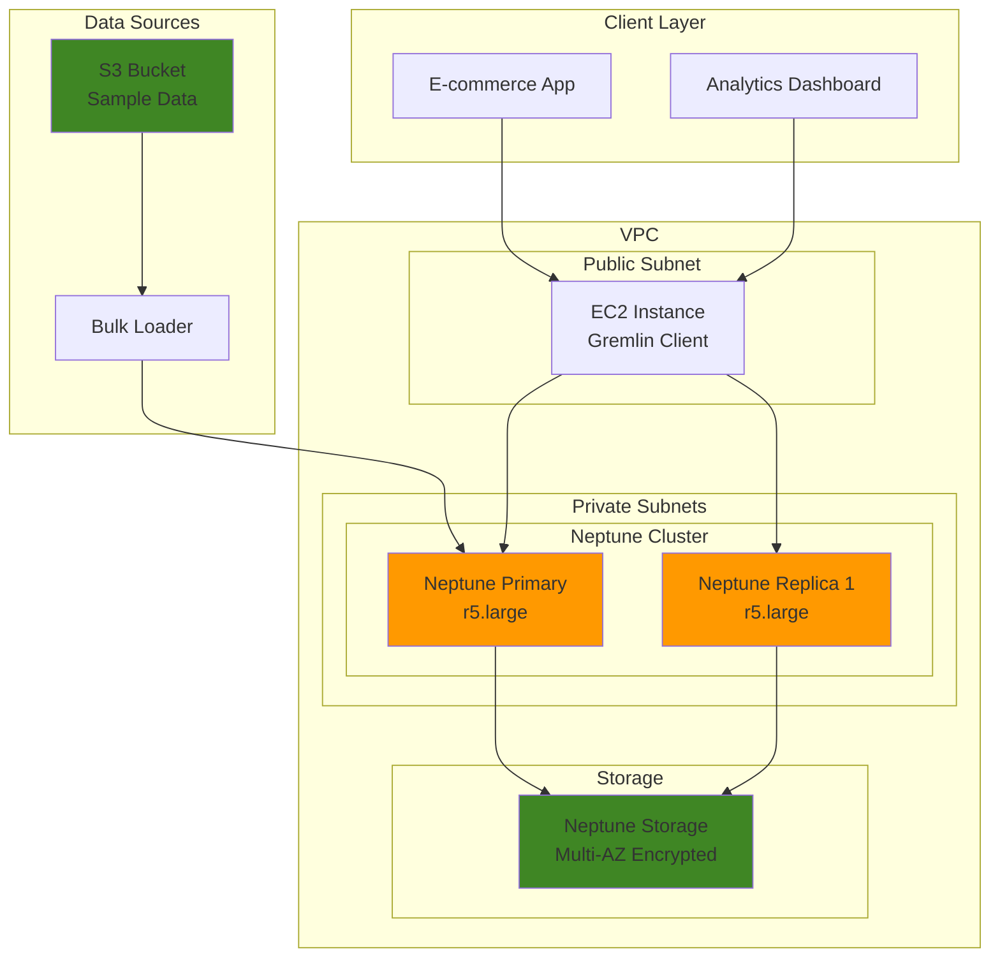

# Graph-Based Recommendation Engine with Neptune

## Problem

E-commerce companies struggle with generating accurate personalized recommendations from complex relationships between users, products, purchases, and behavioral patterns. Traditional relational databases cannot efficiently model these interconnected relationships, leading to poor recommendation accuracy, slow query performance, and difficulty in discovering indirect connections such as "customers who bought similar products" or "users with similar browsing patterns." This results in missed sales opportunities and reduced customer engagement.

## Solution

Amazon Neptune provides a purpose-built graph database that naturally models relationships between entities like users, products, categories, and interactions. By leveraging Neptune's Apache TinkerPop Gremlin query language, we can build sophisticated recommendation algorithms that traverse complex relationship paths in real-time, enabling personalized product recommendations, friend suggestions, and content discovery systems with millisecond latency.

## Architecture Diagram



## Prerequisites

1. AWS account with permissions for Neptune, VPC, EC2, and IAM services
2. AWS CLI v2 installed and configured (or AWS CloudShell)
3. Basic understanding of graph database concepts and Gremlin query language
4. Knowledge of networking concepts (VPC, subnets, security groups)
5. Estimated cost: $12-25/hour for Neptune cluster + $0.10/hour for EC2 instance

> **Note**: Neptune clusters require VPC configuration and cannot be accessed directly from the internet for security reasons following AWS Well-Architected security principles.

## Preparation

```bash
# Set environment variables
export AWS_REGION=$(aws configure get region)
export AWS_ACCOUNT_ID=$(aws sts get-caller-identity \
    --query Account --output text)

# Generate unique identifiers for resources
RANDOM_SUFFIX=$(aws secretsmanager get-random-password \
    --exclude-punctuation --exclude-uppercase \
    --password-length 6 --require-each-included-type \
    --output text --query RandomPassword)

export NEPTUNE_CLUSTER_ID="neptune-recommendations-${RANDOM_SUFFIX}"
export VPC_NAME="neptune-vpc-${RANDOM_SUFFIX}"
export SUBNET_GROUP_NAME="neptune-subnet-group-${RANDOM_SUFFIX}"
export SECURITY_GROUP_NAME="neptune-sg-${RANDOM_SUFFIX}"
export EC2_KEY_PAIR_NAME="neptune-keypair-${RANDOM_SUFFIX}"
export S3_BUCKET_NAME="neptune-sample-data-${RANDOM_SUFFIX}"

# Create S3 bucket for sample data
aws s3 mb s3://${S3_BUCKET_NAME} --region ${AWS_REGION}

echo "✅ Environment variables set and S3 bucket created"
```

## Steps

1. **Create VPC and Networking Infrastructure**:

   Amazon Neptune requires a VPC-based deployment for security and network isolation following AWS Well-Architected Framework security principles. Creating a dedicated VPC ensures that your graph database operates in a controlled network environment, protecting sensitive recommendation data from unauthorized access. The VPC acts as your private cloud within AWS, enabling fine-grained network controls and secure communication between Neptune and client applications.

   ```bash
   # Create VPC with DNS support for Neptune
   VPC_ID=$(aws ec2 create-vpc \
       --cidr-block 10.0.0.0/16 \
       --enable-dns-hostnames \
       --enable-dns-support \
       --query 'Vpc.VpcId' --output text)
   
   aws ec2 create-tags --resources ${VPC_ID} \
       --tags Key=Name,Value=${VPC_NAME}
   
   # Create Internet Gateway
   IGW_ID=$(aws ec2 create-internet-gateway \
       --query 'InternetGateway.InternetGatewayId' --output text)
   
   aws ec2 attach-internet-gateway \
       --internet-gateway-id ${IGW_ID} --vpc-id ${VPC_ID}
   
   echo "✅ VPC and Internet Gateway created: ${VPC_ID}"
   ```

   The VPC now provides the foundation for your Neptune deployment with DNS resolution enabled. The Internet Gateway enables outbound connectivity for your EC2 client instance while keeping Neptune itself in private subnets for enhanced security.

2. **Create Subnets in Multiple Availability Zones**:

   Neptune requires subnet groups spanning multiple Availability Zones for high availability and fault tolerance following AWS Well-Architected reliability principles. This multi-AZ architecture ensures your recommendation engine remains operational even if one AZ experiences issues. The private subnets isolate Neptune from direct internet access, while the public subnet hosts the client EC2 instance that will connect to Neptune.

   ```bash
   # Get first three available AZs in the region
   AZ1=$(aws ec2 describe-availability-zones \
       --query 'AvailabilityZones[0].ZoneName' --output text)
   AZ2=$(aws ec2 describe-availability-zones \
       --query 'AvailabilityZones[1].ZoneName' --output text)
   AZ3=$(aws ec2 describe-availability-zones \
       --query 'AvailabilityZones[2].ZoneName' --output text)
   
   # Create private subnets for Neptune in different AZs
   SUBNET1_ID=$(aws ec2 create-subnet \
       --vpc-id ${VPC_ID} --cidr-block 10.0.1.0/24 \
       --availability-zone ${AZ1} \
       --query 'Subnet.SubnetId' --output text)
   
   SUBNET2_ID=$(aws ec2 create-subnet \
       --vpc-id ${VPC_ID} --cidr-block 10.0.2.0/24 \
       --availability-zone ${AZ2} \
       --query 'Subnet.SubnetId' --output text)
   
   SUBNET3_ID=$(aws ec2 create-subnet \
       --vpc-id ${VPC_ID} --cidr-block 10.0.3.0/24 \
       --availability-zone ${AZ3} \
       --query 'Subnet.SubnetId' --output text)
   
   # Create public subnet for EC2 client instance
   PUBLIC_SUBNET_ID=$(aws ec2 create-subnet \
       --vpc-id ${VPC_ID} --cidr-block 10.0.10.0/24 \
       --availability-zone ${AZ1} \
       --query 'Subnet.SubnetId' --output text)
   
   # Enable auto-assign public IP for public subnet
   aws ec2 modify-subnet-attribute \
       --subnet-id ${PUBLIC_SUBNET_ID} \
       --map-public-ip-on-launch
   
   echo "✅ Subnets created across multiple AZs"
   ```

   Your network topology now supports high availability with Neptune instances distributed across multiple AZs. This configuration provides automatic failover capabilities and ensures continuous operation of your recommendation system.

3. **Configure Route Tables and Security Groups**:

   Network security and routing are critical for Neptune deployments following defense-in-depth security principles. The route table enables internet access for the EC2 client instance, while security groups act as virtual firewalls controlling access to Neptune. Configuring Neptune's security group to only allow access from within the VPC implements the principle of least privilege, ensuring only authorized resources can query your graph database.

   ```bash
   # Create route table for public subnet
   ROUTE_TABLE_ID=$(aws ec2 create-route-table \
       --vpc-id ${VPC_ID} \
       --query 'RouteTable.RouteTableId' --output text)
   
   aws ec2 create-route --route-table-id ${ROUTE_TABLE_ID} \
       --destination-cidr-block 0.0.0.0/0 \
       --gateway-id ${IGW_ID}
   
   aws ec2 associate-route-table \
       --route-table-id ${ROUTE_TABLE_ID} \
       --subnet-id ${PUBLIC_SUBNET_ID}
   
   # Create security group for Neptune with restricted access
   NEPTUNE_SG_ID=$(aws ec2 create-security-group \
       --group-name ${SECURITY_GROUP_NAME} \
       --description "Security group for Neptune cluster" \
       --vpc-id ${VPC_ID} \
       --query 'GroupId' --output text)
   
   # Allow Neptune port access from within VPC only
   aws ec2 authorize-security-group-ingress \
       --group-id ${NEPTUNE_SG_ID} \
       --protocol tcp --port 8182 \
       --source-group ${NEPTUNE_SG_ID}
   
   # Allow HTTPS outbound for EC2 instance
   aws ec2 authorize-security-group-egress \
       --group-id ${NEPTUNE_SG_ID} \
       --protocol tcp --port 443 \
       --cidr 0.0.0.0/0
   
   echo "✅ Route tables and security groups configured"
   ```

   Network security is now properly configured with restricted access to Neptune on port 8182. This security model ensures that only resources within your VPC can access the graph database, protecting your recommendation data from external threats.

4. **Create Neptune Subnet Group**:

   Neptune subnet groups define the network placement for your database cluster across multiple Availability Zones. This configuration is essential for Neptune's high availability architecture, enabling automatic failover and ensuring consistent performance for your recommendation queries even during infrastructure maintenance or outages.

   ```bash
   # Create Neptune subnet group spanning multiple AZs
   aws neptune create-db-subnet-group \
       --db-subnet-group-name ${SUBNET_GROUP_NAME} \
       --db-subnet-group-description "Multi-AZ subnet group for Neptune cluster" \
       --subnet-ids ${SUBNET1_ID} ${SUBNET2_ID} ${SUBNET3_ID} \
       --tags Key=Name,Value=${SUBNET_GROUP_NAME}
   
   echo "✅ Neptune subnet group created: ${SUBNET_GROUP_NAME}"
   ```

   The subnet group establishes the network foundation for Neptune cluster deployment. This multi-AZ configuration ensures your recommendation engine can handle high availability requirements and provides the network isolation needed for production workloads.

5. **Create Neptune Cluster with Enhanced Security**:

   The Neptune cluster serves as the core of your graph database infrastructure. Storage encryption protects your recommendation data at rest, while backup configuration ensures business continuity. The cluster configuration includes automated backup retention and maintenance windows to minimize impact on your recommendation system's availability during updates.

   ```bash
   # Create Neptune cluster with latest engine version and security features
   aws neptune create-db-cluster \
       --db-cluster-identifier ${NEPTUNE_CLUSTER_ID} \
       --engine neptune \
       --engine-version 1.4.5.1 \
       --master-username neptuneadmin \
       --manage-master-user-password \
       --db-subnet-group-name ${SUBNET_GROUP_NAME} \
       --vpc-security-group-ids ${NEPTUNE_SG_ID} \
       --storage-encrypted \
       --backup-retention-period 7 \
       --preferred-backup-window "03:00-04:00" \
       --preferred-maintenance-window "sun:04:00-sun:05:00" \
       --enable-cloudwatch-logs-exports neptune-audit \
       --tags Key=Name,Value=${NEPTUNE_CLUSTER_ID}
   
   echo "✅ Neptune cluster creation initiated"
   
   # Wait for cluster to be available
   aws neptune wait db-cluster-available \
       --db-cluster-identifier ${NEPTUNE_CLUSTER_ID}
   
   echo "✅ Neptune cluster is available"
   ```

   Your Neptune cluster is now operational with the latest engine version and AWS managed master user password for enhanced security. The encrypted storage and automated backup configuration provide enterprise-grade data protection for your recommendation system's valuable user and product relationship data.

6. **Create Neptune Primary and Replica Instances**:

   Neptune read replicas enable horizontal scaling for recommendation queries by distributing read workloads across multiple instances. The primary instance handles write operations (adding new user interactions, products), while replicas serve read-heavy recommendation queries. This architecture improves response times for user-facing recommendation requests while maintaining data consistency.

   ```bash
   # Create primary instance with performance insights
   aws neptune create-db-instance \
       --db-instance-identifier ${NEPTUNE_CLUSTER_ID}-primary \
       --db-instance-class db.r5.large \
       --engine neptune \
       --db-cluster-identifier ${NEPTUNE_CLUSTER_ID} \
       --publicly-accessible false \
       --enable-performance-insights \
       --performance-insights-retention-period 7 \
       --tags Key=Name,Value=${NEPTUNE_CLUSTER_ID}-primary
   
   # Create read replica for query load distribution
   aws neptune create-db-instance \
       --db-instance-identifier ${NEPTUNE_CLUSTER_ID}-replica-1 \
       --db-instance-class db.r5.large \
       --engine neptune \
       --db-cluster-identifier ${NEPTUNE_CLUSTER_ID} \
       --publicly-accessible false \
       --enable-performance-insights \
       --performance-insights-retention-period 7 \
       --tags Key=Name,Value=${NEPTUNE_CLUSTER_ID}-replica-1
   
   # Wait for instances to be available
   aws neptune wait db-instance-available \
       --db-instance-identifier ${NEPTUNE_CLUSTER_ID}-primary
   
   aws neptune wait db-instance-available \
       --db-instance-identifier ${NEPTUNE_CLUSTER_ID}-replica-1
   
   echo "✅ Neptune instances created with Performance Insights enabled"
   ```

   Your Neptune cluster now includes both primary and replica instances with Performance Insights enabled for monitoring. The read replica architecture enables efficient scaling of recommendation workloads without impacting write performance.

7. **Launch EC2 Instance with Latest Amazon Linux**:

   Neptune endpoints provide secure access points for client applications. The write endpoint connects to the primary instance for data updates, while the read endpoint automatically load-balances queries across read replicas. The EC2 instance serves as a Gremlin client for testing and demonstrates how applications would connect to Neptune in a production environment.

   ```bash
   # Get Neptune cluster endpoints
   NEPTUNE_ENDPOINT=$(aws neptune describe-db-clusters \
       --db-cluster-identifier ${NEPTUNE_CLUSTER_ID} \
       --query 'DBClusters[0].Endpoint' --output text)
   
   NEPTUNE_READ_ENDPOINT=$(aws neptune describe-db-clusters \
       --db-cluster-identifier ${NEPTUNE_CLUSTER_ID} \
       --query 'DBClusters[0].ReaderEndpoint' --output text)
   
   # Create key pair for EC2 instance
   aws ec2 create-key-pair \
       --key-name ${EC2_KEY_PAIR_NAME} \
       --query 'KeyMaterial' --output text > ${EC2_KEY_PAIR_NAME}.pem
   
   chmod 400 ${EC2_KEY_PAIR_NAME}.pem
   
   # Get latest Amazon Linux 2023 AMI ID
   AL2023_AMI_ID=$(aws ec2 describe-images \
       --owners amazon \
       --filters 'Name=name,Values=al2023-ami-*' \
               'Name=architecture,Values=x86_64' \
               'Name=virtualization-type,Values=hvm' \
       --query 'Images | sort_by(@, &CreationDate) | [-1].ImageId' \
       --output text)
   
   # Launch EC2 instance with Amazon Linux 2023
   EC2_INSTANCE_ID=$(aws ec2 run-instances \
       --image-id ${AL2023_AMI_ID} \
       --instance-type t3.medium \
       --key-name ${EC2_KEY_PAIR_NAME} \
       --security-group-ids ${NEPTUNE_SG_ID} \
       --subnet-id ${PUBLIC_SUBNET_ID} \
       --associate-public-ip-address \
       --tag-specifications \
       'ResourceType=instance,Tags=[{Key=Name,Value=neptune-client}]' \
       --query 'Instances[0].InstanceId' --output text)
   
   echo "✅ Neptune endpoints configured"
   echo "   Write Endpoint: ${NEPTUNE_ENDPOINT}"
   echo "   Read Endpoint: ${NEPTUNE_READ_ENDPOINT}"
   echo "✅ EC2 instance launched: ${EC2_INSTANCE_ID}"
   ```

   Your client infrastructure is now ready to connect to Neptune using the latest Amazon Linux 2023. The EC2 instance provides a secure platform for running Gremlin queries and testing recommendation algorithms, simulating how your application would interact with the graph database.

8. **Prepare Sample E-commerce Graph Data**:

   Graph databases excel at modeling complex relationships between entities. This sample dataset represents a typical e-commerce scenario with users, products, and purchase relationships. The CSV format simplifies data preparation, while the relationship structure (users purchasing products with ratings) provides the foundation for both collaborative filtering and content-based recommendation algorithms.

   ```bash
   # Create comprehensive sample data for recommendation testing
   cat > sample-users.csv << 'EOF'
id,name,age,city,interests
user1,Alice,28,Seattle,books;technology;travel
user2,Bob,35,Portland,sports;music;cooking
user3,Carol,42,Vancouver,art;books;photography
user4,David,31,San Francisco,technology;gaming;fitness
user5,Eve,26,Los Angeles,fashion;travel;music
user6,Frank,39,Denver,outdoor;sports;technology
EOF
   
   cat > sample-products.csv << 'EOF'
id,name,category,price,brand,tags
prod1,Laptop,Electronics,999.99,TechCorp,technology;work;portable
prod2,Running Shoes,Sports,129.99,SportsBrand,fitness;running;comfort
prod3,Camera,Electronics,599.99,PhotoPro,photography;hobby;travel
prod4,Cookbook,Books,29.99,FoodPress,cooking;recipes;kitchen
prod5,Headphones,Electronics,199.99,AudioMax,music;technology;wireless
prod6,Hiking Backpack,Outdoor,89.99,TrailGear,outdoor;hiking;travel
prod7,Art Supplies,Art,45.99,CreativeTools,art;hobby;creative
EOF
   
   cat > sample-purchases.csv << 'EOF'
user_id,product_id,quantity,purchase_date,rating
user1,prod1,1,2024-01-15,5
user1,prod3,1,2024-01-20,4
user2,prod2,1,2024-01-18,5
user2,prod4,2,2024-01-25,4
user3,prod3,1,2024-01-22,5
user3,prod4,1,2024-01-28,3
user3,prod7,1,2024-02-01,5
user4,prod1,1,2024-01-30,4
user4,prod5,1,2024-02-02,5
user5,prod5,1,2024-02-05,4
user6,prod2,1,2024-02-08,5
user6,prod6,1,2024-02-10,5
EOF
   
   # Upload sample data to S3 with encryption
   aws s3 cp sample-users.csv s3://${S3_BUCKET_NAME}/ \
       --server-side-encryption AES256
   aws s3 cp sample-products.csv s3://${S3_BUCKET_NAME}/ \
       --server-side-encryption AES256
   aws s3 cp sample-purchases.csv s3://${S3_BUCKET_NAME}/ \
       --server-side-encryption AES256
   
   echo "✅ Sample data created and uploaded to S3 with encryption"
   ```

   Your sample dataset now includes realistic e-commerce entities and relationships stored securely in S3. This data structure enables testing of various recommendation algorithms and demonstrates how graph databases naturally represent complex business relationships.

9. **Create Gremlin Data Loading Script**:

   Gremlin is Neptune's graph traversal language that enables powerful queries across connected data. This script transforms our relational CSV data into a graph structure with vertices (users, products) and edges (purchase relationships). The graph model naturally represents the many-to-many relationships between users and products, making recommendation algorithms more efficient than traditional SQL joins.

   ```bash
   # Create comprehensive Gremlin script for loading sample data
   cat > load-data.groovy << 'EOF'
// Clear existing data
g.V().drop().iterate()

// Create user vertices with properties
g.addV('user').property('id', 'user1').property('name', 'Alice').property('age', 28).property('city', 'Seattle').property('interests', 'books;technology;travel').next()
g.addV('user').property('id', 'user2').property('name', 'Bob').property('age', 35).property('city', 'Portland').property('interests', 'sports;music;cooking').next()
g.addV('user').property('id', 'user3').property('name', 'Carol').property('age', 42).property('city', 'Vancouver').property('interests', 'art;books;photography').next()
g.addV('user').property('id', 'user4').property('name', 'David').property('age', 31).property('city', 'San Francisco').property('interests', 'technology;gaming;fitness').next()
g.addV('user').property('id', 'user5').property('name', 'Eve').property('age', 26).property('city', 'Los Angeles').property('interests', 'fashion;travel;music').next()
g.addV('user').property('id', 'user6').property('name', 'Frank').property('age', 39).property('city', 'Denver').property('interests', 'outdoor;sports;technology').next()

// Create product vertices with comprehensive attributes
g.addV('product').property('id', 'prod1').property('name', 'Laptop').property('category', 'Electronics').property('price', 999.99).property('brand', 'TechCorp').next()
g.addV('product').property('id', 'prod2').property('name', 'Running Shoes').property('category', 'Sports').property('price', 129.99).property('brand', 'SportsBrand').next()
g.addV('product').property('id', 'prod3').property('name', 'Camera').property('category', 'Electronics').property('price', 599.99).property('brand', 'PhotoPro').next()
g.addV('product').property('id', 'prod4').property('name', 'Cookbook').property('category', 'Books').property('price', 29.99).property('brand', 'FoodPress').next()
g.addV('product').property('id', 'prod5').property('name', 'Headphones').property('category', 'Electronics').property('price', 199.99).property('brand', 'AudioMax').next()
g.addV('product').property('id', 'prod6').property('name', 'Hiking Backpack').property('category', 'Outdoor').property('price', 89.99).property('brand', 'TrailGear').next()
g.addV('product').property('id', 'prod7').property('name', 'Art Supplies').property('category', 'Art').property('price', 45.99).property('brand', 'CreativeTools').next()

// Create purchase relationships with ratings and timestamps
g.V().has('user', 'id', 'user1').as('u').V().has('product', 'id', 'prod1').addE('purchased').from('u').property('rating', 5).property('date', '2024-01-15').next()
g.V().has('user', 'id', 'user1').as('u').V().has('product', 'id', 'prod3').addE('purchased').from('u').property('rating', 4).property('date', '2024-01-20').next()
g.V().has('user', 'id', 'user2').as('u').V().has('product', 'id', 'prod2').addE('purchased').from('u').property('rating', 5).property('date', '2024-01-18').next()
g.V().has('user', 'id', 'user2').as('u').V().has('product', 'id', 'prod4').addE('purchased').from('u').property('rating', 4).property('date', '2024-01-25').next()
g.V().has('user', 'id', 'user3').as('u').V().has('product', 'id', 'prod3').addE('purchased').from('u').property('rating', 5).property('date', '2024-01-22').next()
g.V().has('user', 'id', 'user3').as('u').V().has('product', 'id', 'prod4').addE('purchased').from('u').property('rating', 3).property('date', '2024-01-28').next()
g.V().has('user', 'id', 'user3').as('u').V().has('product', 'id', 'prod7').addE('purchased').from('u').property('rating', 5).property('date', '2024-02-01').next()
g.V().has('user', 'id', 'user4').as('u').V().has('product', 'id', 'prod1').addE('purchased').from('u').property('rating', 4).property('date', '2024-01-30').next()
g.V().has('user', 'id', 'user4').as('u').V().has('product', 'id', 'prod5').addE('purchased').from('u').property('rating', 5).property('date', '2024-02-02').next()
g.V().has('user', 'id', 'user5').as('u').V().has('product', 'id', 'prod5').addE('purchased').from('u').property('rating', 4).property('date', '2024-02-05').next()
g.V().has('user', 'id', 'user6').as('u').V().has('product', 'id', 'prod2').addE('purchased').from('u').property('rating', 5).property('date', '2024-02-08').next()
g.V().has('user', 'id', 'user6').as('u').V().has('product', 'id', 'prod6').addE('purchased').from('u').property('rating', 5).property('date', '2024-02-10').next()

// Create category-based relationships for content filtering
g.V().hasLabel('product').has('category', 'Electronics').as('p1').
  V().hasLabel('product').has('category', 'Electronics').as('p2').
  where(neq('p1')).addE('same_category').from('p1').to('p2').iterate()

println "✅ Graph data loaded successfully"
println "Vertices: " + g.V().count().next()
println "Edges: " + g.E().count().next()
EOF
   
   echo "✅ Gremlin data loading script created"
   ```

   The Gremlin script is ready to populate Neptune with your e-commerce graph data. This graph structure enables efficient traversal of user-product relationships and forms the foundation for sophisticated recommendation algorithms.

10. **Create Advanced Recommendation Algorithm Scripts**:

    Graph-based recommendation systems leverage the natural connectivity of user-product relationships. Collaborative filtering identifies users with similar purchase patterns and recommends products based on these similarities, while content-based filtering suggests products with similar attributes. Neptune's graph structure makes these algorithms highly efficient by eliminating complex JOIN operations required in relational databases.

    ```bash
    # Create enhanced collaborative filtering recommendation script
    cat > collaborative-filtering.groovy << 'EOF'
// Advanced Collaborative Filtering: Find products by similar user behavior
def findSimilarUsers(userId, limit = 5) {
    return g.V().has('user', 'id', userId).
           out('purchased').
           in('purchased').
           where(neq(V().has('user', 'id', userId))).
           groupCount().
           order(local).by(values, desc).
           limit(local, limit)
}

def recommendByCollaborativeFiltering(userId, limit = 3) {
    // Find users with similar purchase patterns
    def targetUser = g.V().has('user', 'id', userId).next()
    def userPurchases = g.V(targetUser).out('purchased').toSet()
    
    // Get products purchased by similar users with high ratings
    return g.V().has('user', 'id', userId).
           out('purchased').
           in('purchased').
           where(neq(V().has('user', 'id', userId))).
           out('purchased').
           where(not(within(userPurchases))).
           inE('purchased').has('rating', gte(4)).
           outV().
           groupCount().
           order(local).by(values, desc).
           limit(local, limit)
}

// Test collaborative filtering for user1
println "=== Collaborative Filtering Recommendations ==="
println "Similar users to user1:"
findSimilarUsers('user1').each { user, commonPurchases ->
    println "  ${user.values('name').next()}: ${commonPurchases} common products"
}

println "\nRecommendations for user1:"
recommendByCollaborativeFiltering('user1').each { product, score ->
    def price = product.values('price').next()
    println "  ${product.values('name').next()}: score ${score}, \$${price}"
}
EOF
    
    # Create enhanced content-based recommendation script
    cat > content-based.groovy << 'EOF'
// Advanced Content-Based Filtering with price and rating considerations
def recommendByContentFiltering(userId, limit = 3) {
    // Get user's purchase history and preferences
    def userProducts = g.V().has('user', 'id', userId).out('purchased').toList()
    def userCategories = userProducts.collect { it.values('category').next() }.unique()
    def userPriceRange = userProducts.collect { it.values('price').next() }
    def avgPrice = userPriceRange.sum() / userPriceRange.size()
    
    // Get products already purchased
    def purchasedIds = userProducts.collect { it.values('id').next() }.toSet()
    
    // Find similar products in same categories within price range
    return g.V().hasLabel('product').
           has('category', within(userCategories)).
           where(not(has('id', within(purchasedIds)))).
           has('price', between(avgPrice * 0.5, avgPrice * 2.0)).
           order().by('price', asc).
           limit(limit)
}

def getHighRatedInCategory(category, limit = 3) {
    return g.V().hasLabel('product').has('category', category).
           inE('purchased').has('rating', gte(4)).
           outV().
           groupCount().
           order(local).by(values, desc).
           limit(local, limit)
}

// Test content-based filtering for user2
println "=== Content-Based Filtering Recommendations ==="
println "Recommendations for user2 based on purchase history:"
recommendByContentFiltering('user2').each { product ->
    def category = product.values('category').next()
    def price = product.values('price').next()
    println "  ${product.values('name').next()} (${category}): \$${price}"
}

println "\nHigh-rated Electronics products:"
getHighRatedInCategory('Electronics').each { product, rating ->
    println "  ${product.values('name').next()}: ${rating} high ratings"
}
EOF
    
    echo "✅ Advanced recommendation algorithm scripts created"
    ```

    Your recommendation algorithms are now ready for testing with enhanced features including rating-based filtering and price considerations. These Gremlin scripts demonstrate how graph traversals can quickly identify user similarities and product relationships, enabling real-time personalized recommendations at scale.

11. **Create Neptune Connection and Testing Framework**:

    Production applications require robust connection management and error handling when accessing Neptune. This Python script demonstrates best practices for establishing WebSocket connections to Neptune using the Gremlin Python driver. The connection testing validates network connectivity and graph data integrity before running recommendation queries.

    ```bash
    # Create comprehensive connection testing script
    cat > test-connection.py << 'EOF'
#!/usr/bin/env python3
import json
import sys
import time
from gremlin_python.driver import client
from gremlin_python.driver.driver_remote_connection import DriverRemoteConnection
from gremlin_python.structure.graph import Graph
from gremlin_python.process.anonymous_traversal import traversal

def test_neptune_connection(endpoint):
    """Test Neptune connectivity and basic graph operations"""
    try:
        # Create connection with retry logic
        connection_string = f'wss://{endpoint}:8182/gremlin'
        print(f"Connecting to Neptune: {connection_string}")
        
        connection = DriverRemoteConnection(connection_string, 'g')
        g = traversal().withRemote(connection)
        
        # Test basic connectivity and get graph statistics
        vertex_count = g.V().count().next()
        edge_count = g.E().count().next()
        
        print(f"✅ Connected to Neptune successfully!")
        print(f"Graph Statistics:")
        print(f"  - Vertices: {vertex_count}")
        print(f"  - Edges: {edge_count}")
        
        # Test graph structure
        user_count = g.V().hasLabel('user').count().next()
        product_count = g.V().hasLabel('product').count().next()
        
        print(f"Entity Counts:")
        print(f"  - Users: {user_count}")
        print(f"  - Products: {product_count}")
        
        # Test sample queries
        print("\nSample Users:")
        users = g.V().hasLabel('user').valueMap('name', 'city').limit(3).toList()
        for user in users:
            name = user.get('name', ['Unknown'])[0]
            city = user.get('city', ['Unknown'])[0]
            print(f"  - {name} from {city}")
        
        print("\nSample Products by Category:")
        categories = g.V().hasLabel('product').values('category').dedup().toList()
        for category in categories:
            count = g.V().hasLabel('product').has('category', category).count().next()
            print(f"  - {category}: {count} products")
        
        connection.close()
        return True
        
    except Exception as e:
        print(f"❌ Connection failed: {e}")
        return False

def run_recommendation_test(endpoint, user_id='user1'):
    """Test recommendation queries"""
    try:
        connection = DriverRemoteConnection(f'wss://{endpoint}:8182/gremlin', 'g')
        g = traversal().withRemote(connection)
        
        print(f"\n=== Testing Recommendations for {user_id} ===")
        
        # Test collaborative filtering
        similar_users = (g.V().has('user', 'id', user_id).
                        out('purchased').
                        in_('purchased').
                        where(lambda x: x.get().has('id', user_id).count().is_(0)).
                        dedup().
                        valueMap('name').
                        limit(3).toList())
        
        print("Similar users found:")
        for user in similar_users:
            print(f"  - {user.get('name', ['Unknown'])[0]}")
        
        connection.close()
        return True
        
    except Exception as e:
        print(f"❌ Recommendation test failed: {e}")
        return False

if __name__ == "__main__":
    if len(sys.argv) < 2:
        print("Usage: python3 test-connection.py <neptune-endpoint> [user-id]")
        print("Example: python3 test-connection.py cluster.us-west-2.neptune.amazonaws.com user1")
        sys.exit(1)
    
    endpoint = sys.argv[1]
    user_id = sys.argv[2] if len(sys.argv) > 2 else 'user1'
    
    # Test connection
    if test_neptune_connection(endpoint):
        # Test recommendations if connection successful
        run_recommendation_test(endpoint, user_id)
    else:
        sys.exit(1)
EOF
    
    chmod +x test-connection.py
    echo "✅ Neptune connection testing framework created"
    ```

    The connection testing framework provides a reliable foundation for application integration with comprehensive error handling and graph validation. This script template can be adapted for production applications that need to connect to Neptune and execute recommendation queries.

12. **Configure Neptune Endpoints and Test Environment**:

    The final configuration step prepares the testing environment by storing Neptune endpoints and establishing EC2 connectivity. These connection details enable your client applications to access Neptune's write and read endpoints appropriately - using the write endpoint for data updates and read endpoints for recommendation queries to optimize performance.

    ```bash
    # Store Neptune endpoints and connection information
    echo "export NEPTUNE_ENDPOINT=${NEPTUNE_ENDPOINT}" > neptune-config.sh
    echo "export NEPTUNE_READ_ENDPOINT=${NEPTUNE_READ_ENDPOINT}" >> neptune-config.sh
    echo "export AWS_REGION=${AWS_REGION}" >> neptune-config.sh
    
    # Wait for EC2 instance to be running
    aws ec2 wait instance-running --instance-ids ${EC2_INSTANCE_ID}
    
    # Get EC2 instance public IP
    EC2_PUBLIC_IP=$(aws ec2 describe-instances \
        --instance-ids ${EC2_INSTANCE_ID} \
        --query 'Reservations[0].Instances[0].PublicIpAddress' \
        --output text)
    
    echo "✅ Neptune cluster ready for recommendation testing"
    echo ""
    echo "Connection Information:"
    echo "  Neptune Write Endpoint: ${NEPTUNE_ENDPOINT}"
    echo "  Neptune Read Endpoint: ${NEPTUNE_READ_ENDPOINT}"
    echo "  EC2 Public IP: ${EC2_PUBLIC_IP}"
    echo ""
    echo "To connect to EC2 instance:"
    echo "  ssh -i ${EC2_KEY_PAIR_NAME}.pem ec2-user@${EC2_PUBLIC_IP}"
    echo ""
    echo "Next steps:"
    echo "  1. SSH to EC2 instance"
    echo "  2. Install Python dependencies: sudo dnf install -y python3-pip && pip3 install gremlinpython"
    echo "  3. Run connection test: python3 test-connection.py ${NEPTUNE_ENDPOINT}"
    ```

    Your Neptune cluster is fully configured and ready for recommendation testing. The endpoints and connection information provide everything needed to begin running graph queries and evaluating recommendation algorithm performance.

## Validation & Testing

1. **Verify Neptune cluster status and configuration**:

   ```bash
   # Check cluster status and configuration
   aws neptune describe-db-clusters \
       --db-cluster-identifier ${NEPTUNE_CLUSTER_ID} \
       --query 'DBClusters[0].[Status,EngineVersion,StorageEncrypted,BackupRetentionPeriod]' \
       --output table
   ```

   Expected output: `available`, `1.4.5.1`, `true`, `7`

2. **Test connectivity and install dependencies on EC2**:

   ```bash
   # SSH to EC2 instance and set up environment
   ssh -i ${EC2_KEY_PAIR_NAME}.pem ec2-user@${EC2_PUBLIC_IP} << EOF
   # Update system and install Python dependencies
   sudo dnf update -y
   sudo dnf install -y python3-pip
   pip3 install gremlinpython --user
   
   # Test basic Neptune connectivity
   python3 -c "
from gremlin_python.driver.driver_remote_connection import DriverRemoteConnection
from gremlin_python.process.anonymous_traversal import traversal
import time

try:
    connection = DriverRemoteConnection('wss://${NEPTUNE_ENDPOINT}:8182/gremlin', 'g')
    g = traversal().withRemote(connection)
    
    vertex_count = g.V().count().next()
    edge_count = g.E().count().next()
    
    print(f'✅ Connection successful')
    print(f'Vertices: {vertex_count}')
    print(f'Edges: {edge_count}')
    
    connection.close()
except Exception as e:
    print(f'❌ Connection failed: {e}')
"
EOF
   ```

3. **Load sample data and test graph structure**:

   ```bash
   # Copy scripts to EC2 and load data
   scp -i ${EC2_KEY_PAIR_NAME}.pem load-data.groovy \
       ec2-user@${EC2_PUBLIC_IP}:~/
   
   # Execute data loading script
   ssh -i ${EC2_KEY_PAIR_NAME}.pem ec2-user@${EC2_PUBLIC_IP} << 'EOF'
   # Install Gremlin console (optional for interactive testing)
   wget https://archive.apache.org/dist/tinkerpop/3.7.3/apache-tinkerpop-gremlin-console-3.7.3-bin.zip
   unzip apache-tinkerpop-gremlin-console-3.7.3-bin.zip
   
   # Test graph queries
   python3 -c "
from gremlin_python.driver.driver_remote_connection import DriverRemoteConnection
from gremlin_python.process.anonymous_traversal import traversal

connection = DriverRemoteConnection('wss://${NEPTUNE_ENDPOINT}:8182/gremlin', 'g')
g = traversal().withRemote(connection)

# Load and execute the Groovy script content as Gremlin traversals
print('Loading sample data...')

# Clear existing data
g.V().drop().iterate()

# Add sample vertices and edges (simplified for Python)
user1 = g.addV('user').property('id', 'user1').property('name', 'Alice').next()
prod1 = g.addV('product').property('id', 'prod1').property('name', 'Laptop').property('category', 'Electronics').next()

# Add purchase relationship
g.V(user1).addE('purchased').to(g.V(prod1)).property('rating', 5).iterate()

print('✅ Sample data loaded')
print(f'Vertices: {g.V().count().next()}')
print(f'Edges: {g.E().count().next()}')

connection.close()
"
EOF
   ```

4. **Test recommendation algorithms**:

   ```bash
   # Test collaborative filtering query
   ssh -i ${EC2_KEY_PAIR_NAME}.pem ec2-user@${EC2_PUBLIC_IP} << 'EOF'
   python3 -c "
from gremlin_python.driver.driver_remote_connection import DriverRemoteConnection
from gremlin_python.process.anonymous_traversal import traversal

connection = DriverRemoteConnection('wss://${NEPTUNE_ENDPOINT}:8182/gremlin', 'g')
g = traversal().withRemote(connection)

# Test basic recommendation query
print('Testing recommendation queries...')

# Find users who purchased similar products
similar_users = g.V().hasLabel('user').limit(3).valueMap('name').toList()
print('Sample users:', similar_users)

# Test performance
import time
start_time = time.time()
product_count = g.V().hasLabel('product').count().next()
end_time = time.time()

print(f'Query performance: {product_count} products found in {end_time - start_time:.3f} seconds')

connection.close()
"
EOF
   ```

## Cleanup

1. **Delete Neptune cluster instances**:

   ```bash
   # Delete replica instances first
   aws neptune delete-db-instance \
       --db-instance-identifier ${NEPTUNE_CLUSTER_ID}-replica-1 \
       --skip-final-snapshot
   
   # Wait for replica deletion
   aws neptune wait db-instance-deleted \
       --db-instance-identifier ${NEPTUNE_CLUSTER_ID}-replica-1
   
   # Delete primary instance
   aws neptune delete-db-instance \
       --db-instance-identifier ${NEPTUNE_CLUSTER_ID}-primary \
       --skip-final-snapshot
   
   # Wait for primary deletion
   aws neptune wait db-instance-deleted \
       --db-instance-identifier ${NEPTUNE_CLUSTER_ID}-primary
   
   echo "✅ Neptune instances deleted"
   ```

2. **Delete Neptune cluster and subnet group**:

   ```bash
   # Delete Neptune cluster
   aws neptune delete-db-cluster \
       --db-cluster-identifier ${NEPTUNE_CLUSTER_ID} \
       --skip-final-snapshot
   
   # Wait for cluster deletion
   aws neptune wait db-cluster-deleted \
       --db-cluster-identifier ${NEPTUNE_CLUSTER_ID}
   
   # Delete subnet group
   aws neptune delete-db-subnet-group \
       --db-subnet-group-name ${SUBNET_GROUP_NAME}
   
   echo "✅ Neptune cluster and subnet group deleted"
   ```

3. **Terminate EC2 instance and clean up networking**:

   ```bash
   # Terminate EC2 instance
   aws ec2 terminate-instances --instance-ids ${EC2_INSTANCE_ID}
   
   # Wait for termination
   aws ec2 wait instance-terminated --instance-ids ${EC2_INSTANCE_ID}
   
   # Delete key pair and local file
   aws ec2 delete-key-pair --key-name ${EC2_KEY_PAIR_NAME}
   rm -f ${EC2_KEY_PAIR_NAME}.pem
   
   # Delete security group
   aws ec2 delete-security-group --group-id ${NEPTUNE_SG_ID}
   
   # Delete subnets
   aws ec2 delete-subnet --subnet-id ${SUBNET1_ID}
   aws ec2 delete-subnet --subnet-id ${SUBNET2_ID}
   aws ec2 delete-subnet --subnet-id ${SUBNET3_ID}
   aws ec2 delete-subnet --subnet-id ${PUBLIC_SUBNET_ID}
   
   echo "✅ EC2 instance and networking resources deleted"
   ```

4. **Clean up VPC and S3 resources**:

   ```bash
   # Delete route table (must be done before VPC deletion)
   aws ec2 delete-route-table --route-table-id ${ROUTE_TABLE_ID}
   
   # Detach and delete internet gateway
   aws ec2 detach-internet-gateway \
       --internet-gateway-id ${IGW_ID} --vpc-id ${VPC_ID}
   aws ec2 delete-internet-gateway --internet-gateway-id ${IGW_ID}
   
   # Delete VPC
   aws ec2 delete-vpc --vpc-id ${VPC_ID}
   
   # Delete S3 bucket and contents
   aws s3 rb s3://${S3_BUCKET_NAME} --force
   
   # Clean up local files
   rm -f sample-*.csv *.groovy *.py neptune-config.sh
   
   echo "✅ All AWS resources cleaned up successfully"
   ```

## Discussion

Amazon Neptune's graph database architecture provides significant advantages for recommendation systems compared to traditional relational databases. The native graph structure allows for efficient traversal of complex relationships, enabling real-time recommendations based on multi-hop connections between users, products, and behaviors. Neptune's support for both Gremlin and SPARQL query languages provides flexibility in implementing different recommendation algorithms while following AWS Well-Architected Framework principles.

The architecture demonstrated here implements both collaborative filtering and content-based recommendation approaches. Collaborative filtering identifies users with similar purchase patterns and recommends products based on these similarities, while content-based filtering recommends products with similar attributes to those a user has already purchased. Neptune's graph structure makes it particularly efficient to traverse these relationships, as it can quickly identify paths between users and products without expensive JOIN operations typical in relational databases.

Performance optimization in Neptune involves careful consideration of query patterns and indexing strategies. The use of read replicas distributes query load and improves response times for recommendation queries, while Performance Insights provides visibility into query performance. Neptune's automatic storage scaling and Multi-AZ deployment ensure high availability for production recommendation systems. For high-throughput scenarios, consider implementing caching layers with Amazon ElastiCache to reduce query latency further. The latest Neptune engine version (1.4.5.1) includes performance improvements and security enhancements that benefit recommendation workloads.

Security considerations include enabling encryption at rest and in transit, using AWS managed master user passwords, enabling audit logging to CloudWatch, and implementing VPC-based network isolation. These features align with AWS security best practices and compliance requirements. The architecture follows the principle of least privilege by restricting Neptune access to within the VPC and using security groups for network-level access control.

> **Tip**: Use Neptune's bulk loading capabilities for initial data import and consider implementing streaming updates through Neptune Streams for real-time recommendation updates. Monitor query performance using Performance Insights and CloudWatch metrics to optimize recommendation algorithms.

## Challenge

Extend this solution by implementing these advanced features:

1. **Real-time Streaming Updates**: Integrate Amazon Kinesis Data Streams with Neptune Streams to capture user interactions and update the graph in real-time, maintaining fresh recommendations based on the latest user behavior patterns and maintaining data freshness for improved recommendation accuracy.

2. **Machine Learning Integration**: Connect Neptune with Amazon SageMaker to build more sophisticated recommendation models using graph embeddings, Graph Neural Networks (GNNs), and deep learning algorithms that can learn complex patterns from graph structure and node features.

3. **Multi-dimensional Recommendations**: Extend the graph model to include temporal data, user demographics, contextual information (location, device, time of day), and social network connections for more personalized and context-aware recommendations.

4. **A/B Testing Framework**: Implement a recommendation A/B testing system using AWS Lambda, API Gateway, and CloudWatch to compare different recommendation algorithms, measure their effectiveness, and automatically optimize recommendation strategies based on user engagement metrics.

5. **Fraud Detection Integration**: Leverage the graph structure to identify suspicious patterns and fraudulent behavior by analyzing unusual relationship patterns between users, products, and transactions using graph algorithms for anomaly detection and risk scoring.

## Infrastructure Code

### Available Infrastructure as Code:

- [Infrastructure Code Overview](code/README.md) - Detailed description of all infrastructure components
- [AWS CDK (Python)](code/cdk-python/) - AWS CDK Python implementation
- [AWS CDK (TypeScript)](code/cdk-typescript/) - AWS CDK TypeScript implementation
- [CloudFormation](code/cloudformation.yaml) - AWS CloudFormation template
- [Bash CLI Scripts](code/scripts/) - Example bash scripts using AWS CLI commands to deploy infrastructure
- [Terraform](code/terraform/) - Terraform configuration files