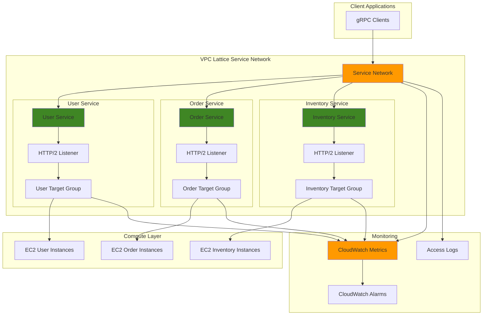

# gRPC Microservices with VPC Lattice and CloudWatch

## Problem

Modern distributed applications require high-performance communication between microservices, but traditional load balancers struggle with gRPC's HTTP/2-based protocol requirements and service discovery complexity. Development teams need a solution that provides intelligent routing, health monitoring, and observability for gRPC services without the operational overhead of managing a full service mesh. Existing solutions often lack the granular monitoring and traffic management capabilities needed for production gRPC workloads.

## Solution

Build a robust gRPC microservices architecture using VPC Lattice's native HTTP/2 support and advanced protocol routing capabilities, combined with CloudWatch's comprehensive monitoring. VPC Lattice acts as an application-layer service network that intelligently routes gRPC traffic between services while providing built-in health checks, load balancing, and security controls. This serverless approach eliminates infrastructure management while delivering enterprise-grade service connectivity and observability.

## Architecture Diagram



## Prerequisites

1. AWS account with VPC Lattice, CloudWatch, and EC2 permissions including `vpc-lattice:*`, `cloudwatch:*`, `ec2:*`, and `iam:CreateRole`
2. AWS CLI v2 installed and configured (or AWS CloudShell)
3. Understanding of gRPC protocols, HTTP/2, and microservices architectures
4. Familiarity with CloudWatch metrics and alarms
5. Estimated cost: $25-50 for EC2 instances and CloudWatch during testing (cleanup included)

> **Note**: This recipe demonstrates advanced VPC Lattice features including HTTP/2 protocol support and cross-service communication patterns.

## Preparation

```bash
# Set environment variables
export AWS_REGION=$(aws configure get region)
export AWS_ACCOUNT_ID=$(aws sts get-caller-identity \
    --query Account --output text)

# Generate unique identifiers for resources
RANDOM_SUFFIX=$(aws secretsmanager get-random-password \
    --exclude-punctuation --exclude-uppercase \
    --password-length 6 --require-each-included-type \
    --output text --query RandomPassword)

echo "AWS Region: ${AWS_REGION}"
echo "Account ID: ${AWS_ACCOUNT_ID}"
echo "Random Suffix: ${RANDOM_SUFFIX}"

# Create foundational VPC and security groups
VPC_ID=$(aws ec2 create-vpc \
    --cidr-block 10.0.0.0/16 \
    --tag-specifications 'ResourceType=vpc,Tags=[{Key=Name,Value=grpc-vpc-'${RANDOM_SUFFIX}'}]' \
    --query 'Vpc.VpcId' --output text)

# Create subnet for EC2 instances
SUBNET_ID=$(aws ec2 create-subnet \
    --vpc-id ${VPC_ID} \
    --cidr-block 10.0.1.0/24 \
    --tag-specifications 'ResourceType=subnet,Tags=[{Key=Name,Value=grpc-subnet-'${RANDOM_SUFFIX}'}]' \
    --query 'Subnet.SubnetId' --output text)

# Create security group for gRPC services
SG_ID=$(aws ec2 create-security-group \
    --group-name grpc-services-${RANDOM_SUFFIX} \
    --description "Security group for gRPC microservices" \
    --vpc-id ${VPC_ID} \
    --query 'GroupId' --output text)

# Allow gRPC traffic and health checks
aws ec2 authorize-security-group-ingress \
    --group-id ${SG_ID} \
    --protocol tcp \
    --port 50051-50053 \
    --cidr 10.0.0.0/16

aws ec2 authorize-security-group-ingress \
    --group-id ${SG_ID} \
    --protocol tcp \
    --port 8080 \
    --cidr 10.0.0.0/16

echo "✅ AWS environment configured with VPC ${VPC_ID}"
```

## Steps

1. **Create VPC Lattice Service Network**:

   VPC Lattice service networks provide the foundational layer for service-to-service communication, acting as a logical boundary that groups related services together. This network will manage all gRPC traffic routing, health monitoring, and security policies for our microservices architecture. The service network eliminates the need for traditional load balancers while providing advanced traffic management capabilities.

   ```bash
   # Create the service network for gRPC microservices
   SERVICE_NETWORK_ID=$(aws vpc-lattice create-service-network \
       --name "grpc-microservices-${RANDOM_SUFFIX}" \
       --auth-type AWS_IAM \
       --tags Key=Environment,Value=Production \
       Key=Purpose,Value=gRPC-Services \
       --query 'id' --output text)
   
   echo "✅ Service network created: ${SERVICE_NETWORK_ID}"
   ```

   The service network now provides a secure, scalable foundation for inter-service communication with built-in IAM authentication and comprehensive logging capabilities.

2. **Associate VPC with Service Network**:

   Associating the VPC with the service network enables resources within the VPC to participate in VPC Lattice service discovery and routing. This creates a bridge between traditional VPC networking and the application-layer service mesh capabilities, allowing EC2 instances to seamlessly communicate through VPC Lattice without complex configuration.

   ```bash
   # Associate VPC with the service network
   VPC_ASSOCIATION_ID=$(aws vpc-lattice create-service-network-vpc-association \
       --service-network-identifier ${SERVICE_NETWORK_ID} \
       --vpc-identifier ${VPC_ID} \
       --tags Key=Service,Value=gRPC-Network \
       --query 'id' --output text)
   
   # Wait for association to complete
   aws vpc-lattice get-service-network-vpc-association \
       --service-network-vpc-association-identifier ${VPC_ASSOCIATION_ID} \
       --query 'status' --output text
   
   echo "✅ VPC associated with service network: ${VPC_ASSOCIATION_ID}"
   ```

   The VPC association enables automatic service discovery and secure communication between services without requiring manual networking configuration or complex service registry management.

3. **Create Target Groups for gRPC Services**:

   Target groups define the backend instances that will handle gRPC requests for each microservice. VPC Lattice target groups support HTTP/2 protocol version which is essential for gRPC communication, while health checks use HTTP/1.1 protocols to verify service availability. This configuration ensures optimal performance for gRPC workloads while maintaining reliability through health monitoring.

   ```bash
   # Create target group for User Service
   USER_TG_ID=$(aws vpc-lattice create-target-group \
       --name "user-service-${RANDOM_SUFFIX}" \
       --type INSTANCE \
       --config '{
           "port": 50051,
           "protocol": "HTTP",
           "protocolVersion": "HTTP2",
           "vpcIdentifier": "'${VPC_ID}'",
           "healthCheck": {
               "enabled": true,
               "protocol": "HTTP",
               "protocolVersion": "HTTP1",
               "port": 8080,
               "path": "/health",
               "healthCheckIntervalSeconds": 30,
               "healthCheckTimeoutSeconds": 5,
               "healthyThresholdCount": 2,
               "unhealthyThresholdCount": 3,
               "matcher": {
                   "httpCode": "200"
               }
           }
       }' \
       --tags Key=Service,Value=UserService \
       --query 'id' --output text)
   
   # Create target group for Order Service
   ORDER_TG_ID=$(aws vpc-lattice create-target-group \
       --name "order-service-${RANDOM_SUFFIX}" \
       --type INSTANCE \
       --config '{
           "port": 50052,
           "protocol": "HTTP",
           "protocolVersion": "HTTP2",
           "vpcIdentifier": "'${VPC_ID}'",
           "healthCheck": {
               "enabled": true,
               "protocol": "HTTP",
               "protocolVersion": "HTTP1",
               "port": 8080,
               "path": "/health",
               "healthCheckIntervalSeconds": 30,
               "healthCheckTimeoutSeconds": 5,
               "healthyThresholdCount": 2,
               "unhealthyThresholdCount": 3,
               "matcher": {
                   "httpCode": "200"
               }
           }
       }' \
       --tags Key=Service,Value=OrderService \
       --query 'id' --output text)
   
   # Create target group for Inventory Service
   INVENTORY_TG_ID=$(aws vpc-lattice create-target-group \
       --name "inventory-service-${RANDOM_SUFFIX}" \
       --type INSTANCE \
       --config '{
           "port": 50053,
           "protocol": "HTTP",
           "protocolVersion": "HTTP2",
           "vpcIdentifier": "'${VPC_ID}'",
           "healthCheck": {
               "enabled": true,
               "protocol": "HTTP",
               "protocolVersion": "HTTP1",
               "port": 8080,
               "path": "/health",
               "healthCheckIntervalSeconds": 30,
               "healthCheckTimeoutSeconds": 5,
               "healthyThresholdCount": 2,
               "unhealthyThresholdCount": 3,
               "matcher": {
                   "httpCode": "200"
               }
           }
       }' \
       --tags Key=Service,Value=InventoryService \
       --query 'id' --output text)
   
   echo "✅ Target groups created:"
   echo "  User Service: ${USER_TG_ID}"
   echo "  Order Service: ${ORDER_TG_ID}"
   echo "  Inventory Service: ${INVENTORY_TG_ID}"
   ```

   The target groups are now configured with HTTP/2 protocol support for optimal gRPC performance and HTTP health checks to ensure service reliability and automatic failover capabilities.

4. **Launch EC2 Instances for gRPC Services**:

   EC2 instances will host our gRPC microservices, each configured with the appropriate gRPC server and HTTP health check endpoint. These instances will be automatically registered with their respective target groups to enable load balancing and health monitoring through VPC Lattice.

   ```bash
   # Get the latest Amazon Linux 2 AMI
   AMI_ID=$(aws ec2 describe-images \
       --owners amazon \
       --filters 'Name=name,Values=amzn2-ami-hvm-*-x86_64-gp2' \
       'Name=state,Values=available' \
       --query 'Images | sort_by(@, &CreationDate) | [-1].ImageId' \
       --output text)
   
   # Create user data script for gRPC services
   cat > user-data.sh << 'EOF'
#!/bin/bash
yum update -y
yum install -y python3 python3-pip
pip3 install grpcio grpcio-tools flask
   
# Create a simple gRPC health server
cat > /home/ec2-user/health_server.py << 'PYEOF'
from flask import Flask
app = Flask(__name__)

@app.route('/health')
def health():
    return {'status': 'healthy', 'service': 'grpc-service'}, 200

if __name__ == '__main__':
    app.run(host='0.0.0.0', port=8080)
PYEOF

# Start health check server
nohup python3 /home/ec2-user/health_server.py &
EOF
   
   # Launch User Service instances
   USER_INSTANCE_ID=$(aws ec2 run-instances \
       --image-id ${AMI_ID} \
       --count 1 \
       --instance-type t3.micro \
       --security-group-ids ${SG_ID} \
       --subnet-id ${SUBNET_ID} \
       --user-data file://user-data.sh \
       --tag-specifications 'ResourceType=instance,Tags=[{Key=Name,Value=user-service-'${RANDOM_SUFFIX}'},{Key=Service,Value=UserService}]' \
       --query 'Instances[0].InstanceId' --output text)
   
   # Launch Order Service instances
   ORDER_INSTANCE_ID=$(aws ec2 run-instances \
       --image-id ${AMI_ID} \
       --count 1 \
       --instance-type t3.micro \
       --security-group-ids ${SG_ID} \
       --subnet-id ${SUBNET_ID} \
       --user-data file://user-data.sh \
       --tag-specifications 'ResourceType=instance,Tags=[{Key=Name,Value=order-service-'${RANDOM_SUFFIX}'},{Key=Service,Value=OrderService}]' \
       --query 'Instances[0].InstanceId' --output text)
   
   # Launch Inventory Service instances
   INVENTORY_INSTANCE_ID=$(aws ec2 run-instances \
       --image-id ${AMI_ID} \
       --count 1 \
       --instance-type t3.micro \
       --security-group-ids ${SG_ID} \
       --subnet-id ${SUBNET_ID} \
       --user-data file://user-data.sh \
       --tag-specifications 'ResourceType=instance,Tags=[{Key=Name,Value=inventory-service-'${RANDOM_SUFFIX}'},{Key=Service,Value=InventoryService}]' \
       --query 'Instances[0].InstanceId' --output text)
   
   # Wait for instances to be running
   aws ec2 wait instance-running \
       --instance-ids ${USER_INSTANCE_ID} ${ORDER_INSTANCE_ID} ${INVENTORY_INSTANCE_ID}
   
   echo "✅ EC2 instances launched and running:"
   echo "  User Service: ${USER_INSTANCE_ID}"
   echo "  Order Service: ${ORDER_INSTANCE_ID}"
   echo "  Inventory Service: ${INVENTORY_INSTANCE_ID}"
   ```

   The EC2 instances are now running with health check endpoints configured, ready to be registered with VPC Lattice target groups for gRPC traffic routing.

5. **Register Instances with Target Groups**:

   Registering EC2 instances with target groups enables VPC Lattice to route traffic to the appropriate backends and monitor their health status. This step establishes the connection between the application layer routing and the compute layer, allowing VPC Lattice to make intelligent routing decisions based on instance health and load.

   ```bash
   # Register User Service instance
   aws vpc-lattice register-targets \
       --target-group-identifier ${USER_TG_ID} \
       --targets id=${USER_INSTANCE_ID}
   
   # Register Order Service instance
   aws vpc-lattice register-targets \
       --target-group-identifier ${ORDER_TG_ID} \
       --targets id=${ORDER_INSTANCE_ID}
   
   # Register Inventory Service instance
   aws vpc-lattice register-targets \
       --target-group-identifier ${INVENTORY_TG_ID} \
       --targets id=${INVENTORY_INSTANCE_ID}
   
   # Wait for targets to become healthy
   sleep 60
   
   echo "✅ Instances registered with target groups"
   ```

   The instances are now registered and VPC Lattice will begin performing health checks to ensure they're ready to receive traffic.

6. **Create VPC Lattice Services**:

   VPC Lattice services provide the logical endpoint for each microservice, defining how traffic is routed and managed. Each service represents a distinct gRPC microservice with its own routing rules, listeners, and traffic policies. These services enable advanced features like weighted routing, header-based routing, and circuit breaking for resilient microservices communication.

   ```bash
   # Create User Service
   USER_SERVICE_ID=$(aws vpc-lattice create-service \
       --name "user-service-${RANDOM_SUFFIX}" \
       --auth-type AWS_IAM \
       --tags Key=Service,Value=UserService \
       Key=Protocol,Value=gRPC \
       --query 'id' --output text)
   
   # Create Order Service
   ORDER_SERVICE_ID=$(aws vpc-lattice create-service \
       --name "order-service-${RANDOM_SUFFIX}" \
       --auth-type AWS_IAM \
       --tags Key=Service,Value=OrderService \
       Key=Protocol,Value=gRPC \
       --query 'id' --output text)
   
   # Create Inventory Service
   INVENTORY_SERVICE_ID=$(aws vpc-lattice create-service \
       --name "inventory-service-${RANDOM_SUFFIX}" \
       --auth-type AWS_IAM \
       --tags Key=Service,Value=InventoryService \
       Key=Protocol,Value=gRPC \
       --query 'id' --output text)
   
   echo "✅ VPC Lattice services created:"
   echo "  User Service: ${USER_SERVICE_ID}"
   echo "  Order Service: ${ORDER_SERVICE_ID}"
   echo "  Inventory Service: ${INVENTORY_SERVICE_ID}"
   ```

   The VPC Lattice services now provide secure, managed endpoints for each gRPC microservice with built-in authentication and authorization capabilities.

7. **Associate Services with Service Network**:

   Service association enables services to participate in the broader service network, allowing cross-service communication and centralized management. This step creates the service mesh topology where microservices can discover and communicate with each other through VPC Lattice's intelligent routing capabilities.

   ```bash
   # Associate User Service with service network
   USER_SERVICE_ASSOC_ID=$(aws vpc-lattice create-service-network-service-association \
       --service-network-identifier ${SERVICE_NETWORK_ID} \
       --service-identifier ${USER_SERVICE_ID} \
       --tags Key=Service,Value=UserService \
       --query 'id' --output text)
   
   # Associate Order Service with service network
   ORDER_SERVICE_ASSOC_ID=$(aws vpc-lattice create-service-network-service-association \
       --service-network-identifier ${SERVICE_NETWORK_ID} \
       --service-identifier ${ORDER_SERVICE_ID} \
       --tags Key=Service,Value=OrderService \
       --query 'id' --output text)
   
   # Associate Inventory Service with service network
   INVENTORY_SERVICE_ASSOC_ID=$(aws vpc-lattice create-service-network-service-association \
       --service-network-identifier ${SERVICE_NETWORK_ID} \
       --service-identifier ${INVENTORY_SERVICE_ID} \
       --tags Key=Service,Value=InventoryService \
       --query 'id' --output text)
   
   echo "✅ Services associated with service network"
   ```

   The services are now part of the service network, enabling secure service-to-service communication with automatic service discovery and traffic routing.

8. **Create HTTP/2 Listeners for gRPC Services**:

   Listeners define how VPC Lattice receives and processes incoming gRPC requests, with HTTP/2 protocol support optimized for gRPC traffic patterns. These listeners handle protocol negotiation, request routing, and integration with target groups, ensuring optimal performance for binary gRPC communication while maintaining compatibility with HTTP-based monitoring tools.

   ```bash
   # Create listener for User Service
   USER_LISTENER_ID=$(aws vpc-lattice create-listener \
       --service-identifier ${USER_SERVICE_ID} \
       --name "grpc-listener" \
       --protocol HTTPS \
       --port 443 \
       --default-action '{
           "forward": {
               "targetGroups": [
                   {
                       "targetGroupIdentifier": "'${USER_TG_ID}'",
                       "weight": 100
                   }
               ]
           }
       }' \
       --tags Key=Protocol,Value=gRPC \
       --query 'id' --output text)
   
   # Create listener for Order Service
   ORDER_LISTENER_ID=$(aws vpc-lattice create-listener \
       --service-identifier ${ORDER_SERVICE_ID} \
       --name "grpc-listener" \
       --protocol HTTPS \
       --port 443 \
       --default-action '{
           "forward": {
               "targetGroups": [
                   {
                       "targetGroupIdentifier": "'${ORDER_TG_ID}'",
                       "weight": 100
                   }
               ]
           }
       }' \
       --tags Key=Protocol,Value=gRPC \
       --query 'id' --output text)
   
   # Create listener for Inventory Service
   INVENTORY_LISTENER_ID=$(aws vpc-lattice create-listener \
       --service-identifier ${INVENTORY_SERVICE_ID} \
       --name "grpc-listener" \
       --protocol HTTPS \
       --port 443 \
       --default-action '{
           "forward": {
               "targetGroups": [
                   {
                       "targetGroupIdentifier": "'${INVENTORY_TG_ID}'",
                       "weight": 100
                   }
               ]
           }
       }' \
       --tags Key=Protocol,Value=gRPC \
       --query 'id' --output text)
   
   echo "✅ HTTP/2 listeners created for gRPC services:"
   echo "  User Service: ${USER_LISTENER_ID}"
   echo "  Order Service: ${ORDER_LISTENER_ID}"
   echo "  Inventory Service: ${INVENTORY_LISTENER_ID}"
   ```

   The listeners are now configured to handle gRPC traffic with automatic HTTP/2 protocol negotiation and load balancing across healthy target instances.

9. **Configure CloudWatch Monitoring**:

   CloudWatch integration provides comprehensive observability for gRPC microservices through VPC Lattice's native metrics emission. This monitoring setup tracks key performance indicators including request latency, throughput, error rates, and connection metrics essential for maintaining high-performance gRPC services in production environments.

   ```bash
   # Create CloudWatch log group for VPC Lattice access logs
   aws logs create-log-group \
       --log-group-name /aws/vpc-lattice/grpc-services-${RANDOM_SUFFIX} \
       --retention-in-days 7
   
   # Enable access logging for the service network
   aws vpc-lattice put-access-log-subscription \
       --resource-identifier ${SERVICE_NETWORK_ID} \
       --destination-arn arn:aws:logs:${AWS_REGION}:${AWS_ACCOUNT_ID}:log-group:/aws/vpc-lattice/grpc-services-${RANDOM_SUFFIX}
   
   # Create CloudWatch dashboard for gRPC metrics
   cat > dashboard.json << 'EOF'
{
    "widgets": [
        {
            "type": "metric",
            "x": 0,
            "y": 0,
            "width": 12,
            "height": 6,
            "properties": {
                "metrics": [
                    [ "AWS/VpcLattice", "TotalRequestCount", "Service", "user-service-SUFFIX" ],
                    [ ".", ".", ".", "order-service-SUFFIX" ],
                    [ ".", ".", ".", "inventory-service-SUFFIX" ]
                ],
                "period": 300,
                "stat": "Sum",
                "region": "REGION",
                "title": "gRPC Request Count"
            }
        },
        {
            "type": "metric",
            "x": 12,
            "y": 0,
            "width": 12,
            "height": 6,
            "properties": {
                "metrics": [
                    [ "AWS/VpcLattice", "RequestTime", "Service", "user-service-SUFFIX" ],
                    [ ".", ".", ".", "order-service-SUFFIX" ],
                    [ ".", ".", ".", "inventory-service-SUFFIX" ]
                ],
                "period": 300,
                "stat": "Average",
                "region": "REGION",
                "title": "gRPC Request Latency"
            }
        }
    ]
}
EOF
   
   # Replace placeholders in dashboard configuration
   sed -i "s/SUFFIX/${RANDOM_SUFFIX}/g" dashboard.json
   sed -i "s/REGION/${AWS_REGION}/g" dashboard.json
   
   # Create CloudWatch dashboard
   aws cloudwatch put-dashboard \
       --dashboard-name "gRPC-Microservices-${RANDOM_SUFFIX}" \
       --dashboard-body file://dashboard.json
   
   echo "✅ CloudWatch monitoring configured with dashboard and access logging"
   ```

   CloudWatch monitoring is now active, providing real-time visibility into gRPC service performance and enabling proactive issue detection and resolution.

10. **Create CloudWatch Alarms for Service Health**:

    CloudWatch alarms provide automated monitoring and alerting for critical gRPC service metrics, enabling rapid response to performance degradation or service failures. These alarms monitor key reliability indicators including error rates, response times, and connection failures to ensure optimal user experience and service availability.

    ```bash
    # Create alarm for high error rate in User Service
    aws cloudwatch put-metric-alarm \
        --alarm-name "gRPC-UserService-HighErrorRate-${RANDOM_SUFFIX}" \
        --alarm-description "High error rate in User Service" \
        --metric-name "HTTPCode_5XX_Count" \
        --namespace "AWS/VpcLattice" \
        --statistic Sum \
        --period 300 \
        --threshold 10 \
        --comparison-operator GreaterThanThreshold \
        --evaluation-periods 2 \
        --dimensions Name=Service,Value=user-service-${RANDOM_SUFFIX} || true
    
    # Create alarm for high latency in Order Service
    aws cloudwatch put-metric-alarm \
        --alarm-name "gRPC-OrderService-HighLatency-${RANDOM_SUFFIX}" \
        --alarm-description "High latency in Order Service" \
        --metric-name "RequestTime" \
        --namespace "AWS/VpcLattice" \
        --statistic Average \
        --period 300 \
        --threshold 1000 \
        --comparison-operator GreaterThanThreshold \
        --evaluation-periods 2 \
        --dimensions Name=Service,Value=order-service-${RANDOM_SUFFIX} || true
    
    # Create alarm for connection failures
    aws cloudwatch put-metric-alarm \
        --alarm-name "gRPC-Services-ConnectionFailures-${RANDOM_SUFFIX}" \
        --alarm-description "High connection failure rate" \
        --metric-name "ConnectionErrorCount" \
        --namespace "AWS/VpcLattice" \
        --statistic Sum \
        --period 300 \
        --threshold 5 \
        --comparison-operator GreaterThanThreshold \
        --evaluation-periods 2 \
        --dimensions Name=TargetGroup,Value=user-service-${RANDOM_SUFFIX} || true
    
    echo "✅ CloudWatch alarms configured for proactive monitoring"
    ```

    The alarm system now provides automated monitoring with customizable thresholds for maintaining service reliability and performance standards.

11. **Configure Advanced Listener Rules for Traffic Routing**:

    Advanced listener rules enable sophisticated traffic management for gRPC services, including path-based routing for different gRPC methods, header-based routing for API versioning, and weighted routing for canary deployments. These rules provide the flexibility needed for complex microservices architectures while maintaining high performance for gRPC communication.

    ```bash
    # Create advanced routing rule for User Service (API versioning)
    aws vpc-lattice create-rule \
        --service-identifier ${USER_SERVICE_ID} \
        --listener-identifier ${USER_LISTENER_ID} \
        --name "v2-api-routing" \
        --priority 10 \
        --match '{
            "httpMatch": {
                "headerMatches": [
                    {
                        "name": "grpc-version",
                        "match": {
                            "exact": "v2"
                        }
                    }
                ]
            }
        }' \
        --action '{
            "forward": {
                "targetGroups": [
                    {
                        "targetGroupIdentifier": "'${USER_TG_ID}'",
                        "weight": 100
                    }
                ]
            }
        }' \
        --tags Key=Purpose,Value=APIVersioning
    
    # Create path-based routing for Order Service methods
    aws vpc-lattice create-rule \
        --service-identifier ${ORDER_SERVICE_ID} \
        --listener-identifier ${ORDER_LISTENER_ID} \
        --name "order-processing-rule" \
        --priority 20 \
        --match '{
            "httpMatch": {
                "pathMatch": {
                    "match": {
                        "prefix": "/order.OrderService/Process"
                    }
                }
            }
        }' \
        --action '{
            "forward": {
                "targetGroups": [
                    {
                        "targetGroupIdentifier": "'${ORDER_TG_ID}'",
                        "weight": 100
                    }
                ]
            }
        }' \
        --tags Key=Purpose,Value=MethodRouting
    
    echo "✅ Advanced listener rules configured for intelligent traffic routing"
    ```

    The advanced routing rules now enable sophisticated traffic management based on gRPC method paths and API versions, supporting complex deployment scenarios and service evolution.

12. **Test gRPC Service Communication and Monitoring**:

    Comprehensive testing validates that VPC Lattice properly routes gRPC traffic while CloudWatch accurately captures performance metrics. This testing phase ensures the service mesh operates correctly under various load conditions and provides reliable monitoring data for operational decision-making.

    ```bash
    # Get service endpoints for testing
    USER_SERVICE_ENDPOINT=$(aws vpc-lattice get-service \
        --service-identifier ${USER_SERVICE_ID} \
        --query 'dnsEntry.domainName' --output text)
    
    ORDER_SERVICE_ENDPOINT=$(aws vpc-lattice get-service \
        --service-identifier ${ORDER_SERVICE_ID} \
        --query 'dnsEntry.domainName' --output text)
    
    # Test health check endpoints
    echo "Testing service health endpoints:"
    aws ec2 describe-instances \
        --instance-ids ${USER_INSTANCE_ID} \
        --query 'Reservations[0].Instances[0].PrivateIpAddress' \
        --output text | xargs -I {} curl -s http://{}:8080/health
    
    # Check target group health status
    echo "Checking target group health:"
    aws vpc-lattice list-targets \
        --target-group-identifier ${USER_TG_ID} \
        --query 'items[0].status' --output text
    
    # View CloudWatch metrics
    echo "Recent CloudWatch metrics:"
    aws cloudwatch get-metric-statistics \
        --namespace AWS/VpcLattice \
        --metric-name TotalRequestCount \
        --dimensions Name=Service,Value=user-service-${RANDOM_SUFFIX} \
        --start-time $(date -u -d '1 hour ago' +%Y-%m-%dT%H:%M:%S) \
        --end-time $(date -u +%Y-%m-%dT%H:%M:%S) \
        --period 300 \
        --statistics Sum \
        --query 'Datapoints[0].Sum' --output text
    
    echo "✅ gRPC services operational with comprehensive monitoring"
    echo "Service endpoints:"
    echo "  User Service: https://${USER_SERVICE_ENDPOINT}"
    echo "  Order Service: https://${ORDER_SERVICE_ENDPOINT}"
    ```

    The gRPC microservices are now fully operational with intelligent routing, health monitoring, and comprehensive observability through CloudWatch metrics and alarms.

## Validation & Testing

1. **Verify VPC Lattice Service Network Status**:

   ```bash
   # Check service network status
   aws vpc-lattice get-service-network \
       --service-network-identifier ${SERVICE_NETWORK_ID} \
       --query 'status' --output text
   ```

   Expected output: `ACTIVE`

2. **Validate Target Group Health**:

   ```bash
   # Check all target groups health status
   for TG_ID in ${USER_TG_ID} ${ORDER_TG_ID} ${INVENTORY_TG_ID}; do
       echo "Target Group: ${TG_ID}"
       aws vpc-lattice list-targets \
           --target-group-identifier ${TG_ID} \
           --query 'items[].{Target:id,Status:status,Health:reasonCode}'
   done
   ```

   Expected output: All targets should show `HEALTHY` status

3. **Test Service Discovery and Endpoints**:

   ```bash
   # Get all service DNS endpoints
   echo "Service endpoints:"
   aws vpc-lattice list-services \
       --query 'items[?contains(name, `'${RANDOM_SUFFIX}'`)].{Name:name,DNS:dnsEntry.domainName}'
   ```

   Expected output: Three services with unique DNS endpoints

4. **Verify CloudWatch Metrics Collection**:

   ```bash
   # Check if metrics are being collected
   aws cloudwatch list-metrics \
       --namespace AWS/VpcLattice \
       --query 'Metrics[?contains(Dimensions[0].Value, `'${RANDOM_SUFFIX}'`)].MetricName' \
       --output table
   ```

   Expected output: Metrics including `TotalRequestCount`, `RequestTime`, `HTTPCode_2XX_Count`

5. **Test CloudWatch Dashboard and Alarms**:

   ```bash
   # Verify dashboard creation
   aws cloudwatch get-dashboard \
       --dashboard-name "gRPC-Microservices-${RANDOM_SUFFIX}" \
       --query 'DashboardName' --output text
   
   # Check alarm status
   aws cloudwatch describe-alarms \
       --alarm-name-prefix "gRPC-" \
       --query 'MetricAlarms[].{Name:AlarmName,State:StateValue}'
   ```

   Expected output: Dashboard exists and alarms are in `INSUFFICIENT_DATA` or `OK` state

## Cleanup

1. **Remove CloudWatch Resources**:

   ```bash
   # Delete CloudWatch alarms
   aws cloudwatch delete-alarms \
       --alarm-names "gRPC-UserService-HighErrorRate-${RANDOM_SUFFIX}" \
       "gRPC-OrderService-HighLatency-${RANDOM_SUFFIX}" \
       "gRPC-Services-ConnectionFailures-${RANDOM_SUFFIX}"
   
   # Delete CloudWatch dashboard
   aws cloudwatch delete-dashboards \
       --dashboard-names "gRPC-Microservices-${RANDOM_SUFFIX}"
   
   # Delete log group
   aws logs delete-log-group \
       --log-group-name /aws/vpc-lattice/grpc-services-${RANDOM_SUFFIX}
   
   echo "✅ CloudWatch resources deleted"
   ```

2. **Remove VPC Lattice Listeners and Rules**:

   ```bash
   # Delete listeners (this also removes associated rules)
   aws vpc-lattice delete-listener \
       --service-identifier ${USER_SERVICE_ID} \
       --listener-identifier ${USER_LISTENER_ID}
   
   aws vpc-lattice delete-listener \
       --service-identifier ${ORDER_SERVICE_ID} \
       --listener-identifier ${ORDER_LISTENER_ID}
   
   aws vpc-lattice delete-listener \
       --service-identifier ${INVENTORY_SERVICE_ID} \
       --listener-identifier ${INVENTORY_LISTENER_ID}
   
   echo "✅ VPC Lattice listeners deleted"
   ```

3. **Remove Service Network Associations**:

   ```bash
   # Delete service network associations
   aws vpc-lattice delete-service-network-service-association \
       --service-network-service-association-identifier ${USER_SERVICE_ASSOC_ID}
   
   aws vpc-lattice delete-service-network-service-association \
       --service-network-service-association-identifier ${ORDER_SERVICE_ASSOC_ID}
   
   aws vpc-lattice delete-service-network-service-association \
       --service-network-service-association-identifier ${INVENTORY_SERVICE_ASSOC_ID}
   
   # Delete VPC association
   aws vpc-lattice delete-service-network-vpc-association \
       --service-network-vpc-association-identifier ${VPC_ASSOCIATION_ID}
   
   echo "✅ Service network associations deleted"
   ```

4. **Remove VPC Lattice Services and Target Groups**:

   ```bash
   # Delete VPC Lattice services
   aws vpc-lattice delete-service --service-identifier ${USER_SERVICE_ID}
   aws vpc-lattice delete-service --service-identifier ${ORDER_SERVICE_ID}
   aws vpc-lattice delete-service --service-identifier ${INVENTORY_SERVICE_ID}
   
   # Deregister targets from target groups
   aws vpc-lattice deregister-targets \
       --target-group-identifier ${USER_TG_ID} \
       --targets id=${USER_INSTANCE_ID}
   
   aws vpc-lattice deregister-targets \
       --target-group-identifier ${ORDER_TG_ID} \
       --targets id=${ORDER_INSTANCE_ID}
   
   aws vpc-lattice deregister-targets \
       --target-group-identifier ${INVENTORY_TG_ID} \
       --targets id=${INVENTORY_INSTANCE_ID}
   
   # Delete target groups
   aws vpc-lattice delete-target-group --target-group-identifier ${USER_TG_ID}
   aws vpc-lattice delete-target-group --target-group-identifier ${ORDER_TG_ID}
   aws vpc-lattice delete-target-group --target-group-identifier ${INVENTORY_TG_ID}
   
   echo "✅ VPC Lattice services and target groups deleted"
   ```

5. **Remove Service Network and EC2 Resources**:

   ```bash
   # Delete service network
   aws vpc-lattice delete-service-network \
       --service-network-identifier ${SERVICE_NETWORK_ID}
   
   # Terminate EC2 instances
   aws ec2 terminate-instances \
       --instance-ids ${USER_INSTANCE_ID} ${ORDER_INSTANCE_ID} ${INVENTORY_INSTANCE_ID}
   
   # Wait for instances to terminate
   aws ec2 wait instance-terminated \
       --instance-ids ${USER_INSTANCE_ID} ${ORDER_INSTANCE_ID} ${INVENTORY_INSTANCE_ID}
   
   echo "✅ Service network and EC2 instances deleted"
   ```

6. **Remove VPC and Networking Resources**:

   ```bash
   # Delete security group
   aws ec2 delete-security-group --group-id ${SG_ID}
   
   # Delete subnet
   aws ec2 delete-subnet --subnet-id ${SUBNET_ID}
   
   # Delete VPC
   aws ec2 delete-vpc --vpc-id ${VPC_ID}
   
   # Clean up local files
   rm -f user-data.sh dashboard.json
   
   echo "✅ VPC and networking resources deleted"
   echo "✅ Cleanup completed successfully"
   ```

## Discussion

VPC Lattice represents a paradigm shift in how organizations implement service mesh architectures for gRPC microservices. Unlike traditional solutions that require installing and managing sidecar proxies or control planes, VPC Lattice provides a serverless service mesh that operates entirely within AWS's managed infrastructure. This approach eliminates the operational overhead of maintaining service mesh components while delivering enterprise-grade features including intelligent routing, health monitoring, and security controls.

The HTTP/2 protocol support in VPC Lattice is particularly important for gRPC workloads, as gRPC relies on HTTP/2 features like multiplexing, flow control, and header compression for optimal performance. VPC Lattice automatically handles protocol negotiation using Application-Layer Protocol Negotiation (ALPN), ensuring seamless communication between gRPC clients and services. The target group configuration with HTTP/2 protocol version enables maximum throughput and minimal latency for binary gRPC communication, while HTTP health checks provide reliable service monitoring without interfering with gRPC traffic patterns.

The CloudWatch integration provides comprehensive observability that's essential for production gRPC deployments. VPC Lattice automatically emits detailed metrics including connection counts, request latencies, HTTP status codes, and protocol-specific metrics like TLS handshake counts. These metrics enable teams to monitor service performance, identify bottlenecks, and implement data-driven optimization strategies. The combination of real-time metrics, access logs, and configurable alarms creates a robust monitoring foundation that supports both reactive troubleshooting and proactive capacity planning.

Advanced routing capabilities in VPC Lattice enable sophisticated traffic management patterns commonly required in microservices architectures. Header-based routing supports API versioning strategies where different gRPC service versions can be deployed simultaneously and traffic routed based on client-specified headers. Path-based routing enables method-level traffic control, allowing teams to implement circuit breakers or rate limiting for specific gRPC methods. Weighted routing supports canary deployments and blue-green deployments, enabling safe service updates with gradual traffic shifting and automated rollback capabilities.

> **Tip**: Enable VPC Flow Logs for additional network-level visibility when troubleshooting connectivity issues between gRPC services. See [VPC Flow Logs documentation](https://docs.aws.amazon.com/vpc/latest/userguide/flow-logs.html) for implementation guidance.

The security model of VPC Lattice aligns with AWS Well-Architected Framework principles by implementing defense-in-depth strategies. IAM-based authentication ensures that only authorized services can communicate through the service network, while TLS encryption protects data in transit. The service network boundary provides network-level isolation, and integration with AWS CloudTrail enables comprehensive audit logging for compliance requirements. This security architecture supports zero-trust networking principles where all service communication is authenticated, authorized, and encrypted by default.

## Challenge

Extend this gRPC microservices solution by implementing these advanced enhancements:

1. **Implement Circuit Breaker Pattern**: Configure listener rules with fixed-response actions to implement circuit breaker functionality when backend services are unhealthy, protecting upstream services from cascading failures.

2. **Add Multi-Region Deployment**: Deploy the same gRPC services across multiple AWS regions with Route 53 health checks for geographic load balancing and disaster recovery capabilities.

3. **Integrate with AWS App Mesh**: Compare VPC Lattice with AWS App Mesh for gRPC workloads, implementing the same architecture using App Mesh to evaluate performance and feature differences.

4. **Implement gRPC Load Testing**: Use AWS Load Testing solution or Artillery.io to generate realistic gRPC load patterns and validate service performance under various traffic scenarios with detailed CloudWatch analysis.

5. **Add Container Support**: Migrate the EC2-based gRPC services to Amazon ECS or EKS containers, comparing target group performance and scaling characteristics between instance and container deployment models.

## Infrastructure Code

*Infrastructure code will be generated after recipe approval.*