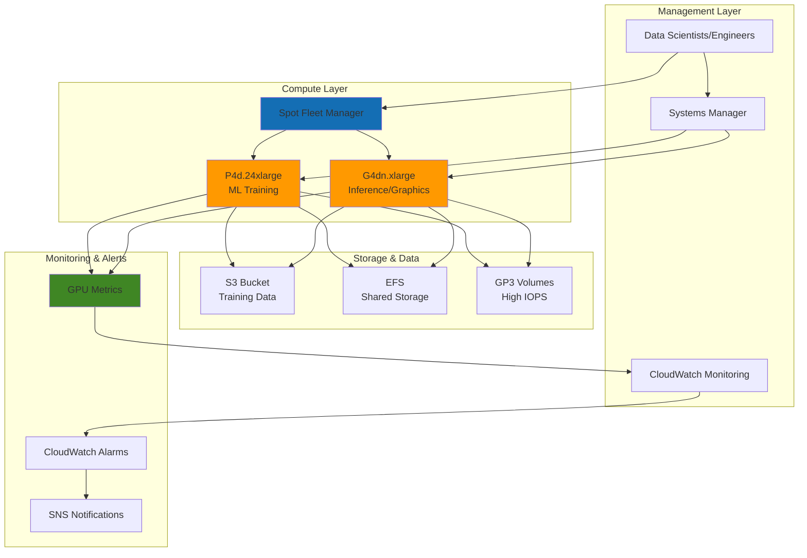

# High-Performance GPU Computing Workloads

## Problem

Organizations running machine learning training workloads, high-performance computing simulations, and GPU-intensive applications face significant challenges with traditional CPU-based computing infrastructure. These workloads require massive parallel processing capabilities that can take days or weeks to complete on standard instances, resulting in project delays, increased costs, and reduced research velocity. Additionally, teams struggle with complex GPU driver management, cost optimization strategies, and performance monitoring for their accelerated computing environments.

## Solution

Deploy GPU-accelerated EC2 instances using P4 instances for ML training and HPC workloads, and G4 instances for graphics workstations and inference tasks. This solution implements automated GPU driver installation, cost-optimized Spot Fleet configurations, comprehensive performance monitoring, and intelligent scaling strategies to maximize compute efficiency while minimizing operational overhead and infrastructure costs.

## Architecture Diagram



## Prerequisites

1. AWS account with appropriate permissions for EC2, CloudWatch, Systems Manager, and SNS
2. AWS CLI v2 installed and configured (or AWS CloudShell)
3. Understanding of GPU computing concepts and CUDA programming
4. Knowledge of machine learning frameworks (PyTorch, TensorFlow) and HPC applications
5. Estimated cost: $50-200 for P4 instances, $5-20 for G4 instances during testing (varies by region and usage)

> **Warning**: GPU instances are significantly more expensive than standard instances. Always terminate resources when not in use to avoid unexpected charges.

## Preparation

```bash
# Set environment variables
export AWS_REGION=$(aws configure get region)
export AWS_ACCOUNT_ID=$(aws sts get-caller-identity \
    --query Account --output text)

# Generate unique identifiers for resources
RANDOM_SUFFIX=$(aws secretsmanager get-random-password \
    --exclude-punctuation --exclude-uppercase \
    --password-length 6 --require-each-included-type \
    --output text --query RandomPassword)

export GPU_FLEET_NAME="gpu-workload-fleet-${RANDOM_SUFFIX}"
export GPU_KEYPAIR_NAME="gpu-workload-key-${RANDOM_SUFFIX}"
export GPU_SECURITY_GROUP="gpu-workload-sg-${RANDOM_SUFFIX}"
export GPU_IAM_ROLE="gpu-workload-role-${RANDOM_SUFFIX}"
export GPU_SNS_TOPIC="gpu-workload-alerts-${RANDOM_SUFFIX}"

# Get default VPC and subnet information
export DEFAULT_VPC=$(aws ec2 describe-vpcs \
    --filters "Name=is-default,Values=true" \
    --query "Vpcs[0].VpcId" --output text)

export DEFAULT_SUBNET=$(aws ec2 describe-subnets \
    --filters "Name=vpc-id,Values=${DEFAULT_VPC}" \
    "Name=default-for-az,Values=true" \
    --query "Subnets[0].SubnetId" --output text)

echo "✅ Environment variables configured"
echo "VPC: ${DEFAULT_VPC}, Subnet: ${DEFAULT_SUBNET}"
```

## Steps

1. **Create Security Group for GPU Instances**:

   Security groups act as virtual firewalls for EC2 instances, controlling inbound and outbound traffic. For GPU workloads, we need to enable SSH access for administration, and port 8888 for Jupyter notebook access, which is commonly used for machine learning development. Creating a dedicated security group follows the principle of least privilege by only allowing necessary traffic for GPU computing tasks.

   ```bash
   # Create security group for GPU workloads
   SECURITY_GROUP_ID=$(aws ec2 create-security-group \
       --group-name ${GPU_SECURITY_GROUP} \
       --description "Security group for GPU workloads" \
       --vpc-id ${DEFAULT_VPC} \
       --output text --query GroupId)
   
   # Allow SSH access (restrict source as needed)
   aws ec2 authorize-securitygroup-ingress \
       --group-id ${SECURITY_GROUP_ID} \
       --protocol tcp --port 22 \
       --cidr 0.0.0.0/0
   
   # Allow Jupyter/TensorBoard access
   aws ec2 authorize-securitygroup-ingress \
       --group-id ${SECURITY_GROUP_ID} \
       --protocol tcp --port 8888 \
       --source-group ${SECURITY_GROUP_ID}
   
   echo "✅ Security group created: ${SECURITY_GROUP_ID}"
   ```

   The security group is now established with appropriate ingress rules for GPU instance management. This network security foundation enables secure remote access while protecting your GPU instances from unauthorized traffic, a critical requirement for expensive compute resources.

2. **Create Key Pair for SSH Access**:

   AWS key pairs provide secure SSH access to EC2 instances using public key cryptography. For GPU instances, reliable SSH access is essential for troubleshooting, performance monitoring, and installing additional software packages. Generating a new key pair ensures you have exclusive access to your expensive GPU compute resources and follows security best practices.

   ```bash
   # Create key pair for GPU instances
   aws ec2 create-key-pair \
       --key-name ${GPU_KEYPAIR_NAME} \
       --key-type rsa --key-format pem \
       --query "KeyMaterial" --output text \
       > ${GPU_KEYPAIR_NAME}.pem
   
   # Set correct permissions
   chmod 400 ${GPU_KEYPAIR_NAME}.pem
   
   echo "✅ Key pair created: ${GPU_KEYPAIR_NAME}.pem"
   ```

   The private key is now stored locally with secure permissions (400), ensuring only you can access your GPU instances. This SSH access mechanism is crucial for managing expensive GPU resources and monitoring machine learning workloads in real-time.

3. **Create IAM Role for GPU Instances**:

   IAM roles enable secure, temporary credential delegation without hardcoding secrets in application code. For GPU instances, we need permissions for Systems Manager (for secure management), CloudWatch (for monitoring GPU metrics), and other AWS services. This principle of least privilege ensures instances access only the specific AWS resources they need for GPU workload management.

   ```bash
   # Create trust policy for EC2
   cat > gpu-trust-policy.json << 'EOF'
   {
       "Version": "2012-10-17",
       "Statement": [
           {
               "Effect": "Allow",
               "Principal": {
                   "Service": "ec2.amazonaws.com"
               },
               "Action": "sts:AssumeRole"
           }
       ]
   }
   EOF
   
   # Create IAM role
   aws iam create-role \
       --role-name ${GPU_IAM_ROLE} \
       --assume-role-policy-document file://gpu-trust-policy.json
   
   # Attach necessary policies
   aws iam attach-role-policy \
       --role-name ${GPU_IAM_ROLE} \
       --policy-arn arn:aws:iam::aws:policy/AmazonSSMManagedInstanceCore
   
   aws iam attach-role-policy \
       --role-name ${GPU_IAM_ROLE} \
       --policy-arn arn:aws:iam::aws:policy/CloudWatchAgentServerPolicy
   
   # Create instance profile
   aws iam create-instance-profile \
       --instance-profile-name ${GPU_IAM_ROLE}
   
   aws iam add-role-to-instance-profile \
       --instance-profile-name ${GPU_IAM_ROLE} \
       --role-name ${GPU_IAM_ROLE}
   
   echo "✅ IAM role and instance profile created"
   ```

   The IAM role and instance profile are now configured with appropriate permissions for GPU workload management. This security foundation enables your instances to publish GPU metrics to CloudWatch and utilize Systems Manager for secure administration without requiring permanent AWS credentials.

4. **Create SNS Topic for Monitoring Alerts**:

   Amazon SNS provides reliable notification delivery for critical GPU monitoring alerts. GPU instances are expensive resources that require proactive monitoring for temperature spikes, low utilization (cost optimization), and performance anomalies. Setting up SNS notifications ensures immediate awareness of issues that could impact training jobs or incur unnecessary costs.

   ```bash
   # Create SNS topic for GPU monitoring alerts
   GPU_SNS_ARN=$(aws sns create-topic \
       --name ${GPU_SNS_TOPIC} \
       --output text --query TopicArn)
   
   # Subscribe email to SNS topic (replace with your email)
   read -p "Enter email for GPU alerts: " USER_EMAIL
   aws sns subscribe \
       --topic-arn ${GPU_SNS_ARN} \
       --protocol email \
       --notification-endpoint ${USER_EMAIL}
   
   echo "✅ SNS topic created: ${GPU_SNS_ARN}"
   echo "Please confirm subscription in your email"
   ```

   The SNS topic is now configured for GPU monitoring alerts, providing a communication channel for automated notifications. This notification system is essential for managing expensive GPU resources and ensuring optimal utilization of your accelerated computing infrastructure.

5. **Create User Data Script for GPU Setup**:

   User data scripts enable automated instance configuration during launch, eliminating manual setup overhead. For GPU instances, this script installs NVIDIA drivers, configures Docker with GPU support, sets up machine learning frameworks, and establishes CloudWatch monitoring. This automation ensures consistent environments and reduces the time to productive GPU computing.

   ```bash
   # Create comprehensive user data script
   cat > gpu-userdata.sh << 'EOF'
   #!/bin/bash
   yum update -y
   yum install -y awscli
   
   # Install NVIDIA drivers
   aws s3 cp --recursive \
       s3://ec2-linux-nvidia-drivers/latest/ .
   chmod +x NVIDIA-Linux-x86_64*.run
   ./NVIDIA-Linux-x86_64*.run --silent
   
   # Install Docker for containerized workloads
   yum install -y docker
   systemctl start docker
   systemctl enable docker
   usermod -aG docker ec2-user
   
   # Install NVIDIA Container Toolkit
   distribution=$(. /etc/os-release;echo $ID$VERSION_ID)
   curl -s -L https://nvidia.github.io/nvidia-docker/gpgkey | \
       rpm --import -
   curl -s -L \
       https://nvidia.github.io/nvidia-docker/$distribution/nvidia-docker.repo \
       | tee /etc/yum.repos.d/nvidia-docker.repo
   yum install -y nvidia-docker2
   systemctl restart docker
   
   # Install Python and ML frameworks
   amazon-linux-extras install python3.8 -y
   pip3 install torch torchvision torchaudio \
       tensorflow-gpu jupyter matplotlib pandas numpy
   
   # Install CloudWatch agent
   wget https://s3.amazonaws.com/amazoncloudwatch-agent/amazon_linux/amd64/latest/amazon-cloudwatch-agent.rpm
   rpm -U ./amazon-cloudwatch-agent.rpm
   
   # Configure GPU monitoring
   cat > /opt/aws/amazon-cloudwatch-agent/etc/amazon-cloudwatch-agent.json << 'CWCONFIG'
   {
       "agent": {
           "metrics_collection_interval": 60
       },
       "metrics": {
           "namespace": "GPU/EC2",
           "metrics_collected": {
               "nvidia_gpu": {
                   "measurement": [
                       "utilization_gpu",
                       "utilization_memory",
                       "temperature_gpu",
                       "power_draw"
                   ],
                   "metrics_collection_interval": 60
               }
           }
       }
   }
   CWCONFIG
   
   # Start CloudWatch agent
   /opt/aws/amazon-cloudwatch-agent/bin/amazon-cloudwatch-agent-ctl \
       -a fetch-config -m ec2 \
       -c file:/opt/aws/amazon-cloudwatch-agent/etc/amazon-cloudwatch-agent.json \
       -s
   
   echo "GPU setup completed" > /tmp/gpu-setup-complete
   EOF
   
   echo "✅ User data script created"
   ```

   The comprehensive user data script is now ready to automate GPU instance setup. This script handles all essential configuration tasks including driver installation, framework setup, and monitoring configuration, ensuring your GPU instances are production-ready upon launch.

6. **Launch P4 Instance for ML Training**:

   P4 instances feature NVIDIA A100 Tensor Core GPUs, delivering exceptional performance for machine learning training workloads. The Deep Learning AMI provides pre-configured environments with optimized drivers and frameworks. Launching a P4 instance establishes your high-performance computing platform capable of accelerating complex ML training jobs that would take days or weeks on CPU-only infrastructure.

   ```bash
   # Get the latest Deep Learning AMI
   DLAMI_ID=$(aws ec2 describe-images \
       --owners amazon \
       --filters "Name=name,Values=Deep Learning AMI*Ubuntu*" \
       "Name=state,Values=available" \
       --query "Images | sort_by(@, &CreationDate) | [-1].ImageId" \
       --output text)
   
   # Launch P4 instance for ML training
   P4_INSTANCE_ID=$(aws ec2 run-instances \
       --image-id ${DLAMI_ID} \
       --instance-type p4d.24xlarge \
       --key-name ${GPU_KEYPAIR_NAME} \
       --security-group-ids ${SECURITY_GROUP_ID} \
       --subnet-id ${DEFAULT_SUBNET} \
       --iam-instance-profile Name=${GPU_IAM_ROLE} \
       --user-data file://gpu-userdata.sh \
       --tag-specifications \
       'ResourceType=instance,Tags=[{Key=Name,Value=P4-ML-Training},{Key=Purpose,Value=GPU-Workload}]' \
       --query "Instances[0].InstanceId" --output text)
   
   echo "✅ P4 instance launched: ${P4_INSTANCE_ID}"
   echo "Instance is initializing - this may take 10-15 minutes"
   ```

   The P4 instance is now launching with the latest Deep Learning AMI and your custom GPU configuration. This powerful compute resource provides up to 320GB of GPU memory across 8 A100 GPUs, enabling large-scale model training and HPC workloads that require massive parallel processing capabilities.

7. **Create Spot Fleet for Cost-Optimized G4 Instances**:

   Spot Fleet requests enable cost-optimized GPU computing by utilizing spare EC2 capacity at significant discounts (up to 90% off On-Demand pricing). G4 instances with NVIDIA T4 GPUs are ideal for inference workloads, graphics applications, and development tasks. This approach balances performance with cost efficiency for GPU workloads that can tolerate occasional interruptions.

   ```bash
   # Create Spot Fleet configuration for G4 instances
   cat > g4-spot-fleet-config.json << EOF
   {
       "SpotPrice": "0.50",
       "TargetCapacity": 2,
       "AllocationStrategy": "lowestPrice",
       "IamFleetRole": "arn:aws:iam::${AWS_ACCOUNT_ID}:role/aws-ec2-spot-fleet-tagging-role",
       "LaunchSpecifications": [
           {
               "ImageId": "${DLAMI_ID}",
               "InstanceType": "g4dn.xlarge",
               "KeyName": "${GPU_KEYPAIR_NAME}",
               "SecurityGroups": [
                   {
                       "GroupId": "${SECURITY_GROUP_ID}"
                   }
               ],
               "SubnetId": "${DEFAULT_SUBNET}",
               "IamInstanceProfile": {
                   "Name": "${GPU_IAM_ROLE}"
               },
               "UserData": "$(base64 -w 0 gpu-userdata.sh)",
               "TagSpecifications": [
                   {
                       "ResourceType": "instance",
                       "Tags": [
                           {
                               "Key": "Name",
                               "Value": "G4-Spot-Inference"
                           },
                           {
                               "Key": "Purpose",
                               "Value": "GPU-Workload"
                           }
                       ]
                   }
               ]
           },
           {
               "ImageId": "${DLAMI_ID}",
               "InstanceType": "g4dn.2xlarge",
               "KeyName": "${GPU_KEYPAIR_NAME}",
               "SecurityGroups": [
                   {
                       "GroupId": "${SECURITY_GROUP_ID}"
                   }
               ],
               "SubnetId": "${DEFAULT_SUBNET}",
               "IamInstanceProfile": {
                   "Name": "${GPU_IAM_ROLE}"
               },
               "UserData": "$(base64 -w 0 gpu-userdata.sh)",
               "TagSpecifications": [
                   {
                       "ResourceType": "instance",
                       "Tags": [
                           {
                               "Key": "Name",
                               "Value": "G4-Spot-Graphics"
                           },
                           {
                               "Key": "Purpose",
                               "Value": "GPU-Workload"
                           }
                       ]
                   }
               ]
           }
       ]
   }
   EOF
   
   # Request Spot Fleet (if spot fleet role exists)
   if aws iam get-role --role-name aws-ec2-spot-fleet-tagging-role >/dev/null 2>&1; then
       SPOT_FLEET_ID=$(aws ec2 request-spot-fleet \
           --spot-fleet-request-config file://g4-spot-fleet-config.json \
           --query "SpotFleetRequestId" --output text)
       echo "✅ G4 Spot Fleet requested: ${SPOT_FLEET_ID}"
   else
       echo "⚠️  Spot Fleet role not found. Creating G4 instance directly..."
       
       G4_INSTANCE_ID=$(aws ec2 run-instances \
           --image-id ${DLAMI_ID} \
           --instance-type g4dn.xlarge \
           --key-name ${GPU_KEYPAIR_NAME} \
           --security-group-ids ${SECURITY_GROUP_ID} \
           --subnet-id ${DEFAULT_SUBNET} \
           --iam-instance-profile Name=${GPU_IAM_ROLE} \
           --user-data file://gpu-userdata.sh \
           --tag-specifications \
           'ResourceType=instance,Tags=[{Key=Name,Value=G4-Inference},{Key=Purpose,Value=GPU-Workload}]' \
           --query "Instances[0].InstanceId" --output text)
       
       echo "✅ G4 instance launched: ${G4_INSTANCE_ID}"
   fi
   ```

   The Spot Fleet or G4 instance is now configured for cost-effective GPU computing. This setup provides T4 GPU capabilities at reduced costs, making GPU computing accessible for development, testing, and inference workloads that don't require the full power of A100 GPUs.

8. **Set Up GPU Performance Monitoring**:

   CloudWatch dashboards provide centralized visibility into GPU performance metrics including utilization, memory consumption, temperature, and power draw. For expensive GPU resources, comprehensive monitoring is essential to optimize performance, prevent thermal issues, and ensure cost-effective utilization. This dashboard enables data-driven decisions about GPU workload optimization.

   ```bash
   # Create CloudWatch dashboard for GPU monitoring
   cat > gpu-dashboard.json << EOF
   {
       "widgets": [
           {
               "type": "metric",
               "x": 0, "y": 0, "width": 12, "height": 6,
               "properties": {
                   "metrics": [
                       [ "GPU/EC2", "utilization_gpu", "InstanceId", "${P4_INSTANCE_ID}" ]
                   ],
                   "period": 300,
                   "stat": "Average",
                   "region": "${AWS_REGION}",
                   "title": "GPU Utilization"
               }
           },
           {
               "type": "metric",
               "x": 12, "y": 0, "width": 12, "height": 6,
               "properties": {
                   "metrics": [
                       [ "GPU/EC2", "utilization_memory", "InstanceId", "${P4_INSTANCE_ID}" ]
                   ],
                   "period": 300,
                   "stat": "Average",
                   "region": "${AWS_REGION}",
                   "title": "GPU Memory Utilization"
               }
           },
           {
               "type": "metric",
               "x": 0, "y": 6, "width": 12, "height": 6,
               "properties": {
                   "metrics": [
                       [ "GPU/EC2", "temperature_gpu", "InstanceId", "${P4_INSTANCE_ID}" ]
                   ],
                   "period": 300,
                   "stat": "Average",
                   "region": "${AWS_REGION}",
                   "title": "GPU Temperature"
               }
           },
           {
               "type": "metric",
               "x": 12, "y": 6, "width": 12, "height": 6,
               "properties": {
                   "metrics": [
                       [ "GPU/EC2", "power_draw", "InstanceId", "${P4_INSTANCE_ID}" ]
                   ],
                   "period": 300,
                   "stat": "Average",
                   "region": "${AWS_REGION}",
                   "title": "GPU Power Consumption"
               }
           }
       ]
   }
   EOF
   
   # Create CloudWatch dashboard
   aws cloudwatch put-dashboard \
       --dashboard-name "GPU-Workload-Monitoring" \
       --dashboard-body file://gpu-dashboard.json
   
   echo "✅ CloudWatch dashboard created"
   ```

   The CloudWatch dashboard is now configured to display real-time GPU metrics across multiple visualization panels. This monitoring foundation provides the visibility needed to track performance trends, identify optimization opportunities, and ensure your expensive GPU resources are being utilized effectively.

9. **Create Performance Alarms**:

   CloudWatch alarms enable proactive monitoring by triggering notifications when GPU metrics exceed defined thresholds. High temperature alarms prevent thermal damage to expensive GPUs, while low utilization alarms help identify cost optimization opportunities. These automated alerts ensure immediate response to critical issues affecting your GPU infrastructure.

   ```bash
   # Create alarm for high GPU temperature
   aws cloudwatch put-metric-alarm \
       --alarm-name "GPU-High-Temperature" \
       --alarm-description "GPU temperature too high" \
       --metric-name temperature_gpu \
       --namespace GPU/EC2 \
       --statistic Average \
       --period 300 \
       --threshold 85 \
       --comparison-operator GreaterThanThreshold \
       --evaluation-periods 2 \
       --alarm-actions ${GPU_SNS_ARN} \
       --dimensions Name=InstanceId,Value=${P4_INSTANCE_ID}
   
   # Create alarm for low GPU utilization (cost optimization)
   aws cloudwatch put-metric-alarm \
       --alarm-name "GPU-Low-Utilization" \
       --alarm-description "GPU utilization too low" \
       --metric-name utilization_gpu \
       --namespace GPU/EC2 \
       --statistic Average \
       --period 1800 \
       --threshold 10 \
       --comparison-operator LessThanThreshold \
       --evaluation-periods 3 \
       --alarm-actions ${GPU_SNS_ARN} \
       --dimensions Name=InstanceId,Value=${P4_INSTANCE_ID}
   
   echo "✅ Performance alarms created"
   ```

   Critical performance alarms are now active, providing automated monitoring for temperature and utilization thresholds. These alarms serve as an early warning system, enabling proactive management of your GPU infrastructure to prevent hardware damage and optimize operational costs.

10. **Install GPU Monitoring Script**:

    Advanced GPU monitoring requires custom metrics collection beyond basic CloudWatch capabilities. This Python script uses nvidia-smi to gather detailed GPU statistics and publishes them to CloudWatch as custom metrics. Enhanced monitoring enables deeper insights into GPU performance patterns and supports sophisticated alerting strategies.

    ```bash
    # Create advanced GPU monitoring script
    cat > monitor-gpu.py << 'EOF'
    #!/usr/bin/env python3
    import subprocess
    import json
    import time
    import boto3
    from datetime import datetime
    
    def get_gpu_metrics():
        """Get GPU metrics using nvidia-ml-py"""
        try:
            result = subprocess.run([
                'nvidia-smi', 
                '--query-gpu=utilization.gpu,utilization.memory,temperature.gpu,power.draw',
                '--format=csv,noheader,nounits'
            ], capture_output=True, text=True)
            
            if result.returncode == 0:
                metrics = result.stdout.strip().split(', ')
                return {
                    'gpu_util': float(metrics[0]),
                    'mem_util': float(metrics[1]),
                    'temperature': float(metrics[2]),
                    'power_draw': float(metrics[3])
                }
        except Exception as e:
            print(f"Error getting GPU metrics: {e}")
        return None
    
    def send_custom_metrics(metrics, instance_id):
        """Send custom metrics to CloudWatch"""
        cloudwatch = boto3.client('cloudwatch')
        
        try:
            cloudwatch.put_metric_data(
                Namespace='GPU/Custom',
                MetricData=[
                    {
                        'MetricName': 'GPUUtilization',
                        'Value': metrics['gpu_util'],
                        'Unit': 'Percent',
                        'Dimensions': [
                            {'Name': 'InstanceId', 'Value': instance_id}
                        ]
                    },
                    {
                        'MetricName': 'GPUMemoryUtilization',
                        'Value': metrics['mem_util'],
                        'Unit': 'Percent',
                        'Dimensions': [
                            {'Name': 'InstanceId', 'Value': instance_id}
                        ]
                    },
                    {
                        'MetricName': 'GPUTemperature',
                        'Value': metrics['temperature'],
                        'Unit': 'None',
                        'Dimensions': [
                            {'Name': 'InstanceId', 'Value': instance_id}
                        ]
                    },
                    {
                        'MetricName': 'GPUPowerDraw',
                        'Value': metrics['power_draw'],
                        'Unit': 'None',
                        'Dimensions': [
                            {'Name': 'InstanceId', 'Value': instance_id}
                        ]
                    }
                ]
            )
            print(f"Metrics sent: {metrics}")
        except Exception as e:
            print(f"Error sending metrics: {e}")
    
    if __name__ == "__main__":
        # Get instance ID
        try:
            result = subprocess.run([
                'curl', '-s', 
                'http://169.254.169.254/latest/meta-data/instance-id'
            ], capture_output=True, text=True)
            instance_id = result.stdout.strip()
        except:
            instance_id = "unknown"
        
        while True:
            metrics = get_gpu_metrics()
            if metrics:
                send_custom_metrics(metrics, instance_id)
                print(f"{datetime.now()}: {metrics}")
            time.sleep(60)
    EOF
    
    echo "✅ GPU monitoring script created: monitor-gpu.py"
    ```

    The advanced GPU monitoring script is now ready for deployment to your instances. This script provides granular metrics collection and can be scheduled to run continuously, offering enhanced visibility into GPU performance that complements CloudWatch's built-in monitoring capabilities.

> **Note**: Deploy this monitoring script to your GPU instances using Systems Manager Run Command or include it in your user data for automatic startup. See [CloudWatch Custom Metrics documentation](https://docs.aws.amazon.com/AmazonCloudWatch/latest/monitoring/publishingMetrics.html) for additional configuration options.

11. **Create Cost Optimization Automation**:

    Automated cost optimization prevents unnecessary charges from idle GPU instances. This Lambda function analyzes GPU utilization patterns and tags instances with low usage for review. GPU instances can cost hundreds of dollars per hour, making automated monitoring essential for controlling cloud spending while maintaining necessary compute capacity.

    ```bash
    # Create Lambda function for cost optimization
    cat > cost-optimizer.py << 'EOF'
    import boto3
    import json
    from datetime import datetime, timedelta
    
    def lambda_handler(event, context):
        ec2 = boto3.client('ec2')
        cloudwatch = boto3.client('cloudwatch')
        
        # Get GPU instances
        instances = ec2.describe_instances(
            Filters=[
                {'Name': 'tag:Purpose', 'Values': ['GPU-Workload']},
                {'Name': 'instance-state-name', 'Values': ['running']}
            ]
        )
        
        for reservation in instances['Reservations']:
            for instance in reservation['Instances']:
                instance_id = instance['InstanceId']
                
                # Check GPU utilization over last hour
                end_time = datetime.utcnow()
                start_time = end_time - timedelta(hours=1)
                
                try:
                    metrics = cloudwatch.get_metric_statistics(
                        Namespace='GPU/EC2',
                        MetricName='utilization_gpu',
                        Dimensions=[
                            {'Name': 'InstanceId', 'Value': instance_id}
                        ],
                        StartTime=start_time,
                        EndTime=end_time,
                        Period=300,
                        Statistics=['Average']
                    )
                    
                    if metrics['Datapoints']:
                        avg_util = sum(dp['Average'] for dp in metrics['Datapoints']) / len(metrics['Datapoints'])
                        
                        # If utilization < 5% for an hour, consider stopping
                        if avg_util < 5:
                            print(f"Low utilization detected for {instance_id}: {avg_util}%. Consider stopping.")
                            
                            # Add tag for review
                            ec2.create_tags(
                                Resources=[instance_id],
                                Tags=[
                                    {'Key': 'LowUtilization', 'Value': str(datetime.now())},
                                    {'Key': 'ReviewForTermination', 'Value': 'true'}
                                ]
                            )
                        
                except Exception as e:
                    print(f"Error checking metrics for {instance_id}: {e}")
        
        return {
            'statusCode': 200,
            'body': json.dumps('Cost optimization check completed')
        }
    EOF
    
    echo "✅ Cost optimization script created"
    ```

    The cost optimization automation is now configured to monitor GPU utilization and identify underutilized resources. This proactive approach to cost management helps organizations maintain control over GPU spending while ensuring necessary compute resources remain available for critical workloads.

12. **Wait for Instance Initialization and Validate Setup**:

    GPU instance initialization involves multiple stages including boot, driver installation, and framework configuration. Monitoring this process ensures successful setup before beginning expensive compute operations. Proper validation prevents wasted time and resources on misconfigured instances that cannot effectively utilize GPU capabilities.

    ```bash
    # Wait for P4 instance to be running
    echo "Waiting for P4 instance to be running..."
    aws ec2 wait instance-running --instance-ids ${P4_INSTANCE_ID}
    
    # Get instance public IP
    P4_PUBLIC_IP=$(aws ec2 describe-instances \
        --instance-ids ${P4_INSTANCE_ID} \
        --query "Reservations[0].Instances[0].PublicIpAddress" \
        --output text)
    
    echo "✅ P4 instance is running at: ${P4_PUBLIC_IP}"
    echo "⏳ Waiting for GPU drivers to install (this may take 10-15 minutes)"
    echo "You can monitor progress by SSHing to the instance:"
    echo "ssh -i ${GPU_KEYPAIR_NAME}.pem ubuntu@${P4_PUBLIC_IP}"
    echo "tail -f /var/log/cloud-init-output.log"
    ```

    The P4 instance is now running and beginning the GPU initialization process. The provided SSH commands enable you to monitor the setup progress in real-time, ensuring all drivers and frameworks are properly installed before proceeding with your machine learning workloads.

## Validation & Testing

1. **Verify GPU Instance Setup**:

   ```bash
   # Check instance status and GPU availability
   aws ec2 describe-instances \
       --instance-ids ${P4_INSTANCE_ID} \
       --query "Reservations[0].Instances[0].[InstanceId,State.Name,InstanceType]" \
       --output table
   ```

   Expected output: Instance should be in "running" state

2. **Test GPU Driver Installation via SSH**:

   ```bash
   # SSH to P4 instance and check GPU status
   ssh -i ${GPU_KEYPAIR_NAME}.pem ubuntu@${P4_PUBLIC_IP} \
       "nvidia-smi && python3 -c 'import torch; print(torch.cuda.is_available())'"
   ```

   Expected output: NVIDIA driver info and "True" for CUDA availability

3. **Verify CloudWatch Metrics**:

   ```bash
   # Check if GPU metrics are being published
   aws cloudwatch list-metrics \
       --namespace GPU/EC2 \
       --dimensions Name=InstanceId,Value=${P4_INSTANCE_ID}
   ```

   Expected output: GPU metrics (utilization_gpu, temperature_gpu, etc.)

4. **Test Machine Learning Workload**:

   ```bash
   # Create simple PyTorch GPU test script
   cat > gpu-test.py << 'EOF'
   import torch
   import time
   
   if torch.cuda.is_available():
       device = torch.device("cuda")
       print(f"GPU: {torch.cuda.get_device_name()}")
       print(f"GPU Memory: {torch.cuda.get_device_properties(0).total_memory / 1e9:.1f} GB")
       
       # Create large tensors for GPU stress test
       x = torch.randn(10000, 10000, device=device)
       y = torch.randn(10000, 10000, device=device)
       
       start_time = time.time()
       for i in range(10):
           z = torch.matmul(x, y)
           print(f"Iteration {i+1} completed")
       
       end_time = time.time()
       print(f"GPU computation completed in {end_time - start_time:.2f} seconds")
   else:
       print("CUDA not available")
   EOF
   
   # Copy and run test script on P4 instance
   scp -i ${GPU_KEYPAIR_NAME}.pem gpu-test.py ubuntu@${P4_PUBLIC_IP}:~/
   ssh -i ${GPU_KEYPAIR_NAME}.pem ubuntu@${P4_PUBLIC_IP} \
       "python3 gpu-test.py"
   ```

5. **Monitor Performance Metrics**:

   ```bash
   # Check CloudWatch dashboard
   echo "View GPU monitoring dashboard at:"
   echo "https://${AWS_REGION}.console.aws.amazon.com/cloudwatch/home?region=${AWS_REGION}#dashboards:name=GPU-Workload-Monitoring"
   
   # Get current GPU utilization
   aws cloudwatch get-metric-statistics \
       --namespace GPU/EC2 \
       --metric-name utilization_gpu \
       --dimensions Name=InstanceId,Value=${P4_INSTANCE_ID} \
       --start-time $(date -u -d '1 hour ago' +%Y-%m-%dT%H:%M:%S) \
       --end-time $(date -u +%Y-%m-%dT%H:%M:%S) \
       --period 300 \
       --statistics Average \
       --query "Datapoints[*].[Timestamp,Average]" \
       --output table
   ```

## Cleanup

1. **Terminate P4 Instance**:

   ```bash
   # Terminate P4 instance
   aws ec2 terminate-instances --instance-ids ${P4_INSTANCE_ID}
   
   # Wait for termination
   aws ec2 wait instance-terminated --instance-ids ${P4_INSTANCE_ID}
   
   echo "✅ P4 instance terminated"
   ```

2. **Cancel Spot Fleet Request**:

   ```bash
   # Cancel Spot Fleet if it exists
   if [ ! -z "${SPOT_FLEET_ID}" ]; then
       aws ec2 cancel-spot-fleet-requests \
           --spot-fleet-request-ids ${SPOT_FLEET_ID} \
           --terminate-instances
       echo "✅ Spot Fleet cancelled"
   fi
   
   # Terminate any remaining G4 instances
   if [ ! -z "${G4_INSTANCE_ID}" ]; then
       aws ec2 terminate-instances --instance-ids ${G4_INSTANCE_ID}
       echo "✅ G4 instance terminated"
   fi
   ```

3. **Remove CloudWatch Resources**:

   ```bash
   # Delete CloudWatch dashboard
   aws cloudwatch delete-dashboards \
       --dashboard-names "GPU-Workload-Monitoring"
   
   # Delete CloudWatch alarms
   aws cloudwatch delete-alarms \
       --alarm-names "GPU-High-Temperature" "GPU-Low-Utilization"
   
   echo "✅ CloudWatch resources deleted"
   ```

4. **Delete Security Group and Key Pair**:

   ```bash
   # Delete security group
   aws ec2 delete-security-group \
       --group-id ${SECURITY_GROUP_ID}
   
   # Delete key pair
   aws ec2 delete-key-pair \
       --key-name ${GPU_KEYPAIR_NAME}
   
   # Remove local key file
   rm -f ${GPU_KEYPAIR_NAME}.pem
   
   echo "✅ Security group and key pair deleted"
   ```

5. **Remove IAM Resources**:

   ```bash
   # Remove role from instance profile
   aws iam remove-role-from-instance-profile \
       --instance-profile-name ${GPU_IAM_ROLE} \
       --role-name ${GPU_IAM_ROLE}
   
   # Delete instance profile
   aws iam delete-instance-profile \
       --instance-profile-name ${GPU_IAM_ROLE}
   
   # Detach policies from role
   aws iam detach-role-policy \
       --role-name ${GPU_IAM_ROLE} \
       --policy-arn arn:aws:iam::aws:policy/AmazonSSMManagedInstanceCore
   
   aws iam detach-role-policy \
       --role-name ${GPU_IAM_ROLE} \
       --policy-arn arn:aws:iam::aws:policy/CloudWatchAgentServerPolicy
   
   # Delete IAM role
   aws iam delete-role --role-name ${GPU_IAM_ROLE}
   
   echo "✅ IAM resources deleted"
   ```

6. **Remove SNS Topic and Local Files**:

   ```bash
   # Delete SNS topic
   aws sns delete-topic --topic-arn ${GPU_SNS_ARN}
   
   # Remove local files
   rm -f gpu-trust-policy.json gpu-userdata.sh \
         g4-spot-fleet-config.json gpu-dashboard.json \
         monitor-gpu.py cost-optimizer.py gpu-test.py
   
   echo "✅ All resources cleaned up successfully"
   ```

## Discussion

This solution demonstrates enterprise-grade GPU-accelerated computing on AWS using EC2 P4 and G4 instances. The P4 instances leverage NVIDIA A100 GPUs specifically designed for machine learning training and high-performance computing workloads, providing up to 2.5x better price-performance than previous generation P3 instances. G4 instances use NVIDIA T4 GPUs optimized for machine learning inference, graphics workstations, and video processing applications.

The implementation showcases several critical architectural decisions. First, automated GPU driver installation through user data scripts ensures consistent environment setup across instances. Second, the Spot Fleet configuration for G4 instances can reduce costs by up to 90% compared to On-Demand pricing, making GPU computing accessible for development and testing workloads. Third, comprehensive CloudWatch monitoring with custom GPU metrics enables proactive performance optimization and cost management.

Cost optimization strategies include automated monitoring for low GPU utilization patterns, intelligent scaling based on workload demands, and proper resource tagging for chargeback and governance. The solution also implements security best practices through dedicated security groups, IAM roles with least privilege principles, and Systems Manager integration for secure instance management without SSH key exposure.

Performance monitoring extends beyond basic instance metrics to include GPU-specific measurements such as utilization percentages, memory consumption, temperature monitoring, and power draw tracking. These metrics enable teams to optimize model training performance, prevent thermal throttling, and ensure efficient resource utilization across their GPU infrastructure.

> **Tip**: Consider using AWS Batch with GPU instances for large-scale, job-based workloads that can benefit from automatic scaling and job queuing capabilities.

## Challenge

Extend this solution by implementing these enhancements:

1. **Multi-Region GPU Deployment**: Configure cross-region GPU instance deployment with automated workload distribution based on regional pricing and availability, implementing intelligent job routing between us-east-1, us-west-2, and eu-west-1.

2. **Advanced Auto Scaling**: Implement custom auto scaling policies that consider GPU utilization metrics, job queue depth, and cost optimization targets to automatically scale GPU clusters based on ML training pipeline demands.

3. **Container Orchestration**: Deploy GPU workloads using Amazon EKS with GPU-enabled worker nodes, implementing horizontal pod autoscaling based on custom GPU metrics and queue depth using KEDA (Kubernetes Event-driven Autoscaling).

4. **Cost Analytics Dashboard**: Build a comprehensive cost analysis dashboard using Amazon QuickSight that tracks GPU utilization efficiency, cost per training job, and provides recommendations for instance type optimization across different ML workload patterns.

5. **MLOps Integration**: Integrate with Amazon SageMaker for automated model training pipelines that dynamically provision GPU instances based on training job requirements, implementing automatic model versioning and deployment workflows.

## Infrastructure Code

*Infrastructure code will be generated after recipe approval.*