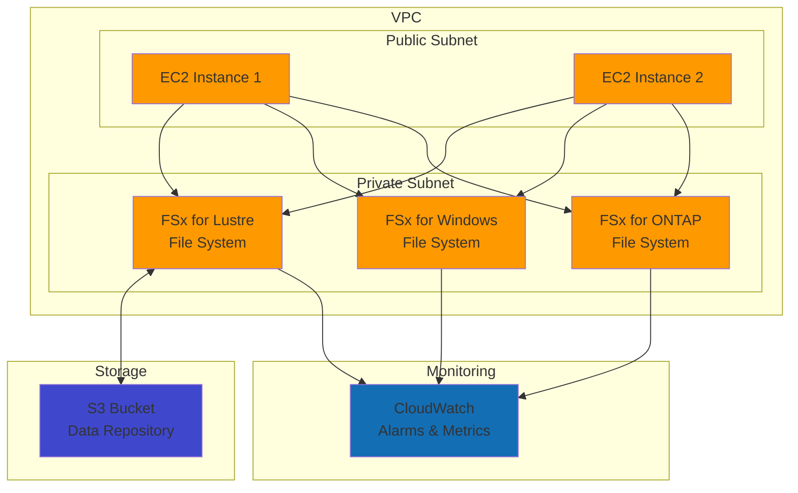

# High-Throughput Shared Storage System with FSx

## Problem

High-performance computing workloads, machine learning training, and data analytics applications require shared file storage that can deliver sub-millisecond latencies and throughput measured in terabytes per second. Traditional network-attached storage cannot meet these performance requirements, creating bottlenecks that slow down compute-intensive workloads and increase time-to-results for critical business applications.

## Solution

Amazon FSx for Lustre provides a fully managed, high-performance file system optimized for compute-intensive workloads. This solution creates a Lustre file system that delivers up to multiple TBps of throughput and millions of IOPS, integrates with S3 for data repositories, and can be accessed from multiple EC2 instances for parallel processing workloads.

## Architecture Diagram



## Prerequisites

1. AWS account with permissions for FSx, EC2, VPC, IAM, and CloudWatch
2. AWS CLI v2 installed and configured (or AWS CloudShell)
3. Basic knowledge of Linux file systems and HPC workloads
4. Existing VPC with subnets (will create if needed)
5. Estimated cost: $1.00-$4.00 per hour for FSx + $0.20-$1.00 per hour for EC2 instances

> **Note**: FSx for Lustre is available in specific regions. Check [service availability](https://docs.aws.amazon.com/fsx/latest/LustreGuide/getting-started.html) in your region before proceeding.

## Preparation

```bash
# Set environment variables
export AWS_REGION=$(aws configure get region)
export AWS_ACCOUNT_ID=$(aws sts get-caller-identity \
    --query Account --output text)

# Generate unique identifiers for resources
RANDOM_SUFFIX=$(aws secretsmanager get-random-password \
    --exclude-punctuation --exclude-uppercase \
    --password-length 6 --require-each-included-type \
    --output text --query RandomPassword)

export FSX_PREFIX="fsx-demo-${RANDOM_SUFFIX}"
export VPC_ID=$(aws ec2 describe-vpcs \
    --filters "Name=is-default,Values=true" \
    --query 'Vpcs[0].VpcId' --output text)

# Create security group for FSx file systems
FSX_SG_ID=$(aws ec2 create-security-group \
    --group-name "${FSX_PREFIX}-sg" \
    --description "Security group for FSx file systems" \
    --vpc-id $VPC_ID \
    --query 'GroupId' --output text)

# Add inbound rules for FSx protocols
aws ec2 authorize-security-group-ingress \
    --group-id $FSX_SG_ID \
    --protocol tcp --port 988 --cidr 10.0.0.0/8 \
    --description "FSx Lustre traffic"

aws ec2 authorize-security-group-ingress \
    --group-id $FSX_SG_ID \
    --protocol tcp --port 445 --cidr 10.0.0.0/8 \
    --description "SMB traffic for Windows File Server"

aws ec2 authorize-security-group-ingress \
    --group-id $FSX_SG_ID \
    --protocol tcp --port 111 --cidr 10.0.0.0/8 \
    --description "NFS traffic for ONTAP"

aws ec2 authorize-security-group-ingress \
    --group-id $FSX_SG_ID \
    --protocol tcp --port 2049 --cidr 10.0.0.0/8 \
    --description "NFS traffic for ONTAP"

# Get subnet IDs for deployment
SUBNET_IDS=$(aws ec2 describe-subnets \
    --filters "Name=vpc-id,Values=$VPC_ID" \
    --query 'Subnets[0:2].SubnetId' \
    --output text)

SUBNET_1=$(echo $SUBNET_IDS | cut -d' ' -f1)
SUBNET_2=$(echo $SUBNET_IDS | cut -d' ' -f2)

# Create S3 bucket for FSx Lustre data repository
S3_BUCKET="${FSX_PREFIX}-lustre-data"
aws s3 mb s3://$S3_BUCKET --region $AWS_REGION

# Enable S3 bucket versioning for data protection
aws s3api put-bucket-versioning \
    --bucket $S3_BUCKET \
    --versioning-configuration Status=Enabled

echo "✅ Environment prepared with Security Group: $FSX_SG_ID"
echo "✅ S3 bucket created: $S3_BUCKET"
echo "✅ Using subnets: $SUBNET_1, $SUBNET_2"
```

## Steps

1. **Create FSx for Lustre File System for HPC Workloads**:

   FSx for Lustre delivers the world's most popular high-performance file system, providing sub-millisecond latencies and up to multiple TBps of throughput. This step creates a SCRATCH_2 deployment type, which provides enhanced performance and temporary storage optimized for burst workloads. The S3 data repository integration enables seamless data movement between your high-performance compute environment and durable object storage, essential for preprocessing datasets and storing results.

   ```bash
   # Create FSx for Lustre with S3 data repository integration
   LUSTRE_FS_ID=$(aws fsx create-file-system \
       --file-system-type Lustre \
       --storage-capacity 1200 \
       --subnet-ids $SUBNET_1 \
       --security-group-ids $FSX_SG_ID \
       --lustre-configuration \
       "DeploymentType=SCRATCH_2,\
       DataRepositoryConfiguration={\
           Bucket=$S3_BUCKET,\
           ImportPath=s3://$S3_BUCKET/input/,\
           ExportPath=s3://$S3_BUCKET/output/\
       },\
       PerUnitStorageThroughput=250" \
       --tags "Key=Name,Value=${FSX_PREFIX}-lustre" \
       --tags "Key=Purpose,Value=HPC-Workloads" \
       --query 'FileSystem.FileSystemId' --output text)
   
   echo "✅ FSx for Lustre created: $LUSTRE_FS_ID"
   
   # Wait for Lustre file system to become available
   aws fsx wait file-system-available --file-system-ids $LUSTRE_FS_ID
   echo "✅ Lustre file system is now available"
   ```

   The Lustre file system is now established with 250 MB/s/TiB baseline throughput performance. This configuration provides a foundation for parallel processing workloads that can leverage the file system's distributed architecture to achieve maximum I/O performance across multiple compute nodes.

2. **Create FSx for Windows File Server**:

   FSx for Windows File Server provides fully managed Windows-based shared storage built on the Windows Server Message Block (SMB) protocol. This file system delivers enterprise-grade features including data deduplication, encryption, and seamless integration with Active Directory. The single-AZ deployment offers cost-effective storage for applications that don't require multi-AZ redundancy, making it ideal for development environments and workloads with built-in fault tolerance.

   ```bash
   # Create FSx for Windows File Server
   WINDOWS_FS_ID=$(aws fsx create-file-system \
       --file-system-type Windows \
       --storage-capacity 32 \
       --subnet-ids $SUBNET_1 \
       --security-group-ids $FSX_SG_ID \
       --windows-configuration \
       "ThroughputCapacity=8,\
       DeploymentType=SINGLE_AZ_1,\
       PreferredSubnetId=$SUBNET_1" \
       --tags "Key=Name,Value=${FSX_PREFIX}-windows" \
       --tags "Key=Purpose,Value=Windows-Applications" \
       --query 'FileSystem.FileSystemId' --output text)
   
   echo "✅ FSx for Windows created: $WINDOWS_FS_ID"
   
   # Wait for Windows file system to become available
   aws fsx wait file-system-available --file-system-ids $WINDOWS_FS_ID
   echo "✅ Windows file system is now available"
   ```

   The Windows file system now provides SMB-based shared storage with 8 MB/s baseline throughput capacity. This configuration supports Windows applications requiring shared file access, user quotas, and NTFS permissions, establishing a robust foundation for enterprise Windows workloads in the cloud.

3. **Create FSx for NetApp ONTAP File System**:

   FSx for NetApp ONTAP provides enterprise-grade shared storage with multi-protocol support (NFS, SMB, iSCSI) and advanced data management capabilities. ONTAP's storage efficiency features like deduplication and compression can reduce storage requirements by up to 50%, while the multi-AZ deployment ensures high availability with automatic failover. This step creates the foundational file system that will support both NFS and SMB protocols through Storage Virtual Machines.

   ```bash
   # Create FSx for NetApp ONTAP
   ONTAP_FS_ID=$(aws fsx create-file-system \
       --file-system-type ONTAP \
       --storage-capacity 1024 \
       --subnet-ids $SUBNET_1 $SUBNET_2 \
       --security-group-ids $FSX_SG_ID \
       --ontap-configuration \
       "DeploymentType=MULTI_AZ_1,\
       ThroughputCapacity=256,\
       PreferredSubnetId=$SUBNET_1,\
       FsxAdminPassword=TempPassword123!" \
       --tags "Key=Name,Value=${FSX_PREFIX}-ontap" \
       --tags "Key=Purpose,Value=Multi-Protocol-Access" \
       --query 'FileSystem.FileSystemId' --output text)
   
   echo "✅ FSx for NetApp ONTAP created: $ONTAP_FS_ID"
   
   # Wait for ONTAP file system to become available
   aws fsx wait file-system-available --file-system-ids $ONTAP_FS_ID
   echo "✅ ONTAP file system is now available"
   ```

   The ONTAP file system is now established across multiple Availability Zones with 256 MB/s throughput capacity. This multi-AZ configuration provides automatic failover capabilities and forms the basis for creating Storage Virtual Machines that will handle protocol-specific access patterns and data organization.

4. **Create Storage Virtual Machine (SVM) for ONTAP**:

   Storage Virtual Machines (SVMs) in ONTAP act as secure, isolated environments that serve data to clients through multiple protocols. Each SVM provides its own namespace, security policies, and network configuration, enabling multi-tenancy within a single ONTAP file system. This architectural pattern allows different applications or teams to access the same underlying storage infrastructure while maintaining complete logical separation and independent access controls.

   ```bash
   # Create SVM for multi-protocol access
   SVM_ID=$(aws fsx create-storage-virtual-machine \
       --file-system-id $ONTAP_FS_ID \
       --name "demo-svm" \
       --svm-admin-password "TempPassword123!" \
       --tags "Key=Name,Value=${FSX_PREFIX}-svm" \
       --query 'StorageVirtualMachine.StorageVirtualMachineId' \
       --output text)
   
   echo "✅ Storage Virtual Machine created: $SVM_ID"
   
   # Wait for SVM to become available
   aws fsx wait storage-virtual-machine-available \
       --storage-virtual-machine-ids $SVM_ID
   echo "✅ SVM is now available"
   ```

   The Storage Virtual Machine now provides an isolated namespace within the ONTAP file system. This SVM will host volumes with different security styles and protocols, enabling both Unix-style (NFS) and Windows-style (SMB) access patterns while maintaining appropriate permissions and security boundaries for each protocol type.

5. **Create ONTAP Volumes for Different Protocols**:

   ONTAP volumes provide the actual storage containers that clients access through different protocols. Each volume has a security style (UNIX for NFS, NTFS for SMB) that determines how permissions are handled, and a junction path that defines how the volume appears in the SVM's namespace. Storage efficiency features like deduplication and compression operate at the volume level, providing significant cost savings for workloads with redundant data patterns.

   ```bash
   # Create NFS volume
   NFS_VOLUME_ID=$(aws fsx create-volume \
       --volume-type ONTAP \
       --name "nfs-volume" \
       --ontap-configuration \
       "StorageVirtualMachineId=$SVM_ID,\
       JunctionPath=/nfs,\
       SecurityStyle=UNIX,\
       SizeInMegabytes=102400,\
       StorageEfficiencyEnabled=true" \
       --tags "Key=Name,Value=${FSX_PREFIX}-nfs-volume" \
       --query 'Volume.VolumeId' --output text)
   
   echo "✅ NFS volume created: $NFS_VOLUME_ID"
   
   # Create SMB volume
   SMB_VOLUME_ID=$(aws fsx create-volume \
       --volume-type ONTAP \
       --name "smb-volume" \
       --ontap-configuration \
       "StorageVirtualMachineId=$SVM_ID,\
       JunctionPath=/smb,\
       SecurityStyle=NTFS,\
       SizeInMegabytes=51200,\
       StorageEfficiencyEnabled=true" \
       --tags "Key=Name,Value=${FSX_PREFIX}-smb-volume" \
       --query 'Volume.VolumeId' --output text)
   
   echo "✅ SMB volume created: $SMB_VOLUME_ID"
   
   # Wait for volumes to become available
   aws fsx wait volume-available --volume-ids $NFS_VOLUME_ID $SMB_VOLUME_ID
   echo "✅ Both volumes are now available"
   ```

   Two distinct volumes are now available within the SVM namespace: an NFS volume optimized for Unix/Linux workloads and an SMB volume configured for Windows environments. Both volumes have storage efficiency enabled, which will automatically deduplicate common data blocks and compress data to maximize storage utilization and reduce costs.

6. **Configure CloudWatch Monitoring and Alarms**:

   Proactive monitoring is essential for high-performance file systems to prevent performance degradation and ensure optimal resource utilization. CloudWatch alarms enable automated responses to performance thresholds, allowing you to scale throughput capacity or investigate bottlenecks before they impact workloads. These alarms monitor key metrics that directly correlate with user experience and system health across all three FSx file system types.

   ```bash
   # Create CloudWatch alarm for Lustre throughput
   aws cloudwatch put-metric-alarm \
       --alarm-name "${FSX_PREFIX}-lustre-throughput" \
       --alarm-description "Monitor Lustre throughput utilization" \
       --metric-name ThroughputUtilization \
       --namespace AWS/FSx \
       --statistic Average \
       --period 300 \
       --threshold 80 \
       --comparison-operator GreaterThanThreshold \
       --evaluation-periods 2 \
       --dimensions Name=FileSystemId,Value=$LUSTRE_FS_ID
   
   # Create CloudWatch alarm for Windows file system CPU
   aws cloudwatch put-metric-alarm \
       --alarm-name "${FSX_PREFIX}-windows-cpu" \
       --alarm-description "Monitor Windows file system CPU" \
       --metric-name CPUUtilization \
       --namespace AWS/FSx \
       --statistic Average \
       --period 300 \
       --threshold 85 \
       --comparison-operator GreaterThanThreshold \
       --evaluation-periods 2 \
       --dimensions Name=FileSystemId,Value=$WINDOWS_FS_ID
   
   # Create CloudWatch alarm for ONTAP storage utilization
   aws cloudwatch put-metric-alarm \
       --alarm-name "${FSX_PREFIX}-ontap-storage" \
       --alarm-description "Monitor ONTAP storage utilization" \
       --metric-name StorageUtilization \
       --namespace AWS/FSx \
       --statistic Average \
       --period 300 \
       --threshold 90 \
       --comparison-operator GreaterThanThreshold \
       --evaluation-periods 1 \
       --dimensions Name=FileSystemId,Value=$ONTAP_FS_ID
   
   echo "✅ CloudWatch monitoring configured for all file systems"
   ```

   Comprehensive monitoring is now active across all file systems, tracking throughput utilization, CPU performance, and storage capacity. These alarms will trigger when systems approach their performance limits, enabling proactive capacity planning and performance optimization before end-users experience degraded performance.

7. **Create Test EC2 Instances for File System Access**:

   Testing instances provide a platform to validate file system performance and functionality. These instances are configured with the necessary Lustre client software and mount points, enabling immediate testing of high-performance workloads. The instances use the latest Amazon Linux 2023 AMI and are placed in the same security group as the FSx file systems for seamless connectivity.

   ```bash
   # Get latest Amazon Linux 2023 AMI ID
   AL2023_AMI_ID=$(aws ec2 describe-images \
       --owners amazon \
       --filters "Name=name,Values=al2023-ami-*" \
       "Name=architecture,Values=x86_64" \
       "Name=state,Values=available" \
       --query 'Images|sort_by(@, &CreationDate)[-1].ImageId' \
       --output text)
   
   # Launch Linux instance for Lustre testing
   LINUX_INSTANCE_ID=$(aws ec2 run-instances \
       --image-id $AL2023_AMI_ID \
       --instance-type c5.large \
       --security-group-ids $FSX_SG_ID \
       --subnet-id $SUBNET_1 \
       --tag-specifications \
       "ResourceType=instance,Tags=[{Key=Name,Value=${FSX_PREFIX}-linux-client}]" \
       --user-data '#!/bin/bash
       dnf update -y
       dnf install -y lustre-client
       mkdir -p /mnt/fsx /mnt/nfs /mnt/smb' \
       --query 'Instances[0].InstanceId' --output text)
   
   echo "✅ Linux client instance created: $LINUX_INSTANCE_ID"
   
   # Wait for instance to be running
   aws ec2 wait instance-running --instance-ids $LINUX_INSTANCE_ID
   echo "✅ Linux client instance is running"
   ```

   The test instance is now available with Lustre client software pre-installed and mount points configured. This instance provides a platform for testing file system performance, validating data access patterns, and demonstrating the high-throughput capabilities of the FSx file systems.

8. **Configure Performance Optimization Settings**:

   Performance optimization in FSx involves adjusting throughput capacity, enabling compression, and configuring data synchronization policies. The auto-import policy for Lustre automatically synchronizes new and changed files from S3, while LZ4 compression reduces network overhead with minimal CPU impact. Doubling the Windows file system throughput capacity improves performance for high-concurrency workloads that exceed baseline capacity requirements.

   ```bash
   # Modify Lustre file system for performance optimization
   aws fsx modify-file-system \
       --file-system-id $LUSTRE_FS_ID \
       --lustre-configuration \
       "AutoImportPolicy=NEW_CHANGED_DELETED,\
       DataCompressionType=LZ4"
   
   # Modify Windows file system throughput capacity
   aws fsx modify-file-system \
       --file-system-id $WINDOWS_FS_ID \
       --windows-configuration \
       "ThroughputCapacity=16"
   
   # Verify storage efficiency is enabled on ONTAP volumes
   aws fsx describe-volumes --volume-ids $NFS_VOLUME_ID \
       --query 'Volumes[0].OntapConfiguration.StorageEfficiencyEnabled'
   
   echo "✅ Performance optimization settings applied"
   ```

   Performance optimizations are now active across all file systems. The Lustre file system will automatically maintain data synchronization with S3 while reducing bandwidth usage through compression. The Windows file system throughput capacity has been doubled to handle increased concurrent access, and ONTAP storage efficiency will continuously optimize space utilization.

9. **Set Up Automated Backup Policies**:

   Automated backup policies protect critical data by creating point-in-time snapshots of file systems. These backups are stored separately from the primary file systems and can be used for disaster recovery, data restoration, or compliance requirements. The backup policies are configured with appropriate retention periods and scheduled during low-usage hours to minimize performance impact.

   ```bash
   # Create backup policy for Windows file system
   aws fsx put-backup-policy \
       --file-system-id $WINDOWS_FS_ID \
       --backup-policy \
       "Status=ENABLED,\
       DailyBackupStartTime=01:00,\
       DailyBackupRetention=7,\
       CopyTagsToBackups=true"
   
   # Create backup policy for ONTAP file system
   aws fsx put-backup-policy \
       --file-system-id $ONTAP_FS_ID \
       --backup-policy \
       "Status=ENABLED,\
       DailyBackupStartTime=02:00,\
       DailyBackupRetention=14,\
       CopyTagsToBackups=true"
   
   echo "✅ Automated backup policies configured"
   ```

   Automated backup policies are now protecting both the Windows and ONTAP file systems. These backups will be created daily during off-peak hours and retained according to the specified retention policies, providing data protection without requiring manual intervention.

10. **Configure Access Control and Security**:

    Security hardening involves restricting network access to authorized sources and implementing proper IAM roles for service-to-service communication. This step replaces broad CIDR-based access with security group references, ensuring that only instances with the appropriate security group can access the file systems. The IAM role enables FSx to access S3 resources securely without embedding credentials.

    ```bash
    # Update security group to restrict access by source
    aws ec2 revoke-security-group-ingress \
        --group-id $FSX_SG_ID \
        --protocol tcp --port 988 --cidr 10.0.0.0/8
    
    aws ec2 authorize-security-group-ingress \
        --group-id $FSX_SG_ID \
        --protocol tcp --port 988 \
        --source-group $FSX_SG_ID \
        --description "FSx Lustre traffic from same SG"
    
    # Create IAM role for FSx service access
    FSX_ROLE_NAME="${FSX_PREFIX}-service-role"
    aws iam create-role \
        --role-name $FSX_ROLE_NAME \
        --assume-role-policy-document '{
            "Version": "2012-10-17",
            "Statement": [
                {
                    "Effect": "Allow",
                    "Principal": {
                        "Service": "fsx.amazonaws.com"
                    },
                    "Action": "sts:AssumeRole"
                }
            ]
        }'
    
    # Attach minimal S3 access policy
    aws iam attach-role-policy \
        --role-name $FSX_ROLE_NAME \
        --policy-arn "arn:aws:iam::aws:policy/AmazonS3ReadOnlyAccess"
    
    echo "✅ Security configurations applied"
    ```

    Enhanced security measures are now in place, including network access restrictions and proper IAM roles. These configurations follow the principle of least privilege, ensuring that file systems and related services have only the minimum permissions required for operation.

## Validation & Testing

1. **Verify all file systems are operational**:

   ```bash
   # Check status of all file systems
   aws fsx describe-file-systems \
       --file-system-ids $LUSTRE_FS_ID $WINDOWS_FS_ID $ONTAP_FS_ID \
       --query 'FileSystems[*].{ID:FileSystemId,Type:FileSystemType,State:Lifecycle,DNSName:DNSName}' \
       --output table
   ```

   Expected output: All file systems should show "AVAILABLE" state with DNS names assigned.

2. **Test Lustre file system mount and performance**:

   ```bash
   # Get Lustre DNS name and mount target
   LUSTRE_DNS=$(aws fsx describe-file-systems \
       --file-system-ids $LUSTRE_FS_ID \
       --query 'FileSystems[0].DNSName' --output text)
   
   LUSTRE_MOUNT_NAME=$(aws fsx describe-file-systems \
       --file-system-ids $LUSTRE_FS_ID \
       --query 'FileSystems[0].LustreConfiguration.MountName' \
       --output text)
   
   echo "Lustre mount command for EC2 instance:"
   echo "sudo mount -t lustre $LUSTRE_DNS@tcp:/$LUSTRE_MOUNT_NAME /mnt/fsx"
   
   # Performance test commands (run on EC2 instance)
   echo ""
   echo "Performance test commands for EC2 instance:"
   echo "# Write test - 1GB file"
   echo "dd if=/dev/zero of=/mnt/fsx/testfile bs=1M count=1000"
   echo "# Read test"
   echo "dd if=/mnt/fsx/testfile of=/dev/null bs=1M"
   ```

3. **Verify Windows file system SMB shares**:

   ```bash
   # Get Windows file system DNS name
   WINDOWS_DNS=$(aws fsx describe-file-systems \
       --file-system-ids $WINDOWS_FS_ID \
       --query 'FileSystems[0].DNSName' --output text)
   
   echo "Windows SMB share access path:"
   echo "\\\\$WINDOWS_DNS\\share"
   echo ""
   echo "For Linux clients, mount command:"
   echo "sudo mount -t cifs //$WINDOWS_DNS/share /mnt/smb"
   ```

4. **Test ONTAP multi-protocol access**:

   ```bash
   # Get ONTAP file system endpoints
   ONTAP_ENDPOINTS=$(aws fsx describe-file-systems \
       --file-system-ids $ONTAP_FS_ID \
       --query 'FileSystems[0].OntapConfiguration.Endpoints')
   
   echo "ONTAP Endpoints:"
   echo $ONTAP_ENDPOINTS
   
   # Get SVM management endpoint
   SVM_DNS=$(aws fsx describe-storage-virtual-machines \
       --storage-virtual-machine-ids $SVM_ID \
       --query 'StorageVirtualMachines[0].Endpoints.Nfs.DNSName' \
       --output text)
   
   echo ""
   echo "NFS mount command:"
   echo "sudo mount -t nfs $SVM_DNS:/nfs /mnt/nfs"
   ```

5. **Verify monitoring and alarms**:

   ```bash
   # Check CloudWatch alarms status
   aws cloudwatch describe-alarms \
       --alarm-names "${FSX_PREFIX}-lustre-throughput" \
       "${FSX_PREFIX}-windows-cpu" \
       "${FSX_PREFIX}-ontap-storage" \
       --query 'MetricAlarms[*].{Name:AlarmName,State:StateValue,Reason:StateReason}' \
       --output table
   ```

   Expected output: All alarms should show "OK" or "INSUFFICIENT_DATA" state initially.

## Cleanup

1. **Delete volumes and storage virtual machines**:

   ```bash
   # Delete ONTAP volumes first
   aws fsx delete-volume --volume-id $NFS_VOLUME_ID
   aws fsx delete-volume --volume-id $SMB_VOLUME_ID
   
   # Wait for volumes to be deleted
   echo "Waiting for volumes to be deleted..."
   aws fsx wait volume-deleted --volume-ids $NFS_VOLUME_ID $SMB_VOLUME_ID
   
   # Delete storage virtual machine
   aws fsx delete-storage-virtual-machine \
       --storage-virtual-machine-id $SVM_ID
   
   echo "✅ ONTAP volumes and SVM deletion initiated"
   ```

2. **Delete file systems**:

   ```bash
   # Delete FSx file systems
   aws fsx delete-file-system --file-system-id $LUSTRE_FS_ID
   aws fsx delete-file-system --file-system-id $WINDOWS_FS_ID
   aws fsx delete-file-system --file-system-id $ONTAP_FS_ID
   
   echo "✅ File system deletion initiated"
   echo "Note: File systems may take several minutes to delete completely"
   ```

3. **Clean up supporting resources**:

   ```bash
   # Terminate EC2 instances
   aws ec2 terminate-instances --instance-ids $LINUX_INSTANCE_ID
   
   # Delete CloudWatch alarms
   aws cloudwatch delete-alarms \
       --alarm-names "${FSX_PREFIX}-lustre-throughput" \
       "${FSX_PREFIX}-windows-cpu" \
       "${FSX_PREFIX}-ontap-storage"
   
   # Clean up IAM role
   aws iam detach-role-policy \
       --role-name $FSX_ROLE_NAME \
       --policy-arn "arn:aws:iam::aws:policy/AmazonS3ReadOnlyAccess"
   aws iam delete-role --role-name $FSX_ROLE_NAME
   
   # Delete security group (wait for FSx resources to be deleted first)
   sleep 60
   aws ec2 delete-security-group --group-id $FSX_SG_ID
   
   # Empty and delete S3 bucket
   aws s3 rm s3://$S3_BUCKET --recursive
   aws s3 rb s3://$S3_BUCKET
   
   echo "✅ All resources cleaned up"
   ```

## Discussion

Amazon FSx provides a comprehensive solution for high-performance file storage needs across different workload types. The service eliminates the complexity of managing file systems while delivering enterprise-grade performance and features that scale with your computational demands.

**Performance Characteristics**: FSx for Lustre can deliver up to multiple TBps of throughput and millions of IOPS, making it ideal for HPC workloads like financial risk modeling, genomics analysis, and scientific simulations. The scratch file system type prioritizes performance over durability for temporary workloads, while persistent deployments provide data replication across multiple storage servers. FSx for Windows File Server offers consistent sub-millisecond latencies with SSD storage and supports SMB multichannel for maximum throughput to individual clients. FSx for NetApp ONTAP provides built-in data optimization features like deduplication and compression, reducing storage costs by up to 50% while maintaining high performance through intelligent caching and tiering.

**Integration Benefits**: The tight integration with AWS services provides significant architectural advantages. FSx for Lustre's S3 integration allows seamless data movement between high-performance compute and durable storage, enabling efficient data lake patterns where raw datasets are processed in Lustre and results archived to S3 for long-term retention. CloudWatch monitoring provides deep visibility into performance metrics, throughput utilization, and capacity trends, while AWS Backup automates protection strategies across all file system types. The service supports encryption at rest using AWS KMS and in transit with TLS, providing comprehensive data protection without performance penalties.

**Cost Optimization**: FSx pricing models allow optimization for different use cases and workload patterns. Lustre's scratch file systems provide the lowest cost per GB for temporary workloads that don't require data persistence, while persistent deployments add durability with automatic replication. ONTAP's storage efficiency features can reduce capacity requirements by 50% or more through inline deduplication, compression, and compaction, resulting in significant cost savings for workloads with redundant data. The ability to dynamically modify throughput capacity allows scaling performance based on current needs, avoiding over-provisioning during low-usage periods.

For comprehensive guidance on optimizing FSx performance and cost management, refer to the [AWS FSx Performance Documentation](https://docs.aws.amazon.com/fsx/latest/LustreGuide/performance.html), [FSx Best Practices Guide](https://docs.aws.amazon.com/fsx/latest/WindowsGuide/best-practices.html), and [AWS Well-Architected Framework Storage Pillar](https://docs.aws.amazon.com/wellarchitected/latest/reliability-pillar/rel_planning_storage_system.html).

> **Warning**: FSx file systems incur charges while running, even when not actively used. Always implement proper cleanup procedures and consider using scheduled scaling or automation to optimize costs for development environments.

> **Tip**: Use FSx Intelligent Tiering for workloads with changing access patterns to automatically optimize storage costs while maintaining performance for frequently accessed data. Monitor CloudWatch metrics to identify optimization opportunities.

## Challenge

Extend this high-performance file system solution by implementing these advanced capabilities:

1. **Multi-Region Data Replication**: Implement cross-region replication for FSx for NetApp ONTAP using SnapMirror technology to create disaster recovery capabilities and enable global data distribution for critical workloads.

2. **Hybrid Cloud Integration**: Set up AWS DataSync to synchronize data between on-premises storage systems and FSx file systems, creating a hybrid storage architecture that enables seamless workload migration and data tiering.

3. **Container Integration**: Deploy FSx CSI drivers on Amazon EKS to provide persistent high-performance storage for containerized HPC and ML workloads, enabling stateful applications to leverage shared storage across pod lifecycle.

4. **Advanced Monitoring**: Implement custom CloudWatch dashboards with performance insights, cost analysis, capacity planning metrics, and automated scaling triggers based on utilization patterns across all FSx file system types.

5. **Automated Lifecycle Management**: Create Lambda functions to automatically adjust FSx throughput capacity based on CloudWatch metrics, implement intelligent data archiving policies using S3 lifecycle rules, and optimize costs through dynamic resource scaling.

## Infrastructure Code

### Available Infrastructure as Code:

- [Infrastructure Code Overview](code/README.md) - Detailed description of all infrastructure components
- [AWS CDK (Python)](code/cdk-python/) - AWS CDK Python implementation
- [AWS CDK (TypeScript)](code/cdk-typescript/) - AWS CDK TypeScript implementation
- [CloudFormation](code/cloudformation.yaml) - AWS CloudFormation template
- [Bash CLI Scripts](code/scripts/) - Example bash scripts using AWS CLI commands to deploy infrastructure
- [Terraform](code/terraform/) - Terraform configuration files