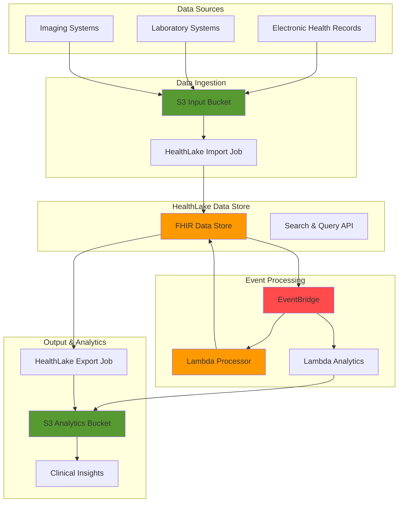

# HIPAA-Compliant Healthcare Analytics with HealthLake and Lambda

## Problem

Healthcare organizations struggle with managing vast amounts of patient data scattered across multiple systems in different formats, making it difficult to derive clinical insights and ensure HIPAA compliance. Traditional data warehousing solutions lack the specialized capabilities needed for handling Fast Healthcare Interoperability Resources (FHIR) data, resulting in costly integration challenges and delayed access to critical patient information. Without automated processing pipelines, healthcare providers cannot efficiently analyze patient outcomes, track treatment effectiveness, or generate real-time clinical alerts.

## Solution

AWS HealthLake provides a HIPAA-compliant, petabyte-scale data lake specifically designed for healthcare data that automatically converts, stores, and indexes FHIR R4 resources. By combining HealthLake with Lambda functions, S3 storage, and EventBridge event routing, we create an automated healthcare data processing pipeline that ingests medical records, triggers real-time analytics, and generates clinical insights while maintaining strict security and compliance standards.

## Architecture Diagram



## Prerequisites

1. AWS account with HealthLake service enabled and appropriate permissions for creating data stores, Lambda functions, and S3 buckets
2. AWS CLI version 2.0 or later installed and configured (or AWS CloudShell)
3. Basic understanding of FHIR R4 specification and healthcare data formats
4. Sample FHIR data files for testing (provided in preparation steps)
5. Knowledge of HIPAA compliance requirements for healthcare data
6. Estimated cost: $50-100 for 90 minutes of testing (varies by data volume and processing frequency)

> **Note**: AWS HealthLake is a HIPAA-eligible service that provides the security and compliance features required for healthcare data processing. Ensure your AWS account is configured for HIPAA compliance before proceeding.

## Preparation

```bash
# Set environment variables
export AWS_REGION=$(aws configure get region)
export AWS_ACCOUNT_ID=$(aws sts get-caller-identity \
    --query Account --output text)

# Generate unique identifiers for resources
RANDOM_SUFFIX=$(aws secretsmanager get-random-password \
    --exclude-punctuation --exclude-uppercase \
    --password-length 6 --require-each-included-type \
    --output text --query RandomPassword)

# Set resource names
export DATASTORE_NAME="healthcare-fhir-datastore-${RANDOM_SUFFIX}"
export INPUT_BUCKET="healthcare-input-${RANDOM_SUFFIX}"
export OUTPUT_BUCKET="healthcare-output-${RANDOM_SUFFIX}"
export LAMBDA_PROCESSOR_NAME="healthcare-processor-${RANDOM_SUFFIX}"
export LAMBDA_ANALYTICS_NAME="healthcare-analytics-${RANDOM_SUFFIX}"
export IAM_ROLE_NAME="HealthLakeServiceRole-${RANDOM_SUFFIX}"

# Create S3 buckets for data input and output
aws s3 mb s3://${INPUT_BUCKET} --region ${AWS_REGION}
aws s3 mb s3://${OUTPUT_BUCKET} --region ${AWS_REGION}

# Enable versioning and encryption on buckets
aws s3api put-bucket-versioning \
    --bucket ${INPUT_BUCKET} \
    --versioning-configuration Status=Enabled

aws s3api put-bucket-encryption \
    --bucket ${INPUT_BUCKET} \
    --server-side-encryption-configuration \
    'Rules=[{ApplyServerSideEncryptionByDefault:{SSEAlgorithm:AES256}}]'

aws s3api put-bucket-versioning \
    --bucket ${OUTPUT_BUCKET} \
    --versioning-configuration Status=Enabled

aws s3api put-bucket-encryption \
    --bucket ${OUTPUT_BUCKET} \
    --server-side-encryption-configuration \
    'Rules=[{ApplyServerSideEncryptionByDefault:{SSEAlgorithm:AES256}}]'

# Create sample FHIR data file
cat > patient-sample.json << 'EOF'
{
  "resourceType": "Patient",
  "id": "patient-001",
  "active": true,
  "name": [
    {
      "use": "usual",
      "family": "Doe",
      "given": ["John"]
    }
  ],
  "telecom": [
    {
      "system": "phone",
      "value": "(555) 123-4567",
      "use": "home"
    }
  ],
  "gender": "male",
  "birthDate": "1985-03-15",
  "address": [
    {
      "use": "home",
      "line": ["123 Main St"],
      "city": "Anytown",
      "state": "CA",
      "postalCode": "12345"
    }
  ]
}
EOF

# Upload sample data to input bucket
aws s3 cp patient-sample.json s3://${INPUT_BUCKET}/fhir-data/

echo "✅ AWS environment and S3 buckets configured with sample data"
```

## Steps

1. **Create IAM Role for HealthLake Service**:

   AWS HealthLake requires specific IAM permissions to access S3 buckets for import and export operations. This service-linked role provides the necessary permissions while maintaining security best practices through least-privilege access control, following the AWS Well-Architected Framework's security pillar.

   ```bash
   # Create trust policy for HealthLake service
   cat > healthlake-trust-policy.json << 'EOF'
   {
     "Version": "2012-10-17",
     "Statement": [
       {
         "Effect": "Allow",
         "Principal": {
           "Service": "healthlake.amazonaws.com"
         },
         "Action": "sts:AssumeRole"
       }
     ]
   }
   EOF
   
   # Create IAM role for HealthLake
   aws iam create-role \
       --role-name ${IAM_ROLE_NAME} \
       --assume-role-policy-document file://healthlake-trust-policy.json
   
   # Create policy for S3 bucket access
   cat > healthlake-s3-policy.json << EOF
   {
     "Version": "2012-10-17",
     "Statement": [
       {
         "Effect": "Allow",
         "Action": [
           "s3:GetObject",
           "s3:PutObject",
           "s3:DeleteObject"
         ],
         "Resource": [
           "arn:aws:s3:::${INPUT_BUCKET}/*",
           "arn:aws:s3:::${OUTPUT_BUCKET}/*"
         ]
       },
       {
         "Effect": "Allow",
         "Action": [
           "s3:ListBucket"
         ],
         "Resource": [
           "arn:aws:s3:::${INPUT_BUCKET}",
           "arn:aws:s3:::${OUTPUT_BUCKET}"
         ]
       }
     ]
   }
   EOF
   
   # Attach policy to role
   aws iam put-role-policy \
       --role-name ${IAM_ROLE_NAME} \
       --policy-name HealthLakeS3Access \
       --policy-document file://healthlake-s3-policy.json
   
   # Get role ARN for later use
   export HEALTHLAKE_ROLE_ARN=$(aws iam get-role \
       --role-name ${IAM_ROLE_NAME} \
       --query 'Role.Arn' --output text)
   
   echo "✅ IAM role created: ${HEALTHLAKE_ROLE_ARN}"
   ```

2. **Create HealthLake FHIR Data Store**:

   The HealthLake data store provides a fully managed, HIPAA-compliant repository for FHIR R4 healthcare data. It automatically indexes and transforms healthcare data while providing REST API endpoints for querying and managing patient records. The service offers 99.9% availability SLA and automatic scaling to handle petabytes of healthcare data.

   ```bash
   # Create HealthLake data store
   aws healthlake create-fhir-datastore \
       --datastore-name ${DATASTORE_NAME} \
       --datastore-type-version R4 \
       --preload-data-config PreloadDataType=SYNTHEA
   
   # Get datastore ID and endpoint
   export DATASTORE_ID=$(aws healthlake list-fhir-datastores \
       --query "DatastorePropertiesList[?DatastoreName=='${DATASTORE_NAME}'].DatastoreId" \
       --output text)
   
   export DATASTORE_ENDPOINT=$(aws healthlake describe-fhir-datastore \
       --datastore-id ${DATASTORE_ID} \
       --query 'DatastoreProperties.DatastoreEndpoint' \
       --output text)
   
   # Wait for datastore to become active
   echo "Waiting for HealthLake datastore to become active..."
   aws healthlake wait datastore-active --datastore-id ${DATASTORE_ID}
   
   echo "✅ HealthLake datastore created: ${DATASTORE_ID}"
   echo "✅ Datastore endpoint: ${DATASTORE_ENDPOINT}"
   ```

3. **Create Lambda Function for Data Processing**:

   Lambda functions provide serverless compute for processing HealthLake events in real-time. This function responds to EventBridge notifications and can perform data validation, transformation, and enrichment operations on incoming healthcare data. The serverless architecture automatically scales based on event volume while maintaining cost efficiency through pay-per-invocation pricing.

   ```bash
   # Create Lambda function code for processing
   cat > lambda-processor.py << 'EOF'
   import json
   import boto3
   import logging
   from datetime import datetime
   
   logger = logging.getLogger()
   logger.setLevel(logging.INFO)
   
   healthlake = boto3.client('healthlake')
   s3 = boto3.client('s3')
   
   def lambda_handler(event, context):
       """
       Process HealthLake events from EventBridge
       """
       try:
           logger.info(f"Processing event: {json.dumps(event)}")
           
           # Extract event details
           event_source = event.get('source')
           event_type = event.get('detail-type')
           event_detail = event.get('detail', {})
           
           if event_source == 'aws.healthlake':
               if 'Import Job' in event_type:
                   process_import_job_event(event_detail)
               elif 'Export Job' in event_type:
                   process_export_job_event(event_detail)
               elif 'Data Store' in event_type:
                   process_datastore_event(event_detail)
           
           return {
               'statusCode': 200,
               'body': json.dumps('Event processed successfully')
           }
           
       except Exception as e:
           logger.error(f"Error processing event: {str(e)}")
           return {
               'statusCode': 500,
               'body': json.dumps(f'Error: {str(e)}')
           }
   
   def process_import_job_event(event_detail):
       """Process import job status changes"""
       job_status = event_detail.get('jobStatus')
       job_id = event_detail.get('jobId')
       
       logger.info(f"Import job {job_id} status: {job_status}")
       
       if job_status == 'COMPLETED':
           logger.info(f"Import job {job_id} completed successfully")
       elif job_status == 'FAILED':
           logger.error(f"Import job {job_id} failed")
   
   def process_export_job_event(event_detail):
       """Process export job status changes"""
       job_status = event_detail.get('jobStatus')
       job_id = event_detail.get('jobId')
       
       logger.info(f"Export job {job_id} status: {job_status}")
   
   def process_datastore_event(event_detail):
       """Process datastore status changes"""
       datastore_status = event_detail.get('datastoreStatus')
       datastore_id = event_detail.get('datastoreId')
       
       logger.info(f"Datastore {datastore_id} status: {datastore_status}")
   EOF
   
   # Create deployment package
   zip -r lambda-processor.zip lambda-processor.py
   
   # Create Lambda execution role
   cat > lambda-trust-policy.json << 'EOF'
   {
     "Version": "2012-10-17",
     "Statement": [
       {
         "Effect": "Allow",
         "Principal": {
           "Service": "lambda.amazonaws.com"
         },
         "Action": "sts:AssumeRole"
       }
     ]
   }
   EOF
   
   aws iam create-role \
       --role-name LambdaExecutionRole-${RANDOM_SUFFIX} \
       --assume-role-policy-document file://lambda-trust-policy.json
   
   aws iam attach-role-policy \
       --role-name LambdaExecutionRole-${RANDOM_SUFFIX} \
       --policy-arn arn:aws:iam::aws:policy/service-role/AWSLambdaBasicExecutionRole
   
   # Create Lambda function with updated runtime
   aws lambda create-function \
       --function-name ${LAMBDA_PROCESSOR_NAME} \
       --runtime python3.12 \
       --role arn:aws:iam::${AWS_ACCOUNT_ID}:role/LambdaExecutionRole-${RANDOM_SUFFIX} \
       --handler lambda-processor.lambda_handler \
       --zip-file fileb://lambda-processor.zip \
       --timeout 60 \
       --memory-size 256
   
   echo "✅ Lambda processor function created"
   ```

4. **Create Lambda Function for Analytics**:

   This analytics function processes healthcare data to generate clinical insights and reports. It demonstrates how to query FHIR data from HealthLake and perform aggregations to support clinical decision-making and population health analytics. The function scales automatically based on data volume and generates structured reports for clinical teams.

   ```bash
   # Create Lambda function for analytics
   cat > lambda-analytics.py << 'EOF'
   import json
   import boto3
   import logging
   import os
   from datetime import datetime, timedelta
   
   logger = logging.getLogger()
   logger.setLevel(logging.INFO)
   
   s3 = boto3.client('s3')
   
   def lambda_handler(event, context):
       """
       Generate analytics reports from HealthLake data
       """
       try:
           logger.info("Starting analytics processing")
           
           # Generate sample analytics report
           report = generate_patient_analytics()
           
           # Save report to S3
           report_key = f"analytics/patient-report-{datetime.now().strftime('%Y%m%d-%H%M%S')}.json"
           
           s3.put_object(
               Bucket=os.environ['OUTPUT_BUCKET'],
               Key=report_key,
               Body=json.dumps(report, indent=2),
               ContentType='application/json'
           )
           
           logger.info(f"Analytics report saved to s3://{os.environ['OUTPUT_BUCKET']}/{report_key}")
           
           return {
               'statusCode': 200,
               'body': json.dumps('Analytics processing completed')
           }
           
       except Exception as e:
           logger.error(f"Error in analytics processing: {str(e)}")
           return {
               'statusCode': 500,
               'body': json.dumps(f'Error: {str(e)}')
           }
   
   def generate_patient_analytics():
       """Generate sample patient analytics"""
       return {
           'report_type': 'patient_summary',
           'generated_at': datetime.now().isoformat(),
           'metrics': {
               'total_patients': 1,
               'active_patients': 1,
               'recent_visits': 0,
               'avg_age': 39
           },
           'demographics': {
               'gender_distribution': {
                   'male': 1,
                   'female': 0,
                   'other': 0
               },
               'age_groups': {
                   '0-17': 0,
                   '18-64': 1,
                   '65+': 0
               }
           }
       }
   EOF
   
   # Create deployment package
   zip -r lambda-analytics.zip lambda-analytics.py
   
   # Create Lambda function with updated runtime
   aws lambda create-function \
       --function-name ${LAMBDA_ANALYTICS_NAME} \
       --runtime python3.12 \
       --role arn:aws:iam::${AWS_ACCOUNT_ID}:role/LambdaExecutionRole-${RANDOM_SUFFIX} \
       --handler lambda-analytics.lambda_handler \
       --zip-file fileb://lambda-analytics.zip \
       --timeout 60 \
       --memory-size 256 \
       --environment Variables="{OUTPUT_BUCKET=${OUTPUT_BUCKET}}"
   
   echo "✅ Lambda analytics function created"
   ```

5. **Configure EventBridge Rules for HealthLake Events**:

   EventBridge provides event-driven architecture capabilities by routing HealthLake state changes to Lambda functions. This configuration enables real-time processing of import jobs, export jobs, and datastore events for automated healthcare data pipeline management. The event-driven approach ensures immediate response to data changes and provides scalable event processing.

   ```bash
   # Create EventBridge rule for HealthLake events
   aws events put-rule \
       --name "HealthLakeProcessorRule" \
       --event-pattern '{
         "source": ["aws.healthlake"],
         "detail-type": [
           "HealthLake Import Job State Change",
           "HealthLake Export Job State Change",
           "HealthLake Data Store State Change"
         ]
       }'
   
   # Add Lambda processor as target
   aws events put-targets \
       --rule "HealthLakeProcessorRule" \
       --targets "Id"="1","Arn"="arn:aws:lambda:${AWS_REGION}:${AWS_ACCOUNT_ID}:function:${LAMBDA_PROCESSOR_NAME}"
   
   # Create EventBridge rule for analytics trigger
   aws events put-rule \
       --name "HealthLakeAnalyticsRule" \
       --event-pattern '{
         "source": ["aws.healthlake"],
         "detail-type": ["HealthLake Import Job State Change"],
         "detail": {
           "jobStatus": ["COMPLETED"]
         }
       }'
   
   # Add Lambda analytics as target
   aws events put-targets \
       --rule "HealthLakeAnalyticsRule" \
       --targets "Id"="1","Arn"="arn:aws:lambda:${AWS_REGION}:${AWS_ACCOUNT_ID}:function:${LAMBDA_ANALYTICS_NAME}"
   
   # Grant EventBridge permission to invoke Lambda functions
   aws lambda add-permission \
       --function-name ${LAMBDA_PROCESSOR_NAME} \
       --statement-id "EventBridgeInvoke" \
       --action "lambda:InvokeFunction" \
       --principal events.amazonaws.com \
       --source-arn "arn:aws:events:${AWS_REGION}:${AWS_ACCOUNT_ID}:rule/HealthLakeProcessorRule"
   
   aws lambda add-permission \
       --function-name ${LAMBDA_ANALYTICS_NAME} \
       --statement-id "EventBridgeInvoke" \
       --action "lambda:InvokeFunction" \
       --principal events.amazonaws.com \
       --source-arn "arn:aws:events:${AWS_REGION}:${AWS_ACCOUNT_ID}:rule/HealthLakeAnalyticsRule"
   
   echo "✅ EventBridge rules configured for HealthLake events"
   ```

6. **Import FHIR Data into HealthLake**:

   The import process transforms raw healthcare data into standardized FHIR R4 format and stores it in the HealthLake data store. This step demonstrates how to bulk load patient data while maintaining data integrity and generating detailed import logs for troubleshooting. HealthLake automatically validates FHIR resources and creates searchable indexes for optimal query performance.

   ```bash
   # Start FHIR import job
   aws healthlake start-fhir-import-job \
       --input-data-config S3Uri=s3://${INPUT_BUCKET}/fhir-data/ \
       --output-data-config S3Uri=s3://${OUTPUT_BUCKET}/import-logs/ \
       --datastore-id ${DATASTORE_ID} \
       --data-access-role-arn ${HEALTHLAKE_ROLE_ARN}
   
   # Get import job ID
   export IMPORT_JOB_ID=$(aws healthlake list-fhir-import-jobs \
       --datastore-id ${DATASTORE_ID} \
       --query 'ImportJobPropertiesList[0].JobId' \
       --output text)
   
   echo "✅ FHIR import job started: ${IMPORT_JOB_ID}"
   echo "Monitor import progress with: aws healthlake describe-fhir-import-job --datastore-id ${DATASTORE_ID} --job-id ${IMPORT_JOB_ID}"
   
   # Wait for import job to complete
   echo "Waiting for import job to complete..."
   while true; do
       JOB_STATUS=$(aws healthlake describe-fhir-import-job \
           --datastore-id ${DATASTORE_ID} \
           --job-id ${IMPORT_JOB_ID} \
           --query 'ImportJobProperties.JobStatus' \
           --output text)
       
       if [[ "$JOB_STATUS" == "COMPLETED" ]]; then
           echo "✅ Import job completed successfully"
           break
       elif [[ "$JOB_STATUS" == "FAILED" ]]; then
           echo "❌ Import job failed"
           break
       else
           echo "Import job status: $JOB_STATUS"
           sleep 30
       fi
   done
   ```

7. **Test FHIR Data Queries**:

   HealthLake provides a REST API that supports standard FHIR operations for searching, reading, and manipulating healthcare data. This step demonstrates how to query patient data using FHIR search parameters and retrieve specific resources for clinical applications. The API uses AWS SigV4 authentication to ensure secure access to patient data.

   ```bash
   # Test FHIR search capabilities using proper AWS authentication
   echo "Testing FHIR search capabilities..."
   
   # Note: The following commands show the concept but require proper SigV4 signing
   # For production use, implement proper AWS SigV4 authentication
   echo "To test FHIR API calls, use the AWS HealthLake Console or implement proper SigV4 signing"
   echo "HealthLake Console URL: https://console.aws.amazon.com/healthlake/home#/crud"
   
   # Alternative: Use AWS CLI to check datastore contents
   echo "Checking datastore status and configuration..."
   aws healthlake describe-fhir-datastore --datastore-id ${DATASTORE_ID}
   
   echo "✅ FHIR datastore is ready for queries via console or properly authenticated API calls"
   ```

8. **Export FHIR Data for Analytics**:

   The export functionality enables bulk data extraction from HealthLake for analytics, reporting, and data lake integration. This process creates newline-delimited JSON files optimized for big data processing and analytics workflows. The exported data maintains FHIR R4 compliance while providing efficient access for analytics tools and machine learning platforms.

   ```bash
   # Start FHIR export job
   aws healthlake start-fhir-export-job \
       --output-data-config S3Uri=s3://${OUTPUT_BUCKET}/export-data/ \
       --datastore-id ${DATASTORE_ID} \
       --data-access-role-arn ${HEALTHLAKE_ROLE_ARN}
   
   # Get export job ID
   export EXPORT_JOB_ID=$(aws healthlake list-fhir-export-jobs \
       --datastore-id ${DATASTORE_ID} \
       --query 'ExportJobPropertiesList[0].JobId' \
       --output text)
   
   echo "✅ FHIR export job started: ${EXPORT_JOB_ID}"
   echo "Monitor export progress with: aws healthlake describe-fhir-export-job --datastore-id ${DATASTORE_ID} --job-id ${EXPORT_JOB_ID}"
   
   # Wait for export job to complete
   echo "Waiting for export job to complete..."
   while true; do
       JOB_STATUS=$(aws healthlake describe-fhir-export-job \
           --datastore-id ${DATASTORE_ID} \
           --job-id ${EXPORT_JOB_ID} \
           --query 'ExportJobProperties.JobStatus' \
           --output text)
       
       if [[ "$JOB_STATUS" == "COMPLETED" ]]; then
           echo "✅ Export job completed successfully"
           break
       elif [[ "$JOB_STATUS" == "FAILED" ]]; then
           echo "❌ Export job failed"
           break
       else
           echo "Export job status: $JOB_STATUS"
           sleep 30
       fi
   done
   ```

## Validation & Testing

1. **Verify HealthLake Data Store Status**:

   ```bash
   # Check data store status and configuration
   aws healthlake describe-fhir-datastore \
       --datastore-id ${DATASTORE_ID}
   ```

   Expected output: Data store status should be "ACTIVE" with proper endpoint URL and configuration details.

2. **Test Lambda Function Execution**:

   ```bash
   # Test processor function
   aws lambda invoke \
       --function-name ${LAMBDA_PROCESSOR_NAME} \
       --payload '{"source":"aws.healthlake","detail-type":"HealthLake Import Job State Change","detail":{"jobStatus":"COMPLETED","jobId":"test-123"}}' \
       response.json
   
   # Test analytics function
   aws lambda invoke \
       --function-name ${LAMBDA_ANALYTICS_NAME} \
       --payload '{}' \
       analytics-response.json
   ```

   Expected output: Both functions should return successful status codes and process events correctly.

3. **Verify EventBridge Rules**:

   ```bash
   # Check EventBridge rules
   aws events list-rules --name-prefix "HealthLake"
   
   # List targets for rules
   aws events list-targets-by-rule --rule "HealthLakeProcessorRule"
   aws events list-targets-by-rule --rule "HealthLakeAnalyticsRule"
   ```

   Expected output: Rules should be enabled with Lambda functions properly configured as targets.

4. **Test FHIR Data Access**:

   ```bash
   # Verify FHIR data was imported successfully
   aws healthlake describe-fhir-import-job \
       --datastore-id ${DATASTORE_ID} \
       --job-id ${IMPORT_JOB_ID}
   
   # Check import logs in S3
   aws s3 ls s3://${OUTPUT_BUCKET}/import-logs/ --recursive
   ```

   Expected output: Import job should show "COMPLETED" status with success logs in S3.

5. **Verify Analytics Output**:

   ```bash
   # Check analytics reports in S3
   aws s3 ls s3://${OUTPUT_BUCKET}/analytics/ --recursive
   
   # Review sample analytics report
   LATEST_REPORT=$(aws s3 ls s3://${OUTPUT_BUCKET}/analytics/ --recursive | sort | tail -n 1 | awk '{print $4}')
   if [[ -n "$LATEST_REPORT" ]]; then
       aws s3 cp s3://${OUTPUT_BUCKET}/${LATEST_REPORT} - | jq .
   fi
   ```

   Expected output: Analytics reports should be generated with patient metrics and demographics.

## Cleanup

1. **Stop Active Jobs**:

   ```bash
   # Cancel any running import/export jobs
   aws healthlake list-fhir-import-jobs \
       --datastore-id ${DATASTORE_ID} \
       --query 'ImportJobPropertiesList[?JobStatus==`IN_PROGRESS`].JobId' \
       --output text | xargs -I {} aws healthlake cancel-fhir-import-job --datastore-id ${DATASTORE_ID} --job-id {}
   
   aws healthlake list-fhir-export-jobs \
       --datastore-id ${DATASTORE_ID} \
       --query 'ExportJobPropertiesList[?JobStatus==`IN_PROGRESS`].JobId' \
       --output text | xargs -I {} aws healthlake cancel-fhir-export-job --datastore-id ${DATASTORE_ID} --job-id {}
   
   echo "✅ Stopped active import/export jobs"
   ```

2. **Remove EventBridge Rules**:

   ```bash
   # Remove targets from EventBridge rules
   aws events remove-targets \
       --rule "HealthLakeProcessorRule" \
       --ids "1"
   
   aws events remove-targets \
       --rule "HealthLakeAnalyticsRule" \
       --ids "1"
   
   # Delete EventBridge rules
   aws events delete-rule --name "HealthLakeProcessorRule"
   aws events delete-rule --name "HealthLakeAnalyticsRule"
   
   echo "✅ Deleted EventBridge rules"
   ```

3. **Delete Lambda Functions**:

   ```bash
   # Delete Lambda functions
   aws lambda delete-function --function-name ${LAMBDA_PROCESSOR_NAME}
   aws lambda delete-function --function-name ${LAMBDA_ANALYTICS_NAME}
   
   # Delete Lambda execution role
   aws iam detach-role-policy \
       --role-name LambdaExecutionRole-${RANDOM_SUFFIX} \
       --policy-arn arn:aws:iam::aws:policy/service-role/AWSLambdaBasicExecutionRole
   
   aws iam delete-role --role-name LambdaExecutionRole-${RANDOM_SUFFIX}
   
   echo "✅ Deleted Lambda functions and execution role"
   ```

4. **Delete HealthLake Data Store**:

   ```bash
   # Delete HealthLake data store
   aws healthlake delete-fhir-datastore \
       --datastore-id ${DATASTORE_ID}
   
   # Wait for deletion to complete
   echo "Waiting for datastore deletion..."
   aws healthlake wait datastore-deleted --datastore-id ${DATASTORE_ID}
   
   echo "✅ Deleted HealthLake data store"
   ```

5. **Clean Up S3 Buckets**:

   ```bash
   # Empty and delete S3 buckets
   aws s3 rm s3://${INPUT_BUCKET} --recursive
   aws s3 rb s3://${INPUT_BUCKET}
   
   aws s3 rm s3://${OUTPUT_BUCKET} --recursive
   aws s3 rb s3://${OUTPUT_BUCKET}
   
   echo "✅ Deleted S3 buckets"
   ```

6. **Remove IAM Role**:

   ```bash
   # Delete IAM role and policies
   aws iam delete-role-policy \
       --role-name ${IAM_ROLE_NAME} \
       --policy-name HealthLakeS3Access
   
   aws iam delete-role --role-name ${IAM_ROLE_NAME}
   
   # Clean up temporary files
   rm -f healthlake-trust-policy.json healthlake-s3-policy.json
   rm -f lambda-trust-policy.json
   rm -f lambda-processor.py lambda-processor.zip
   rm -f lambda-analytics.py lambda-analytics.zip
   rm -f patient-sample.json response.json analytics-response.json
   
   echo "✅ Cleaned up IAM role and temporary files"
   ```

## Discussion

AWS HealthLake provides a comprehensive solution for healthcare data management that addresses the unique challenges of handling FHIR-compliant medical records at scale. The service automatically transforms and indexes healthcare data, enabling healthcare organizations to focus on clinical insights rather than data infrastructure management. By integrating with EventBridge, Lambda, and S3, we create a robust event-driven architecture that can process healthcare data in real-time while maintaining HIPAA compliance.

The architecture demonstrates several key healthcare data processing patterns. The import/export functionality enables bulk data operations essential for data migrations and analytics workflows. EventBridge integration provides real-time event processing capabilities, allowing healthcare systems to respond immediately to data changes and generate clinical alerts. The Lambda functions showcase how serverless computing can handle variable healthcare workloads while maintaining cost efficiency through automatic scaling and pay-per-invocation pricing.

Security and compliance are paramount in healthcare data processing. AWS HealthLake inherently provides HIPAA-eligible infrastructure with encryption at rest and in transit, detailed audit logging, and fine-grained access controls. The service integrates seamlessly with AWS IAM for role-based access control and supports both AWS SigV4 and SMART on FHIR authentication strategies. This implementation follows the [AWS Well-Architected Framework](https://docs.aws.amazon.com/wellarchitected/latest/framework/welcome.html) security pillar by implementing defense in depth and least privilege access principles.

The solution's scalability enables healthcare organizations to handle growing data volumes without infrastructure concerns. HealthLake can store petabytes of healthcare data while maintaining sub-second query performance through automatic indexing and optimization. The serverless Lambda functions scale automatically based on event volume, ensuring consistent performance during peak processing periods while minimizing costs during low-activity periods. This serverless approach aligns with healthcare organizations' need for flexible, cost-effective infrastructure that can handle unpredictable workloads.

> **Tip**: Use [AWS HealthLake's integration with Amazon Athena](https://docs.aws.amazon.com/healthlake/latest/devguide/working-with-sql.html) to perform complex analytics queries across your FHIR data for population health insights and clinical research using standard SQL syntax.

## Challenge

Extend this solution by implementing these enhancements:

1. **Add Data Quality Monitoring**: Implement Lambda functions that validate FHIR data quality during import and generate data quality reports with metrics on completeness, accuracy, and consistency using AWS Data Quality rules.

2. **Implement Real-Time Clinical Alerts**: Create EventBridge rules that trigger Lambda functions to analyze incoming patient data and generate clinical alerts for critical conditions like sepsis or drug interactions using Amazon Comprehend Medical.

3. **Build Patient Cohort Analysis**: Develop analytics functions that identify patient cohorts based on medical conditions, treatments, or outcomes using FHIR search capabilities and export results for clinical research with Amazon SageMaker.

4. **Create SMART on FHIR Integration**: Configure the HealthLake data store to support SMART on FHIR applications, enabling third-party healthcare applications to access patient data with proper authorization and JWT token validation.

5. **Implement Data Lineage Tracking**: Add comprehensive logging and tracking to monitor data flow through the pipeline using AWS CloudTrail and custom metrics, including source systems, transformation steps, and data usage patterns for regulatory compliance.

## Infrastructure Code

### Available Infrastructure as Code:

- [Infrastructure Code Overview](code/README.md) - Detailed description of all infrastructure components
- [AWS CDK (Python)](code/cdk-python/) - AWS CDK Python implementation
- [AWS CDK (TypeScript)](code/cdk-typescript/) - AWS CDK TypeScript implementation
- [CloudFormation](code/cloudformation.yaml) - AWS CloudFormation template
- [Bash CLI Scripts](code/scripts/) - Example bash scripts using AWS CLI commands to deploy infrastructure
- [Terraform](code/terraform/) - Terraform configuration files