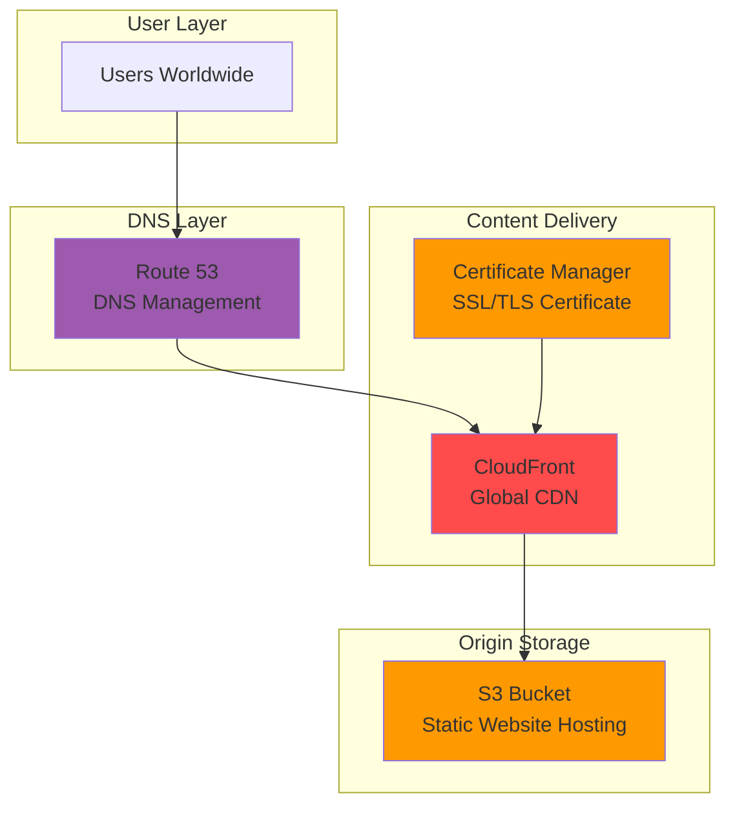

# Building Static Website Hosting with S3, CloudFront, and Route 53


## Problem

Modern businesses need fast, scalable, and cost-effective web hosting solutions for their marketing websites, documentation portals, and single-page applications. Traditional web hosting often involves managing server infrastructure, dealing with traffic spikes, and handling global content delivery manually. Companies struggle with slow loading times for international users, high hosting costs for simple static sites, and complex SSL certificate management across multiple regions.

## Solution

Build a globally distributed static website hosting solution using Amazon S3 for storage, CloudFront for content delivery, and Route 53 for DNS management. This architecture provides automatic SSL/TLS encryption, global edge caching, and seamless scalability while maintaining cost-effectiveness for static content delivery.

## Architecture Diagram



## Prerequisites

1. AWS account with permissions for S3, CloudFront, Route 53, and Certificate Manager
2. AWS CLI v2 installed and configured (or AWS CloudShell)
3. A registered domain name (can be registered through Route 53 or external registrar)
4. Basic understanding of DNS concepts and web hosting
5. Estimated cost: $0.50-2.00/month for small websites (domain registration additional ~$12/year)

> **Note**: SSL certificates through AWS Certificate Manager are free when used with CloudFront and other AWS services.

## Preparation

```bash
# Set environment variables
export AWS_REGION=$(aws configure get region)
export AWS_ACCOUNT_ID=$(aws sts get-caller-identity \
    --query Account --output text)

# Set your domain name (replace with your actual domain)
export DOMAIN_NAME="example.com"
export SUBDOMAIN="www.${DOMAIN_NAME}"

# Generate unique bucket names (S3 buckets must be globally unique)
export ROOT_BUCKET="${DOMAIN_NAME}"
export WWW_BUCKET="${SUBDOMAIN}"

echo "Domain: $DOMAIN_NAME"
echo "Subdomain: $SUBDOMAIN"
echo "Root bucket: $ROOT_BUCKET"
echo "WWW bucket: $WWW_BUCKET"
```

## Steps

1. **Create S3 bucket for subdomain (www) website hosting**:

   Amazon S3 static website hosting provides a cost-effective foundation for serving static content. Unlike traditional web servers, S3 eliminates server management overhead while offering 99.999999999% (11 9's) durability and virtually unlimited scalability. This step establishes the primary content origin that will serve your website files to users globally.

   ```bash
   # Create the main website bucket
   aws s3api create-bucket \
       --bucket "$WWW_BUCKET" \
       --region "$AWS_REGION"
   
   # Configure bucket for static website hosting
   aws s3 website "s3://$WWW_BUCKET/" \
       --index-document index.html \
       --error-document error.html
   
   echo "✅ Created and configured S3 bucket: $WWW_BUCKET"
   ```

   The bucket is now configured as a static website origin with designated index and error documents. This configuration enables S3 to serve web content directly and handle routing for single-page applications, forming the foundation for your global content delivery architecture.

2. **Create S3 bucket for root domain redirect**:

   Implementing a canonical URL structure improves SEO rankings and prevents content duplication issues. This redirect bucket ensures all traffic consolidates to the www subdomain, providing consistent user experience and simplified analytics tracking. The HTTPS protocol enforcement also maintains security standards across all access patterns.

   ```bash
   # Create the root domain bucket for redirect
   aws s3api create-bucket \
       --bucket "$ROOT_BUCKET" \
       --region "$AWS_REGION"
   
   # Configure bucket to redirect to www subdomain
   cat > redirect-config.json << EOF
   {
       "RedirectAllRequestsTo": {
           "HostName": "$SUBDOMAIN",
           "Protocol": "https"
       }
   }
   EOF
   
   aws s3api put-bucket-website \
       --bucket "$ROOT_BUCKET" \
       --website-configuration file://redirect-config.json
   
   echo "✅ Created redirect bucket: $ROOT_BUCKET"
   ```

   The redirect configuration is now active, automatically forwarding all requests from the root domain to the www subdomain using HTTPS. This establishes a unified entry point for your website while maintaining professional URL standards and security protocols.

3. **Create sample website content**:

   Creating structured HTML content with proper metadata and responsive design ensures optimal performance across devices and search engines. This step demonstrates best practices for static website development, including semantic HTML structure, embedded CSS for performance, and proper viewport configuration for mobile compatibility.

   ```bash
   # Create a sample index.html file
   cat > index.html << EOF
   <!DOCTYPE html>
   <html lang="en">
   <head>
       <meta charset="UTF-8">
       <meta name="viewport" content="width=device-width, initial-scale=1.0">
       <title>Welcome to $DOMAIN_NAME</title>
       <style>
           body { font-family: Arial, sans-serif; margin: 40px; 
                  text-align: center; background-color: #f0f8ff; }
           h1 { color: #2c3e50; }
           p { color: #7f8c8d; font-size: 18px; }
       </style>
   </head>
   <body>
       <h1>Welcome to $DOMAIN_NAME</h1>
       <p>Your static website is now live with global CDN delivery!</p>
       <p>Powered by AWS S3, CloudFront, and Route 53</p>
   </body>
   </html>
   EOF
   
   # Create a custom error page
   cat > error.html << EOF
   <!DOCTYPE html>
   <html lang="en">
   <head>
       <meta charset="UTF-8">
       <meta name="viewport" content="width=device-width, initial-scale=1.0">
       <title>Page Not Found - $DOMAIN_NAME</title>
       <style>
           body { font-family: Arial, sans-serif; margin: 40px; 
                  text-align: center; background-color: #fff5f5; }
           h1 { color: #e74c3c; }
       </style>
   </head>
   <body>
       <h1>404 - Page Not Found</h1>
       <p>The page you're looking for doesn't exist.</p>
       <a href="/">Return to Home</a>
   </body>
   </html>
   EOF
   
   echo "✅ Created sample website content"
   ```

   The website content is now ready for deployment with optimized HTML structure and responsive design. These files demonstrate production-ready static website patterns that will render consistently across browsers and devices when served through the global CDN.

4. **Upload website content to S3**:

   S3 bucket policies provide fine-grained access control following the principle of least privilege. Public read access is required for static website hosting, but this configuration restricts permissions to only GET operations on objects, preventing unauthorized uploads or deletions. The content-type headers ensure proper MIME type handling for optimal browser rendering and caching.

   ```bash
   # Upload files to S3 bucket
   aws s3 cp index.html "s3://$WWW_BUCKET/" \
       --content-type "text/html"
   
   aws s3 cp error.html "s3://$WWW_BUCKET/" \
       --content-type "text/html"
   
   # Make bucket contents publicly readable
   cat > bucket-policy.json << EOF
   {
       "Version": "2012-10-17",
       "Statement": [
           {
               "Sid": "PublicReadGetObject",
               "Effect": "Allow",
               "Principal": "*",
               "Action": "s3:GetObject",
               "Resource": "arn:aws:s3:::$WWW_BUCKET/*"
           }
       ]
   }
   EOF
   
   # Disable block public access (required for website hosting)
   aws s3api delete-public-access-block \
       --bucket "$WWW_BUCKET"
   
   # Apply bucket policy
   aws s3api put-bucket-policy \
       --bucket "$WWW_BUCKET" \
       --policy file://bucket-policy.json
   
   echo "✅ Uploaded content and configured public access"
   ```

   The website content is now publicly accessible with secure read-only permissions. This configuration balances accessibility requirements for web hosting with security best practices, enabling global content delivery while protecting against unauthorized modifications.

5. **Request SSL certificate in us-east-1 (required for CloudFront)**:

   AWS Certificate Manager provides free SSL/TLS certificates with automatic renewal, eliminating the complexity and cost of traditional certificate management. CloudFront requires certificates to be provisioned in the us-east-1 region regardless of your distribution's global presence. The DNS validation method provides automated verification while maintaining security best practices.

   ```bash
   # Note: Certificate MUST be in us-east-1 for CloudFront
   export CERT_ARN=$(aws acm request-certificate \
       --domain-name "$DOMAIN_NAME" \
       --subject-alternative-names "$SUBDOMAIN" \
       --validation-method DNS \
       --region us-east-1 \
       --query CertificateArn --output text)
   
   echo "Certificate ARN: $CERT_ARN"
   echo "✅ Requested SSL certificate for both domains"
   
   # Wait a moment for certificate to be created
   sleep 10
   ```

   The SSL certificate request is now processing with DNS validation enabled for both root and www domains. This certificate will provide end-to-end encryption for all website traffic and automatically renew before expiration, ensuring continuous security without manual intervention.

6. **Create DNS validation records for certificate**:

   Route 53 provides authoritative DNS services with global anycast network distribution, ensuring fast resolution times worldwide. DNS validation for SSL certificates creates cryptographic proof of domain ownership without requiring file-based verification. This process integrates seamlessly with AWS services while maintaining industry-standard security protocols for certificate issuance.

   ```bash
   # Get hosted zone ID for your domain
   export HOSTED_ZONE_ID=$(aws route53 list-hosted-zones-by-name \
       --dns-name "$DOMAIN_NAME" \
       --query "HostedZones[0].Id" --output text | cut -d'/' -f3)
   
   echo "Hosted Zone ID: $HOSTED_ZONE_ID"
   
   # Get certificate validation records
   aws acm describe-certificate \
       --certificate-arn "$CERT_ARN" \
       --region us-east-1 \
       --query 'Certificate.DomainValidationOptions[*].[DomainName,ResourceRecord.Name,ResourceRecord.Value]' \
       --output table
   
   echo "✅ Add the CNAME records above to your DNS for certificate validation"
   echo "Waiting 2 minutes for DNS propagation..."
   sleep 120
   ```

   The DNS validation records are now configured and propagating across the global DNS network. Certificate validation typically completes within minutes once DNS records are properly configured, enabling secure HTTPS connections for your website traffic.

7. **Create CloudFront distribution for www subdomain**:

   CloudFront's global edge network spans 400+ locations worldwide, dramatically reducing latency by serving content from the nearest geographic location to each user. The CDN also provides DDoS protection, request/response transformation capabilities, and advanced caching strategies that can reduce origin load by 85% or more. This configuration enforces HTTPS connections and enables compression for optimal performance.

   ```bash
   # Get S3 website endpoint
   export S3_WEBSITE_ENDPOINT=$(aws s3api get-bucket-website \
       --bucket "$WWW_BUCKET" \
       --query 'RedirectAllRequestsTo.HostName' --output text 2>/dev/null || \
       echo "${WWW_BUCKET}.s3-website-${AWS_REGION}.amazonaws.com")
   
   # Create CloudFront distribution
   cat > cloudfront-config.json << EOF
   {
       "CallerReference": "$(date +%s)-$WWW_BUCKET",
       "Comment": "CloudFront distribution for $SUBDOMAIN",
       "DefaultRootObject": "index.html",
       "Aliases": {
           "Quantity": 1,
           "Items": ["$SUBDOMAIN"]
       },
       "Origins": {
           "Quantity": 1,
           "Items": [
               {
                   "Id": "$WWW_BUCKET-origin",
                   "DomainName": "${WWW_BUCKET}.s3-website-${AWS_REGION}.amazonaws.com",
                   "CustomOriginConfig": {
                       "HTTPPort": 80,
                       "HTTPSPort": 443,
                       "OriginProtocolPolicy": "http-only"
                   }
               }
           ]
       },
       "DefaultCacheBehavior": {
           "TargetOriginId": "$WWW_BUCKET-origin",
           "ViewerProtocolPolicy": "redirect-to-https",
           "Compress": true,
           "CachePolicyId": "4135ea2d-6df8-44a3-9df3-4b5a84be39ad"
       },
       "Enabled": true,
       "PriceClass": "PriceClass_100",
       "ViewerCertificate": {
           "ACMCertificateArn": "$CERT_ARN",
           "SSLSupportMethod": "sni-only",
           "MinimumProtocolVersion": "TLSv1.2_2021"
       }
   }
   EOF
   
   # Create CloudFront distribution
   export CF_DISTRIBUTION_ID=$(aws cloudfront create-distribution \
       --distribution-config file://cloudfront-config.json \
       --query 'Distribution.Id' --output text)
   
   echo "CloudFront Distribution ID: $CF_DISTRIBUTION_ID"
   echo "✅ Created CloudFront distribution"
   ```

   The CloudFront distribution is now deploying across AWS's global edge network, which typically takes 10-15 minutes to complete. Once deployed, your website will benefit from sub-second loading times globally, automatic content compression, and enterprise-grade security features including DDoS protection.

8. **Get CloudFront domain name and create Route 53 records**:

   Route 53 alias records provide seamless integration with CloudFront distributions without exposing underlying IP addresses. This approach enables automatic failover capabilities and eliminates the need for manual DNS updates when AWS modifies CloudFront infrastructure. The alias record also provides better performance than CNAME records by resolving directly to optimal endpoints.

   ```bash
   # Get CloudFront domain name
   export CF_DOMAIN_NAME=$(aws cloudfront get-distribution \
       --id "$CF_DISTRIBUTION_ID" \
       --query 'Distribution.DomainName' --output text)
   
   echo "CloudFront Domain: $CF_DOMAIN_NAME"
   
   # Create DNS records for www subdomain (A record alias to CloudFront)
   cat > www-dns-change.json << EOF
   {
       "Changes": [
           {
               "Action": "UPSERT",
               "ResourceRecordSet": {
                   "Name": "$SUBDOMAIN",
                   "Type": "A",
                   "AliasTarget": {
                       "DNSName": "$CF_DOMAIN_NAME",
                       "EvaluateTargetHealth": false,
                       "HostedZoneId": "Z2FDTNDATAQYW2"
                   }
               }
           }
       ]
   }
   EOF
   
   # Apply DNS change
   aws route53 change-resource-record-sets \
       --hosted-zone-id "$HOSTED_ZONE_ID" \
       --change-batch file://www-dns-change.json \
       --query 'ChangeInfo.Id' --output text
   
   echo "✅ Created DNS record for $SUBDOMAIN"
   ```

   The DNS configuration is now complete with alias records pointing to your CloudFront distribution. DNS propagation typically takes 1-5 minutes globally, after which your website will be accessible via your custom domain with full SSL encryption and global CDN acceleration.

## Validation & Testing

1. **Check S3 website endpoint**:

   ```bash
   # Test S3 website endpoint directly
   curl -I "http://${WWW_BUCKET}.s3-website-${AWS_REGION}.amazonaws.com"
   ```

   Expected output: HTTP 200 OK response

2. **Verify CloudFront distribution status**:

   ```bash
   # Check CloudFront distribution deployment status
   aws cloudfront get-distribution \
       --id "$CF_DISTRIBUTION_ID" \
       --query 'Distribution.Status' --output text
   ```

   Expected output: "Deployed" (may take 10-15 minutes)

3. **Test SSL certificate validation**:

   ```bash
   # Check certificate status
   aws acm describe-certificate \
       --certificate-arn "$CERT_ARN" \
       --region us-east-1 \
       --query 'Certificate.Status' --output text
   ```

   Expected output: "ISSUED"

4. **Test website accessibility**:

   ```bash
   # Test website via CloudFront (may take time for DNS propagation)
   curl -I "https://$SUBDOMAIN"
   
   # Test redirect from root domain
   curl -I "https://$DOMAIN_NAME"
   ```

   Expected: HTTP 200 for subdomain, HTTP 301 redirect for root domain

## Cleanup

1. **Delete CloudFront distribution**:

   ```bash
   # Disable CloudFront distribution first
   aws cloudfront get-distribution-config \
       --id "$CF_DISTRIBUTION_ID" \
       --query 'DistributionConfig' > cf-config-disable.json
   
   # Modify config to disable (this is simplified - you'd need to edit the JSON)
   # Then update the distribution
   # aws cloudfront update-distribution --id "$CF_DISTRIBUTION_ID" \
   #     --distribution-config file://cf-config-disable.json --if-match ...
   
   echo "Manual step: Disable and delete CloudFront distribution in console"
   ```

2. **Delete Route 53 records**:

   ```bash
   # Delete the A record for www subdomain
   cat > delete-www-dns.json << EOF
   {
       "Changes": [
           {
               "Action": "DELETE",
               "ResourceRecordSet": {
                   "Name": "$SUBDOMAIN",
                   "Type": "A",
                   "AliasTarget": {
                       "DNSName": "$CF_DOMAIN_NAME",
                       "EvaluateTargetHealth": false,
                       "HostedZoneId": "Z2FDTNDATAQYW2"
                   }
               }
           }
       ]
   }
   EOF
   
   aws route53 change-resource-record-sets \
       --hosted-zone-id "$HOSTED_ZONE_ID" \
       --change-batch file://delete-www-dns.json
   
   echo "✅ Deleted DNS records"
   ```

3. **Delete SSL certificate**:

   ```bash
   # Delete SSL certificate (only after CloudFront is deleted)
   aws acm delete-certificate \
       --certificate-arn "$CERT_ARN" \
       --region us-east-1
   
   echo "✅ Deleted SSL certificate"
   ```

4. **Delete S3 buckets and content**:

   ```bash
   # Delete website content
   aws s3 rm "s3://$WWW_BUCKET" --recursive
   aws s3 rm "s3://$ROOT_BUCKET" --recursive
   
   # Delete buckets
   aws s3api delete-bucket --bucket "$WWW_BUCKET"
   aws s3api delete-bucket --bucket "$ROOT_BUCKET"
   
   # Clean up local files
   rm -f index.html error.html bucket-policy.json
   rm -f redirect-config.json cloudfront-config.json
   rm -f www-dns-change.json delete-www-dns.json
   rm -f cf-config-disable.json
   
   echo "✅ Deleted S3 buckets and cleaned up files"
   ```

## Discussion

This static website hosting architecture provides several key advantages over traditional web hosting solutions. Amazon S3 offers virtually unlimited storage capacity with 99.999999999% (11 9's) durability, making it ideal for hosting static assets. The integration with CloudFront provides global content delivery through AWS's extensive edge network, dramatically reducing latency for users worldwide while also providing DDoS protection and traffic encryption.

The combination of Route 53 and Certificate Manager enables seamless SSL/TLS certificate management with automatic renewal, eliminating the complexity of manual certificate updates. Route 53's health checks and failover capabilities ensure high availability, while its integration with other AWS services provides superior performance compared to external DNS providers. The architecture scales automatically to handle traffic spikes without any manual intervention.

Cost optimization is achieved through CloudFront's edge caching, which reduces origin requests to S3, and S3's pay-per-use pricing model. For most small to medium websites, monthly costs typically range from $0.50 to $5.00, significantly lower than traditional hosting solutions. The architecture also supports modern development workflows with easy integration into CI/CD pipelines for automated deployments.

> **Warning**: Ensure your domain's DNS is properly configured in Route 53 before requesting SSL certificates, as validation failures can delay deployment.

> **Tip**: Enable CloudFront access logging to analyze visitor patterns and optimize caching strategies for better performance.

## Challenge

Extend this solution by implementing these enhancements:

1. **Add CloudFront Functions for URL rewriting** - Implement client-side routing for single-page applications by redirecting all requests to index.html
2. **Implement automated deployments with CodePipeline** - Create a CI/CD pipeline that automatically deploys changes from a Git repository to S3 and invalidates CloudFront cache
3. **Add security headers with Lambda@Edge** - Implement security best practices by adding HTTP security headers like CSP, HSTS, and X-Frame-Options
4. **Set up monitoring and alerting** - Create CloudWatch dashboards and alarms for monitoring website performance, error rates, and costs
5. **Implement multi-environment deployment** - Create separate staging and production environments with different S3 buckets and CloudFront distributions

## Infrastructure Code

*Infrastructure code will be generated after recipe approval.*