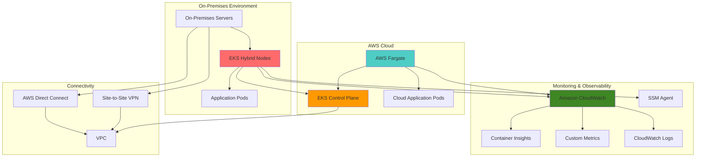

# Hybrid Kubernetes Monitoring with EKS Hybrid Nodes

## Problem

Organizations with hybrid infrastructure face significant challenges monitoring Kubernetes workloads that span both on-premises data centers and AWS cloud environments. Traditional monitoring solutions create operational silos, requiring separate tools and dashboards for cloud and on-premises workloads, leading to fragmented visibility, delayed incident response, and increased operational complexity. Without unified observability, teams struggle to correlate performance issues across hybrid environments and lack comprehensive insights into resource utilization and application health.

## Solution

Amazon EKS Hybrid Nodes enables a unified Kubernetes control plane managed by AWS while allowing on-premises infrastructure to join as cluster nodes, creating a single monitoring surface across hybrid environments. By combining EKS Hybrid Nodes with AWS Fargate for cloud workloads and Amazon CloudWatch for centralized observability, this solution provides comprehensive monitoring that unifies metrics, logs, and traces from both environments while leveraging AWS-managed services for scalability and reliability.

## Architecture Diagram



## Prerequisites

1. AWS account with appropriate permissions for EKS, CloudWatch, Fargate, and Systems Manager
2. AWS CLI v2 installed and configured (or AWS CloudShell)
3. kubectl installed (version 1.28 or later)
4. On-premises infrastructure with network connectivity to AWS via Direct Connect or Site-to-Site VPN
5. Basic understanding of Kubernetes concepts and container orchestration
6. Estimated cost: $150-300/month for cluster, Fargate tasks, CloudWatch metrics, and hybrid node charges

> **Note**: EKS Hybrid Nodes requires reliable network connectivity between your on-premises environment and AWS. This solution is not suitable for disconnected or intermittent network environments.

## Preparation

```bash
# Set environment variables
export AWS_REGION=$(aws configure get region)
export AWS_ACCOUNT_ID=$(aws sts get-caller-identity \
    --query Account --output text)

# Generate unique identifiers for resources
RANDOM_SUFFIX=$(aws secretsmanager get-random-password \
    --exclude-punctuation --exclude-uppercase \
    --password-length 6 --require-each-included-type \
    --output text --query RandomPassword)

export CLUSTER_NAME="hybrid-monitoring-cluster-${RANDOM_SUFFIX}"
export VPC_NAME="hybrid-monitoring-vpc-${RANDOM_SUFFIX}"
export CLOUDWATCH_NAMESPACE="EKS/HybridMonitoring"

# Create VPC for EKS cluster
aws ec2 create-vpc \
    --cidr-block 10.0.0.0/16 \
    --tag-specifications "ResourceType=vpc,Tags=[{Key=Name,Value=${VPC_NAME}}]"

export VPC_ID=$(aws ec2 describe-vpcs \
    --filters "Name=tag:Name,Values=${VPC_NAME}" \
    --query 'Vpcs[0].VpcId' --output text)

# Create internet gateway for public subnet connectivity
aws ec2 create-internet-gateway \
    --tag-specifications "ResourceType=internet-gateway,Tags=[{Key=Name,Value=${VPC_NAME}-igw}]"

export IGW_ID=$(aws ec2 describe-internet-gateways \
    --filters "Name=tag:Name,Values=${VPC_NAME}-igw" \
    --query 'InternetGateways[0].InternetGatewayId' --output text)

# Attach internet gateway to VPC
aws ec2 attach-internet-gateway \
    --vpc-id ${VPC_ID} \
    --internet-gateway-id ${IGW_ID}

# Create subnets for EKS cluster
aws ec2 create-subnet \
    --vpc-id ${VPC_ID} \
    --cidr-block 10.0.1.0/24 \
    --availability-zone ${AWS_REGION}a \
    --tag-specifications "ResourceType=subnet,Tags=[{Key=Name,Value=hybrid-public-1}]"

aws ec2 create-subnet \
    --vpc-id ${VPC_ID} \
    --cidr-block 10.0.2.0/24 \
    --availability-zone ${AWS_REGION}b \
    --tag-specifications "ResourceType=subnet,Tags=[{Key=Name,Value=hybrid-public-2}]"

export PUBLIC_SUBNET_1=$(aws ec2 describe-subnets \
    --filters "Name=tag:Name,Values=hybrid-public-1" \
    --query 'Subnets[0].SubnetId' --output text)

export PUBLIC_SUBNET_2=$(aws ec2 describe-subnets \
    --filters "Name=tag:Name,Values=hybrid-public-2" \
    --query 'Subnets[0].SubnetId' --output text)

# Enable auto-assign public IPs for public subnets
aws ec2 modify-subnet-attribute \
    --subnet-id ${PUBLIC_SUBNET_1} \
    --map-public-ip-on-launch

aws ec2 modify-subnet-attribute \
    --subnet-id ${PUBLIC_SUBNET_2} \
    --map-public-ip-on-launch

# Create route table for public subnets
aws ec2 create-route-table \
    --vpc-id ${VPC_ID} \
    --tag-specifications "ResourceType=route-table,Tags=[{Key=Name,Value=${VPC_NAME}-public-rt}]"

export PUBLIC_RT_ID=$(aws ec2 describe-route-tables \
    --filters "Name=tag:Name,Values=${VPC_NAME}-public-rt" \
    --query 'RouteTables[0].RouteTableId' --output text)

# Create route to internet gateway
aws ec2 create-route \
    --route-table-id ${PUBLIC_RT_ID} \
    --destination-cidr-block 0.0.0.0/0 \
    --gateway-id ${IGW_ID}

# Associate public subnets with route table
aws ec2 associate-route-table \
    --subnet-id ${PUBLIC_SUBNET_1} \
    --route-table-id ${PUBLIC_RT_ID}

aws ec2 associate-route-table \
    --subnet-id ${PUBLIC_SUBNET_2} \
    --route-table-id ${PUBLIC_RT_ID}

echo "✅ VPC and subnets created for hybrid EKS cluster"
```

## Steps

1. **Create IAM Service Role for EKS Cluster**:

   Amazon EKS requires a service role with specific permissions to manage the Kubernetes control plane and integrate with other AWS services. This role enables EKS to create and manage cloud resources, configure networking, and provide secure API access. The service role establishes the trust relationship between your AWS account and the EKS service, ensuring secure cluster operations while following the principle of least privilege. According to the [Amazon EKS service IAM role documentation](https://docs.aws.amazon.com/eks/latest/userguide/service_IAM_role.html), this role is essential for cluster lifecycle management and cross-service integration.

   ```bash
   # Create EKS cluster service role
   aws iam create-role \
       --role-name EKSClusterServiceRole-${RANDOM_SUFFIX} \
       --assume-role-policy-document '{
         "Version": "2012-10-17",
         "Statement": [
           {
             "Effect": "Allow",
             "Principal": {
               "Service": "eks.amazonaws.com"
             },
             "Action": "sts:AssumeRole"
           }
         ]
       }'
   
   # Attach required managed policies
   aws iam attach-role-policy \
       --role-name EKSClusterServiceRole-${RANDOM_SUFFIX} \
       --policy-arn arn:aws:iam::aws:policy/AmazonEKSClusterPolicy
   
   export EKS_ROLE_ARN=$(aws iam get-role \
       --role-name EKSClusterServiceRole-${RANDOM_SUFFIX} \
       --query 'Role.Arn' --output text)
   
   echo "✅ EKS cluster service role created: ${EKS_ROLE_ARN}"
   ```

   The EKS service role is now established with the necessary permissions to manage the Kubernetes control plane, enabling secure cluster creation and operations while maintaining AWS security best practices. This foundational IAM configuration ensures proper service-to-service authentication for all EKS operations.

2. **Create EKS Cluster with Hybrid Node Support**:

   Amazon EKS provides a fully managed Kubernetes control plane that can span hybrid environments through EKS Hybrid Nodes. Enabling hybrid node support during cluster creation configures the control plane to accept connections from on-premises infrastructure while maintaining the reliability and scalability of AWS-managed services. The `remoteNodeNetworks` configuration defines the CIDR ranges for on-premises infrastructure, establishing secure connectivity channels for hybrid workloads. This architecture pattern enables unified Kubernetes management across cloud and on-premises environments while leveraging the [AWS Well-Architected Framework](https://docs.aws.amazon.com/wellarchitected/latest/framework/welcome.html) principles.

   ```bash
   # Create EKS cluster with hybrid nodes enabled
   aws eks create-cluster \
       --name ${CLUSTER_NAME} \
       --version 1.31 \
       --role-arn ${EKS_ROLE_ARN} \
       --resources-vpc-config subnetIds=${PUBLIC_SUBNET_1},${PUBLIC_SUBNET_2} \
       --access-config authenticationMode=API_AND_CONFIG_MAP \
       --remote-network-config remoteNodeNetworks='[{cidrs=["10.100.0.0/16"]}]'
   
   echo "Waiting for cluster to become active..."
   aws eks wait cluster-active --name ${CLUSTER_NAME}
   
   # Update kubeconfig for cluster access
   aws eks update-kubeconfig --name ${CLUSTER_NAME} --region ${AWS_REGION}
   
   echo "✅ EKS cluster created with hybrid node support"
   ```

   The EKS cluster is now operational with hybrid node capabilities enabled. The control plane can accept connections from both AWS-managed nodes and on-premises infrastructure, providing a unified management interface for hybrid workloads with consistent API access and authentication across environments.

3. **Create IAM Role for Fargate Profile**:

   AWS Fargate requires an execution role with specific permissions to launch and manage containers on your behalf. This serverless compute engine eliminates the need to manage EC2 instances while providing secure, isolated compute environments for containerized applications. The Fargate profile role enables seamless integration with EKS while maintaining security boundaries and resource isolation. According to the [Fargate pod execution role documentation](https://docs.aws.amazon.com/eks/latest/userguide/fargate-getting-started.html#fargate-sg-pod-execution-role), this role is essential for container image pulling and CloudWatch logging integration.

   ```bash
   # Create Fargate execution role
   aws iam create-role \
       --role-name EKSFargateExecutionRole-${RANDOM_SUFFIX} \
       --assume-role-policy-document '{
         "Version": "2012-10-17",
         "Statement": [
           {
             "Effect": "Allow",
             "Principal": {
               "Service": "eks-fargate-pods.amazonaws.com"
             },
             "Action": "sts:AssumeRole"
           }
         ]
       }'
   
   # Attach required managed policy
   aws iam attach-role-policy \
       --role-name EKSFargateExecutionRole-${RANDOM_SUFFIX} \
       --policy-arn arn:aws:iam::aws:policy/AmazonEKSFargatePodExecutionRolePolicy
   
   export FARGATE_ROLE_ARN=$(aws iam get-role \
       --role-name EKSFargateExecutionRole-${RANDOM_SUFFIX} \
       --query 'Role.Arn' --output text)
   
   echo "✅ Fargate execution role created: ${FARGATE_ROLE_ARN}"
   ```

   The Fargate execution role is configured and ready to manage containerized workloads. This enables serverless container execution in the cloud portion of your hybrid architecture while maintaining security and compliance requirements through IAM-based access control.

4. **Create Fargate Profile for Cloud Workloads**:

   Fargate profiles define which pods should run on AWS Fargate based on namespace and label selectors. This serverless execution model provides automatic scaling, security isolation, and eliminates the operational overhead of managing EC2 instances. By creating a dedicated Fargate profile for cloud workloads, you establish clear separation between on-premises and cloud-native applications while enabling seamless scheduling across the hybrid environment. The profile configuration ensures that pods in specific namespaces automatically utilize Fargate's serverless compute capacity.

   ```bash
   # Create private subnets for Fargate
   aws ec2 create-subnet \
       --vpc-id ${VPC_ID} \
       --cidr-block 10.0.3.0/24 \
       --availability-zone ${AWS_REGION}a \
       --tag-specifications "ResourceType=subnet,Tags=[{Key=Name,Value=hybrid-private-1}]"
   
   aws ec2 create-subnet \
       --vpc-id ${VPC_ID} \
       --cidr-block 10.0.4.0/24 \
       --availability-zone ${AWS_REGION}b \
       --tag-specifications "ResourceType=subnet,Tags=[{Key=Name,Value=hybrid-private-2}]"
   
   export PRIVATE_SUBNET_1=$(aws ec2 describe-subnets \
       --filters "Name=tag:Name,Values=hybrid-private-1" \
       --query 'Subnets[0].SubnetId' --output text)
   
   export PRIVATE_SUBNET_2=$(aws ec2 describe-subnets \
       --filters "Name=tag:Name,Values=hybrid-private-2" \
       --query 'Subnets[0].SubnetId' --output text)
   
   # Create NAT gateways for private subnet internet access
   aws ec2 allocate-address --domain vpc \
       --tag-specifications "ResourceType=elastic-ip,Tags=[{Key=Name,Value=${VPC_NAME}-nat-eip-1}]"
   
   export NAT_EIP_1=$(aws ec2 describe-addresses \
       --filters "Name=tag:Name,Values=${VPC_NAME}-nat-eip-1" \
       --query 'Addresses[0].AllocationId' --output text)
   
   aws ec2 create-nat-gateway \
       --subnet-id ${PUBLIC_SUBNET_1} \
       --allocation-id ${NAT_EIP_1} \
       --tag-specifications "ResourceType=nat-gateway,Tags=[{Key=Name,Value=${VPC_NAME}-nat-gw-1}]"
   
   export NAT_GW_1=$(aws ec2 describe-nat-gateways \
       --filter "Name=tag:Name,Values=${VPC_NAME}-nat-gw-1" \
       --query 'NatGateways[0].NatGatewayId' --output text)
   
   # Create route table for private subnets
   aws ec2 create-route-table \
       --vpc-id ${VPC_ID} \
       --tag-specifications "ResourceType=route-table,Tags=[{Key=Name,Value=${VPC_NAME}-private-rt}]"
   
   export PRIVATE_RT_ID=$(aws ec2 describe-route-tables \
       --filters "Name=tag:Name,Values=${VPC_NAME}-private-rt" \
       --query 'RouteTables[0].RouteTableId' --output text)
   
   # Create route to NAT gateway
   aws ec2 create-route \
       --route-table-id ${PRIVATE_RT_ID} \
       --destination-cidr-block 0.0.0.0/0 \
       --nat-gateway-id ${NAT_GW_1}
   
   # Associate private subnets with route table
   aws ec2 associate-route-table \
       --subnet-id ${PRIVATE_SUBNET_1} \
       --route-table-id ${PRIVATE_RT_ID}
   
   aws ec2 associate-route-table \
       --subnet-id ${PRIVATE_SUBNET_2} \
       --route-table-id ${PRIVATE_RT_ID}
   
   # Create Fargate profile for cloud workloads
   aws eks create-fargate-profile \
       --cluster-name ${CLUSTER_NAME} \
       --fargate-profile-name cloud-workloads \
       --pod-execution-role-arn ${FARGATE_ROLE_ARN} \
       --subnets ${PRIVATE_SUBNET_1} ${PRIVATE_SUBNET_2} \
       --selectors namespace=cloud-apps \
       --tags Environment=Production,Component=CloudWorkloads
   
   echo "Waiting for Fargate profile to become active..."
   aws eks wait fargate-profile-active \
       --cluster-name ${CLUSTER_NAME} \
       --fargate-profile-name cloud-workloads
   
   echo "✅ Fargate profile created for cloud workloads"
   ```

   The Fargate profile is now active and ready to schedule pods in the `cloud-apps` namespace. This provides serverless compute capacity for cloud-native applications while maintaining clear boundaries between hybrid and cloud-only workloads, ensuring optimal resource utilization and cost efficiency.

5. **Install CloudWatch Observability Add-on**:

   The CloudWatch Observability add-on provides comprehensive monitoring capabilities for EKS clusters by automatically collecting metrics, logs, and traces from both Fargate and hybrid nodes. This managed add-on simplifies observability setup while ensuring compatibility with hybrid architectures. Container Insights integration enables detailed visibility into pod performance, resource utilization, and application health across your hybrid environment. The add-on leverages [IAM roles for service accounts (IRSA)](https://docs.aws.amazon.com/eks/latest/userguide/iam-roles-for-service-accounts.html) for secure authentication to AWS services.

   ```bash
   # Create OIDC identity provider for the cluster
   export OIDC_ISSUER=$(aws eks describe-cluster \
       --name ${CLUSTER_NAME} \
       --query 'cluster.identity.oidc.issuer' --output text)
   
   export OIDC_ID=$(echo ${OIDC_ISSUER} | sed 's|https://||')
   
   # Check if OIDC provider already exists
   aws iam list-open-id-connect-providers \
       --query "OpenIDConnectProviderList[?contains(Arn, '${OIDC_ID}')].Arn" \
       --output text
   
   # Create OIDC provider if it doesn't exist
   if [ -z "$(aws iam list-open-id-connect-providers --query "OpenIDConnectProviderList[?contains(Arn, '${OIDC_ID}')].Arn" --output text)" ]; then
       aws iam create-open-id-connect-provider \
           --url ${OIDC_ISSUER} \
           --client-id-list sts.amazonaws.com \
           --thumbprint-list 9e99a48a9960b14926bb7f3b02e22da2b0ab7280
   fi
   
   # Create IAM role for CloudWatch Observability add-on
   aws iam create-role \
       --role-name CloudWatchObservabilityRole-${RANDOM_SUFFIX} \
       --assume-role-policy-document '{
         "Version": "2012-10-17",
         "Statement": [
           {
             "Effect": "Allow",
             "Principal": {
               "Federated": "arn:aws:iam::'${AWS_ACCOUNT_ID}':oidc-provider/'${OIDC_ID}'"
             },
             "Action": "sts:AssumeRoleWithWebIdentity",
             "Condition": {
               "StringEquals": {
                 "'${OIDC_ID}':sub": "system:serviceaccount:amazon-cloudwatch:cloudwatch-agent",
                 "'${OIDC_ID}':aud": "sts.amazonaws.com"
               }
             }
           }
         ]
       }'
   
   # Attach CloudWatch agent policy
   aws iam attach-role-policy \
       --role-name CloudWatchObservabilityRole-${RANDOM_SUFFIX} \
       --policy-arn arn:aws:iam::aws:policy/CloudWatchAgentServerPolicy
   
   # Install CloudWatch Observability add-on
   aws eks create-addon \
       --cluster-name ${CLUSTER_NAME} \
       --addon-name amazon-cloudwatch-observability \
       --addon-version v2.1.0-eksbuild.1 \
       --service-account-role-arn $(aws iam get-role \
           --role-name CloudWatchObservabilityRole-${RANDOM_SUFFIX} \
           --query 'Role.Arn' --output text) \
       --configuration-values '{"containerInsights":{"enabled":true}}'
   
   echo "Waiting for CloudWatch add-on to become active..."
   aws eks wait addon-active \
       --cluster-name ${CLUSTER_NAME} \
       --addon-name amazon-cloudwatch-observability
   
   echo "✅ CloudWatch Observability add-on installed with Container Insights"
   ```

   The CloudWatch Observability add-on is now operational and collecting comprehensive monitoring data from your hybrid EKS cluster. This establishes centralized observability that spans both cloud and on-premises workloads with automated metric collection, log aggregation, and integration with CloudWatch dashboards.

6. **Deploy Sample Applications for Testing**:

   Deploying sample applications across both Fargate and hybrid nodes demonstrates the monitoring capabilities and validates the hybrid architecture. These applications generate metrics, logs, and traces that showcase the unified observability provided by CloudWatch. The workload distribution helps verify that monitoring works consistently across different compute environments within the same cluster. The sample applications include resource requests and limits following [Kubernetes resource management best practices](https://kubernetes.io/docs/concepts/configuration/manage-resources-containers/).

   ```bash
   # Create namespace for cloud applications
   kubectl create namespace cloud-apps
   kubectl label namespace cloud-apps monitoring=enabled
   
   # Deploy sample application on Fargate
   cat <<EOF | kubectl apply -f -
   apiVersion: apps/v1
   kind: Deployment
   metadata:
     name: cloud-sample-app
     namespace: cloud-apps
   spec:
     replicas: 2
     selector:
       matchLabels:
         app: cloud-sample-app
     template:
       metadata:
         labels:
           app: cloud-sample-app
         annotations:
           prometheus.io/scrape: "true"
           prometheus.io/port: "80"
       spec:
         containers:
         - name: sample-app
           image: public.ecr.aws/docker/library/nginx:latest
           ports:
           - containerPort: 80
           resources:
             requests:
               cpu: 100m
               memory: 128Mi
             limits:
               cpu: 200m
               memory: 256Mi
           env:
           - name: ENVIRONMENT
             value: "fargate"
   ---
   apiVersion: v1
   kind: Service
   metadata:
     name: cloud-sample-service
     namespace: cloud-apps
   spec:
     selector:
       app: cloud-sample-app
     ports:
     - protocol: TCP
       port: 80
       targetPort: 80
     type: ClusterIP
   EOF
   
   # Create namespace for on-premises applications
   kubectl create namespace onprem-apps
   kubectl label namespace onprem-apps monitoring=enabled
   
   echo "✅ Sample applications deployed for monitoring validation"
   ```

   Sample applications are now running in the cloud-apps namespace on Fargate, generating metrics and logs for monitoring validation. These workloads provide a foundation for testing the observability capabilities across your hybrid environment and demonstrate the seamless scheduling capabilities of the unified cluster.

7. **Configure Custom Metrics Collection**:

   Custom metrics provide business-specific insights beyond standard Kubernetes metrics, enabling monitoring of application performance indicators and business KPIs. CloudWatch custom metrics integration allows you to track hybrid workload performance with application-specific measurements while maintaining centralized visibility. This configuration enables proactive monitoring and alerting based on your unique operational requirements. The metrics collector uses [AWS CLI within containers](https://docs.aws.amazon.com/cli/latest/userguide/install-cliv2-docker.html) to publish custom metrics to CloudWatch.

   ```bash
   # Create service account for custom metrics collection
   kubectl create serviceaccount hybrid-metrics-sa -n cloud-apps
   
   # Create IAM role for custom metrics collection
   aws iam create-role \
       --role-name HybridMetricsRole-${RANDOM_SUFFIX} \
       --assume-role-policy-document '{
         "Version": "2012-10-17",
         "Statement": [
           {
             "Effect": "Allow",
             "Principal": {
               "Federated": "arn:aws:iam::'${AWS_ACCOUNT_ID}':oidc-provider/'${OIDC_ID}'"
             },
             "Action": "sts:AssumeRoleWithWebIdentity",
             "Condition": {
               "StringEquals": {
                 "'${OIDC_ID}':sub": "system:serviceaccount:cloud-apps:hybrid-metrics-sa",
                 "'${OIDC_ID}':aud": "sts.amazonaws.com"
               }
             }
           }
         ]
       }'
   
   # Attach CloudWatch metrics policy
   aws iam attach-role-policy \
       --role-name HybridMetricsRole-${RANDOM_SUFFIX} \
       --policy-arn arn:aws:iam::aws:policy/CloudWatchAgentServerPolicy
   
   # Annotate service account with IAM role
   kubectl annotate serviceaccount hybrid-metrics-sa \
       -n cloud-apps \
       eks.amazonaws.com/role-arn=$(aws iam get-role \
           --role-name HybridMetricsRole-${RANDOM_SUFFIX} \
           --query 'Role.Arn' --output text)
   
   # Create CloudWatch custom metric configuration
   cat <<EOF | kubectl apply -f -
   apiVersion: v1
   kind: ConfigMap
   metadata:
     name: hybrid-monitoring-config
     namespace: amazon-cloudwatch
   data:
     cwagentconfig.json: |
       {
         "agent": {
           "region": "${AWS_REGION}",
           "debug": false
         },
         "logs": {
           "metrics_collected": {
             "kubernetes": {
               "cluster_name": "${CLUSTER_NAME}",
               "metrics_collection_interval": 60
             }
           }
         },
         "metrics": {
           "namespace": "${CLOUDWATCH_NAMESPACE}",
           "metrics_collected": {
             "kubernetes": {
               "cluster_name": "${CLUSTER_NAME}",
               "metrics_collection_interval": 60
             }
           }
         }
       }
   EOF
   
   # Deploy custom metric collector
   cat <<EOF | kubectl apply -f -
   apiVersion: batch/v1
   kind: CronJob
   metadata:
     name: hybrid-metrics-collector
     namespace: cloud-apps
   spec:
     schedule: "*/5 * * * *"
     jobTemplate:
       spec:
         template:
           spec:
             serviceAccountName: hybrid-metrics-sa
             containers:
             - name: metrics-collector
               image: amazon/aws-cli:latest
               command:
               - /bin/sh
               - -c
               - |
                 HYBRID_NODES=\$(kubectl get nodes -l kubernetes.io/arch=amd64 --no-headers | wc -l)
                 FARGATE_PODS=\$(kubectl get pods -A -o jsonpath='{.items[?(@.spec.nodeName)].spec.nodeName}' | tr ' ' '\n' | grep fargate | wc -l)
                 TOTAL_PODS=\$(kubectl get pods -A --no-headers | wc -l)
                 
                 aws cloudwatch put-metric-data \
                   --region ${AWS_REGION} \
                   --namespace ${CLOUDWATCH_NAMESPACE} \
                   --metric-data MetricName=HybridNodeCount,Value=\$HYBRID_NODES,Unit=Count \
                                 MetricName=FargatePodCount,Value=\$FARGATE_PODS,Unit=Count \
                                 MetricName=TotalPodCount,Value=\$TOTAL_PODS,Unit=Count
             restartPolicy: OnFailure
   EOF
   
   echo "✅ Custom metrics collection configured for hybrid monitoring"
   ```

   Custom metrics collection is now active, providing specialized insights into hybrid node utilization and Fargate pod distribution. This enables advanced monitoring capabilities that track the unique characteristics of your hybrid Kubernetes environment and supports data-driven capacity planning decisions.

8. **Set Up CloudWatch Dashboards and Alarms**:

   CloudWatch dashboards provide unified visualization of hybrid cluster performance, consolidating metrics from both on-premises and cloud workloads into actionable insights. Automated alarms enable proactive monitoring and incident response, ensuring operational excellence across your hybrid environment. This comprehensive monitoring setup reduces mean time to detection and enables data-driven optimization decisions. The dashboard configuration follows [CloudWatch dashboard best practices](https://docs.aws.amazon.com/AmazonCloudWatch/latest/monitoring/CloudWatch_Dashboards.html) for optimal visualization and performance.

   ```bash
   # Create CloudWatch dashboard for hybrid monitoring
   aws cloudwatch put-dashboard \
       --dashboard-name "EKS-Hybrid-Monitoring-${CLUSTER_NAME}" \
       --dashboard-body '{
         "widgets": [
           {
             "type": "metric",
             "x": 0,
             "y": 0,
             "width": 12,
             "height": 6,
             "properties": {
               "metrics": [
                 [ "AWS/EKS", "cluster_node_count", "ClusterName", "'${CLUSTER_NAME}'" ],
                 [ "'${CLOUDWATCH_NAMESPACE}'", "HybridNodeCount" ],
                 [ ".", "FargatePodCount" ]
               ],
               "period": 300,
               "stat": "Average",
               "region": "'${AWS_REGION}'",
               "title": "Hybrid Cluster Capacity",
               "yAxis": {
                 "left": {
                   "min": 0
                 }
               }
             }
           },
           {
             "type": "metric",
             "x": 0,
             "y": 6,
             "width": 12,
             "height": 6,
             "properties": {
               "metrics": [
                 [ "AWS/ContainerInsights", "pod_cpu_utilization", "ClusterName", "'${CLUSTER_NAME}'" ],
                 [ ".", "pod_memory_utilization", ".", "." ]
               ],
               "period": 300,
               "stat": "Average",
               "region": "'${AWS_REGION}'",
               "title": "Pod Resource Utilization",
               "yAxis": {
                 "left": {
                   "min": 0,
                   "max": 100
                 }
               }
             }
           },
           {
             "type": "log",
             "x": 0,
             "y": 12,
             "width": 24,
             "height": 6,
             "properties": {
               "query": "SOURCE \"/aws/containerinsights/'${CLUSTER_NAME}'/application\"\n| fields @timestamp, kubernetes.pod_name, log\n| filter kubernetes.namespace_name = \"cloud-apps\"\n| sort @timestamp desc\n| limit 100",
               "region": "'${AWS_REGION}'",
               "title": "Application Logs from Cloud Apps",
               "view": "table"
             }
           }
         ]
       }'
   
   # Create CloudWatch alarms for monitoring
   aws cloudwatch put-metric-alarm \
       --alarm-name "EKS-Hybrid-HighCPU-${CLUSTER_NAME}" \
       --alarm-description "High CPU utilization in hybrid cluster" \
       --metric-name pod_cpu_utilization \
       --namespace AWS/ContainerInsights \
       --statistic Average \
       --period 300 \
       --threshold 80 \
       --comparison-operator GreaterThanThreshold \
       --evaluation-periods 2 \
       --dimensions Name=ClusterName,Value=${CLUSTER_NAME} \
       --treat-missing-data notBreaching
   
   aws cloudwatch put-metric-alarm \
       --alarm-name "EKS-Hybrid-HighMemory-${CLUSTER_NAME}" \
       --alarm-description "High memory utilization in hybrid cluster" \
       --metric-name pod_memory_utilization \
       --namespace AWS/ContainerInsights \
       --statistic Average \
       --period 300 \
       --threshold 80 \
       --comparison-operator GreaterThanThreshold \
       --evaluation-periods 2 \
       --dimensions Name=ClusterName,Value=${CLUSTER_NAME} \
       --treat-missing-data notBreaching
   
   aws cloudwatch put-metric-alarm \
       --alarm-name "EKS-Hybrid-LowNodeCount-${CLUSTER_NAME}" \
       --alarm-description "Low hybrid node count" \
       --metric-name HybridNodeCount \
       --namespace ${CLOUDWATCH_NAMESPACE} \
       --statistic Average \
       --period 300 \
       --threshold 1 \
       --comparison-operator LessThanThreshold \
       --evaluation-periods 1 \
       --treat-missing-data breaching
   
   echo "✅ CloudWatch dashboards and alarms configured for hybrid monitoring"
   ```

   Comprehensive monitoring infrastructure is now established with dashboards providing unified visibility and alarms ensuring proactive incident management. This setup enables continuous monitoring of hybrid cluster health and performance across both cloud and on-premises environments with automated alerting for critical conditions.

## Validation & Testing

1. Verify EKS cluster is operational with hybrid node support:

   ```bash
   # Check cluster status
   aws eks describe-cluster --name ${CLUSTER_NAME} \
       --query 'cluster.status' --output text
   
   # Verify hybrid node configuration
   aws eks describe-cluster --name ${CLUSTER_NAME} \
       --query 'cluster.remoteNetworkConfig' --output json
   ```

   Expected output: `ACTIVE` status and configured remote network configuration

2. Validate Fargate profile is active:

   ```bash
   # Check Fargate profile status
   aws eks describe-fargate-profile \
       --cluster-name ${CLUSTER_NAME} \
       --fargate-profile-name cloud-workloads \
       --query 'fargateProfile.status' --output text
   ```

   Expected output: `ACTIVE`

3. Test CloudWatch Observability add-on functionality:

   ```bash
   # Verify add-on status
   aws eks describe-addon \
       --cluster-name ${CLUSTER_NAME} \
       --addon-name amazon-cloudwatch-observability \
       --query 'addon.status' --output text
   
   # Check CloudWatch agent pods
   kubectl get pods -n amazon-cloudwatch
   ```

   Expected output: `ACTIVE` status and running CloudWatch agent pods

4. Validate sample applications are running correctly:

   ```bash
   # Check application pod status
   kubectl get pods -n cloud-apps
   kubectl get pods -n onprem-apps
   
   # Verify pods are scheduled on Fargate
   kubectl get pods -n cloud-apps -o wide
   
   # Test application connectivity
   kubectl port-forward -n cloud-apps \
       service/cloud-sample-service 8080:80 &
   sleep 5
   curl http://localhost:8080
   pkill -f "kubectl port-forward"
   ```

5. Verify metrics are flowing to CloudWatch:

   ```bash
   # Check custom metrics in CloudWatch
   aws cloudwatch list-metrics \
       --namespace ${CLOUDWATCH_NAMESPACE}
   
   # View Container Insights metrics
   aws cloudwatch list-metrics \
       --namespace AWS/ContainerInsights \
       --dimensions Name=ClusterName,Value=${CLUSTER_NAME}
   
   # Test dashboard access
   echo "Dashboard URL: https://${AWS_REGION}.console.aws.amazon.com/cloudwatch/home?region=${AWS_REGION}#dashboards:name=EKS-Hybrid-Monitoring-${CLUSTER_NAME}"
   ```

6. Test alarm functionality:

   ```bash
   # Check alarm states
   aws cloudwatch describe-alarms \
       --alarm-names "EKS-Hybrid-HighCPU-${CLUSTER_NAME}" \
                    "EKS-Hybrid-HighMemory-${CLUSTER_NAME}" \
                    "EKS-Hybrid-LowNodeCount-${CLUSTER_NAME}" \
       --query 'MetricAlarms[*].[AlarmName,StateValue]' --output table
   ```

## Cleanup

1. Remove sample applications and configurations:

   ```bash
   # Delete sample applications
   kubectl delete namespace cloud-apps
   kubectl delete namespace onprem-apps
   
   # Remove custom monitoring configurations
   kubectl delete configmap hybrid-monitoring-config -n amazon-cloudwatch
   
   echo "✅ Deleted sample applications and configurations"
   ```

2. Remove CloudWatch dashboards and alarms:

   ```bash
   # Delete CloudWatch dashboard
   aws cloudwatch delete-dashboards \
       --dashboard-names "EKS-Hybrid-Monitoring-${CLUSTER_NAME}"
   
   # Delete CloudWatch alarms
   aws cloudwatch delete-alarms \
       --alarm-names "EKS-Hybrid-HighCPU-${CLUSTER_NAME}" \
                    "EKS-Hybrid-HighMemory-${CLUSTER_NAME}" \
                    "EKS-Hybrid-LowNodeCount-${CLUSTER_NAME}"
   
   echo "✅ Deleted CloudWatch dashboards and alarms"
   ```

3. Remove EKS add-ons and profiles:

   ```bash
   # Delete CloudWatch Observability add-on
   aws eks delete-addon \
       --cluster-name ${CLUSTER_NAME} \
       --addon-name amazon-cloudwatch-observability
   
   # Delete Fargate profile
   aws eks delete-fargate-profile \
       --cluster-name ${CLUSTER_NAME} \
       --fargate-profile-name cloud-workloads
   
   echo "Waiting for resources to be deleted..."
   aws eks wait fargate-profile-deleted \
       --cluster-name ${CLUSTER_NAME} \
       --fargate-profile-name cloud-workloads
   
   echo "✅ Deleted EKS add-ons and Fargate profile"
   ```

4. Delete EKS cluster and associated resources:

   ```bash
   # Delete EKS cluster
   aws eks delete-cluster --name ${CLUSTER_NAME}
   
   echo "Waiting for cluster deletion..."
   aws eks wait cluster-deleted --name ${CLUSTER_NAME}
   
   # Delete NAT gateway and release Elastic IP
   aws ec2 delete-nat-gateway --nat-gateway-id ${NAT_GW_1}
   aws ec2 release-address --allocation-id ${NAT_EIP_1}
   
   # Delete VPC and subnets
   aws ec2 delete-subnet --subnet-id ${PUBLIC_SUBNET_1}
   aws ec2 delete-subnet --subnet-id ${PUBLIC_SUBNET_2}
   aws ec2 delete-subnet --subnet-id ${PRIVATE_SUBNET_1}
   aws ec2 delete-subnet --subnet-id ${PRIVATE_SUBNET_2}
   
   # Delete route tables
   aws ec2 delete-route-table --route-table-id ${PUBLIC_RT_ID}
   aws ec2 delete-route-table --route-table-id ${PRIVATE_RT_ID}
   
   # Detach and delete internet gateway
   aws ec2 detach-internet-gateway \
       --vpc-id ${VPC_ID} \
       --internet-gateway-id ${IGW_ID}
   aws ec2 delete-internet-gateway --internet-gateway-id ${IGW_ID}
   
   # Delete VPC
   aws ec2 delete-vpc --vpc-id ${VPC_ID}
   
   echo "✅ Deleted EKS cluster and VPC resources"
   ```

5. Remove IAM roles and policies:

   ```bash
   # Detach and delete EKS cluster service role
   aws iam detach-role-policy \
       --role-name EKSClusterServiceRole-${RANDOM_SUFFIX} \
       --policy-arn arn:aws:iam::aws:policy/AmazonEKSClusterPolicy
   
   aws iam delete-role --role-name EKSClusterServiceRole-${RANDOM_SUFFIX}
   
   # Detach and delete Fargate execution role
   aws iam detach-role-policy \
       --role-name EKSFargateExecutionRole-${RANDOM_SUFFIX} \
       --policy-arn arn:aws:iam::aws:policy/AmazonEKSFargatePodExecutionRolePolicy
   
   aws iam delete-role --role-name EKSFargateExecutionRole-${RANDOM_SUFFIX}
   
   # Delete CloudWatch Observability role
   aws iam detach-role-policy \
       --role-name CloudWatchObservabilityRole-${RANDOM_SUFFIX} \
       --policy-arn arn:aws:iam::aws:policy/CloudWatchAgentServerPolicy
   
   aws iam delete-role --role-name CloudWatchObservabilityRole-${RANDOM_SUFFIX}
   
   # Delete custom metrics role
   aws iam detach-role-policy \
       --role-name HybridMetricsRole-${RANDOM_SUFFIX} \
       --policy-arn arn:aws:iam::aws:policy/CloudWatchAgentServerPolicy
   
   aws iam delete-role --role-name HybridMetricsRole-${RANDOM_SUFFIX}
   
   echo "✅ Deleted all IAM roles and policies"
   ```

## Discussion

Implementing hybrid Kubernetes monitoring with Amazon EKS Hybrid Nodes and CloudWatch creates a powerful observability solution that unifies monitoring across cloud and on-premises environments. This architecture leverages AWS-managed services for the Kubernetes control plane while maintaining flexibility for on-premises workload placement, resulting in reduced operational overhead and improved scalability. The combination of EKS Hybrid Nodes with CloudWatch Container Insights provides comprehensive visibility into cluster health, application performance, and resource utilization across hybrid infrastructure. For detailed guidance on EKS monitoring best practices, see the [Amazon EKS Observability Best Practices Guide](https://docs.aws.amazon.com/prescriptive-guidance/latest/amazon-eks-observability-best-practices/).

The hybrid architecture enables organizations to gradually migrate workloads to the cloud while maintaining unified operations and monitoring capabilities. By using AWS Fargate for cloud-native workloads and hybrid nodes for on-premises applications, teams can optimize resource utilization and costs while ensuring consistent Kubernetes management. The CloudWatch integration provides centralized logging, metrics collection, and alerting that works seamlessly across both environments, eliminating the need for separate monitoring tools and reducing operational complexity. For comprehensive information on EKS Hybrid Nodes capabilities, review the [EKS Hybrid Nodes documentation](https://docs.aws.amazon.com/eks/latest/userguide/hybrid-nodes-overview.html).

Security and compliance considerations are addressed through IAM integration, encrypted communication channels, and network isolation capabilities. EKS Pod Identity and IRSA enable granular access control for applications running on hybrid nodes, while AWS Systems Manager integration provides secure agent management and configuration distribution. The solution follows [AWS Well-Architected Framework](https://docs.aws.amazon.com/wellarchitected/latest/framework/welcome.html) principles by implementing automated monitoring, proactive alerting, and cost optimization through right-sizing and efficient resource allocation. For security best practices, consult the [EKS Security Documentation](https://docs.aws.amazon.com/eks/latest/userguide/security.html) and [CloudWatch Security Guidelines](https://docs.aws.amazon.com/AmazonCloudWatch/latest/monitoring/security.html).

Operational excellence is achieved through centralized observability that provides actionable insights into hybrid cluster performance and health. The monitoring solution supports both reactive incident response and proactive capacity planning through comprehensive metrics collection and custom dashboard creation. Integration with AWS native services enables seamless scaling, automated remediation, and integration with existing AWS operational workflows while maintaining consistent monitoring experiences across hybrid environments. The [Container Insights documentation](https://docs.aws.amazon.com/AmazonCloudWatch/latest/monitoring/ContainerInsights.html) provides additional guidance on optimizing monitoring configurations for specific use cases.

> **Warning**: Ensure proper network connectivity and security groups are configured for hybrid nodes to communicate with the EKS control plane. Monitor data transfer costs between on-premises and AWS environments, as cross-region or cross-zone traffic may incur additional charges.

> **Tip**: Use CloudWatch Insights queries to correlate performance metrics between Fargate and hybrid nodes, enabling advanced troubleshooting and capacity planning. The [CloudWatch Logs Insights documentation](https://docs.aws.amazon.com/AmazonCloudWatch/latest/logs/AnalyzingLogData.html) provides comprehensive guidance on creating custom queries for hybrid environment analysis.

## Challenge

Extend this hybrid monitoring solution by implementing these advanced capabilities:

1. **Implement Multi-Region Hybrid Monitoring**: Deploy EKS clusters with hybrid nodes across multiple AWS regions and create cross-region monitoring dashboards that provide global visibility into distributed hybrid infrastructure while maintaining regional data sovereignty requirements and implementing cross-region failover capabilities.

2. **Add Advanced Prometheus Integration**: Install and configure Amazon Managed Service for Prometheus with custom scraping configurations for hybrid nodes, implementing advanced PromQL queries for business-specific metrics and integrating with Amazon Managed Grafana for enhanced visualization capabilities with custom alerting rules.

3. **Develop Automated Remediation Workflows**: Create AWS Systems Manager Automation documents and Lambda functions that automatically respond to CloudWatch alarms by scaling hybrid node capacity, restarting failed services, or triggering maintenance workflows based on monitoring data from both cloud and on-premises environments.

4. **Implement Cost Optimization Monitoring**: Build custom CloudWatch metrics that track resource utilization and costs across Fargate and hybrid nodes, implementing automated recommendations for workload placement optimization and cost reduction strategies based on performance and usage patterns with AWS Cost Explorer integration.

5. **Create Application Performance Monitoring**: Integrate AWS X-Ray distributed tracing with applications running on both Fargate and hybrid nodes, implementing custom trace analysis and performance optimization recommendations that provide end-to-end visibility across hybrid application architectures with service map visualization.

## Infrastructure Code

*Infrastructure code will be generated after recipe approval.*