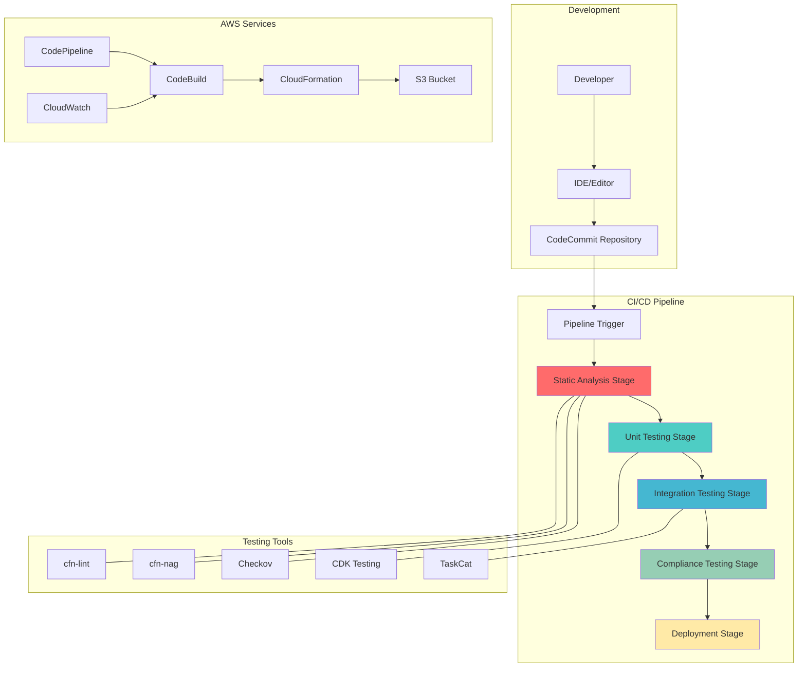

# Infrastructure Testing Strategies for IaC

## Problem

Enterprise organizations deploying infrastructure as code (IaC) at scale face critical challenges ensuring the reliability, security, and compliance of their infrastructure deployments. Manual testing of CloudFormation templates and CDK applications is time-consuming, error-prone, and doesn't catch configuration drift or policy violations before deployment. Teams struggle with inadequate testing coverage, leading to production failures, security vulnerabilities, and compliance violations that could have been prevented with comprehensive automated testing. Without proper testing strategies, infrastructure changes can introduce breaking changes that impact business operations and customer experience.

## Solution

This recipe implements a comprehensive automated testing strategy that validates infrastructure as code through multiple layers of testing including static analysis, unit testing, integration testing, and compliance validation. The solution leverages AWS CodeBuild and CodePipeline to create a continuous integration workflow that automatically tests CloudFormation templates and CDK applications using industry-standard tools like cfn-lint, cfn-nag, Checkov, and CDK's built-in testing framework. The automated pipeline performs syntax validation, security scanning, policy compliance checks, and deployment testing to ensure infrastructure quality before production deployment.

## Architecture Diagram



## Prerequisites

1. AWS account with appropriate permissions for CodeBuild, CodePipeline, CloudFormation, and S3
2. AWS CLI v2 installed and configured (or AWS CloudShell)
3. Node.js 18+ and npm installed (for CDK testing)
4. Python 3.9+ and pip installed (for Python-based testing tools)
5. Docker installed (optional, for local testing)
6. Estimated cost: $20-50 per month for CodeBuild and CodePipeline usage

> **Warning**: This recipe creates AWS resources that incur costs, including CodeBuild compute time, CodePipeline executions, and S3 storage. Monitor your usage through AWS Cost Explorer and clean up resources when no longer needed to avoid unexpected charges. For cost optimization strategies, see the [AWS Cost Management User Guide](https://docs.aws.amazon.com/cost-management/latest/userguide/ce-api-best-practices.html).

## Preparation

```bash
# Set environment variables
export AWS_REGION=$(aws configure get region)
export AWS_ACCOUNT_ID=$(aws sts get-caller-identity \
    --query Account --output text)

# Generate unique identifiers for resources
RANDOM_SUFFIX=$(aws secretsmanager get-random-password \
    --exclude-punctuation --exclude-uppercase \
    --password-length 8 --require-each-included-type \
    --output text --query RandomPassword)

export PROJECT_NAME="iac-testing-${RANDOM_SUFFIX}"
export BUCKET_NAME="iac-testing-artifacts-${RANDOM_SUFFIX}"
export REPOSITORY_NAME="iac-testing-repo-${RANDOM_SUFFIX}"

# Generate clone URL and repository name variables
export CLONE_URL="https://git-codecommit.${AWS_REGION}.amazonaws.com/v1/repos/${REPOSITORY_NAME}"
export REPO_NAME="${REPOSITORY_NAME}"

# Create S3 bucket for artifacts
aws s3 mb s3://${BUCKET_NAME} --region ${AWS_REGION}

# Create CodeCommit repository
aws codecommit create-repository \
    --repository-name ${REPOSITORY_NAME} \
    --repository-description "Infrastructure as Code Testing Repository" \
    --tags Key=Project,Value=${PROJECT_NAME}

echo "✅ Created S3 bucket: ${BUCKET_NAME}"
echo "✅ Created CodeCommit repository: ${REPOSITORY_NAME}"
```

## Steps

1. **Create sample Infrastructure as Code templates**:

   Establishing well-structured Infrastructure as Code templates forms the foundation of our testing strategy. These templates serve as the artifacts under test and demonstrate security best practices, proper resource configuration, and compliance standards. By creating templates that follow AWS CloudFormation best practices, we establish a baseline for automated validation and enable comprehensive testing scenarios that mirror real-world infrastructure requirements.

   ```bash
   # Create local directory structure
   mkdir -p iac-testing-project/{templates,tests,scripts}
   cd iac-testing-project

   # Create a sample CloudFormation template
   cat > templates/s3-bucket.yaml << 'EOF'
   AWSTemplateFormatVersion: '2010-09-09'
   Description: 'Sample S3 bucket for testing'
   
   Parameters:
     BucketName:
       Type: String
       Description: Name of the S3 bucket
       Default: test-bucket
     
   Resources:
     S3Bucket:
       Type: AWS::S3::Bucket
       Properties:
         BucketName: !Sub '${BucketName}-${AWS::AccountId}-${AWS::Region}'
         PublicAccessBlockConfiguration:
           BlockPublicAcls: true
           BlockPublicPolicy: true
           IgnorePublicAcls: true
           RestrictPublicBuckets: true
         BucketEncryption:
           ServerSideEncryptionConfiguration:
             - ServerSideEncryptionByDefault:
                 SSEAlgorithm: AES256
         VersioningConfiguration:
           Status: Enabled
   
   Outputs:
     BucketName:
       Description: Name of the created S3 bucket
       Value: !Ref S3Bucket
       Export:
         Name: !Sub '${AWS::StackName}-BucketName'
   EOF

   echo "✅ Created sample CloudFormation template"
   ```

2. **Set up unit testing framework**:

   Unit tests provide the foundation for infrastructure testing by validating template syntax, resource configurations, and security settings without deploying actual resources. The moto library enables fast, cost-effective testing by mocking AWS services locally, allowing developers to catch configuration errors early in the development process without incurring AWS charges.

   ```bash
   # Create unit test for CloudFormation template
   cat > tests/test_s3_bucket.py << 'EOF'
   import boto3
   import json
   import pytest
   from moto import mock_s3, mock_cloudformation
   import yaml

   @mock_cloudformation
   @mock_s3
   def test_s3_bucket_creation():
       """Test S3 bucket creation with proper security settings"""
       # Load CloudFormation template
       with open('templates/s3-bucket.yaml', 'r') as f:
           template = yaml.safe_load(f)
       
       # Create CloudFormation client
       cf_client = boto3.client('cloudformation', region_name='us-east-1')
       
       # Create stack
       stack_name = 'test-stack'
       cf_client.create_stack(
           StackName=stack_name,
           TemplateBody=yaml.dump(template),
           Parameters=[
               {'ParameterKey': 'BucketName', 'ParameterValue': 'test-bucket'}
           ]
       )
       
       # Validate stack creation
       stacks = cf_client.describe_stacks(StackName=stack_name)
       assert len(stacks['Stacks']) == 1
       assert stacks['Stacks'][0]['StackStatus'] == 'CREATE_COMPLETE'

   def test_template_syntax():
       """Test CloudFormation template syntax"""
       with open('templates/s3-bucket.yaml', 'r') as f:
           template = yaml.safe_load(f)
       
       # Basic structure validation
       assert 'AWSTemplateFormatVersion' in template
       assert 'Resources' in template
       assert 'S3Bucket' in template['Resources']
       
       # Parameter validation
       assert 'Parameters' in template
       assert 'BucketName' in template['Parameters']

   def test_security_configuration():
       """Test security settings in template"""
       with open('templates/s3-bucket.yaml', 'r') as f:
           template = yaml.safe_load(f)
       
       bucket_config = template['Resources']['S3Bucket']['Properties']
       
       # Check encryption is enabled
       assert 'BucketEncryption' in bucket_config
       
       # Check public access is blocked
       public_access = bucket_config['PublicAccessBlockConfiguration']
       assert public_access['BlockPublicAcls'] == True
       assert public_access['BlockPublicPolicy'] == True
       assert public_access['IgnorePublicAcls'] == True
       assert public_access['RestrictPublicBuckets'] == True
       
       # Check versioning is enabled
       assert bucket_config['VersioningConfiguration']['Status'] == 'Enabled'
   EOF

   # Create requirements file for Python dependencies
   cat > tests/requirements.txt << 'EOF'
   boto3>=1.35.0
   moto>=4.2.14
   pytest>=7.4.3
   PyYAML>=6.0.1
   cfn-lint>=1.0.0
   EOF

   echo "✅ Created unit test framework"
   ```

   > **Note**: The unit tests use the `moto` library to mock AWS services, enabling fast validation without deploying actual AWS resources. This approach reduces testing costs and provides immediate feedback on template configurations. For comprehensive CloudFormation best practices and testing guidance, see the [CloudFormation Best Practices Guide](https://docs.aws.amazon.com/AWSCloudFormation/latest/UserGuide/best-practices.html).

3. **Create integration testing scripts**:

   Integration tests validate that infrastructure templates deploy successfully and create resources with the expected configurations. These tests use real AWS services to verify end-to-end functionality, including resource creation, configuration validation, and automatic cleanup to prevent resource accumulation and associated costs.

   ```bash
   # Create integration test script
   cat > tests/integration_test.py << 'EOF'
   import boto3
   import time
   import sys
   import os

   def test_stack_deployment():
       """Test actual stack deployment and cleanup"""
       cf_client = boto3.client('cloudformation')
       s3_client = boto3.client('s3')
       
       stack_name = f"integration-test-{int(time.time())}"
       
       try:
           # Read template
           with open('templates/s3-bucket.yaml', 'r') as f:
               template_body = f.read()
           
           # Create stack
           print(f"Creating stack: {stack_name}")
           cf_client.create_stack(
               StackName=stack_name,
               TemplateBody=template_body,
               Parameters=[
                   {'ParameterKey': 'BucketName', 'ParameterValue': 'integration-test'}
               ]
           )
           
           # Wait for stack creation
           waiter = cf_client.get_waiter('stack_create_complete')
           waiter.wait(StackName=stack_name, WaiterConfig={'Delay': 10, 'MaxAttempts': 60})
           
           # Get stack outputs
           stack_info = cf_client.describe_stacks(StackName=stack_name)
           outputs = stack_info['Stacks'][0].get('Outputs', [])
           
           if outputs:
               bucket_name = outputs[0]['OutputValue']
               print(f"Created bucket: {bucket_name}")
               
               # Test bucket properties
               bucket_encryption = s3_client.get_bucket_encryption(Bucket=bucket_name)
               assert 'ServerSideEncryptionConfiguration' in bucket_encryption
               print("✅ Bucket encryption verified")
               
               bucket_versioning = s3_client.get_bucket_versioning(Bucket=bucket_name)
               assert bucket_versioning['Status'] == 'Enabled'
               print("✅ Bucket versioning verified")
           
           print("✅ Integration test passed")
           
       except Exception as e:
           print(f"❌ Integration test failed: {str(e)}")
           sys.exit(1)
           
       finally:
           # Cleanup
           try:
               cf_client.delete_stack(StackName=stack_name)
               print(f"✅ Cleaned up stack: {stack_name}")
           except Exception as e:
               print(f"⚠️  Cleanup warning: {str(e)}")

   if __name__ == "__main__":
       test_stack_deployment()
   EOF

   echo "✅ Created integration test script"
   ```

4. **Set up security and compliance testing**:

   Security testing ensures that infrastructure templates follow security best practices and organizational compliance requirements. By automating security validation through tools like cfn-lint and custom compliance checks, this approach prevents common security misconfigurations from reaching production environments and enforces consistent security standards across all infrastructure deployments.

   ```bash
   # Create security testing script
   cat > tests/security_test.py << 'EOF'
   import boto3
   import json
   import subprocess
   import sys

   def run_cfn_lint():
       """Run CloudFormation linting"""
       print("Running CloudFormation linting...")
       result = subprocess.run([
           'cfn-lint', 'templates/s3-bucket.yaml'
       ], capture_output=True, text=True)
       
       if result.returncode != 0:
           print("❌ CloudFormation linting failed:")
           print(result.stdout)
           print(result.stderr)
           return False
       else:
           print("✅ CloudFormation linting passed")
           return True

   def check_security_compliance():
       """Check security compliance rules"""
       print("Checking security compliance...")
       
       # Custom security checks
       with open('templates/s3-bucket.yaml', 'r') as f:
           template_content = f.read()
       
       security_issues = []
       
       # Check for encryption
       if 'BucketEncryption' not in template_content:
           security_issues.append("S3 bucket encryption not configured")
       
       # Check for public access block
       if 'PublicAccessBlockConfiguration' not in template_content:
           security_issues.append("S3 public access block not configured")
       
       # Check for versioning
       if 'VersioningConfiguration' not in template_content:
           security_issues.append("S3 versioning not enabled")
       
       if security_issues:
           print("❌ Security compliance issues found:")
           for issue in security_issues:
               print(f"  - {issue}")
           return False
       else:
           print("✅ Security compliance checks passed")
           return True

   def main():
       """Run all security tests"""
       lint_passed = run_cfn_lint()
       compliance_passed = check_security_compliance()
       
       if lint_passed and compliance_passed:
           print("✅ All security tests passed")
           sys.exit(0)
       else:
           print("❌ Security tests failed")
           sys.exit(1)

   if __name__ == "__main__":
       main()
   EOF

   echo "✅ Created security testing script"
   ```

5. **Create cost analysis automation**:

   Cost analysis helps teams understand the financial impact of infrastructure changes before deployment. This proactive approach prevents unexpected billing surprises and enables informed decision-making about resource allocation. By providing cost estimates and optimization recommendations, teams can implement cost-conscious infrastructure design patterns from the beginning of the development process.

   ```bash
   # Create cost analysis script
   cat > tests/cost_analysis.py << 'EOF'
   import boto3
   import json
   import yaml
   from datetime import datetime, timedelta

   def analyze_template_costs():
       """Analyze estimated costs for CloudFormation template"""
       print("Analyzing template costs...")
       
       # Load template
       with open('templates/s3-bucket.yaml', 'r') as f:
           template = yaml.safe_load(f)
       
       # Simple cost analysis for S3 bucket
       cost_estimates = {
           'S3 Standard Storage (per GB/month)': 0.023,
           'S3 Requests (per 1000 requests)': 0.0004,
           'S3 Data Transfer (per GB)': 0.09
       }
       
       print("📊 Estimated monthly costs:")
       for service, cost in cost_estimates.items():
           print(f"  {service}: ${cost}")
       
       # Calculate estimated minimum cost
       base_cost = 0.01  # Base S3 bucket cost
       print(f"\n💰 Estimated minimum monthly cost: ${base_cost}")
       
       # Cost optimization recommendations
       print("\n🔧 Cost optimization recommendations:")
       print("  - Use S3 Intelligent Tiering for variable access patterns")
       print("  - Consider S3 One Zone-IA for non-critical data")
       print("  - Implement lifecycle policies to transition to cheaper storage classes")
       
       return True

   def check_cost_controls():
       """Check for cost control measures in template"""
       print("Checking cost control measures...")
       
       with open('templates/s3-bucket.yaml', 'r') as f:
           template = yaml.safe_load(f)
       
       cost_controls = []
       
       # Check for lifecycle policies
       bucket_properties = template['Resources']['S3Bucket']['Properties']
       if 'LifecycleConfiguration' in bucket_properties:
           cost_controls.append("Lifecycle policies configured")
       
       # Check for intelligent tiering
       if 'IntelligentTieringConfigurations' in bucket_properties:
           cost_controls.append("Intelligent tiering configured")
       
       if cost_controls:
           print("✅ Cost control measures found:")
           for control in cost_controls:
               print(f"  - {control}")
       else:
           print("⚠️  No cost control measures found")
           print("  Consider adding lifecycle policies or intelligent tiering")
       
       return True

   def main():
       """Run cost analysis"""
       analyze_template_costs()
       check_cost_controls()
       print("✅ Cost analysis completed")

   if __name__ == "__main__":
       main()
   EOF

   echo "✅ Created cost analysis script"
   ```

6. **Set up CodeBuild project for automated testing**:

   CodeBuild orchestrates the entire testing pipeline, executing unit tests, security scans, cost analysis, and integration tests in a controlled, consistent environment. This serverless build service provides the automation foundation that ensures every infrastructure change undergoes comprehensive validation before deployment, creating a reliable CI/CD process for infrastructure code.

   ```bash
   # Create buildspec.yml for CodeBuild
   cat > buildspec.yml << 'EOF'
   version: 0.2

   phases:
     install:
       runtime-versions:
         python: 3.11
       commands:
         - echo "Installing dependencies..."
         - pip install -r tests/requirements.txt
         - pip install awscli
         
     pre_build:
       commands:
         - echo "Pre-build phase started on `date`"
         - echo "Validating AWS credentials..."
         - aws sts get-caller-identity
         
     build:
       commands:
         - echo "Build phase started on `date`"
         - echo "Running unit tests..."
         - cd tests && python -m pytest test_s3_bucket.py -v
         - cd ..
         
         - echo "Running security tests..."
         - python tests/security_test.py
         
         - echo "Running cost analysis..."
         - python tests/cost_analysis.py
         
         - echo "Running integration tests..."
         - python tests/integration_test.py
         
     post_build:
       commands:
         - echo "Post-build phase started on `date`"
         - echo "All tests completed successfully!"
         
   artifacts:
     files:
       - '**/*'
     base-directory: .
   EOF

   # Create IAM role for CodeBuild
   cat > trust-policy.json << 'EOF'
   {
       "Version": "2012-10-17",
       "Statement": [
           {
               "Effect": "Allow",
               "Principal": {
                   "Service": "codebuild.amazonaws.com"
               },
               "Action": "sts:AssumeRole"
           }
       ]
   }
   EOF

   aws iam create-role \
       --role-name ${PROJECT_NAME}-codebuild-role \
       --assume-role-policy-document file://trust-policy.json

   # Create IAM policy for CodeBuild
   cat > codebuild-policy.json << 'EOF'
   {
       "Version": "2012-10-17",
       "Statement": [
           {
               "Effect": "Allow",
               "Action": [
                   "logs:CreateLogGroup",
                   "logs:CreateLogStream",
                   "logs:PutLogEvents"
               ],
               "Resource": "*"
           },
           {
               "Effect": "Allow",
               "Action": [
                   "s3:GetObject",
                   "s3:PutObject",
                   "s3:DeleteObject",
                   "s3:CreateBucket",
                   "s3:DeleteBucket",
                   "s3:ListBucket",
                   "s3:GetBucketEncryption",
                   "s3:GetBucketVersioning"
               ],
               "Resource": "*"
           },
           {
               "Effect": "Allow",
               "Action": [
                   "cloudformation:*"
               ],
               "Resource": "*"
           }
       ]
   }
   EOF

   aws iam put-role-policy \
       --role-name ${PROJECT_NAME}-codebuild-role \
       --policy-name ${PROJECT_NAME}-codebuild-policy \
       --policy-document file://codebuild-policy.json

   # Create CodeBuild project
   cat > codebuild-project.json << EOF
   {
       "name": "${PROJECT_NAME}",
       "description": "Automated testing for Infrastructure as Code",
       "source": {
           "type": "CODECOMMIT",
           "location": "${CLONE_URL}",
           "buildspec": "buildspec.yml"
       },
       "artifacts": {
           "type": "S3",
           "location": "${BUCKET_NAME}/artifacts"
       },
       "environment": {
           "type": "LINUX_CONTAINER",
           "image": "aws/codebuild/amazonlinux-x86_64-standard:5.0",
           "computeType": "BUILD_GENERAL1_SMALL"
       },
       "serviceRole": "arn:aws:iam::${AWS_ACCOUNT_ID}:role/${PROJECT_NAME}-codebuild-role"
   }
   EOF

   aws codebuild create-project \
       --cli-input-json file://codebuild-project.json

   echo "✅ Created CodeBuild project: ${PROJECT_NAME}"
   ```

7. **Initialize Git repository and commit code**:

   Git integration enables version control and automated triggering of our testing pipeline. CodeCommit integrates seamlessly with CodePipeline to automatically initiate testing workflows when infrastructure changes are committed. This approach ensures that every infrastructure modification undergoes comprehensive validation before deployment, establishing a robust development workflow that prevents configuration errors from reaching production environments.

   ```bash
   # Initialize git repository
   git init
   git add .
   git commit -m "Initial commit: Infrastructure testing framework"

   # Add remote and push
   git remote add origin ${CLONE_URL}
   git push -u origin main

   echo "✅ Committed code to repository"
   ```

8. **Create CodePipeline for end-to-end automation**:

   CodePipeline orchestrates the complete infrastructure testing workflow, providing visual pipeline management and automated progression through testing stages. This managed service connects source control changes to comprehensive validation processes, enabling teams to implement continuous integration practices for infrastructure code. The pipeline ensures consistent execution of all testing phases and provides clear feedback on infrastructure quality and compliance status.

   ```bash
   # Create IAM role for CodePipeline
   cat > pipeline-trust-policy.json << 'EOF'
   {
       "Version": "2012-10-17",
       "Statement": [
           {
               "Effect": "Allow",
               "Principal": {
                   "Service": "codepipeline.amazonaws.com"
               },
               "Action": "sts:AssumeRole"
           }
       ]
   }
   EOF

   aws iam create-role \
       --role-name ${PROJECT_NAME}-pipeline-role \
       --assume-role-policy-document file://pipeline-trust-policy.json

   # Create pipeline policy
   cat > pipeline-policy.json << EOF
   {
       "Version": "2012-10-17",
       "Statement": [
           {
               "Effect": "Allow",
               "Action": [
                   "s3:GetObject",
                   "s3:PutObject",
                   "s3:GetBucketVersioning"
               ],
               "Resource": [
                   "arn:aws:s3:::${BUCKET_NAME}",
                   "arn:aws:s3:::${BUCKET_NAME}/*"
               ]
           },
           {
               "Effect": "Allow",
               "Action": [
                   "codecommit:GetBranch",
                   "codecommit:GetCommit",
                   "codecommit:GetRepository"
               ],
               "Resource": "*"
           },
           {
               "Effect": "Allow",
               "Action": [
                   "codebuild:BatchGetBuilds",
                   "codebuild:StartBuild"
               ],
               "Resource": "*"
           }
       ]
   }
   EOF

   aws iam put-role-policy \
       --role-name ${PROJECT_NAME}-pipeline-role \
       --policy-name ${PROJECT_NAME}-pipeline-policy \
       --policy-document file://pipeline-policy.json

   # Create CodePipeline
   cat > pipeline-definition.json << EOF
   {
       "pipeline": {
           "name": "${PROJECT_NAME}-pipeline",
           "roleArn": "arn:aws:iam::${AWS_ACCOUNT_ID}:role/${PROJECT_NAME}-pipeline-role",
           "artifactStore": {
               "type": "S3",
               "location": "${BUCKET_NAME}"
           },
           "stages": [
               {
                   "name": "Source",
                   "actions": [
                       {
                           "name": "Source",
                           "actionTypeId": {
                               "category": "Source",
                               "owner": "AWS",
                               "provider": "CodeCommit",
                               "version": "1"
                           },
                           "configuration": {
                               "RepositoryName": "${REPOSITORY_NAME}",
                               "BranchName": "main"
                           },
                           "outputArtifacts": [
                               {
                                   "name": "SourceOutput"
                               }
                           ]
                       }
                   ]
               },
               {
                   "name": "Test",
                   "actions": [
                       {
                           "name": "Test",
                           "actionTypeId": {
                               "category": "Build",
                               "owner": "AWS",
                               "provider": "CodeBuild",
                               "version": "1"
                           },
                           "configuration": {
                               "ProjectName": "${PROJECT_NAME}"
                           },
                           "inputArtifacts": [
                               {
                                   "name": "SourceOutput"
                               }
                           ]
                       }
                   ]
               }
           ]
       }
   }
   EOF

   aws codepipeline create-pipeline \
       --cli-input-json file://pipeline-definition.json

   echo "✅ Created CodePipeline: ${PROJECT_NAME}-pipeline"
   ```

## Validation & Testing

1. **Verify CodeBuild project creation**:

   ```bash
   # Check CodeBuild project
   aws codebuild list-projects --query 'projects[?contains(@, `'${PROJECT_NAME}'`)]'
   
   # Start a test build
   BUILD_ID=$(aws codebuild start-build \
       --project-name ${PROJECT_NAME} \
       --query 'build.id' --output text)
   
   echo "Started build: ${BUILD_ID}"
   ```

   Expected output: Build ID should be returned, indicating successful project creation.

2. **Test the complete pipeline**:

   ```bash
   # Trigger pipeline execution
   aws codepipeline start-pipeline-execution \
       --name ${PROJECT_NAME}-pipeline
   
   # Check pipeline status
   aws codepipeline get-pipeline-state \
       --name ${PROJECT_NAME}-pipeline \
       --query 'stageStates[*].[stageName,latestExecution.status]' \
       --output table
   ```

   Expected output: Pipeline should show "InProgress" or "Succeeded" status.

3. **Validate test results**:

   ```bash
   # Get build logs
   aws logs describe-log-groups \
       --log-group-name-prefix "/aws/codebuild/${PROJECT_NAME}"
   
   # Monitor build progress
   aws codebuild batch-get-builds \
       --ids ${BUILD_ID} \
       --query 'builds[0].buildStatus'
   ```

   Expected output: Build status should be "SUCCEEDED" with all tests passing.

## Cleanup

1. **Delete CodePipeline and CodeBuild resources**:

   ```bash
   # Delete pipeline
   aws codepipeline delete-pipeline \
       --name ${PROJECT_NAME}-pipeline
   
   # Delete CodeBuild project
   aws codebuild delete-project \
       --name ${PROJECT_NAME}
   
   echo "✅ Deleted pipeline and build project"
   ```

2. **Remove IAM roles and policies**:

   ```bash
   # Delete IAM role policies
   aws iam delete-role-policy \
       --role-name ${PROJECT_NAME}-codebuild-role \
       --policy-name ${PROJECT_NAME}-codebuild-policy
   
   aws iam delete-role-policy \
       --role-name ${PROJECT_NAME}-pipeline-role \
       --policy-name ${PROJECT_NAME}-pipeline-policy
   
   # Delete IAM roles
   aws iam delete-role \
       --role-name ${PROJECT_NAME}-codebuild-role
   
   aws iam delete-role \
       --role-name ${PROJECT_NAME}-pipeline-role
   
   echo "✅ Deleted IAM roles and policies"
   ```

3. **Clean up S3 bucket and CodeCommit repository**:

   ```bash
   # Empty and delete S3 bucket
   aws s3 rm s3://${BUCKET_NAME} --recursive
   aws s3 rb s3://${BUCKET_NAME}
   
   # Delete CodeCommit repository
   aws codecommit delete-repository \
       --repository-name ${REPOSITORY_NAME}
   
   echo "✅ Deleted S3 bucket and repository"
   ```

4. **Remove local files**:

   ```bash
   # Clean up local files
   cd ..
   rm -rf iac-testing-project
   rm -f trust-policy.json codebuild-policy.json \
       pipeline-trust-policy.json pipeline-policy.json \
       codebuild-project.json pipeline-definition.json
   
   echo "✅ Cleaned up local files"
   ```

## Discussion

Implementing automated testing strategies for Infrastructure as Code is crucial for maintaining reliable, secure, and cost-effective cloud deployments. This recipe demonstrates a comprehensive approach that integrates multiple testing methodologies into a unified CI/CD pipeline. The solution addresses common challenges teams face when scaling infrastructure deployments, including configuration drift, security vulnerabilities, and unexpected costs.

The testing strategy follows a pyramid approach, starting with fast unit tests that validate template syntax and basic security configurations, progressing to integration tests that verify actual resource deployment, and culminating in comprehensive security and cost analysis. By automating these processes through CodeBuild and CodePipeline, teams can achieve consistent validation across all infrastructure changes while maintaining rapid deployment cycles. This approach aligns with the AWS Well-Architected Framework's operational excellence pillar by emphasizing automation and continuous improvement.

Security testing is particularly important in this context, as infrastructure misconfigurations can lead to significant vulnerabilities. The recipe incorporates CloudFormation linting, custom security compliance checks, and automated validation of security best practices. This multi-layered approach ensures that security requirements are embedded throughout the development lifecycle rather than being an afterthought. Tools like cfn-lint provide syntax and best practice validation, while custom compliance checks enforce organizational security policies specific to your environment.

Cost analysis automation helps teams understand the financial implications of infrastructure changes before deployment. By providing cost estimates and optimization recommendations, the system enables proactive cost management and helps prevent unexpected billing surprises. The integration with AWS Cost Explorer APIs could be extended to provide more detailed cost projections and trend analysis, supporting the cost optimization pillar of the Well-Architected Framework. For additional cost management strategies, see the [AWS Cost Optimization Best Practices](https://docs.aws.amazon.com/cost-management/latest/userguide/cost-optimization-best-practices.html).

> **Tip**: Implement security scanning as a mandatory gate in your testing pipeline using tools like cfn-nag or Checkov for comprehensive analysis. Integrate with AWS Security Hub for centralized security findings management and establish automated remediation workflows. For detailed security best practices, see the [CloudFormation Security Best Practices Guide](https://docs.aws.amazon.com/AWSCloudFormation/latest/UserGuide/security-best-practices.html).

## Challenge

Extend this solution by implementing these enhancements:

1. **Add infrastructure drift detection** by integrating AWS Config rules and CloudFormation drift detection APIs to identify when deployed resources diverge from their expected configurations, ensuring ongoing compliance.

2. **Implement performance testing** for infrastructure components by adding load testing scenarios that validate resource performance under various conditions, particularly useful for networking and compute resources.

3. **Create compliance reporting dashboards** using Amazon QuickSight to visualize testing results, security compliance scores, and cost trends across multiple infrastructure projects with automated report generation.

4. **Integrate with third-party security tools** such as Checkov, Terrascan, or AWS Security Hub to provide additional security validation layers and industry-specific compliance checks like PCI-DSS or HIPAA.

5. **Implement blue-green deployment testing** by creating parallel infrastructure environments for testing changes before promoting to production, including automated rollback capabilities based on test results and health checks.

## Infrastructure Code

*Infrastructure code will be generated after recipe approval.*