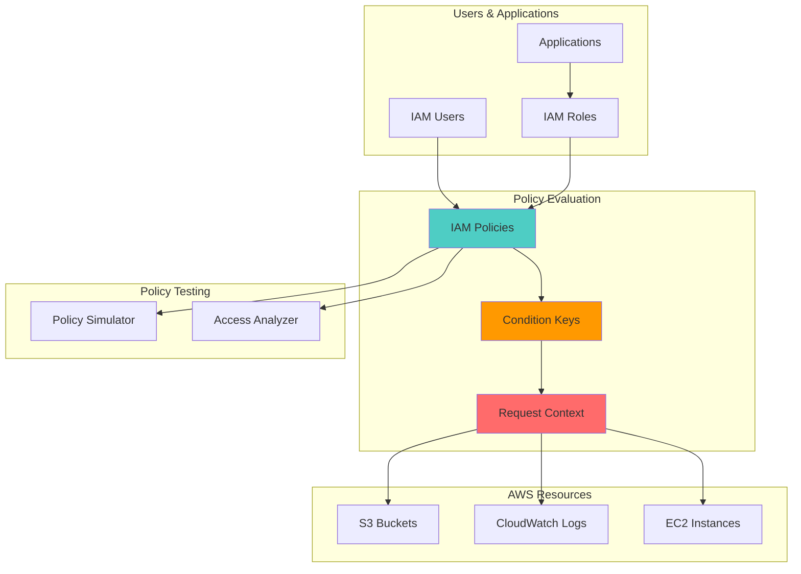

# Fine-Grained Access Control with IAM

## Problem

Organizations struggle with implementing least privilege access control as they scale, often granting overly broad permissions to users and applications. Traditional role-based access control fails to address complex scenarios where access needs vary based on context like time of day, source IP, resource tags, or user attributes, leading to security vulnerabilities and compliance violations.

## Solution

Implement fine-grained access control using advanced IAM policy conditions, resource-based policies, and context-aware permissions. This approach leverages condition keys, operators, and policy variables to create dynamic access controls that adapt to request context while maintaining security best practices and operational efficiency.

## Architecture Diagram



## Prerequisites

1. AWS account with administrative permissions for IAM, S3, CloudWatch, and EC2
2. AWS CLI v2 installed and configured (or AWS CloudShell)
3. Understanding of IAM policies, JSON syntax, and AWS resource ARNs
4. Knowledge of least privilege principles and access control patterns
5. Estimated cost: Under $5 (primarily CloudWatch Logs and S3 storage)

> **Note**: This recipe creates test resources that will generate minimal charges. All resources include proper cleanup procedures.

## Preparation

```bash
# Set environment variables
export AWS_REGION=$(aws configure get region)
export AWS_ACCOUNT_ID=$(aws sts get-caller-identity \
    --query Account --output text)

# Generate unique identifiers for resources
RANDOM_SUFFIX=$(aws secretsmanager get-random-password \
    --exclude-punctuation --exclude-uppercase \
    --password-length 8 --require-each-included-type \
    --output text --query RandomPassword)

export PROJECT_NAME="finegrained-access-${RANDOM_SUFFIX}"
export BUCKET_NAME="${PROJECT_NAME}-test-bucket"
export LOG_GROUP_NAME="/aws/lambda/${PROJECT_NAME}"

# Create test S3 bucket for policy testing
aws s3 mb s3://${BUCKET_NAME} --region ${AWS_REGION}

# Create CloudWatch log group for testing
aws logs create-log-group \
    --log-group-name ${LOG_GROUP_NAME} \
    --region ${AWS_REGION}

echo "✅ Created test resources: ${BUCKET_NAME}, ${LOG_GROUP_NAME}"
```

## Steps

1. **Create Time-Based Access Policy**:

   This step demonstrates how to implement temporal access controls using IAM condition keys. Time-based conditions are essential for enforcing business hours access and reducing the attack surface during off-hours.

   ```bash
   # Create policy allowing access only during business hours (9 AM - 5 PM UTC)
   cat > business-hours-policy.json << 'EOF'
   {
       "Version": "2012-10-17",
       "Statement": [
           {
               "Effect": "Allow",
               "Action": [
                   "s3:GetObject",
                   "s3:PutObject",
                   "s3:ListBucket"
               ],
               "Resource": [
                   "arn:aws:s3:::${BUCKET_NAME}",
                   "arn:aws:s3:::${BUCKET_NAME}/*"
               ],
               "Condition": {
                   "DateGreaterThan": {
                       "aws:CurrentTime": "09:00Z"
                   },
                   "DateLessThan": {
                       "aws:CurrentTime": "17:00Z"
                   }
               }
           }
       ]
   }
   EOF
   
   # Replace environment variable in policy
   envsubst < business-hours-policy.json > business-hours-policy-final.json
   
   # Create the policy
   aws iam create-policy \
       --policy-name "${PROJECT_NAME}-business-hours-policy" \
       --policy-document file://business-hours-policy-final.json \
       --description "S3 access restricted to business hours"
   
   echo "✅ Created time-based access policy"
   ```

   > **Note**: Time-based conditions use UTC format. Consider your organization's global presence when setting time restrictions. Learn more about [date and time condition operators](https://docs.aws.amazon.com/IAM/latest/UserGuide/reference_policies_condition-keys.html#condition-keys-date) in the AWS documentation.

   The policy is now created and ready to be attached to IAM principals. This temporal access control foundation provides automated enforcement of business hours restrictions without requiring manual intervention or additional monitoring systems.

2. **Create IP-Based Access Control Policy**:

   Network-based access controls provide an additional security layer by restricting API calls to trusted IP ranges. This is particularly important for administrative operations and sensitive data access.

   ```bash
   # Create policy allowing access only from specific IP ranges
   cat > ip-restriction-policy.json << 'EOF'
   {
       "Version": "2012-10-17",
       "Statement": [
           {
               "Effect": "Allow",
               "Action": [
                   "logs:CreateLogStream",
                   "logs:PutLogEvents",
                   "logs:DescribeLogGroups",
                   "logs:DescribeLogStreams"
               ],
               "Resource": "arn:aws:logs:*:${AWS_ACCOUNT_ID}:log-group:/aws/lambda/${PROJECT_NAME}*",
               "Condition": {
                   "IpAddress": {
                       "aws:SourceIp": [
                           "203.0.113.0/24",
                           "198.51.100.0/24"
                       ]
                   }
               }
           },
           {
               "Effect": "Deny",
               "Action": "*",
               "Resource": "*",
               "Condition": {
                   "Bool": {
                       "aws:ViaAWSService": "false"
                   },
                   "NotIpAddress": {
                       "aws:SourceIp": [
                           "203.0.113.0/24",
                           "198.51.100.0/24"
                       ]
                   }
               }
           }
       ]
   }
   EOF
   
   # Replace environment variables in policy
   envsubst < ip-restriction-policy.json > ip-restriction-policy-final.json
   
   # Create the policy
   aws iam create-policy \
       --policy-name "${PROJECT_NAME}-ip-restriction-policy" \
       --policy-document file://ip-restriction-policy-final.json \
       --description "CloudWatch Logs access from specific IP ranges only"
   
   echo "✅ Created IP-based access control policy"
   ```

   > **Warning**: IP-based restrictions can impact users on dynamic IP addresses or VPNs. Consider using [VPC endpoints](https://docs.aws.amazon.com/vpc/latest/privatelink/vpc-endpoints.html) for more reliable network-based access controls in corporate environments.

   The IP-based access control policy establishes network perimeter security at the API level. This dual-statement approach allows legitimate access from approved ranges while blocking all other traffic, creating an effective network-based security boundary.

3. **Create Tag-Based Access Control Policy**:

   Tag-based access control enables attribute-based access control (ABAC) by using both principal tags (attached to users/roles) and resource tags to make authorization decisions. This creates flexible, scalable access patterns.

   ```bash
   # Create policy using resource tags and principal tags for access control
   cat > tag-based-policy.json << 'EOF'
   {
       "Version": "2012-10-17",
       "Statement": [
           {
               "Effect": "Allow",
               "Action": [
                   "s3:GetObject",
                   "s3:PutObject"
               ],
               "Resource": "arn:aws:s3:::${BUCKET_NAME}/*",
               "Condition": {
                   "StringEquals": {
                       "aws:PrincipalTag/Department": "${s3:ExistingObjectTag/Department}"
                   }
               }
           },
           {
               "Effect": "Allow",
               "Action": [
                   "s3:GetObject",
                   "s3:PutObject"
               ],
               "Resource": "arn:aws:s3:::${BUCKET_NAME}/shared/*"
           },
           {
               "Effect": "Allow",
               "Action": "s3:ListBucket",
               "Resource": "arn:aws:s3:::${BUCKET_NAME}",
               "Condition": {
                   "StringLike": {
                       "s3:prefix": [
                           "shared/*",
                           "${aws:PrincipalTag/Department}/*"
                       ]
                   }
               }
           }
       ]
   }
   EOF
   
   # Replace environment variables in policy
   envsubst < tag-based-policy.json > tag-based-policy-final.json
   
   # Create the policy
   aws iam create-policy \
       --policy-name "${PROJECT_NAME}-tag-based-policy" \
       --policy-document file://tag-based-policy-final.json \
       --description "S3 access based on user and resource tags"
   
   echo "✅ Created tag-based access control policy"
   ```

   > **Tip**: Tag-based access control scales better than traditional role-based access as organizations grow. Establish a [consistent tagging strategy](https://docs.aws.amazon.com/whitepapers/latest/tagging-best-practices/tagging-best-practices.html) before implementing ABAC patterns.

   This ABAC policy creates a flexible security model where access decisions are made dynamically based on tag attributes. Users can only access resources tagged with their department while shared resources remain accessible to all authorized users, enabling both security isolation and collaboration.

4. **Create Multi-Factor Authentication (MFA) Required Policy**:

   MFA requirements for sensitive operations provide strong authentication controls. This policy demonstrates how to require MFA for write operations while allowing read access without additional authentication.

   ```bash
   # Create policy requiring MFA for sensitive operations
   cat > mfa-required-policy.json << 'EOF'
   {
       "Version": "2012-10-17",
       "Statement": [
           {
               "Effect": "Allow",
               "Action": [
                   "s3:GetObject",
                   "s3:ListBucket"
               ],
               "Resource": [
                   "arn:aws:s3:::${BUCKET_NAME}",
                   "arn:aws:s3:::${BUCKET_NAME}/*"
               ]
           },
           {
               "Effect": "Allow",
               "Action": [
                   "s3:PutObject",
                   "s3:DeleteObject",
                   "s3:PutObjectAcl"
               ],
               "Resource": "arn:aws:s3:::${BUCKET_NAME}/*",
               "Condition": {
                   "Bool": {
                       "aws:MultiFactorAuthPresent": "true"
                   },
                   "NumericLessThan": {
                       "aws:MultiFactorAuthAge": "3600"
                   }
               }
           }
       ]
   }
   EOF
   
   # Replace environment variables in policy
   envsubst < mfa-required-policy.json > mfa-required-policy-final.json
   
   # Create the policy
   aws iam create-policy \
       --policy-name "${PROJECT_NAME}-mfa-required-policy" \
       --policy-document file://mfa-required-policy-final.json \
       --description "S3 write operations require MFA authentication"
   
   echo "✅ Created MFA-required policy"
   ```

   This MFA policy implements a security control that balances usability with protection. Read operations remain frictionless while write operations require strong authentication, reducing the risk of unauthorized data modification while maintaining operational efficiency for day-to-day access.

5. **Create Test User and Role with Conditions**:

   Creating test principals with appropriate tags and trust relationships allows you to validate policy behavior in a controlled environment before applying to production resources.

   ```bash
   # Create test user
   aws iam create-user --user-name "${PROJECT_NAME}-test-user"
   
   # Create user tags for testing
   aws iam tag-user \
       --user-name "${PROJECT_NAME}-test-user" \
       --tags Key=Department,Value=Engineering \
              Key=Project,Value=${PROJECT_NAME}
   
   # Create assume role policy for cross-account access
   cat > trust-policy.json << 'EOF'
   {
       "Version": "2012-10-17",
       "Statement": [
           {
               "Effect": "Allow",
               "Principal": {
                   "AWS": "arn:aws:iam::${AWS_ACCOUNT_ID}:user/${PROJECT_NAME}-test-user"
               },
               "Action": "sts:AssumeRole",
               "Condition": {
                   "StringEquals": {
                       "aws:RequestedRegion": "${AWS_REGION}"
                   },
                   "IpAddress": {
                       "aws:SourceIp": [
                           "203.0.113.0/24",
                           "198.51.100.0/24"
                       ]
                   }
               }
           }
       ]
   }
   EOF
   
   # Replace environment variables in trust policy
   envsubst < trust-policy.json > trust-policy-final.json
   
   # Create test role
   aws iam create-role \
       --role-name "${PROJECT_NAME}-test-role" \
       --assume-role-policy-document file://trust-policy-final.json \
       --description "Test role with conditional access"
   
   echo "✅ Created test user and role with conditional access"
   ```

   The test principals now have the necessary attributes and trust relationships to validate our conditional policies. These test resources include proper tagging and regional restrictions that mirror real-world deployment scenarios, enabling comprehensive policy testing before production implementation.

6. **Create Resource-Based Policy for Cross-Account Access**:

   Resource-based policies work in conjunction with identity-based policies to provide defense-in-depth. This S3 bucket policy enforces encryption and metadata requirements at the resource level.

   ```bash
   # Create S3 bucket policy with advanced conditions
   cat > bucket-policy.json << 'EOF'
   {
       "Version": "2012-10-17",
       "Statement": [
           {
               "Effect": "Allow",
               "Principal": {
                   "AWS": "arn:aws:iam::${AWS_ACCOUNT_ID}:role/${PROJECT_NAME}-test-role"
               },
               "Action": [
                   "s3:GetObject",
                   "s3:PutObject"
               ],
               "Resource": "arn:aws:s3:::${BUCKET_NAME}/*",
               "Condition": {
                   "StringEquals": {
                       "s3:x-amz-server-side-encryption": "AES256"
                   },
                   "StringLike": {
                       "s3:x-amz-meta-project": "${PROJECT_NAME}*"
                   }
               }
           },
           {
               "Effect": "Deny",
               "Principal": "*",
               "Action": "s3:*",
               "Resource": [
                   "arn:aws:s3:::${BUCKET_NAME}",
                   "arn:aws:s3:::${BUCKET_NAME}/*"
               ],
               "Condition": {
                   "Bool": {
                       "aws:SecureTransport": "false"
                   }
               }
           }
       ]
   }
   EOF
   
   # Replace environment variables in bucket policy
   envsubst < bucket-policy.json > bucket-policy-final.json
   
   # Apply bucket policy
   aws s3api put-bucket-policy \
       --bucket ${BUCKET_NAME} \
       --policy file://bucket-policy-final.json
   
   echo "✅ Applied resource-based policy to S3 bucket"
   ```

   The resource-based policy provides defense-in-depth security by enforcing requirements at the bucket level regardless of the requesting principal's identity-based policies. This dual-layer approach ensures that encryption and metadata requirements are met while denying insecure transport, creating comprehensive data protection.

7. **Create Session-Based Access Control Policy**:

   Session-based controls limit the duration and scope of temporary credentials. These policies are particularly useful for automated systems and cross-account access scenarios.

   ```bash
   # Create policy with session duration and name constraints
   cat > session-policy.json << 'EOF'
   {
       "Version": "2012-10-17",
       "Statement": [
           {
               "Effect": "Allow",
               "Action": [
                   "logs:CreateLogStream",
                   "logs:PutLogEvents"
               ],
               "Resource": "arn:aws:logs:*:${AWS_ACCOUNT_ID}:log-group:/aws/lambda/${PROJECT_NAME}*",
               "Condition": {
                   "StringEquals": {
                       "aws:userid": "${aws:userid}"
                   },
                   "StringLike": {
                       "aws:rolename": "${PROJECT_NAME}*"
                   },
                   "NumericLessThan": {
                       "aws:TokenIssueTime": "${aws:CurrentTime}"
                   }
               }
           },
           {
               "Effect": "Allow",
               "Action": "sts:GetSessionToken",
               "Resource": "*",
               "Condition": {
                   "NumericLessThan": {
                       "aws:RequestedDuration": "3600"
                   }
               }
           }
       ]
   }
   EOF
   
   # Replace environment variables in session policy
   envsubst < session-policy.json > session-policy-final.json
   
   # Create the policy
   aws iam create-policy \
       --policy-name "${PROJECT_NAME}-session-policy" \
       --policy-document file://session-policy-final.json \
       --description "Session-based access control with duration limits"
   
   echo "✅ Created session-based access control policy"
   ```

   Session-based controls limit the lifespan and scope of temporary credentials, reducing the risk window for compromised tokens. This policy ensures that credentials cannot be used indefinitely and restricts session duration to reasonable limits for operational security.

8. **Attach Policies and Test Configuration**:

   Attaching policies to test principals and creating sample resources allows validation of the access control logic before production deployment.

   ```bash
   # Attach tag-based policy to test user
   aws iam attach-user-policy \
       --user-name "${PROJECT_NAME}-test-user" \
       --policy-arn "arn:aws:iam::${AWS_ACCOUNT_ID}:policy/${PROJECT_NAME}-tag-based-policy"
   
   # Attach business hours policy to test role
   aws iam attach-role-policy \
       --role-name "${PROJECT_NAME}-test-role" \
       --policy-arn "arn:aws:iam::${AWS_ACCOUNT_ID}:policy/${PROJECT_NAME}-business-hours-policy"
   
   # Add tags to test role
   aws iam tag-role \
       --role-name "${PROJECT_NAME}-test-role" \
       --tags Key=Department,Value=Engineering \
              Key=Environment,Value=Test
   
   # Create test objects in S3 with appropriate tags
   echo "Test content for engineering department" > test-file.txt
   aws s3api put-object \
       --bucket ${BUCKET_NAME} \
       --key "Engineering/test-file.txt" \
       --body test-file.txt \
       --tagging "Department=Engineering&Project=${PROJECT_NAME}" \
       --server-side-encryption AES256 \
       --metadata "project=${PROJECT_NAME}-test"
   
   echo "✅ Applied policies and created test resources"
   ```

   The configuration is now complete with policies attached to test principals and sample data created with appropriate tags and encryption. This setup enables comprehensive validation of all access control patterns before deploying similar configurations to production environments.

## Validation & Testing

1. **Test Policy Simulator with Time Conditions**:

   ```bash
   # Test business hours policy during allowed time
   aws iam simulate-principal-policy \
       --policy-source-arn "arn:aws:iam::${AWS_ACCOUNT_ID}:role/${PROJECT_NAME}-test-role" \
       --action-names "s3:GetObject" \
       --resource-arns "arn:aws:s3:::${BUCKET_NAME}/test-file.txt" \
       --context-entries ContextKeyName=aws:CurrentTime,ContextKeyValues="14:00:00Z",ContextKeyType=date \
       --query 'EvaluationResults[0].EvalDecision' \
       --output text
   ```

   Expected output: `allowed`

2. **Test IP Address Restrictions**:

   ```bash
   # Test IP-based policy with allowed IP
   aws iam simulate-principal-policy \
       --policy-source-arn "arn:aws:iam::${AWS_ACCOUNT_ID}:policy/${PROJECT_NAME}-ip-restriction-policy" \
       --action-names "logs:PutLogEvents" \
       --resource-arns "arn:aws:logs:${AWS_REGION}:${AWS_ACCOUNT_ID}:log-group:${LOG_GROUP_NAME}" \
       --context-entries ContextKeyName=aws:SourceIp,ContextKeyValues="203.0.113.100",ContextKeyType=ip \
       --query 'EvaluationResults[0].EvalDecision' \
       --output text
   ```

   Expected output: `allowed`

3. **Test Tag-Based Access Control**:

   ```bash
   # Test tag-based policy with matching tags
   aws iam simulate-principal-policy \
       --policy-source-arn "arn:aws:iam::${AWS_ACCOUNT_ID}:policy/${PROJECT_NAME}-tag-based-policy" \
       --action-names "s3:GetObject" \
       --resource-arns "arn:aws:s3:::${BUCKET_NAME}/Engineering/test-file.txt" \
       --context-entries ContextKeyName=aws:PrincipalTag/Department,ContextKeyValues="Engineering",ContextKeyType=string \
                         ContextKeyName=s3:ExistingObjectTag/Department,ContextKeyValues="Engineering",ContextKeyType=string \
       --query 'EvaluationResults[0].EvalDecision' \
       --output text
   ```

   Expected output: `allowed`

4. **Test MFA Requirements**:

   ```bash
   # Test MFA policy without MFA (should deny write operations)
   aws iam simulate-principal-policy \
       --policy-source-arn "arn:aws:iam::${AWS_ACCOUNT_ID}:policy/${PROJECT_NAME}-mfa-required-policy" \
       --action-names "s3:PutObject" \
       --resource-arns "arn:aws:s3:::${BUCKET_NAME}/test-file.txt" \
       --context-entries ContextKeyName=aws:MultiFactorAuthPresent,ContextKeyValues="false",ContextKeyType=boolean \
       --query 'EvaluationResults[0].EvalDecision' \
       --output text
   ```

   Expected output: `implicitDeny`

5. **Verify Resource-Based Policy**:

   ```bash
   # Check bucket policy is applied
   aws s3api get-bucket-policy \
       --bucket ${BUCKET_NAME} \
       --query 'Policy' \
       --output text | jq '.'
   
   # Test secure transport requirement
   echo "✅ Bucket policy requires HTTPS and specific encryption"
   ```

## Cleanup

1. **Remove IAM Policies and Attachments**:

   ```bash
   # Detach policies from user
   aws iam detach-user-policy \
       --user-name "${PROJECT_NAME}-test-user" \
       --policy-arn "arn:aws:iam::${AWS_ACCOUNT_ID}:policy/${PROJECT_NAME}-tag-based-policy"
   
   # Detach policies from role
   aws iam detach-role-policy \
       --role-name "${PROJECT_NAME}-test-role" \
       --policy-arn "arn:aws:iam::${AWS_ACCOUNT_ID}:policy/${PROJECT_NAME}-business-hours-policy"
   
   echo "✅ Detached policies from IAM principals"
   ```

2. **Delete IAM Resources**:

   ```bash
   # Delete test user
   aws iam delete-user --user-name "${PROJECT_NAME}-test-user"
   
   # Delete test role
   aws iam delete-role --role-name "${PROJECT_NAME}-test-role"
   
   # Delete custom policies
   for policy_name in "business-hours-policy" "ip-restriction-policy" "tag-based-policy" "mfa-required-policy" "session-policy"; do
       aws iam delete-policy \
           --policy-arn "arn:aws:iam::${AWS_ACCOUNT_ID}:policy/${PROJECT_NAME}-${policy_name}"
   done
   
   echo "✅ Deleted IAM users, roles, and policies"
   ```

3. **Remove S3 and CloudWatch Resources**:

   ```bash
   # Remove S3 bucket policy
   aws s3api delete-bucket-policy --bucket ${BUCKET_NAME}
   
   # Delete S3 objects and bucket
   aws s3 rm s3://${BUCKET_NAME} --recursive
   aws s3 rb s3://${BUCKET_NAME}
   
   # Delete CloudWatch log group
   aws logs delete-log-group --log-group-name ${LOG_GROUP_NAME}
   
   echo "✅ Deleted S3 bucket and CloudWatch log group"
   ```

4. **Clean up Local Files**:

   ```bash
   # Remove policy files
   rm -f business-hours-policy*.json
   rm -f ip-restriction-policy*.json
   rm -f tag-based-policy*.json
   rm -f mfa-required-policy*.json
   rm -f session-policy*.json
   rm -f trust-policy*.json
   rm -f bucket-policy*.json
   rm -f test-file.txt
   
   # Unset environment variables
   unset PROJECT_NAME BUCKET_NAME LOG_GROUP_NAME RANDOM_SUFFIX
   
   echo "✅ Cleaned up local files and environment variables"
   ```

## Discussion

Fine-grained access control in AWS IAM relies on the sophisticated condition evaluation engine that processes multiple context keys, operators, and values to make authorization decisions. The condition element in IAM policies provides powerful capabilities for implementing context-aware security controls that go far beyond simple allow/deny permissions.

The policy evaluation process follows a specific order: explicit deny statements always override allow statements, and conditions must evaluate to true for the policy statement to apply. This enables complex access patterns like allowing S3 access only during business hours while requiring MFA for write operations, or restricting API access to specific IP ranges while allowing emergency access through AWS services. Understanding this evaluation logic is crucial for designing effective security policies that balance security with operational requirements.

Advanced condition operators like `ForAllValues` and `ForAnyValue` enable sophisticated multi-value comparisons, while policy variables like `${aws:username}` and `${aws:PrincipalTag/Department}` create dynamic policies that adapt to the requesting principal's attributes. These capabilities allow organizations to implement role-based access control (RBAC) and attribute-based access control (ABAC) patterns that scale with organizational growth while maintaining security boundaries.

Resource-based policies complement identity-based policies by allowing fine-grained control at the resource level, enabling cross-account access scenarios while maintaining security controls. The combination of both policy types provides comprehensive access control that can accommodate complex organizational structures and compliance requirements while supporting automated security controls and audit trails.

> **Tip**: Use AWS IAM Access Analyzer to validate your policies and identify potential security issues before deployment. The tool can detect overly permissive policies and suggest improvements for better security posture.

## Challenge

Extend this solution by implementing these enhancements:

1. **Dynamic Policy Generation**: Create a Lambda function that generates IAM policies based on user attributes stored in a database, automatically applying appropriate conditions based on user roles, departments, and access patterns.

2. **Temporal Access Controls**: Implement time-based access controls that automatically grant elevated permissions during maintenance windows or emergency situations, with automatic revocation after the specified time period.

3. **Conditional Cross-Account Access**: Design a multi-account access pattern where users can assume roles in different accounts based on their project assignments, with conditions that enforce data residency requirements and regional access controls.

4. **Advanced Compliance Automation**: Build a system that automatically validates and remediates IAM policies to ensure they meet regulatory requirements (SOX, PCI-DSS, HIPAA) using AWS Config rules and automated remediation actions.

5. **Risk-Based Access Control**: Implement adaptive access controls that adjust permissions based on risk scores calculated from user behavior, device trust levels, and access patterns using Amazon GuardDuty and custom machine learning models.

## Infrastructure Code

*Infrastructure code will be generated after recipe approval.*