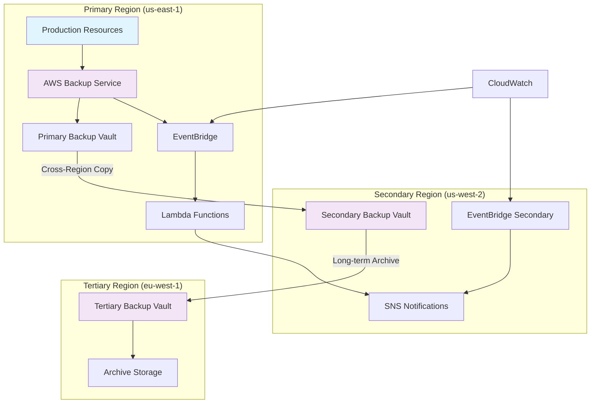

# Implementing Cross-Region Backup Automation with AWS Backup

## Problem

Your organization operates critical workloads across multiple AWS regions and needs a comprehensive backup strategy that ensures data can be recovered even if an entire region becomes unavailable. Current backup approaches are fragmented across different services, lack centralized management, and don't provide the cross-region redundancy required for business continuity. You need an automated solution that can orchestrate backups across multiple regions while maintaining compliance with recovery point objectives (RPO) and recovery time objectives (RTO).

## Solution

Implement a centralized, automated multi-region backup strategy using AWS Backup with cross-region copy destinations, EventBridge for workflow automation, and lifecycle policies for cost optimization. This solution creates a unified backup framework that automatically copies critical backups to secondary regions, implements intelligent lifecycle management, and provides comprehensive monitoring and alerting capabilities.

## Architecture Diagram



## Prerequisites

- AWS CLI v2 installed and configured with appropriate permissions
- Multiple AWS regions configured (minimum of 2, recommended 3)
- Existing AWS resources to be backed up (EC2 instances, RDS databases, DynamoDB tables, EFS file systems)
- Understanding of RPO/RTO requirements for your organization
- IAM permissions for AWS Backup, EventBridge, CloudWatch, and SNS
- Estimated monthly cost: $50-200 depending on data volume and retention period

## Preparation

```bash
# Set environment variables for multi-region deployment
export PRIMARY_REGION="us-east-1"
export SECONDARY_REGION="us-west-2" 
export TERTIARY_REGION="eu-west-1"
export BACKUP_PLAN_NAME="MultiRegionBackupPlan"
export ORGANIZATION_NAME="YourOrg"

# Get AWS account ID for resource ARN construction
export AWS_ACCOUNT_ID=$(aws sts get-caller-identity \
    --query Account --output text)

echo "✅ Environment configured for regions: $PRIMARY_REGION, $SECONDARY_REGION, $TERTIARY_REGION"
```

## Steps

1. **Create IAM service role for AWS Backup operations**:

   AWS Backup requires a service role to perform backup and restore operations across your AWS resources. This role provides the necessary permissions to access your resources and perform backup operations on your behalf.

   ```bash
   # Create the trust policy that allows AWS Backup service to assume this role
   aws iam create-role \
       --role-name AWSBackupServiceRole \
       --assume-role-policy-document '{
           "Version": "2012-10-17",
           "Statement": [
               {
                   "Effect": "Allow",
                   "Principal": {
                       "Service": "backup.amazonaws.com"
                   },
                   "Action": "sts:AssumeRole"
               }
           ]
       }' \
       --region $PRIMARY_REGION
   
   echo "✅ Created AWS Backup service role"
   ```

   > **Note**: The AWS Backup service role is essential for the service to access your resources across different services like EC2, RDS, DynamoDB, and EFS. Learn more about [AWS Backup IAM roles](https://docs.aws.amazon.com/aws-backup/latest/devguide/iam-service-roles.html).

   ```bash
   # Attach AWS managed policies for backup operations
   aws iam attach-role-policy \
       --role-name AWSBackupServiceRole \
       --policy-arn arn:aws:iam::aws:policy/service-role/AWSBackupServiceRolePolicyForBackup \
       --region $PRIMARY_REGION
   
   # Attach AWS managed policies for restore operations
   aws iam attach-role-policy \
       --role-name AWSBackupServiceRole \
       --policy-arn arn:aws:iam::aws:policy/service-role/AWSBackupServiceRolePolicyForRestores \
       --region $PRIMARY_REGION
   
   echo "✅ Attached required policies to backup service role"
   ```

2. **Create backup vaults in all target regions**:

   Backup vaults are storage containers that organize and secure your backup recovery points. Creating vaults in multiple regions enables cross-region backup copies for disaster recovery scenarios.

   ```bash
   # Define consistent naming for backup vaults across regions
   BACKUP_VAULT_PRIMARY="${ORGANIZATION_NAME}-primary-vault"
   BACKUP_VAULT_SECONDARY="${ORGANIZATION_NAME}-secondary-vault"
   BACKUP_VAULT_TERTIARY="${ORGANIZATION_NAME}-tertiary-vault"
   ```

   ```bash
   # Create primary backup vault in the main region
   aws backup create-backup-vault \
       --backup-vault-name $BACKUP_VAULT_PRIMARY \
       --encryption-key-arn alias/aws/backup \
       --region $PRIMARY_REGION
   
   echo "✅ Created primary backup vault in $PRIMARY_REGION"
   ```

   > **Tip**: AWS Backup automatically encrypts all backups using AWS KMS. Using the default `alias/aws/backup` key simplifies setup, but consider using customer-managed KMS keys for enhanced security control. Reference: [AWS Backup encryption](https://docs.aws.amazon.com/aws-backup/latest/devguide/encryption.html).

   ```bash
   # Create secondary backup vault for cross-region redundancy
   aws backup create-backup-vault \
       --backup-vault-name $BACKUP_VAULT_SECONDARY \
       --encryption-key-arn alias/aws/backup \
       --region $SECONDARY_REGION
   
   echo "✅ Created secondary backup vault in $SECONDARY_REGION"
   
   # Create tertiary backup vault for long-term archival
   aws backup create-backup-vault \
       --backup-vault-name $BACKUP_VAULT_TERTIARY \
       --encryption-key-arn alias/aws/backup \
       --region $TERTIARY_REGION
   
   echo "✅ Created tertiary backup vault in $TERTIARY_REGION"
   ```

3. **Create comprehensive backup plan with cross-region copies**:

   The backup plan defines when backups occur, how long they're retained, and where they're copied. This configuration implements a 3-2-1 backup strategy (3 copies of data, 2 different storage types, 1 offsite location) with daily and weekly backup schedules. AWS Backup plans provide centralized governance for backup policies across multiple AWS services, ensuring consistent RPO/RTO targets while automating the complex orchestration of cross-service backup operations.

   ```bash
   # Create backup plan configuration with lifecycle policies and cross-region copies
   cat << 'EOF' > multi-region-backup-plan.json
   {
     "BackupPlan": {
       "BackupPlanName": "MultiRegionBackupPlan",
       "Rules": [
         {
           "RuleName": "DailyBackupsWithCrossRegionCopy",
           "TargetBackupVaultName": "YourOrg-primary-vault",
           "ScheduleExpression": "cron(0 2 ? * * *)",
           "ScheduleExpressionTimezone": "UTC",
           "StartWindowMinutes": 480,
           "CompletionWindowMinutes": 10080,
           "Lifecycle": {
             "MoveToColdStorageAfterDays": 30,
             "DeleteAfterDays": 365
           },
           "CopyActions": [
             {
               "DestinationBackupVaultArn": "arn:aws:backup:us-west-2:AWS_ACCOUNT_ID:backup-vault:YourOrg-secondary-vault",
               "Lifecycle": {
                 "MoveToColdStorageAfterDays": 30,
                 "DeleteAfterDays": 365
               }
             }
           ],
           "RecoveryPointTags": {
             "BackupType": "Daily",
             "Environment": "Production",
             "CrossRegion": "true"
           }
         },
         {
           "RuleName": "WeeklyLongTermArchival",
           "TargetBackupVaultName": "YourOrg-primary-vault",
           "ScheduleExpression": "cron(0 3 ? * SUN *)",
           "ScheduleExpressionTimezone": "UTC",
           "StartWindowMinutes": 480,
           "CompletionWindowMinutes": 10080,
           "Lifecycle": {
             "MoveToColdStorageAfterDays": 90,
             "DeleteAfterDays": 2555
           },
           "CopyActions": [
             {
               "DestinationBackupVaultArn": "arn:aws:backup:eu-west-1:AWS_ACCOUNT_ID:backup-vault:YourOrg-tertiary-vault",
               "Lifecycle": {
                 "MoveToColdStorageAfterDays": 90,
                 "DeleteAfterDays": 2555
               }
             }
           ],
           "RecoveryPointTags": {
             "BackupType": "Weekly",
             "Environment": "Production",
             "LongTerm": "true"
           }
         }
       ]
     }
   }
   EOF
   ```

   ```bash
   # Replace placeholder values with actual environment variables
   sed -e "s/AWS_ACCOUNT_ID/${AWS_ACCOUNT_ID}/g" \
       -e "s/YourOrg/${ORGANIZATION_NAME}/g" \
       multi-region-backup-plan.json > backup-plan-final.json
   
   # Create the backup plan in AWS
   BACKUP_PLAN_ID=$(aws backup create-backup-plan \
       --cli-input-json file://backup-plan-final.json \
       --region $PRIMARY_REGION \
       --query 'BackupPlanId' --output text)
   
   echo "✅ Created backup plan with ID: $BACKUP_PLAN_ID"
   ```

   The backup plan is now active and will automatically execute according to the defined schedule. The daily rule ensures frequent recovery points with a 1-day RPO, while the weekly rule provides long-term archival for compliance and extended retention requirements. The cross-region copy actions establish geographic redundancy, enabling disaster recovery capabilities even in the event of complete regional failure.

4. **Create backup selection to assign resources**:

   Backup selections determine which AWS resources are included in your backup plan. Using tag-based selection provides flexible, automated resource inclusion based on your tagging strategy. This approach enables infrastructure-as-code practices where new resources are automatically protected when they receive appropriate tags, eliminating manual backup configuration and reducing the risk of unprotected critical resources.

   ```bash
   # Create backup selection configuration using tag-based filtering
   cat << EOF > backup-selection.json
   {
     "BackupSelection": {
       "SelectionName": "ProductionResourcesSelection",
       "IamRoleArn": "arn:aws:iam::${AWS_ACCOUNT_ID}:role/AWSBackupServiceRole",
       "Resources": ["*"],
       "Conditions": {
         "StringEquals": {
           "aws:ResourceTag/Environment": ["Production"],
           "aws:ResourceTag/BackupEnabled": ["true"]
         }
       }
     }
   }
   EOF
   
   # Apply the backup selection to the backup plan
   aws backup create-backup-selection \
       --backup-plan-id $BACKUP_PLAN_ID \
       --cli-input-json file://backup-selection.json \
       --region $PRIMARY_REGION
   
   echo "✅ Created backup selection for tagged production resources"
   ```

   The backup selection is now configured to automatically discover and protect all resources tagged with Environment=Production and BackupEnabled=true. This dynamic selection mechanism ensures that backup coverage scales with your infrastructure growth and maintains governance compliance by requiring explicit tagging for backup inclusion.

5. **Set up EventBridge rules for backup monitoring and automation**:

   EventBridge enables real-time monitoring of backup job status changes, allowing you to implement automated responses to backup failures or successes. This event-driven architecture pattern decouples backup operations from monitoring logic, enabling sophisticated automation workflows that can trigger remediation actions, update external systems, or escalate issues based on backup job outcomes.

   ```bash
   # Create EventBridge rule to capture backup job state changes
   aws events put-rule \
       --name BackupJobFailureRule \
       --event-pattern '{
           "source": ["aws.backup"],
           "detail-type": ["Backup Job State Change"],
           "detail": {
               "state": ["FAILED", "ABORTED"]
           }
       }' \
       --state ENABLED \
       --region $PRIMARY_REGION
   
   echo "✅ Created EventBridge rule for backup job monitoring"
   ```

   The EventBridge rule is now actively monitoring backup job state changes. When backup jobs fail or are aborted, the rule will automatically trigger downstream actions, enabling rapid response to backup issues and maintaining high availability of your disaster recovery capabilities.

6. **Create SNS topic for notifications**:

   SNS provides centralized notification delivery for backup events, enabling teams to respond quickly to backup issues or receive confirmation of successful operations. SNS's multi-protocol support allows notifications to reach various endpoints including email, SMS, webhooks, and integration with incident management systems, ensuring that backup events are communicated through your organization's preferred channels.

   ```bash
   # Create SNS topic for backup notifications
   BACKUP_NOTIFICATIONS_TOPIC=$(aws sns create-topic \
       --name backup-notifications \
       --region $PRIMARY_REGION \
       --query 'TopicArn' --output text)
   
   # Subscribe email endpoint to receive notifications
   aws sns subscribe \
       --topic-arn $BACKUP_NOTIFICATIONS_TOPIC \
       --protocol email \
       --notification-endpoint your-email@example.com \
       --region $PRIMARY_REGION
   
   echo "✅ Created SNS topic: $BACKUP_NOTIFICATIONS_TOPIC"
   echo "⚠️  Check your email to confirm the SNS subscription"
   ```

   The SNS topic is established and ready to deliver notifications. Email subscription confirmation is required to receive messages, and additional endpoints can be added later to support different notification preferences for various team members or operational systems.

7. **Create Lambda function for backup validation and recovery testing**:

   This Lambda function provides automated validation of backup operations and can perform advanced monitoring tasks like verifying cross-region copy success and recovery point integrity. Serverless validation enables cost-effective monitoring that scales automatically with backup volume while providing intelligent analysis capabilities that go beyond basic AWS Backup reporting. The function can implement custom business logic for backup validation, quality assurance, and operational alerting.

   ```bash
   # Create Lambda function code for backup validation
   cat << 'EOF' > backup-validator.py
   import json
   import boto3
   import logging
   import os
   from datetime import datetime, timedelta

   logger = logging.getLogger()
   logger.setLevel(logging.INFO)

   def lambda_handler(event, context):
       backup_client = boto3.client('backup')
       sns_client = boto3.client('sns')
       
       # Extract backup job details from EventBridge event
       detail = event['detail']
       backup_job_id = detail['backupJobId']
       
       try:
           # Get backup job details
           response = backup_client.describe_backup_job(
               BackupJobId=backup_job_id
           )
           
           backup_job = response['BackupJob']
           
           # Validate backup job completion and health
           if backup_job['State'] in ['COMPLETED']:
               # Perform additional validation checks
               recovery_point_arn = backup_job['RecoveryPointArn']
               
               # Check if cross-region copy was successful
               copy_jobs = backup_client.list_copy_jobs()
               
               message = f"Backup validation successful for job {backup_job_id}"
               logger.info(message)
               
           elif backup_job['State'] in ['FAILED', 'ABORTED']:
               message = f"Backup job {backup_job_id} failed: {backup_job.get('StatusMessage', 'Unknown error')}"
               logger.error(message)
               
               # Send SNS notification for failed jobs
               sns_client.publish(
                   TopicArn=os.environ['SNS_TOPIC_ARN'],
                   Subject='AWS Backup Job Failed',
                   Message=message
               )
       
       except Exception as e:
           logger.error(f"Error validating backup job: {str(e)}")
           raise
       
       return {
           'statusCode': 200,
           'body': json.dumps('Backup validation completed')
       }
   EOF
   
   # Create deployment package for Lambda
   zip backup-validator.zip backup-validator.py
   
   echo "✅ Created Lambda function code and deployment package"
   ```

   The Lambda function code is packaged and ready for deployment. This validation function will automatically execute when backup jobs complete or fail, providing enhanced monitoring capabilities that extend AWS Backup's native functionality with custom validation logic and intelligent reporting.

8. **Deploy Lambda function and configure EventBridge target**:

   The Lambda function needs appropriate IAM permissions to interact with AWS Backup and SNS services for monitoring and notification purposes. Following security best practices, the function receives only the minimum permissions required for its specific monitoring tasks, demonstrating the principle of least privilege that is essential for maintaining secure serverless architectures.

   ```bash
   # Create IAM role for Lambda function
   LAMBDA_ROLE_ARN=$(aws iam create-role \
       --role-name BackupValidatorRole \
       --assume-role-policy-document '{
           "Version": "2012-10-17",
           "Statement": [
               {
                   "Effect": "Allow",
                   "Principal": {
                       "Service": "lambda.amazonaws.com"
                   },
                   "Action": "sts:AssumeRole"
               }
           ]
       }' \
       --query 'Role.Arn' --output text)
   
   # Attach basic execution policy for CloudWatch Logs
   aws iam attach-role-policy \
       --role-name BackupValidatorRole \
       --policy-arn arn:aws:iam::aws:policy/service-role/AWSLambdaBasicExecutionRole
   ```

   > **Warning**: Always follow the principle of least privilege when creating IAM policies. The custom policy below grants only the minimum permissions required for backup validation and notification operations.

   ```bash
   # Create custom policy for backup operations and SNS publishing
   aws iam put-role-policy \
       --role-name BackupValidatorRole \
       --policy-name BackupValidatorPolicy \
       --policy-document '{
           "Version": "2012-10-17",
           "Statement": [
               {
                   "Effect": "Allow",
                   "Action": [
                       "backup:DescribeBackupJob",
                       "backup:ListCopyJobs",
                       "backup:DescribeRecoveryPoint",
                       "sns:Publish"
                   ],
                   "Resource": "*"
               }
           ]
       }'
   
   # Deploy Lambda function with environment variables
   LAMBDA_FUNCTION_ARN=$(aws lambda create-function \
       --function-name backup-validator \
       --runtime python3.9 \
       --role $LAMBDA_ROLE_ARN \
       --handler backup-validator.lambda_handler \
       --zip-file fileb://backup-validator.zip \
       --environment Variables="{SNS_TOPIC_ARN=$BACKUP_NOTIFICATIONS_TOPIC}" \
       --timeout 300 \
       --region $PRIMARY_REGION \
       --query 'FunctionArn' --output text)
   
   echo "✅ Deployed Lambda function: $LAMBDA_FUNCTION_ARN"
   ```

   The Lambda function is deployed and operational with appropriate IAM permissions. The function can now monitor backup jobs, validate operations, and send notifications through SNS when issues are detected. The serverless architecture ensures cost-effective scaling while providing reliable monitoring capabilities.

   ```bash
   # Configure EventBridge to trigger Lambda function
   aws events put-targets \
       --rule BackupJobFailureRule \
       --targets "Id"="1","Arn"="$LAMBDA_FUNCTION_ARN" \
       --region $PRIMARY_REGION
   
   # Grant EventBridge permission to invoke Lambda function
   aws lambda add-permission \
       --function-name backup-validator \
       --statement-id backup-eventbridge-trigger \
       --action lambda:InvokeFunction \
       --principal events.amazonaws.com \
       --source-arn arn:aws:events:${PRIMARY_REGION}:${AWS_ACCOUNT_ID}:rule/BackupJobFailureRule \
       --region $PRIMARY_REGION
   
   echo "✅ Configured EventBridge integration with Lambda function"
   ```

   The integration between EventBridge and Lambda is complete, creating an automated monitoring pipeline that responds to backup events in real-time. This event-driven architecture ensures immediate detection and response to backup issues while maintaining loose coupling between monitoring components.

9. **Tag resources for backup inclusion**:

   Proper tagging is crucial for automated backup selection. Resources must have both Environment=Production and BackupEnabled=true tags to be included in the backup plan. This tag-based governance model enables infrastructure teams to control backup inclusion declaratively, ensuring that backup policies align with resource classifications and compliance requirements while supporting dynamic infrastructure scaling.

   ```bash
   # Example: Tag an EC2 instance for backup inclusion
   # Replace i-1234567890abcdef0 with your actual instance ID
   aws ec2 create-tags \
       --resources i-1234567890abcdef0 \
       --tags Key=Environment,Value=Production Key=BackupEnabled,Value=true \
       --region $PRIMARY_REGION
   
   echo "✅ Tagged resources for backup inclusion"
   echo "ℹ️  Apply these tags to all critical resources: Environment=Production, BackupEnabled=true"
   ```

   Resource tagging is complete for the example resource. This tagging strategy should be applied consistently across all critical resources to ensure comprehensive backup coverage. The declarative nature of tag-based selection means that properly tagged resources will automatically be included in backup operations without manual configuration updates.

## Validation & Testing

1. **Verify backup plan creation and configuration**:

   ```bash
   # Review the backup plan configuration
   aws backup get-backup-plan \
       --backup-plan-id $BACKUP_PLAN_ID \
       --region $PRIMARY_REGION
   ```

   Expected output: JSON showing your backup plan with two rules configured for daily and weekly backups with cross-region copy actions.

2. **Check backup vault status across regions**:

   ```bash
   # Verify primary region backup vault
   aws backup describe-backup-vault \
       --backup-vault-name $BACKUP_VAULT_PRIMARY \
       --region $PRIMARY_REGION

   # Verify secondary region backup vault  
   aws backup describe-backup-vault \
       --backup-vault-name $BACKUP_VAULT_SECONDARY \
       --region $SECONDARY_REGION

   # Verify tertiary region backup vault
   aws backup describe-backup-vault \
       --backup-vault-name $BACKUP_VAULT_TERTIARY \
       --region $TERTIARY_REGION
   ```

   Expected output: Backup vault details showing encryption settings and creation timestamps for each region.

3. **Trigger a test backup and monitor progress**:

   ```bash
   # Start an on-demand backup for testing (replace with your actual resource ARN)
   TEST_BACKUP_JOB_ID=$(aws backup start-backup-job \
       --backup-vault-name $BACKUP_VAULT_PRIMARY \
       --resource-arn "arn:aws:ec2:${PRIMARY_REGION}:${AWS_ACCOUNT_ID}:instance/i-1234567890abcdef0" \
       --iam-role-arn "arn:aws:iam::${AWS_ACCOUNT_ID}:role/AWSBackupServiceRole" \
       --region $PRIMARY_REGION \
       --query 'BackupJobId' --output text)

   # Monitor backup job progress
   aws backup describe-backup-job \
       --backup-job-id $TEST_BACKUP_JOB_ID \
       --region $PRIMARY_REGION
   ```

4. **Verify cross-region copy jobs**:

   ```bash
   # Check for copy jobs in secondary region
   aws backup list-copy-jobs \
       --region $SECONDARY_REGION \
       --max-results 10
   ```

   Expected output: List of copy jobs showing replication status to secondary regions.

5. **Test EventBridge integration and notifications**:

   ```bash
   # Check CloudWatch Logs for Lambda function execution
   aws logs describe-log-groups \
       --log-group-name-prefix "/aws/lambda/backup-validator" \
       --region $PRIMARY_REGION
   ```

## Cleanup

1. **Delete backup selections and plans**:

   ```bash
   # Get backup selection ID and delete it
   BACKUP_SELECTION_ID=$(aws backup list-backup-selections \
       --backup-plan-id $BACKUP_PLAN_ID \
       --region $PRIMARY_REGION \
       --query 'BackupSelectionsList[0].SelectionId' --output text)

   aws backup delete-backup-selection \
       --backup-plan-id $BACKUP_PLAN_ID \
       --selection-id $BACKUP_SELECTION_ID \
       --region $PRIMARY_REGION

   # Delete backup plan
   aws backup delete-backup-plan \
       --backup-plan-id $BACKUP_PLAN_ID \
       --region $PRIMARY_REGION

   echo "✅ Deleted backup selections and plan"
   ```

2. **Remove EventBridge rules and Lambda function**:

   ```bash
   # Remove EventBridge targets and rules
   aws events remove-targets \
       --rule BackupJobFailureRule \
       --ids "1" \
       --region $PRIMARY_REGION

   aws events delete-rule \
       --name BackupJobFailureRule \
       --region $PRIMARY_REGION

   # Delete Lambda function
   aws lambda delete-function \
       --function-name backup-validator \
       --region $PRIMARY_REGION

   echo "✅ Removed EventBridge rules and Lambda function"
   ```

3. **Delete backup vaults (only if they contain no recovery points)**:

   ```bash
   # Delete backup vaults (will fail if recovery points exist)
   aws backup delete-backup-vault \
       --backup-vault-name $BACKUP_VAULT_PRIMARY \
       --region $PRIMARY_REGION

   aws backup delete-backup-vault \
       --backup-vault-name $BACKUP_VAULT_SECONDARY \
       --region $SECONDARY_REGION

   aws backup delete-backup-vault \
       --backup-vault-name $BACKUP_VAULT_TERTIARY \
       --region $TERTIARY_REGION

   echo "✅ Deleted backup vaults"
   ```

4. **Clean up IAM roles and policies**:

   ```bash
   # Clean up AWS Backup service role
   aws iam detach-role-policy \
       --role-name AWSBackupServiceRole \
       --policy-arn arn:aws:iam::aws:policy/service-role/AWSBackupServiceRolePolicyForBackup

   aws iam detach-role-policy \
       --role-name AWSBackupServiceRole \
       --policy-arn arn:aws:iam::aws:policy/service-role/AWSBackupServiceRolePolicyForRestores

   aws iam delete-role \
       --role-name AWSBackupServiceRole

   # Clean up Lambda role
   aws iam delete-role-policy \
       --role-name BackupValidatorRole \
       --policy-name BackupValidatorPolicy

   aws iam detach-role-policy \
       --role-name BackupValidatorRole \
       --policy-arn arn:aws:iam::aws:policy/service-role/AWSLambdaBasicExecutionRole

   aws iam delete-role \
       --role-name BackupValidatorRole

   echo "✅ Cleaned up IAM roles and policies"
   ```

5. **Delete SNS topic and subscriptions**:

   ```bash
   # Delete SNS topic (automatically removes subscriptions)
   aws sns delete-topic \
       --topic-arn $BACKUP_NOTIFICATIONS_TOPIC \
       --region $PRIMARY_REGION

   echo "✅ Deleted SNS topic and subscriptions"
   ```

## Discussion

This multi-region backup strategy leverages AWS Backup's centralized management capabilities to create a robust, automated backup framework that addresses critical business continuity requirements. The solution demonstrates several key architectural patterns that are essential for enterprise-grade backup strategies.

The cross-region copy functionality in AWS Backup provides automated geographic distribution of backups without requiring custom scripting or complex orchestration. By configuring copy actions within backup rules, you ensure that critical data is automatically replicated to secondary regions, meeting stringent RPO requirements even in the event of regional outages. The lifecycle policies optimize storage costs by automatically transitioning older backups to cold storage tiers, balancing compliance requirements with cost efficiency.

EventBridge integration enables sophisticated backup workflow automation and monitoring. The solution uses EventBridge to capture backup job state changes and trigger validation workflows, ensuring that backup operations complete successfully and meet quality standards. This event-driven approach scales automatically and provides real-time visibility into backup operations across all regions. The integration with Lambda functions allows for custom validation logic, automated recovery testing, and intelligent alerting based on your specific operational requirements.

The tag-based resource selection strategy provides flexible, scalable resource management that adapts to changing infrastructure. By using consistent tagging strategies across your AWS environment, you can automatically include new resources in backup plans without manual configuration updates. This approach supports DevOps practices and ensures that backup coverage scales with your infrastructure growth while maintaining governance controls.

> **Note**: AWS Backup charges are based on the amount of backup storage consumed and data transfer for cross-region copies. Consider implementing backup storage analytics and cost monitoring to optimize your backup strategy over time. Reference: [AWS Backup Pricing](https://aws.amazon.com/backup/pricing/)

## Challenge

Extend this multi-region backup solution to implement automated disaster recovery testing by creating a Lambda function that periodically performs restore operations in a test environment. The challenge should include automated restoration validation, infrastructure provisioning in the secondary region, and rollback procedures. Additionally, implement cost optimization by creating intelligent backup policies that adjust retention periods based on resource criticality and compliance requirements.

## Infrastructure Code

*Infrastructure code will be generated after recipe approval.*