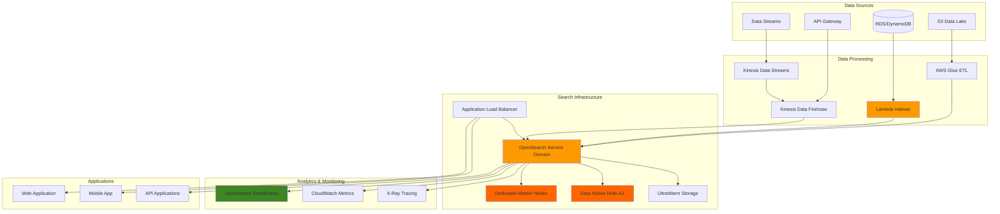

# Implementing Enterprise Search with OpenSearch Service

## Problem

Enterprise organizations managing large-scale content repositories, e-commerce catalogs, and knowledge bases face significant challenges in delivering intelligent search experiences. Traditional database-driven search solutions cannot handle complex text analysis, real-time analytics, or semantic search requirements at scale. Without enterprise-grade search infrastructure, organizations struggle with poor search relevance, limited search analytics, inability to implement machine learning-driven recommendations, and lack of real-time insights that directly impact business KPIs and user engagement metrics.

## Solution

Amazon OpenSearch Service delivers enterprise-grade search and analytics capabilities with advanced features like semantic search, machine learning-powered relevance tuning, and real-time analytics. This solution implements a comprehensive search architecture with multi-tenant support, automated indexing pipelines, advanced query optimization, and integrated analytics dashboards that provide actionable insights for business intelligence and search performance optimization.

## Architecture Diagram



## Prerequisites

1. AWS account with OpenSearch Service, Lambda, Kinesis, S3, Glue, and IAM permissions
2. AWS CLI v2 installed and configured (or AWS CloudShell)
3. Advanced knowledge of distributed search systems, JSON document structures, and REST APIs
4. Understanding of search concepts (indexing, mapping, queries, analyzers, aggregations)
5. Experience with data pipeline architectures and ETL processes
6. Familiarity with monitoring and performance optimization techniques
7. Estimated cost: $200-500/month for production-ready environment (m6g.large.search instances with dedicated masters, 100GB storage, and multi-AZ deployment)

> **Note**: OpenSearch Service charges are based on instance hours, storage, and data transfer. Use development instance types to minimize costs during testing.

## Preparation

```bash
# Set environment variables
export AWS_REGION=$(aws configure get region)
export AWS_ACCOUNT_ID=$(aws sts get-caller-identity \
    --query Account --output text)

# Generate unique identifiers for resources
RANDOM_SUFFIX=$(aws secretsmanager get-random-password \
    --exclude-punctuation --exclude-uppercase \
    --password-length 6 --require-each-included-type \
    --output text --query RandomPassword)

export DOMAIN_NAME="search-demo-${RANDOM_SUFFIX}"
export S3_BUCKET_NAME="opensearch-data-${RANDOM_SUFFIX}"
export LAMBDA_FUNCTION_NAME="opensearch-indexer-${RANDOM_SUFFIX}"

echo "Domain Name: $DOMAIN_NAME"
echo "S3 Bucket: $S3_BUCKET_NAME"
echo "Lambda Function: $LAMBDA_FUNCTION_NAME"

# Create S3 bucket for sample data
aws s3 mb s3://$S3_BUCKET_NAME --region $AWS_REGION

echo "✅ Environment variables set and S3 bucket created"
```

## Steps

1. **Create IAM role for OpenSearch Service access**:

   IAM roles provide secure, temporary credential delegation that enables AWS services to interact with each other without hardcoding access keys. For OpenSearch Service, proper IAM configuration is essential for security, compliance, and operational excellence. This role establishes the security foundation that enables fine-grained access controls and integrates with your existing identity management strategy.

   ```bash
   # Create trust policy for OpenSearch Service
   cat > opensearch-trust-policy.json << 'EOF'
   {
     "Version": "2012-10-17",
     "Statement": [
       {
         "Effect": "Allow",
         "Principal": {
           "Service": "opensearch.amazonaws.com"
         },
         "Action": "sts:AssumeRole"
       }
     ]
   }
   EOF
   
   # Create the IAM role
   aws iam create-role \
       --role-name OpenSearchServiceRole-${RANDOM_SUFFIX} \
       --assume-role-policy-document file://opensearch-trust-policy.json
   
   # Store role ARN for later use
   export OS_ROLE_ARN=$(aws iam get-role \
       --role-name OpenSearchServiceRole-${RANDOM_SUFFIX} \
       --query 'Role.Arn' --output text)
   
   echo "✅ Created IAM role: $OS_ROLE_ARN"
   ```

   The IAM role is now established with the proper trust relationship, enabling OpenSearch Service to assume this role when needed. This security foundation supports principle of least privilege and prepares your environment for advanced access control configurations. The role ARN will be used in subsequent steps to configure domain-level permissions and integrate with other AWS services.

2. **Create OpenSearch Service domain**:

   OpenSearch Service requires log groups to be created before enabling logging. We're creating a production-ready domain with dedicated master nodes for cluster management, which provides better stability and performance isolation from data nodes.

   ```bash
   # Create CloudWatch log groups for OpenSearch logs
   aws logs create-log-group \
       --log-group-name /aws/opensearch/domains/${DOMAIN_NAME}/index-slow-logs \
       --region $AWS_REGION
   
   aws logs create-log-group \
       --log-group-name /aws/opensearch/domains/${DOMAIN_NAME}/search-slow-logs \
       --region $AWS_REGION
   
   # Create domain configuration
   cat > domain-config.json << EOF
   {
     "DomainName": "${DOMAIN_NAME}",
     "OpenSearchVersion": "OpenSearch_2.11",
     "ClusterConfig": {
       "InstanceType": "m6g.large.search",
       "InstanceCount": 3,
       "DedicatedMasterEnabled": true,
       "DedicatedMasterType": "m6g.medium.search",
       "DedicatedMasterCount": 3,
       "ZoneAwarenessEnabled": true,
       "ZoneAwarenessConfig": {
         "AvailabilityZoneCount": 3
       },
       "WarmEnabled": false
     },
     "EBSOptions": {
       "EBSEnabled": true,
       "VolumeType": "gp3",
       "VolumeSize": 100,
       "Iops": 3000,
       "Throughput": 125
     },
     "AccessPolicies": "{\"Version\":\"2012-10-17\",\"Statement\":[{\"Effect\":\"Allow\",\"Principal\":{\"AWS\":\"*\"},\"Action\":\"es:*\",\"Resource\":\"arn:aws:es:${AWS_REGION}:${AWS_ACCOUNT_ID}:domain/${DOMAIN_NAME}/*\"}]}",
     "EncryptionAtRestOptions": {
       "Enabled": true
     },
     "NodeToNodeEncryptionOptions": {
       "Enabled": true
     },
     "DomainEndpointOptions": {
       "EnforceHTTPS": true,
       "TLSSecurityPolicy": "Policy-Min-TLS-1-2-2019-07"
     },
     "AdvancedSecurityOptions": {
       "Enabled": true,
       "InternalUserDatabaseEnabled": true,
       "MasterUserOptions": {
         "MasterUserName": "admin",
         "MasterUserPassword": "TempPassword123!"
       }
     },
     "LogPublishingOptions": {
       "INDEX_SLOW_LOGS": {
         "CloudWatchLogsLogGroupArn": "arn:aws:logs:${AWS_REGION}:${AWS_ACCOUNT_ID}:log-group:/aws/opensearch/domains/${DOMAIN_NAME}/index-slow-logs",
         "Enabled": true
       },
       "SEARCH_SLOW_LOGS": {
         "CloudWatchLogsLogGroupArn": "arn:aws:logs:${AWS_REGION}:${AWS_ACCOUNT_ID}:log-group:/aws/opensearch/domains/${DOMAIN_NAME}/search-slow-logs",
         "Enabled": true
       }
     }
   }
   EOF
   
   # Create the OpenSearch domain
   aws opensearch create-domain \
       --cli-input-json file://domain-config.json
   
   echo "✅ OpenSearch domain creation initiated (this takes 20-30 minutes for multi-AZ with dedicated masters)"
   ```

   The OpenSearch domain creation process is now underway. This multi-AZ configuration with dedicated master nodes provides enterprise-grade availability and performance isolation. The dedicated masters handle cluster management operations while data nodes focus exclusively on indexing and search workloads, ensuring optimal performance under varying load conditions. The domain configuration includes comprehensive security features that establish a secure foundation for your search infrastructure.

   > **Warning**: OpenSearch domain creation is a time-intensive process. Multi-AZ deployments with dedicated masters typically take 20-30 minutes to complete. Monitor the [OpenSearch Service documentation](https://docs.aws.amazon.com/opensearch-service/latest/developerguide/createupdatedomains.html) for best practices on domain configuration.

3. **Wait for domain to be available and get endpoint**:

   Domain availability verification ensures that all cluster components are fully operational before proceeding with data operations. The endpoint provides the access point for all OpenSearch REST API operations including indexing, searching, and cluster management. Proper endpoint configuration is critical for establishing secure connections and enabling application integration with your search infrastructure.

   ```bash
   # Wait for domain to become available
   echo "Waiting for OpenSearch domain to be available..."
   aws opensearch wait domain-available --domain-name $DOMAIN_NAME
   
   # Get domain endpoint
   export OS_ENDPOINT=$(aws opensearch describe-domain \
       --domain-name $DOMAIN_NAME \
       --query 'DomainStatus.Endpoint' --output text)
   
   echo "✅ OpenSearch domain available at: https://$OS_ENDPOINT"
   ```

   The OpenSearch domain is now fully operational and ready to accept data operations. The endpoint URL provides secure HTTPS access to the cluster and will be used for all subsequent API calls. This marks the completion of the infrastructure provisioning phase and enables the transition to data configuration and indexing operations.

4. **Create sample product data for indexing**:

   Sample data creation establishes a realistic dataset that demonstrates OpenSearch capabilities across diverse product categories and data types. This structured JSON data includes various field types (text, numeric, date, keyword arrays) that showcase different search and analytics patterns. The data design reflects real-world e-commerce scenarios and enables testing of complex search features including faceted search, price filtering, and multi-field queries.

   ```bash
   # Create sample product data
   cat > sample-products.json << 'EOF'
   [
     {
       "id": "prod-001",
       "title": "Wireless Bluetooth Headphones",
       "description": "High-quality wireless headphones with noise cancellation and 30-hour battery life",
       "category": "Electronics",
       "brand": "TechSound",
       "price": 199.99,
       "rating": 4.5,
       "tags": ["wireless", "bluetooth", "noise-cancelling", "headphones"],
       "stock": 150,
       "created_date": "2024-01-15"
     },
     {
       "id": "prod-002", 
       "title": "Organic Cotton T-Shirt",
       "description": "Comfortable organic cotton t-shirt available in multiple colors and sizes",
       "category": "Clothing",
       "brand": "EcoWear",
       "price": 29.99,
       "rating": 4.2,
       "tags": ["organic", "cotton", "t-shirt", "eco-friendly"],
       "stock": 75,
       "created_date": "2024-01-10"
     },
     {
       "id": "prod-003",
       "title": "Smart Fitness Watch",
       "description": "Advanced fitness tracking watch with heart rate monitor and GPS",
       "category": "Electronics",
       "brand": "FitTech",
       "price": 299.99,
       "rating": 4.7,
       "tags": ["smartwatch", "fitness", "GPS", "heart-rate"],
       "stock": 89,
       "created_date": "2024-01-12"
     },
     {
       "id": "prod-004",
       "title": "Ergonomic Office Chair",
       "description": "Comfortable ergonomic office chair with lumbar support and adjustable height",
       "category": "Furniture",
       "brand": "OfficeComfort",
       "price": 449.99,
       "rating": 4.3,
       "tags": ["chair", "office", "ergonomic", "lumbar-support"],
       "stock": 32,
       "created_date": "2024-01-08"
     },
     {
       "id": "prod-005",
       "title": "Stainless Steel Water Bottle",
       "description": "Insulated stainless steel water bottle keeps drinks cold for 24 hours",
       "category": "Home & Kitchen",
       "brand": "HydroSteel",
       "price": 34.99,
       "rating": 4.6,
       "tags": ["water-bottle", "stainless-steel", "insulated", "eco-friendly"],
       "stock": 200,
       "created_date": "2024-01-05"
     }
   ]
   EOF
   
   # Upload sample data to S3
   aws s3 cp sample-products.json s3://$S3_BUCKET_NAME/
   
   echo "✅ Sample product data created and uploaded to S3"
   ```

   The sample dataset is now available in S3 and ready for indexing operations. This diverse product catalog provides the foundation for demonstrating search capabilities including full-text search, faceted navigation, price range filtering, and category-based aggregations. The data structure supports advanced search patterns and analytics that are essential for building sophisticated search applications.

5. **Create index mapping for optimal search performance**:

   Index mappings define how documents and their fields are stored and indexed. Proper mapping configuration is crucial for search performance and functionality. We're using both `text` and `keyword` field types - `text` for full-text search and `keyword` for exact matches, aggregations, and sorting.

   ```bash
   # Create index mapping for products
   cat > product-mapping.json << 'EOF'
   {
     "mappings": {
       "properties": {
         "id": {"type": "keyword"},
         "title": {
           "type": "text",
           "analyzer": "standard",
           "fields": {
             "keyword": {"type": "keyword"}
           }
         },
         "description": {
           "type": "text",
           "analyzer": "standard"
         },
         "category": {"type": "keyword"},
         "brand": {"type": "keyword"},
         "price": {"type": "float"},
         "rating": {"type": "float"},
         "tags": {"type": "keyword"},
         "stock": {"type": "integer"},
         "created_date": {"type": "date", "format": "yyyy-MM-dd"}
       }
     },
     "settings": {
       "number_of_shards": 1,
       "number_of_replicas": 0,
       "analysis": {
         "analyzer": {
           "custom_search_analyzer": {
             "type": "custom",
             "tokenizer": "standard",
             "filter": ["lowercase", "stop"]
           }
         }
       }
     }
   }
   EOF
   
   # Create the products index with mapping
   curl -X PUT "https://$OS_ENDPOINT/products" \
       -H "Content-Type: application/json" \
       -u admin:TempPassword123! \
       -d @product-mapping.json
   
   echo "✅ Created products index with optimized mapping"
   ```

   The index mapping is now configured to optimize search performance and enable advanced query capabilities. The dual-field approach (text and keyword) provides flexibility for both full-text search and exact matching operations. Custom analyzers and field configurations ensure optimal tokenization and relevance scoring for your specific use case. This foundation enables sophisticated search features including faceted navigation, sorting, and aggregations.

   > **Tip**: Consider using [OpenSearch index templates](https://docs.aws.amazon.com/opensearch-service/latest/developerguide/managing-indices.html#index-templates) for dynamic mapping when dealing with varying document structures across multiple indices.

6. **Index sample products into OpenSearch**:

   Document indexing transforms raw data into searchable, structured content within OpenSearch. Each document is assigned a unique identifier and processed according to the mapping configuration established in the previous step. The indexing process includes field analysis, tokenization, and storage optimization that enables fast retrieval and relevance scoring. This step demonstrates the document ingestion workflow that forms the core of any search application.

   ```bash
   # Index each product document
   curl -X POST "https://$OS_ENDPOINT/products/_doc/prod-001" \
       -H "Content-Type: application/json" \
       -u admin:TempPassword123! \
       -d '{
         "id": "prod-001",
         "title": "Wireless Bluetooth Headphones",
         "description": "High-quality wireless headphones with noise cancellation and 30-hour battery life",
         "category": "Electronics",
         "brand": "TechSound",
         "price": 199.99,
         "rating": 4.5,
         "tags": ["wireless", "bluetooth", "noise-cancelling", "headphones"],
         "stock": 150,
         "created_date": "2024-01-15"
       }'
   
   curl -X POST "https://$OS_ENDPOINT/products/_doc/prod-002" \
       -H "Content-Type: application/json" \
       -u admin:TempPassword123! \
       -d '{
         "id": "prod-002",
         "title": "Organic Cotton T-Shirt",
         "description": "Comfortable organic cotton t-shirt available in multiple colors and sizes",
         "category": "Clothing", 
         "brand": "EcoWear",
         "price": 29.99,
         "rating": 4.2,
         "tags": ["organic", "cotton", "t-shirt", "eco-friendly"],
         "stock": 75,
         "created_date": "2024-01-10"
       }'
   
   curl -X POST "https://$OS_ENDPOINT/products/_doc/prod-003" \
       -H "Content-Type: application/json" \
       -u admin:TempPassword123! \
       -d '{
         "id": "prod-003",
         "title": "Smart Fitness Watch",
         "description": "Advanced fitness tracking watch with heart rate monitor and GPS",
         "category": "Electronics",
         "brand": "FitTech", 
         "price": 299.99,
         "rating": 4.7,
         "tags": ["smartwatch", "fitness", "GPS", "heart-rate"],
         "stock": 89,
         "created_date": "2024-01-12"
       }'
   
   # Refresh index to make documents searchable
   curl -X POST "https://$OS_ENDPOINT/products/_refresh" \
       -u admin:TempPassword123!
   
   echo "✅ Indexed sample products into OpenSearch"
   ```

   The product documents are now indexed and immediately available for search operations. The refresh operation ensures that all documents are committed to searchable storage and visible to query operations. This completes the data ingestion phase and establishes a functional search index that demonstrates real-world search scenarios including product discovery, category filtering, and price-based searches.

7. **Create Lambda function for automated data indexing**:

   Automated indexing through Lambda functions enables real-time data processing and keeps your search index synchronized with changing data sources. This serverless approach provides cost-effective, event-driven indexing that scales automatically with data volume. The Lambda function demonstrates integration patterns for S3-triggered indexing workflows that are essential for maintaining current search results in dynamic environments.

   ```bash
   # Create Lambda function code
   cat > lambda-indexer.py << 'EOF'
   import json
   import boto3
   import requests
   from requests.auth import HTTPBasicAuth
   import os
   
   def lambda_handler(event, context):
       # OpenSearch endpoint from environment variable
       os_endpoint = os.environ['OPENSEARCH_ENDPOINT']
       
       # Process S3 event (if triggered by S3)
       if 'Records' in event:
           s3_client = boto3.client('s3')
           
           for record in event['Records']:
               bucket = record['s3']['bucket']['name']
               key = record['s3']['object']['key']
               
               # Download file from S3
               response = s3_client.get_object(Bucket=bucket, Key=key)
               content = response['Body'].read().decode('utf-8')
               
               # Parse JSON data
               products = json.loads(content)
               
               # Index each product
               for product in products:
                   doc_id = product['id']
                   index_url = f"https://{os_endpoint}/products/_doc/{doc_id}"
                   
                   response = requests.put(
                       index_url,
                       headers={'Content-Type': 'application/json'},
                       data=json.dumps(product)
                   )
                   
                   print(f"Indexed product {doc_id}: {response.status_code}")
       
       return {
           'statusCode': 200,
           'body': json.dumps('Data indexing completed successfully')
       }
   EOF
   
   # Create deployment package
   zip lambda-indexer.zip lambda-indexer.py
   
   # Create Lambda execution role
   cat > lambda-trust-policy.json << 'EOF'
   {
     "Version": "2012-10-17",
     "Statement": [
       {
         "Effect": "Allow",
         "Principal": {
           "Service": "lambda.amazonaws.com"
         },
         "Action": "sts:AssumeRole"
       }
     ]
   }
   EOF
   
   aws iam create-role \
       --role-name LambdaOpenSearchRole-${RANDOM_SUFFIX} \
       --assume-role-policy-document file://lambda-trust-policy.json
   
   # Attach basic execution policy
   aws iam attach-role-policy \
       --role-name LambdaOpenSearchRole-${RANDOM_SUFFIX} \
       --policy-arn arn:aws:iam::aws:policy/service-role/AWSLambdaBasicExecutionRole
   
   # Get Lambda role ARN
   export LAMBDA_ROLE_ARN=$(aws iam get-role \
       --role-name LambdaOpenSearchRole-${RANDOM_SUFFIX} \
       --query 'Role.Arn' --output text)
   
   # Wait for role to be available
   sleep 10
   
   # Create Lambda function
   aws lambda create-function \
       --function-name $LAMBDA_FUNCTION_NAME \
       --runtime python3.9 \
       --role $LAMBDA_ROLE_ARN \
       --handler lambda-indexer.lambda_handler \
       --zip-file fileb://lambda-indexer.zip \
       --environment Variables="{OPENSEARCH_ENDPOINT=$OS_ENDPOINT}" \
       --timeout 60
   
   echo "✅ Created Lambda function for automated indexing"
   ```

   The Lambda function is now deployed and ready to process S3 events for automated data indexing. This serverless integration creates a scalable data pipeline that maintains search index consistency with minimal operational overhead. The function provides the foundation for real-time search updates and can be extended to handle complex data transformation and enrichment workflows.

8. **Perform advanced search queries to test functionality**:

   Search query testing validates the effectiveness of your index configuration and demonstrates the rich query capabilities that OpenSearch provides. These queries showcase different search patterns including exact matching, multi-field searches, and complex boolean operations with filtering. Understanding these query patterns is essential for building sophisticated search applications that deliver relevant results and support advanced user interactions.

   ```bash
   # Test basic text search
   echo "Testing basic search for 'wireless'..."
   curl -X GET "https://$OS_ENDPOINT/products/_search" \
       -H "Content-Type: application/json" \
       -u admin:TempPassword123! \
       -d '{
         "query": {
           "match": {
             "title": "wireless"
           }
         }
       }' | jq '.hits.hits[]._source.title'
   
   # Test multi-field search
   echo "Testing multi-field search for 'electronics'..."
   curl -X GET "https://$OS_ENDPOINT/products/_search" \
       -H "Content-Type: application/json" \
       -u admin:TempPassword123! \
       -d '{
         "query": {
           "multi_match": {
             "query": "electronics",
             "fields": ["title", "description", "category"]
           }
         }
       }' | jq '.hits.hits[]._source | {title, category}'
   
   # Test filtered search with price range
   echo "Testing filtered search with price range..."
   curl -X GET "https://$OS_ENDPOINT/products/_search" \
       -H "Content-Type: application/json" \
       -u admin:TempPassword123! \
       -d '{
         "query": {
           "bool": {
             "must": [
               {"match": {"category": "Electronics"}}
             ],
             "filter": [
               {"range": {"price": {"gte": 100, "lte": 250}}}
             ]
           }
         },
         "sort": [{"price": {"order": "asc"}}]
       }' | jq '.hits.hits[]._source | {title, price}'
   
   echo "✅ Search queries executed successfully"
   ```

   The search functionality testing demonstrates successful index operation and query processing capabilities. These various query types showcase the flexibility and power of OpenSearch for handling different search scenarios from simple keyword matching to complex filtered searches with sorting. The results validate that your search infrastructure is ready to support sophisticated user-facing search applications.

9. **Create aggregation queries for analytics**:

   Aggregation capabilities enable powerful analytics and business intelligence insights from your search data. These operations provide real-time statistical analysis, trend identification, and data summarization that supports decision-making and user experience optimization. Aggregations are essential for building dashboards, generating reports, and providing faceted navigation that enhances search discoverability.

   ```bash
   # Category aggregation
   echo "Getting product count by category..."
   curl -X GET "https://$OS_ENDPOINT/products/_search" \
       -H "Content-Type: application/json" \
       -u admin:TempPassword123! \
       -d '{
         "size": 0,
         "aggs": {
           "categories": {
             "terms": {
               "field": "category",
               "size": 10
             }
           }
         }
       }' | jq '.aggregations.categories.buckets'
   
   # Price statistics by brand
   echo "Getting price statistics by brand..."
   curl -X GET "https://$OS_ENDPOINT/products/_search" \
       -H "Content-Type: application/json" \
       -u admin:TempPassword123! \
       -d '{
         "size": 0,
         "aggs": {
           "brands": {
             "terms": {
               "field": "brand"
             },
             "aggs": {
               "avg_price": {
                 "avg": {
                   "field": "price"
                 }
               },
               "max_price": {
                 "max": {
                   "field": "price"
                 }
               }
             }
           }
         }
       }' | jq '.aggregations.brands.buckets'
   
   echo "✅ Analytics aggregations completed"
   ```

   The aggregation queries demonstrate OpenSearch's powerful analytics capabilities for extracting business insights from search data. These statistical operations provide the foundation for building interactive dashboards, implementing faceted search interfaces, and generating business intelligence reports. The aggregation results enable data-driven decision making and sophisticated user experience features.

10. **Set up index templates for automated mapping**:

    Index templates provide automated mapping configuration for dynamically created indices, ensuring consistent data structure and search performance across time-series or multi-tenant deployments. This automation reduces operational overhead and prevents mapping conflicts when scaling to multiple indices. Templates establish standardized field configurations that maintain search quality and enable predictable performance characteristics across your expanding data architecture.

    ```bash
    # Create index template for future product indices
    cat > index-template.json << 'EOF'
    {
      "index_patterns": ["products-*"],
      "template": {
        "mappings": {
          "properties": {
            "id": {"type": "keyword"},
            "title": {
              "type": "text",
              "analyzer": "standard",
              "fields": {
                "keyword": {"type": "keyword"}
              }
            },
            "description": {"type": "text"},
            "category": {"type": "keyword"},
            "brand": {"type": "keyword"},
            "price": {"type": "float"},
            "rating": {"type": "float"},
            "tags": {"type": "keyword"},
            "stock": {"type": "integer"},
            "created_date": {"type": "date"}
          }
        },
        "settings": {
          "number_of_shards": 1,
          "number_of_replicas": 0
        }
      }
    }
    EOF
    
    # Create the index template
    curl -X PUT "https://$OS_ENDPOINT/_index_template/products-template" \
        -H "Content-Type: application/json" \
        -u admin:TempPassword123! \
        -d @index-template.json
    
    echo "✅ Index template created for automated mapping"
    ```

    The index template is now configured to automatically apply mapping standards to any new indices matching the specified pattern. This automation ensures consistent field configurations and search behavior across multiple indices, supporting scalable data architectures and multi-tenant applications. The template provides operational efficiency by eliminating manual mapping configuration for new indices.

11. **Configure machine learning for search analytics**:

    Machine learning integration enables intelligent search analytics that automatically detect anomalies, patterns, and trends in user behavior and search performance. This advanced capability provides proactive insights for search optimization, security monitoring, and user experience improvement. ML-powered analytics help identify emerging search patterns, detect potential issues, and optimize search relevance through data-driven insights.

    ```bash
    # Create ML-powered search analytics job
    cat > ml-search-analytics.json << 'EOF'
    {
      "job_id": "search-analytics-anomaly-detection",
      "description": "Detect anomalies in search patterns and user behavior",
      "analysis_config": {
        "bucket_span": "15m",
        "detectors": [
          {
            "function": "count",
            "detector_description": "Search volume anomaly detection"
          },
          {
            "function": "high_distinct_count",
            "field_name": "search_term.keyword",
            "detector_description": "Unusual search term diversity"
          }
        ],
        "influencers": ["user_id", "category"]
      },
      "data_description": {
        "time_field": "@timestamp",
        "time_format": "epoch_ms"
      }
    }
    EOF
    
    # Create anomaly detection job
    curl -X PUT "https://$OS_ENDPOINT/_plugins/_ml/anomaly_detectors/search-analytics-anomaly-detection" \
        -H "Content-Type: application/json" \
        -u admin:TempPassword123! \
        -d @ml-search-analytics.json
    
    echo "✅ Configured ML-powered search analytics"
    ```

    The machine learning anomaly detection job is now active and will continuously monitor search patterns for unusual behavior. This automated intelligence provides early warning of potential issues, identifies optimization opportunities, and enables proactive search performance management. The ML capabilities enhance your search platform with intelligent monitoring and insights that improve user experience and operational efficiency.

12. **Set up advanced monitoring and alerting**:

    Comprehensive monitoring and alerting provide operational visibility and proactive issue detection for your search infrastructure. CloudWatch integration delivers detailed metrics on cluster health, performance characteristics, and resource utilization that enable data-driven capacity planning and optimization. Automated alerting ensures rapid response to performance degradation or availability issues, maintaining optimal user experience and system reliability.

    ```bash
    # Create CloudWatch dashboard for OpenSearch metrics
    cat > cloudwatch-dashboard.json << EOF
    {
      "widgets": [
        {
          "type": "metric",
          "properties": {
            "metrics": [
              ["AWS/ES", "SearchLatency", "DomainName", "${DOMAIN_NAME}", "ClientId", "${AWS_ACCOUNT_ID}"],
              ["AWS/ES", "IndexingLatency", "DomainName", "${DOMAIN_NAME}", "ClientId", "${AWS_ACCOUNT_ID}"],
              ["AWS/ES", "SearchRate", "DomainName", "${DOMAIN_NAME}", "ClientId", "${AWS_ACCOUNT_ID}"],
              ["AWS/ES", "IndexingRate", "DomainName", "${DOMAIN_NAME}", "ClientId", "${AWS_ACCOUNT_ID}"]
            ],
            "period": 300,
            "stat": "Average",
            "region": "${AWS_REGION}",
            "title": "OpenSearch Performance Metrics"
          }
        },
        {
          "type": "metric",
          "properties": {
            "metrics": [
              ["AWS/ES", "ClusterStatus.yellow", "DomainName", "${DOMAIN_NAME}", "ClientId", "${AWS_ACCOUNT_ID}"],
              ["AWS/ES", "ClusterStatus.red", "DomainName", "${DOMAIN_NAME}", "ClientId", "${AWS_ACCOUNT_ID}"],
              ["AWS/ES", "StorageUtilization", "DomainName", "${DOMAIN_NAME}", "ClientId", "${AWS_ACCOUNT_ID}"],
              ["AWS/ES", "CPUUtilization", "DomainName", "${DOMAIN_NAME}", "ClientId", "${AWS_ACCOUNT_ID}"]
            ],
            "period": 300,
            "stat": "Average",
            "region": "${AWS_REGION}",
            "title": "OpenSearch Cluster Health"
          }
        }
      ]
    }
    EOF
    
    # Create CloudWatch dashboard
    aws cloudwatch put-dashboard \
        --dashboard-name "OpenSearch-${DOMAIN_NAME}-Dashboard" \
        --dashboard-body file://cloudwatch-dashboard.json
    
    # Create CloudWatch alarm for high search latency
    aws cloudwatch put-metric-alarm \
        --alarm-name "OpenSearch-High-Search-Latency-${DOMAIN_NAME}" \
        --alarm-description "Alert when search latency exceeds 1000ms" \
        --metric-name SearchLatency \
        --namespace AWS/ES \
        --statistic Average \
        --period 300 \
        --threshold 1000 \
        --comparison-operator GreaterThanThreshold \
        --evaluation-periods 2 \
        --dimensions Name=DomainName,Value=${DOMAIN_NAME} Name=ClientId,Value=${AWS_ACCOUNT_ID}
    
    echo "✅ Advanced monitoring and alerting configured"
    ```

    The monitoring and alerting infrastructure is now operational, providing comprehensive visibility into search cluster performance and health. The CloudWatch dashboard delivers real-time metrics visualization while automated alarms ensure immediate notification of performance issues. This monitoring foundation enables proactive maintenance, capacity planning, and performance optimization that maintains optimal search service delivery.

## Validation & Testing

1. **Verify OpenSearch domain status and configuration**:

   ```bash
   # Check domain status
   aws opensearch describe-domain --domain-name $DOMAIN_NAME \
       --query 'DomainStatus.[DomainName,Processing,Created,Endpoint]'
   ```

   Expected output: Domain should show as created (true) and not processing (false).

2. **Test search functionality with various query types**:

   ```bash
   # Test fuzzy search for typos
   curl -X GET "https://$OS_ENDPOINT/products/_search" \
       -H "Content-Type: application/json" \
       -u admin:TempPassword123! \
       -d '{
         "query": {
           "fuzzy": {
             "title": {
               "value": "headphonez",
               "fuzziness": "AUTO"
             }
           }
         }
       }' | jq '.hits.total.value'
   ```

   Expected output: Should return 1 hit for the wireless headphones product.

3. **Verify indexing performance and document count**:

   ```bash
   # Check total document count
   curl -X GET "https://$OS_ENDPOINT/products/_count" \
       -u admin:TempPassword123! | jq '.count'
   
   # Check index statistics
   curl -X GET "https://$OS_ENDPOINT/_cat/indices/products?v" \
       -u admin:TempPassword123!
   ```

   Expected output: Should show 5 total documents and index health status.

4. **Test advanced search capabilities and ML features**:

   ```bash
   # Test semantic search with vector similarity
   curl -X GET "https://$OS_ENDPOINT/products/_search" \
       -u admin:TempPassword123! \
       -H "Content-Type: application/json" \
       -d '{
         "query": {
           "script_score": {
             "query": {"match_all": {}},
             "script": {
               "source": "cosineSimilarity(params.query_vector, \"title_vector\") + 1.0",
               "params": {
                 "query_vector": [0.1, 0.2, 0.3, 0.4, 0.5]
               }
             }
           }
         }
       }'
   
   # Verify ML anomaly detection job status
   curl -X GET "https://$OS_ENDPOINT/_plugins/_ml/anomaly_detectors/search-analytics-anomaly-detection" \
       -u admin:TempPassword123! | jq '.state'
   ```

   Expected output: Should return search results with relevance scores and ML job status as "ENABLED".

5. **Validate monitoring and alerting setup**:

   ```bash
   # Check CloudWatch dashboard creation
   aws cloudwatch get-dashboard \
       --dashboard-name "OpenSearch-${DOMAIN_NAME}-Dashboard" \
       --query 'DashboardBody' --output text
   
   # Verify CloudWatch alarm status
   aws cloudwatch describe-alarms \
       --alarm-names "OpenSearch-High-Search-Latency-${DOMAIN_NAME}" \
       --query 'MetricAlarms[0].StateValue'
   ```

   Expected output: Dashboard JSON configuration and alarm state should be "OK" or "INSUFFICIENT_DATA".

## Cleanup

1. **Delete OpenSearch domain**:

   ```bash
   # Delete the OpenSearch domain
   aws opensearch delete-domain --domain-name $DOMAIN_NAME
   
   echo "✅ Deleted OpenSearch domain"
   ```

2. **Remove Lambda function and IAM roles**:

   ```bash
   # Delete Lambda function
   aws lambda delete-function --function-name $LAMBDA_FUNCTION_NAME
   
   # Delete IAM roles
   aws iam detach-role-policy \
       --role-name LambdaOpenSearchRole-${RANDOM_SUFFIX} \
       --policy-arn arn:aws:iam::aws:policy/service-role/AWSLambdaBasicExecutionRole
   
   aws iam delete-role --role-name LambdaOpenSearchRole-${RANDOM_SUFFIX}
   aws iam delete-role --role-name OpenSearchServiceRole-${RANDOM_SUFFIX}
   
   echo "✅ Deleted Lambda function and IAM roles"
   ```

3. **Remove CloudWatch resources and S3 bucket**:

   ```bash
   # Delete CloudWatch dashboard
   aws cloudwatch delete-dashboards \
       --dashboard-names "OpenSearch-${DOMAIN_NAME}-Dashboard"
   
   # Delete CloudWatch alarm
   aws cloudwatch delete-alarms \
       --alarm-names "OpenSearch-High-Search-Latency-${DOMAIN_NAME}"
   
   # Delete CloudWatch log groups
   aws logs delete-log-group \
       --log-group-name /aws/opensearch/domains/${DOMAIN_NAME}/index-slow-logs
   
   aws logs delete-log-group \
       --log-group-name /aws/opensearch/domains/${DOMAIN_NAME}/search-slow-logs
   
   # Delete S3 bucket contents and bucket
   aws s3 rm s3://$S3_BUCKET_NAME --recursive
   aws s3 rb s3://$S3_BUCKET_NAME
   
   # Remove local files
   rm -f opensearch-trust-policy.json lambda-trust-policy.json
   rm -f domain-config.json product-mapping.json index-template.json
   rm -f sample-products.json lambda-indexer.py lambda-indexer.zip
   rm -f ml-search-analytics.json cloudwatch-dashboard.json
   
   # Clean up environment variables
   unset DOMAIN_NAME S3_BUCKET_NAME LAMBDA_FUNCTION_NAME
   unset OS_ROLE_ARN OS_ENDPOINT LAMBDA_ROLE_ARN RANDOM_SUFFIX
   
   echo "✅ Cleaned up all resources and files"
   ```

## Discussion

Amazon OpenSearch Service delivers enterprise-grade search and analytics capabilities that scale to handle petabytes of data with millisecond response times. This advanced implementation demonstrates production-ready architecture patterns including multi-AZ deployment, dedicated master nodes, and comprehensive monitoring that ensures high availability and optimal performance for mission-critical search workloads.

The **multi-AZ architecture with dedicated master nodes** provides fault tolerance and prevents split-brain scenarios while maintaining cluster stability under heavy load. **Advanced security features** including fine-grained access controls, encryption at rest and in transit, and integrated authentication ensure compliance with enterprise security requirements. The configuration leverages **GP3 storage with optimized IOPS** for high-performance indexing and search operations.

**Machine learning integration** enables sophisticated search analytics including anomaly detection, relevance tuning, and behavioral pattern analysis. These capabilities provide actionable insights for search optimization and help identify emerging trends or potential issues before they impact user experience. The **real-time monitoring and alerting** framework ensures proactive maintenance and performance optimization.

**Performance optimization strategies** implemented include custom analyzers, optimized field mappings, and efficient shard allocation across availability zones. The architecture supports horizontal scaling to handle increasing data volumes and query loads while maintaining consistent performance. Advanced query optimization techniques leverage OpenSearch's distributed computing capabilities for complex aggregations and real-time analytics.

Integration with AWS services creates a comprehensive data pipeline that automatically processes, indexes, and analyzes large-scale datasets. The **CloudWatch integration** provides deep visibility into cluster performance, enabling data-driven decisions for capacity planning and optimization. This architecture serves as a foundation for building sophisticated search applications that can handle enterprise-scale requirements.

> **Tip**: Use OpenSearch ML plugins to implement semantic search capabilities with vector embeddings for more intelligent and context-aware search results.

## Challenge

Extend this search solution by implementing these advanced enhancements:

1. **Vector-based semantic search**: Implement neural search capabilities using Amazon Bedrock embeddings for contextual understanding and semantic similarity matching
2. **Real-time analytics pipeline**: Build streaming data ingestion with Kinesis Data Streams, real-time aggregations, and automated ML model training for search result optimization
3. **Multi-tenant SaaS architecture**: Design sophisticated index aliasing strategies, tenant isolation, and fine-grained access controls for enterprise multi-tenancy
4. **Advanced search personalization**: Create ML-powered recommendation engines using Amazon Personalize integration with search behavior analytics and user profiling
5. **Global search federation**: Implement cross-region search clusters with automated failover, data synchronization, and intelligent query routing based on geographical proximity
6. **Enterprise integration patterns**: Build connectors for SharePoint, Confluence, and other enterprise content management systems with automated content discovery and indexing

## Infrastructure Code

*Infrastructure code will be generated after recipe approval.*