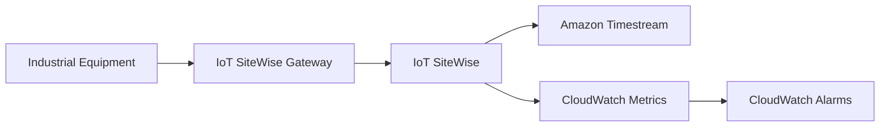

# Infrastructure as Code for Industrial IoT Data Collection with SiteWise

This directory contains Infrastructure as Code (IaC) implementations for the recipe "Industrial IoT Data Collection with SiteWise".

## Available Implementations

- **CloudFormation**: AWS native infrastructure as code (YAML)
- **CDK TypeScript**: AWS Cloud Development Kit (TypeScript)
- **CDK Python**: AWS Cloud Development Kit (Python)
- **Terraform**: Multi-cloud infrastructure as code
- **Scripts**: Bash deployment and cleanup scripts

## Prerequisites

- AWS CLI v2 installed and configured
- Appropriate AWS permissions for creating:
  - IoT SiteWise assets, asset models, and gateways
  - Amazon Timestream databases and tables
  - CloudWatch alarms and custom metrics
  - IAM roles and policies
- For CDK implementations: Node.js 18+ (TypeScript) or Python 3.8+ (Python)
- For Terraform: Terraform v1.0+
- Basic understanding of industrial IoT protocols and time-series data

## Quick Start

### Using CloudFormation (AWS)

```bash
# Deploy the stack
aws cloudformation create-stack \
    --stack-name industrial-iot-sitewise-stack \
    --template-body file://cloudformation.yaml \
    --capabilities CAPABILITY_IAM \
    --parameters ParameterKey=ProjectName,ParameterValue=manufacturing-plant \
                 ParameterKey=TimestreamDbName,ParameterValue=industrial-data

# Check deployment status
aws cloudformation describe-stacks \
    --stack-name industrial-iot-sitewise-stack \
    --query 'Stacks[0].StackStatus'
```

### Using CDK TypeScript (AWS)

```bash
# Navigate to CDK TypeScript directory
cd cdk-typescript/

# Install dependencies
npm install

# Bootstrap CDK (first time only)
cdk bootstrap

# Deploy the stack
cdk deploy

# View outputs
cdk ls
```

### Using CDK Python (AWS)

```bash
# Navigate to CDK Python directory
cd cdk-python/

# Create virtual environment
python3 -m venv .venv
source .venv/bin/activate

# Install dependencies
pip install -r requirements.txt

# Bootstrap CDK (first time only)
cdk bootstrap

# Deploy the stack
cdk deploy

# View outputs
cdk ls
```

### Using Terraform

```bash
# Navigate to Terraform directory
cd terraform/

# Initialize Terraform
terraform init

# Review planned changes
terraform plan

# Apply infrastructure changes
terraform apply

# View outputs
terraform output
```

### Using Bash Scripts

```bash
# Make scripts executable
chmod +x scripts/deploy.sh scripts/destroy.sh

# Deploy infrastructure
./scripts/deploy.sh

# Check deployment status
aws iotsitewise list-asset-models
aws timestream-write list-databases
```

## Architecture Overview

The infrastructure creates:

1. **IoT SiteWise Asset Model**: Defines the structure for industrial equipment data
2. **IoT SiteWise Asset**: Represents physical manufacturing equipment
3. **Timestream Database**: Time-series database for long-term data storage
4. **CloudWatch Alarms**: Monitoring and alerting for equipment metrics
5. **IAM Roles**: Secure access between services
6. **Gateway Configuration**: Edge gateway for industrial protocol support

## Configuration Options

### Environment Variables

```bash
# Set these before deployment
export AWS_REGION=us-east-1
export PROJECT_NAME=manufacturing-plant
export TIMESTREAM_DB_NAME=industrial-data
export ENVIRONMENT=development
```

### Parameters (CloudFormation/CDK)

- `ProjectName`: Base name for all resources (default: manufacturing-plant)
- `TimestreamDbName`: Name for Timestream database (default: industrial-data)
- `Environment`: Environment tag (default: development)
- `TemperatureThreshold`: CloudWatch alarm threshold (default: 80.0)
- `DataRetentionDays`: Timestream retention period (default: 365)

### Variables (Terraform)

```hcl
# terraform.tfvars example
project_name = "manufacturing-plant"
timestream_db_name = "industrial-data"
environment = "development"
temperature_threshold = 80.0
data_retention_days = 365
aws_region = "us-east-1"
```

## Outputs

After deployment, the following outputs are available:

- `AssetModelId`: ID of the created IoT SiteWise asset model
- `AssetId`: ID of the created IoT SiteWise asset
- `TimestreamDatabaseName`: Name of the Timestream database
- `TimestreamTableName`: Name of the Timestream table
- `CloudWatchAlarmName`: Name of the temperature monitoring alarm
- `GatewayName`: Name of the configured IoT SiteWise gateway

## Data Ingestion

### Simulated Data

The infrastructure includes sample data ingestion configurations. In production, connect to:

- **OPC-UA Servers**: Industrial automation protocols
- **Modbus Devices**: Serial communication protocol
- **MQTT Brokers**: IoT messaging protocol
- **Custom Connectors**: Proprietary industrial systems

### Real-time Data Flow



## Monitoring and Alerting

### CloudWatch Metrics

The infrastructure creates:

- Temperature monitoring with configurable thresholds
- Pressure monitoring for equipment health
- Operational efficiency calculations
- Custom metrics for business KPIs

### Alarms Configuration

```bash
# View created alarms
aws cloudwatch describe-alarms \
    --alarm-names "ProductionLine-A-HighTemperature"

# Test alarm functionality
aws cloudwatch put-metric-data \
    --namespace "AWS/IoTSiteWise" \
    --metric-data MetricName=Temperature,Value=85.0,Unit=None
```

## Security Considerations

### IAM Permissions

The infrastructure creates least-privilege IAM roles for:

- IoT SiteWise service access
- Timestream read/write permissions
- CloudWatch metrics publishing
- Gateway operations

### Network Security

- VPC endpoints for secure communication (optional)
- Security groups for gateway connectivity
- Encryption at rest for Timestream data
- TLS encryption for data in transit

### Best Practices

- Use AWS Secrets Manager for industrial system credentials
- Implement device certificates for gateway authentication
- Enable CloudTrail for API logging
- Use KMS keys for additional encryption layers

## Troubleshooting

### Common Issues

1. **Asset Model Creation Fails**
   ```bash
   # Check IAM permissions
   aws sts get-caller-identity
   aws iam get-role --role-name IoTSiteWiseRole
   ```

2. **Gateway Connection Issues**
   ```bash
   # Verify gateway status
   aws iotsitewise describe-gateway --gateway-id <gateway-id>
   ```

3. **Timestream Ingestion Problems**
   ```bash
   # Check database status
   aws timestream-write describe-database --database-name <db-name>
   ```

### Debugging Commands

```bash
# View SiteWise asset properties
aws iotsitewise describe-asset --asset-id <asset-id>

# Query Timestream data
aws timestream-query query \
    --query-string "SELECT * FROM mydb.mytable LIMIT 10"

# Check CloudWatch logs
aws logs describe-log-groups --log-group-name-prefix "/aws/iotsitewise"
```

## Cost Optimization

### Timestream Storage

- Memory store: $0.50 per GB-hour (first 24 hours)
- Magnetic store: $0.03 per GB-month (after 24 hours)
- Configure appropriate retention policies

### SiteWise Pricing

- Asset modeling: $1.00 per asset per month
- Data ingestion: $0.35 per 1,000 property values
- Data processing: $0.50 per 1,000 property values processed

### Monitoring Costs

```bash
# View cost breakdown
aws ce get-cost-and-usage \
    --time-period Start=2024-01-01,End=2024-01-31 \
    --granularity MONTHLY \
    --metrics BlendedCost \
    --group-by Type=DIMENSION,Key=SERVICE
```

## Cleanup

### Using CloudFormation (AWS)

```bash
# Delete the stack
aws cloudformation delete-stack \
    --stack-name industrial-iot-sitewise-stack

# Verify deletion
aws cloudformation describe-stacks \
    --stack-name industrial-iot-sitewise-stack
```

### Using CDK (AWS)

```bash
# Navigate to CDK directory
cd cdk-typescript/  # or cdk-python/

# Destroy the stack
cdk destroy

# Confirm deletion
cdk ls
```

### Using Terraform

```bash
# Navigate to Terraform directory
cd terraform/

# Plan destruction
terraform plan -destroy

# Destroy infrastructure
terraform destroy -auto-approve

# Verify cleanup
terraform show
```

### Using Bash Scripts

```bash
# Run cleanup script
./scripts/destroy.sh

# Manual verification
aws iotsitewise list-asset-models
aws timestream-write list-databases
```

## Customization

### Adding New Equipment Types

1. **Extend Asset Model**: Add new properties for different sensor types
2. **Update Gateway Configuration**: Configure additional industrial protocols
3. **Modify Alarms**: Create equipment-specific monitoring rules
4. **Enhance Analytics**: Add custom metrics for new equipment types

### Scaling Considerations

- **Multi-facility Deployment**: Use hierarchical asset models
- **High-volume Data**: Configure Timestream partitioning
- **Real-time Processing**: Add Lambda functions for stream processing
- **Edge Computing**: Deploy Greengrass for local processing

### Integration Examples

```bash
# Connect to QuickSight for visualization
aws quicksight create-data-source \
    --aws-account-id $AWS_ACCOUNT_ID \
    --data-source-id timestream-source \
    --name "Industrial Data" \
    --type TIMESTREAM

# Setup Lambda for custom processing
aws lambda create-function \
    --function-name industrial-data-processor \
    --runtime python3.9 \
    --handler index.handler \
    --zip-file fileb://function.zip
```

## Support

For issues with this infrastructure code:

1. Check the original recipe documentation
2. Review AWS IoT SiteWise documentation
3. Consult Timestream best practices guide
4. Verify IAM permissions and service limits

## Additional Resources

- [AWS IoT SiteWise User Guide](https://docs.aws.amazon.com/iot-sitewise/)
- [Amazon Timestream Developer Guide](https://docs.aws.amazon.com/timestream/)
- [Industrial IoT Best Practices](https://aws.amazon.com/industrial/)
- [CloudWatch Monitoring Guide](https://docs.aws.amazon.com/cloudwatch/)