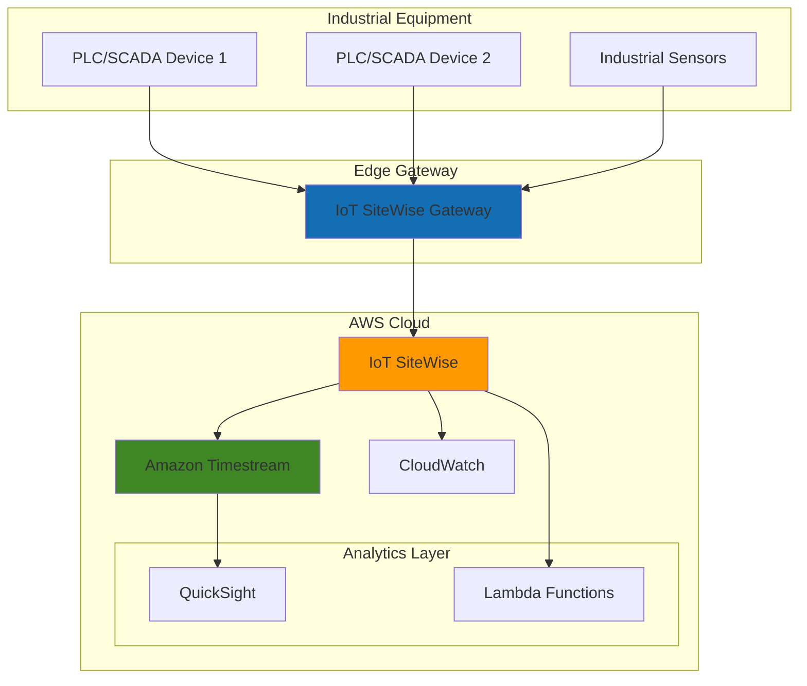

# Industrial IoT Data Collection with SiteWise

## Problem

Manufacturing companies struggle to collect, organize, and analyze data from industrial equipment scattered across multiple facilities. Traditional SCADA systems create data silos that prevent real-time insights, predictive maintenance, and operational efficiency improvements. Without unified data collection and standardized industrial data models, organizations cannot leverage IoT data for competitive advantages or regulatory compliance reporting.

## Solution

AWS IoT SiteWise provides a managed service specifically designed for industrial IoT data collection, offering built-in connectors for industrial protocols, automatic data organization using asset models, and seamless integration with analytics services. This solution creates a scalable industrial data platform that standardizes equipment data, enables real-time monitoring, and supports advanced analytics workflows for operational intelligence.

## Architecture Diagram



## Prerequisites

1. AWS account with permissions to create IoT SiteWise assets, gateways, and Timestream databases
2. AWS CLI v2 installed and configured (or AWS CloudShell access)
3. Basic understanding of industrial protocols (OPC-UA, Modbus) and IoT concepts
4. Access to industrial equipment or simulators for testing data collection
5. Estimated cost: $50-100/month for development environment (includes SiteWise storage, Timestream ingestion, and CloudWatch metrics)

> **Note**: This recipe uses simulated industrial data. In production environments, you'll connect to actual PLCs, SCADA systems, or industrial sensors using appropriate protocols.

## Preparation

```bash
# Set environment variables
export AWS_REGION=$(aws configure get region)
export AWS_ACCOUNT_ID=$(aws sts get-caller-identity \
    --query Account --output text)

# Generate unique identifiers for resources
RANDOM_SUFFIX=$(aws secretsmanager get-random-password \
    --exclude-punctuation --exclude-uppercase \
    --password-length 6 --require-each-included-type \
    --output text --query RandomPassword)

export SITEWISE_PROJECT_NAME="manufacturing-plant-${RANDOM_SUFFIX}"
export TIMESTREAM_DB_NAME="industrial-data-${RANDOM_SUFFIX}"

# Verify IoT SiteWise is available in region
aws iotsitewise describe-default-encryption-configuration \
    --region ${AWS_REGION}

echo "✅ Environment prepared for industrial IoT setup"
```

## Steps

1. **Create Industrial Asset Model**:

   Asset models in IoT SiteWise define the structure and relationships of industrial equipment, enabling standardized data collection across different manufacturers and protocols. This foundational step establishes the data schema that will organize all sensor readings, calculated metrics, and equipment hierarchies in your industrial environment.

   ```bash
   # Create asset model for manufacturing equipment
   ASSET_MODEL_ID=$(aws iotsitewise create-asset-model \
       --asset-model-name "ProductionLineEquipment" \
       --asset-model-description "Model for production line machinery" \
       --asset-model-properties '[
           {
               "name": "Temperature",
               "dataType": "DOUBLE",
               "unit": "Celsius",
               "type": {
                   "measurement": {}
               }
           },
           {
               "name": "Pressure",
               "dataType": "DOUBLE", 
               "unit": "PSI",
               "type": {
                   "measurement": {}
               }
           },
           {
               "name": "OperationalEfficiency",
               "dataType": "DOUBLE",
               "unit": "Percent",
               "type": {
                   "transform": {
                       "expression": "temp / 100 * pressure / 50",
                       "variables": [
                           {
                               "name": "temp",
                               "value": {
                                   "propertyId": "Temperature"
                               }
                           },
                           {
                               "name": "pressure", 
                               "value": {
                                   "propertyId": "Pressure"
                               }
                           }
                       ]
                   }
               }
           }
       ]' \
       --query 'assetModelId' --output text)
   
   echo "✅ Asset model created: ${ASSET_MODEL_ID}"
   ```

   The asset model now provides a reusable template that standardizes how equipment data is structured and processed. This enables consistent data collection across multiple devices and supports calculated metrics that derive business insights from raw sensor data.

2. **Create Physical Asset Instance**:

   Physical assets represent actual equipment in your manufacturing facility, providing the connection point between your asset model and real-world devices. This step creates the digital twin that will receive and process data from industrial sensors and control systems.

   ```bash
   # Create asset instance representing actual equipment
   ASSET_ID=$(aws iotsitewise create-asset \
       --asset-name "ProductionLine-A-Pump-001" \
       --asset-model-id ${ASSET_MODEL_ID} \
       --query 'assetId' --output text)
   
   # Wait for asset to be active
   aws iotsitewise wait asset-active \
       --asset-id ${ASSET_ID}
   
   echo "✅ Physical asset created: ${ASSET_ID}"
   ```

   Your digital asset is now established and ready to receive data streams from connected industrial equipment. This asset instance will serve as the central point for all data collection, processing, and analysis for this specific piece of equipment.

3. **Configure Timestream Database for Time-Series Storage**:

   Amazon Timestream provides purpose-built time-series database capabilities optimized for IoT workloads, offering automatic data lifecycle management and high-performance queries for industrial analytics. Integrating Timestream with SiteWise enables long-term storage and advanced analytics on historical equipment data.

   ```bash
   # Create Timestream database for industrial data
   aws timestream-write create-database \
       --database-name ${TIMESTREAM_DB_NAME}
   
   # Create table for SiteWise data
   aws timestream-write create-table \
       --database-name ${TIMESTREAM_DB_NAME} \
       --table-name "equipment-metrics" \
       --retention-properties '{
           "MemoryStoreRetentionPeriodInHours": 24,
           "MagneticStoreRetentionPeriodInDays": 365
       }'
   
   echo "✅ Timestream database configured for time-series storage"
   ```

   Timestream is now configured to automatically manage data lifecycle, keeping recent data in high-performance memory storage while transitioning older data to cost-effective magnetic storage. This provides optimal query performance for real-time analytics while maintaining cost efficiency for historical data retention.

4. **Set Up IoT SiteWise Gateway Simulation**:

   The IoT SiteWise gateway acts as the bridge between industrial protocols and AWS cloud services, handling data collection, preprocessing, and secure transmission. Since we're using simulated data, this step creates the gateway configuration that would typically connect to your industrial network infrastructure.

   ```bash
   # Create gateway capability configuration
   aws iotsitewise create-gateway \
       --gateway-name "manufacturing-gateway-${RANDOM_SUFFIX}" \
       --gateway-platform '{
           "greengrass": {
               "groupArn": "arn:aws:greengrass:'${AWS_REGION}':'${AWS_ACCOUNT_ID}':groups/simulation-group"
           }
       }' \
       --tags "Environment=Development,Project=${SITEWISE_PROJECT_NAME}"
   
   echo "✅ Gateway configuration established"
   ```

   The gateway is now configured to handle industrial data collection protocols and manage the secure connection between your factory floor and AWS cloud services. In production environments, this gateway would be deployed on industrial-grade hardware within your manufacturing facility.

5. **Configure Data Ingestion and Measurements**:

   Data ingestion establishes the flow of sensor readings from industrial equipment into SiteWise, enabling real-time monitoring and historical analysis. This configuration defines how raw measurements are processed, validated, and stored within your industrial data platform.

   ```bash
   # Get property IDs for measurements
   TEMP_PROPERTY_ID=$(aws iotsitewise describe-asset \
       --asset-id ${ASSET_ID} \
       --query 'assetProperties[?name==`Temperature`].id' \
       --output text)
   
   PRESSURE_PROPERTY_ID=$(aws iotsitewise describe-asset \
       --asset-id ${ASSET_ID} \
       --query 'assetProperties[?name==`Pressure`].id' \
       --output text)
   
   # Simulate batch data ingestion
   aws iotsitewise batch-put-asset-property-value \
       --entries '[
           {
               "entryId": "temp-reading-1",
               "assetId": "'${ASSET_ID}'",
               "propertyId": "'${TEMP_PROPERTY_ID}'",
               "propertyValues": [
                   {
                       "value": {
                           "doubleValue": 75.5
                       },
                       "timestamp": {
                           "timeInSeconds": '$(date +%s)'
                       }
                   }
               ]
           },
           {
               "entryId": "pressure-reading-1", 
               "assetId": "'${ASSET_ID}'",
               "propertyId": "'${PRESSURE_PROPERTY_ID}'",
               "propertyValues": [
                   {
                       "value": {
                           "doubleValue": 45.2
                       },
                       "timestamp": {
                           "timeInSeconds": '$(date +%s)'
                       }
                   }
               ]
           }
       ]'
   
   echo "✅ Industrial measurements ingested successfully"
   ```

   Your industrial data is now flowing into SiteWise where it's automatically processed, validated, and made available for real-time monitoring and historical analysis. The system will continue processing incoming measurements and calculating derived metrics based on your asset model configuration.

6. **Configure CloudWatch Monitoring for Equipment**:

   CloudWatch integration provides comprehensive monitoring and alerting capabilities for industrial equipment, enabling proactive maintenance and operational optimization. This monitoring layer ensures you can quickly identify equipment anomalies and performance degradation before they impact production.

   ```bash
   # Create CloudWatch alarm for temperature threshold
   aws cloudwatch put-metric-alarm \
       --alarm-name "ProductionLine-A-HighTemperature" \
       --alarm-description "Alert when equipment temperature exceeds threshold" \
       --metric-name "Temperature" \
       --namespace "AWS/IoTSiteWise" \
       --statistic "Average" \
       --period 300 \
       --threshold 80.0 \
       --comparison-operator "GreaterThanThreshold" \
       --evaluation-periods 2 \
       --alarm-actions "arn:aws:sns:${AWS_REGION}:${AWS_ACCOUNT_ID}:equipment-alerts"
   
   # Create custom metric for operational efficiency tracking
   aws cloudwatch put-metric-data \
       --namespace "Manufacturing/Efficiency" \
       --metric-data '[
           {
               "MetricName": "OperationalEfficiency",
               "Value": 85.5,
               "Unit": "Percent",
               "Dimensions": [
                   {
                       "Name": "AssetId",
                       "Value": "'${ASSET_ID}'"
                   }
               ]
           }
       ]'
   
   echo "✅ Equipment monitoring and alerting configured"
   ```

   CloudWatch monitoring is now actively tracking your equipment performance with automated alerting for critical thresholds. This monitoring foundation enables predictive maintenance strategies and ensures rapid response to equipment anomalies that could affect production schedules.

> **Warning**: In production environments, ensure proper security configurations including VPC endpoints, device certificates, and least-privilege IAM policies to protect industrial control systems from cyber threats.

## Validation & Testing

1. Verify asset model and instance creation:

   ```bash
   # Check asset model status
   aws iotsitewise describe-asset-model \
       --asset-model-id ${ASSET_MODEL_ID} \
       --query 'assetModelStatus.state'
   ```

   Expected output: `"ACTIVE"`

2. Validate data ingestion and property values:

   ```bash
   # Retrieve latest property values
   aws iotsitewise get-asset-property-value \
       --asset-id ${ASSET_ID} \
       --property-id ${TEMP_PROPERTY_ID}
   
   aws iotsitewise get-asset-property-value \
       --asset-id ${ASSET_ID} \
       --property-id ${PRESSURE_PROPERTY_ID}
   ```

   Expected output: JSON response showing the most recent temperature and pressure readings with timestamps.

3. Test time-series data queries:

   ```bash
   # Query historical data for the past hour
   aws iotsitewise get-asset-property-value-history \
       --asset-id ${ASSET_ID} \
       --property-id ${TEMP_PROPERTY_ID} \
       --start-date $(date -d '1 hour ago' -u +%Y-%m-%dT%H:%M:%SZ) \
       --end-date $(date -u +%Y-%m-%dT%H:%M:%SZ)
   ```

4. Verify Timestream integration:

   ```bash
   # Check Timestream database and table
   aws timestream-query query \
       --query-string "SELECT * FROM \"${TIMESTREAM_DB_NAME}\".\"equipment-metrics\" ORDER BY time DESC LIMIT 10"
   ```

## Cleanup

1. Remove CloudWatch alarms and custom metrics:

   ```bash
   # Delete CloudWatch alarm
   aws cloudwatch delete-alarms \
       --alarm-names "ProductionLine-A-HighTemperature"
   
   echo "✅ CloudWatch monitoring removed"
   ```

2. Delete IoT SiteWise assets and models:

   ```bash
   # Delete asset instance
   aws iotsitewise delete-asset \
       --asset-id ${ASSET_ID}
   
   # Wait for asset deletion
   sleep 30
   
   # Delete asset model
   aws iotsitewise delete-asset-model \
       --asset-model-id ${ASSET_MODEL_ID}
   
   echo "✅ SiteWise assets and models removed"
   ```

3. Remove Timestream resources:

   ```bash
   # Delete Timestream table
   aws timestream-write delete-table \
       --database-name ${TIMESTREAM_DB_NAME} \
       --table-name "equipment-metrics"
   
   # Delete Timestream database
   aws timestream-write delete-database \
       --database-name ${TIMESTREAM_DB_NAME}
   
   echo "✅ Timestream resources cleaned up"
   ```

4. Clean up environment variables:

   ```bash
   # Clear environment variables
   unset SITEWISE_PROJECT_NAME TIMESTREAM_DB_NAME ASSET_MODEL_ID ASSET_ID
   unset TEMP_PROPERTY_ID PRESSURE_PROPERTY_ID
   
   echo "✅ Environment variables cleared"
   ```

## Discussion

AWS IoT SiteWise transforms industrial data management by providing a purpose-built platform that understands the unique requirements of manufacturing environments. Unlike generic IoT platforms, SiteWise offers built-in support for industrial protocols like OPC-UA and Modbus, automatic data modeling capabilities, and edge processing that can operate in disconnected factory environments. The service's asset modeling framework enables you to create standardized digital representations of equipment that can scale across multiple facilities and equipment types.

The integration with Amazon Timestream provides industrial organizations with a cost-effective solution for storing massive volumes of time-series data while maintaining high query performance for real-time analytics. This combination enables use cases ranging from real-time equipment monitoring to predictive maintenance algorithms that can analyze years of historical performance data. The automatic data lifecycle management ensures that frequently accessed recent data remains in high-performance storage while older data transitions to cost-optimized storage tiers.

The architecture supports advanced analytics workflows through seamless integration with services like Amazon QuickSight for visualization, AWS Lambda for custom processing logic, and Amazon SageMaker for machine learning-powered predictive maintenance. Security considerations are paramount in industrial environments, and SiteWise provides enterprise-grade security features including encryption at rest and in transit, VPC support, and integration with AWS Identity and Access Management for fine-grained access controls.

> **Tip**: Start with a pilot deployment on non-critical equipment to validate data models and establish operational procedures before scaling to production-critical systems. Consider implementing data governance policies to ensure consistent asset naming and property definitions across your organization.

## Challenge

Extend this industrial IoT solution by implementing these advanced capabilities:

1. **Real-time Equipment Monitoring Dashboard**: Create a QuickSight dashboard that displays live equipment status, efficiency metrics, and predictive maintenance alerts with automatic refresh capabilities.

2. **Predictive Maintenance Algorithm**: Develop a SageMaker model that analyzes historical equipment data to predict failures and schedule maintenance windows based on operational patterns and performance degradation trends.

3. **Multi-facility Data Aggregation**: Implement a hierarchical asset model structure that aggregates data from multiple production lines and facilities, enabling enterprise-wide operational intelligence and comparative analysis.

4. **Edge Computing Integration**: Deploy AWS IoT Greengrass at the edge to enable local data processing, reduce latency for critical control systems, and maintain operations during network connectivity issues.

5. **Advanced Alert Management**: Create a comprehensive alerting system using Amazon SNS and AWS Lambda that correlates multiple equipment signals to reduce false alarms and prioritize maintenance actions based on production impact.

## Infrastructure Code

*Infrastructure code will be generated after recipe approval.*