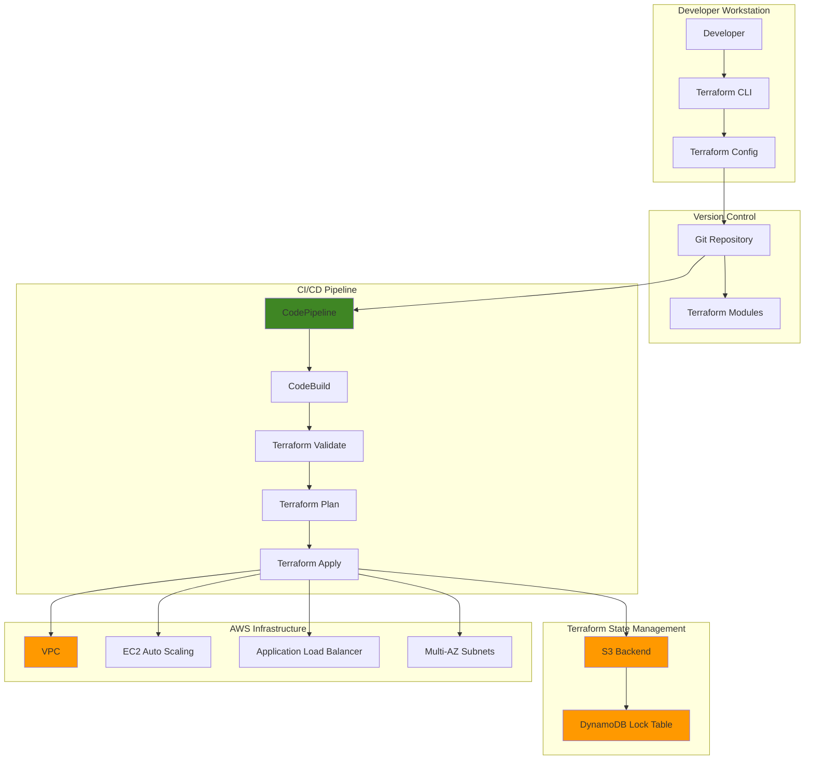

# Infrastructure as Code with Terraform

## Problem

Enterprise development teams struggle with inconsistent infrastructure deployments across environments, leading to configuration drift, manual errors, and time-consuming debugging sessions. Traditional infrastructure management approaches create bottlenecks where infrastructure changes require manual coordination between teams, resulting in delayed deployments and increased operational overhead. Without proper version control and automation, organizations cannot achieve reliable, repeatable infrastructure deployments at scale.

## Solution

Terraform provides a declarative infrastructure as code approach that enables teams to define, version, and manage AWS infrastructure through reusable modules and automated workflows. By implementing Terraform with AWS provider integration, remote state management, and CI/CD pipelines, organizations can achieve consistent infrastructure deployments, reduce manual errors, and accelerate delivery cycles while maintaining proper governance and security controls.

## Architecture Diagram



## Prerequisites

1. AWS account with appropriate permissions for EC2, VPC, S3, DynamoDB, ALB, and IAM
2. Terraform CLI v1.0 or later installed ([latest version available](https://developer.hashicorp.com/terraform/install))
3. AWS CLI v2 installed and configured
4. Basic understanding of infrastructure concepts and AWS services
5. Git installed for version control
6. Estimated cost: $15-25 per day for resources created (can be reduced with t3.micro instances)

> **Note**: This recipe creates billable AWS resources. Ensure you follow the cleanup section to avoid ongoing charges.

## Preparation

```bash
# Set environment variables
export AWS_REGION=$(aws configure get region)
export AWS_ACCOUNT_ID=$(aws sts get-caller-identity \
    --query Account --output text)

# Generate unique suffix for resources
RANDOM_SUFFIX=$(aws secretsmanager get-random-password \
    --exclude-punctuation --exclude-uppercase \
    --password-length 6 --require-each-included-type \
    --output text --query RandomPassword)

# Set project variables
export PROJECT_NAME="terraform-iac-demo"
export BUCKET_NAME="${PROJECT_NAME}-state-${RANDOM_SUFFIX}"
export LOCK_TABLE_NAME="${PROJECT_NAME}-locks"

# Create S3 bucket for Terraform state (handle us-east-1 region special case)
if [ "$AWS_REGION" = "us-east-1" ]; then
    aws s3api create-bucket --bucket ${BUCKET_NAME}
else
    aws s3api create-bucket \
        --bucket ${BUCKET_NAME} \
        --create-bucket-configuration LocationConstraint=${AWS_REGION}
fi

# Enable versioning on state bucket
aws s3api put-bucket-versioning \
    --bucket ${BUCKET_NAME} \
    --versioning-configuration Status=Enabled

# Enable server-side encryption
aws s3api put-bucket-encryption \
    --bucket ${BUCKET_NAME} \
    --server-side-encryption-configuration \
    'Rules=[{ApplyServerSideEncryptionByDefault:{SSEAlgorithm:AES256}}]'

# Create DynamoDB table for state locking
aws dynamodb create-table \
    --table-name ${LOCK_TABLE_NAME} \
    --attribute-definitions AttributeName=LockID,AttributeType=S \
    --key-schema AttributeName=LockID,KeyType=HASH \
    --billing-mode PAY_PER_REQUEST \
    --region ${AWS_REGION}

# Wait for table to be active
aws dynamodb wait table-exists \
    --table-name ${LOCK_TABLE_NAME} \
    --region ${AWS_REGION}

echo "✅ Terraform backend resources created successfully"
```

## Steps

1. **Initialize Terraform Project Structure**:

   Infrastructure as Code requires a well-organized project structure that promotes code reusability, environment separation, and team collaboration. The modular approach we're implementing separates concerns between networking, compute, and configuration layers, enabling teams to develop and maintain each component independently while ensuring consistent integration patterns that follow AWS Well-Architected Framework principles.

   ```bash
   # Create project directory structure
   mkdir -p ${PROJECT_NAME}/{modules/{vpc,compute},environments/{dev,staging,prod}}
   cd ${PROJECT_NAME}
   
   # Create main Terraform configuration
   cat > main.tf << 'EOF'
   terraform {
     required_version = ">= 1.0"
     required_providers {
       aws = {
         source  = "hashicorp/aws"
         version = "~> 6.0"
       }
     }
     backend "s3" {
       # Backend configuration will be provided during init
     }
   }
   
   provider "aws" {
     region = var.aws_region
     
     default_tags {
       tags = {
         Project     = var.project_name
         Environment = var.environment
         ManagedBy   = "terraform"
         CreatedBy   = "infrastructure-as-code-recipe"
       }
     }
   }
   EOF
   
   echo "✅ Project structure created"
   ```

   The project structure now provides a foundation for scalable infrastructure management. The modules directory enables component reusability across environments, while the environments directory maintains configuration isolation. The main.tf file establishes provider requirements and default tagging strategies that ensure consistent resource identification and cost tracking across all AWS resources following AWS tagging best practices.

2. **Create Terraform Variables and Configuration**:

   Terraform variables enable parameterization and configuration flexibility, allowing the same infrastructure code to deploy different configurations across environments. Variable types and validation ensure configuration consistency, while defaults provide sensible fallbacks. This approach enables infrastructure versioning and promotes configuration as code principles essential for enterprise deployments that comply with AWS security and governance requirements.

   ```bash
   # Create variables file
   cat > variables.tf << 'EOF'
   variable "aws_region" {
     description = "AWS region for resources"
     type        = string
     default     = "us-east-1"
     
     validation {
       condition = can(regex("^[a-z]+-[a-z]+-[0-9]+$", var.aws_region))
       error_message = "AWS region must be in the format: region-location-number (e.g., us-east-1)."
     }
   }
   
   variable "project_name" {
     description = "Name of the project"
     type        = string
     default     = "terraform-iac-demo"
     
     validation {
       condition = can(regex("^[a-z0-9-]+$", var.project_name))
       error_message = "Project name must contain only lowercase letters, numbers, and hyphens."
     }
   }
   
   variable "environment" {
     description = "Environment name"
     type        = string
     default     = "dev"
     
     validation {
       condition = contains(["dev", "staging", "prod"], var.environment)
       error_message = "Environment must be dev, staging, or prod."
     }
   }
   
   variable "vpc_cidr" {
     description = "CIDR block for VPC"
     type        = string
     default     = "10.0.0.0/16"
     
     validation {
       condition = can(cidrhost(var.vpc_cidr, 0))
       error_message = "VPC CIDR must be a valid IPv4 CIDR block."
     }
   }
   
   variable "instance_type" {
     description = "EC2 instance type"
     type        = string
     default     = "t3.micro"
     
     validation {
       condition = contains(["t3.micro", "t3.small", "t3.medium"], var.instance_type)
       error_message = "Instance type must be t3.micro, t3.small, or t3.medium for cost optimization."
     }
   }
   EOF
   
   # Create outputs file
   cat > outputs.tf << 'EOF'
   output "vpc_id" {
     description = "ID of the VPC"
     value       = module.vpc.vpc_id
   }
   
   output "public_subnet_ids" {
     description = "IDs of public subnets"
     value       = module.vpc.public_subnet_ids
   }
   
   output "alb_dns_name" {
     description = "DNS name of the Application Load Balancer"
     value       = module.compute.alb_dns_name
   }
   
   output "alb_zone_id" {
     description = "Zone ID of the Application Load Balancer"
     value       = module.compute.alb_zone_id
   }
   
   output "auto_scaling_group_arn" {
     description = "ARN of the Auto Scaling Group"
     value       = module.compute.auto_scaling_group_arn
   }
   EOF
   
   echo "✅ Variables and outputs configured"
   ```

   The variable definitions establish input parameters with type safety, validation, and documentation, enabling teams to customize deployments without modifying core infrastructure code. The validation blocks ensure configuration integrity and prevent common deployment errors. Output values provide essential resource identifiers for integration with other systems, CI/CD pipelines, and dependent infrastructure components following AWS resource naming conventions.

3. **Create VPC Module**:

   Amazon VPC provides isolated network environments within AWS, enabling secure multi-tier architectures with granular network controls that follow AWS networking best practices. This module implements foundational networking components including public subnets across multiple availability zones for high availability, internet connectivity, and security group policies that implement defense-in-depth security principles. The modular design allows teams to standardize networking patterns while maintaining flexibility for different application requirements.

   ```bash
   # Create VPC module
   cat > modules/vpc/main.tf << 'EOF'
   # Data source for availability zones
   data "aws_availability_zones" "available" {
     state = "available"
   }
   
   # VPC
   resource "aws_vpc" "main" {
     cidr_block           = var.vpc_cidr
     enable_dns_hostnames = true
     enable_dns_support   = true
   
     tags = {
       Name = "${var.project_name}-vpc"
     }
   }
   
   # Internet Gateway
   resource "aws_internet_gateway" "main" {
     vpc_id = aws_vpc.main.id
   
     tags = {
       Name = "${var.project_name}-igw"
     }
   }
   
   # Public Subnets across multiple AZs for high availability
   resource "aws_subnet" "public" {
     count  = min(length(data.aws_availability_zones.available.names), 3)
     vpc_id = aws_vpc.main.id
   
     cidr_block              = cidrsubnet(var.vpc_cidr, 8, count.index)
     availability_zone       = data.aws_availability_zones.available.names[count.index]
     map_public_ip_on_launch = true
   
     tags = {
       Name = "${var.project_name}-public-${count.index + 1}"
       Type = "public"
       Tier = "web"
     }
   }
   
   # Route Table for Public Subnets
   resource "aws_route_table" "public" {
     vpc_id = aws_vpc.main.id
   
     route {
       cidr_block = "0.0.0.0/0"
       gateway_id = aws_internet_gateway.main.id
     }
   
     tags = {
       Name = "${var.project_name}-public-rt"
     }
   }
   
   # Route Table Associations
   resource "aws_route_table_association" "public" {
     count          = length(aws_subnet.public)
     subnet_id      = aws_subnet.public[count.index].id
     route_table_id = aws_route_table.public.id
   }
   
   # Security Group for Application Load Balancer
   resource "aws_security_group" "alb" {
     name_prefix = "${var.project_name}-alb-"
     vpc_id      = aws_vpc.main.id
     description = "Security group for Application Load Balancer"
   
     ingress {
       description = "HTTP"
       from_port   = 80
       to_port     = 80
       protocol    = "tcp"
       cidr_blocks = ["0.0.0.0/0"]
     }
   
     ingress {
       description = "HTTPS"
       from_port   = 443
       to_port     = 443
       protocol    = "tcp"
       cidr_blocks = ["0.0.0.0/0"]
     }
   
     egress {
       description = "All outbound traffic"
       from_port   = 0
       to_port     = 0
       protocol    = "-1"
       cidr_blocks = ["0.0.0.0/0"]
     }
   
     tags = {
       Name = "${var.project_name}-alb-sg"
     }
   }
   
   # Security Group for Web Servers
   resource "aws_security_group" "web" {
     name_prefix = "${var.project_name}-web-"
     vpc_id      = aws_vpc.main.id
     description = "Security group for web servers"
   
     ingress {
       description     = "HTTP from ALB"
       from_port       = 80
       to_port         = 80
       protocol        = "tcp"
       security_groups = [aws_security_group.alb.id]
     }
   
     egress {
       description = "All outbound traffic"
       from_port   = 0
       to_port     = 0
       protocol    = "-1"
       cidr_blocks = ["0.0.0.0/0"]
     }
   
     tags = {
       Name = "${var.project_name}-web-sg"
     }
   }
   EOF
   
   # Create VPC module variables
   cat > modules/vpc/variables.tf << 'EOF'
   variable "project_name" {
     description = "Name of the project"
     type        = string
   }
   
   variable "vpc_cidr" {
     description = "CIDR block for VPC"
     type        = string
   }
   EOF
   
   # Create VPC module outputs
   cat > modules/vpc/outputs.tf << 'EOF'
   output "vpc_id" {
     description = "ID of the VPC"
     value       = aws_vpc.main.id
   }
   
   output "public_subnet_ids" {
     description = "IDs of public subnets"
     value       = aws_subnet.public[*].id
   }
   
   output "alb_security_group_id" {
     description = "ID of the ALB security group"
     value       = aws_security_group.alb.id
   }
   
   output "web_security_group_id" {
     description = "ID of the web security group"
     value       = aws_security_group.web.id
   }
   
   output "internet_gateway_id" {
     description = "ID of the Internet Gateway"
     value       = aws_internet_gateway.main.id
   }
   EOF
   
   echo "✅ VPC module created"
   ```

   The VPC module establishes a secure, scalable network foundation with multi-AZ redundancy and proper security controls following AWS security best practices. The configuration creates isolated network segments with internet connectivity while implementing security groups that follow the principle of least privilege and defense-in-depth security. This networking foundation supports high-availability applications and provides the secure base layer for all subsequent infrastructure components.

4. **Create Compute Module**:

   EC2 Auto Scaling and Application Load Balancer provide the foundation for resilient, scalable web applications that automatically respond to demand changes following AWS Well-Architected reliability principles. This module implements modern compute patterns including launch templates for consistent instance configuration, target groups for health monitoring, and auto scaling policies that ensure optimal resource utilization while maintaining application availability during traffic fluctuations. The architecture supports zero-downtime deployments and elastic scaling capabilities.

   ```bash
   # Create compute module
   cat > modules/compute/main.tf << 'EOF'
   # Data source for latest Amazon Linux 2023 AMI
   data "aws_ami" "amazon_linux" {
     most_recent = true
     owners      = ["amazon"]
   
     filter {
       name   = "name"
       values = ["al2023-ami-*-x86_64"]
     }
   
     filter {
       name   = "virtualization-type"
       values = ["hvm"]
     }
   }
   
   # IAM Role for EC2 instances
   resource "aws_iam_role" "ec2_role" {
     name_prefix = "${var.project_name}-ec2-role-"
   
     assume_role_policy = jsonencode({
       Version = "2012-10-17"
       Statement = [
         {
           Action = "sts:AssumeRole"
           Effect = "Allow"
           Principal = {
             Service = "ec2.amazonaws.com"
           }
         }
       ]
     })
   
     tags = {
       Name = "${var.project_name}-ec2-role"
     }
   }
   
   # IAM Instance Profile
   resource "aws_iam_instance_profile" "ec2_profile" {
     name_prefix = "${var.project_name}-ec2-profile-"
     role        = aws_iam_role.ec2_role.name
   
     tags = {
       Name = "${var.project_name}-ec2-profile"
     }
   }
   
   # Launch Template for Web Servers
   resource "aws_launch_template" "web" {
     name_prefix   = "${var.project_name}-web-"
     image_id      = data.aws_ami.amazon_linux.id
     instance_type = var.instance_type
   
     vpc_security_group_ids = [var.web_security_group_id]
     
     iam_instance_profile {
       name = aws_iam_instance_profile.ec2_profile.name
     }
   
     user_data = base64encode(templatefile("${path.module}/user_data.sh", {
       project_name = var.project_name
     }))
   
     tag_specifications {
       resource_type = "instance"
       tags = {
         Name = "${var.project_name}-web-instance"
         Type = "web-server"
       }
     }
   
     metadata_options {
       http_endpoint = "enabled"
       http_tokens   = "required"
       http_put_response_hop_limit = 2
     }
   
     monitoring {
       enabled = true
     }
   }
   
   # Application Load Balancer
   resource "aws_lb" "web" {
     name               = "${var.project_name}-web-alb"
     internal           = false
     load_balancer_type = "application"
     security_groups    = [var.alb_security_group_id]
     subnets            = var.subnet_ids
   
     enable_deletion_protection = false
     
     access_logs {
       bucket  = var.access_logs_bucket
       enabled = var.enable_access_logs
     }
   
     tags = {
       Name = "${var.project_name}-web-alb"
     }
   }
   
   # Target Group
   resource "aws_lb_target_group" "web" {
     name     = "${var.project_name}-web-tg"
     port     = 80
     protocol = "HTTP"
     vpc_id   = var.vpc_id
   
     health_check {
       enabled             = true
       healthy_threshold   = 2
       unhealthy_threshold = 3
       timeout             = 10
       interval            = 30
       path                = "/health"
       matcher             = "200,404"
       port                = "traffic-port"
       protocol            = "HTTP"
     }
   
     tags = {
       Name = "${var.project_name}-web-tg"
     }
   }
   
   # ALB Listener
   resource "aws_lb_listener" "web" {
     load_balancer_arn = aws_lb.web.arn
     port              = "80"
     protocol          = "HTTP"
   
     default_action {
       type             = "forward"
       target_group_arn = aws_lb_target_group.web.arn
     }
   
     tags = {
       Name = "${var.project_name}-web-listener"
     }
   }
   
   # Auto Scaling Group
   resource "aws_autoscaling_group" "web" {
     name                = "${var.project_name}-web-asg"
     vpc_zone_identifier = var.subnet_ids
     target_group_arns   = [aws_lb_target_group.web.arn]
     health_check_type   = "ELB"
     health_check_grace_period = 300
     min_size            = 2
     max_size            = 6
     desired_capacity    = 2
   
     launch_template {
       id      = aws_launch_template.web.id
       version = "$Latest"
     }
   
     instance_refresh {
       strategy = "Rolling"
       preferences {
         min_healthy_percentage = 50
       }
     }
   
     tag {
       key                 = "Name"
       value               = "${var.project_name}-web-asg"
       propagate_at_launch = false
     }
   
     tag {
       key                 = "Environment"
       value               = "production"
       propagate_at_launch = true
     }
   }
   
   # Auto Scaling Policy - Scale Up
   resource "aws_autoscaling_policy" "scale_up" {
     name                   = "${var.project_name}-scale-up"
     scaling_adjustment     = 1
     adjustment_type        = "ChangeInCapacity"
     cooldown               = 300
     autoscaling_group_name = aws_autoscaling_group.web.name
   }
   
   # Auto Scaling Policy - Scale Down
   resource "aws_autoscaling_policy" "scale_down" {
     name                   = "${var.project_name}-scale-down"
     scaling_adjustment     = -1
     adjustment_type        = "ChangeInCapacity"
     cooldown               = 300
     autoscaling_group_name = aws_autoscaling_group.web.name
   }
   EOF
   
   # Create user data script
   cat > modules/compute/user_data.sh << 'EOF'
   #!/bin/bash
   yum update -y
   yum install -y httpd
   systemctl start httpd
   systemctl enable httpd
   
   # Create a simple health check endpoint
   echo "OK" > /var/www/html/health
   
   # Create main page with instance information
   cat > /var/www/html/index.html << HTML
   <!DOCTYPE html>
   <html>
   <head>
       <title>${project_name} - Terraform Infrastructure</title>
       <style>
           body { font-family: Arial, sans-serif; margin: 40px; }
           .container { max-width: 800px; margin: 0 auto; }
           .info { background: #f0f0f0; padding: 20px; border-radius: 5px; }
       </style>
   </head>
   <body>
       <div class="container">
           <h1>Hello from Terraform Infrastructure!</h1>
           <div class="info">
               <h2>Instance Information</h2>
               <p><strong>Instance ID:</strong> $(curl -s http://169.254.169.254/latest/meta-data/instance-id)</p>
               <p><strong>Availability Zone:</strong> $(curl -s http://169.254.169.254/latest/meta-data/placement/availability-zone)</p>
               <p><strong>Instance Type:</strong>$(curl -s http://169.254.169.254/latest/meta-data/instance-type)</p>
               <p><strong>Project:</strong> ${project_name}</p>
               <p><strong>Timestamp:</strong> $(date)</p>
           </div>
       </div>
   </body>
   </html>
   HTML
   
   # Set proper permissions
   chown -R apache:apache /var/www/html/
   chmod -R 755 /var/www/html/
   EOF
   
   # Create compute module variables
   cat > modules/compute/variables.tf << 'EOF'
   variable "project_name" {
     description = "Name of the project"
     type        = string
   }
   
   variable "vpc_id" {
     description = "ID of the VPC"
     type        = string
   }
   
   variable "subnet_ids" {
     description = "List of subnet IDs"
     type        = list(string)
   }
   
   variable "alb_security_group_id" {
     description = "ID of the ALB security group"
     type        = string
   }
   
   variable "web_security_group_id" {
     description = "ID of the web security group"
     type        = string
   }
   
   variable "instance_type" {
     description = "EC2 instance type"
     type        = string
     default     = "t3.micro"
   }
   
   variable "enable_access_logs" {
     description = "Enable ALB access logs"
     type        = bool
     default     = false
   }
   
   variable "access_logs_bucket" {
     description = "S3 bucket for ALB access logs"
     type        = string
     default     = ""
   }
   EOF
   
   # Create compute module outputs
   cat > modules/compute/outputs.tf << 'EOF'
   output "alb_dns_name" {
     description = "DNS name of the Application Load Balancer"
     value       = aws_lb.web.dns_name
   }
   
   output "alb_arn" {
     description = "ARN of the Application Load Balancer"
     value       = aws_lb.web.arn
   }
   
   output "alb_zone_id" {
     description = "Zone ID of the Application Load Balancer"
     value       = aws_lb.web.zone_id
   }
   
   output "target_group_arn" {
     description = "ARN of the target group"
     value       = aws_lb_target_group.web.arn
   }
   
   output "auto_scaling_group_arn" {
     description = "ARN of the Auto Scaling Group"
     value       = aws_autoscaling_group.web.arn
   }
   
   output "launch_template_id" {
     description = "ID of the launch template"
     value       = aws_launch_template.web.id
   }
   EOF
   
   echo "✅ Compute module created"
   ```

   The compute module provides enterprise-grade scalability and reliability through Auto Scaling Groups and Application Load Balancer integration following AWS security and operational best practices. Launch templates ensure consistent instance configuration with automated software installation, while health checks and target groups enable rapid failure detection and recovery. The architecture includes CloudWatch monitoring, IMDSv2 enforcement, and automated scaling policies that provide the elastic compute capacity needed for production workloads.

5. **Create Main Configuration and Module References**:

   Module composition enables infrastructure reusability and dependency management through explicit input/output relationships following Terraform best practices. This approach allows teams to build complex architectures from standardized components while maintaining clear separation of concerns. Module dependencies ensure proper resource creation order and enable Terraform to build comprehensive dependency graphs for reliable deployment and destruction operations that minimize downtime and configuration drift.

   ```bash
   # Update main.tf to include module references
   cat >> main.tf << 'EOF'
   
   # VPC Module
   module "vpc" {
     source = "./modules/vpc"
   
     project_name = var.project_name
     vpc_cidr     = var.vpc_cidr
   }
   
   # Compute Module
   module "compute" {
     source = "./modules/compute"
   
     project_name           = var.project_name
     vpc_id                 = module.vpc.vpc_id
     subnet_ids             = module.vpc.public_subnet_ids
     alb_security_group_id  = module.vpc.alb_security_group_id
     web_security_group_id  = module.vpc.web_security_group_id
     instance_type          = var.instance_type
     enable_access_logs     = false
     access_logs_bucket     = ""
   }
   EOF
   
   echo "✅ Main configuration updated with module references"
   ```

   The module composition establishes explicit dependencies between networking and compute layers, ensuring resources are created in the proper order following AWS deployment best practices. Terraform automatically builds a dependency graph from these module relationships, enabling parallel resource creation where possible while respecting dependencies. This modular architecture supports incremental infrastructure changes and enables teams to modify individual components without affecting the entire system.

6. **Initialize Terraform with Remote State**:

   Remote state management is essential for team collaboration and production deployments, providing centralized state storage with locking mechanisms to prevent concurrent modifications following Terraform collaboration best practices. S3 provides durable, versioned storage for state files with 99.999999999% durability, while DynamoDB enables distributed locking to ensure only one team member can modify infrastructure at a time. This configuration enables safe, coordinated infrastructure changes across distributed teams with proper audit trails.

   ```bash
   # Initialize Terraform with backend configuration
   terraform init \
     -backend-config="bucket=${BUCKET_NAME}" \
     -backend-config="key=terraform.tfstate" \
     -backend-config="region=${AWS_REGION}" \
     -backend-config="dynamodb_table=${LOCK_TABLE_NAME}" \
     -backend-config="encrypt=true"
   
   # Format and validate configuration
   terraform fmt -recursive
   terraform validate
   
   echo "✅ Terraform initialized with remote state backend"
   ```

   Terraform initialization downloads required provider plugins and configures the remote backend for state management with encryption at rest. The validation step ensures all configuration syntax is correct and provider requirements are met before attempting deployments. This initialization process establishes the foundation for collaborative infrastructure management and enables consistent deployments across different environments and team members with proper security controls.

7. **Create Environment-Specific Configuration**:

   Environment-specific configuration files enable the same infrastructure code to deploy different resource configurations for development, staging, and production environments following infrastructure as code best practices. This approach reduces configuration drift by maintaining consistent infrastructure patterns while allowing environment-specific optimizations like instance sizes, network ranges, and scaling parameters. The separation of configuration from code enables controlled promotion workflows and environment parity that supports DevOps practices.

   ```bash
   # Create development environment configuration
   cat > environments/dev/terraform.tfvars << EOF
   aws_region    = "${AWS_REGION}"
   project_name  = "terraform-iac-demo"
   environment   = "dev"
   vpc_cidr      = "10.0.0.0/16"
   instance_type = "t3.micro"
   EOF
   
   # Create staging environment configuration
   cat > environments/staging/terraform.tfvars << EOF
   aws_region    = "${AWS_REGION}"
   project_name  = "terraform-iac-demo"
   environment   = "staging"
   vpc_cidr      = "10.1.0.0/16"
   instance_type = "t3.small"
   EOF
   
   # Create production environment configuration
   cat > environments/prod/terraform.tfvars << EOF
   aws_region    = "${AWS_REGION}"
   project_name  = "terraform-iac-demo"
   environment   = "prod"
   vpc_cidr      = "10.2.0.0/16"
   instance_type = "t3.medium"
   EOF
   
   echo "✅ Environment-specific configurations created"
   ```

   The environment configurations demonstrate infrastructure parameterization patterns that support progressive deployment strategies and comply with AWS security best practices. Development environments use cost-optimized instance types and smaller network ranges, while staging mirrors production configurations for accurate testing. This configuration separation enables automated promotion workflows where infrastructure changes are validated in lower environments before production deployment, reducing risk and ensuring consistency.

8. **Plan and Apply Infrastructure**:

   Terraform's plan and apply workflow provides infrastructure change preview and controlled deployment capabilities essential for production environments following change management best practices. The plan phase shows exactly what resources will be created, modified, or destroyed, enabling team review and approval processes. The apply phase executes changes in dependency order, providing detailed progress reporting and rollback capabilities if failures occur, ensuring safe infrastructure changes.

   ```bash
   # Generate and review execution plan
   terraform plan \
     -var-file="environments/dev/terraform.tfvars" \
     -out=tfplan
   
   # Apply the configuration
   terraform apply tfplan
   
   # Get outputs for integration
   ALB_DNS_NAME=$(terraform output -raw alb_dns_name)
   VPC_ID=$(terraform output -raw vpc_id)
   ASG_ARN=$(terraform output -raw auto_scaling_group_arn)
   
   echo "✅ Infrastructure deployed successfully"
   echo "Load Balancer DNS: ${ALB_DNS_NAME}"
   echo "VPC ID: ${VPC_ID}"
   echo "Auto Scaling Group ARN: ${ASG_ARN}"
   
   # Wait for instances to be healthy
   echo "Waiting for instances to become healthy..."
   sleep 120
   ```

   The deployment process demonstrates Terraform's declarative approach where the plan file ensures consistent execution between plan and apply phases following GitOps principles. Output values provide essential integration points for connecting this infrastructure to other systems, CI/CD pipelines, and monitoring tools. This workflow pattern supports infrastructure automation while maintaining human oversight for critical production changes and provides audit trails for compliance requirements.

9. **Create Terraform Workflow Scripts**:

   Automation scripts standardize common Terraform operations across team members and environments, reducing human error and ensuring consistent deployment processes following DevOps automation principles. These wrapper scripts provide simplified interfaces for complex Terraform workflows while maintaining safety checks and proper error handling. This approach enables teams to adopt infrastructure as code practices without requiring deep Terraform expertise from all team members while maintaining operational excellence.

   ```bash
   # Create deployment script
   cat > deploy.sh << 'EOF'
   #!/bin/bash
   set -euo pipefail
   
   ENVIRONMENT=${1:-dev}
   ACTION=${2:-plan}
   
   # Validate inputs
   if [[ ! "$ENVIRONMENT" =~ ^(dev|staging|prod)$ ]]; then
     echo "Error: Environment must be dev, staging, or prod"
     exit 1
   fi
   
   if [[ ! "$ACTION" =~ ^(plan|apply|destroy)$ ]]; then
     echo "Error: Action must be plan, apply, or destroy"
     exit 1
   fi
   
   echo "Running Terraform ${ACTION} for ${ENVIRONMENT} environment..."
   
   # Check if tfvars file exists
   TFVARS_FILE="environments/${ENVIRONMENT}/terraform.tfvars"
   if [[ ! -f "$TFVARS_FILE" ]]; then
     echo "Error: Configuration file $TFVARS_FILE not found"
     exit 1
   fi
   
   case "$ACTION" in
     "plan")
       terraform plan -var-file="$TFVARS_FILE"
       ;;
     "apply")
       terraform plan -var-file="$TFVARS_FILE" -out=tfplan
       echo "Do you want to apply these changes? (yes/no)"
       read -r confirmation
       if [[ "$confirmation" == "yes" ]]; then
         terraform apply tfplan
       else
         echo "Apply cancelled"
         rm -f tfplan
       fi
       ;;
     "destroy")
       echo "WARNING: This will destroy all infrastructure in $ENVIRONMENT!"
       echo "Type 'destroy' to confirm:"
       read -r confirmation
       if [[ "$confirmation" == "destroy" ]]; then
         terraform destroy -var-file="$TFVARS_FILE"
       else
         echo "Destroy cancelled"
       fi
       ;;
   esac
   EOF
   
   chmod +x deploy.sh
   
   # Create state management script
   cat > state.sh << 'EOF'
   #!/bin/bash
   set -euo pipefail
   
   ACTION=${1:-list}
   
   case $ACTION in
     "list")
       terraform state list
       ;;
     "show")
       if [[ -z "${2:-}" ]]; then
         echo "Error: Resource name required for show command"
         exit 1
       fi
       terraform state show "$2"
       ;;
     "refresh")
       terraform refresh
       ;;
     "pull")
       terraform state pull
       ;;
     *)
       echo "Usage: ./state.sh [list|show|refresh|pull] [resource_name]"
       echo "  list    - List all resources in state"
       echo "  show    - Show detailed resource information"
       echo "  refresh - Refresh state against real infrastructure"
       echo "  pull    - Pull current state and display"
       exit 1
       ;;
   esac
   EOF
   
   chmod +x state.sh
   
   echo "✅ Workflow scripts created"
   ```

   The workflow scripts provide team-friendly interfaces that abstract Terraform complexity while maintaining operational safety through error handling and environment validation following automation best practices. These scripts enable consistent deployment patterns across different environments and team members, supporting automation while preserving the ability for manual oversight when needed. This scripting approach facilitates Terraform adoption in organizations with diverse technical skill levels and ensures operational consistency.

10. **Set Up CI/CD Pipeline Configuration**:

    CI/CD integration transforms infrastructure management from manual operations to automated, repeatable processes that reduce errors and accelerate delivery cycles following DevOps principles. AWS CodeBuild provides managed build environments that execute Terraform operations with proper credential management and audit logging. This automation enables infrastructure changes to follow the same quality gates and approval processes as application code, implementing GitOps workflows for infrastructure management.

    ```bash
    # Create buildspec for CodeBuild
    cat > buildspec.yml << 'EOF'
    version: 0.2
    
    env:
      variables:
        TF_VERSION: "1.9.8"
        ENVIRONMENT: "dev"
    
    phases:
      install:
        runtime-versions:
          python: 3.9
        commands:
          - echo "Installing Terraform ${TF_VERSION}..."
          - curl -O "https://releases.hashicorp.com/terraform/${TF_VERSION}/terraform_${TF_VERSION}_linux_amd64.zip"
          - unzip "terraform_${TF_VERSION}_linux_amd64.zip"
          - mv terraform /usr/local/bin/
          - terraform --version
          - echo "Installing additional tools..."
          - curl -L "$(curl -s https://api.github.com/repos/terraform-linters/tflint/releases/latest | grep -o -E "https://.+?_linux_amd64.zip")" > tflint.zip
          - unzip tflint.zip && mv tflint /usr/local/bin/
      
      pre_build:
        commands:
          - echo "Initializing Terraform..."
          - terraform init -input=false
          - echo "Formatting check..."
          - terraform fmt -check=true -recursive
          - echo "Validating configuration..."
          - terraform validate
          - echo "Running TFLint..."
          - tflint --init
          - tflint
      
      build:
        commands:
          - echo "Planning Terraform deployment for ${ENVIRONMENT}..."
          - terraform plan -var-file="environments/${ENVIRONMENT}/terraform.tfvars" -out=tfplan
          - echo "Terraform plan completed successfully"
          - |
            if [ "$CODEBUILD_WEBHOOK_HEAD_REF" = "refs/heads/main" ] && [ "$ENVIRONMENT" = "dev" ]; then
              echo "Applying Terraform deployment for development environment..."
              terraform apply -auto-approve tfplan
              echo "Deployment completed successfully"
            else
              echo "Skipping apply - not on main branch or not dev environment"
            fi
      
      post_build:
        commands:
          - echo "Terraform operations completed"
          - terraform output -json > outputs.json || echo "No outputs available"
    
    artifacts:
      files:
        - outputs.json
        - tfplan
      name: terraform-artifacts
    
    reports:
      terraform-security:
        files:
          - tflint-report.json
        base-directory: .
    EOF
    
    # Create .gitignore
    cat > .gitignore << 'EOF'
    # Terraform
    .terraform/
    .terraform.lock.hcl
    *.tfstate
    *.tfstate.*
    *.tfstate.backup
    *.tfvars.backup
    *.tfplan
    crash.log
    crash.*.log
    override.tf
    override.tf.json
    *_override.tf
    *_override.tf.json
    
    # TFLint
    .tflint.hcl
    
    # IDE
    .vscode/
    .idea/
    *.swp
    *.swo
    *~
    
    # OS
    .DS_Store
    .DS_Store?
    ._*
    .Spotlight-V100
    .Trashes
    ehthumbs.db
    Thumbs.db
    
    # Logs
    *.log
    
    # Runtime data
    pids
    *.pid
    *.seed
    *.pid.lock
    EOF
    
    # Create TFLint configuration
    cat > .tflint.hcl << 'EOF'
    plugin "aws" {
        enabled = true
        version = "0.24.1"
        source  = "github.com/terraform-linters/tflint-ruleset-aws"
    }
    
    rule "terraform_unused_declarations" {
      enabled = true
    }
    
    rule "terraform_comment_syntax" {
      enabled = true
    }
    
    rule "terraform_documented_outputs" {
      enabled = true
    }
    
    rule "terraform_documented_variables" {
      enabled = true
    }
    
    rule "terraform_typed_variables" {
      enabled = true
    }
    
    rule "terraform_module_pinned_source" {
      enabled = true
    }
    
    rule "terraform_naming_convention" {
      enabled = true
      format  = "snake_case"
    }
    
    rule "terraform_standard_module_structure" {
      enabled = true
    }
    EOF
    
    echo "✅ CI/CD pipeline configuration created"
    ```

    The CI/CD configuration establishes automated infrastructure deployment pipelines that enforce code quality, security scanning, and controlled releases following DevOps best practices and AWS security guidelines. The buildspec defines multi-phase deployment processes with proper validation gates, while the gitignore ensures sensitive files remain secure. This automation foundation enables teams to implement GitOps workflows where infrastructure changes are deployed through code commits and pull request approvals with proper quality controls.

## Validation & Testing

1. **Verify Infrastructure Resources**:

   ```bash
   # Check Terraform state
   terraform state list
   
   # Verify VPC creation
   aws ec2 describe-vpcs \
     --filters "Name=tag:Name,Values=terraform-iac-demo-vpc" \
     --query 'Vpcs[0].{VpcId:VpcId,State:State,CidrBlock:CidrBlock}' \
     --output table
   
   # Check Auto Scaling Group
   aws autoscaling describe-auto-scaling-groups \
     --auto-scaling-group-names terraform-iac-demo-web-asg \
     --query 'AutoScalingGroups[0].{Name:AutoScalingGroupName,DesiredCapacity:DesiredCapacity,Instances:length(Instances),HealthCheckType:HealthCheckType}' \
     --output table
   
   # Verify ALB health
   aws elbv2 describe-target-health \
     --target-group-arn $(terraform output -raw target_group_arn) \
     --query 'TargetHealthDescriptions[*].{Target:Target.Id,Health:TargetHealth.State}' \
     --output table
   ```

2. **Test Application Load Balancer**:

   ```bash
   # Get ALB DNS name
   ALB_DNS=$(terraform output -raw alb_dns_name)
   
   # Test web application
   echo "Testing web application..."
   curl -s http://${ALB_DNS} | grep -q "Hello from Terraform" && \
     echo "✅ Web application is responding" || \
     echo "❌ Web application is not responding"
   
   # Test health endpoint
   curl -s http://${ALB_DNS}/health | grep -q "OK" && \
     echo "✅ Health check endpoint is working" || \
     echo "❌ Health check endpoint is not working"
   
   # Test load balancing across instances
   echo "Testing load balancing..."
   for i in {1..5}; do
     echo "Request $i:"
     curl -s http://${ALB_DNS} | grep -o "Instance ID: [^<]*" || echo "Failed to get instance ID"
   done
   ```

   Expected output: HTML content with "Hello from Terraform!" and different instance IDs showing load balancing

3. **Validate State Management**:

   ```bash
   # Check state file in S3
   aws s3 ls s3://${BUCKET_NAME}/ --recursive
   
   # Verify state locking table exists
   aws dynamodb describe-table \
     --table-name ${LOCK_TABLE_NAME} \
     --query 'Table.{Name:TableName,Status:TableStatus,BillingMode:BillingModeSummary.BillingMode}' \
     --output table
   
   # Test state refresh
   terraform refresh \
     -var-file="environments/dev/terraform.tfvars"
   
   # Verify state integrity
   terraform state pull | jq '.version, .terraform_version, .lineage' | head -3
   ```

4. **Test Module Reusability**:

   ```bash
   # Plan staging environment to verify different configurations
   terraform plan \
     -var-file="environments/staging/terraform.tfvars"
   
   # This should show different CIDR blocks and instance types
   echo "✅ Module reusability verified - different configurations for staging"
   ```

5. **Security Validation**:

   ```bash
   # Check security group rules
   aws ec2 describe-security-groups \
     --filters "Name=tag:Name,Values=terraform-iac-demo-*" \
     --query 'SecurityGroups[*].{Name:GroupName,InboundRules:length(IpPermissions),OutboundRules:length(IpPermissionsEgress)}' \
     --output table
   
   # Verify IMDSv2 enforcement
   aws ec2 describe-instances \
     --filters "Name=tag:Name,Values=terraform-iac-demo-web-instance" \
     --query 'Reservations[*].Instances[*].MetadataOptions.HttpTokens' \
     --output text
   ```

## Cleanup

1. **Destroy Terraform-managed Resources**:

   ```bash
   # Destroy infrastructure in development environment
   terraform destroy \
     -var-file="environments/dev/terraform.tfvars" \
     -auto-approve
   
   echo "✅ Infrastructure destroyed"
   ```

2. **Remove Terraform State Resources**:

   ```bash
   # Empty and delete S3 bucket
   aws s3 rm s3://${BUCKET_NAME} --recursive
   aws s3api delete-bucket --bucket ${BUCKET_NAME}
   
   # Delete DynamoDB table
   aws dynamodb delete-table \
     --table-name ${LOCK_TABLE_NAME} \
     --region ${AWS_REGION}
   
   # Wait for table deletion
   aws dynamodb wait table-not-exists \
     --table-name ${LOCK_TABLE_NAME} \
     --region ${AWS_REGION}
   
   echo "✅ State backend resources removed"
   ```

3. **Clean Up Local Files**:

   ```bash
   # Remove project directory
   cd ..
   rm -rf ${PROJECT_NAME}
   
   # Clear environment variables
   unset AWS_REGION AWS_ACCOUNT_ID PROJECT_NAME BUCKET_NAME LOCK_TABLE_NAME RANDOM_SUFFIX
   
   echo "✅ Local cleanup completed"
   ```

## Discussion

This implementation demonstrates enterprise-grade infrastructure as code practices using Terraform and AWS, following the [AWS Well-Architected Framework](https://docs.aws.amazon.com/wellarchitected/latest/framework/welcome.html) principles. The modular approach separates concerns between networking (VPC), compute (EC2/ALB), and configuration management, enabling teams to reuse components across different environments while maintaining consistency. The architecture implements security best practices including IMDSv2 enforcement, least privilege security groups, and proper IAM roles.

The remote state backend using S3 and DynamoDB provides critical collaboration capabilities, ensuring multiple team members can work on the same infrastructure without conflicts. State locking prevents concurrent modifications, while versioning in S3 enables rollback capabilities with 99.999999999% durability. This approach is essential for production deployments where infrastructure changes must be coordinated across teams and comply with change management processes.

The CI/CD integration with CodeBuild demonstrates how infrastructure changes can be validated and deployed automatically, reducing manual errors and ensuring consistent deployment processes. By implementing terraform validate, plan, and apply in automated pipelines with TFLint security scanning, organizations can enforce governance policies and maintain audit trails for all infrastructure changes. This approach supports GitOps workflows and enables infrastructure to be treated as code with the same quality gates as application development.

Environment-specific configurations using tfvars files enable the same codebase to deploy different resource configurations for development, staging, and production environments. This approach reduces configuration drift and ensures consistency across the deployment pipeline while allowing for environment-specific optimizations like instance sizes and network configurations. The progressive deployment strategy enables validation in lower environments before production changes, reducing risk and ensuring reliability.

> **Warning**: Always review Terraform plans carefully before applying changes to production environments, as infrastructure modifications can impact running applications and data availability. Follow the [AWS Terraform best practices](https://docs.aws.amazon.com/prescriptive-guidance/latest/terraform-aws-provider-best-practices/welcome.html) for production deployments.

> **Tip**: Use `terraform fmt` and `terraform validate` as pre-commit hooks to maintain code quality and catch syntax errors before they reach your CI/CD pipeline. Consider implementing [Terraform compliance scanning](https://docs.aws.amazon.com/prescriptive-guidance/latest/terraform-aws-provider-best-practices/security-compliance.html) with tools like Checkov or TFSec.

## Challenge

Extend this Terraform implementation with these advanced features:

1. **Implement Remote Module Registry** - Create a private Terraform module registry using S3 and publish reusable modules with semantic versioning for organization-wide sharing, following [Terraform Registry protocols](https://www.terraform.io/docs/registry/api.html)
2. **Add Compliance Scanning** - Integrate tools like [Checkov](https://github.com/bridgecrewio/checkov) or [TFSec](https://github.com/aquasecurity/tfsec) into the CI/CD pipeline to automatically scan for security and compliance violations in Terraform configurations
3. **Implement Multi-Environment State Management** - Create separate state files for each environment with workspace-based deployments and automated promotion workflows using [Terraform Workspaces](https://www.terraform.io/docs/language/state/workspaces.html)
4. **Add Monitoring and Alerting** - Extend the compute module to include [CloudWatch alarms](https://docs.aws.amazon.com/AmazonCloudWatch/latest/monitoring/AlarmThatSendsEmail.html), SNS notifications, and automated scaling policies based on application metrics
5. **Implement Blue-Green Deployment** - Create Terraform configurations that support blue-green deployments with ALB target group switching and zero-downtime updates using [AWS CodeDeploy](https://docs.aws.amazon.com/codedeploy/latest/userguide/applications-create-blue-green.html)

## Infrastructure Code

### Available Infrastructure as Code:

- [Infrastructure Code Overview](code/README.md) - Detailed description of all infrastructure components
- [AWS CDK (Python)](code/cdk-python/) - AWS CDK Python implementation
- [AWS CDK (TypeScript)](code/cdk-typescript/) - AWS CDK TypeScript implementation
- [CloudFormation](code/cloudformation.yaml) - AWS CloudFormation template
- [Bash CLI Scripts](code/scripts/) - Example bash scripts using AWS CLI commands to deploy infrastructure
- [Terraform](code/terraform/) - Terraform configuration files