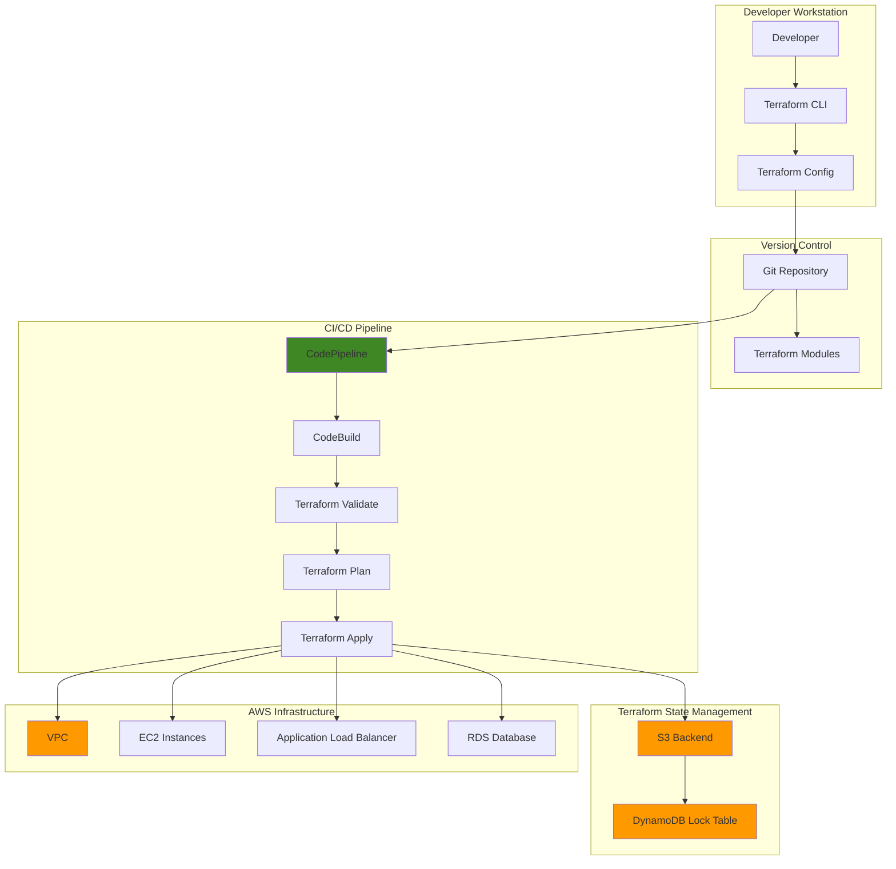

# Infrastructure as Code with Terraform


## Problem

Enterprise development teams struggle with inconsistent infrastructure deployments across environments, leading to configuration drift, manual errors, and time-consuming debugging sessions. Traditional infrastructure management approaches create bottlenecks where infrastructure changes require manual coordination between teams, resulting in delayed deployments and increased operational overhead. Without proper version control and automation, organizations cannot achieve reliable, repeatable infrastructure deployments at scale.

## Solution

Terraform provides a declarative infrastructure as code approach that enables teams to define, version, and manage AWS infrastructure through reusable modules and automated workflows. By implementing Terraform with AWS provider integration, remote state management, and CI/CD pipelines, organizations can achieve consistent infrastructure deployments, reduce manual errors, and accelerate delivery cycles while maintaining proper governance and security controls.

## Architecture Diagram



## Prerequisites

1. AWS account with appropriate permissions for EC2, VPC, S3, DynamoDB, and IAM
2. Terraform CLI v1.0 or later installed
3. AWS CLI v2 installed and configured
4. Basic understanding of infrastructure concepts and AWS services
5. Git installed for version control
6. Estimated cost: $15-25 per day for resources created (can be reduced with t3.micro instances)

> **Note**: This recipe creates billable AWS resources. Ensure you follow the cleanup section to avoid ongoing charges.

## Preparation

```bash
# Set environment variables
export AWS_REGION=$(aws configure get region)
export AWS_ACCOUNT_ID=$(aws sts get-caller-identity \
    --query Account --output text)

# Generate unique suffix for resources
RANDOM_SUFFIX=$(aws secretsmanager get-random-password \
    --exclude-punctuation --exclude-uppercase \
    --password-length 6 --require-each-included-type \
    --output text --query RandomPassword)

# Set project variables
export PROJECT_NAME="terraform-iac-demo"
export BUCKET_NAME="${PROJECT_NAME}-state-${RANDOM_SUFFIX}"
export LOCK_TABLE_NAME="${PROJECT_NAME}-locks"

# Create S3 bucket for Terraform state
aws s3api create-bucket \
    --bucket ${BUCKET_NAME} \
    --create-bucket-configuration LocationConstraint=${AWS_REGION}

# Enable versioning on state bucket
aws s3api put-bucket-versioning \
    --bucket ${BUCKET_NAME} \
    --versioning-configuration Status=Enabled

# Create DynamoDB table for state locking
aws dynamodb create-table \
    --table-name ${LOCK_TABLE_NAME} \
    --attribute-definitions AttributeName=LockID,AttributeType=S \
    --key-schema AttributeName=LockID,KeyType=HASH \
    --provisioned-throughput ReadCapacityUnits=5,WriteCapacityUnits=5 \
    --region ${AWS_REGION}

# Wait for table to be active
aws dynamodb wait table-exists \
    --table-name ${LOCK_TABLE_NAME} \
    --region ${AWS_REGION}

echo "✅ Terraform backend resources created successfully"
```

## Steps

1. **Initialize Terraform Project Structure**:

   Infrastructure as Code requires a well-organized project structure that promotes code reusability, environment separation, and team collaboration. The modular approach we're implementing separates concerns between networking, compute, and database layers, enabling teams to develop and maintain each component independently while ensuring consistent integration patterns.

   ```bash
   # Create project directory structure
   mkdir -p ${PROJECT_NAME}/{modules/{vpc,compute,database},environments/{dev,staging,prod}}
   cd ${PROJECT_NAME}
   
   # Create main Terraform configuration
   cat > main.tf << 'EOF'
   terraform {
     required_version = ">= 1.0"
     required_providers {
       aws = {
         source  = "hashicorp/aws"
         version = "~> 5.0"
       }
     }
     backend "s3" {
       # Backend configuration will be provided during init
     }
   }
   
   provider "aws" {
     region = var.aws_region
     
     default_tags {
       tags = {
         Project     = var.project_name
         Environment = var.environment
         ManagedBy   = "terraform"
       }
     }
   }
   EOF
   
   echo "✅ Project structure created"
   ```

   The project structure now provides a foundation for scalable infrastructure management. The modules directory enables component reusability across environments, while the environments directory maintains configuration isolation. The main.tf file establishes provider requirements and default tagging strategies that ensure consistent resource identification and cost tracking across all AWS resources.

2. **Create Terraform Variables and Configuration**:

   Terraform variables enable parameterization and configuration flexibility, allowing the same infrastructure code to deploy different configurations across environments. Variable types and validation ensure configuration consistency, while defaults provide sensible fallbacks. This approach enables infrastructure versioning and promotes configuration as code principles essential for enterprise deployments.

   ```bash
   # Create variables file
   cat > variables.tf << 'EOF'
   variable "aws_region" {
     description = "AWS region for resources"
     type        = string
     default     = "us-east-1"
   }
   
   variable "project_name" {
     description = "Name of the project"
     type        = string
     default     = "terraform-iac-demo"
   }
   
   variable "environment" {
     description = "Environment name"
     type        = string
     default     = "dev"
   }
   
   variable "vpc_cidr" {
     description = "CIDR block for VPC"
     type        = string
     default     = "10.0.0.0/16"
   }
   
   variable "instance_type" {
     description = "EC2 instance type"
     type        = string
     default     = "t3.micro"
   }
   EOF
   
   # Create outputs file
   cat > outputs.tf << 'EOF'
   output "vpc_id" {
     description = "ID of the VPC"
     value       = module.vpc.vpc_id
   }
   
   output "public_subnet_ids" {
     description = "IDs of public subnets"
     value       = module.vpc.public_subnet_ids
   }
   
   output "web_instance_id" {
     description = "ID of the web server instance"
     value       = module.compute.instance_id
   }
   
   output "alb_dns_name" {
     description = "DNS name of the Application Load Balancer"
     value       = module.compute.alb_dns_name
   }
   EOF
   
   echo "✅ Variables and outputs configured"
   ```

   The variable definitions establish input parameters with type safety and documentation, enabling teams to customize deployments without modifying core infrastructure code. Output values provide essential resource identifiers for integration with other systems, CI/CD pipelines, and dependent infrastructure components. This configuration pattern supports infrastructure composition and enables automated deployment workflows.

3. **Create VPC Module**:

   Amazon VPC provides isolated network environments within AWS, enabling secure multi-tier architectures with granular network controls. This module implements foundational networking components including public subnets across multiple availability zones for high availability, internet connectivity, and security group policies. The modular design allows teams to standardize networking patterns while maintaining flexibility for different application requirements.

   ```bash
   # Create VPC module
   cat > modules/vpc/main.tf << 'EOF'
   # Data source for availability zones
   data "aws_availability_zones" "available" {
     state = "available"
   }
   
   # VPC
   resource "aws_vpc" "main" {
     cidr_block           = var.vpc_cidr
     enable_dns_hostnames = true
     enable_dns_support   = true
   
     tags = {
       Name = "${var.project_name}-vpc"
     }
   }
   
   # Internet Gateway
   resource "aws_internet_gateway" "main" {
     vpc_id = aws_vpc.main.id
   
     tags = {
       Name = "${var.project_name}-igw"
     }
   }
   
   # Public Subnets
   resource "aws_subnet" "public" {
     count  = 2
     vpc_id = aws_vpc.main.id
   
     cidr_block              = cidrsubnet(var.vpc_cidr, 8, count.index)
     availability_zone       = data.aws_availability_zones.available.names[count.index]
     map_public_ip_on_launch = true
   
     tags = {
       Name = "${var.project_name}-public-${count.index + 1}"
       Type = "public"
     }
   }
   
   # Route Table for Public Subnets
   resource "aws_route_table" "public" {
     vpc_id = aws_vpc.main.id
   
     route {
       cidr_block = "0.0.0.0/0"
       gateway_id = aws_internet_gateway.main.id
     }
   
     tags = {
       Name = "${var.project_name}-public-rt"
     }
   }
   
   # Route Table Associations
   resource "aws_route_table_association" "public" {
     count          = length(aws_subnet.public)
     subnet_id      = aws_subnet.public[count.index].id
     route_table_id = aws_route_table.public.id
   }
   
   # Security Group for Web Servers
   resource "aws_security_group" "web" {
     name_prefix = "${var.project_name}-web-"
     vpc_id      = aws_vpc.main.id
   
     ingress {
       from_port   = 80
       to_port     = 80
       protocol    = "tcp"
       cidr_blocks = ["0.0.0.0/0"]
     }
   
     ingress {
       from_port   = 443
       to_port     = 443
       protocol    = "tcp"
       cidr_blocks = ["0.0.0.0/0"]
     }
   
     egress {
       from_port   = 0
       to_port     = 0
       protocol    = "-1"
       cidr_blocks = ["0.0.0.0/0"]
     }
   
     tags = {
       Name = "${var.project_name}-web-sg"
     }
   }
   EOF
   
   # Create VPC module variables
   cat > modules/vpc/variables.tf << 'EOF'
   variable "project_name" {
     description = "Name of the project"
     type        = string
   }
   
   variable "vpc_cidr" {
     description = "CIDR block for VPC"
     type        = string
   }
   EOF
   
   # Create VPC module outputs
   cat > modules/vpc/outputs.tf << 'EOF'
   output "vpc_id" {
     description = "ID of the VPC"
     value       = aws_vpc.main.id
   }
   
   output "public_subnet_ids" {
     description = "IDs of public subnets"
     value       = aws_subnet.public[*].id
   }
   
   output "web_security_group_id" {
     description = "ID of the web security group"
     value       = aws_security_group.web.id
   }
   
   output "internet_gateway_id" {
     description = "ID of the Internet Gateway"
     value       = aws_internet_gateway.main.id
   }
   EOF
   
   echo "✅ VPC module created"
   ```

   The VPC module establishes a secure, scalable network foundation with multi-AZ redundancy and proper security controls. The configuration creates isolated network segments with internet connectivity while implementing security groups that follow the principle of least privilege. This networking foundation supports high-availability applications and provides the secure base layer for all subsequent infrastructure components.

4. **Create Compute Module**:

   EC2 Auto Scaling and Application Load Balancer provide the foundation for resilient, scalable web applications that automatically respond to demand changes. This module implements modern compute patterns including launch templates for consistent instance configuration, target groups for health monitoring, and auto scaling policies that ensure optimal resource utilization while maintaining application availability during traffic fluctuations.

   ```bash
   # Create compute module
   cat > modules/compute/main.tf << 'EOF'
   # Data source for latest Amazon Linux 2 AMI
   data "aws_ami" "amazon_linux" {
     most_recent = true
     owners      = ["amazon"]
   
     filter {
       name   = "name"
       values = ["amzn2-ami-hvm-*-x86_64-gp2"]
     }
   
     filter {
       name   = "virtualization-type"
       values = ["hvm"]
     }
   }
   
   # Launch Template for Web Servers
   resource "aws_launch_template" "web" {
     name_prefix   = "${var.project_name}-web-"
     image_id      = data.aws_ami.amazon_linux.id
     instance_type = var.instance_type
   
     vpc_security_group_ids = [var.security_group_id]
   
     user_data = base64encode(<<-EOF
       #!/bin/bash
       yum update -y
       yum install -y httpd
       systemctl start httpd
       systemctl enable httpd
       echo "<h1>Hello from Terraform!</h1>" > /var/www/html/index.html
       echo "<p>Instance ID: $(curl -s http://169.254.169.254/latest/meta-data/instance-id)</p>" >> /var/www/html/index.html
       EOF
     )
   
     tag_specifications {
       resource_type = "instance"
       tags = {
         Name = "${var.project_name}-web-instance"
       }
     }
   }
   
   # Application Load Balancer
   resource "aws_lb" "web" {
     name               = "${var.project_name}-web-alb"
     internal           = false
     load_balancer_type = "application"
     security_groups    = [var.security_group_id]
     subnets            = var.subnet_ids
   
     enable_deletion_protection = false
   
     tags = {
       Name = "${var.project_name}-web-alb"
     }
   }
   
   # Target Group
   resource "aws_lb_target_group" "web" {
     name     = "${var.project_name}-web-tg"
     port     = 80
     protocol = "HTTP"
     vpc_id   = var.vpc_id
   
     health_check {
       enabled             = true
       healthy_threshold   = 2
       unhealthy_threshold = 2
       timeout             = 5
       interval            = 30
       path                = "/"
       matcher             = "200"
       port                = "traffic-port"
       protocol            = "HTTP"
     }
   }
   
   # ALB Listener
   resource "aws_lb_listener" "web" {
     load_balancer_arn = aws_lb.web.arn
     port              = "80"
     protocol          = "HTTP"
   
     default_action {
       type             = "forward"
       target_group_arn = aws_lb_target_group.web.arn
     }
   }
   
   # Auto Scaling Group
   resource "aws_autoscaling_group" "web" {
     name                = "${var.project_name}-web-asg"
     vpc_zone_identifier = var.subnet_ids
     target_group_arns   = [aws_lb_target_group.web.arn]
     health_check_type   = "ELB"
     min_size            = 2
     max_size            = 4
     desired_capacity    = 2
   
     launch_template {
       id      = aws_launch_template.web.id
       version = "$Latest"
     }
   
     tag {
       key                 = "Name"
       value               = "${var.project_name}-web-asg"
       propagate_at_launch = false
     }
   }
   EOF
   
   # Create compute module variables
   cat > modules/compute/variables.tf << 'EOF'
   variable "project_name" {
     description = "Name of the project"
     type        = string
   }
   
   variable "vpc_id" {
     description = "ID of the VPC"
     type        = string
   }
   
   variable "subnet_ids" {
     description = "List of subnet IDs"
     type        = list(string)
   }
   
   variable "security_group_id" {
     description = "ID of the security group"
     type        = string
   }
   
   variable "instance_type" {
     description = "EC2 instance type"
     type        = string
     default     = "t3.micro"
   }
   EOF
   
   # Create compute module outputs
   cat > modules/compute/outputs.tf << 'EOF'
   output "alb_dns_name" {
     description = "DNS name of the Application Load Balancer"
     value       = aws_lb.web.dns_name
   }
   
   output "alb_arn" {
     description = "ARN of the Application Load Balancer"
     value       = aws_lb.web.arn
   }
   
   output "target_group_arn" {
     description = "ARN of the target group"
     value       = aws_lb_target_group.web.arn
   }
   
   output "instance_id" {
     description = "Latest launch template ID"
     value       = aws_launch_template.web.id
   }
   EOF
   
   echo "✅ Compute module created"
   ```

   The compute module provides enterprise-grade scalability and reliability through Auto Scaling Groups and Application Load Balancer integration. Launch templates ensure consistent instance configuration with automated software installation, while health checks and target groups enable rapid failure detection and recovery. This architecture supports zero-downtime deployments and provides the elastic compute capacity needed for production workloads.

5. **Create Main Configuration and Module References**:

   Module composition enables infrastructure reusability and dependency management through explicit input/output relationships. This approach allows teams to build complex architectures from standardized components while maintaining clear separation of concerns. Module dependencies ensure proper resource creation order and enable Terraform to build comprehensive dependency graphs for reliable deployment and destruction operations.

   ```bash
   # Update main.tf to include module references
   cat >> main.tf << 'EOF'
   
   # VPC Module
   module "vpc" {
     source = "./modules/vpc"
   
     project_name = var.project_name
     vpc_cidr     = var.vpc_cidr
   }
   
   # Compute Module
   module "compute" {
     source = "./modules/compute"
   
     project_name      = var.project_name
     vpc_id            = module.vpc.vpc_id
     subnet_ids        = module.vpc.public_subnet_ids
     security_group_id = module.vpc.web_security_group_id
     instance_type     = var.instance_type
   }
   EOF
   
   echo "✅ Main configuration updated with module references"
   ```

   The module composition establishes explicit dependencies between networking and compute layers, ensuring resources are created in the proper order. Terraform automatically builds a dependency graph from these module relationships, enabling parallel resource creation where possible while respecting dependencies. This modular architecture supports incremental infrastructure changes and enables teams to modify individual components without affecting the entire system.

6. **Initialize Terraform with Remote State**:

   Remote state management is essential for team collaboration and production deployments, providing centralized state storage with locking mechanisms to prevent concurrent modifications. S3 provides durable, versioned storage for state files, while DynamoDB enables distributed locking to ensure only one team member can modify infrastructure at a time. This configuration enables safe, coordinated infrastructure changes across distributed teams.

   ```bash
   # Initialize Terraform with backend configuration
   terraform init \
     -backend-config="bucket=${BUCKET_NAME}" \
     -backend-config="key=terraform.tfstate" \
     -backend-config="region=${AWS_REGION}" \
     -backend-config="dynamodb_table=${LOCK_TABLE_NAME}" \
     -backend-config="encrypt=true"
   
   # Validate configuration
   terraform validate
   
   echo "✅ Terraform initialized with remote state backend"
   ```

   Terraform initialization downloads required provider plugins and configures the remote backend for state management. The validation step ensures all configuration syntax is correct and provider requirements are met before attempting deployments. This initialization process establishes the foundation for collaborative infrastructure management and enables consistent deployments across different environments and team members.

7. **Create Environment-Specific Configuration**:

   Environment-specific configuration files enable the same infrastructure code to deploy different resource configurations for development, staging, and production environments. This approach reduces configuration drift by maintaining consistent infrastructure patterns while allowing environment-specific optimizations like instance sizes, network ranges, and scaling parameters. The separation of configuration from code enables controlled promotion workflows and environment parity.

   ```bash
   # Create development environment configuration
   cat > environments/dev/terraform.tfvars << EOF
   aws_region    = "${AWS_REGION}"
   project_name  = "terraform-iac-demo"
   environment   = "dev"
   vpc_cidr      = "10.0.0.0/16"
   instance_type = "t3.micro"
   EOF
   
   # Create staging environment configuration
   cat > environments/staging/terraform.tfvars << EOF
   aws_region    = "${AWS_REGION}"
   project_name  = "terraform-iac-demo"
   environment   = "staging"
   vpc_cidr      = "10.1.0.0/16"
   instance_type = "t3.small"
   EOF
   
   echo "✅ Environment-specific configurations created"
   ```

   The environment configurations demonstrate infrastructure parameterization patterns that support progressive deployment strategies. Development environments use cost-optimized instance types and smaller network ranges, while staging mirrors production configurations for accurate testing. This configuration separation enables automated promotion workflows where infrastructure changes are validated in lower environments before production deployment.

8. **Plan and Apply Infrastructure**:

   Terraform's plan and apply workflow provides infrastructure change preview and controlled deployment capabilities essential for production environments. The plan phase shows exactly what resources will be created, modified, or destroyed, enabling team review and approval processes. The apply phase executes changes in dependency order, providing detailed progress reporting and rollback capabilities if failures occur.

   ```bash
   # Generate and review execution plan
   terraform plan \
     -var-file="environments/dev/terraform.tfvars" \
     -out=tfplan
   
   # Apply the configuration
   terraform apply tfplan
   
   # Get outputs
   ALB_DNS_NAME=$(terraform output -raw alb_dns_name)
   VPC_ID=$(terraform output -raw vpc_id)
   
   echo "✅ Infrastructure deployed successfully"
   echo "Load Balancer DNS: ${ALB_DNS_NAME}"
   echo "VPC ID: ${VPC_ID}"
   ```

   The deployment process demonstrates Terraform's declarative approach where the plan file ensures consistent execution between plan and apply phases. Output values provide essential integration points for connecting this infrastructure to other systems, CI/CD pipelines, and monitoring tools. This workflow pattern supports infrastructure automation while maintaining human oversight for critical production changes.

9. **Create Terraform Workflow Scripts**:

   Automation scripts standardize common Terraform operations across team members and environments, reducing human error and ensuring consistent deployment processes. These wrapper scripts provide simplified interfaces for complex Terraform workflows while maintaining safety checks and proper error handling. This approach enables teams to adopt infrastructure as code practices without requiring deep Terraform expertise from all team members.

   ```bash
   # Create deployment script
   cat > deploy.sh << 'EOF'
   #!/bin/bash
   set -e
   
   ENVIRONMENT=${1:-dev}
   ACTION=${2:-plan}
   
   echo "Running Terraform ${ACTION} for ${ENVIRONMENT} environment..."
   
   if [ "$ACTION" = "plan" ]; then
     terraform plan -var-file="environments/${ENVIRONMENT}/terraform.tfvars"
   elif [ "$ACTION" = "apply" ]; then
     terraform plan -var-file="environments/${ENVIRONMENT}/terraform.tfvars" -out=tfplan
     terraform apply tfplan
   elif [ "$ACTION" = "destroy" ]; then
     terraform destroy -var-file="environments/${ENVIRONMENT}/terraform.tfvars"
   else
     echo "Unknown action: ${ACTION}"
     exit 1
   fi
   EOF
   
   chmod +x deploy.sh
   
   # Create state management script
   cat > state.sh << 'EOF'
   #!/bin/bash
   set -e
   
   ACTION=${1:-list}
   
   case $ACTION in
     "list")
       terraform state list
       ;;
     "show")
       terraform state show $2
       ;;
     "refresh")
       terraform refresh
       ;;
     *)
       echo "Usage: ./state.sh [list|show|refresh] [resource_name]"
       exit 1
       ;;
   esac
   EOF
   
   chmod +x state.sh
   
   echo "✅ Workflow scripts created"
   ```

   The workflow scripts provide team-friendly interfaces that abstract Terraform complexity while maintaining operational safety through error handling and environment validation. These scripts enable consistent deployment patterns across different environments and team members, supporting automation while preserving the ability for manual oversight when needed. This scripting approach facilitates Terraform adoption in organizations with diverse technical skill levels.

10. **Set Up CI/CD Pipeline Configuration**:

    CI/CD integration transforms infrastructure management from manual operations to automated, repeatable processes that reduce errors and accelerate delivery cycles. AWS CodeBuild provides managed build environments that execute Terraform operations with proper credential management and audit logging. This automation enables infrastructure changes to follow the same quality gates and approval processes as application code.

    ```bash
    # Create buildspec for CodeBuild
    cat > buildspec.yml << 'EOF'
    version: 0.2
    
    phases:
      install:
        runtime-versions:
          python: 3.9
        commands:
          - echo "Installing Terraform..."
          - curl -O https://releases.hashicorp.com/terraform/1.6.0/terraform_1.6.0_linux_amd64.zip
          - unzip terraform_1.6.0_linux_amd64.zip
          - mv terraform /usr/local/bin/
          - terraform --version
      
      pre_build:
        commands:
          - echo "Initializing Terraform..."
          - terraform init
          - terraform fmt -check=true
          - terraform validate
      
      build:
        commands:
          - echo "Planning Terraform deployment..."
          - terraform plan -var-file="environments/dev/terraform.tfvars"
          - |
            if [ "$CODEBUILD_WEBHOOK_HEAD_REF" = "refs/heads/main" ]; then
              echo "Applying Terraform deployment..."
              terraform apply -var-file="environments/dev/terraform.tfvars" -auto-approve
            else
              echo "Skipping apply - not on main branch"
            fi
      
      post_build:
        commands:
          - echo "Terraform deployment completed"
          - terraform output
    
    artifacts:
      files:
        - '**/*'
    EOF
    
    # Create .gitignore
    cat > .gitignore << 'EOF'
    # Terraform
    .terraform/
    .terraform.lock.hcl
    *.tfstate
    *.tfstate.*
    *.tfvars.backup
    *.tfplan
    crash.log
    crash.*.log
    
    # IDE
    .vscode/
    .idea/
    
    # OS
    .DS_Store
    Thumbs.db
    EOF
    
    echo "✅ CI/CD pipeline configuration created"
    ```

    The CI/CD configuration establishes automated infrastructure deployment pipelines that enforce code quality, security scanning, and controlled releases. The buildspec defines multi-phase deployment processes with proper validation gates, while the gitignore ensures sensitive files remain secure. This automation foundation enables teams to implement GitOps workflows where infrastructure changes are deployed through code commits and pull request approvals.

## Validation & Testing

1. **Verify Infrastructure Resources**:

   ```bash
   # Check Terraform state
   terraform state list
   
   # Verify VPC creation
   aws ec2 describe-vpcs \
     --filters "Name=tag:Name,Values=terraform-iac-demo-vpc" \
     --query 'Vpcs[0].{VpcId:VpcId,State:State,CidrBlock:CidrBlock}'
   
   # Check Auto Scaling Group
   aws autoscaling describe-auto-scaling-groups \
     --auto-scaling-group-names terraform-iac-demo-web-asg \
     --query 'AutoScalingGroups[0].{Name:AutoScalingGroupName,DesiredCapacity:DesiredCapacity,Instances:length(Instances)}'
   ```

2. **Test Application Load Balancer**:

   ```bash
   # Get ALB DNS name
   ALB_DNS=$(terraform output -raw alb_dns_name)
   
   # Test web application
   curl -s http://${ALB_DNS} | grep "Hello from Terraform"
   
   # Test multiple requests to verify load balancing
   for i in {1..5}; do
     curl -s http://${ALB_DNS} | grep "Instance ID"
   done
   ```

   Expected output: HTML content with "Hello from Terraform!" and different instance IDs

3. **Validate State Management**:

   ```bash
   # Check state file in S3
   aws s3 ls s3://${BUCKET_NAME}/ --recursive
   
   # Verify state locking
   aws dynamodb scan \
     --table-name ${LOCK_TABLE_NAME} \
     --query 'Items[*].LockID.S'
   
   # Test state refresh
   terraform refresh \
     -var-file="environments/dev/terraform.tfvars"
   ```

4. **Test Module Reusability**:

   ```bash
   # Plan staging environment
   terraform plan \
     -var-file="environments/staging/terraform.tfvars"
   
   # This should show different CIDR blocks and instance types
   ```

## Cleanup

1. **Destroy Terraform-managed Resources**:

   ```bash
   # Destroy infrastructure
   terraform destroy \
     -var-file="environments/dev/terraform.tfvars" \
     -auto-approve
   
   echo "✅ Infrastructure destroyed"
   ```

2. **Remove Terraform State Resources**:

   ```bash
   # Empty and delete S3 bucket
   aws s3 rm s3://${BUCKET_NAME} --recursive
   aws s3api delete-bucket --bucket ${BUCKET_NAME}
   
   # Delete DynamoDB table
   aws dynamodb delete-table \
     --table-name ${LOCK_TABLE_NAME} \
     --region ${AWS_REGION}
   
   echo "✅ State backend resources removed"
   ```

3. **Clean Up Local Files**:

   ```bash
   # Remove project directory
   cd ..
   rm -rf ${PROJECT_NAME}
   
   # Clear environment variables
   unset AWS_REGION AWS_ACCOUNT_ID PROJECT_NAME BUCKET_NAME LOCK_TABLE_NAME
   
   echo "✅ Local cleanup completed"
   ```

## Discussion

This implementation demonstrates enterprise-grade infrastructure as code practices using Terraform and AWS. The modular approach separates concerns between networking (VPC), compute (EC2/ALB), and configuration management, enabling teams to reuse components across different environments while maintaining consistency.

The remote state backend using S3 and DynamoDB provides critical collaboration capabilities, ensuring multiple team members can work on the same infrastructure without conflicts. State locking prevents concurrent modifications, while versioning in S3 enables rollback capabilities. This approach is essential for production deployments where infrastructure changes must be coordinated across teams.

The CI/CD integration with CodeBuild demonstrates how infrastructure changes can be validated and deployed automatically, reducing manual errors and ensuring consistent deployment processes. By implementing terraform validate, plan, and apply in automated pipelines, organizations can enforce governance policies and maintain audit trails for all infrastructure changes.

Environment-specific configurations using tfvars files enable the same codebase to deploy different resource configurations for development, staging, and production environments. This approach reduces configuration drift and ensures consistency across the deployment pipeline while allowing for environment-specific optimizations like instance sizes and network configurations.

> **Warning**: Always review Terraform plans carefully before applying changes to production environments, as infrastructure modifications can impact running applications and data availability.

> **Tip**: Use terraform fmt and terraform validate as pre-commit hooks to maintain code quality and catch syntax errors before they reach your CI/CD pipeline.

## Challenge

Extend this Terraform implementation with these advanced features:

1. **Implement Remote Module Registry** - Create a private Terraform module registry using S3 and publish reusable modules with semantic versioning for organization-wide sharing
2. **Add Compliance Scanning** - Integrate tools like Checkov or TFSec into the CI/CD pipeline to automatically scan for security and compliance violations in Terraform configurations
3. **Implement Multi-Environment State Management** - Create separate state files for each environment with workspace-based deployments and automated promotion workflows
4. **Add Monitoring and Alerting** - Extend the compute module to include CloudWatch alarms, SNS notifications, and automated scaling policies based on application metrics
5. **Implement Blue-Green Deployment** - Create Terraform configurations that support blue-green deployments with ALB target group switching and zero-downtime updates

## Infrastructure Code

*Infrastructure code will be generated after recipe approval.*