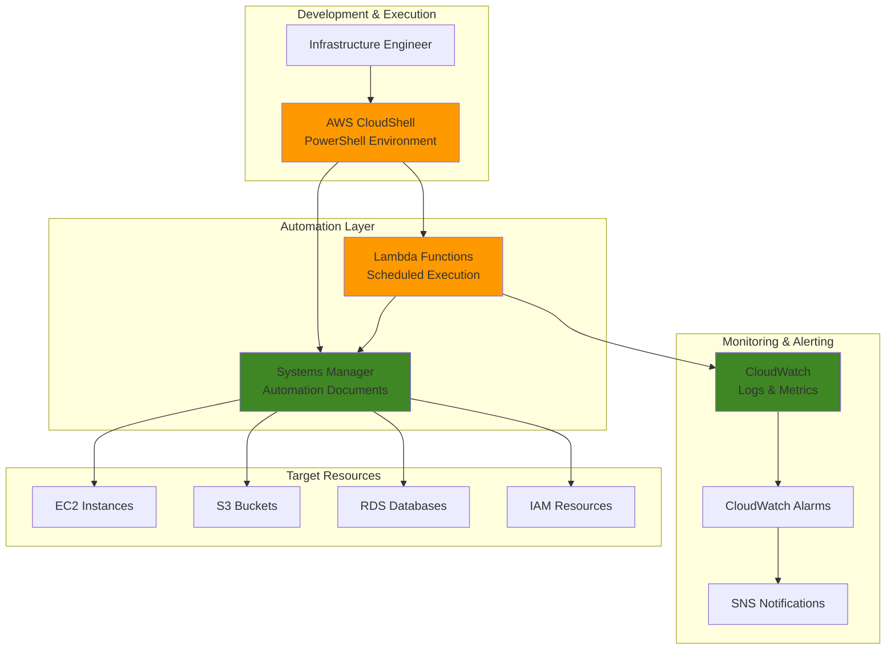

# Infrastructure Automation with CloudShell PowerShell

## Problem

Organizations struggle with manual infrastructure management tasks that consume valuable engineering time and increase the risk of human error. IT teams need to perform routine maintenance operations like instance health checks, resource cleanup, and compliance reporting across multiple AWS accounts and regions, but lack a centralized automation solution that doesn't require local development environment setup or complex deployment pipelines.

## Solution

Build serverless automation workflows using AWS CloudShell PowerShell scripts integrated with Systems Manager Automation, Lambda functions, and CloudWatch monitoring. This approach leverages CloudShell's pre-configured PowerShell environment to create, test, and deploy infrastructure automation scripts that can run on schedules, respond to events, and provide centralized monitoring without requiring local tooling or infrastructure provisioning.

## Architecture Diagram



## Prerequisites

1. AWS account with CloudShell access and permissions for EC2, Systems Manager, Lambda, CloudWatch, and IAM
2. Basic PowerShell knowledge and familiarity with AWS CLI
3. Understanding of AWS automation concepts and JSON/YAML configuration
4. Existing EC2 instances or other AWS resources for testing automation scripts
5. Estimated cost: $5-15 per month for Lambda executions, CloudWatch logs, and SNS notifications

> **Note**: CloudShell provides 1GB of persistent storage per region at no additional cost, making it ideal for storing automation scripts and configurations.

## Preparation

```bash
# Set environment variables
export AWS_REGION=$(aws configure get region)
export AWS_ACCOUNT_ID=$(aws sts get-caller-identity \
    --query Account --output text)

# Generate unique identifiers for resources
RANDOM_SUFFIX=$(aws secretsmanager get-random-password \
    --exclude-punctuation --exclude-uppercase \
    --password-length 6 --require-each-included-type \
    --output text --query RandomPassword)

# Create IAM role for automation
aws iam create-role \
    --role-name InfraAutomationRole-${RANDOM_SUFFIX} \
    --assume-role-policy-document '{
        "Version": "2012-10-17",
        "Statement": [
            {
                "Effect": "Allow",
                "Principal": {
                    "Service": ["lambda.amazonaws.com", "ssm.amazonaws.com"]
                },
                "Action": "sts:AssumeRole"
            }
        ]
    }'

# Attach necessary policies to the role
aws iam attach-role-policy \
    --role-name InfraAutomationRole-${RANDOM_SUFFIX} \
    --policy-arn arn:aws:iam::aws:policy/service-role/AWSLambdaBasicExecutionRole

aws iam attach-role-policy \
    --role-name InfraAutomationRole-${RANDOM_SUFFIX} \
    --policy-arn arn:aws:iam::aws:policy/AmazonSSMFullAccess

aws iam attach-role-policy \
    --role-name InfraAutomationRole-${RANDOM_SUFFIX} \
    --policy-arn arn:aws:iam::aws:policy/CloudWatchFullAccess

# Store role ARN for later use
AUTOMATION_ROLE_ARN=$(aws iam get-role \
    --role-name InfraAutomationRole-${RANDOM_SUFFIX} \
    --query Role.Arn --output text)

echo "✅ AWS environment configured with role: ${AUTOMATION_ROLE_ARN}"
```

## Steps

1. **Launch CloudShell and Initialize PowerShell Environment**:

   AWS CloudShell provides a browser-based shell environment with PowerShell and AWS Tools pre-installed, eliminating the need for local development environment setup. This serverless shell environment includes persistent storage and automatic AWS credential management, making it perfect for infrastructure automation development.

   ```bash
   # Open CloudShell from AWS Console (https://console.aws.amazon.com/cloudshell)
   # Once CloudShell is open, start PowerShell
   pwsh
   
   # Verify AWS Tools for PowerShell are available
   Get-Module -Name AWS.Tools.* -ListAvailable | Select-Object Name, Version
   
   # Import required AWS modules
   Import-Module AWS.Tools.EC2
   Import-Module AWS.Tools.SystemsManager
   Import-Module AWS.Tools.Lambda
   Import-Module AWS.Tools.CloudWatch
   
   echo "✅ PowerShell environment initialized with AWS modules"
   ```

   CloudShell automatically inherits your console credentials and provides immediate access to AWS APIs without additional authentication setup. The persistent storage ensures your scripts and configurations remain available across sessions.

2. **Create PowerShell Infrastructure Health Check Script**:

   PowerShell's object-oriented nature and AWS Tools integration enables sophisticated infrastructure analysis and reporting. This script demonstrates automated resource discovery, health assessment, and structured reporting that can be easily extended for custom business requirements.

   ```powershell
   # Create PowerShell script for infrastructure health checks
   cat > ~/infrastructure-health-check.ps1 << 'EOF'
   param(
       [string]$Region = (Get-DefaultAWSRegion).Region,
       [string]$LogGroup = "/aws/automation/infrastructure-health"
   )
   
   # Function to write structured logs
   function Write-AutomationLog {
       param([string]$Message, [string]$Level = "INFO")
       $timestamp = Get-Date -Format "yyyy-MM-ddTHH:mm:ss.fffZ"
       $logEntry = @{
           timestamp = $timestamp
           level = $Level
           message = $Message
           region = $Region
       } | ConvertTo-Json -Compress
       
       Write-Host $logEntry
       # Send to CloudWatch Logs
       Write-CWLLogEvent -LogGroupName $LogGroup -LogStreamName "health-check-$(Get-Date -Format 'yyyy-MM-dd')" -LogEvent @{
           Message = $logEntry
           Timestamp = [DateTimeOffset]::UtcNow
       }
   }
   
   # Check EC2 instance health
   function Test-EC2Health {
       Write-AutomationLog "Starting EC2 health assessment"
       $instances = Get-EC2Instance -Region $Region
       $healthReport = @()
       
       foreach ($reservation in $instances) {
           foreach ($instance in $reservation.Instances) {
               $healthStatus = @{
                   InstanceId = $instance.InstanceId
                   State = $instance.State.Name
                   Type = $instance.InstanceType
                   LaunchTime = $instance.LaunchTime
                   PublicIP = $instance.PublicIpAddress
                   PrivateIP = $instance.PrivateIpAddress
                   SecurityGroups = ($instance.SecurityGroups | ForEach-Object { $_.GroupName }) -join ","
               }
               $healthReport += $healthStatus
           }
       }
       
       Write-AutomationLog "Found $($healthReport.Count) EC2 instances"
       return $healthReport
   }
   
   # Check S3 bucket compliance
   function Test-S3Compliance {
       Write-AutomationLog "Starting S3 compliance assessment"
       $buckets = Get-S3Bucket -Region $Region
       $complianceReport = @()
       
       foreach ($bucket in $buckets) {
           $encryption = Get-S3BucketEncryption -BucketName $bucket.BucketName -ErrorAction SilentlyContinue
           $versioning = Get-S3BucketVersioning -BucketName $bucket.BucketName
           $logging = Get-S3BucketLogging -BucketName $bucket.BucketName
           
           $complianceStatus = @{
               BucketName = $bucket.BucketName
               CreationDate = $bucket.CreationDate
               EncryptionEnabled = $null -ne $encryption
               VersioningEnabled = $versioning.Status -eq "Enabled"
               LoggingEnabled = $null -ne $logging.LoggingEnabled
           }
           $complianceReport += $complianceStatus
       }
       
       Write-AutomationLog "Assessed $($complianceReport.Count) S3 buckets"
       return $complianceReport
   }
   
   # Main execution
   try {
       Write-AutomationLog "Infrastructure health check started"
       
       $ec2Health = Test-EC2Health
       $s3Compliance = Test-S3Compliance
       
       $report = @{
           Timestamp = Get-Date -Format "yyyy-MM-ddTHH:mm:ss.fffZ"
           Region = $Region
           EC2Health = $ec2Health
           S3Compliance = $s3Compliance
           Summary = @{
               EC2InstanceCount = $ec2Health.Count
               S3BucketCount = $s3Compliance.Count
               HealthyInstances = ($ec2Health | Where-Object { $_.State -eq "running" }).Count
               CompliantBuckets = ($s3Compliance | Where-Object { $_.EncryptionEnabled -and $_.VersioningEnabled }).Count
           }
       }
       
       # Save report to file
       $reportJson = $report | ConvertTo-Json -Depth 10
       $reportPath = "~/health-report-$(Get-Date -Format 'yyyy-MM-dd-HHmmss').json"
       $reportJson | Out-File -FilePath $reportPath
       
       Write-AutomationLog "Health check completed. Report saved to: $reportPath"
       Write-AutomationLog ($report.Summary | ConvertTo-Json)
       
   } catch {
       Write-AutomationLog "Health check failed: $($_.Exception.Message)" "ERROR"
       throw
   }
EOF
   
   echo "✅ PowerShell health check script created"
   ```

   This script demonstrates PowerShell's strength in handling complex AWS API responses and creating structured reports. The modular design allows easy extension for additional resource types and compliance checks.

3. **Create Systems Manager Automation Document**:

   Systems Manager Automation provides enterprise-grade workflow orchestration with built-in error handling, concurrency control, and approval workflows. Creating custom automation documents enables standardized, repeatable infrastructure operations with comprehensive audit trails.

   ```bash
   # Create automation document for PowerShell script execution
   cat > ~/automation-document.json << EOF
   {
       "schemaVersion": "0.3",
       "description": "Infrastructure Health Check Automation",
       "assumeRole": "${AUTOMATION_ROLE_ARN}",
       "parameters": {
           "Region": {
               "type": "String",
               "description": "AWS Region for health check",
               "default": "${AWS_REGION}"
           },
           "LogGroupName": {
               "type": "String",
               "description": "CloudWatch Log Group for automation logs",
               "default": "/aws/automation/infrastructure-health"
           }
       },
       "mainSteps": [
           {
               "name": "CreateLogGroup",
               "action": "aws:executeAwsApi",
               "inputs": {
                   "Service": "logs",
                   "Api": "CreateLogGroup",
                   "logGroupName": "{{ LogGroupName }}"
               },
               "onFailure": "Continue"
           },
           {
               "name": "ExecuteHealthCheck",
               "action": "aws:executeScript",
               "inputs": {
                   "Runtime": "PowerShell Core 6.0",
                   "Script": "$(cat ~/infrastructure-health-check.ps1)",
                   "InputPayload": {
                       "Region": "{{ Region }}",
                       "LogGroup": "{{ LogGroupName }}"
                   }
               }
           }
       ],
       "outputs": [
           "ExecuteHealthCheck.Payload"
       ]
   }
EOF
   
   # Create the automation document
   aws ssm create-document \
       --name "InfrastructureHealthCheck-${RANDOM_SUFFIX}" \
       --document-type "Automation" \
       --document-format "JSON" \
       --content file://~/automation-document.json
   
   echo "✅ Systems Manager automation document created"
   ```

   The automation document integrates PowerShell scripts with Systems Manager's execution framework, providing enterprise features like role-based execution, parameter validation, and output capture that aren't available with standalone scripts.

4. **Create Lambda Function for Scheduled Execution**:

   Lambda provides serverless execution for automation workflows with automatic scaling, built-in monitoring, and event-driven triggers. This approach eliminates infrastructure management while providing reliable, cost-effective scheduled operations that can respond to CloudWatch events or API Gateway requests.

   ```bash
   # Create Lambda function code for automation orchestration
   cat > ~/lambda-automation.py << 'EOF'
   import json
   import boto3
   import os
   from datetime import datetime
   
   def lambda_handler(event, context):
       """
       Lambda function to orchestrate infrastructure automation
       """
       ssm = boto3.client('ssm')
       cloudwatch = boto3.client('cloudwatch')
       
       automation_document = os.environ['AUTOMATION_DOCUMENT_NAME']
       region = os.environ.get('AWS_REGION', 'us-east-1')
       
       try:
           # Execute automation document
           response = ssm.start_automation_execution(
               DocumentName=automation_document,
               Parameters={
                   'Region': [region],
                   'LogGroupName': ['/aws/automation/infrastructure-health']
               }
           )
           
           execution_id = response['AutomationExecutionId']
           
           # Send custom metric to CloudWatch
           cloudwatch.put_metric_data(
               Namespace='Infrastructure/Automation',
               MetricData=[
                   {
                       'MetricName': 'AutomationExecutions',
                       'Value': 1,
                       'Unit': 'Count',
                       'Dimensions': [
                           {
                               'Name': 'DocumentName',
                               'Value': automation_document
                           }
                       ]
                   }
               ]
           )
           
           return {
               'statusCode': 200,
               'body': json.dumps({
                   'message': 'Automation started successfully',
                   'executionId': execution_id,
                   'timestamp': datetime.utcnow().isoformat()
               })
           }
           
       except Exception as e:
           # Send error metric
           cloudwatch.put_metric_data(
               Namespace='Infrastructure/Automation',
               MetricData=[
                   {
                       'MetricName': 'AutomationErrors',
                       'Value': 1,
                       'Unit': 'Count'
                   }
               ]
           )
           
           return {
               'statusCode': 500,
               'body': json.dumps({
                   'error': str(e),
                   'timestamp': datetime.utcnow().isoformat()
               })
           }
EOF
   
   # Package and deploy Lambda function
   zip lambda-automation.zip lambda-automation.py
   
   aws lambda create-function \
       --function-name "InfrastructureAutomation-${RANDOM_SUFFIX}" \
       --runtime python3.9 \
       --role "${AUTOMATION_ROLE_ARN}" \
       --handler lambda-automation.lambda_handler \
       --zip-file fileb://lambda-automation.zip \
       --timeout 300 \
       --memory-size 256 \
       --environment Variables="{AUTOMATION_DOCUMENT_NAME=InfrastructureHealthCheck-${RANDOM_SUFFIX}}"
   
   echo "✅ Lambda function deployed for automation orchestration"
   ```

   The Lambda function provides reliable orchestration of Systems Manager automations with built-in error handling and CloudWatch metrics integration. This serverless approach ensures automations run consistently without infrastructure management overhead.

5. **Configure EventBridge Scheduled Events**:

   EventBridge provides cron-based scheduling with enterprise features like multiple targets, input transformation, and failure handling. This scheduling approach ensures automations run reliably according to business requirements while providing visibility into execution history and performance metrics.

   ```bash
   # Create EventBridge rule for scheduled automation
   aws events put-rule \
       --name "InfrastructureHealthSchedule-${RANDOM_SUFFIX}" \
       --schedule-expression "cron(0 6 * * ? *)" \
       --description "Daily infrastructure health check at 6 AM UTC" \
       --state ENABLED
   
   # Get Lambda function ARN
   LAMBDA_ARN=$(aws lambda get-function \
       --function-name "InfrastructureAutomation-${RANDOM_SUFFIX}" \
       --query Configuration.FunctionArn --output text)
   
   # Add Lambda as target for the rule
   aws events put-targets \
       --rule "InfrastructureHealthSchedule-${RANDOM_SUFFIX}" \
       --targets "Id"="1","Arn"="${LAMBDA_ARN}"
   
   # Grant EventBridge permission to invoke Lambda
   aws lambda add-permission \
       --function-name "InfrastructureAutomation-${RANDOM_SUFFIX}" \
       --statement-id "EventBridgeInvoke-${RANDOM_SUFFIX}" \
       --action lambda:InvokeFunction \
       --principal events.amazonaws.com \
       --source-arn "arn:aws:events:${AWS_REGION}:${AWS_ACCOUNT_ID}:rule/InfrastructureHealthSchedule-${RANDOM_SUFFIX}"
   
   echo "✅ Scheduled automation configured for daily execution"
   ```

   EventBridge scheduling provides enterprise-grade reliability with automatic retry capabilities and detailed execution logging. The cron expression format allows flexible scheduling that can accommodate complex business requirements.

6. **Create CloudWatch Monitoring and Alerting**:

   CloudWatch provides comprehensive monitoring for automation workflows with custom metrics, log aggregation, and intelligent alerting. Setting up proper monitoring ensures operational visibility and enables proactive response to automation failures or performance issues.

   ```bash
   # Create SNS topic for notifications
   aws sns create-topic --name automation-alerts
   
   # Create CloudWatch alarm for automation failures
   aws cloudwatch put-metric-alarm \
       --alarm-name "InfrastructureAutomationErrors-${RANDOM_SUFFIX}" \
       --alarm-description "Alert on infrastructure automation errors" \
       --metric-name AutomationErrors \
       --namespace Infrastructure/Automation \
       --statistic Sum \
       --period 300 \
       --threshold 1 \
       --comparison-operator GreaterThanOrEqualToThreshold \
       --evaluation-periods 1 \
       --alarm-actions "arn:aws:sns:${AWS_REGION}:${AWS_ACCOUNT_ID}:automation-alerts"
   
   # Create CloudWatch dashboard for automation monitoring
   cat > ~/dashboard-config.json << EOF
   {
       "widgets": [
           {
               "type": "metric",
               "x": 0,
               "y": 0,
               "width": 12,
               "height": 6,
               "properties": {
                   "metrics": [
                       ["Infrastructure/Automation", "AutomationExecutions"],
                       [".", "AutomationErrors"]
                   ],
                   "period": 300,
                   "stat": "Sum",
                   "region": "${AWS_REGION}",
                   "title": "Infrastructure Automation Metrics"
               }
           },
           {
               "type": "log",
               "x": 0,
               "y": 6,
               "width": 24,
               "height": 6,
               "properties": {
                   "query": "SOURCE '/aws/automation/infrastructure-health'\n| fields @timestamp, level, message\n| sort @timestamp desc\n| limit 100",
                   "region": "${AWS_REGION}",
                   "title": "Automation Logs"
               }
           }
       ]
   }
EOF
   
   aws cloudwatch put-dashboard \
       --dashboard-name "InfrastructureAutomation-${RANDOM_SUFFIX}" \
       --dashboard-body file://~/dashboard-config.json
   
   echo "✅ CloudWatch monitoring and alerting configured"
   ```

   The CloudWatch dashboard provides centralized visibility into automation performance, execution frequency, and error rates. This monitoring foundation enables data-driven optimization of automation workflows and proactive issue resolution.

7. **Test Automation Workflow End-to-End**:

   Comprehensive testing validates the entire automation pipeline and ensures reliable operation in production environments. This testing approach verifies integration between all components while providing confidence in the automation's ability to handle various scenarios and error conditions.

   ```bash
   # Test automation execution manually
   echo "Testing automation workflow..."
   
   # Execute automation document directly
   EXECUTION_ID=$(aws ssm start-automation-execution \
       --document-name "InfrastructureHealthCheck-${RANDOM_SUFFIX}" \
       --parameters "Region=${AWS_REGION},LogGroupName=/aws/automation/infrastructure-health" \
       --query AutomationExecutionId --output text)
   
   echo "✅ Automation execution started: ${EXECUTION_ID}"
   
   # Wait for execution to complete
   sleep 30
   
   # Check execution status
   aws ssm describe-automation-executions \
       --filters "Key=ExecutionId,Values=${EXECUTION_ID}" \
       --query "AutomationExecutions[0].[AutomationExecutionStatus,ExecutionStartTime,ExecutionEndTime]" \
       --output table
   
   # Test Lambda function invocation
   aws lambda invoke \
       --function-name "InfrastructureAutomation-${RANDOM_SUFFIX}" \
       --payload '{}' \
       response.json
   
   echo "Lambda response:"
   cat response.json
   
   echo "✅ End-to-end automation workflow tested successfully"
   ```

   Manual testing validates the complete automation pipeline and provides immediate feedback on configuration issues. This testing approach ensures all components work together correctly before relying on scheduled execution.

## Validation & Testing

1. **Verify Automation Document Execution**:

   ```bash
   # Check automation execution history
   aws ssm describe-automation-executions \
       --filters "Key=DocumentNamePrefix,Values=InfrastructureHealthCheck-${RANDOM_SUFFIX}" \
       --query "AutomationExecutions[*].[ExecutionId,AutomationExecutionStatus,ExecutionStartTime]" \
       --output table
   ```

   Expected output: Table showing automation executions with "Success" status and recent timestamps.

2. **Verify CloudWatch Logs Integration**:

   ```bash
   # Check CloudWatch logs for automation output
   aws logs describe-log-streams \
       --log-group-name "/aws/automation/infrastructure-health" \
       --order-by LastEventTime \
       --descending \
       --max-items 5
   
   # Get recent log events
   LATEST_STREAM=$(aws logs describe-log-streams \
       --log-group-name "/aws/automation/infrastructure-health" \
       --order-by LastEventTime \
       --descending \
       --max-items 1 \
       --query "logStreams[0].logStreamName" --output text)
   
   aws logs get-log-events \
       --log-group-name "/aws/automation/infrastructure-health" \
       --log-stream-name "${LATEST_STREAM}" \
       --limit 10
   ```

   Expected output: JSON log entries showing infrastructure health check results with timestamps and structured data.

3. **Test Lambda Function Monitoring**:

   ```bash
   # Check Lambda function metrics
   aws cloudwatch get-metric-statistics \
       --namespace Infrastructure/Automation \
       --metric-name AutomationExecutions \
       --start-time $(date -u -d '1 hour ago' +%Y-%m-%dT%H:%M:%S) \
       --end-time $(date -u +%Y-%m-%dT%H:%M:%S) \
       --period 3600 \
       --statistics Sum
   ```

   Expected output: Metric data showing successful automation executions with Sum values > 0.

## Cleanup

1. **Remove EventBridge Scheduled Rule**:

   ```bash
   # Remove targets from EventBridge rule
   aws events remove-targets \
       --rule "InfrastructureHealthSchedule-${RANDOM_SUFFIX}" \
       --ids "1"
   
   # Delete EventBridge rule
   aws events delete-rule \
       --name "InfrastructureHealthSchedule-${RANDOM_SUFFIX}"
   
   echo "✅ EventBridge scheduled rule removed"
   ```

2. **Delete Lambda Function and Permissions**:

   ```bash
   # Delete Lambda function
   aws lambda delete-function \
       --function-name "InfrastructureAutomation-${RANDOM_SUFFIX}"
   
   echo "✅ Lambda function deleted"
   ```

3. **Remove Systems Manager Automation Document**:

   ```bash
   # Delete automation document
   aws ssm delete-document \
       --name "InfrastructureHealthCheck-${RANDOM_SUFFIX}"
   
   echo "✅ Systems Manager automation document deleted"
   ```

4. **Clean Up CloudWatch Resources**:

   ```bash
   # Delete CloudWatch dashboard
   aws cloudwatch delete-dashboards \
       --dashboard-names "InfrastructureAutomation-${RANDOM_SUFFIX}"
   
   # Delete CloudWatch alarm
   aws cloudwatch delete-alarms \
       --alarm-names "InfrastructureAutomationErrors-${RANDOM_SUFFIX}"
   
   # Delete log group (optional - contains valuable historical data)
   aws logs delete-log-group \
       --log-group-name "/aws/automation/infrastructure-health"
   
   echo "✅ CloudWatch resources cleaned up"
   ```

5. **Remove IAM Role and Policies**:

   ```bash
   # Detach policies from role
   aws iam detach-role-policy \
       --role-name "InfraAutomationRole-${RANDOM_SUFFIX}" \
       --policy-arn arn:aws:iam::aws:policy/service-role/AWSLambdaBasicExecutionRole
   
   aws iam detach-role-policy \
       --role-name "InfraAutomationRole-${RANDOM_SUFFIX}" \
       --policy-arn arn:aws:iam::aws:policy/AmazonSSMFullAccess
   
   aws iam detach-role-policy \
       --role-name "InfraAutomationRole-${RANDOM_SUFFIX}" \
       --policy-arn arn:aws:iam::aws:policy/CloudWatchFullAccess
   
   # Delete IAM role
   aws iam delete-role \
       --role-name "InfraAutomationRole-${RANDOM_SUFFIX}"
   
   echo "✅ IAM resources cleaned up"
   ```

## Discussion

This solution demonstrates the power of combining AWS CloudShell's pre-configured PowerShell environment with serverless automation services to create enterprise-grade infrastructure management workflows. CloudShell eliminates the traditional barriers to automation development by providing immediate access to AWS APIs and PowerShell without requiring local development environment setup or credential management.

The integration with Systems Manager Automation provides enterprise features like role-based execution, audit trails, and approval workflows that aren't available with standalone scripts. PowerShell's object-oriented nature and rich AWS Tools integration enable sophisticated resource analysis and reporting capabilities that would require significant development effort in other scripting languages. The automation documents can be shared across teams and AWS accounts, promoting standardization and reducing operational overhead.

Lambda's event-driven execution model ensures automations run reliably on schedule while providing automatic scaling and built-in monitoring. The combination with CloudWatch provides comprehensive observability into automation performance, enabling data-driven optimization and proactive issue resolution. This approach follows [AWS Well-Architected Framework](https://docs.aws.amazon.com/wellarchitected/latest/framework/welcome.html) principles by implementing automated operations, comprehensive monitoring, and cost-effective serverless execution.

The solution's modular design allows easy extension for additional resource types, compliance checks, and business-specific requirements. Organizations can build upon this foundation to create comprehensive infrastructure automation platforms that reduce manual overhead, improve consistency, and enhance security posture across their AWS environments.

> **Tip**: Store PowerShell scripts in CloudShell's persistent storage and use Git integration to maintain version control and collaborate with team members across automation development.

## Challenge

Extend this solution by implementing these enhancements:

1. **Multi-Account Automation**: Implement cross-account automation using AWS Organizations and cross-account IAM roles to manage infrastructure across multiple AWS accounts from a centralized CloudShell environment.

2. **Advanced Compliance Reporting**: Create PowerShell modules for AWS Config rules evaluation, Security Hub findings analysis, and automated compliance report generation with integration to business intelligence tools like QuickSight.

3. **Self-Healing Infrastructure**: Develop event-driven automation workflows that respond to CloudWatch alarms and automatically remediate common infrastructure issues like disk space cleanup, service restarts, and resource scaling.

4. **Infrastructure Cost Optimization**: Build PowerShell scripts that analyze AWS Cost and Usage Reports, identify optimization opportunities, and automatically implement cost-saving measures like rightsizing recommendations and unused resource cleanup.

5. **GitOps Integration**: Implement Infrastructure as Code workflows using CloudShell Git integration, automated testing pipelines, and approval processes for infrastructure changes with full audit trails and rollback capabilities.

## Infrastructure Code

*Infrastructure code will be generated after recipe approval.*