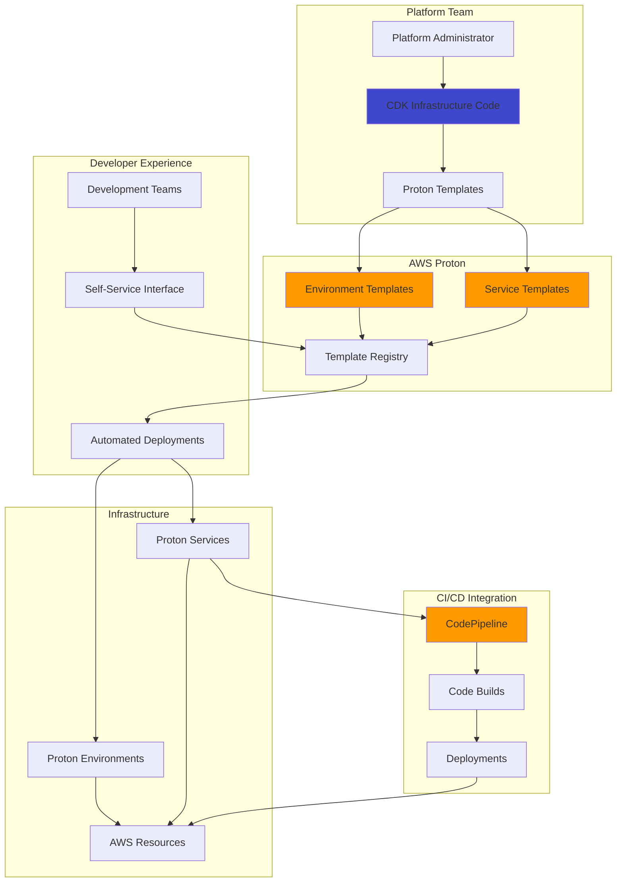

# Infrastructure Automation with Proton and CDK

## Problem

Your organization has multiple development teams creating applications with different technology stacks, but they need standardized infrastructure patterns while maintaining self-service capabilities. Teams are spending too much time on infrastructure setup, creating inconsistent deployments, and struggling with governance controls. You need a solution that provides pre-approved infrastructure templates that teams can deploy independently, while platform administrators maintain central control over security, compliance, and best practices.

## Solution

Implement AWS Proton as a self-service infrastructure platform that provides standardized, versioned templates for common application architectures. Use AWS CDK to define reusable infrastructure components and integrate them with Proton's template system to enable governance, standardization, and automated deployments. This approach allows platform teams to create approved infrastructure patterns while giving development teams the autonomy to deploy applications quickly and consistently.

## Architecture Diagram



## Prerequisites

1. AWS account with administrator access and permissions to create Proton resources
2. AWS CLI v2 installed and configured with appropriate permissions
3. Node.js 18+ and npm installed for CDK development
4. AWS CDK v2 installed globally (`npm install -g aws-cdk`)
5. Understanding of Infrastructure as Code and containerized applications
6. Git repository for storing template code and application source
7. Basic knowledge of YAML, CloudFormation, and CI/CD concepts
8. Estimated cost: $15-30/month for testing (VPC NAT Gateway, ECS cluster, S3 storage)

> **Note**: AWS Proton charges for template storage and provisioning operations. Review [Proton pricing](https://aws.amazon.com/proton/pricing/) to understand costs. Template storage is typically minimal, but consider the cost of underlying resources provisioned by templates.

## Preparation

Set up the development environment and initialize the CDK project:

```bash
# Set environment variables
export AWS_REGION=$(aws configure get region)
export AWS_ACCOUNT_ID=$(aws sts get-caller-identity \
    --query Account --output text)

# Generate unique identifiers
RANDOM_STRING=$(aws secretsmanager get-random-password \
    --exclude-punctuation --exclude-uppercase \
    --password-length 6 --require-each-included-type \
    --output text --query RandomPassword)

export PROJECT_NAME="proton-demo-${RANDOM_STRING}"
export ENV_TEMPLATE_NAME="web-app-env-${RANDOM_STRING}"
export SVC_TEMPLATE_NAME="web-app-svc-${RANDOM_STRING}"

echo "Project Name: $PROJECT_NAME"
echo "Environment Template: $ENV_TEMPLATE_NAME"
echo "Service Template: $SVC_TEMPLATE_NAME"
```

Create the project structure and initialize CDK:

```bash
# Create project directory structure
mkdir -p $PROJECT_NAME/{environment-template,service-template,cdk-infra}
cd $PROJECT_NAME

# Initialize CDK project for infrastructure components
cd cdk-infra
npx cdk init app --language typescript

# Install additional CDK constructs for current CDK v2
npm install aws-cdk-lib@^2.170.0 constructs@^10.0.0

cd ..
echo "✅ Project structure created and CDK initialized"
```

Create a service role for Proton:

```bash
# Create Proton service role
cat > proton-service-role-trust-policy.json << EOF
{
    "Version": "2012-10-17",
    "Statement": [
        {
            "Effect": "Allow",
            "Principal": {
                "Service": "proton.amazonaws.com"
            },
            "Action": "sts:AssumeRole"
        }
    ]
}
EOF

PROTON_ROLE_NAME="ProtonServiceRole-${RANDOM_STRING}"
PROTON_ROLE_ARN=$(aws iam create-role \
    --role-name $PROTON_ROLE_NAME \
    --assume-role-policy-document file://proton-service-role-trust-policy.json \
    --query 'Role.Arn' --output text)

# Attach managed policy for Proton
aws iam attach-role-policy \
    --role-name $PROTON_ROLE_NAME \
    --policy-arn arn:aws:iam::aws:policy/AWSProtonFullAccess

export PROTON_ROLE_ARN
echo "✅ Proton service role created: $PROTON_ROLE_ARN"
```

## Steps

1. **Create a CDK construct for reusable infrastructure components**:

   AWS CDK transforms infrastructure provisioning by enabling developers to use familiar programming languages like TypeScript to define cloud resources. This approach provides type safety, code reuse, and powerful abstractions that make infrastructure more maintainable and testable. By creating CDK constructs as building blocks, platform teams can encapsulate networking, security, and operational best practices into reusable components that development teams can leverage without needing deep AWS expertise.

   ```bash
   # Create CDK construct for VPC infrastructure
   cd cdk-infra
   cat > lib/vpc-construct.ts << 'EOF'
   import * as cdk from 'aws-cdk-lib';
   import * as ec2 from 'aws-cdk-lib/aws-ec2';
   import { Construct } from 'constructs';

   export interface VpcConstructProps {
     vpcName: string;
     cidrBlock: string;
   }

   export class VpcConstruct extends Construct {
     public readonly vpc: ec2.Vpc;
     public readonly publicSubnets: ec2.ISubnet[];
     public readonly privateSubnets: ec2.ISubnet[];

     constructor(scope: Construct, id: string, props: VpcConstructProps) {
       super(scope, id);

       this.vpc = new ec2.Vpc(this, 'Vpc', {
         vpcName: props.vpcName,
         ipAddresses: ec2.IpAddresses.cidr(props.cidrBlock),
         maxAzs: 2,
         natGateways: 1,
         subnetConfiguration: [
           {
             cidrMask: 24,
             name: 'Public',
             subnetType: ec2.SubnetType.PUBLIC,
           },
           {
             cidrMask: 24,
             name: 'Private',
             subnetType: ec2.SubnetType.PRIVATE_WITH_EGRESS,
           }
         ]
       });

       this.publicSubnets = this.vpc.publicSubnets;
       this.privateSubnets = this.vpc.privateSubnets;

       // Output VPC information for Proton templates
       new cdk.CfnOutput(this, 'VpcId', {
         value: this.vpc.vpcId,
         description: 'VPC ID for Proton services'
       });

       new cdk.CfnOutput(this, 'PublicSubnetIds', {
         value: this.publicSubnets.map(subnet => subnet.subnetId).join(','),
         description: 'Public subnet IDs'
       });

       new cdk.CfnOutput(this, 'PrivateSubnetIds', {
         value: this.privateSubnets.map(subnet => subnet.subnetId).join(','),
         description: 'Private subnet IDs'
       });
     }
   }
   EOF

   # Build and synthesize CDK to generate CloudFormation
   npm run build
   npx cdk synth

   echo "✅ CDK infrastructure components created"
   ```

   This construct creates a production-ready VPC with multi-AZ deployment, separate public and private subnets, and a NAT gateway for secure outbound internet access from private subnets. The CloudFormation outputs enable Proton templates to reference these resources programmatically, establishing the foundation for standardized networking across all applications.

2. **Create the environment template for shared infrastructure**:

   Environment templates in AWS Proton serve as the foundation layer that defines shared infrastructure components across multiple applications and services. This separation of concerns enables platform teams to maintain centralized control over security, networking, and compliance while providing development teams with a stable, standardized foundation. Environment templates typically include VPCs, ECS clusters, shared databases, and monitoring infrastructure that multiple services within an environment will utilize.

   ```bash
   cd ../environment-template

   # Create the schema file for environment parameters
   cat > schema.yaml << 'EOF'
   schema:
     format:
       openapi: "3.0.0"
     environment_input_type: "EnvironmentInput"
     types:
       EnvironmentInput:
         type: object
         description: "Input properties for the environment"
         properties:
           vpc_cidr:
             type: string
             description: "CIDR block for the VPC"
             default: "10.0.0.0/16"
             pattern: "^([0-9]{1,3}\\.){3}[0-9]{1,3}(\\/([0-9]|[1-2][0-9]|3[0-2]))?$"
           environment_name:
             type: string
             description: "Name of the environment"
             minLength: 1
             maxLength: 100
         required:
           - environment_name
   EOF

   # Create infrastructure template
   cat > infrastructure.yaml << 'EOF'
   AWSTemplateFormatVersion: '2010-09-09'
   Description: 'Proton Environment Template - Shared Infrastructure'

   Parameters:
     vpc_cidr:
       Type: String
       Description: CIDR block for the VPC
       Default: "10.0.0.0/16"
     environment_name:
       Type: String
       Description: Name of the environment

   Resources:
     # VPC for the environment
     VPC:
       Type: AWS::EC2::VPC
       Properties:
         CidrBlock: !Ref vpc_cidr
         EnableDnsHostnames: true
         EnableDnsSupport: true
         Tags:
           - Key: Name
             Value: !Sub '${environment_name}-vpc'

     # Internet Gateway
     InternetGateway:
       Type: AWS::EC2::InternetGateway
       Properties:
         Tags:
           - Key: Name
             Value: !Sub '${environment_name}-igw'

     # Attach Internet Gateway to VPC
     InternetGatewayAttachment:
       Type: AWS::EC2::VPCGatewayAttachment
       Properties:
         InternetGatewayId: !Ref InternetGateway
         VpcId: !Ref VPC

     # Public Subnets
     PublicSubnet1:
       Type: AWS::EC2::Subnet
       Properties:
         VpcId: !Ref VPC
         AvailabilityZone: !Select [0, !GetAZs '']
         CidrBlock: !Select [0, !Cidr [!Ref vpc_cidr, 4, 8]]
         MapPublicIpOnLaunch: true
         Tags:
           - Key: Name
             Value: !Sub '${environment_name}-public-subnet-1'

     PublicSubnet2:
       Type: AWS::EC2::Subnet
       Properties:
         VpcId: !Ref VPC
         AvailabilityZone: !Select [1, !GetAZs '']
         CidrBlock: !Select [1, !Cidr [!Ref vpc_cidr, 4, 8]]
         MapPublicIpOnLaunch: true
         Tags:
           - Key: Name
             Value: !Sub '${environment_name}-public-subnet-2'

     # ECS Cluster
     ECSCluster:
       Type: AWS::ECS::Cluster
       Properties:
         ClusterName: !Sub '${environment_name}-cluster'
         ClusterSettings:
           - Name: containerInsights
             Value: enabled

   Outputs:
     VPCId:
       Description: ID of the VPC
       Value: !Ref VPC
     PublicSubnet1Id:
       Description: ID of public subnet 1
       Value: !Ref PublicSubnet1
     PublicSubnet2Id:
       Description: ID of public subnet 2
       Value: !Ref PublicSubnet2
     ClusterName:
       Description: Name of the ECS cluster
       Value: !Ref ECSCluster
   EOF

   # Create manifest file
   cat > manifest.yaml << 'EOF'
   infrastructure:
     templates:
       - file: "infrastructure.yaml"
         engine: "cloudformation"
   EOF

   echo "✅ Environment template created"
   ```

   The schema file defines the OpenAPI specification for template parameters, enabling input validation and providing a self-documenting interface for development teams. The infrastructure template creates a complete VPC with public subnets, internet gateway, and an ECS cluster with Container Insights for monitoring, establishing the shared foundation that service templates will build upon. This modular approach ensures consistency while enabling teams to deploy applications without recreating common infrastructure components.

3. **Register templates with AWS Proton and test deployment**:

   Template registration transforms your infrastructure definitions into enterprise-ready, self-service capabilities that development teams can consume through AWS Proton's managed interface. This step establishes the governance layer that enables standardization without sacrificing development velocity. Proton's versioning system supports controlled deployments for infrastructure templates, allowing platform teams to roll out improvements while maintaining stability for existing deployments and enabling rollback capabilities when needed.

   ```bash
   # Create template bundles
   tar -czf environment-template.tar.gz schema.yaml \
       infrastructure.yaml manifest.yaml

   # Create S3 bucket for templates
   aws s3 mb s3://${PROJECT_NAME}-templates-${AWS_ACCOUNT_ID} \
       2>/dev/null || true
   aws s3 cp environment-template.tar.gz \
       s3://${PROJECT_NAME}-templates-${AWS_ACCOUNT_ID}/

   # Register the environment template
   aws proton create-environment-template \
       --name $ENV_TEMPLATE_NAME \
       --display-name "Web Application Environment" \
       --description "Shared infrastructure for web applications"

   # Create template version
   aws proton create-environment-template-version \
       --template-name $ENV_TEMPLATE_NAME \
       --description "Initial version of web application environment template" \
       --source s3="{bucket=${PROJECT_NAME}-templates-${AWS_ACCOUNT_ID},key=environment-template.tar.gz}"

   # Wait for template version to be ready
   echo "Waiting for environment template version to be ready..."
   aws proton wait environment-template-version-registered \
       --template-name $ENV_TEMPLATE_NAME \
       --major-version "1" \
       --minor-version "0"

   # Publish template
   aws proton update-environment-template-version \
       --template-name $ENV_TEMPLATE_NAME \
       --major-version "1" \
       --minor-version "0" \
       --status PUBLISHED

   echo "✅ Environment template registered and published"
   ```

   Your infrastructure template is now available in the Proton service catalog, enabling development teams to provision standardized environments through the AWS console, CLI, or API. The published status indicates the template has passed validation and is ready for production use. This self-service model reduces the platform team's operational burden while ensuring all provisioned infrastructure adheres to organizational standards for security, compliance, and operational excellence.

> **Note**: AWS Proton templates use schema validation to ensure proper parameter inputs. Learn more about [Proton template authoring](https://docs.aws.amazon.com/proton/latest/userguide/ag-template-authoring.html).

## Validation & Testing

1. Verify that templates are properly registered and published:

   ```bash
   # List environment templates
   echo "Environment Templates:"
   aws proton list-environment-templates \
       --query 'templates[*].{Name:name,Status:status}' \
       --output table

   # Check template versions
   echo "Environment Template Versions:"
   aws proton list-environment-template-versions \
       --template-name $ENV_TEMPLATE_NAME \
       --query 'templateVersions[*].{Version:majorVersion+"."+minorVersion,Status:status}' \
       --output table
   ```

   Expected output: Template should show as "PUBLISHED" status and version "1.0" should be available.

2. Test environment deployment:

   ```bash
   # Create environment specification
   cat > environment-spec.yaml << EOF
   vpc_cidr: "10.0.0.0/16"
   environment_name: "dev-environment"
   EOF

   # Create environment
   ENVIRONMENT_NAME="dev-env-${RANDOM_STRING}"
   aws proton create-environment \
       --name $ENVIRONMENT_NAME \
       --template-name $ENV_TEMPLATE_NAME \
       --template-major-version "1" \
       --proton-service-role-arn $PROTON_ROLE_ARN \
       --spec file://environment-spec.yaml

   echo "✅ Environment deployment initiated: $ENVIRONMENT_NAME"
   ```

3. Monitor deployment progress and verify resources:

   ```bash
   # Check environment status
   aws proton get-environment --name $ENVIRONMENT_NAME \
       --query '{Name:name,Status:deploymentStatus}' \
       --output table

   # Show available templates for developers
   echo "Available Environment Templates:"
   aws proton list-environment-templates \
       --query 'templates[?status==`PUBLISHED`].{Name:name,Description:description}' \
       --output table
   ```

> **Tip**: Use the AWS Proton console to visualize your templates and deployed resources. The console provides a graphical interface that makes it easier for development teams to understand available templates and their parameters.

## Cleanup

1. Delete any deployed environments:

   ```bash
   # Delete environment (this will also delete any associated services)
   aws proton delete-environment --name $ENVIRONMENT_NAME
   echo "Environment deletion initiated..."

   # Wait for environment deletion to complete
   echo "Waiting for environment deletion to complete..."
   aws proton wait environment-deleted --name $ENVIRONMENT_NAME \
       2>/dev/null || echo "Environment deletion completed"
   echo "✅ Environment deleted"
   ```

2. Delete environment template versions and templates:

   ```bash
   # Delete environment template version
   aws proton delete-environment-template-version \
       --template-name $ENV_TEMPLATE_NAME \
       --major-version "1" \
       --minor-version "0"

   # Delete environment template
   aws proton delete-environment-template --name $ENV_TEMPLATE_NAME
   echo "✅ Environment template deleted"
   ```

3. Clean up S3 bucket and other resources:

   ```bash
   # Empty and delete S3 bucket
   aws s3 rm s3://${PROJECT_NAME}-templates-${AWS_ACCOUNT_ID} --recursive
   aws s3 rb s3://${PROJECT_NAME}-templates-${AWS_ACCOUNT_ID}

   # Delete IAM role
   aws iam detach-role-policy \
       --role-name $PROTON_ROLE_NAME \
       --policy-arn arn:aws:iam::aws:policy/AWSProtonFullAccess

   aws iam delete-role --role-name $PROTON_ROLE_NAME
   echo "✅ IAM role deleted"
   ```

4. Clean up local files:

   ```bash
   # Remove project directory
   cd ..
   rm -rf $PROJECT_NAME
   rm -f proton-service-role-trust-policy.json
   echo "✅ Local files cleaned up"
   ```

## Discussion

[AWS Proton](https://docs.aws.amazon.com/proton/latest/userguide/Welcome.html) addresses the challenge of standardizing infrastructure across development teams while maintaining the agility that modern application development requires. By providing a template-driven approach to infrastructure provisioning, Proton enables platform teams to codify best practices, security policies, and organizational standards into reusable components. This creates a self-service model where developers can provision infrastructure without deep AWS expertise while ensuring compliance with organizational requirements and adherence to the [AWS Well-Architected Framework](https://docs.aws.amazon.com/wellarchitected/latest/framework/welcome.html) pillars.

The integration with AWS CDK demonstrates how infrastructure as code practices can be elevated to a platform level. CDK's programmatic approach to infrastructure definition allows for more sophisticated abstraction and reusability compared to raw CloudFormation templates. By using CDK constructs as the foundation for Proton templates, platform teams can leverage TypeScript's type safety, npm's package ecosystem, and CDK's higher-level abstractions while still providing the template-based experience that Proton enables. This approach follows AWS security best practices by implementing least privilege access and enabling centralized governance.

The separation between environment templates and service templates reflects real-world organizational boundaries and follows the AWS Well-Architected Framework's operational excellence pillar. Environment templates typically require more privileged access and represent shared infrastructure that multiple applications depend on, such as VPCs, databases, and monitoring systems. Service templates, conversely, define application-specific infrastructure that development teams iterate on frequently. This separation allows for different governance models: platform teams control environment evolution while development teams have autonomy over service definitions within approved boundaries, promoting both security and operational efficiency.

> **Warning**: Template validation occurs during registration. Ensure your CloudFormation templates are syntactically correct and follow AWS CloudFormation best practices before uploading to avoid registration failures. Review the [CloudFormation template reference](https://docs.aws.amazon.com/AWSCloudFormation/latest/UserGuide/template-reference.html) for guidance.

## Challenge

Extend this solution by implementing these enhancements:

1. **Create service templates** that deploy containerized applications to the ECS cluster, including load balancers and auto-scaling policies
2. **Implement policy-as-code validation** using AWS Config rules or Open Policy Agent (OPA) to enforce security and compliance standards automatically
3. **Add multi-region template deployment strategies** with cross-region replication and disaster recovery capabilities
4. **Build monitoring dashboards** using CloudWatch and AWS X-Ray that track template usage, deployment success rates, and compliance across teams
5. **Integrate Git-based workflows** using AWS CodeCommit and CodePipeline to enable version-controlled template development with automated testing and approval processes

## Infrastructure Code

### Available Infrastructure as Code:

- [Infrastructure Code Overview](code/README.md) - Detailed description of all infrastructure components
- [AWS CDK (Python)](code/cdk-python/) - AWS CDK Python implementation
- [AWS CDK (TypeScript)](code/cdk-typescript/) - AWS CDK TypeScript implementation
- [CloudFormation](code/cloudformation.yaml) - AWS CloudFormation template
- [Bash CLI Scripts](code/scripts/) - Example bash scripts using AWS CLI commands to deploy infrastructure
- [Terraform](code/terraform/) - Terraform configuration files