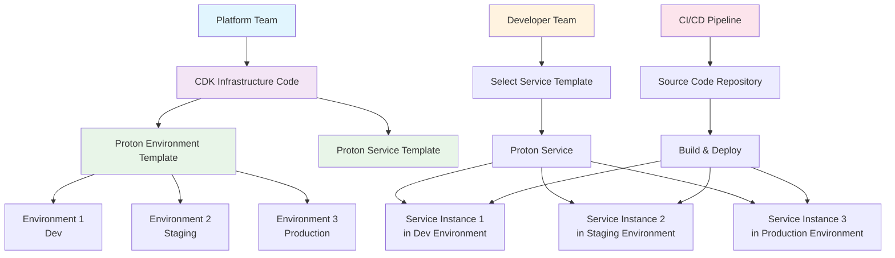

# Infrastructure Automation with AWS Proton and CDK

## Problem

Your organization has multiple development teams that need to deploy applications quickly and consistently, but they're struggling with infrastructure standardization. Each team creates their own CloudFormation templates, leading to inconsistent resource configurations, security gaps, and operational overhead. Platform teams spend significant time managing bespoke infrastructure requests instead of focusing on strategic initiatives. You need a solution that provides standardized, self-service infrastructure provisioning while maintaining central governance and security controls.

## Solution

Implement an infrastructure automation platform using AWS Proton and AWS CDK to create standardized, reusable infrastructure templates that development teams can self-service deploy. AWS Proton acts as the orchestration layer that manages template versioning, environment provisioning, and application deployments, while CDK provides the infrastructure-as-code foundation with familiar programming language constructs. This solution enables platform teams to define golden path templates while giving developers the autonomy to deploy applications consistently across environments.

## Architecture Diagram



## Prerequisites

- AWS account with administrator access
- AWS CLI version 2 installed and configured
- Node.js 16.x or later installed for CDK
- Basic understanding of Infrastructure as Code concepts
- Git installed and configured
- Understanding of CI/CD pipeline concepts
- Estimated cost: $15-25 for testing with sample environments

## Steps

1. **Set up environment variables for consistent resource naming**:

   Establishing consistent naming conventions is critical for managing infrastructure at scale. These environment variables ensure unique resource names across your organization while maintaining clarity about resource ownership and purpose.

   ```bash
   export AWS_ACCOUNT_ID=$(aws sts get-caller-identity \
   	--query Account --output text)
   export AWS_REGION=$(aws configure get region)
   export RANDOM_SUFFIX=$(aws secretsmanager get-random-password \
   	--exclude-punctuation --exclude-uppercase \
   	--password-length 6 --require-each-included-type \
   	--output text --query RandomPassword)
   export PROTON_SERVICE_ROLE_NAME="ProtonServiceRole-$RANDOM_SUFFIX"
   export TEMPLATE_BUCKET="proton-templates-$RANDOM_SUFFIX"
   ```

   These variables are now set and will be used throughout the deployment process to ensure consistent resource naming and avoid conflicts with existing resources.

2. **Install and bootstrap AWS CDK**:

   AWS CDK requires one-time bootstrapping to deploy foundational resources like S3 buckets and IAM roles that CDK uses for deployments. This step prepares your AWS account to work with CDK-generated CloudFormation templates.

   ```bash
   npm install -g aws-cdk
   cdk --version
   ```

   ```bash
   cdk bootstrap aws://${AWS_ACCOUNT_ID}/${AWS_REGION}
   ```

   The CDK is now installed and your AWS account is bootstrapped with the necessary resources for CDK deployments. This foundation enables all subsequent CDK operations.

3. **Create S3 bucket for storing template bundles**:

   AWS Proton requires template bundles to be stored in S3 where it can access them during environment and service provisioning. This bucket serves as the central repository for all your infrastructure templates.

   ```bash
   aws s3api create-bucket --bucket $TEMPLATE_BUCKET \
   	--region $AWS_REGION
   ```

   The S3 bucket is now created and ready to store your Proton template bundles. This centralized storage approach enables version control and secure access to your infrastructure templates.

4. **Create IAM service role for AWS Proton**:

   AWS Proton requires specific IAM permissions to provision and manage infrastructure on your behalf. This service role grants Proton the necessary permissions while maintaining security through the principle of least privilege.

   ```bash
   cat > proton-service-trust-policy.json << 'EOF'
   {
     "Version": "2012-10-17",
     "Statement": [
       {
         "Effect": "Allow",
         "Principal": {
           "Service": "proton.amazonaws.com"
         },
         "Action": "sts:AssumeRole"
       }
     ]
   }
   EOF
   ```

   ```bash
   aws iam create-role \
   	--role-name $PROTON_SERVICE_ROLE_NAME \
   	--assume-role-policy-document \
   	file://proton-service-trust-policy.json
   ```

   ```bash
   aws iam attach-role-policy \
   	--role-name $PROTON_SERVICE_ROLE_NAME \
   	--policy-arn arn:aws:iam::aws:policy/service-role/AWSProtonServiceRole
   ```

   The IAM service role is now configured with appropriate permissions for Proton to manage your infrastructure. This role enables Proton to provision environments and services while maintaining security boundaries.

5. **Create directory structure for Proton template**:

   AWS Proton templates must follow a specific directory structure that includes infrastructure code, schemas, and manifest files. This organization enables Proton to understand and validate your template components.

   ```bash
   mkdir -p ../environment-template/v1/infrastructure
   cd ../environment-template/v1
   ```

   The directory structure is now created following Proton's conventions. This standardized layout ensures compatibility with Proton's template processing pipeline.

6. **Copy the synthesized CloudFormation template**:

   CDK synthesis generates CloudFormation templates that AWS Proton can deploy. This step bridges the gap between CDK's TypeScript constructs and Proton's CloudFormation-based deployment engine.

   ```bash
   cp ../../proton-environment-template/cdk.out/ProtonEnvironmentStack.template.json \
   	infrastructure/cloudformation.yaml
   ```

   The CDK-generated CloudFormation template is now packaged for Proton deployment. This template contains all the networking and compute infrastructure needed for your environment.

7. **Create the environment template schema**:

   The schema defines the interface that development teams will use to configure environments. It provides input validation and default values, ensuring consistent deployments while allowing necessary customization.

   ```bash
   cat > schema.yaml << 'EOF'
   schema:
     format:
       openapi: "3.0.0"
     environment_input_type: "EnvironmentInput"
     types:
       EnvironmentInput:
         type: object
         description: "Input properties for the environment"
         properties:
           vpc_cidr:
             type: string
             description: "CIDR block for the VPC"
             default: "10.0.0.0/16"
             pattern: '^(\d{1,3}\.){3}\d{1,3}/\d{1,2}$'
           environment_name:
             type: string
             description: "Name for the environment"
             minLength: 1
             maxLength: 100
             pattern: '^[a-zA-Z][a-zA-Z0-9-]*[a-zA-Z0-9]$'
         required:
           - environment_name
   EOF
   ```

   The schema is now defined with validation rules and defaults. This interface standardizes how teams configure environments while preventing common configuration errors.

8. **Create the manifest file**:

   The manifest file tells Proton how to process the template files and which infrastructure engine to use. This metadata is essential for Proton's template processing pipeline.

   ```bash
   cat > infrastructure/manifest.yaml << 'EOF'
   infrastructure:
     templates:
       - file: "cloudformation.yaml"
         engine: "cloudformation"
         template_language: "yaml"
   EOF
   ```

   The manifest file is configured to instruct Proton to use CloudFormation for deployment. This completes the environment template bundle structure.

9. **Initialize CDK project for service template**:

   Service templates define how individual applications deploy into environments. Unlike environment templates that create shared infrastructure, service templates focus on application-specific resources like containers, load balancers, and databases.

   ```bash
   cd ../../
   mkdir proton-service-template
   cd proton-service-template
   cdk init app --language typescript
   ```

   The service template CDK project is now initialized. This separate project allows you to define application deployment patterns independently from environment infrastructure.

10. **Install additional CDK packages**:

    Service templates require additional CDK constructs for container orchestration, load balancing, and logging. These packages provide high-level abstractions for common application deployment patterns.

    ```bash
    npm install @aws-cdk/aws-ecs @aws-cdk/aws-ecs-patterns \
    	@aws-cdk/aws-ec2 @aws-cdk/aws-elasticloadbalancingv2 \
    	@aws-cdk/aws-logs @aws-cdk/aws-iam
    ```

    The required CDK packages are now installed. These libraries provide the constructs needed to create containerized services with proper networking, scaling, and observability.

11. **Create the service infrastructure stack**:

    This service template creates a production-ready web service using AWS Fargate with auto-scaling, load balancing, and centralized logging. The template demonstrates how services can reference environment infrastructure through Proton's template variable system, enabling loose coupling between infrastructure layers.

    ```bash
    cat > lib/proton-service-stack.ts << 'EOF'
    import * as cdk from 'aws-cdk-lib';
    import * as ec2 from 'aws-cdk-lib/aws-ec2';
    import * as ecs from 'aws-cdk-lib/aws-ecs';
    import * as ecsPatterns from 'aws-cdk-lib/aws-ecs-patterns';
    import * as logs from 'aws-cdk-lib/aws-logs';
    import { Construct } from 'constructs';

    export class ProtonServiceStack extends cdk.Stack {
      constructor(scope: Construct, id: string, props?: cdk.StackProps) {
        super(scope, id, props);

        // Import VPC from environment
        const vpc = ec2.Vpc.fromLookup(this, 'ImportedVPC', {
          vpcId: '{{environment.outputs.VpcId}}'
        });

        // Import ECS Cluster from environment
        const cluster = ecs.Cluster.fromClusterAttributes(this, 'ImportedCluster', {
          clusterName: '{{environment.name}}-cluster',
          vpc: vpc
        });

        // Create CloudWatch log group
        const logGroup = new logs.LogGroup(this, 'ServiceLogGroup', {
          logGroupName: `/aws/ecs/{{service.name}}-{{service_instance.name}}`,
          retention: logs.RetentionDays.ONE_WEEK,
          removalPolicy: cdk.RemovalPolicy.DESTROY
        });

        // Create Fargate service with Application Load Balancer
        const fargateService = new ecsPatterns.ApplicationLoadBalancedFargateService(this, 'Service', {
          cluster: cluster,
          serviceName: '{{service.name}}-{{service_instance.name}}',
          taskImageOptions: {
            image: ecs.ContainerImage.fromRegistry('{{service_instance.inputs.image}}'),
            containerPort: {{service_instance.inputs.port}},
            environment: {
              NODE_ENV: '{{service_instance.inputs.environment}}',
              SERVICE_NAME: '{{service.name}}'
            },
            logDriver: ecs.LogDrivers.awsLogs({
              streamPrefix: '{{service.name}}',
              logGroup: logGroup
            })
          },
          memoryLimitMiB: {{service_instance.inputs.memory}},
          cpu: {{service_instance.inputs.cpu}},
          desiredCount: {{service_instance.inputs.desired_count}},
          publicLoadBalancer: true
        });

        // Configure health check
        fargateService.targetGroup.configureHealthCheck({
          path: '{{service_instance.inputs.health_check_path}}',
          healthyHttpCodes: '200,404'
        });

        // Auto scaling configuration
        const scaling = fargateService.service.autoScaleTaskCount({
          minCapacity: {{service_instance.inputs.min_capacity}},
          maxCapacity: {{service_instance.inputs.max_capacity}}
        });

        scaling.scaleOnCpuUtilization('CpuScaling', {
          targetUtilizationPercent: 70
        });

        // Output the load balancer URL
        new cdk.CfnOutput(this, 'LoadBalancerDNS', {
          value: fargateService.loadBalancer.loadBalancerDnsName,
          description: 'Load Balancer DNS name'
        });

        new cdk.CfnOutput(this, 'ServiceArn', {
          value: fargateService.service.serviceArn,
          description: 'ECS Service ARN'
        });
      }
    }
    EOF
    ```

    The service stack is now defined with enterprise-grade features including health checks, auto-scaling, and centralized logging. This template provides a robust foundation for containerized web applications.

12. **Update the service CDK app**:

    ```bash
    cat > bin/proton-service-template.ts << 'EOF'
    #!/usr/bin/env node
    import 'source-map-support/register';
    import * as cdk from 'aws-cdk-lib';
    import { ProtonServiceStack } from '../lib/proton-service-stack';

    const app = new cdk.App();
    new ProtonServiceStack(app, 'ProtonServiceStack');
    EOF
    ```

13. **Build and synthesize the service template**:

    ```bash
    npm run build
    cdk synth
    ```

> **Warning**: Ensure that your service template references environment outputs correctly. The syntax `{{environment.outputs.VpcId}}` allows services to access infrastructure created by the environment template.

14. **Create service template directory structure**:

    Service templates use the `instance_infrastructure` directory to contain resources that get deployed for each service instance. This structure allows multiple instances of the same service to coexist in different environments.

    ```bash
    mkdir -p ../service-template/v1/instance_infrastructure
    cd ../service-template/v1
    ```

    The service template directory structure is now created. This organization enables Proton to manage multiple service instances while maintaining isolation between deployments.

15. **Copy synthesized CloudFormation template**:

    The CDK-generated CloudFormation template contains all the application-specific infrastructure needed to run your service, including Fargate tasks, load balancers, and auto-scaling policies.

    ```bash
    cp ../../proton-service-template/cdk.out/ProtonServiceStack.template.json \
    	instance_infrastructure/cloudformation.yaml
    ```

    The service CloudFormation template is now packaged for Proton deployment. This template will be used to create individual service instances in your environments.

16. **Create service template schema**:

    The schema defines the interface for developers using this service template. It specifies required and optional parameters with validation rules, making it easy for teams to deploy services without deep infrastructure knowledge while ensuring consistency.

    ```bash
    cat > schema.yaml << 'EOF'
    schema:
      format:
        openapi: "3.0.0"
      service_input_type: "ServiceInput"
      types:
        ServiceInput:
          type: object
          description: "Input properties for the service"
          properties:
            image:
              type: string
              description: "Docker image to deploy"
              default: "nginx:latest"
            port:
              type: number
              description: "Container port"
              default: 80
              minimum: 1
              maximum: 65535
            environment:
              type: string
              description: "Environment name"
              default: "production"
              enum: ["development", "staging", "production"]
            memory:
              type: number
              description: "Memory allocation in MiB"
              default: 512
              minimum: 256
              maximum: 8192
            cpu:
              type: number
              description: "CPU allocation"
              default: 256
              minimum: 256
              maximum: 4096
            desired_count:
              type: number
              description: "Desired number of tasks"
              default: 2
              minimum: 1
              maximum: 10
            min_capacity:
              type: number
              description: "Minimum number of tasks"
              default: 1
              minimum: 1
            max_capacity:
              type: number
              description: "Maximum number of tasks"
              default: 5
              minimum: 2
            health_check_path:
              type: string
              description: "Health check path"
              default: "/"
          required:
            - image
            - port
    EOF
    ```

17. **Create service manifest file**:

    ```bash
    cat > instance_infrastructure/manifest.yaml << 'EOF'
    infrastructure:
      templates:
        - file: "cloudformation.yaml"
          engine: "cloudformation"
          template_language: "yaml"
    EOF
    ```

18. **Create template bundles**:

    AWS Proton requires templates to be packaged as compressed archives and stored in S3. This packaging approach enables version control and secure distribution of your infrastructure templates across teams and environments.

    ```bash
    cd ../environment-template
    tar -czf environment-template-v1.tar.gz v1/
    aws s3 cp environment-template-v1.tar.gz s3://$TEMPLATE_BUCKET/
    ```

    ```bash
    cd ../service-template
    tar -czf service-template-v1.tar.gz v1/
    aws s3 cp service-template-v1.tar.gz s3://$TEMPLATE_BUCKET/
    ```

    Both template bundles are now uploaded to S3 and ready for registration with Proton. These archives contain all the necessary files for Proton to understand and deploy your infrastructure templates.

19. **Register the environment template**:

    ```bash
    PROTON_SERVICE_ROLE_ARN="arn:aws:iam::${AWS_ACCOUNT_ID}:role/${PROTON_SERVICE_ROLE_NAME}"

    aws proton create-environment-template \
    	--name "vpc-ecs-environment" \
    	--display-name "VPC with ECS Cluster" \
    	--description "Standard VPC environment with ECS cluster for containerized applications"
    ```

20. **Create environment template version**:

    ```bash
    aws proton create-environment-template-version \
    	--template-name "vpc-ecs-environment" \
    	--description "Initial version with VPC and ECS cluster" \
    	--source s3="{bucket=${TEMPLATE_BUCKET},key=environment-template-v1.tar.gz}"
    ```

21. **Wait for template version to be registered and publish it**:

    ```bash
    aws proton wait environment-template-version-registered \
    	--template-name "vpc-ecs-environment" \
    	--major-version "1" --minor-version "0"
    ```

    ```bash
    aws proton update-environment-template-version \
    	--template-name "vpc-ecs-environment" \
    	--major-version "1" --minor-version "0" \
    	--status "PUBLISHED"
    ```

22. **Register the service template**:

    ```bash
    aws proton create-service-template \
    	--name "fargate-web-service" \
    	--display-name "Fargate Web Service" \
    	--description "Web service running on Fargate with load balancer"
    ```

23. **Create service template version**:

    ```bash
    aws proton create-service-template-version \
    	--template-name "fargate-web-service" \
    	--description "Initial version with Fargate and ALB" \
    	--source s3="{bucket=${TEMPLATE_BUCKET},key=service-template-v1.tar.gz}" \
    	--compatible-environment-templates templateName="vpc-ecs-environment",majorVersion="1"
    ```

24. **Publish service template version**:

    ```bash
    aws proton wait service-template-version-registered \
    	--template-name "fargate-web-service" \
    	--major-version "1" --minor-version "0"
    ```

    ```bash
    aws proton update-service-template-version \
    	--template-name "fargate-web-service" \
    	--major-version "1" --minor-version "0" \
    	--status "PUBLISHED"
    ```

> **Note**: AWS Proton uses environment templates to define shared infrastructure like VPCs, clusters, and networking that multiple services can leverage. Learn more about [Proton template architecture](https://docs.aws.amazon.com/proton/latest/userguide/ag-environments.html).

## Validation & Testing

### Test Environment Creation

1. Create a development environment:

   ```bash
   cat > dev-environment-spec.json << 'EOF'
   {
     "vpc_cidr": "10.0.0.0/16",
     "environment_name": "development"
   }
   EOF
   ```

   ```bash
   aws proton create-environment \
   	--name "dev-environment" \
   	--template-name "vpc-ecs-environment" \
   	--template-major-version "1" \
   	--spec file://dev-environment-spec.json \
   	--proton-service-role-arn $PROTON_SERVICE_ROLE_ARN
   ```

2. Monitor environment deployment:

   ```bash
   aws proton get-environment --name "dev-environment"
   ```

3. Wait for environment to be deployed:

   ```bash
   aws proton wait environment-deployed --name "dev-environment"
   ```

### Test Service Deployment

1. Create a test service:

   ```bash
   cat > test-service-spec.json << 'EOF'
   {
     "image": "nginx:latest",
     "port": 80,
     "environment": "development",
     "memory": 512,
     "cpu": 256,
     "desired_count": 1,
     "min_capacity": 1,
     "max_capacity": 3,
     "health_check_path": "/"
   }
   EOF
   ```

   ```bash
   aws proton create-service \
   	--name "test-web-service" \
   	--template-name "fargate-web-service" \
   	--template-major-version "1" \
   	--spec file://test-service-spec.json
   ```

2. Create service instance in the development environment:

   ```bash
   aws proton create-service-instance \
   	--service-name "test-web-service" \
   	--name "dev-instance" \
   	--environment-name "dev-environment" \
   	--spec file://test-service-spec.json
   ```

3. Monitor service instance deployment:

   ```bash
   aws proton get-service-instance \
   	--service-name "test-web-service" \
   	--name "dev-instance"
   ```

### Expected Results

- Environment should deploy successfully with VPC and ECS cluster
- Service instance should deploy with Fargate service and load balancer
- Load balancer should be accessible and serving the nginx default page
- CloudWatch logs should show container activity
- Auto-scaling should be configured and functional

> **Tip**: AWS Proton uses Jinja templating syntax for parameterization. The double curly braces `{{environment.name}}` will be replaced with actual values when Proton provisions the environment.

## Cleanup

1. Delete service instances and services:

   ```bash
   aws proton delete-service-instance \
   	--service-name "test-web-service" \
   	--name "dev-instance"
   ```

   ```bash
   aws proton wait service-instance-deleted \
   	--service-name "test-web-service" \
   	--name "dev-instance"
   ```

   ```bash
   aws proton delete-service --name "test-web-service"
   ```

2. Delete environments:

   ```bash
   aws proton delete-environment --name "dev-environment"
   aws proton wait environment-deleted --name "dev-environment"
   ```

3. Delete service template versions and templates:

   ```bash
   aws proton delete-service-template-version \
   	--template-name "fargate-web-service" \
   	--major-version "1" --minor-version "0"
   ```

   ```bash
   aws proton delete-service-template \
   	--name "fargate-web-service"
   ```

4. Delete environment template versions and templates:

   ```bash
   aws proton delete-environment-template-version \
   	--template-name "vpc-ecs-environment" \
   	--major-version "1" --minor-version "0"
   ```

   ```bash
   aws proton delete-environment-template \
   	--name "vpc-ecs-environment"
   ```

5. Delete S3 bucket and contents:

   ```bash
   aws s3 rm s3://${TEMPLATE_BUCKET} --recursive
   aws s3api delete-bucket --bucket $TEMPLATE_BUCKET
   ```

6. Delete IAM role:

   ```bash
   aws iam detach-role-policy \
   	--role-name $PROTON_SERVICE_ROLE_NAME \
   	--policy-arn arn:aws:iam::aws:policy/service-role/AWSProtonServiceRole
   ```

   ```bash
   aws iam delete-role --role-name $PROTON_SERVICE_ROLE_NAME
   ```

7. Clean up local files:

   ```bash
   cd ../../
   rm -rf proton-environment-template proton-service-template
   rm -rf environment-template service-template
   rm -f *.json *.tar.gz
   ```

## Discussion

This infrastructure automation solution demonstrates how AWS Proton and CDK work together to solve the standardization challenge faced by platform teams in multi-team organizations. AWS Proton acts as the governance layer, providing template versioning, environment management, and self-service capabilities, while CDK provides the expressive infrastructure-as-code foundation using familiar programming constructs.

The key advantage of this approach is the separation of concerns between platform teams and development teams. Platform teams focus on creating robust, secure, and compliant infrastructure templates using CDK's powerful abstractions, while development teams can focus on application logic without needing deep infrastructure expertise. The templates become "golden paths" that encode organizational best practices and compliance requirements.

CDK's integration with Proton provides several benefits over traditional CloudFormation approaches. CDK's construct library offers higher-level abstractions that reduce boilerplate code, built-in best practices for security and reliability, and the ability to use programming language features like loops, conditionals, and functions to create more dynamic templates. The type safety and IDE support that comes with TypeScript also helps prevent common configuration errors.

For production implementations, consider extending this foundation with additional capabilities such as integration with AWS Organizations for multi-account deployments, custom constructs that encode your organization's specific patterns, integration with AWS Config for compliance monitoring, and advanced networking patterns for hybrid connectivity. You might also implement template testing strategies using CDK's built-in testing capabilities and establish CI/CD pipelines for template development and deployment.

Sources:

- [AWS Proton User Guide](https://docs.aws.amazon.com/proton/latest/userguide/Welcome.html)  
- [AWS CDK Developer Guide](https://docs.aws.amazon.com/cdk/v2/guide/home.html)
- [AWS Proton Template Authoring Guide](https://docs.aws.amazon.com/proton/latest/userguide/ag-template-authoring.html)

## Challenge

Extend this automation platform to support multiple infrastructure patterns by creating additional service templates for different application types (e.g., serverless Lambda functions, batch processing jobs, or data pipelines). Implement a template testing framework that validates infrastructure deployments in isolated environments before publishing. Consider adding custom CDK constructs that encapsulate your organization's specific compliance and security requirements.

## Infrastructure Code

*Infrastructure code will be generated after recipe approval.*