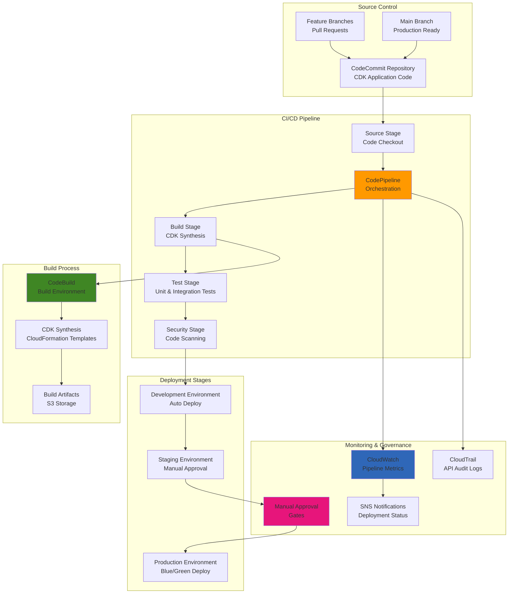

# Infrastructure Deployment Pipelines with CDK

## Problem

Organizations need to implement Infrastructure as Code (IaC) with automated deployment pipelines that can safely and consistently deploy cloud infrastructure across multiple environments. Manual infrastructure deployments are error-prone, time-consuming, and difficult to audit, while traditional CloudFormation templates become complex and hard to maintain as infrastructure grows. Teams require a solution that provides programmatic infrastructure definition, automated testing, multi-environment deployment, rollback capabilities, and comprehensive change tracking while maintaining security and compliance standards.

## Solution

Implement automated infrastructure deployment using AWS CDK for programmatic infrastructure definition and AWS CodePipeline for continuous deployment. This solution provides type-safe infrastructure code using familiar programming languages, automated testing and validation, multi-stage deployment with approval gates, and self-updating pipelines that automatically adapt to infrastructure changes. The architecture includes automated rollback capabilities, comprehensive logging, security scanning, and integration with existing development workflows through Git-based triggers.

## Architecture Diagram



## Prerequisites

1. AWS account with permissions for CDK, CodePipeline, CodeBuild, and CodeCommit
2. AWS CLI v2 and AWS CDK v2 installed and configured
3. Node.js 18+ and npm/yarn for CDK development
4. Git for version control and repository management
5. Basic understanding of Infrastructure as Code concepts
6. Estimated cost: $50-150/month depending on pipeline frequency and resource usage

> **Note**: CDK Pipelines require bootstrapping your AWS environments with additional resources for cross-account deployments and artifact storage.

## Preparation

```bash
# Set environment variables
export AWS_REGION=$(aws configure get region)
export AWS_ACCOUNT_ID=$(aws sts get-caller-identity \
    --query Account --output text)

# Generate unique identifiers for resources
RANDOM_SUFFIX=$(aws secretsmanager get-random-password \
    --exclude-punctuation --exclude-uppercase \
    --password-length 6 --require-each-included-type \
    --output text --query RandomPassword)

export PROJECT_NAME="cdk-pipeline-${RANDOM_SUFFIX}"
export REPO_NAME="infrastructure-${RANDOM_SUFFIX}"

# Bootstrap CDK environments
cdk bootstrap aws://${AWS_ACCOUNT_ID}/${AWS_REGION}

echo "✅ Environment prepared for CDK pipeline"
```

## Steps

1. **Initialize CDK Pipeline Project**:

   AWS CDK Pipelines provide a high-level construct that automatically creates and configures CodePipeline, CodeBuild, and related resources. This approach ensures your infrastructure deployments are repeatable, auditable, and follow AWS best practices for production environments. The CDK v2 pipeline constructs offer improved defaults and greater flexibility compared to earlier versions.

   ```bash
   # Create and initialize CDK project
   mkdir $PROJECT_NAME && cd $PROJECT_NAME
   npx cdk init app --language typescript

   # Install CDK pipeline constructs (CDK v2 syntax)
   npm install aws-cdk-lib constructs
   
   echo "✅ CDK project initialized"
   ```

2. **Create CodeCommit Repository**:

   CodeCommit provides fully managed Git repositories that integrate seamlessly with AWS services, offering enterprise-grade security, scalability, and reliability. Unlike external Git providers, CodeCommit eliminates network latency and provides native integration with IAM for fine-grained access control. This creates a secure, centralized source control foundation for your infrastructure automation.

   ```bash
   # Create CodeCommit repository
   aws codecommit create-repository \
       --repository-name $REPO_NAME \
       --repository-description "Infrastructure deployment pipeline"

   # Get repository clone URL
   REPO_URL=$(aws codecommit get-repository \
       --repository-name $REPO_NAME \
       --query 'repositoryMetadata.cloneUrlHttp' \
       --output text)

   export REPO_URL
   echo "Repository URL: $REPO_URL"
   echo "✅ Repository created"
   ```

   The repository is now established as the single source of truth for your infrastructure code. Changes committed to this repository will automatically trigger the deployment pipeline, ensuring that your infrastructure deployments are version-controlled, auditable, and repeatable across all environments.

3. **Implement Pipeline Infrastructure Code**:

   CDK Pipelines represent a paradigm shift in infrastructure automation, combining the power of AWS CodePipeline with the flexibility of programmatic infrastructure definition. This approach enables self-mutating pipelines that can modify themselves when the pipeline definition changes, creating a truly GitOps-driven infrastructure workflow. The CDK constructs automatically handle complex orchestration tasks like artifact management, environment promotion, and rollback strategies.

   ```bash
   # Create pipeline stack with modern CDK v2 syntax
   cat > lib/pipeline-stack.ts << 'EOF'
import * as cdk from 'aws-cdk-lib';
import * as pipelines from 'aws-cdk-lib/pipelines';
import * as codecommit from 'aws-cdk-lib/aws-codecommit';
import * as s3 from 'aws-cdk-lib/aws-s3';
import { Construct } from 'constructs';

export class PipelineStack extends cdk.Stack {
  constructor(scope: Construct, id: string, props?: cdk.StackProps) {
    super(scope, id, props);

    // Source repository
    const repository = codecommit.Repository.fromRepositoryName(
      this, 'Repository', process.env.REPO_NAME!
    );

    // CDK Pipeline with modern v2 syntax
    const pipeline = new pipelines.CodePipeline(this, 'Pipeline', {
      pipelineName: 'InfrastructurePipeline',
      crossAccountKeys: true,
      synth: new pipelines.ShellStep('Synth', {
        input: pipelines.CodePipelineSource.codeCommit(repository, 'main'),
        commands: [
          'npm ci',
          'npm run build',
          'npx cdk synth'
        ]
      })
    });

    // Add development stage
    const devStage = new ApplicationStage(this, 'Dev', {
      env: { 
        account: process.env.CDK_DEFAULT_ACCOUNT, 
        region: process.env.CDK_DEFAULT_REGION 
      }
    });
    pipeline.addStage(devStage);

    // Add production stage with manual approval
    const prodStage = new ApplicationStage(this, 'Prod', {
      env: { 
        account: process.env.CDK_DEFAULT_ACCOUNT, 
        region: process.env.CDK_DEFAULT_REGION 
      }
    });
    pipeline.addStage(prodStage, {
      pre: [new pipelines.ManualApprovalStep('PromoteToProd', {
        comment: 'Please review and approve production deployment'
      })]
    });
  }
}

// Application stage that gets deployed
export class ApplicationStage extends cdk.Stage {
  constructor(scope: Construct, id: string, props?: cdk.StageProps) {
    super(scope, id, props);
    
    // Add your application stacks here
    new ApplicationStack(this, 'Application');
  }
}

// Example application stack
export class ApplicationStack extends cdk.Stack {
  constructor(scope: Construct, id: string, props?: cdk.StackProps) {
    super(scope, id, props);

    // Example: Simple S3 bucket with encryption and versioning
    new s3.Bucket(this, 'ExampleBucket', {
      encryption: s3.BucketEncryption.S3_MANAGED,
      versioned: true,
      removalPolicy: cdk.RemovalPolicy.DESTROY,
      autoDeleteObjects: true
    });
  }
}
EOF

   # Update main app file
   cat > bin/${PROJECT_NAME}.ts << EOF
#!/usr/bin/env node
import 'source-map-support/register';
import * as cdk from 'aws-cdk-lib';
import { PipelineStack } from '../lib/pipeline-stack';

const app = new cdk.App();
new PipelineStack(app, 'PipelineStack', {
  env: {
    account: process.env.CDK_DEFAULT_ACCOUNT,
    region: process.env.CDK_DEFAULT_REGION
  }
});
EOF

   npm run build
   echo "✅ Pipeline infrastructure code created"
   ```

   The pipeline infrastructure is now defined using type-safe TypeScript code that provides compile-time validation and IntelliSense support. This code creates a complete CI/CD pipeline with development and production stages, automatic CloudFormation synthesis, and manual approval gates for production deployments. The modular design enables easy extension for additional environments, testing stages, and security controls.

4. **Deploy Pipeline and Configure Git Integration**:

   The initial deployment creates the pipeline infrastructure using CloudFormation, establishing all necessary IAM roles, S3 buckets for artifacts, and CodeBuild projects. Once deployed, the pipeline becomes self-managing and will automatically update itself when changes are detected in the pipeline definition. This bootstrapping process is the only manual deployment required - all subsequent changes flow through the automated pipeline.

   ```bash
   # Deploy the pipeline
   npx cdk deploy PipelineStack --require-approval never

   # Initialize git and push to CodeCommit
   git init
   git add .
   git commit -m "Initial pipeline setup"
   git remote add origin $REPO_URL
   git push -u origin main

   echo "✅ Pipeline deployed and code pushed"
   ```

   The pipeline is now active and monitoring the repository for changes. Any commits to the main branch will automatically trigger the complete deployment workflow, including CDK synthesis, CloudFormation template generation, and sequential deployment to development and production environments. This establishes a continuous deployment model where infrastructure changes are automatically validated and deployed following the defined approval process.

5. **Configure Pipeline Monitoring and Notifications**:

   CloudWatch automatically monitors pipeline execution metrics, providing visibility into deployment success rates, duration, and failure patterns. Adding SNS notifications ensures teams are immediately informed of deployment status changes, enabling rapid response to issues and streamlined approval workflows.

   ```bash
   # Create SNS topic for pipeline notifications
   TOPIC_ARN=$(aws sns create-topic \
       --name pipeline-notifications-${RANDOM_SUFFIX} \
       --query 'TopicArn' --output text)

   # Subscribe to notifications (replace with your email)
   aws sns subscribe \
       --topic-arn $TOPIC_ARN \
       --protocol email \
       --notification-endpoint your-email@example.com

   echo "✅ Pipeline monitoring configured"
   echo "Topic ARN: $TOPIC_ARN"
   ```

   CloudWatch metrics provide detailed insights into pipeline performance, including execution duration, failure rates, and stage-specific metrics. This observability enables data-driven optimization of deployment processes and proactive identification of infrastructure issues.

> **Warning**: Ensure your AWS credentials have sufficient permissions for all services used in your infrastructure. Missing permissions will cause deployment failures that can be difficult to troubleshoot.

## Validation & Testing

1. Verify pipeline execution:

   ```bash
   # Check pipeline status
   aws codepipeline get-pipeline-state \
       --name InfrastructurePipeline \
       --query 'stageStates[*].{Stage:stageName,Status:latestExecution.status}' \
       --output table
   ```

   Expected output: Table showing all pipeline stages with their current execution status.

2. Test pipeline triggers:

   ```bash
   # Make a simple change and push
   echo "# Pipeline Test - $(date)" >> README.md
   git add README.md
   git commit -m "Test pipeline trigger"
   git push origin main

   echo "✅ Pipeline trigger test initiated"
   ```

3. Monitor execution progress:

   ```bash
   # Watch pipeline execution in real-time
   aws codepipeline get-pipeline-execution \
       --pipeline-name InfrastructurePipeline \
       --pipeline-execution-id $(aws codepipeline list-pipeline-executions \
           --pipeline-name InfrastructurePipeline \
           --query 'pipelineExecutionSummaries[0].pipelineExecutionId' \
           --output text) \
       --query 'pipelineExecution.status' \
       --output text
   ```

4. Verify deployed resources:

   ```bash
   # Check CloudFormation stacks created by pipeline
   aws cloudformation list-stacks \
       --stack-status-filter CREATE_COMPLETE UPDATE_COMPLETE \
       --query 'StackSummaries[?contains(StackName, `Dev`) || contains(StackName, `Prod`)].{Name:StackName,Status:StackStatus}' \
       --output table
   ```

## Cleanup

1. Delete deployed application stacks:

   ```bash
   # Delete application stacks in reverse order
   npx cdk destroy --all --force
   
   echo "✅ Application stacks deleted"
   ```

2. Remove CodeCommit repository:

   ```bash
   # Delete the repository
   aws codecommit delete-repository --repository-name $REPO_NAME
   
   echo "✅ Repository deleted"
   ```

3. Clean up SNS topic:

   ```bash
   # Delete SNS topic if created
   if [ ! -z "$TOPIC_ARN" ]; then
     aws sns delete-topic --topic-arn $TOPIC_ARN
     echo "✅ SNS topic deleted"
   fi
   ```

4. Clean up local files:

   ```bash
   # Remove project directory
   cd .. && rm -rf $PROJECT_NAME
   
   echo "✅ Local files cleaned up"
   ```

## Discussion

CDK Pipelines represent a significant advancement in Infrastructure as Code practices, providing a GitOps-style workflow that treats infrastructure changes with the same rigor as application code. The self-updating nature of CDK Pipelines means that changes to the pipeline itself are automatically deployed, creating a truly autonomous infrastructure management system. This approach reduces operational overhead while increasing deployment reliability and audit capabilities through comprehensive CloudTrail logging and CloudWatch monitoring.

The integration between CDK's programmatic infrastructure definition and CodePipeline's robust deployment orchestration creates a powerful platform for managing complex, multi-environment infrastructure deployments. The type safety and modularity of CDK combined with the scalability and reliability of AWS native CI/CD services provides a foundation that can grow with organizational needs while maintaining security and compliance standards. The AWS Well-Architected Framework principles are built into CDK constructs, ensuring deployments follow security, reliability, and cost optimization best practices.

Modern CDK v2 Pipelines offer improved developer experience with better defaults, enhanced flexibility for complex deployment scenarios, and native support for parallel deployments across multiple regions or accounts. The construct library handles complex scenarios like cross-account IAM role assumptions, artifact encryption, and rollback mechanisms automatically, reducing the operational burden on development teams while maintaining enterprise-grade security standards.

> **Tip**: Consider implementing automated testing strategies including infrastructure validation, security scanning with tools like [cdk-nag](https://github.com/cdklabs/cdk-nag), and cost analysis as part of your pipeline to ensure comprehensive quality gates before production deployments. The [AWS CDK best practices guide](https://docs.aws.amazon.com/cdk/v2/guide/best-practices.html) provides additional guidance for production deployments.

## Challenge

Extend this pipeline by implementing these enhancements:

1. **Cross-account deployments** using CDK Pipelines' support for multiple AWS accounts with proper IAM role assumptions and trust relationships
2. **Automated security scanning** integration with tools like cdk-nag, Checkov, or AWS Config Rules for infrastructure compliance validation
3. **Cost analysis and budgeting controls** using AWS Budgets API integration to prevent unexpected infrastructure costs
4. **Comprehensive monitoring and alerting** for infrastructure changes using CloudWatch Events, SNS, and AWS ChatBot for Slack/Teams integration
5. **Multi-region deployment strategies** with automated failover capabilities and disaster recovery testing

## Infrastructure Code

### Available Infrastructure as Code:

- [Infrastructure Code Overview](code/README.md) - Detailed description of all infrastructure components
- [AWS CDK (Python)](code/cdk-python/) - AWS CDK Python implementation
- [AWS CDK (TypeScript)](code/cdk-typescript/) - AWS CDK TypeScript implementation
- [CloudFormation](code/cloudformation.yaml) - AWS CloudFormation template
- [Bash CLI Scripts](code/scripts/) - Example bash scripts using AWS CLI commands to deploy infrastructure
- [Terraform](code/terraform/) - Terraform configuration files