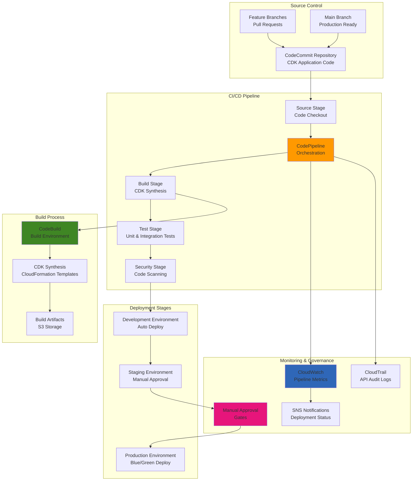

# Infrastructure Deployment Pipelines with CDK

## Problem

Your organization needs to implement Infrastructure as Code (IaC) with automated deployment pipelines that can safely and consistently deploy cloud infrastructure across multiple environments. Manual infrastructure deployments are error-prone, time-consuming, and difficult to audit. Traditional CloudFormation templates become complex and hard to maintain as infrastructure grows. You need a solution that provides programmatic infrastructure definition, automated testing, multi-environment deployment, rollback capabilities, and comprehensive change tracking while maintaining security and compliance standards.

## Solution

Implement automated infrastructure deployment using AWS CDK for programmatic infrastructure definition and AWS CodePipeline for continuous deployment. This solution provides type-safe infrastructure code using familiar programming languages, automated testing and validation, multi-stage deployment with approval gates, and self-updating pipelines that automatically adapt to infrastructure changes. The architecture includes automated rollback capabilities, comprehensive logging, security scanning, and integration with existing development workflows through Git-based triggers.

## Architecture Diagram



## Prerequisites

1. AWS account with permissions for CDK, CodePipeline, CodeBuild, and CodeCommit
2. AWS CLI v2 and AWS CDK v2 installed and configured
3. Node.js 18+ and npm/yarn for CDK development
4. Git for version control and repository management
5. Basic understanding of Infrastructure as Code concepts
6. Estimated cost: $50-150/month depending on pipeline frequency and resource usage

> **Note**: CDK Pipelines require bootstrapping your AWS environments with additional resources for cross-account deployments and artifact storage.

## Preparation

```bash
# Set environment variables
export AWS_REGION=$(aws configure get region)
export AWS_ACCOUNT_ID=$(aws sts get-caller-identity \
    --query Account --output text)

# Generate unique identifiers for resources
RANDOM_SUFFIX=$(aws secretsmanager get-random-password \
    --exclude-punctuation --exclude-uppercase \
    --password-length 6 --require-each-included-type \
    --output text --query RandomPassword)

export PROJECT_NAME="cdk-pipeline-${RANDOM_SUFFIX}"
export REPO_NAME="infrastructure-${RANDOM_SUFFIX}"

# Bootstrap CDK environments
cdk bootstrap aws://${AWS_ACCOUNT_ID}/${AWS_REGION}

echo "✅ Environment prepared for CDK pipeline"
```

## Steps

1. **Initialize CDK Pipeline Project**:

   CDK Pipelines provide a high-level construct that automatically creates and configures CodePipeline, CodeBuild, and related resources. This approach ensures your infrastructure deployments are repeatable, auditable, and follow best practices for production environments.

   ```bash
   # Create and initialize CDK project
   mkdir $PROJECT_NAME && cd $PROJECT_NAME
   npx cdk init app --language typescript

   # Install CDK pipeline constructs
   npm install @aws-cdk/pipelines
   
   echo "✅ CDK project initialized"
   ```

2. **Create CodeCommit Repository and Pipeline Infrastructure**:

   CodeCommit provides fully managed Git repositories that integrate seamlessly with AWS services, offering enterprise-grade security, scalability, and reliability. Unlike external Git providers, CodeCommit eliminates network latency and provides native integration with IAM for fine-grained access control. This creates a secure, centralized source control foundation for your infrastructure automation.

   ```bash
   # Create CodeCommit repository
   aws codecommit create-repository \
       --repository-name $REPO_NAME \
       --repository-description "Infrastructure deployment pipeline"

   # Get repository clone URL
   REPO_URL=$(aws codecommit get-repository \
       --repository-name $REPO_NAME \
       --query 'repositoryMetadata.cloneUrlHttp' \
       --output text)

   export REPO_URL
   echo "Repository URL: $REPO_URL"
   echo "✅ Repository created"
   ```

   The repository is now established as the single source of truth for your infrastructure code. Changes committed to this repository will automatically trigger the deployment pipeline, ensuring that your infrastructure deployments are version-controlled, auditable, and repeatable across all environments.

3. **Implement Pipeline Infrastructure Code**:

   CDK Pipelines represent a paradigm shift in infrastructure automation, combining the power of AWS CodePipeline with the flexibility of programmatic infrastructure definition. This approach enables self-mutating pipelines that can modify themselves when the pipeline definition changes, creating a truly GitOps-driven infrastructure workflow. The CDK constructs automatically handle complex orchestration tasks like artifact management, environment promotion, and rollback strategies.

   ```bash
   # Create pipeline stack
   cat > lib/pipeline-stack.ts << 'EOF'
   import * as cdk from 'aws-cdk-lib';
   import * as pipelines from 'aws-cdk-lib/pipelines';
   import * as codecommit from 'aws-cdk-lib/aws-codecommit';
   import { Construct } from 'constructs';

   export class PipelineStack extends cdk.Stack {
     constructor(scope: Construct, id: string, props?: cdk.StackProps) {
       super(scope, id, props);

       // Source repository
       const repository = codecommit.Repository.fromRepositoryName(
         this, 'Repository', process.env.REPO_NAME!
       );

       // CDK Pipeline
       const pipeline = new pipelines.CodePipeline(this, 'Pipeline', {
         pipelineName: 'InfrastructurePipeline',
         synth: new pipelines.ShellStep('Synth', {
           input: pipelines.CodePipelineSource.codeCommit(repository, 'main'),
           commands: [
             'npm ci',
             'npm run build',
             'npx cdk synth'
           ]
         })
       });

       // Add development stage
       const devStage = new ApplicationStage(this, 'Dev', {
         env: { account: process.env.CDK_DEFAULT_ACCOUNT, region: process.env.CDK_DEFAULT_REGION }
       });
       pipeline.addStage(devStage);

       // Add production stage with manual approval
       const prodStage = new ApplicationStage(this, 'Prod', {
         env: { account: process.env.CDK_DEFAULT_ACCOUNT, region: process.env.CDK_DEFAULT_REGION }
       });
       pipeline.addStage(prodStage, {
         pre: [new pipelines.ManualApprovalStep('PromoteToProd')]
       });
     }
   }

   // Application stage that gets deployed
   export class ApplicationStage extends cdk.Stage {
     constructor(scope: Construct, id: string, props?: cdk.StageProps) {
       super(scope, id, props);
       
       // Add your application stacks here
       new ApplicationStack(this, 'Application');
     }
   }

   // Example application stack
   export class ApplicationStack extends cdk.Stack {
     constructor(scope: Construct, id: string, props?: cdk.StackProps) {
       super(scope, id, props);

       // Example: Simple S3 bucket
       new cdk.aws_s3.Bucket(this, 'ExampleBucket', {
         removalPolicy: cdk.RemovalPolicy.DESTROY
       });
     }
   }
   EOF

   # Update main app file
   cat > bin/$(basename $PROJECT_NAME).ts << EOF
   #!/usr/bin/env node
   import 'source-map-support/register';
   import * as cdk from 'aws-cdk-lib';
   import { PipelineStack } from '../lib/pipeline-stack';

   const app = new cdk.App();
   new PipelineStack(app, 'PipelineStack', {
     env: {
       account: process.env.CDK_DEFAULT_ACCOUNT,
       region: process.env.CDK_DEFAULT_REGION
     }
   });
   EOF

   npm run build
   echo "✅ Pipeline infrastructure code created"
   ```

   The pipeline infrastructure is now defined using type-safe TypeScript code that provides compile-time validation and IntelliSense support. This code creates a complete CI/CD pipeline with development and production stages, automatic CloudFormation synthesis, and manual approval gates for production deployments. The modular design enables easy extension for additional environments, testing stages, and security controls.

4. **Deploy and Configure Git Integration**:

   The initial deployment creates the pipeline infrastructure using CloudFormation, establishing all necessary IAM roles, S3 buckets for artifacts, and CodeBuild projects. Once deployed, the pipeline becomes self-managing and will automatically update itself when changes are detected in the pipeline definition. This bootstrapping process is the only manual deployment required - all subsequent changes flow through the automated pipeline.

   ```bash
   # Deploy the pipeline
   npx cdk deploy PipelineStack

   # Initialize git and push to CodeCommit
   git init
   git add .
   git commit -m "Initial pipeline setup"
   git remote add origin $REPO_URL
   git push -u origin main

   echo "✅ Pipeline deployed and code pushed"
   ```

   The pipeline is now active and monitoring the repository for changes. Any commits to the main branch will automatically trigger the complete deployment workflow, including CDK synthesis, CloudFormation template generation, and sequential deployment to development and production environments. This establishes a continuous deployment model where infrastructure changes are automatically validated and deployed following the defined approval process.

   > **Warning**: Ensure your AWS credentials have sufficient permissions for all services used in your infrastructure. Missing permissions will cause deployment failures that can be difficult to troubleshoot.

## Validation & Testing

1. Verify pipeline execution:

   ```bash
   # Check pipeline status
   aws codepipeline get-pipeline-state \
       --name InfrastructurePipeline \
       --query 'stageStates[*].{Stage:stageName,Status:latestExecution.status}' \
       --output table
   ```

2. Test pipeline triggers:

   ```bash
   # Make a simple change and push
   echo "# Pipeline Test" >> README.md
   git add README.md
   git commit -m "Test pipeline trigger"
   git push origin main

   echo "✅ Pipeline trigger test initiated"
   ```

3. Monitor execution:

   ```bash
   # Watch pipeline execution
   aws codepipeline get-pipeline-execution \
       --pipeline-name InfrastructurePipeline \
       --pipeline-execution-id $(aws codepipeline list-pipeline-executions \
           --pipeline-name InfrastructurePipeline \
           --query 'pipelineExecutionSummaries[0].pipelineExecutionId' \
           --output text)
   ```

## Cleanup

1. Delete deployed stacks:

   ```bash
   # Delete application stacks
   npx cdk destroy --all
   ```

2. Remove repository:

   ```bash
   aws codecommit delete-repository --repository-name $REPO_NAME
   ```

3. Clean up local files:

   ```bash
   cd .. && rm -rf $PROJECT_NAME
   ```

## Discussion

CDK Pipelines represent a significant advancement in Infrastructure as Code practices, providing a GitOps-style workflow that treats infrastructure changes with the same rigor as application code. The self-updating nature of CDK Pipelines means that changes to the pipeline itself are automatically deployed, creating a truly autonomous infrastructure management system. This approach reduces operational overhead while increasing deployment reliability and audit capabilities.

The integration between CDK's programmatic infrastructure definition and CodePipeline's robust deployment orchestration creates a powerful platform for managing complex, multi-environment infrastructure deployments. The type safety and modularity of CDK combined with the scalability and reliability of AWS native CI/CD services provides a foundation that can grow with organizational needs while maintaining security and compliance standards.

> **Note**: Consider implementing automated testing strategies including infrastructure validation, security scanning, and cost analysis as part of your pipeline to ensure comprehensive quality gates before production deployments.

## Challenge

Extend this pipeline by implementing cross-account deployments using CDK Pipelines' support for multiple AWS accounts, adding automated security scanning with tools like cfn-nag or Checkov, implementing cost analysis and budgeting controls, and creating comprehensive monitoring and alerting for infrastructure changes. Additionally, explore integration with external tools like Terraform or Pulumi for hybrid infrastructure management scenarios.

## Infrastructure Code

*Infrastructure code will be generated after recipe approval.*