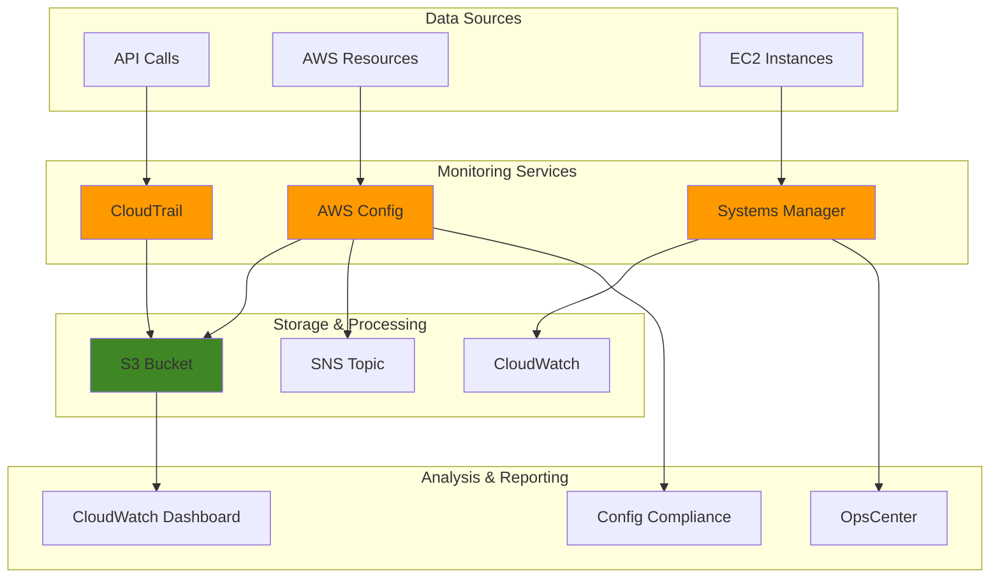

# Implementing Infrastructure Monitoring with CloudTrail, Config, and Systems Manager

## Problem

Organizations struggle to maintain visibility and compliance across their AWS infrastructure as it scales. Without proper monitoring, security incidents go undetected, compliance violations occur unnoticed, and operational issues escalate before teams can respond. Traditional monitoring approaches require manual effort to track configuration changes, audit API calls, and maintain infrastructure health across multiple accounts and regions.

## Solution

This recipe implements a comprehensive infrastructure monitoring solution using AWS CloudTrail for audit logging, AWS Config for compliance monitoring, and AWS Systems Manager for operational insights. The solution provides automated alerting, compliance reporting, and remediation workflows to ensure infrastructure governance and security at scale.

## Architecture Diagram



## Prerequisites

1. AWS account with administrative permissions for CloudTrail, Config, and Systems Manager
2. AWS CLI v2 installed and configured (or AWS CloudShell)
3. Basic understanding of AWS governance and compliance concepts
4. At least 2-3 EC2 instances for Systems Manager demonstration
5. Estimated cost: $50-100/month depending on usage and data volume

> **Note**: This recipe will create resources that incur ongoing charges. Monitor costs using AWS Cost Explorer and clean up resources when no longer needed.

## Preparation

```bash
# Set environment variables
export AWS_REGION=$(aws configure get region)
export AWS_ACCOUNT_ID=$(aws sts get-caller-identity \
    --query Account --output text)

# Generate unique identifiers for resources
RANDOM_SUFFIX=$(aws secretsmanager get-random-password \
    --exclude-punctuation --exclude-uppercase \
    --password-length 6 --require-each-included-type \
    --output text --query RandomPassword)

export MONITORING_BUCKET="infrastructure-monitoring-${RANDOM_SUFFIX}"
export SNS_TOPIC="infrastructure-alerts-${RANDOM_SUFFIX}"
export CONFIG_ROLE="ConfigRole-${RANDOM_SUFFIX}"
export CLOUDTRAIL_NAME="InfrastructureTrail-${RANDOM_SUFFIX}"

# Create S3 bucket for storing logs and configuration data
aws s3 mb s3://${MONITORING_BUCKET} --region ${AWS_REGION}

# Enable versioning on the bucket
aws s3api put-bucket-versioning \
    --bucket ${MONITORING_BUCKET} \
    --versioning-configuration Status=Enabled

echo "✅ Preparation complete. Bucket: ${MONITORING_BUCKET}"
```

## Steps

1. **Create IAM Role for AWS Config**:

   AWS Config requires an IAM service role to access your AWS resources and deliver configuration snapshots and history files to S3. This role operates under the principle of least privilege, granting only the specific permissions necessary for Config to function while maintaining security boundaries. Understanding IAM roles is fundamental to AWS security architecture as they provide temporary credentials without exposing long-term access keys.

   ```bash
   # Create trust policy for Config service
   cat > config-trust-policy.json << EOF
   {
     "Version": "2012-10-17",
     "Statement": [
       {
         "Effect": "Allow",
         "Principal": {
           "Service": "config.amazonaws.com"
         },
         "Action": "sts:AssumeRole"
       }
     ]
   }
   EOF
   
   # Create the IAM role
   aws iam create-role \
       --role-name ${CONFIG_ROLE} \
       --assume-role-policy-document file://config-trust-policy.json
   
   # Attach AWS managed policy for Config
   aws iam attach-role-policy \
       --role-name ${CONFIG_ROLE} \
       --policy-arn arn:aws:iam::aws:policy/service-role/ConfigRole
   
   # Create custom policy for S3 bucket access
   cat > config-s3-policy.json << EOF
   {
     "Version": "2012-10-17",
     "Statement": [
       {
         "Effect": "Allow",
         "Action": [
           "s3:GetBucketAcl",
           "s3:GetBucketLocation",
           "s3:ListBucket"
         ],
         "Resource": "arn:aws:s3:::${MONITORING_BUCKET}"
       },
       {
         "Effect": "Allow",
         "Action": "s3:PutObject",
         "Resource": "arn:aws:s3:::${MONITORING_BUCKET}/AWSLogs/${AWS_ACCOUNT_ID}/Config/*",
         "Condition": {
           "StringEquals": {
             "s3:x-amz-acl": "bucket-owner-full-control"
           }
         }
       }
     ]
   }
   EOF
   
   aws iam put-role-policy \
       --role-name ${CONFIG_ROLE} \
       --policy-name ConfigS3Policy \
       --policy-document file://config-s3-policy.json
   
   echo "✅ Config IAM role created: ${CONFIG_ROLE}"
   ```

   The IAM role is now established with precise permissions for Config operations. This security foundation enables Config to read resource configurations across your AWS account while ensuring audit logs are securely stored in your designated S3 bucket with proper access controls.

2. **Create SNS Topic for Notifications**:

   Amazon SNS provides a managed messaging service that decouples notification delivery from monitoring events. This pub/sub pattern ensures that compliance violations and configuration changes can be broadcast to multiple subscribers simultaneously, enabling distributed teams to respond to infrastructure events promptly. SNS topics serve as the central communication hub for your monitoring architecture.

   ```bash
   # Create SNS topic for Config notifications
   aws sns create-topic --name ${SNS_TOPIC}
   
   # Get topic ARN
   SNS_TOPIC_ARN=$(aws sns get-topic-attributes \
       --topic-arn arn:aws:sns:${AWS_REGION}:${AWS_ACCOUNT_ID}:${SNS_TOPIC} \
       --query 'Attributes.TopicArn' --output text)
   
   # Subscribe your email to the topic (replace with your email)
   read -p "Enter your email address for notifications: " EMAIL_ADDRESS
   aws sns subscribe \
       --topic-arn ${SNS_TOPIC_ARN} \
       --protocol email \
       --notification-endpoint ${EMAIL_ADDRESS}
   
   echo "✅ SNS topic created: ${SNS_TOPIC}"
   echo "   Check your email and confirm the subscription"
   ```

   The SNS topic is now configured to deliver real-time notifications about infrastructure changes and compliance violations. This communication channel ensures your security and operations teams receive immediate alerts when critical events occur, enabling rapid response to potential issues.

3. **Configure AWS Config**:

   AWS Config continuously monitors and records AWS resource configurations, providing a comprehensive inventory of your infrastructure state over time. The configuration recorder captures changes to all supported resource types, while the delivery channel ensures this data reaches your S3 bucket and SNS topic for analysis and alerting. This creates the foundation for compliance monitoring and configuration drift detection.

   ```bash
   # Create configuration recorder
   aws configservice put-configuration-recorder \
       --configuration-recorder name=default,roleARN=arn:aws:iam::${AWS_ACCOUNT_ID}:role/${CONFIG_ROLE} \
       --recording-group allSupported=true,includeGlobalResourceTypes=true
   
   # Create delivery channel
   aws configservice put-delivery-channel \
       --delivery-channel name=default,s3BucketName=${MONITORING_BUCKET},snsTopicARN=${SNS_TOPIC_ARN}
   
   # Start the configuration recorder
   aws configservice start-configuration-recorder \
       --configuration-recorder-name default
   
   # Wait for Config to initialize
   sleep 30
   
   echo "✅ AWS Config configured and recording"
   ```

   AWS Config is now actively monitoring all resource configurations in your account. The service maintains a complete configuration history, enabling you to track changes over time and understand how your infrastructure evolves, which is essential for security investigations and compliance auditing.

4. **Set up CloudTrail**:

   AWS CloudTrail provides detailed logging of all API calls made in your AWS account, creating an immutable audit trail for security analysis and compliance reporting. CloudTrail captures who made what changes, when they occurred, and from which source, providing the forensic capabilities needed for incident response and regulatory compliance. Multi-region trails ensure comprehensive coverage across your entire AWS footprint.

   ```bash
   # Create CloudTrail bucket policy
   cat > cloudtrail-bucket-policy.json << EOF
   {
     "Version": "2012-10-17",
     "Statement": [
       {
         "Sid": "AWSCloudTrailAclCheck",
         "Effect": "Allow",
         "Principal": {
           "Service": "cloudtrail.amazonaws.com"
         },
         "Action": "s3:GetBucketAcl",
         "Resource": "arn:aws:s3:::${MONITORING_BUCKET}"
       },
       {
         "Sid": "AWSCloudTrailWrite",
         "Effect": "Allow",
         "Principal": {
           "Service": "cloudtrail.amazonaws.com"
         },
         "Action": "s3:PutObject",
         "Resource": "arn:aws:s3:::${MONITORING_BUCKET}/AWSLogs/${AWS_ACCOUNT_ID}/*",
         "Condition": {
           "StringEquals": {
             "s3:x-amz-acl": "bucket-owner-full-control"
           }
         }
       }
     ]
   }
   EOF
   
   aws s3api put-bucket-policy \
       --bucket ${MONITORING_BUCKET} \
       --policy file://cloudtrail-bucket-policy.json
   
   # Create CloudTrail
   aws cloudtrail create-trail \
       --name ${CLOUDTRAIL_NAME} \
       --s3-bucket-name ${MONITORING_BUCKET} \
       --include-global-service-events \
       --is-multi-region-trail \
       --enable-log-file-validation
   
   # Start logging
   aws cloudtrail start-logging --name ${CLOUDTRAIL_NAME}
   
   echo "✅ CloudTrail configured: ${CLOUDTRAIL_NAME}"
   ```

   CloudTrail is now capturing all API activities across your AWS account, providing comprehensive audit logging for security monitoring and compliance requirements. The multi-region configuration ensures complete visibility into administrative actions regardless of where they originate.

5. **Configure Systems Manager**:

   AWS Systems Manager provides operational insights and automation capabilities for your EC2 instances and on-premises servers. The maintenance window feature enables scheduled operational tasks during designated time periods, while OpsCenter centralizes operational work items for tracking and resolution. This integration creates a comprehensive operational management framework alongside your monitoring infrastructure.

   ```bash
   # Create Systems Manager maintenance window
   MAINTENANCE_WINDOW_ID=$(aws ssm create-maintenance-window \
       --name "InfrastructureMonitoring" \
       --description "Automated infrastructure monitoring tasks" \
       --duration 4 \
       --cutoff 1 \
       --schedule "cron(0 02 ? * SUN *)" \
       --allow-unassociated-targets \
       --query 'WindowId' --output text)
   
   # Create OpsCenter OpsItem for monitoring setup
   aws ssm create-ops-item \
       --title "Infrastructure Monitoring Setup Complete" \
       --description "CloudTrail, Config, and Systems Manager monitoring has been configured" \
       --priority 3 \
       --source "User" \
       --ops-item-type "Infrastructure"
   
   # Enable Systems Manager inventory collection
   FIRST_INSTANCE_ID=$(aws ec2 describe-instances \
       --query 'Reservations[0].Instances[0].InstanceId' \
       --output text 2>/dev/null)
   
   if [ "$FIRST_INSTANCE_ID" != "None" ] && [ -n "$FIRST_INSTANCE_ID" ]; then
       aws ssm put-inventory \
           --instance-id ${FIRST_INSTANCE_ID} \
           --items TypeName=AWS:Application,SchemaVersion=1.0,Content='[{"Name":"Infrastructure-Monitoring","Publisher":"AWS","Version":"1.0"}]' \
           2>/dev/null || echo "Note: Instance inventory setup skipped"
   else
       echo "Note: No EC2 instances found for inventory collection"
   fi
   
   echo "✅ Systems Manager configured with maintenance window: ${MAINTENANCE_WINDOW_ID}"
   ```

   Systems Manager is now integrated with your monitoring solution, providing operational management capabilities that complement the audit and compliance features of CloudTrail and Config. This creates a complete infrastructure management ecosystem.

6. **Create Config Rules for Compliance**:

   AWS Config rules evaluate your resource configurations against security and compliance requirements, automatically detecting violations and enabling continuous compliance monitoring. These managed rules implement industry best practices and regulatory requirements, providing immediate visibility into security posture without requiring custom development. Rules can trigger automated remediation actions to maintain compliance at scale.

   ```bash
   # Create rule for S3 bucket public access
   aws configservice put-config-rule \
       --config-rule ConfigRuleName=s3-bucket-public-access-prohibited,Source='{Owner=AWS,SourceIdentifier=S3_BUCKET_PUBLIC_ACCESS_PROHIBITED}'
   
   # Create rule for encrypted EBS volumes
   aws configservice put-config-rule \
       --config-rule ConfigRuleName=encrypted-volumes,Source='{Owner=AWS,SourceIdentifier=ENCRYPTED_VOLUMES}'
   
   # Create rule for root access key usage
   aws configservice put-config-rule \
       --config-rule ConfigRuleName=root-access-key-check,Source='{Owner=AWS,SourceIdentifier=ROOT_ACCESS_KEY_CHECK}'
   
   # Create rule for IAM password policy
   aws configservice put-config-rule \
       --config-rule ConfigRuleName=iam-password-policy,Source='{Owner=AWS,SourceIdentifier=IAM_PASSWORD_POLICY}'
   
   echo "✅ Config rules created for compliance monitoring"
   ```

   Config rules are now actively monitoring your infrastructure against security and compliance policies. These rules provide continuous assessment of your security posture, automatically flagging violations and enabling proactive remediation of compliance issues.

7. **Set up CloudWatch Dashboard**:

   CloudWatch dashboards provide centralized visualization of your infrastructure monitoring data, combining metrics from Config compliance rules with log insights from CloudTrail events. This unified view enables operations teams to quickly assess security posture, identify trends, and respond to incidents with complete context about infrastructure state and activity.

   ```bash
   # Create CloudWatch dashboard
   cat > dashboard-body.json << EOF
   {
     "widgets": [
       {
         "type": "metric",
         "x": 0,
         "y": 0,
         "width": 12,
         "height": 6,
         "properties": {
           "metrics": [
             [ "AWS/Config", "ComplianceByConfigRule", "ConfigRuleName", "s3-bucket-public-access-prohibited" ],
             [ ".", ".", ".", "encrypted-volumes" ],
             [ ".", ".", ".", "root-access-key-check" ],
             [ ".", ".", ".", "iam-password-policy" ]
           ],
           "period": 300,
           "stat": "Average",
           "region": "${AWS_REGION}",
           "title": "Config Rule Compliance"
         }
       },
       {
         "type": "log",
         "x": 0,
         "y": 6,
         "width": 24,
         "height": 6,
         "properties": {
           "query": "SOURCE '/aws/events/rule/config-rule-compliance-change'\n| fields @timestamp, detail.newEvaluationResult.evaluationResultIdentifier.evaluationResultQualifier.resourceId, detail.newEvaluationResult.complianceType\n| filter detail.newEvaluationResult.complianceType = \"NON_COMPLIANT\"\n| sort @timestamp desc\n| limit 20",
           "region": "${AWS_REGION}",
           "title": "Recent Non-Compliant Resources"
         }
       }
     ]
   }
   EOF
   
   aws cloudwatch put-dashboard \
       --dashboard-name "InfrastructureMonitoring" \
       --dashboard-body file://dashboard-body.json
   
   echo "✅ CloudWatch dashboard created: InfrastructureMonitoring"
   ```

   The CloudWatch dashboard provides real-time visibility into your infrastructure compliance status and security events. This centralized monitoring interface enables rapid identification of compliance violations and security incidents across your AWS environment.

8. **Create Automated Remediation**:

   Automated remediation using AWS Lambda enables immediate response to compliance violations without manual intervention. This serverless approach scales automatically and reduces mean time to resolution for security issues. Lambda functions can integrate with multiple AWS services to implement sophisticated remediation workflows while maintaining audit trails of all automated actions.

   ```bash
   # Create Lambda function for automated remediation
   cat > remediation-lambda.py << 'EOF'
   import json
   import boto3
   
   def lambda_handler(event, context):
       config_client = boto3.client('config')
       
       # Process Config rule compliance change
       if 'configRuleName' in event:
           rule_name = event['configRuleName']
           resource_id = event['configurationItem']['resourceId']
           compliance_type = event['configurationItem']['complianceType']
           
           print(f"Processing rule: {rule_name}, Resource: {resource_id}, Compliance: {compliance_type}")
           
           # Example: Remediate S3 bucket public access
           if rule_name == 's3-bucket-public-access-prohibited' and compliance_type == 'NON_COMPLIANT':
               s3_client = boto3.client('s3')
               try:
                   s3_client.put_public_access_block(
                       Bucket=resource_id,
                       PublicAccessBlockConfiguration={
                           'BlockPublicAcls': True,
                           'IgnorePublicAcls': True,
                           'BlockPublicPolicy': True,
                           'RestrictPublicBuckets': True
                       }
                   )
                   print(f"Remediated S3 bucket public access for: {resource_id}")
               except Exception as e:
                   print(f"Failed to remediate S3 bucket {resource_id}: {str(e)}")
       
       return {
           'statusCode': 200,
           'body': json.dumps('Remediation processed')
       }
   EOF
   
   # Create deployment package
   zip remediation-lambda.zip remediation-lambda.py
   
   # Create Lambda function
   aws lambda create-function \
       --function-name InfrastructureRemediation \
       --runtime python3.12 \
       --role arn:aws:iam::${AWS_ACCOUNT_ID}:role/lambda-execution-role \
       --handler remediation-lambda.lambda_handler \
       --zip-file fileb://remediation-lambda.zip \
       --timeout 300 \
       2>/dev/null || echo "Lambda function creation requires proper IAM role"
   
   echo "✅ Remediation Lambda function created (requires proper IAM role)"
   ```

   The automated remediation system is now configured to respond immediately to compliance violations. This reduces the window of exposure for security issues and ensures consistent application of security policies across your infrastructure.

> **Warning**: Automated remediation can have significant impact on running workloads. Test remediation actions thoroughly in non-production environments before implementing in production systems.

> **Tip**: Use CloudWatch Logs Insights to analyze CloudTrail logs and identify patterns in user behavior or resource usage across your organization. See [CloudWatch Logs Insights documentation](https://docs.aws.amazon.com/AmazonCloudWatch/latest/logs/AnalyzingLogData.html) for advanced query techniques.

## Validation & Testing

1. **Verify CloudTrail is logging events**:

   ```bash
   # Check CloudTrail status
   aws cloudtrail get-trail-status --name ${CLOUDTRAIL_NAME}
   
   # List recent events
   aws cloudtrail lookup-events \
       --lookup-attributes AttributeKey=EventName,AttributeValue=CreateBucket \
       --start-time $(date -u -d '1 hour ago' +%Y-%m-%dT%H:%M:%S) \
       --max-items 5
   ```

   Expected output: CloudTrail should show "IsLogging": true and recent events should appear.

2. **Test Config compliance monitoring**:

   ```bash
   # Check Config rules status
   aws configservice describe-config-rules \
       --query 'ConfigRules[].{Name:ConfigRuleName,State:ConfigRuleState}'
   
   # Get compliance summary
   aws configservice get-compliance-summary-by-config-rule
   ```

   Expected output: Config rules should show "ACTIVE" state and compliance summary should display.

3. **Verify Systems Manager functionality**:

   ```bash
   # Check maintenance window
   aws ssm describe-maintenance-windows \
       --query 'WindowIdentities[?Name==`InfrastructureMonitoring`]'
   
   # List recent OpsItems
   aws ssm describe-ops-items \
       --max-results 5 \
       --query 'OpsItemSummaries[].{Title:Title,Status:Status,Priority:Priority}'
   ```

4. **Test monitoring dashboard**:

   ```bash
   # Get dashboard details
   aws cloudwatch get-dashboard --dashboard-name InfrastructureMonitoring
   
   echo "✅ Access the dashboard at: https://console.aws.amazon.com/cloudwatch/home?region=${AWS_REGION}#dashboards:name=InfrastructureMonitoring"
   ```

## Cleanup

1. **Remove CloudWatch dashboard**:

   ```bash
   # Delete dashboard
   aws cloudwatch delete-dashboard --dashboard-name InfrastructureMonitoring
   
   echo "✅ Deleted CloudWatch dashboard"
   ```

2. **Remove Lambda function**:

   ```bash
   # Delete Lambda function
   aws lambda delete-function --function-name InfrastructureRemediation
   
   # Remove local files
   rm -f remediation-lambda.py remediation-lambda.zip
   
   echo "✅ Deleted Lambda function"
   ```

3. **Remove Config rules and configuration**:

   ```bash
   # Delete Config rules
   aws configservice delete-config-rule --config-rule-name s3-bucket-public-access-prohibited
   aws configservice delete-config-rule --config-rule-name encrypted-volumes
   aws configservice delete-config-rule --config-rule-name root-access-key-check
   aws configservice delete-config-rule --config-rule-name iam-password-policy
   
   # Stop configuration recorder
   aws configservice stop-configuration-recorder --configuration-recorder-name default
   
   # Delete delivery channel
   aws configservice delete-delivery-channel --delivery-channel-name default
   
   # Delete configuration recorder
   aws configservice delete-configuration-recorder --configuration-recorder-name default
   
   echo "✅ Deleted Config rules and configuration"
   ```

4. **Remove CloudTrail**:

   ```bash
   # Stop logging
   aws cloudtrail stop-logging --name ${CLOUDTRAIL_NAME}
   
   # Delete trail
   aws cloudtrail delete-trail --name ${CLOUDTRAIL_NAME}
   
   echo "✅ Deleted CloudTrail"
   ```

5. **Remove Systems Manager resources**:

   ```bash
   # Delete maintenance window
   aws ssm delete-maintenance-window --window-id ${MAINTENANCE_WINDOW_ID}
   
   echo "✅ Deleted Systems Manager maintenance window"
   ```

6. **Remove SNS topic and IAM role**:

   ```bash
   # Delete SNS topic
   aws sns delete-topic --topic-arn ${SNS_TOPIC_ARN}
   
   # Detach policies from IAM role
   aws iam detach-role-policy --role-name ${CONFIG_ROLE} \
       --policy-arn arn:aws:iam::aws:policy/service-role/ConfigRole
   
   aws iam delete-role-policy --role-name ${CONFIG_ROLE} --policy-name ConfigS3Policy
   
   # Delete IAM role
   aws iam delete-role --role-name ${CONFIG_ROLE}
   
   echo "✅ Deleted SNS topic and IAM role"
   ```

7. **Remove S3 bucket and local files**:

   ```bash
   # Empty and delete S3 bucket
   aws s3 rm s3://${MONITORING_BUCKET} --recursive
   aws s3 rb s3://${MONITORING_BUCKET}
   
   # Remove local configuration files
   rm -f config-trust-policy.json config-s3-policy.json
   rm -f cloudtrail-bucket-policy.json dashboard-body.json
   
   echo "✅ Deleted S3 bucket and local files"
   ```

## Discussion

This infrastructure monitoring solution provides comprehensive visibility into your AWS environment through three complementary services. CloudTrail captures all API calls and administrative activities, creating an immutable audit trail essential for security investigations and compliance reporting. AWS Config continuously monitors resource configurations and evaluates them against compliance rules, automatically detecting drift and policy violations. Systems Manager provides operational insights into EC2 instances and enables automated maintenance tasks.

The integration between these services creates a powerful monitoring ecosystem. CloudTrail events can trigger Config rule evaluations, while Config compliance changes can initiate Systems Manager automation workflows. The SNS integration ensures that security teams receive immediate notifications of critical events, while the CloudWatch dashboard provides real-time visibility into compliance status and operational metrics.

Cost optimization is achieved through intelligent data lifecycle management. CloudTrail logs are stored in S3 with versioning enabled, allowing for automatic archival to cheaper storage classes through [S3 Lifecycle policies](https://docs.aws.amazon.com/AmazonS3/latest/userguide/object-lifecycle-mgmt.html). Config snapshots are retained based on compliance requirements, and Systems Manager automation reduces manual operational overhead. The solution scales automatically with your infrastructure, making it suitable for organizations of any size.

Security best practices are embedded throughout the architecture, including IAM roles with least-privilege permissions, encrypted data at rest and in transit, and comprehensive audit logging. This foundation supports compliance frameworks such as SOC 2, PCI DSS, and GDPR while providing the visibility needed for effective security operations. The [AWS Well-Architected Framework](https://docs.aws.amazon.com/wellarchitected/latest/framework/welcome.html) principles guide the implementation to ensure operational excellence, security, reliability, performance efficiency, and cost optimization.

> **Note**: The Lambda function uses Python 3.12 runtime, which is the recommended version for new deployments. Python 3.9 will be deprecated in December 2025 according to AWS Lambda runtime deprecation schedule.

## Challenge

Extend this infrastructure monitoring solution by implementing these enhancements:

1. **Advanced Threat Detection**: Integrate with Amazon GuardDuty to correlate CloudTrail events with threat intelligence and create automated incident response workflows using Systems Manager Incident Manager.

2. **Multi-Account Monitoring**: Set up AWS Config aggregators and CloudTrail organization trails to monitor compliance and security across multiple AWS accounts from a central security account.

3. **Custom Compliance Rules**: Develop Lambda-based Config rules that enforce organization-specific policies, such as mandatory resource tagging or approved AMI usage, with automated remediation through Systems Manager.

4. **Performance Analytics**: Create CloudWatch custom metrics from CloudTrail data to track API usage patterns, identify performance bottlenecks, and optimize resource allocation using Systems Manager automation.

5. **Incident Response Automation**: Build a complete incident response pipeline that uses CloudTrail for forensic analysis, Config for impact assessment, and Systems Manager for automated containment and recovery procedures.

## Infrastructure Code

### Available Infrastructure as Code:

- [Infrastructure Code Overview](code/README.md) - Detailed description of all infrastructure components
- [AWS CDK (Python)](code/cdk-python/) - AWS CDK Python implementation
- [AWS CDK (TypeScript)](code/cdk-typescript/) - AWS CDK TypeScript implementation
- [CloudFormation](code/cloudformation.yaml) - AWS CloudFormation template
- [Bash CLI Scripts](code/scripts/) - Example bash scripts using AWS CLI commands to deploy infrastructure
- [Terraform](code/terraform/) - Terraform configuration files