# Infrastructure Monitoring Setup with Systems Manager

## Problem

Organizations struggle to establish consistent infrastructure monitoring and compliance across their AWS environments, often spending weeks manually configuring individual services and struggling to maintain operational visibility. Without automated monitoring setup, teams face security gaps, compliance violations, and lack real-time insights into system health, leading to increased downtime and operational overhead.

## Solution

AWS Systems Manager Quick Setup provides a streamlined approach to establish infrastructure monitoring by automatically configuring operational best practices across multiple AWS services with minimal manual intervention. This solution combines Systems Manager's automated configuration capabilities with CloudWatch's comprehensive monitoring to create a unified monitoring foundation that scales across accounts and regions.

## Architecture Diagram

```mermaid
graph TB
    subgraph "Quick Setup Configuration"
        QS[Systems Manager Quick Setup]
        HC[Host Management Configuration]
    end
    
    subgraph "EC2 Infrastructure"
        EC2A[EC2 Instance A]
        EC2B[EC2 Instance B]
        AGENT[SSM Agent & CloudWatch Agent]
    end
    
    subgraph "Monitoring & Alerting"
        CW[CloudWatch Metrics]
        DASH[CloudWatch Dashboard]
        ALARM[CloudWatch Alarms]
    end
    
    subgraph "Compliance & Management"
        INV[Inventory Collection]
        PATCH[Patch Management]
        COMP[Compliance Scanning]
    end
    
    QS-->HC
    HC-->EC2A
    HC-->EC2B
    EC2A-->AGENT
    EC2B-->AGENT
    AGENT-->CW
    AGENT-->INV
    CW-->DASH
    CW-->ALARM
    INV-->COMP
    HC-->PATCH
    
    style QS fill:#FF9900
    style CW fill:#3F8624
    style DASH fill:#146EB4
    style COMP fill:#232F3E
```



## Prerequisites

1. AWS account with administrator permissions for Systems Manager and CloudWatch
2. AWS CLI v2 installed and configured (or CloudShell access)
3. At least one EC2 instance running for monitoring setup validation
4. Basic understanding of AWS monitoring concepts and infrastructure management
5. Estimated cost: $5-15 per month depending on instance count and monitoring frequency

> **Note**: Systems Manager Quick Setup is free to use, but costs may apply for CloudWatch metrics, alarms, and logs based on your monitoring configuration and retention settings.

## Preparation

```bash
# Set environment variables
export AWS_REGION=$(aws configure get region)
export AWS_ACCOUNT_ID=$(aws sts get-caller-identity \
    --query Account --output text)

# Generate unique identifiers for resources
RANDOM_SUFFIX=$(aws secretsmanager get-random-password \
    --exclude-punctuation --exclude-uppercase \
    --password-length 6 --require-each-included-type \
    --output text --query RandomPassword)

# Verify EC2 instances exist for monitoring
aws ec2 describe-instances \
    --query 'Reservations[*].Instances[?State.Name==`running`].[InstanceId,Tags[?Key==`Name`].Value|[0]]' \
    --output table

echo "✅ AWS environment configured for monitoring setup"
```

## Steps

1. **Create IAM Service Role for Systems Manager**:

   AWS Systems Manager requires proper IAM permissions to manage EC2 instances and configure monitoring. This service role enables Systems Manager to perform inventory collection, compliance scanning, and agent management across your fleet of instances.

   ```bash
   # Create IAM role for Systems Manager
   aws iam create-role \
       --role-name "SSMServiceRole-${RANDOM_SUFFIX}" \
       --assume-role-policy-document '{
         "Version": "2012-10-17",
         "Statement": [
           {
             "Effect": "Allow",
             "Principal": {
               "Service": "ssm.amazonaws.com"
             },
             "Action": "sts:AssumeRole"
           }
         ]
       }'
   
   # Attach required policies for host management
   aws iam attach-role-policy \
       --role-name "SSMServiceRole-${RANDOM_SUFFIX}" \
       --policy-arn "arn:aws:iam::aws:policy/AmazonSSMManagedInstanceCore"
   
   aws iam attach-role-policy \
       --role-name "SSMServiceRole-${RANDOM_SUFFIX}" \
       --policy-arn "arn:aws:iam::aws:policy/CloudWatchAgentServerPolicy"
   
   echo "✅ IAM service role created for Systems Manager operations"
   ```

2. **Enable CloudWatch Agent Installation**:

   The CloudWatch Agent provides detailed system-level metrics beyond the basic EC2 metrics, including memory utilization, disk usage, and custom application metrics. Storing the configuration in Parameter Store ensures consistent deployment across all managed instances.

   ```bash
   # Create CloudWatch Agent configuration
   aws ssm put-parameter \
       --name "AmazonCloudWatch-Agent-Config-${RANDOM_SUFFIX}" \
       --type "String" \
       --value '{
         "metrics": {
           "namespace": "CWAgent",
           "metrics_collected": {
             "cpu": {
               "measurement": ["cpu_usage_idle", "cpu_usage_iowait"],
               "metrics_collection_interval": 60
             },
             "disk": {
               "measurement": ["used_percent"],
               "metrics_collection_interval": 60,
               "resources": ["*"]
             },
             "mem": {
               "measurement": ["mem_used_percent"],
               "metrics_collection_interval": 60
             }
           }
         }
       }' \
       --overwrite
   
   echo "✅ CloudWatch Agent configuration stored in Parameter Store"
   ```

3. **Create Infrastructure Monitoring Dashboard**:

   CloudWatch Dashboards provide centralized visibility into your infrastructure health and performance metrics. This dashboard combines EC2 instance metrics with Systems Manager compliance data to create a comprehensive operational view.

   ```bash
   # Create comprehensive monitoring dashboard
   aws cloudwatch put-dashboard \
       --dashboard-name "Infrastructure-Monitoring-${RANDOM_SUFFIX}" \
       --dashboard-body '{
         "widgets": [
           {
             "type": "metric",
             "width": 12,
             "height": 6,
             "properties": {
               "metrics": [
                 ["AWS/EC2", "CPUUtilization"],
                 ["AWS/EC2", "NetworkIn"],
                 ["AWS/EC2", "NetworkOut"]
               ],
               "period": 300,
               "stat": "Average",
               "region": "'${AWS_REGION}'",
               "title": "EC2 Instance Performance"
             }
           },
           {
             "type": "metric",
             "width": 12,
             "height": 6,
             "properties": {
               "metrics": [
                 ["AWS/SSM-RunCommand", "CommandsSucceeded"],
                 ["AWS/SSM-RunCommand", "CommandsFailed"]
               ],
               "period": 300,
               "stat": "Sum",
               "region": "'${AWS_REGION}'",
               "title": "Systems Manager Operations"
             }
           }
         ]
       }'
   
   echo "✅ Infrastructure monitoring dashboard created"
   ```

4. **Configure CloudWatch Alarms for Critical Metrics**:

   CloudWatch Alarms provide proactive monitoring by automatically detecting when infrastructure metrics exceed defined thresholds. Setting up alarms for critical metrics like CPU utilization and disk space ensures rapid response to potential issues before they impact operations.

   ```bash
   # Create CPU utilization alarm
   aws cloudwatch put-metric-alarm \
       --alarm-name "High-CPU-Utilization-${RANDOM_SUFFIX}" \
       --alarm-description "Alert when CPU exceeds 80%" \
       --metric-name CPUUtilization \
       --namespace AWS/EC2 \
       --statistic Average \
       --period 300 \
       --threshold 80 \
       --comparison-operator GreaterThanThreshold \
       --evaluation-periods 2 \
       --treat-missing-data notBreaching
   
   # Create disk space alarm (requires CloudWatch Agent)
   aws cloudwatch put-metric-alarm \
       --alarm-name "High-Disk-Usage-${RANDOM_SUFFIX}" \
       --alarm-description "Alert when disk usage exceeds 85%" \
       --metric-name used_percent \
       --namespace CWAgent \
       --statistic Average \
       --period 300 \
       --threshold 85 \
       --comparison-operator GreaterThanThreshold \
       --evaluation-periods 1
   
   echo "✅ Critical infrastructure alarms configured"
   ```

5. **Set Up Compliance Monitoring**:

   Systems Manager Compliance provides continuous assessment of your infrastructure against security and configuration baselines. This automated compliance monitoring helps maintain security posture and meets regulatory requirements without manual intervention.

   ```bash
   # Create compliance association for security baselines
   aws ssm create-association \
       --name "AWS-GatherSoftwareInventory" \
       --targets "Key=tag:Environment,Values=*" \
       --schedule-expression "rate(1 day)" \
       --association-name "Daily-Inventory-Collection-${RANDOM_SUFFIX}"
   
   # Create patch baseline association
   aws ssm create-association \
       --name "AWS-RunPatchBaseline" \
       --targets "Key=tag:Environment,Values=*" \
       --schedule-expression "rate(7 days)" \
       --association-name "Weekly-Patch-Scanning-${RANDOM_SUFFIX}" \
       --parameters "Operation=Scan"
   
   echo "✅ Compliance monitoring and patch scanning configured"
   ```

6. **Configure Log Collection and Retention**:

   Centralized log collection through CloudWatch Logs provides comprehensive troubleshooting capabilities and audit trails. Configuring appropriate log retention policies balances operational visibility with cost management while ensuring compliance requirements are met.

   ```bash
   # Create log group for system logs
   aws logs create-log-group \
       --log-group-name "/aws/systems-manager/infrastructure-${RANDOM_SUFFIX}" \
       --retention-in-days 30
   
   # Create log group for application logs
   aws logs create-log-group \
       --log-group-name "/aws/ec2/application-logs-${RANDOM_SUFFIX}" \
       --retention-in-days 14
   
   # Configure log stream for Run Command outputs
   aws logs create-log-stream \
       --log-group-name "/aws/systems-manager/infrastructure-${RANDOM_SUFFIX}" \
       --log-stream-name "run-command-outputs"
   
   echo "✅ Centralized logging configured with retention policies"
   ```

## Validation & Testing

1. Verify Systems Manager managed instances:

   ```bash
   # Check Systems Manager service settings
   aws ssm describe-instance-information \
       --query 'InstanceInformationList[*].[InstanceId,ComputerName,ResourceType,IPAddress]' \
       --output table
   ```

   Expected output: Table showing managed instances with SSM Agent connected

2. Validate CloudWatch metrics collection:

   ```bash
   # Check CloudWatch metrics for EC2 instances
   aws cloudwatch list-metrics \
       --namespace AWS/EC2 \
       --metric-name CPUUtilization \
       --query 'Metrics[0:3].[MetricName,Namespace]' \
       --output table
   ```

   Expected output: CloudWatch metrics showing EC2 CPU utilization data

3. Test alarm functionality:

   ```bash
   # Check alarm status
   aws cloudwatch describe-alarms \
       --alarm-names "High-CPU-Utilization-${RANDOM_SUFFIX}" \
       --query 'MetricAlarms[*].[AlarmName,StateValue,StateReason]' \
       --output table
   ```

   Expected output: Alarm showing "OK" state with monitoring active

4. Verify compliance data collection:

   ```bash
   # Check compliance summary
   aws ssm list-compliance-summary-by-compliance-type \
       --query 'ComplianceSummaryItems[*].[ComplianceType,OverallSeverity,CompliantCount]' \
       --output table
   ```

   Expected output: Compliance summary showing data collection status

## Cleanup

1. Remove CloudWatch alarms:

   ```bash
   # Delete monitoring alarms
   aws cloudwatch delete-alarms \
       --alarm-names "High-CPU-Utilization-${RANDOM_SUFFIX}" \
                     "High-Disk-Usage-${RANDOM_SUFFIX}"
   
   echo "✅ CloudWatch alarms deleted"
   ```

2. Remove CloudWatch dashboard:

   ```bash
   # Delete monitoring dashboard
   aws cloudwatch delete-dashboards \
       --dashboard-names "Infrastructure-Monitoring-${RANDOM_SUFFIX}"
   
   echo "✅ CloudWatch dashboard deleted"
   ```

3. Remove Systems Manager associations:

   ```bash
   # Delete compliance associations
   aws ssm delete-association \
       --association-id $(aws ssm describe-associations \
           --association-filter-list "key=AssociationName,value=Daily-Inventory-Collection-${RANDOM_SUFFIX}" \
           --query 'Associations[0].AssociationId' --output text)
   
   aws ssm delete-association \
       --association-id $(aws ssm describe-associations \
           --association-filter-list "key=AssociationName,value=Weekly-Patch-Scanning-${RANDOM_SUFFIX}" \
           --query 'Associations[0].AssociationId' --output text)
   
   echo "✅ Systems Manager associations deleted"
   ```

4. Remove CloudWatch log groups:

   ```bash
   # Delete log groups
   aws logs delete-log-group \
       --log-group-name "/aws/systems-manager/infrastructure-${RANDOM_SUFFIX}"
   
   aws logs delete-log-group \
       --log-group-name "/aws/ec2/application-logs-${RANDOM_SUFFIX}"
   
   echo "✅ CloudWatch log groups deleted"
   ```

5. Remove SSM parameters and IAM role:

   ```bash
   # Delete CloudWatch Agent configuration
   aws ssm delete-parameter \
       --name "AmazonCloudWatch-Agent-Config-${RANDOM_SUFFIX}"
   
   # Detach policies from IAM role
   aws iam detach-role-policy \
       --role-name "SSMServiceRole-${RANDOM_SUFFIX}" \
       --policy-arn "arn:aws:iam::aws:policy/AmazonSSMManagedInstanceCore"
   
   aws iam detach-role-policy \
       --role-name "SSMServiceRole-${RANDOM_SUFFIX}" \
       --policy-arn "arn:aws:iam::aws:policy/CloudWatchAgentServerPolicy"
   
   # Delete IAM role
   aws iam delete-role --role-name "SSMServiceRole-${RANDOM_SUFFIX}"
   
   echo "✅ SSM parameters and IAM resources deleted"
   ```

## Discussion

AWS Systems Manager Quick Setup represents a significant advancement in infrastructure automation, enabling organizations to implement operational best practices without extensive manual configuration. The service automatically deploys and maintains critical monitoring, compliance, and management capabilities across EC2 fleets, reducing the time from infrastructure deployment to operational visibility from weeks to minutes. This automated approach eliminates common configuration errors and ensures consistent security posture across all managed instances.

The integration between Systems Manager and CloudWatch creates a comprehensive monitoring ecosystem that addresses both reactive and proactive operational needs. CloudWatch's metric collection provides real-time performance insights, while Systems Manager's compliance scanning ensures continuous adherence to security baselines. This dual approach enables teams to maintain both performance optimization and security compliance through automated processes that scale with infrastructure growth.

Cost optimization represents a key benefit of this monitoring approach, as the solution automatically configures only essential monitoring capabilities while allowing granular control over metric retention and alarm thresholds. The solution leverages AWS's native services without requiring third-party monitoring tools, reducing both licensing costs and operational complexity. Organizations can expect monitoring costs to remain predictable and scalable based on actual infrastructure utilization rather than fixed licensing models.

The monitoring foundation established through this recipe aligns with [AWS Well-Architected Framework](https://docs.aws.amazon.com/wellarchitected/latest/framework/welcome.html) principles, particularly operational excellence and reliability pillars. By implementing automated compliance scanning, centralized logging, and proactive alerting, organizations establish the observability foundation required for modern cloud operations. This approach enables teams to focus on business value creation rather than infrastructure maintenance, while maintaining enterprise-grade operational standards.

> **Tip**: Enable AWS Config alongside Systems Manager for comprehensive compliance monitoring. Config provides additional governance capabilities and integrates seamlessly with Systems Manager compliance data for unified reporting.

## Challenge

Extend this monitoring solution by implementing these advanced capabilities:

1. **Multi-Account Monitoring**: Configure Quick Setup across AWS Organizations to standardize monitoring across development, staging, and production accounts with centralized dashboard aggregation.

2. **Custom Metric Collection**: Implement application-specific metrics using CloudWatch Agent custom configurations and create business KPI dashboards that combine infrastructure and application performance data.

3. **Automated Remediation**: Integrate Systems Manager Automation documents with CloudWatch Events to automatically respond to common infrastructure issues, such as disk space cleanup or service restarts.

4. **Advanced Alerting**: Configure Amazon SNS topics with multi-channel notifications (email, SMS, Slack) and implement escalation policies based on alarm severity and business hours.

5. **Performance Baselines**: Use CloudWatch Anomaly Detection to establish dynamic performance baselines and identify unusual patterns that static thresholds might miss.

## Infrastructure Code

*Infrastructure code will be generated after recipe approval.*