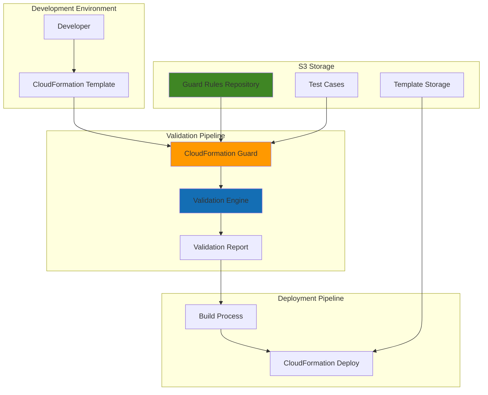

# Infrastructure Policy Validation with CloudFormation Guard

## Problem

Organizations deploying infrastructure at scale face significant challenges ensuring consistent compliance with security and governance policies across multiple teams and environments. Without automated validation, CloudFormation templates can be deployed with misconfigurations that violate organizational standards, leading to security vulnerabilities, compliance violations, and operational inconsistencies that are costly to remediate post-deployment.

## Solution

Build an automated policy-as-code validation pipeline using AWS CloudFormation Guard to enforce organizational infrastructure standards before deployment. This solution creates reusable Guard rules stored in S3, validates CloudFormation templates against these policies, and integrates validation into CI/CD workflows to prevent non-compliant infrastructure from reaching production environments.

## Architecture Diagram



## Prerequisites

1. AWS account with administrative permissions for CloudFormation, S3, and IAM
2. AWS CLI v2 installed and configured
3. CloudFormation Guard CLI v3.0+ installed locally ([Installation Guide](https://docs.aws.amazon.com/cfn-guard/latest/ug/setting-up.html))
4. Basic understanding of CloudFormation templates and policy writing
5. `jq` command-line JSON processor for report analysis
6. Estimated cost: $5-10 per month for S3 storage and CloudFormation operations

> **Note**: This recipe follows AWS Well-Architected Framework principles for operational excellence and security. See [AWS Well-Architected Framework](https://docs.aws.amazon.com/wellarchitected/latest/framework/welcome.html) for comprehensive guidance.

## Preparation

```bash
# Set environment variables
export AWS_REGION=$(aws configure get region)
export AWS_ACCOUNT_ID=$(aws sts get-caller-identity \
    --query Account --output text)

# Generate unique identifiers for resources
RANDOM_SUFFIX=$(aws secretsmanager get-random-password \
    --exclude-punctuation --exclude-uppercase \
    --password-length 6 --require-each-included-type \
    --output text --query RandomPassword)

# Set resource names
export BUCKET_NAME="cfn-guard-policies-${RANDOM_SUFFIX}"
export VALIDATION_ROLE_NAME="CloudFormationGuardValidationRole"
export STACK_NAME="cfn-guard-demo-stack"

# Create S3 bucket for storing Guard rules and templates
aws s3 mb s3://${BUCKET_NAME} --region ${AWS_REGION}

# Enable versioning on the bucket for rule history
aws s3api put-bucket-versioning \
    --bucket ${BUCKET_NAME} \
    --versioning-configuration Status=Enabled

# Enable encryption for security compliance
aws s3api put-bucket-encryption \
    --bucket ${BUCKET_NAME} \
    --server-side-encryption-configuration \
    'Rules=[{ApplyServerSideEncryptionByDefault:{SSEAlgorithm:AES256}}]'

# Block public access to ensure security
aws s3api put-public-access-block \
    --bucket ${BUCKET_NAME} \
    --public-access-block-configuration \
    "BlockPublicAcls=true,IgnorePublicAcls=true,BlockPublicPolicy=true,RestrictPublicBuckets=true"

echo "✅ AWS environment configured with bucket: ${BUCKET_NAME}"
```

## Steps

1. **Create Organizational Security Policy Rules**:

   CloudFormation Guard uses a domain-specific language (DSL) to define policy rules that validate infrastructure templates against organizational standards. These rules serve as the foundation for proactive governance, enabling teams to catch policy violations before deployment rather than discovering them in production environments.

   ```bash
   # Create directory structure for Guard rules
   mkdir -p guard-rules/security
   mkdir -p guard-rules/compliance
   mkdir -p guard-rules/cost-optimization
   
   # Create security policy rules for S3 buckets
   cat > guard-rules/security/s3-security.guard << 'EOF'
   # Rule: S3 buckets must have versioning enabled
   rule s3_bucket_versioning_enabled {
       AWS::S3::Bucket {
           Properties {
               VersioningConfiguration exists
               VersioningConfiguration {
                   Status == "Enabled"
               }
           }
       }
   }
   
   # Rule: S3 buckets must have encryption enabled
   rule s3_bucket_encryption_enabled {
       AWS::S3::Bucket {
           Properties {
               BucketEncryption exists
               BucketEncryption {
                   ServerSideEncryptionConfiguration exists
                   ServerSideEncryptionConfiguration[*] {
                       ServerSideEncryptionByDefault exists
                       ServerSideEncryptionByDefault {
                           SSEAlgorithm exists
                       }
                   }
               }
           }
       }
   }
   
   # Rule: S3 buckets must block public access
   rule s3_bucket_public_access_blocked {
       AWS::S3::Bucket {
           Properties {
               PublicAccessBlockConfiguration exists
               PublicAccessBlockConfiguration {
                   BlockPublicAcls == true
                   BlockPublicPolicy == true
                   IgnorePublicAcls == true
                   RestrictPublicBuckets == true
               }
           }
       }
   }
   
   # Rule: S3 buckets must have MFA delete enabled for production
   rule s3_bucket_mfa_delete_enabled when Tags exists {
       AWS::S3::Bucket {
           Properties {
               when Tags[*] { Key == "Environment" Value == "Production" } {
                   VersioningConfiguration {
                       MfaDelete == "Enabled"
                   }
               }
           }
       }
   }
   EOF
   
   echo "✅ Security policy rules created"
   ```

   These Guard rules implement essential security controls by validating S3 bucket configurations against organizational standards. The rules ensure versioning is enabled for data recovery, encryption protects data at rest, and public access is blocked to prevent data exposure.

2. **Create Compliance and Resource Policy Rules**:

   Compliance rules enforce organizational standards beyond security, including resource naming conventions, required tags, and cost optimization measures. These rules help maintain consistency across environments and enable effective resource management and cost tracking.

   ```bash
   # Create compliance policy rules
   cat > guard-rules/compliance/resource-compliance.guard << 'EOF'
   # Rule: Resources must have required tags
   rule resources_must_have_required_tags {
       Resources.*[ Type in ["AWS::S3::Bucket", "AWS::EC2::Instance", "AWS::Lambda::Function"] ] {
           Properties {
               Tags exists
               Tags[*] {
                   Key in ["Environment", "Team", "Project", "CostCenter"]
               }
           }
       }
   }
   
   # Rule: Resource names must follow naming convention
   rule resource_naming_convention {
       AWS::S3::Bucket {
           Properties {
               BucketName exists
               BucketName == /^[a-z0-9][a-z0-9\-]*[a-z0-9]$/
           }
       }
   }
   
   # Rule: Lambda functions must have timeout limits
   rule lambda_timeout_limit {
       AWS::Lambda::Function {
           Properties {
               Timeout exists
               Timeout <= 300
           }
       }
   }
   
   # Rule: Lambda functions must have memory limits
   rule lambda_memory_limit {
       AWS::Lambda::Function {
           Properties {
               MemorySize exists
               MemorySize <= 3008
               MemorySize >= 128
           }
       }
   }
   EOF
   
   # Create cost optimization rules
   cat > guard-rules/cost-optimization/cost-controls.guard << 'EOF'
   # Rule: EC2 instances must use approved instance types
   rule ec2_approved_instance_types {
       AWS::EC2::Instance {
           Properties {
               InstanceType in ["t3.micro", "t3.small", "t3.medium", "m5.large", "m5.xlarge", "c5.large", "c5.xlarge"]
           }
       }
   }
   
   # Rule: RDS instances must have backup retention
   rule rds_backup_retention {
       AWS::RDS::DBInstance {
           Properties {
               BackupRetentionPeriod exists
               BackupRetentionPeriod >= 7
               BackupRetentionPeriod <= 35
           }
       }
   }
   
   # Rule: RDS instances must use approved instance classes
   rule rds_approved_instance_classes {
       AWS::RDS::DBInstance {
           Properties {
               DBInstanceClass in ["db.t3.micro", "db.t3.small", "db.t3.medium", "db.m5.large", "db.m5.xlarge"]
           }
       }
   }
   EOF
   
   echo "✅ Compliance and cost optimization rules created"
   ```

   These additional rules enforce organizational governance by ensuring resources follow naming conventions, include required tags for cost allocation, and implement cost controls through approved instance types and backup policies.

3. **Create IAM Security Policy Rules**:

   IAM security rules are critical for maintaining least privilege access and preventing privilege escalation. These rules ensure that IAM roles and policies follow AWS security best practices and organizational security standards.

   ```bash
   # Create IAM security rules
   cat > guard-rules/security/iam-security.guard << 'EOF'
   # Rule: IAM roles must have assume role policy
   rule iam_role_assume_role_policy {
       AWS::IAM::Role {
           Properties {
               AssumeRolePolicyDocument exists
           }
       }
   }
   
   # Rule: IAM policies must not allow full admin access
   rule iam_no_admin_policy {
       AWS::IAM::Policy {
           Properties {
               PolicyDocument {
                   Statement[*] {
                       Effect == "Allow"
                       Action != "*"
                       Resource != "*"
                   }
               }
           }
       }
   }
   
   # Rule: IAM roles must have path prefix for organization
   rule iam_role_path_prefix {
       AWS::IAM::Role {
           Properties {
               Path exists
               Path == /^\/[a-zA-Z0-9_-]+\/$/
           }
       }
   }
   
   # Rule: IAM users should not have direct policies
   rule iam_user_no_direct_policies {
       AWS::IAM::User {
           Properties {
               Policies empty
           }
       }
   }
   EOF
   
   echo "✅ IAM security rules created"
   ```

   These IAM rules implement security best practices by enforcing proper role configuration, preventing overly permissive policies, and ensuring users receive permissions through groups rather than direct policy attachments.

4. **Create Test Cases for Guard Rules**:

   Testing Guard rules ensures they function correctly and validate expected scenarios. The built-in testing framework allows you to verify rule behavior against various input scenarios, including both compliant and non-compliant configurations, ensuring reliable policy enforcement.

   ```bash
   # Create test cases for security rules
   cat > guard-rules/security/s3-security-tests.yaml << 'EOF'
   ---
   - name: S3 bucket with all security features - PASS
     input:
       Resources:
         MyBucket:
           Type: AWS::S3::Bucket
           Properties:
             BucketName: secure-bucket-example
             VersioningConfiguration:
               Status: Enabled
             BucketEncryption:
               ServerSideEncryptionConfiguration:
                 - ServerSideEncryptionByDefault:
                     SSEAlgorithm: AES256
             PublicAccessBlockConfiguration:
               BlockPublicAcls: true
               BlockPublicPolicy: true
               IgnorePublicAcls: true
               RestrictPublicBuckets: true
     expectations:
       rules:
         s3_bucket_versioning_enabled: PASS
         s3_bucket_encryption_enabled: PASS
         s3_bucket_public_access_blocked: PASS
   
   - name: S3 bucket missing encryption - FAIL
     input:
       Resources:
         MyBucket:
           Type: AWS::S3::Bucket
           Properties:
             BucketName: insecure-bucket-example
             VersioningConfiguration:
               Status: Enabled
             PublicAccessBlockConfiguration:
               BlockPublicAcls: true
               BlockPublicPolicy: true
               IgnorePublicAcls: true
               RestrictPublicBuckets: true
     expectations:
       rules:
         s3_bucket_versioning_enabled: PASS
         s3_bucket_encryption_enabled: FAIL
         s3_bucket_public_access_blocked: PASS
   
   - name: Production S3 bucket without MFA delete - FAIL
     input:
       Resources:
         MyBucket:
           Type: AWS::S3::Bucket
           Properties:
             BucketName: production-bucket
             VersioningConfiguration:
               Status: Enabled
             BucketEncryption:
               ServerSideEncryptionConfiguration:
                 - ServerSideEncryptionByDefault:
                     SSEAlgorithm: AES256
             PublicAccessBlockConfiguration:
               BlockPublicAcls: true
               BlockPublicPolicy: true
               IgnorePublicAcls: true
               RestrictPublicBuckets: true
             Tags:
               - Key: Environment
                 Value: Production
     expectations:
       rules:
         s3_bucket_mfa_delete_enabled: FAIL
   
   - name: Empty template - SKIP
     input: {}
     expectations:
       rules:
         s3_bucket_versioning_enabled: SKIP
         s3_bucket_encryption_enabled: SKIP
         s3_bucket_public_access_blocked: SKIP
   EOF
   
   echo "✅ Test cases created for Guard rules"
   ```

   These test cases validate that Guard rules correctly identify compliant configurations (PASS), non-compliant configurations (FAIL), and irrelevant scenarios (SKIP), ensuring comprehensive policy validation coverage.

5. **Upload Guard Rules to S3 Repository**:

   Storing Guard rules in S3 creates a centralized, versioned repository that enables consistent policy enforcement across multiple environments and teams. This approach supports governance at scale by providing a single source of truth for organizational infrastructure policies.

   ```bash
   # Upload Guard rules to S3 with proper organization
   aws s3 cp guard-rules/ s3://${BUCKET_NAME}/guard-rules/ \
       --recursive --include "*.guard"
   
   # Upload test cases separately
   aws s3 cp guard-rules/ s3://${BUCKET_NAME}/test-cases/ \
       --recursive --include "*.yaml"
   
   # Create a rules manifest for versioning
   cat > rules-manifest.json << EOF
   {
       "version": "1.0",
       "created": "$(date -u +%Y-%m-%dT%H:%M:%SZ)",
       "rules": [
           {
               "category": "security",
               "file": "s3-security.guard",
               "description": "S3 security compliance rules"
           },
           {
               "category": "security",
               "file": "iam-security.guard",
               "description": "IAM security compliance rules"
           },
           {
               "category": "compliance", 
               "file": "resource-compliance.guard",
               "description": "Resource tagging and naming compliance"
           },
           {
               "category": "cost-optimization",
               "file": "cost-controls.guard", 
               "description": "Cost optimization and resource limits"
           }
       ]
   }
   EOF
   
   aws s3 cp rules-manifest.json s3://${BUCKET_NAME}/rules-manifest.json
   
   echo "✅ Guard rules uploaded to S3: s3://${BUCKET_NAME}/guard-rules/"
   ```

   The S3 repository now contains organized policy rules with versioning enabled, providing a foundation for collaborative policy management and audit trails for compliance requirements.

6. **Create Sample CloudFormation Templates for Testing**:

   Creating test templates with both compliant and non-compliant configurations enables comprehensive validation testing. These templates demonstrate how Guard rules identify policy violations and help teams understand the impact of governance policies on their infrastructure definitions.

   ```bash
   # Create a compliant CloudFormation template
   cat > compliant-template.yaml << 'EOF'
   AWSTemplateFormatVersion: '2010-09-09'
   Description: 'Compliant S3 bucket template for Guard validation'
   
   Resources:
     SecureDataBucket:
       Type: AWS::S3::Bucket
       Properties:
         BucketName: !Sub 'secure-data-bucket-${AWS::AccountId}-${AWS::Region}'
         VersioningConfiguration:
           Status: Enabled
         BucketEncryption:
           ServerSideEncryptionConfiguration:
             - ServerSideEncryptionByDefault:
                 SSEAlgorithm: AES256
         PublicAccessBlockConfiguration:
           BlockPublicAcls: true
           BlockPublicPolicy: true
           IgnorePublicAcls: true
           RestrictPublicBuckets: true
         Tags:
           - Key: Environment
             Value: Production
           - Key: Team
             Value: DataEngineering
           - Key: Project
             Value: DataLake
           - Key: CostCenter
             Value: CC-1001
   
     DataProcessingLambda:
       Type: AWS::Lambda::Function
       Properties:
         FunctionName: !Sub 'data-processing-${AWS::Region}'
         Runtime: python3.11
         Handler: index.handler
         Role: !GetAtt LambdaExecutionRole.Arn
         Code:
           ZipFile: |
             def handler(event, context):
                 return {'statusCode': 200}
         Timeout: 60
         MemorySize: 256
         Tags:
           - Key: Environment
             Value: Production
           - Key: Team
             Value: DataEngineering
           - Key: Project
             Value: DataLake
           - Key: CostCenter
             Value: CC-1001
   
     LambdaExecutionRole:
       Type: AWS::IAM::Role
       Properties:
         Path: /data-engineering/
         AssumeRolePolicyDocument:
           Version: '2012-10-17'
           Statement:
             - Effect: Allow
               Principal:
                 Service: lambda.amazonaws.com
               Action: sts:AssumeRole
         ManagedPolicyArns:
           - arn:aws:iam::aws:policy/service-role/AWSLambdaBasicExecutionRole
   
   Outputs:
     BucketName:
       Description: 'Name of the created S3 bucket'
       Value: !Ref SecureDataBucket
       Export:
         Name: !Sub '${AWS::StackName}-BucketName'
     
     LambdaFunctionName:
       Description: 'Name of the Lambda function'
       Value: !Ref DataProcessingLambda
       Export:
         Name: !Sub '${AWS::StackName}-LambdaFunctionName'
   EOF
   
   # Create a non-compliant template for testing
   cat > non-compliant-template.yaml << 'EOF'
   AWSTemplateFormatVersion: '2010-09-09'
   Description: 'Non-compliant S3 bucket template for Guard validation'
   
   Resources:
     InsecureDataBucket:
       Type: AWS::S3::Bucket
       Properties:
         BucketName: 'UPPERCASE-BUCKET-NAME'
         # Missing: VersioningConfiguration
         # Missing: BucketEncryption
         # Missing: PublicAccessBlockConfiguration
         # Missing: Required tags
   
     UnsafeLambda:
       Type: AWS::Lambda::Function
       Properties:
         FunctionName: 'unsafe-lambda'
         Runtime: python3.11
         Handler: index.handler
         Role: !GetAtt UnsafeRole.Arn
         Code:
           ZipFile: |
             def handler(event, context):
                 return {'statusCode': 200}
         Timeout: 900  # Exceeds limit
         MemorySize: 5000  # Exceeds limit
         # Missing: Required tags
   
     UnsafeRole:
       Type: AWS::IAM::Role
       Properties:
         # Missing: Path
         AssumeRolePolicyDocument:
           Version: '2012-10-17'
           Statement:
             - Effect: Allow
               Principal:
                 Service: lambda.amazonaws.com
               Action: sts:AssumeRole
         Policies:
           - PolicyName: AdminPolicy
             PolicyDocument:
               Version: '2012-10-17'
               Statement:
                 - Effect: Allow
                   Action: "*"
                   Resource: "*"
   EOF
   
   # Upload templates to S3
   aws s3 cp compliant-template.yaml s3://${BUCKET_NAME}/templates/
   aws s3 cp non-compliant-template.yaml s3://${BUCKET_NAME}/templates/
   
   echo "✅ Test templates created and uploaded to S3"
   ```

   These templates provide concrete examples of compliant and non-compliant infrastructure configurations, serving as both validation tools and educational resources for development teams.

7. **Set Up Local Guard Validation Environment**:

   Installing and configuring CloudFormation Guard locally enables developers to validate templates during development, implementing shift-left security practices that catch policy violations early in the development cycle before they reach CI/CD pipelines.

   ```bash
   # Verify Guard installation
   cfn-guard --version
   
   # Download rules from S3 for local validation
   mkdir -p local-validation
   aws s3 cp s3://${BUCKET_NAME}/guard-rules/ \
       local-validation/rules/ --recursive
   
   aws s3 cp s3://${BUCKET_NAME}/test-cases/ \
       local-validation/tests/ --recursive
   
   # Create validation script
   cat > validate-template.sh << 'EOF'
   #!/bin/bash
   
   TEMPLATE_FILE=$1
   RULES_DIR="local-validation/rules"
   
   if [ -z "$TEMPLATE_FILE" ]; then
       echo "Usage: $0 <template-file>"
       exit 1
   fi
   
   if [ ! -f "$TEMPLATE_FILE" ]; then
       echo "Template file not found: $TEMPLATE_FILE"
       exit 1
   fi
   
   echo "Validating template: $TEMPLATE_FILE"
   echo "=================================="
   
   # Validate against all rule files
   VALIDATION_FAILED=false
   
   for rule_file in $(find $RULES_DIR -name "*.guard"); do
       echo "Checking against: $(basename $rule_file)"
       if ! cfn-guard validate --data $TEMPLATE_FILE --rules $rule_file --show-summary all; then
           VALIDATION_FAILED=true
       fi
       echo ""
   done
   
   if [ "$VALIDATION_FAILED" = true ]; then
       echo "❌ Template validation failed"
       exit 1
   else
       echo "✅ Template validation passed"
       exit 0
   fi
   EOF
   
   chmod +x validate-template.sh
   
   echo "✅ Local validation environment configured"
   ```

   The local validation environment enables developers to test templates against organizational policies before committing code, reducing the feedback loop and preventing policy violations from entering the CI/CD pipeline.

8. **Test Guard Rules with Sample Templates**:

   Testing Guard rules against both compliant and non-compliant templates validates the effectiveness of your policy enforcement and helps identify any gaps in rule coverage. This step ensures that your governance policies work as intended across different scenarios.

   ```bash
   # Test the compliant template
   echo "Testing compliant template..."
   ./validate-template.sh compliant-template.yaml
   
   # Test the non-compliant template
   echo "Testing non-compliant template..."
   ./validate-template.sh non-compliant-template.yaml || echo "Expected validation failure"
   
   # Run unit tests for Guard rules
   echo "Running unit tests for Guard rules..."
   cfn-guard test --rules-file local-validation/rules/security/s3-security.guard \
       --test-data local-validation/tests/security/s3-security-tests.yaml
   
   # Generate detailed validation report
   cfn-guard validate \
       --data compliant-template.yaml \
       --rules local-validation/rules/security/s3-security.guard \
       --output-format json --show-summary all > validation-report.json
   
   # Display summary of validation results
   echo "Validation Summary:"
   echo "=================="
   cat validation-report.json | jq '.summary'
   
   echo "✅ Template validation completed"
   ```

   The validation results demonstrate how Guard rules effectively identify policy violations and provide detailed feedback to developers, enabling them to fix compliance issues before deployment.

9. **Create CI/CD Integration Script**:

   Integrating CloudFormation Guard into CI/CD pipelines ensures that all infrastructure deployments undergo automated policy validation. This integration prevents non-compliant infrastructure from reaching production environments and maintains consistent governance across all deployments.

   ```bash
   # Create CI/CD validation script
   cat > ci-cd-validation.sh << 'EOF'
   #!/bin/bash
   
   # CI/CD Pipeline Guard Validation Script
   set -e
   
   TEMPLATE_FILE=$1
   BUCKET_NAME=$2
   RULES_PREFIX="guard-rules"
   
   if [ -z "$TEMPLATE_FILE" ] || [ -z "$BUCKET_NAME" ]; then
       echo "Usage: $0 <template-file> <s3-bucket-name>"
       exit 1
   fi
   
   if [ ! -f "$TEMPLATE_FILE" ]; then
       echo "Template file not found: $TEMPLATE_FILE"
       exit 1
   fi
   
   echo "Starting CI/CD validation for: $TEMPLATE_FILE"
   echo "=============================================="
   
   # Download latest rules from S3
   mkdir -p /tmp/guard-rules
   aws s3 cp s3://${BUCKET_NAME}/${RULES_PREFIX}/ /tmp/guard-rules/ --recursive
   
   # Validate template against all rules
   VALIDATION_FAILED=false
   VALIDATION_RESULTS=""
   
   for rule_file in $(find /tmp/guard-rules -name "*.guard"); do
       echo "Validating against: $(basename $rule_file)"
       
       if cfn-guard validate --data $TEMPLATE_FILE --rules $rule_file --show-summary all; then
           echo "✅ Validation passed for: $(basename $rule_file)"
           VALIDATION_RESULTS="${VALIDATION_RESULTS}✅ $(basename $rule_file): PASS\n"
       else
           echo "❌ Validation failed for: $(basename $rule_file)"
           VALIDATION_RESULTS="${VALIDATION_RESULTS}❌ $(basename $rule_file): FAIL\n"
           VALIDATION_FAILED=true
       fi
       echo ""
   done
   
   # Generate comprehensive compliance report
   cfn-guard validate \
       --data $TEMPLATE_FILE \
       --rules /tmp/guard-rules/security/s3-security.guard \
       --output-format json --show-summary all > compliance-report.json
   
   # Upload report to S3 with timestamp
   TIMESTAMP=$(date +%Y%m%d-%H%M%S)
   aws s3 cp compliance-report.json \
       s3://${BUCKET_NAME}/reports/${TIMESTAMP}-compliance-report.json
   
   # Create summary report
   echo "Validation Summary" > validation-summary.txt
   echo "=================" >> validation-summary.txt
   echo "Template: $TEMPLATE_FILE" >> validation-summary.txt
   echo "Timestamp: $(date)" >> validation-summary.txt
   echo "Results:" >> validation-summary.txt
   echo -e "$VALIDATION_RESULTS" >> validation-summary.txt
   
   aws s3 cp validation-summary.txt \
       s3://${BUCKET_NAME}/reports/${TIMESTAMP}-validation-summary.txt
   
   # Clean up temporary files
   rm -rf /tmp/guard-rules
   
   if [ "$VALIDATION_FAILED" = true ]; then
       echo "❌ CI/CD validation failed - deployment blocked"
       echo "Check validation report: s3://${BUCKET_NAME}/reports/${TIMESTAMP}-compliance-report.json"
       exit 1
   else
       echo "✅ CI/CD validation passed - deployment approved"
       echo "Validation report: s3://${BUCKET_NAME}/reports/${TIMESTAMP}-compliance-report.json"
       exit 0
   fi
   EOF
   
   chmod +x ci-cd-validation.sh
   
   echo "✅ CI/CD integration script created"
   ```

   This CI/CD integration script provides automated validation with detailed reporting, ensuring that only compliant infrastructure templates proceed to deployment while maintaining audit trails for compliance purposes.

## Validation & Testing

1. **Verify Guard Rules Repository**:

   ```bash
   # Check S3 bucket contents
   aws s3 ls s3://${BUCKET_NAME}/ --recursive
   
   # Verify rules are properly organized
   aws s3 ls s3://${BUCKET_NAME}/guard-rules/
   
   # Check rules manifest
   aws s3 cp s3://${BUCKET_NAME}/rules-manifest.json - | jq .
   ```

   Expected output: Directory structure showing organized Guard rules by category (security, compliance, cost-optimization) with proper manifest file.

2. **Test Local Validation Environment**:

   ```bash
   # Run comprehensive validation test
   ./validate-template.sh compliant-template.yaml
   
   # Verify validation catches violations
   ./validate-template.sh non-compliant-template.yaml || echo "Expected failure - validation working correctly"
   
   # Test individual rule files
   cfn-guard validate --data compliant-template.yaml \
       --rules local-validation/rules/security/s3-security.guard \
       --show-summary all
   ```

   Expected output: Compliant template passes all rules, non-compliant template fails with specific policy violations identified.

3. **Test CI/CD Integration**:

   ```bash
   # Test CI/CD validation script
   ./ci-cd-validation.sh compliant-template.yaml ${BUCKET_NAME}
   
   # Verify failure handling
   ./ci-cd-validation.sh non-compliant-template.yaml ${BUCKET_NAME} || echo "Expected failure caught"
   
   # Check that reports were uploaded
   aws s3 ls s3://${BUCKET_NAME}/reports/
   ```

   Expected output: CI/CD script successfully validates compliant templates and blocks non-compliant ones with detailed error messages.

4. **Test Guard Rule Unit Tests**:

   ```bash
   # Run unit tests for each rule file
   for rule_file in local-validation/rules/security/*.guard; do
       test_file="${rule_file%.*}-tests.yaml"
       if [ -f "$test_file" ]; then
           echo "Testing $rule_file with $test_file"
           cfn-guard test --rules-file "$rule_file" --test-data "$test_file"
       fi
   done
   ```

   Expected output: Unit tests pass/fail/skip as expected based on test case definitions.

5. **Verify Compliance Reporting**:

   ```bash
   # Check generated reports
   ls -la validation-report.json compliance-report.json
   
   # View report contents
   cat validation-report.json | jq '.summary'
   
   # Check reports uploaded to S3
   aws s3 ls s3://${BUCKET_NAME}/reports/
   
   # Download and view a recent report
   LATEST_REPORT=$(aws s3 ls s3://${BUCKET_NAME}/reports/ \
       --query 'reverse(sort_by(Contents, &LastModified))[0].Key' \
       --output text)
   aws s3 cp s3://${BUCKET_NAME}/${LATEST_REPORT} - | jq .
   ```

   Expected output: JSON reports containing detailed validation results and compliance status for audit purposes.

## Cleanup

1. **Remove local validation files**:

   ```bash
   # Clean up local files
   rm -rf local-validation/
   rm -rf guard-rules/
   rm -f compliant-template.yaml non-compliant-template.yaml
   rm -f validate-template.sh ci-cd-validation.sh
   rm -f validation-report.json compliance-report.json validation-summary.txt
   rm -f rules-manifest.json
   
   echo "✅ Local files cleaned up"
   ```

2. **Empty and delete S3 bucket**:

   ```bash
   # Remove all objects from S3 bucket
   aws s3 rm s3://${BUCKET_NAME} --recursive
   
   # Delete the bucket
   aws s3 rb s3://${BUCKET_NAME}
   
   echo "✅ S3 bucket deleted"
   ```

3. **Clean up environment variables**:

   ```bash
   # Unset environment variables
   unset BUCKET_NAME
   unset VALIDATION_ROLE_NAME
   unset STACK_NAME
   unset RANDOM_SUFFIX
   
   echo "✅ Environment variables cleaned up"
   ```

## Discussion

CloudFormation Guard represents a significant advancement in implementing policy-as-code for infrastructure governance. Unlike traditional post-deployment compliance checks, Guard enables proactive validation that prevents policy violations from reaching production environments. The domain-specific language (DSL) provides an intuitive way to express organizational policies while maintaining the flexibility to adapt to evolving compliance requirements.

The integration of Guard rules with S3 storage creates a scalable governance model that supports large organizations with multiple teams and environments. By centralizing policy definitions in a versioned repository, organizations can maintain consistent standards across all infrastructure deployments while enabling collaborative policy development and audit trails for compliance purposes. This approach aligns with the AWS Well-Architected Framework's operational excellence pillar by promoting automation and continuous improvement in governance processes.

The shift-left approach implemented through local validation and CI/CD integration significantly reduces the cost of compliance by catching violations early in the development cycle. This approach transforms compliance from a reactive audit process into a proactive development practice that guides teams toward secure and compliant infrastructure patterns. The automated validation pipeline ensures that governance policies are consistently enforced without manual intervention, reducing the risk of human error and improving overall security posture.

CloudFormation Guard v3.0+ provides enhanced performance and reliability compared to earlier versions, with improved parsing capabilities and expanded rule syntax that enables more sophisticated policy definitions. The JSON reporting format enables integration with existing monitoring and alerting systems, providing comprehensive visibility into compliance status across the organization. Additionally, the built-in test framework ensures that policy rules remain accurate and effective as infrastructure patterns evolve.

> **Warning**: Ensure CloudFormation Guard CLI version 3.0+ is installed for compatibility with the latest rule syntax and features. Older versions may not support all validation options used in this recipe.

For comprehensive implementation guidance, refer to the [CloudFormation Guard User Guide](https://docs.aws.amazon.com/cfn-guard/latest/ug/what-is-guard.html), [AWS CloudFormation Best Practices](https://docs.aws.amazon.com/AWSCloudFormation/latest/UserGuide/best-practices.html), and the [AWS Well-Architected Framework](https://docs.aws.amazon.com/wellarchitected/latest/framework/welcome.html). Additional examples and community-contributed rules are available in the [CloudFormation Guard GitHub repository](https://github.com/aws-cloudformation/cloudformation-guard), and practical CI/CD integration patterns are demonstrated in the [AWS DevOps Blog](https://aws.amazon.com/blogs/devops/).

## Challenge

Extend this solution by implementing these enhancements:

1. **Multi-Account Policy Management**: Deploy Guard rules across multiple AWS accounts using AWS Organizations and AWS Config Conformance Packs to create centralized policy enforcement for enterprise-wide governance.

2. **Custom Rule Development**: Create domain-specific Guard rules for your organization's unique compliance requirements, such as PCI-DSS, HIPAA, or SOC 2 compliance standards using the Guard DSL.

3. **Advanced Reporting and Analytics**: Integrate Guard validation results with AWS Security Hub, AWS Config, and Amazon CloudWatch to create comprehensive compliance dashboards and automated remediation workflows using AWS Lambda.

4. **Dynamic Policy Updates**: Implement automated policy updates based on new AWS service features, security advisories, or regulatory changes using Amazon EventBridge and AWS Lambda functions.

5. **Integration with Terraform and CDK**: Extend Guard validation to support Terraform plans and AWS CDK synthesis outputs by creating custom validation workflows that enforce consistent policies across different infrastructure as code tools.

## Infrastructure Code

### Available Infrastructure as Code:

- [Infrastructure Code Overview](code/README.md) - Detailed description of all infrastructure components
- [AWS CDK (Python)](code/cdk-python/) - AWS CDK Python implementation
- [AWS CDK (TypeScript)](code/cdk-typescript/) - AWS CDK TypeScript implementation
- [CloudFormation](code/cloudformation.yaml) - AWS CloudFormation template
- [Bash CLI Scripts](code/scripts/) - Example bash scripts using AWS CLI commands to deploy infrastructure
- [Terraform](code/terraform/) - Terraform configuration files