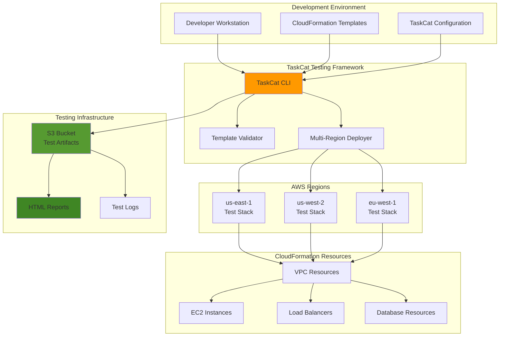

# Infrastructure Testing with TaskCat and CloudFormation

## Problem

Development teams often face challenges ensuring their AWS CloudFormation templates work reliably across different regions and environments. Manual testing across multiple regions is time-consuming and error-prone, leading to failed deployments in production environments that worked perfectly in development. Without automated infrastructure testing, teams struggle to catch configuration issues, region-specific problems, and parameter validation errors before releasing templates to production, resulting in deployment failures and costly rollbacks.

## Solution

This recipe demonstrates how to build a comprehensive infrastructure testing framework using TaskCat and CloudFormation. TaskCat automatically deploys and validates CloudFormation templates across multiple AWS regions, generates detailed testing reports, and provides parameterized testing capabilities. The solution includes automated template validation, multi-region deployment testing, and comprehensive reporting to ensure infrastructure code quality and reliability.

## Architecture Diagram



## Prerequisites

1. AWS account with appropriate permissions for CloudFormation, S3, EC2, and IAM
2. AWS CLI v2 installed and configured (or AWS CloudShell)
3. Python 3.7+ installed on local machine
4. Basic understanding of CloudFormation templates and YAML/JSON
5. Familiarity with infrastructure as code concepts
6. Estimated cost: $5-15 for testing resources (varies by region and resources tested)

> **Note**: TaskCat will create real AWS resources during testing, which may incur charges. Always run cleanup procedures after testing to avoid unexpected costs.

## Preparation

```bash
# Set environment variables
export AWS_REGION=$(aws configure get region)
export AWS_ACCOUNT_ID=$(aws sts get-caller-identity \
    --query Account --output text)

# Generate unique identifiers for resources
RANDOM_SUFFIX=$(aws secretsmanager get-random-password \
    --exclude-punctuation --exclude-uppercase \
    --password-length 6 --require-each-included-type \
    --output text --query RandomPassword)

export PROJECT_NAME="taskcat-demo-${RANDOM_SUFFIX}"
export S3_BUCKET_NAME="taskcat-artifacts-${RANDOM_SUFFIX}"

# Create S3 bucket for TaskCat artifacts
aws s3 mb s3://${S3_BUCKET_NAME} --region ${AWS_REGION}

# Create working directory structure
mkdir -p ${PROJECT_NAME}/{templates,tests,ci}
cd ${PROJECT_NAME}

echo "✅ Environment prepared with project: ${PROJECT_NAME}"
```

## Steps

1. **Install TaskCat Framework**:

   TaskCat is AWS's official testing framework for CloudFormation templates that automates multi-region deployment validation. This tool integrates with modern DevOps workflows and provides comprehensive testing capabilities that follow AWS best practices for infrastructure as code testing.

   ```bash
   # Install TaskCat using pip
   pip install taskcat
   
   # Verify installation and check version
   taskcat --version
   
   # Install additional dependencies for enhanced reporting
   pip install taskcat[console]
   
   echo "✅ TaskCat installed successfully"
   ```

   The `taskcat[console]` variant includes additional dependencies for enhanced console output and reporting features, providing better visualization of test results and more comprehensive error reporting.

2. **Create Sample CloudFormation Template**:

   We'll create a comprehensive VPC CloudFormation template that demonstrates various CloudFormation features including parameters, conditions, and outputs. This template serves as our test subject and includes multiple resource types to thoroughly validate TaskCat's multi-region testing capabilities.

   ```bash
   # Create a sample VPC template for testing
   cat > templates/vpc-template.yaml << 'EOF'
   AWSTemplateFormatVersion: '2010-09-09'
   Description: 'Sample VPC template for TaskCat testing'
   
   Parameters:
     VpcCidr:
       Type: String
       Default: '10.0.0.0/16'
       Description: 'CIDR block for VPC'
       AllowedPattern: '^(([0-9]|[1-9][0-9]|1[0-9]{2}|2[0-4][0-9]|25[0-5])\.){3}([0-9]|[1-9][0-9]|1[0-9]{2}|2[0-4][0-9]|25[0-5])(\/([0-9]|[1-2][0-9]|3[0-2]))$'
     
     EnvironmentName:
       Type: String
       Default: 'TaskCatDemo'
       Description: 'Environment name for resource tagging'
       MinLength: 1
       MaxLength: 255
     
     CreateNatGateway:
       Type: String
       Default: 'true'
       AllowedValues: ['true', 'false']
       Description: 'Create NAT Gateway for private subnets'
   
   Conditions:
     CreateNatGatewayCondition: !Equals [!Ref CreateNatGateway, 'true']
   
   Resources:
     VPC:
       Type: AWS::EC2::VPC
       Properties:
         CidrBlock: !Ref VpcCidr
         EnableDnsHostnames: true
         EnableDnsSupport: true
         Tags:
           - Key: Name
             Value: !Sub '${EnvironmentName}-VPC'
           - Key: Environment
             Value: !Ref EnvironmentName
   
     InternetGateway:
       Type: AWS::EC2::InternetGateway
       Properties:
         Tags:
           - Key: Name
             Value: !Sub '${EnvironmentName}-IGW'
   
     AttachGateway:
       Type: AWS::EC2::VPCGatewayAttachment
       Properties:
         VpcId: !Ref VPC
         InternetGatewayId: !Ref InternetGateway
   
     PublicSubnet1:
       Type: AWS::EC2::Subnet
       Properties:
         VpcId: !Ref VPC
         CidrBlock: !Select [0, !Cidr [!Ref VpcCidr, 4, 8]]
         AvailabilityZone: !Select [0, !GetAZs '']
         MapPublicIpOnLaunch: true
         Tags:
           - Key: Name
             Value: !Sub '${EnvironmentName}-Public-Subnet-1'
   
     PublicSubnet2:
       Type: AWS::EC2::Subnet
       Properties:
         VpcId: !Ref VPC
         CidrBlock: !Select [1, !Cidr [!Ref VpcCidr, 4, 8]]
         AvailabilityZone: !Select [1, !GetAZs '']
         MapPublicIpOnLaunch: true
         Tags:
           - Key: Name
             Value: !Sub '${EnvironmentName}-Public-Subnet-2'
   
     PrivateSubnet1:
       Type: AWS::EC2::Subnet
       Properties:
         VpcId: !Ref VPC
         CidrBlock: !Select [2, !Cidr [!Ref VpcCidr, 4, 8]]
         AvailabilityZone: !Select [0, !GetAZs '']
         Tags:
           - Key: Name
             Value: !Sub '${EnvironmentName}-Private-Subnet-1'
   
     PrivateSubnet2:
       Type: AWS::EC2::Subnet
       Properties:
         VpcId: !Ref VPC
         CidrBlock: !Select [3, !Cidr [!Ref VpcCidr, 4, 8]]
         AvailabilityZone: !Select [1, !GetAZs '']
         Tags:
           - Key: Name
             Value: !Sub '${EnvironmentName}-Private-Subnet-2'
   
     PublicRouteTable:
       Type: AWS::EC2::RouteTable
       Properties:
         VpcId: !Ref VPC
         Tags:
           - Key: Name
             Value: !Sub '${EnvironmentName}-Public-Routes'
   
     DefaultPublicRoute:
       Type: AWS::EC2::Route
       DependsOn: AttachGateway
       Properties:
         RouteTableId: !Ref PublicRouteTable
         DestinationCidrBlock: 0.0.0.0/0
         GatewayId: !Ref InternetGateway
   
     PublicSubnet1RouteTableAssociation:
       Type: AWS::EC2::SubnetRouteTableAssociation
       Properties:
         RouteTableId: !Ref PublicRouteTable
         SubnetId: !Ref PublicSubnet1
   
     PublicSubnet2RouteTableAssociation:
       Type: AWS::EC2::SubnetRouteTableAssociation
       Properties:
         RouteTableId: !Ref PublicRouteTable
         SubnetId: !Ref PublicSubnet2
   
     NatGateway1EIP:
       Type: AWS::EC2::EIP
       Condition: CreateNatGatewayCondition
       DependsOn: AttachGateway
       Properties:
         Domain: vpc
         Tags:
           - Key: Name
             Value: !Sub '${EnvironmentName}-NAT-EIP-1'
   
     NatGateway1:
       Type: AWS::EC2::NatGateway
       Condition: CreateNatGatewayCondition
       Properties:
         AllocationId: !GetAtt NatGateway1EIP.AllocationId
         SubnetId: !Ref PublicSubnet1
         Tags:
           - Key: Name
             Value: !Sub '${EnvironmentName}-NAT-Gateway-1'
   
     PrivateRouteTable1:
       Type: AWS::EC2::RouteTable
       Properties:
         VpcId: !Ref VPC
         Tags:
           - Key: Name
             Value: !Sub '${EnvironmentName}-Private-Routes-1'
   
     DefaultPrivateRoute1:
       Type: AWS::EC2::Route
       Condition: CreateNatGatewayCondition
       Properties:
         RouteTableId: !Ref PrivateRouteTable1
         DestinationCidrBlock: 0.0.0.0/0
         NatGatewayId: !Ref NatGateway1
   
     PrivateSubnet1RouteTableAssociation:
       Type: AWS::EC2::SubnetRouteTableAssociation
       Properties:
         RouteTableId: !Ref PrivateRouteTable1
         SubnetId: !Ref PrivateSubnet1
   
     PrivateSubnet2RouteTableAssociation:
       Type: AWS::EC2::SubnetRouteTableAssociation
       Properties:
         RouteTableId: !Ref PrivateRouteTable1
         SubnetId: !Ref PrivateSubnet2
   
   Outputs:
     VPCId:
       Description: 'VPC ID'
       Value: !Ref VPC
       Export:
         Name: !Sub '${EnvironmentName}-VPC-ID'
     
     PublicSubnets:
       Description: 'Public subnet IDs'
       Value: !Join [',', [!Ref PublicSubnet1, !Ref PublicSubnet2]]
       Export:
         Name: !Sub '${EnvironmentName}-Public-Subnets'
     
     PrivateSubnets:
       Description: 'Private subnet IDs'
       Value: !Join [',', [!Ref PrivateSubnet1, !Ref PrivateSubnet2]]
       Export:
         Name: !Sub '${EnvironmentName}-Private-Subnets'
     
     VpcCidr:
       Description: 'VPC CIDR Block'
       Value: !Ref VpcCidr
       Export:
         Name: !Sub '${EnvironmentName}-VPC-CIDR'
   EOF
   
   echo "✅ Sample CloudFormation template created"
   ```

3. **Create TaskCat Configuration File**:

   The TaskCat configuration file (`taskcat.yml`) defines how TaskCat executes tests across multiple AWS regions. This YAML configuration specifies test parameters, regional settings, and validation criteria that ensure consistent infrastructure deployment regardless of geographic location.

   ```bash
   # Create TaskCat configuration file
   cat > taskcat.yml << EOF
   project:
     name: ${PROJECT_NAME}
     owner: 'taskcat-demo@example.com'
     regions:
       - us-east-1
       - us-west-2
       - eu-west-1
     
   tests:
     vpc-basic-test:
       template: templates/vpc-template.yaml
       parameters:
         VpcCidr: '10.0.0.0/16'
         EnvironmentName: 'TaskCatBasic'
         CreateNatGateway: 'true'
     
     vpc-no-nat-test:
       template: templates/vpc-template.yaml
       parameters:
         VpcCidr: '10.1.0.0/16'
         EnvironmentName: 'TaskCatNoNat'
         CreateNatGateway: 'false'
     
     vpc-custom-cidr-test:
       template: templates/vpc-template.yaml
       parameters:
         VpcCidr: '172.16.0.0/16'
         EnvironmentName: 'TaskCatCustom'
         CreateNatGateway: 'true'
   EOF
   
   echo "✅ TaskCat configuration file created"
   ```

4. **Create Advanced Template with Dynamic Parameters**:

   This advanced template demonstrates TaskCat's dynamic parameter capabilities, which enable automatic generation of unique values during testing. Dynamic parameters prevent naming conflicts during parallel test execution and ensure isolated test environments across multiple regions.

   ```bash
   # Create an advanced template with TaskCat dynamic parameters
   cat > templates/advanced-vpc-template.yaml << 'EOF'
   AWSTemplateFormatVersion: '2010-09-09'
   Description: 'Advanced VPC template with dynamic parameters for TaskCat'
   
   Parameters:
     VpcCidr:
       Type: String
       Default: '10.0.0.0/16'
       Description: 'CIDR block for VPC'
       AllowedPattern: '^(([0-9]|[1-9][0-9]|1[0-9]{2}|2[0-4][0-9]|25[0-5])\.){3}([0-9]|[1-9][0-9]|1[0-9]{2}|2[0-4][0-9]|25[0-5])(\/([0-9]|[1-2][0-9]|3[0-2]))$'
     
     EnvironmentName:
       Type: String
       Description: 'Environment name for resource tagging'
       MinLength: 1
       MaxLength: 255
     
     KeyPairName:
       Type: AWS::EC2::KeyPair::KeyName
       Description: 'EC2 Key Pair for instances'
     
     S3BucketName:
       Type: String
       Description: 'S3 bucket name for application artifacts'
       AllowedPattern: '^[a-z0-9][a-z0-9-]*[a-z0-9]$'
       MinLength: 3
       MaxLength: 63
     
     DatabasePassword:
       Type: String
       NoEcho: true
       MinLength: 8
       MaxLength: 41
       Description: 'Database password'
       AllowedPattern: '^[a-zA-Z0-9!@#$%^&*()_+=-]*$'
   
   Resources:
     VPC:
       Type: AWS::EC2::VPC
       Properties:
         CidrBlock: !Ref VpcCidr
         EnableDnsHostnames: true
         EnableDnsSupport: true
         Tags:
           - Key: Name
             Value: !Sub '${EnvironmentName}-VPC'
           - Key: Environment
             Value: !Ref EnvironmentName
     
     ApplicationS3Bucket:
       Type: AWS::S3::Bucket
       Properties:
         BucketName: !Ref S3BucketName
         BucketEncryption:
           ServerSideEncryptionConfiguration:
             - ServerSideEncryptionByDefault:
                 SSEAlgorithm: AES256
         PublicAccessBlockConfiguration:
           BlockPublicAcls: true
           BlockPublicPolicy: true
           IgnorePublicAcls: true
           RestrictPublicBuckets: true
         VersioningConfiguration:
           Status: Enabled
         Tags:
           - Key: Name
             Value: !Sub '${EnvironmentName}-App-Bucket'
           - Key: Environment
             Value: !Ref EnvironmentName
     
     TestSecurityGroup:
       Type: AWS::EC2::SecurityGroup
       Properties:
         GroupDescription: 'Security group for testing'
         VpcId: !Ref VPC
         SecurityGroupIngress:
           - IpProtocol: tcp
             FromPort: 80
             ToPort: 80
             CidrIp: 0.0.0.0/0
             Description: 'HTTP access'
           - IpProtocol: tcp
             FromPort: 443
             ToPort: 443
             CidrIp: 0.0.0.0/0
             Description: 'HTTPS access'
         SecurityGroupEgress:
           - IpProtocol: -1
             CidrIp: 0.0.0.0/0
             Description: 'All outbound traffic'
         Tags:
           - Key: Name
             Value: !Sub '${EnvironmentName}-Test-SG'
   
   Outputs:
     VPCId:
       Description: 'VPC ID'
       Value: !Ref VPC
       Export:
         Name: !Sub '${EnvironmentName}-VPC-ID'
     
     S3BucketName:
       Description: 'S3 Bucket Name'
       Value: !Ref ApplicationS3Bucket
       Export:
         Name: !Sub '${EnvironmentName}-S3-Bucket'
     
     SecurityGroupId:
       Description: 'Security Group ID'
       Value: !Ref TestSecurityGroup
       Export:
         Name: !Sub '${EnvironmentName}-Security-Group'
     
     S3BucketArn:
       Description: 'S3 Bucket ARN'
       Value: !GetAtt ApplicationS3Bucket.Arn
       Export:
         Name: !Sub '${EnvironmentName}-S3-Bucket-ARN'
   EOF
   
   echo "✅ Advanced template created with dynamic parameters"
   ```

5. **Add Advanced TaskCat Configuration with Dynamic Parameters**:

   TaskCat provides built-in dynamic parameter functions that generate unique values at runtime. Functions like `$[taskcat_autobucket]` create globally unique S3 bucket names, while `$[taskcat_genpass_16A]` generates secure passwords, eliminating manual parameter management and ensuring test isolation.

   ```bash
   # Update TaskCat configuration with dynamic parameters
   cat >> taskcat.yml << 'EOF'
   
     vpc-dynamic-test:
       template: templates/advanced-vpc-template.yaml
       parameters:
         VpcCidr: '10.2.0.0/16'
         EnvironmentName: $[taskcat_project_name]
         KeyPairName: $[taskcat_getkeypair]
         S3BucketName: $[taskcat_autobucket]
         DatabasePassword: $[taskcat_genpass_16A]
   
     vpc-regional-test:
       template: templates/advanced-vpc-template.yaml
       parameters:
         VpcCidr: '10.3.0.0/16'
         EnvironmentName: $[taskcat_project_name]-$[taskcat_current_region]
         KeyPairName: $[taskcat_getkeypair]
         S3BucketName: $[taskcat_autobucket]
         DatabasePassword: $[taskcat_genpass_32S]
   EOF
   
   echo "✅ Advanced TaskCat configuration updated"
   ```

6. **Create Test Scripts for Validation**:

   Custom validation scripts extend TaskCat's testing capabilities beyond basic CloudFormation deployment success. These Python scripts validate resource configurations, test connectivity, and ensure deployed infrastructure meets specific business requirements and AWS best practices.

   ```bash
   # Create test scripts directory
   mkdir -p tests/validation
   
   # Create basic validation script
   cat > tests/validation/test_vpc_resources.py << 'EOF'
   #!/usr/bin/env python3
   """
   TaskCat test validation script for VPC resources
   Validates VPC configuration and resource states
   """
   
   import boto3
   import sys
   import json
   import logging
   
   # Configure logging
   logging.basicConfig(
       level=logging.INFO,
       format='%(asctime)s - %(levelname)s - %(message)s'
   )
   logger = logging.getLogger(__name__)
   
   def test_vpc_resources(stack_name, region):
       """Test VPC resources in the stack"""
       try:
           cf = boto3.client('cloudformation', region_name=region)
           ec2 = boto3.client('ec2', region_name=region)
           
           logger.info(f"Testing stack {stack_name} in region {region}")
           
           # Get stack resources
           resources = cf.describe_stack_resources(StackName=stack_name)
           
           vpc_id = None
           subnets = []
           security_groups = []
           
           # Find VPC and related resources
           for resource in resources['StackResources']:
               if resource['ResourceType'] == 'AWS::EC2::VPC':
                   vpc_id = resource['PhysicalResourceId']
               elif resource['ResourceType'] == 'AWS::EC2::Subnet':
                   subnets.append(resource['PhysicalResourceId'])
               elif resource['ResourceType'] == 'AWS::EC2::SecurityGroup':
                   security_groups.append(resource['PhysicalResourceId'])
           
           # Validate VPC
           if vpc_id:
               vpc_response = ec2.describe_vpcs(VpcIds=[vpc_id])
               vpc = vpc_response['Vpcs'][0]
               
               # Check VPC state
               if vpc['State'] != 'available':
                   logger.error(f"VPC {vpc_id} is not in available state")
                   return False
               
               # Check DNS support
               if not vpc.get('EnableDnsSupport', False):
                   logger.error(f"VPC {vpc_id} does not have DNS support enabled")
                   return False
               
               # Check DNS hostnames
               if not vpc.get('EnableDnsHostnames', False):
                   logger.error(f"VPC {vpc_id} does not have DNS hostnames enabled")
                   return False
               
               logger.info(f"✅ VPC {vpc_id} validation passed")
           else:
               logger.error("No VPC found in stack resources")
               return False
           
           # Validate subnets
           if subnets:
               subnet_response = ec2.describe_subnets(SubnetIds=subnets)
               az_count = len(set(subnet['AvailabilityZone'] for subnet in subnet_response['Subnets']))
               
               for subnet in subnet_response['Subnets']:
                   if subnet['State'] != 'available':
                       logger.error(f"Subnet {subnet['SubnetId']} is not available")
                       return False
               
               logger.info(f"✅ All {len(subnets)} subnets validation passed")
               logger.info(f"✅ Subnets distributed across {az_count} availability zones")
           else:
               logger.warning("No subnets found in stack resources")
           
           # Validate security groups
           if security_groups:
               sg_response = ec2.describe_security_groups(GroupIds=security_groups)
               for sg in sg_response['SecurityGroups']:
                   if sg['VpcId'] != vpc_id:
                       logger.error(f"Security group {sg['GroupId']} not in correct VPC")
                       return False
               
               logger.info(f"✅ All {len(security_groups)} security groups validation passed")
           
           logger.info("🎉 All validations completed successfully")
           return True
           
       except Exception as e:
           logger.error(f"❌ Test failed: {str(e)}")
           return False
   
   if __name__ == "__main__":
       if len(sys.argv) != 3:
           print("Usage: python test_vpc_resources.py <stack_name> <region>")
           sys.exit(1)
       
       stack_name = sys.argv[1]
       region = sys.argv[2]
       
       success = test_vpc_resources(stack_name, region)
       sys.exit(0 if success else 1)
   EOF
   
   chmod +x tests/validation/test_vpc_resources.py
   
   echo "✅ Validation scripts created"
   ```

7. **Run TaskCat Lint and Validation**:

   Before executing full deployment tests, we validate templates and configuration files using TaskCat's built-in linting capabilities. This proactive validation follows AWS CloudFormation best practices by implementing fail-fast testing methodology to catch issues early in the development cycle.

   ```bash
   # First, lint the CloudFormation templates
   taskcat lint
   
   # List available tests to verify configuration
   taskcat test list
   
   # Run dry-run to validate configuration without deployment
   taskcat test run --dry-run
   
   echo "✅ TaskCat validation completed"
   ```

8. **Execute TaskCat Tests**:

   This is the primary testing phase where TaskCat deploys CloudFormation templates across all specified regions simultaneously. The framework creates unique stack names, manages dynamic parameters, and coordinates deployment processes while providing real-time status updates and comprehensive logging.

   ```bash
   # Run all tests across configured regions
   taskcat test run --output-directory ./taskcat_outputs
   
   # Alternative: Run specific test
   # taskcat test run vpc-basic-test --output-directory ./taskcat_outputs
   
   # Monitor test progress and display results
   echo "✅ TaskCat tests initiated across all regions"
   echo "Check ./taskcat_outputs directory for detailed results"
   ```

9. **Configure Advanced Testing Features**:

   Advanced TaskCat features include region-specific parameter overrides and post-deployment validation scripts. These capabilities enable sophisticated testing scenarios where different regions require customized configurations or additional validation beyond basic deployment success.

   ```bash
   # Create parameter override file for specific regions
   cat > tests/us-east-1-params.json << 'EOF'
   {
     "Parameters": {
       "VpcCidr": "10.10.0.0/16",
       "EnvironmentName": "USEast1Test"
     }
   }
   EOF
   
   # Create region-specific configuration
   cat > taskcat-advanced.yml << 'EOF'
   project:
     name: advanced-taskcat-demo
     owner: 'advanced-demo@example.com'
     package_lambda: true
     regions:
       - us-east-1
       - us-west-2
       - eu-west-1
       - ap-southeast-1
   
   tests:
     vpc-performance-test:
       template: templates/advanced-vpc-template.yaml
       parameters:
         VpcCidr: '10.4.0.0/16'
         EnvironmentName: 'PerfTest'
         KeyPairName: $[taskcat_getkeypair]
         S3BucketName: $[taskcat_autobucket]
         DatabasePassword: $[taskcat_genpass_16A]
       regions:
         - us-east-1
         - us-west-2
   EOF
   
   echo "✅ Advanced testing configuration created"
   ```

10. **Generate and View Test Reports**:

    TaskCat generates comprehensive HTML reports providing detailed insights into test execution, including stack events, resource outputs, deployment timelines, and failure analysis. These reports are essential for understanding test results, troubleshooting deployment issues, and ensuring compliance with AWS Well-Architected Framework principles.

    ```bash
    # Generate HTML report with detailed logging
    taskcat test run --output-directory ./reports \
        --keep-successful
    
    # List generated reports and artifacts
    ls -la ./reports/
    
    # View test results summary
    if [ -f "./reports/index.html" ]; then
        echo "✅ Test report generated at: ./reports/index.html"
        echo "Open the HTML file in your browser to view detailed results"
    fi
    
    # Display test summary from JSON reports
    echo "TaskCat Test Summary:"
    echo "===================="
    find ./reports -name "*.json" -exec basename {} \; | \
        head -5 | while read file; do
        echo "- Report: $file"
    done
    
    # Show stack outputs if available
    if [ -f "./reports/taskcat_report.json" ]; then
        echo "Stack outputs available in taskcat_report.json"
    fi
    ```

## Validation & Testing

1. **Verify TaskCat Installation and Configuration**:

   ```bash
   # Check TaskCat version and available commands
   taskcat --version
   taskcat --help
   
   # Validate configuration file syntax
   taskcat test list
   ```

   Expected output: TaskCat version information and list of configured tests

2. **Validate CloudFormation Template Syntax**:

   ```bash
   # Use AWS CLI to validate template syntax
   aws cloudformation validate-template \
       --template-body file://templates/vpc-template.yaml
   
   # Check for template linting issues using TaskCat
   taskcat lint templates/vpc-template.yaml
   ```

   Expected output: No syntax errors and successful validation with clean linting results

3. **Test Multi-Region Deployment Configuration**:

   ```bash
   # Check test execution configuration
   taskcat test run --dry-run
   
   # Verify test results directory structure
   ls -la ./taskcat_outputs/
   find ./taskcat_outputs -name "*test-results*" 2>/dev/null || \
       echo "No test results found - run actual tests first"
   ```

   Expected output: Successful dry-run validation and proper directory structure

4. **Verify Test Reports and Detailed Logs**:

   ```bash
   # Check generated reports and artifacts
   find ./reports -name "*.html" -o -name "*.json" 2>/dev/null || \
       echo "No reports found - run tests with --output-directory first"
   
   # Display test summary from JSON reports if available
   if [ -f "./reports/taskcat_report.json" ]; then
       cat ./reports/taskcat_report.json | \
           python3 -m json.tool | head -20
   else
       echo "No JSON report found - run tests to generate reports"
   fi
   ```

   Expected output: HTML reports and JSON test results with comprehensive pass/fail status

## Cleanup

1. **Delete Test Stacks from All Regions**:

   ```bash
   # Use TaskCat to clean up test stacks across all regions
   taskcat test clean --project-root .
   
   # Wait for cleanup completion
   sleep 30
   
   # Alternative: Manual cleanup of specific stacks if needed
   # for region in us-east-1 us-west-2 eu-west-1; do
   #     aws cloudformation delete-stack \
   #         --stack-name taskcat-demo-vpc-basic-test \
   #         --region $region
   # done
   
   echo "✅ Test stacks deletion initiated across all regions"
   ```

2. **Remove S3 Bucket and All Artifacts**:

   ```bash
   # Empty and delete S3 bucket completely
   aws s3 rm s3://${S3_BUCKET_NAME} --recursive
   aws s3 rb s3://${S3_BUCKET_NAME}
   
   echo "✅ S3 bucket and all artifacts removed"
   ```

3. **Clean Up Local Files and Environment**:

   ```bash
   # Remove generated files and directories
   cd ..
   rm -rf ${PROJECT_NAME}
   
   # Clean up environment variables
   unset PROJECT_NAME
   unset S3_BUCKET_NAME
   unset RANDOM_SUFFIX
   unset AWS_REGION
   unset AWS_ACCOUNT_ID
   
   echo "✅ Local files and environment variables cleaned up"
   ```

## Discussion

TaskCat provides a robust framework for automating CloudFormation template testing across multiple AWS regions, addressing the critical need for infrastructure code validation in modern DevOps workflows. Following AWS CloudFormation best practices, TaskCat implements fail-fast testing methodology that helps teams discover potential syntax and configuration issues early in the development cycle, reducing rework time and increasing confidence in successful provisioning operations.

The framework's ability to deploy and test templates simultaneously across different regions ensures that infrastructure code works consistently regardless of deployment location, catching region-specific issues such as AMI availability, service limitations, and compliance requirements. This multi-region validation approach aligns with AWS Well-Architected Framework principles, particularly the Reliability pillar, by ensuring infrastructure can be deployed consistently across geographic boundaries.

TaskCat's dynamic parameter system is particularly powerful for enterprise environments, allowing teams to generate random values, fetch existing resources, and create context-aware test configurations. Features like `$[taskcat_autobucket]` for globally unique S3 bucket names, `$[taskcat_genpass_16A]` for secure password generation, and `$[taskcat_getkeypair]` for EC2 key pair management eliminate manual parameter management while ensuring each test run uses unique values. This approach prevents resource conflicts and enables parallel testing across multiple regions without namespace collisions.

The framework integrates seamlessly with CI/CD pipelines and supports custom validation scripts, making it suitable for complex enterprise environments where infrastructure testing requirements extend beyond simple resource creation validation. TaskCat generates comprehensive HTML reports with detailed logs, stack outputs, and visual dashboards that provide clear visibility into test results, enabling teams to quickly identify and resolve deployment issues. For more information on CloudFormation testing best practices, see the [AWS CloudFormation Best Practices Guide](https://docs.aws.amazon.com/AWSCloudFormation/latest/UserGuide/best-practices.html).

> **Tip**: Use TaskCat's `--keep-successful` flag during development to preserve successful test stacks for investigation, but always ensure cleanup procedures are executed to avoid ongoing charges. The framework also supports integration with AWS Config rules for compliance validation.

## Challenge

Extend this infrastructure testing solution by implementing these enhancements:

1. **CI/CD Pipeline Integration**: Set up automated TaskCat testing in AWS CodePipeline with GitHub integration, including automated test execution on pull requests, deployment blocking for failed tests, and integration with AWS CodeBuild for containerized testing environments.

2. **Advanced Custom Validation Scripts**: Create comprehensive validation scripts that test application-specific functionality, security configurations, performance metrics, and compliance requirements using AWS APIs, including integration with AWS Config rules and Security Hub findings.

3. **Multi-Account Testing Strategy**: Configure TaskCat to test infrastructure deployments across multiple AWS accounts representing different environments (development, staging, production) with appropriate cross-account IAM roles and organizational unit policies.

4. **Performance Benchmarking and Monitoring**: Implement performance testing that measures CloudFormation deployment times across regions, tracks template efficiency improvements or regressions, and integrates with AWS CloudWatch for ongoing monitoring.

5. **Security Compliance Automation**: Integrate AWS Config rules, Security Hub checks, and AWS Well-Architected Tool assessments into TaskCat workflows to validate security compliance, governance policies, and architectural best practices as part of automated infrastructure testing.

## Infrastructure Code

*Infrastructure code will be generated after recipe approval.*