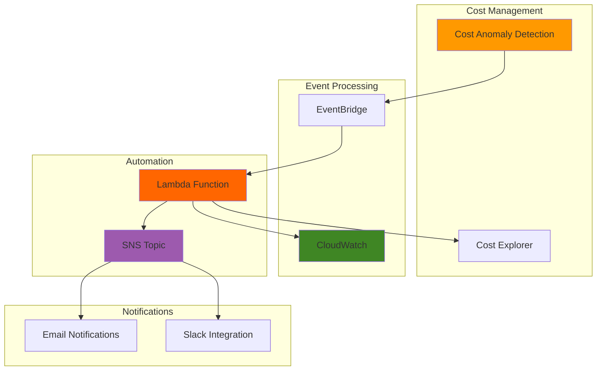

# Intelligent Cost Anomaly Detection

## Problem

Organizations struggle with unexpected AWS billing spikes that go unnoticed until monthly bills arrive, often causing budget overruns and requiring time-consuming manual investigation to identify root causes. Traditional static billing alerts lack the sophistication to distinguish between normal spending patterns and actual anomalies, leading to alert fatigue from false positives or missed genuine cost deviations that could indicate security breaches, misconfigured services, or operational inefficiencies.

## Solution

AWS Cost Anomaly Detection combined with CloudWatch metrics and Lambda automation creates an intelligent cost monitoring system that learns spending patterns and triggers immediate notifications for unusual activity. This machine learning-driven approach enables proactive cost management by automatically analyzing historical spending patterns, detecting deviations using statistical algorithms, and triggering customizable response workflows through Lambda functions and SNS notifications for rapid incident response and cost optimization.

## Architecture Diagram



## Prerequisites

1. AWS account with appropriate permissions for Cost Explorer, CloudWatch, Lambda, SNS, and EventBridge
2. AWS CLI v2 installed and configured (or AWS CloudShell)
3. Basic understanding of AWS cost management and billing concepts
4. At least 24 hours of AWS usage history for anomaly detection training
5. Estimated cost: $5-15/month for CloudWatch metrics, Lambda executions, and SNS notifications

> **Note**: Cost Anomaly Detection service is free, but associated services like CloudWatch custom metrics and Lambda invocations incur standard charges according to the [AWS Pricing Calculator](https://calculator.aws/).

## Preparation

Setting up the foundation for cost anomaly detection requires proper environment configuration and verification of billing access permissions. This preparation ensures all subsequent steps can execute successfully while establishing secure resource naming conventions.

```bash
# Set environment variables
export AWS_REGION=$(aws configure get region)
export AWS_ACCOUNT_ID=$(aws sts get-caller-identity \
    --query Account --output text)

# Generate unique identifiers for resources
RANDOM_SUFFIX=$(aws secretsmanager get-random-password \
    --exclude-punctuation --exclude-uppercase \
    --password-length 6 --require-each-included-type \
    --output text --query RandomPassword)

# Set resource names
export MONITOR_NAME="cost-anomaly-monitor-${RANDOM_SUFFIX}"
export DETECTOR_NAME="cost-anomaly-detector-${RANDOM_SUFFIX}"
export FUNCTION_NAME="cost-anomaly-processor-${RANDOM_SUFFIX}"
export SNS_TOPIC="cost-anomaly-alerts-${RANDOM_SUFFIX}"
export ROLE_NAME="CostAnomalyLambdaRole-${RANDOM_SUFFIX}"

# Verify Cost Explorer is enabled
aws ce get-rightsizing-recommendation \
    --service "AmazonEC2" \
    --configuration "CrossInstanceFamily=INCLUDE,BuyingOption=ON_DEMAND" \
    --page-size 1 \
    2>/dev/null || echo "✅ Cost Explorer access verified"

echo "✅ Environment prepared with region: ${AWS_REGION}"
```

## Steps

1. **Create SNS Topic for Cost Anomaly Notifications**:

   Amazon SNS provides reliable, scalable messaging for cost anomaly alerts, enabling immediate notification delivery to multiple endpoints including email, SMS, and custom webhook integrations. SNS topics serve as the central communication hub for distributed notification systems, supporting fan-out patterns that deliver critical cost alerts to finance teams, operations staff, and automated systems simultaneously. Creating a dedicated topic for cost anomalies allows for centralized notification management and supports future integration with incident management systems like PagerDuty or ServiceNow.

   ```bash
   # Create SNS topic for cost anomaly alerts
   aws sns create-topic \
       --name ${SNS_TOPIC} \
       --attributes "DisplayName=Cost Anomaly Alerts"
   
   # Store SNS topic ARN
   export SNS_TOPIC_ARN=$(aws sns get-topic-attributes \
       --topic-arn "arn:aws:sns:${AWS_REGION}:${AWS_ACCOUNT_ID}:${SNS_TOPIC}" \
       --query "Attributes.TopicArn" --output text)
   
   echo "✅ SNS topic created: ${SNS_TOPIC_ARN}"
   ```

   The SNS topic is now established as the central communication hub for cost anomaly notifications. This foundation enables flexible notification routing and supports multiple subscription types for different stakeholder groups requiring cost alerts, providing the messaging infrastructure needed for enterprise-scale cost management operations.

2. **Subscribe Email Address to SNS Topic**:

   Email subscriptions provide immediate visibility into cost anomalies for finance and operations teams, ensuring critical cost alerts reach responsible stakeholders without delay. SNS email subscriptions support HTML and text formatting, enabling rich notification content that includes charts, links to AWS console dashboards, and detailed cost breakdowns. This step establishes the primary notification channel while maintaining the flexibility to add additional subscription types such as SMS, Lambda functions, or HTTP endpoints for advanced automation workflows.

   ```bash
   # Subscribe email to SNS topic (replace with your email)
   read -p "Enter email address for cost alerts: " EMAIL_ADDRESS
   
   aws sns subscribe \
       --topic-arn ${SNS_TOPIC_ARN} \
       --protocol email \
       --notification-endpoint ${EMAIL_ADDRESS}
   
   echo "✅ Email subscription created - check inbox for confirmation"
   echo "Please confirm the subscription in your email before proceeding"
   read -p "Press Enter after confirming email subscription..."
   ```

   The email subscription is now active and ready to receive cost anomaly notifications. Confirming the subscription ensures reliable delivery of critical cost alerts to the designated recipients, establishing the human notification pathway essential for rapid incident response and cost management decision-making.

3. **Create IAM Role for Lambda Function**:

   IAM roles following the principle of least privilege enable secure Lambda execution with only the necessary permissions for cost analysis and notification management. This security-first approach ensures automated cost monitoring systems operate within controlled access boundaries while maintaining the flexibility to access billing APIs, publish CloudWatch metrics, and send notifications. The Lambda service assumes this role during function execution, providing temporary credentials that enable secure interaction with AWS services without embedding long-term access keys in function code.

   ```bash
   # Create trust policy for Lambda
   cat > lambda-trust-policy.json << EOF
   {
       "Version": "2012-10-17",
       "Statement": [
           {
               "Effect": "Allow",
               "Principal": {
                   "Service": "lambda.amazonaws.com"
               },
               "Action": "sts:AssumeRole"
           }
       ]
   }
   EOF
   
   # Create IAM role
   aws iam create-role \
       --role-name ${ROLE_NAME} \
       --assume-role-policy-document file://lambda-trust-policy.json \
       --description "Role for Cost Anomaly Lambda Function"
   
   # Store role ARN
   export LAMBDA_ROLE_ARN=$(aws iam get-role \
       --role-name ${ROLE_NAME} \
       --query "Role.Arn" --output text)
   
   echo "✅ IAM role created: ${LAMBDA_ROLE_ARN}"
   ```

   The IAM role foundation is now established with proper trust relationships that enable Lambda service integration. This security configuration ensures the Lambda function can operate with controlled access to AWS services required for cost anomaly processing while maintaining compliance with enterprise security standards and AWS security best practices.

4. **Attach Policies to Lambda Role**:

   Attaching specific managed and custom policies provides the Lambda function with precise permissions for cost analysis operations. The AWS managed policy `AWSLambdaBasicExecutionRole` enables CloudWatch Logs access for function monitoring and troubleshooting, while custom policies grant targeted access to Cost Explorer APIs for billing data retrieval, CloudWatch metrics for custom monitoring, and SNS for alert notifications. This layered permission approach ensures comprehensive functionality while maintaining security boundaries.

   ```bash
   # Attach basic Lambda execution policy
   aws iam attach-role-policy \
       --role-name ${ROLE_NAME} \
       --policy-arn "arn:aws:iam::aws:policy/service-role/AWSLambdaBasicExecutionRole"
   
   # Create custom policy for cost operations
   cat > cost-anomaly-policy.json << EOF
   {
       "Version": "2012-10-17",
       "Statement": [
           {
               "Effect": "Allow",
               "Action": [
                   "ce:GetCostAndUsage",
                   "ce:GetUsageReport",
                   "ce:GetDimensionValues",
                   "ce:GetReservationCoverage",
                   "ce:GetReservationPurchaseRecommendation",
                   "ce:GetReservationUtilization"
               ],
               "Resource": "*"
           },
           {
               "Effect": "Allow",
               "Action": [
                   "cloudwatch:PutMetricData",
                   "cloudwatch:GetMetricStatistics"
               ],
               "Resource": "*"
           },
           {
               "Effect": "Allow",
               "Action": [
                   "sns:Publish"
               ],
               "Resource": "${SNS_TOPIC_ARN}"
           }
       ]
   }
   EOF
   
   # Create and attach custom policy
   aws iam create-policy \
       --policy-name "CostAnomalyPolicy-${RANDOM_SUFFIX}" \
       --policy-document file://cost-anomaly-policy.json
   
   aws iam attach-role-policy \
       --role-name ${ROLE_NAME} \
       --policy-arn "arn:aws:iam::${AWS_ACCOUNT_ID}:policy/CostAnomalyPolicy-${RANDOM_SUFFIX}"
   
   echo "✅ Policies attached to Lambda role"
   ```

   The Lambda role now has comprehensive permissions for cost analysis operations, enabling secure access to billing APIs and notification services while maintaining the principle of least privilege. This configuration provides the function with exactly the permissions needed for cost anomaly processing without over-permissioning that could create security risks.

5. **Create Lambda Function for Cost Anomaly Processing**:

   The Lambda function serves as the intelligent processor for cost anomaly events, providing enhanced analysis capabilities beyond basic notifications. This serverless compute approach automatically scales to handle cost processing workloads while integrating seamlessly with existing FinOps workflows. The function enriches basic anomaly notifications with detailed cost breakdowns, root cause analysis, and custom CloudWatch metrics that enable historical trend analysis and operational dashboards.

   ```bash
   # Create Lambda function code
   cat > lambda_function.py << 'EOF'
   import json
   import boto3
   import os
   from datetime import datetime, timedelta
   from decimal import Decimal
   
   def lambda_handler(event, context):
       """
       Process Cost Anomaly Detection events with enhanced analysis
       """
       print(f"Received event: {json.dumps(event, indent=2)}")
       
       # Initialize AWS clients
       ce_client = boto3.client('ce')
       cloudwatch = boto3.client('cloudwatch')
       sns = boto3.client('sns')
       
       try:
           # Extract anomaly details from EventBridge event
           detail = event['detail']
           anomaly_id = detail['anomalyId']
           total_impact = detail['impact']['totalImpact']
           account_name = detail['accountName']
           dimension_value = detail.get('dimensionValue', 'N/A')
           
           # Calculate percentage impact
           total_actual = detail['impact']['totalActualSpend']
           total_expected = detail['impact']['totalExpectedSpend']
           impact_percentage = detail['impact']['totalImpactPercentage']
           
           # Get additional cost breakdown
           cost_breakdown = get_cost_breakdown(ce_client, detail)
           
           # Publish custom CloudWatch metrics
           publish_metrics(cloudwatch, anomaly_id, total_impact, impact_percentage)
           
           # Send enhanced notification
           send_enhanced_notification(sns, detail, cost_breakdown)
           
           return {
               'statusCode': 200,
               'body': json.dumps({
                   'message': f'Successfully processed anomaly {anomaly_id}',
                   'total_impact': float(total_impact),
                   'impact_percentage': float(impact_percentage)
               })
           }
           
       except Exception as e:
           print(f"Error processing anomaly: {str(e)}")
           return {
               'statusCode': 500,
               'body': json.dumps({'error': str(e)})
           }
   
   def get_cost_breakdown(ce_client, detail):
       """Get detailed cost breakdown for the anomaly period"""
       try:
           end_date = detail['anomalyEndDate'][:10]  # YYYY-MM-DD
           start_date = detail['anomalyStartDate'][:10]
           
           # Get cost and usage data
           response = ce_client.get_cost_and_usage(
               TimePeriod={
                   'Start': start_date,
                   'End': end_date
               },
               Granularity='DAILY',
               Metrics=['BlendedCost', 'UsageQuantity'],
               GroupBy=[
                   {'Type': 'DIMENSION', 'Key': 'SERVICE'}
               ]
           )
           
           return response.get('ResultsByTime', [])
           
       except Exception as e:
           print(f"Error getting cost breakdown: {str(e)}")
           return []
   
   def publish_metrics(cloudwatch, anomaly_id, total_impact, impact_percentage):
       """Publish custom CloudWatch metrics for anomaly tracking"""
       try:
           cloudwatch.put_metric_data(
               Namespace='AWS/CostAnomaly',
               MetricData=[
                   {
                       'MetricName': 'AnomalyImpact',
                       'Value': float(total_impact),
                       'Unit': 'None',
                       'Dimensions': [
                           {
                               'Name': 'AnomalyId',
                               'Value': anomaly_id
                           }
                       ]
                   },
                   {
                       'MetricName': 'AnomalyPercentage',
                       'Value': float(impact_percentage),
                       'Unit': 'Percent',
                       'Dimensions': [
                           {
                               'Name': 'AnomalyId',
                               'Value': anomaly_id
                           }
                       ]
                   }
               ]
           )
           print("✅ Custom metrics published to CloudWatch")
           
       except Exception as e:
           print(f"Error publishing metrics: {str(e)}")
   
   def send_enhanced_notification(sns, detail, cost_breakdown):
       """Send enhanced notification with detailed analysis"""
       try:
           # Format the notification message
           message = format_notification_message(detail, cost_breakdown)
           
           # Publish to SNS
           response = sns.publish(
               TopicArn=os.environ['SNS_TOPIC_ARN'],
               Subject=f"🚨 AWS Cost Anomaly Detected - ${detail['impact']['totalImpact']:.2f}",
               Message=message
           )
           
           print(f"✅ Notification sent: {response['MessageId']}")
           
       except Exception as e:
           print(f"Error sending notification: {str(e)}")
   
   def format_notification_message(detail, cost_breakdown):
       """Format detailed notification message"""
       impact = detail['impact']
       
       message = f"""
   AWS Cost Anomaly Detection Alert
   ================================
   
   Anomaly ID: {detail['anomalyId']}
   Account: {detail['accountName']}
   Service: {detail.get('dimensionValue', 'Multiple Services')}
   
   Cost Impact:
   - Total Impact: ${impact['totalImpact']:.2f}
   - Actual Spend: ${impact['totalActualSpend']:.2f}
   - Expected Spend: ${impact['totalExpectedSpend']:.2f}
   - Percentage Increase: {impact['totalImpactPercentage']:.1f}%
   
   Period:
   - Start: {detail['anomalyStartDate']}
   - End: {detail['anomalyEndDate']}
   
   Anomaly Score:
   - Current: {detail['anomalyScore']['currentScore']:.3f}
   - Maximum: {detail['anomalyScore']['maxScore']:.3f}
   
   Root Causes:
   """
       
       # Add root cause analysis
       for cause in detail.get('rootCauses', []):
           message += f"""
   - Account: {cause.get('linkedAccountName', 'N/A')}
     Service: {cause.get('service', 'N/A')}
     Region: {cause.get('region', 'N/A')}
     Usage Type: {cause.get('usageType', 'N/A')}
     Contribution: ${cause.get('impact', {}).get('contribution', 0):.2f}
   """
       
       message += f"""
   
   Next Steps:
   1. Review the affected services and usage patterns
   2. Check for any unauthorized usage or misconfigurations
   3. Consider implementing cost controls if needed
   4. Monitor for additional anomalies
   
   AWS Console Links:
   - Cost Explorer: https://console.aws.amazon.com/billing/home#/costexplorer
   - Cost Anomaly Detection: https://console.aws.amazon.com/billing/home#/anomaly-detection
   
   Generated by: AWS Cost Anomaly Detection Lambda
   Timestamp: {datetime.now().isoformat()}
       """
       
       return message
   EOF
   
   # Create deployment package
   zip lambda-deployment.zip lambda_function.py
   
   # Create Lambda function
   aws lambda create-function \
       --function-name ${FUNCTION_NAME} \
       --runtime python3.9 \
       --role ${LAMBDA_ROLE_ARN} \
       --handler lambda_function.lambda_handler \
       --zip-file fileb://lambda-deployment.zip \
       --timeout 300 \
       --memory-size 256 \
       --environment "Variables={SNS_TOPIC_ARN=${SNS_TOPIC_ARN}}" \
       --description "Enhanced Cost Anomaly Detection processor"
   
   # Wait for function to be ready
   aws lambda wait function-active \
       --function-name ${FUNCTION_NAME}
   
   echo "✅ Lambda function created: ${FUNCTION_NAME}"
   ```

   The Lambda function is now deployed with comprehensive cost analysis capabilities that transform basic anomaly events into actionable intelligence. This intelligent processor enhances basic anomaly notifications with detailed cost breakdowns, custom metrics, and actionable insights that enable FinOps teams to rapidly identify, analyze, and respond to cost deviations with precision and context.

6. **Create Cost Anomaly Monitor**:

   AWS Cost Anomaly Detection monitors use advanced machine learning algorithms to establish baseline spending patterns and identify deviations that indicate unusual cost activities. These monitors continuously analyze historical billing data to understand normal spending behaviors across different dimensions such as services, accounts, and usage types. Creating a comprehensive monitor enables automatic detection of spending anomalies while providing granular control over detection sensitivity and notification thresholds that align with business requirements.

   ```bash
   # Create Cost Anomaly Detection monitor
   aws ce create-anomaly-monitor \
       --anomaly-monitor '{
           "MonitorName": "'${MONITOR_NAME}'",
           "MonitorType": "DIMENSIONAL",
           "MonitorSpecification": {
               "Dimension": "SERVICE",
               "MatchOptions": ["EQUALS"],
               "Values": ["Amazon Elastic Compute Cloud - Compute"]
           },
           "MonitorDimension": "SERVICE"
       }'
   
   # Get monitor ARN
   export MONITOR_ARN=$(aws ce get-anomaly-monitors \
       --monitor-arn-list \
       --query "AnomalyMonitors[?MonitorName=='${MONITOR_NAME}'].MonitorArn" \
       --output text)
   
   echo "✅ Cost Anomaly Monitor created: ${MONITOR_ARN}"
   ```

   The cost anomaly monitor is now established and actively learning spending patterns specific to Amazon EC2 compute services. This ML-powered system continuously analyzes cost data to identify deviations from normal spending behavior, providing the intelligence foundation for automated cost anomaly detection and response workflows.

7. **Create EventBridge Rule for Cost Anomalies**:

   Amazon EventBridge rules enable real-time event processing for cost anomalies, providing immediate trigger mechanisms for automated response workflows. EventBridge serves as the central nervous system for event-driven architectures, routing cost anomaly events from AWS Cost Anomaly Detection to Lambda functions for intelligent processing. This event-driven architecture ensures rapid detection and response to cost anomalies while maintaining scalable, serverless operations that integrate seamlessly with existing AWS services and third-party systems.

   ```bash
   # Create EventBridge rule for Cost Anomaly Detection
   aws events put-rule \
       --name "cost-anomaly-rule-${RANDOM_SUFFIX}" \
       --event-pattern '{
           "source": ["aws.ce"],
           "detail-type": ["Anomaly Detected"]
       }' \
       --description "Rule to capture Cost Anomaly Detection events"
   
   # Add Lambda function as target
   aws events put-targets \
       --rule "cost-anomaly-rule-${RANDOM_SUFFIX}" \
       --targets "Id"="1","Arn"="arn:aws:lambda:${AWS_REGION}:${AWS_ACCOUNT_ID}:function:${FUNCTION_NAME}"
   
   # Grant EventBridge permission to invoke Lambda
   aws lambda add-permission \
       --function-name ${FUNCTION_NAME} \
       --statement-id "cost-anomaly-eventbridge" \
       --action lambda:InvokeFunction \
       --principal events.amazonaws.com \
       --source-arn "arn:aws:events:${AWS_REGION}:${AWS_ACCOUNT_ID}:rule/cost-anomaly-rule-${RANDOM_SUFFIX}"
   
   echo "✅ EventBridge rule configured for cost anomaly events"
   ```

   The EventBridge integration is now active and ready to trigger Lambda processing for any detected cost anomalies. This event-driven architecture ensures immediate response to cost deviations with automated analysis and notification capabilities, creating a seamless flow from anomaly detection through intelligent processing to stakeholder notification.

8. **Create Cost Anomaly Detector with SNS Integration**:

   Cost Anomaly Detectors define the notification preferences and thresholds for anomaly alerts, enabling customizable sensitivity levels and notification channels. Detectors serve as the configuration layer that determines when anomalies trigger alerts, how notifications are delivered, and which stakeholders receive different types of cost alerts. This configuration establishes the monitoring parameters that balance sensitivity with practical alert management, reducing false positives while ensuring genuine cost deviations are promptly identified and communicated.

   ```bash
   # Create Cost Anomaly Detector
   aws ce create-anomaly-detector \
       --anomaly-detector '{
           "DetectorName": "'${DETECTOR_NAME}'",
           "MonitorArnList": ["'${MONITOR_ARN}'"],
           "Subscribers": [
               {
                   "Address": "'${SNS_TOPIC_ARN}'",
                   "Type": "SNS",
                   "Status": "CONFIRMED"
               }
           ],
           "Threshold": 10.0,
           "Frequency": "IMMEDIATE"
       }'
   
   # Store detector ARN
   export DETECTOR_ARN=$(aws ce get-anomaly-detectors \
       --detector-arn-list \
       --query "AnomalyDetectors[?DetectorName=='${DETECTOR_NAME}'].DetectorArn" \
       --output text)
   
   echo "✅ Cost Anomaly Detector created: ${DETECTOR_ARN}"
   ```

   The cost anomaly detector is now active with immediate notification capabilities configured for cost deviations exceeding the $10 threshold. This intelligent monitoring system will trigger alerts for significant cost deviations while learning normal spending patterns over time, providing increasingly accurate anomaly detection as historical data accumulates.

9. **Create CloudWatch Dashboard for Cost Monitoring**:

   CloudWatch dashboards provide centralized visibility into cost anomaly metrics and trends, enabling proactive monitoring and historical analysis of spending patterns. These operational dashboards consolidate cost metrics, anomaly frequencies, and impact measurements in a single visual interface that supports FinOps decision-making. Dashboard widgets display real-time metrics from custom Lambda functions and AWS services, creating a comprehensive view of cost anomaly detection system performance and business impact.

   ```bash
   # Create CloudWatch dashboard for cost monitoring
   cat > dashboard-config.json << EOF
   {
       "widgets": [
           {
               "type": "metric",
               "x": 0,
               "y": 0,
               "width": 12,
               "height": 6,
               "properties": {
                   "metrics": [
                       [ "AWS/CostAnomaly", "AnomalyImpact" ],
                       [ ".", "AnomalyPercentage" ]
                   ],
                   "period": 300,
                   "stat": "Sum",
                   "region": "${AWS_REGION}",
                   "title": "Cost Anomaly Metrics",
                   "yAxis": {
                       "left": {
                           "min": 0
                       }
                   }
               }
           },
           {
               "type": "metric",
               "x": 0,
               "y": 6,
               "width": 12,
               "height": 6,
               "properties": {
                   "metrics": [
                       [ "AWS/Lambda", "Invocations", "FunctionName", "${FUNCTION_NAME}" ],
                       [ ".", "Duration", ".", "." ],
                       [ ".", "Errors", ".", "." ]
                   ],
                   "period": 300,
                   "stat": "Sum",
                   "region": "${AWS_REGION}",
                   "title": "Lambda Function Metrics"
               }
           }
       ]
   }
   EOF
   
   # Create dashboard
   aws cloudwatch put-dashboard \
       --dashboard-name "CostAnomalyDetection-${RANDOM_SUFFIX}" \
       --dashboard-body file://dashboard-config.json
   
   echo "✅ CloudWatch dashboard created for cost monitoring"
   ```

   The CloudWatch dashboard is now available for monitoring cost anomaly trends and Lambda function performance. This centralized operational view enables teams to track anomaly patterns, system health, and cost impact metrics in real-time, providing the visibility needed for effective FinOps management and continuous optimization of cost monitoring systems.

## Validation & Testing

1. **Verify Cost Anomaly Detection Setup**:

   ```bash
   # Check anomaly monitors
   aws ce get-anomaly-monitors \
       --query "AnomalyMonitors[?MonitorName=='${MONITOR_NAME}']" \
       --output table
   
   # Check anomaly detectors
   aws ce get-anomaly-detectors \
       --query "AnomalyDetectors[?DetectorName=='${DETECTOR_NAME}']" \
       --output table
   ```

   Expected output: Monitor and detector should show "ACTIVE" status with proper configuration.

2. **Test Lambda Function**:

   ```bash
   # Create test event for Lambda function
   cat > test-event.json << EOF
   {
       "version": "0",
       "id": "test-event",
       "source": "aws.ce",
       "detail-type": "Anomaly Detected",
       "account": "${AWS_ACCOUNT_ID}",
       "region": "${AWS_REGION}",
       "time": "$(date -u +%Y-%m-%dT%H:%M:%SZ)",
       "detail": {
           "accountName": "Test Account",
           "anomalyId": "test-anomaly-123",
           "anomalyScore": {
               "currentScore": 0.75,
               "maxScore": 0.75
           },
           "impact": {
               "totalImpact": 25.50,
               "totalActualSpend": 125.50,
               "totalExpectedSpend": 100.00,
               "totalImpactPercentage": 25.5
           },
           "anomalyStartDate": "$(date -u -d '1 day ago' +%Y-%m-%dT%H:%M:%SZ)",
           "anomalyEndDate": "$(date -u +%Y-%m-%dT%H:%M:%SZ)",
           "dimensionValue": "Amazon EC2-Instance",
           "rootCauses": [
               {
                   "service": "Amazon Elastic Compute Cloud - Compute",
                   "region": "${AWS_REGION}",
                   "usageType": "BoxUsage:t3.large",
                   "impact": {
                       "contribution": 20.50
                   }
               }
           ]
       }
   }
   EOF
   
   # Test Lambda function
   aws lambda invoke \
       --function-name ${FUNCTION_NAME} \
       --payload fileb://test-event.json \
       response.json
   
   # Check response
   cat response.json
   ```

   Expected result: Lambda function should process the test event successfully and send a notification.

3. **Verify SNS Integration**:

   ```bash
   # Check SNS topic subscriptions
   aws sns list-subscriptions-by-topic \
       --topic-arn ${SNS_TOPIC_ARN} \
       --query "Subscriptions[*].[Protocol,Endpoint,SubscriptionArn]" \
       --output table
   ```

   Expected output: Email subscription should show "Confirmed" status.

## Cleanup

1. **Remove Cost Anomaly Detection Resources**:

   ```bash
   # Delete anomaly detector
   aws ce delete-anomaly-detector \
       --detector-arn ${DETECTOR_ARN}
   
   # Delete anomaly monitor
   aws ce delete-anomaly-monitor \
       --monitor-arn ${MONITOR_ARN}
   
   echo "✅ Cost Anomaly Detection resources deleted"
   ```

2. **Remove EventBridge Rule and Targets**:

   ```bash
   # Remove targets from rule
   aws events remove-targets \
       --rule "cost-anomaly-rule-${RANDOM_SUFFIX}" \
       --ids "1"
   
   # Delete EventBridge rule
   aws events delete-rule \
       --name "cost-anomaly-rule-${RANDOM_SUFFIX}"
   
   echo "✅ EventBridge rule deleted"
   ```

3. **Delete Lambda Function and IAM Resources**:

   ```bash
   # Delete Lambda function
   aws lambda delete-function \
       --function-name ${FUNCTION_NAME}
   
   # Detach policies from IAM role
   aws iam detach-role-policy \
       --role-name ${ROLE_NAME} \
       --policy-arn "arn:aws:iam::aws:policy/service-role/AWSLambdaBasicExecutionRole"
   
   aws iam detach-role-policy \
       --role-name ${ROLE_NAME} \
       --policy-arn "arn:aws:iam::${AWS_ACCOUNT_ID}:policy/CostAnomalyPolicy-${RANDOM_SUFFIX}"
   
   # Delete custom policy
   aws iam delete-policy \
       --policy-arn "arn:aws:iam::${AWS_ACCOUNT_ID}:policy/CostAnomalyPolicy-${RANDOM_SUFFIX}"
   
   # Delete IAM role
   aws iam delete-role \
       --role-name ${ROLE_NAME}
   
   echo "✅ Lambda and IAM resources deleted"
   ```

4. **Remove SNS Topic and CloudWatch Dashboard**:

   ```bash
   # Delete SNS topic
   aws sns delete-topic \
       --topic-arn ${SNS_TOPIC_ARN}
   
   # Delete CloudWatch dashboard
   aws cloudwatch delete-dashboards \
       --dashboard-names "CostAnomalyDetection-${RANDOM_SUFFIX}"
   
   # Clean up local files
   rm -f lambda-trust-policy.json \
         cost-anomaly-policy.json \
         lambda_function.py \
         lambda-deployment.zip \
         dashboard-config.json \
         test-event.json \
         response.json
   
   echo "✅ All resources cleaned up successfully"
   ```

## Discussion

Implementing automated cost anomaly detection with AWS services creates a comprehensive FinOps solution that transforms reactive cost management into proactive optimization. This architecture leverages machine learning algorithms within AWS Cost Anomaly Detection to establish baseline spending patterns and identify deviations that indicate potential cost optimization opportunities or security concerns. The integration with EventBridge enables real-time event processing, while Lambda functions provide intelligent analysis and enriched notifications that help teams understand not just what happened, but why it matters for their business operations. For comprehensive guidance on AWS cost management best practices, see the [AWS Cost Management User Guide](https://docs.aws.amazon.com/cost-management/latest/userguide/) and [AWS Well-Architected Cost Optimization Pillar](https://docs.aws.amazon.com/wellarchitected/latest/cost-optimization-pillar/welcome.html).

The serverless architecture pattern used in this solution provides natural scaling and cost efficiency through pay-per-use pricing models. CloudWatch metrics enable historical trend analysis and alerting, while SNS integration supports flexible notification delivery to multiple stakeholders including email, SMS, and custom webhook endpoints. This design follows the [AWS Well-Architected Framework](https://docs.aws.amazon.com/wellarchitected/latest/framework/welcome.html) principles by emphasizing operational excellence through automation, reliability through managed services, and cost optimization through intelligent monitoring. The Lambda-based processing enables custom business logic for anomaly analysis, allowing organizations to implement specific rules for different cost categories, departments, or applications based on their unique business requirements.

From a security and compliance perspective, this solution provides comprehensive audit trails through CloudWatch logs and maintains data privacy by processing cost information within the customer's AWS account boundary. The IAM role configuration follows least privilege principles as outlined in the [AWS Security Best Practices](https://docs.aws.amazon.com/security/), ensuring that automated processes have only the minimum permissions required for cost analysis operations. Integration with AWS EventBridge enables future expansion to include automated remediation actions, such as scaling down resources or creating support tickets. For detailed security guidance, review the [AWS Cost Anomaly Detection documentation](https://docs.aws.amazon.com/cost-management/latest/userguide/ce-anomaly-detection.html) and [CloudWatch security best practices](https://docs.aws.amazon.com/AmazonCloudWatch/latest/monitoring/auth-and-access-control-cw.html).

> **Tip**: Configure multiple anomaly monitors for different cost dimensions (service, account, region) to provide granular visibility into spending patterns. The [Cost Anomaly Detection best practices guide](https://docs.aws.amazon.com/cost-management/latest/userguide/ce-anomaly-detection-best-practices.html) provides comprehensive guidance on optimizing detection sensitivity and reducing false positives while ensuring critical cost deviations are identified promptly.

## Challenge

Extend this solution by implementing these enhancements:

1. **Multi-Account Cost Monitoring**: Configure cost anomaly detection across multiple AWS accounts using AWS Organizations and centralized billing analysis with cross-account IAM roles and consolidated reporting dashboards.

2. **Automated Remediation Actions**: Implement Lambda functions that automatically respond to specific types of cost anomalies by scaling down resources, terminating unused instances, or applying cost allocation tags based on anomaly patterns.

3. **Integration with Third-Party Tools**: Connect the cost anomaly system with Slack, Microsoft Teams, or PagerDuty for enhanced notification workflows, and integrate with Terraform or AWS Config for infrastructure compliance checks.

4. **Advanced Analytics Dashboard**: Build a comprehensive FinOps dashboard using Amazon QuickSight that displays cost trends, anomaly patterns, forecasting models, and cost optimization recommendations with interactive filtering and drill-down capabilities.

5. **Machine Learning Enhancement**: Implement custom machine learning models using Amazon SageMaker to predict cost anomalies based on application deployment patterns, resource utilization metrics, and business calendar events for more accurate forecasting.

## Infrastructure Code

*Infrastructure code will be generated after recipe approval.*